# React Interview Questions ( v17.0.2 )

*Click  if you like the project. Pull Request are highly appreciated.*

<br/>

## Table of Contents

* *[React Coding Practice](react-coding-practice.md)*
* *[Create React Application](https://create-react-app.dev/docs/getting-started)*
* *[React Quick Reference](react-quick-reference.md)*
* *[Redux Quick Reference](redux-quick-reference.md)*
* *[Jest Quick Reference](jest-quick-reference.md)*
* *[React Best Practices](best-practices.md)*

<br/>

## Q. ***What is React.js?***

React is a JavaScript library created for building fast and interactive user interfaces for web and mobile applications. It is an open-source, component-based, front-end library responsible only for the application view layer.

The main objective of ReactJS is to develop User Interfaces (UI) that improves the speed of the apps. It uses virtual DOM (JavaScript object), which improves the performance of the app. The JavaScript virtual DOM is faster than the regular DOM. We can use ReactJS on the client and server-side as well as with other frameworks. It uses component and data patterns that improve readability and helps to maintain larger apps.

**Live Demo**: [Hello World](https://codepen.io/learning-zone/pen/eYWvXaY)

**[[Read More](https://reactjs.org/tutorial/tutorial.html)]**

<div align="right">
    <b><a href="#">↥ back to top</a></b>
</div>

## Q. ***How React works?***

While building client-side apps, a team at Facebook developers realized that the DOM is slow (The Document Object Model (DOM) is an application programming interface (API) for HTML and XML documents. It defines the logical structure of documents and the way a document is accessed and manipulated). So, to make it faster, React implements a virtual DOM that is basically a DOM tree representation in Javascript. So when it needs to read or write to the DOM, it will use the virtual representation of it. Then the virtual DOM will try to find the most efficient way to update the browsers DOM.

Unlike browser DOM elements, React elements are plain objects and are cheap to create. React DOM takes care of updating the DOM to match the React elements. The reason for this is that JavaScript is very fast and it is worth keeping a DOM tree in it to speedup its manipulation.

<div align="right">
    <b><a href="#">↥ back to top</a></b>
</div>

## Q. ***What are Components in React?***

<p align="center">
  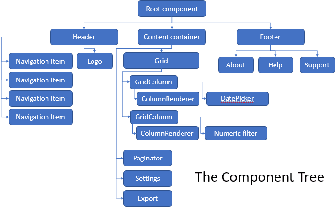
</p>

Components are the building blocks of any React app and a typical React app will have many of these. Simply put, a component is a JavaScript class or function that optionally accepts inputs i.e. properties(props) and returns a React element that describes how a section of the UI (User Interface) should appear.

A react application is made of multiple components, each responsible for rendering a small, reusable piece of HTML. Components can be nested within other components to allow complex applications to be built out of simple building blocks. A component may also maintain internal state – for example, a TabList component may store a variable corresponding to the currently open tab.

*Example*: Class Component

```js
class Welcome extends React.Component {
  render() {
    return <h1>Hello, World!</h1>
  }
}
```

<div align="right">
    <b><a href="#">↥ back to top</a></b>
</div>

## Q. ***What is difference between declarative and imperative in React.js?***

*ToDo*

<div align="right">
    <b><a href="#">↥ back to top</a></b>
</div>

## Q. ***What is the typical pattern for rendering a list of components from an array of data?***  

*ToDo*

<div align="right">
    <b><a href="#">↥ back to top</a></b>
</div>

## Q. ***How to get dynamic table header from an array in react?***

*ToDo*

<div align="right">
    <b><a href="#">↥ back to top</a></b>
</div>

## Q. ***What is the difference between Element and Component?***

*ToDo*

<div align="right">
    <b><a href="#">↥ back to top</a></b>
</div>

## Q. ***List some of the major advantages and limitations of React?***

<p align="center">
  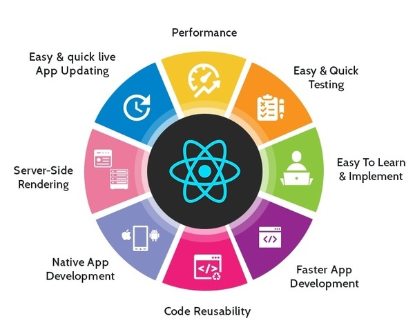
</p>

**Advantages**  

* It relies on a virtual-dom to know what is really changing in UI and will re-render only what has really changed, hence better performance wise
* JSX makes components/blocks code readable. It displays how components are plugged or combined with.
* React data binding establishes conditions for creation dynamic applications.
* Prompt rendering. Using comprises methods to minimise number of DOM operations helps to optimise updating process and accelerate it.
Testable. React native tools are offered for testing, debugging code.
* SEO-friendly. React presents the first-load experience by server side rendering and connecting event-handlers on the side of the user:
    * React.renderComponentToString is called on the server. 
    * React.renderComponent() is called on the client side. 
    * React preserves markup rendered on the server side, attaches event handlers.  

**Limitations**  

* Learning curve. Being not full-featured framework it is requered in-depth knowledge for integration user interface free library into MVC framework.
* View-orientedness is one of the cons of ReactJS. It should be found 'Model' and 'Controller' to resolve 'View' problem.
* Not using isomorphic approach to exploit application leads to search engines indexing problems.

<div align="right">
    <b><a href="#">↥ back to top</a></b>
</div>

## Q. ***What is JSX and how JSX can help applications in React.js?***

JSX allows us to write HTML elements in JavaScript and place them in the DOM without any `createElement()` or `appendChild()` methods. JSX converts HTML tags into react elements. React uses JSX for templating instead of regular JavaScript. It is not necessary to use it, however, following are some pros that come with it.

* It is faster because it performs optimization while compiling code to JavaScript.
* It is also type-safe and most of the errors can be caught during compilation.
* It makes it easier and faster to write templates.

*Example*:

```js
import React from 'react'

class App extends React.Component {

   render() {
      return (
         <div>
            Hello World!
         </div>
      )
   }
}
export default App
```

**JSX is a JavaScript Expression**

JSX expressions are JavaScript expressions too. When compiled, they actually become regular JavaScript objects. For instance, the code below:

```js
const hello = <h1 className = "greet"> Hello World </h1>
```

will be compiled to

```js
const hello = React.createElement {
    type: "h1",
    props: {
      className: "greet",  
      children: "Hello World"
    }
}
```

Since they are compiled to objects, JSX can be used wherever a regular JavaScript expression can be used.

<div align="right">
    <b><a href="#">↥ back to top</a></b>
</div>

## Q. ***What is ReactDOM?***

`ReactDOM()` is a package that provides DOM specific methods that can be used at the top level of a web app to enable an efficient way of managing DOM elements of the web page. ReactDOM provides the developers with an API containing following methods and a few more.

* `render()`
* `findDOMNode()`
* `unmountComponentAtNode()`
* `hydrate()`
* `createPortal()`

Before **v0.14** React Dom was part of React. The reason React and ReactDOM were split into two libraries was due to the arrival of React Native. React contains functionality utilised in web and mobile apps. ReactDOM functionality is utilised only in web apps.

ReactDOM uses observables thus provides an efficient way of DOM handling. ReactDOM can be used in both client-side and server-side.

*Example*:

```js
// index.js

import React from 'react'
import ReactDOM from 'react-dom'
import App from './App/App'

ReactDOM.render(
  <React.StrictMode>
    <App />
  </React.StrictMode>,
  document.getElementById('root')
)
```

To use the ReactDOM in any React web app we must first import ReactDOM from the react-dom package by using the following code snippet:

```js
import ReactDOM from 'react-dom'
```
**a.) ReactDOM.render() Function**  

This function is used to render a single React Component or several Components wrapped together in a Component or a div element. This function uses the efficient methods of React for updating the DOM by being able to change only a subtree, efficient diff methods etc.
This function returns a reference to the component or null if a stateless component was rendered.

`ReactDOM.render()` replaces the child of the given container if any. It uses highly efficient diff algorithm and can modify any subtree of the DOM.

```jsx
ReactDOM.render(element, container, callback)
```

* **element**: This parameter expects a JSX expression or a React Element to be rendered.
* **container**: This parameter expects the container in which the element has to be rendered.
* **callback**: This is an optional parameter that expects a function that is to be executed once the render is complete.

**b.) findDOMNode() Function**  

This function is generally used to get the DOM node where a particular React component was rendered. This method is very less used as the following can be done adding a ref attribute to each component itself.

`findDOMNode()` function can only be implemented upon mounted components thus Functional components can not be used in findDOMNode() method.

```jsx
ReactDOM.findDOMNode(component)
```

This method takes a single parameter component which expects a React Component to be searched in the Browser DOM. This function returns the DOM node where the component was rendered on success otherwise null.

**c.) unmountComponentAtNode() Function**  

This function is used to unmount or remove the React Component that was rendered to a particular container. 

```jsx
ReactDOM.unmountComponentAtNode(container)
```
This method takes a single parameter container which expects the DOM container from which the React component has to be removed. This function returns true on success otherwise false.

**d.) hydrate() Function**  

This method is equivalent to the render() method but is implemented while using server-side rendering.

```jsx
ReactDOM.hydrate(element, container, callback)
```

* **element**: This parameter expects a JSX expression or a React Component to be rendered.
* **container**: This parameter expects the container in which the element has to be rendered.
* **callback**: This is an optional parameter that expects a function that is to be executed once the render is complete.

This function attempts to attach event listeners to the existing markup and returns a reference to the component or null if a stateless component was rendered.

**e.) createPortal() Function**  

Usually, when an element is returned from a component\'s render method, it\'s mounted on the DOM as a child of the nearest parent node which in some cases may not be desired. Portals allow us to render a component into a DOM node that resides outside the current DOM hierarchy of the parent component.

```jsx
ReactDOM.createPortal(child, container)
```

* **child**: This parameter expects a JSX expression or a React Component to be rendered.
* **container**: This parameter expects the container in which the element has to be rendered.

<div align="right">
    <b><a href="#">↥ back to top</a></b>
</div>

## Q. ***What is the use of react-dom package?***

*ToDo*

<div align="right">
    <b><a href="#">↥ back to top</a></b>
</div>

## Q. ***What is the purpose of render method of react-dom?***

*ToDo*

<div align="right">
    <b><a href="#">↥ back to top</a></b>
</div>

## Q. ***What is the difference between ReactDOM and React?***

```js
import React from 'react' /* importing react */
import ReactDOM from 'react-dom' /* importing react-dom */

class MyComponent extends React.Component {

  render() {
    return <div>Hello World</div>
  }
})

ReactDOM.render(<MyComponent />, node)

```
**React** package contains: `React.createElement()`, `React.createClass()`, `React.Component()`, `React.PropTypes()`, `React.Children()`

**ReactDOM** package contains: `ReactDOM.render()`, `ReactDOM.unmountComponentAtNode()`, `ReactDOM.findDOMNode()`, and react-dom/server that including: `ReactDOMServer.renderToString()` and `ReactDOMServer.renderToStaticMarkup()`.

The ReactDOM module exposes DOM-specific methods, while React has the core tools intended to be shared by React on different platforms (e.g. React Native).

<div align="right">
    <b><a href="#">↥ back to top</a></b>
</div>

## Q. ***How to write comments in React?***

*ToDo*

<div align="right">
    <b><a href="#">↥ back to top</a></b>
</div>

## Q. ***What are the differences between a class component and functional component?***

**Functional Components**  

* Functional components are basic JavaScript functions. These are typically arrow functions but can also be created with the regular  function keyword.
* Sometimes referred to as `stateless` components as they simply accept data and display them in some form; that is they are mainly responsible for rendering UI.
* React lifecycle methods (for example, `componentDidMount()`) cannot be used in functional components.
* There is no render method used in functional components.
* These are mainly responsible for UI and are typically presentational only (For example, a Button component).
* Functional components can accept and use props.
* Functional components should be favored if you do not need to make use of React state.

*Example*:
```js
const ClockUsingHooks = props => {
    const [time, setTime] = useState(new Date())

    const changeTime = () => {
        setTime(new Date())
    }

    useEffect(() => {
        const tick = setInterval(() => {
            changeTime()
        }, 1000)
        return () => clearInterval(tick)
    })
    return (
        <div className="clock">
            <h1>Hello! This is a function component clock.</h1>
            <h2>It is {time.toLocaleTimeString()}.</h2>
        </div>
    )
}

export default ClockUsingHooks
```

**Class Components**  

* Class components make use of ES6 class and extend the Component class in React.
* Sometimes called `stateful` components as they tend to implement logic and state.
* React lifecycle methods can be used inside class components (for example, `componentDidMount()`).
* We pass `props` down to class components and access them with `this.props`.
* Class-based components can have `refs` to underlying DOM nodes.
* Class-based components can use `shouldComponentUpdate()` and `PureComponent()` performance optimisation techniques.

*Example*:
```js
class ClockUsingClass extends React.Component {
    constructor(props) {
        super(props)
        this.state = { date: new Date() }
    }

    componentDidMount() {
        this.time = setInterval(() => {
            this.changeTime()
        }, 1000)
    }

    componentWillUnmount() {
        clearInterval(this.time)
    }

    changeTime() {
        this.setState({ date: new Date() })
    }

    render() {
        return (
            <div className="clock">
                <h1>Hello! This is a class component clock.</h1>
                <h2>It is {this.state.date.toLocaleTimeString()}.</h2>
            </div>
        )
    }
}

export default ClockUsingClass
```

<div align="right">
    <b><a href="#">↥ back to top</a></b>
</div>

## Q. ***What is the recommended ordering of methods in component class?***

*ToDo*

<div align="right">
    <b><a href="#">↥ back to top</a></b>
</div>

## Q. ***How do you conditionally render components?***

*ToDo*

<div align="right">
    <b><a href="#">↥ back to top</a></b>
</div>

## Q. ***What is props in React?***

Data passed in from a parent component. `props` are read-only in the child component that receives them. However, callback functions can also be passed, which can be executed inside the child to initiate an update.

*Example*:

```js
function Welcome(props) {
  return <h1>Hello, {props.name}</h1>;
}

const element = <Welcome name="World!" />;
```

**Live Demo**: [props](https://codepen.io/learning-zone/pen/mdmWgxz)

<div align="right">
    <b><a href="#">↥ back to top</a></b>
</div>

## Q. ***What is State in React?***

This is data maintained inside a component. It is local or owned by that specific component. The component itself will update the state using the `setState()` function.

*Example*:

```js
class Employee extends React.Component {
    constructor() {
        this.state = {
            id: 1,
            name: "Alex"
        }  
    }

    render() {
        return (
            <div>
              <p>{this.state.id}</p>
              <p>{this.state.name}</p>
            </div>
        )  
    }
}

export default Employee
```

<div align="right">
    <b><a href="#">↥ back to top</a></b>
</div>

## Q. ***What is the difference between state and props?***

|Props                             |State                             |
|----------------------------------|----------------------------------|
|Props are read-only.              |State changes can be asynchronous.|
|Props are immutable.              |State is mutable.                 |
|Props allow you to pass data from one component to other components as an argument.|	State holds information about the components.|
|Props can be accessed by the child component.    |State cannot be accessed by child components.|
|Props are used to communicate between components.|States can be used for rendering dynamic changes with the component.|
|Stateless component can have Props.            |Stateless components cannot have State.|
|Props make components reusable.                 |State cannot make components reusable.|
|Props are external and controlled by whatever renders the component.|The State is internal and controlled by the React Component itself.|

<div align="right">
    <b><a href="#">↥ back to top</a></b>
</div>

## Q. ***How to set state with a dynamic key name?***

*ToDo*

<div align="right">
    <b><a href="#">↥ back to top</a></b>
</div>

## Q. ***How to listen state changes in React.js?***

*ToDo*

<div align="right">
    <b><a href="#">↥ back to top</a></b>
</div>

## Q. ***How to bind methods or event handlers in JSX callbacks?***

*ToDo*

<div align="right">
    <b><a href="#">↥ back to top</a></b>
</div>

## Q. ***How to use styles in React.js?***

*ToDo*

<div align="right">
    <b><a href="#">↥ back to top</a></b>
</div>

## Q. ***How would you create Higher Order Components (HOCs) in React.js?***

<p align="center">
  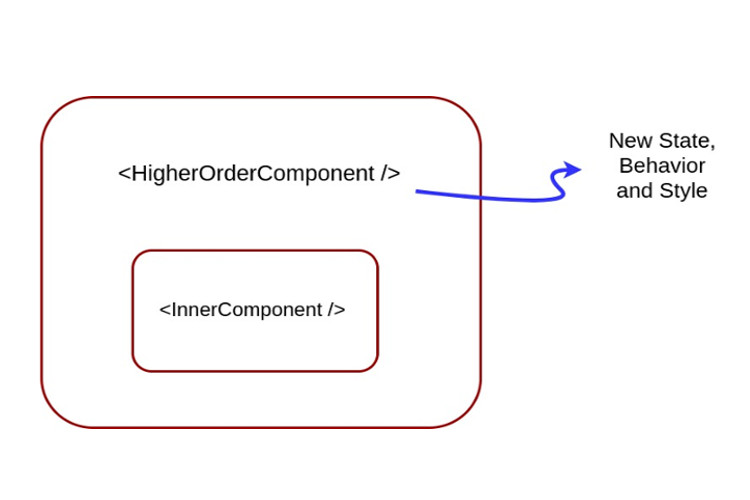
</p>

A higher-order component is a function that takes a component and returns a new component. A higher-order component (HOC) is the advanced technique in React.js for reusing a component logic. Higher-Order Components are not part of the React API. They are the pattern that emerges from React\'s compositional nature. The component transforms props into UI, and a higher-order component converts a component into another component. The examples of HOCs are Redux\'s connect and Relay\'s createContainer.

```js
// HOC.js

import React, {Component} from 'react'

export default function Hoc(HocComponent){
    return class extends Component{
        render(){
            return (
                <div>
                    <HocComponent></HocComponent>
                </div>

            )
        }
    }
}
```

```js
// App.js

import React, { Component } from 'react'
import Hoc from './HOC'

class App extends Component {
  
  render() {
    return (
      <div>
        Higher-Order Component Example!
      </div>
    )
  }
}
App = Hoc(App)
export default App
```

*Notes*

* We do not modify or mutate components. We create new ones.
* A HOC is used to compose components for code reuse.
* A HOC is a pure function. It has no side effects, returning only a new component.

<div align="right">
    <b><a href="#">↥ back to top</a></b>
</div>

## Q. ***How to use decorators in React?***

*ToDo*

<div align="right">
    <b><a href="#">↥ back to top</a></b>
</div>

## Q. ***What are Pure Components in React?***

**Pure Components** in React are the components which do not re-renders when the value of state and props has been updated with the same values. If the value of the previous state or props and the new state or props is the same, the component is not re-rendered. Pure Components restricts the re-rendering ensuring the higher performance of the Component

**Features of React Pure Components**

* Prevents re-rendering of Component if props or state is the same
* Takes care of `shouldComponentUpdate()` implicitly
* `State()` and `Props` are Shallow Compared
* Pure Components are more performant in certain cases

Similar to Pure Functions in JavaScript, a React component is considered a Pure Component if it renders the same output for the same state and props value. React provides the `PureComponent` base class for these class components. Class components that extend the `React.PureComponent` class are treated as pure components.

It is the same as Component except that Pure Components take care of `shouldComponentUpdate()` by itself, it does the *shallow comparison* on the state and props data. If the previous state and props data is the same as the next props or state, the component is not Re-rendered.

React Components re-renders in the following scenarios:

1. `setState()` is called in Component
1. `props` values are updated
1. `this.forceUpdate()` is called

In the case of Pure Components, the React components do not re-render blindly without considering the updated values of React `props` and `state`. If updated values are the same as previous values, render is not triggered.

**Stateless Component**

```js
import { pure } from 'recompose'

export default pure ( (props) => {
   return 'Stateless Component Example'
})
```

**Stateful Component**

```js
import React, { PureComponent } from 'react'

export default class Test extends PureComponent{
   render() {
      return 'Stateful Component Example'
   }
}
```

*Example*:

```js
class Test extends React.PureComponent {
   constructor(props) {
      super(props)
      this.state = {
         taskList: [
            { title: 'Excercise'},
            { title: 'Cooking'},
            { title: 'Reacting'},
         ]
      }
   }
   componentDidMount() {
      setInterval(() => {
         this.setState((oldState) => {
            return { taskList: [...oldState.taskList] }
         })
      }, 1000)
   }
   render() {
      console.log("TaskList render() called")
      return (<div>
         {this.state.taskList.map((task, i) => {
            return (<Task
               key={i}
               title={task.title}
            />)
         })}
      </div>)
   }
}
class Task extends React.Component {
   render() {
      console.log("task added")
      return (<div>
         {this.props.title}
      </div>)
   }
}
ReactDOM.render(<Test />, document.getElementById('app'))
```

<div align="right">
    <b><a href="#">↥ back to top</a></b>
</div>

## Q. ***Why to use PureComponent? When to use PureComponent over Component?***

Both functional-based and class-based components have the same downside: they always re-render when their parent component re-renders even if the props do not change.

Also, class-based components always re-render when its state is updated (`this.setState()` is called) even if the new state is equal to the old state. Moreover, when a parent component re-renders, all of its children are also re-rendered, and their children too, and so on.

That behaviour may mean a lot of wasted re-renderings. Indeed, if our component only depends on its props and state, then it shouldn’t re-render if neither of them changed, no matter what happened to its parent component.

That is precisely what PureComponent does - it stops the vicious re-rendering cycle. PureComponent does not re-render unless its props and state change.

**When to use PureComponent**  

* We want to avoid re-rendering cycles of component when its props and state are not changed, and
* The state and props of component are immutable, and
* We do not plan to implement own `shouldComponentUpdate()` lifecycle method.

On the other hand, we should not use `PureComponent()` as a base component if:

* props or state are not immutable, or
* Plan to implement own `shouldComponentUpdate()` lifecycle method.

<div align="right">
    <b><a href="#">↥ back to top</a></b>
</div>

## Q. ***How can I force a component to re-render with hooks in React?***

*ToDo*

<div align="right">
    <b><a href="#">↥ back to top</a></b>
</div>

## Q. ***How Virtual-DOM is more efficient than Dirty checking?***

<p align="center">
  
</p>

**React Virtual DOM**  

In React, Each time the DOM updates or data of page changes, a new Virtual DOM representation of the user interface is made. It is just a lightweight copy or DOM.

Virtual DOM in React has almost same properties like a real DOM, but it can not directly change the content on the page. Working with Virtual DOM is faster as it does not update anything on the screen at the same time. In a simple way, Working with Virtual DOM is like working with a copy of real DOM nothing more than that. 

Updating virtual DOM in ReactJS is faster because ReactJS uses

1. It is efficient diff algorithm.
1. It batched update operations
1. It efficient update of sub tree only
1. It uses observable instead of dirty checking to detect change

**How Virtual DOM works in React**  

When we render a JSX element, each virtual DOM updates. This approach updates everything very quickly. Once the Virtual DOM updates, React matches the virtual DOM with a virtual DOM copy that was taken just before the update. By Matching the new virtual DOM with pre-updated version, React calculates exactly which virtual DOM has changed. This entire process is called **diffing**.

When React knows which virtual DOM has changed, then React updated those objects. and only those object, in the real DOM. React only updates the necessary parts of the DOM. React\'s reputation for performance comes largely from this innovation.

In brief, here is what happens when we update the DOM in React:

1. The entire virtual DOM gets updated.
1. The virtual DOM gets compared to what it looked like before you updated it. React matches out which objects have changed.
1. The changed objects and the changed objects only get updated on the real DOM.
1. Changes on the real DOM cause the screen to change finally.

<div align="right">
    <b><a href="#">↥ back to top</a></b>
</div>

## Q. ***Why is setState() in React async instead of sync?***

Even if state is updated synchronously, props are not, it means we do not know props until it re-renders the parent component. The objects provided by React (`state`, `props`, `refs`) are consistent with each other and if you introduce a synchronous setState you could introduce some bugs.

`setState()` does not immediately mutate `this.state()` but creates a pending state transition. Accessing `this.state()` after calling this method can potentially return the existing value. There is no guarantee of synchronous operation of calls to `setState()` and calls may be batched for performance gains.

This is because setState() alters the state and causes rerendering. This can be an expensive operation and making it synchronous might leave the browser unresponsive. Thus the setState() calls are asynchronous as well as batched for better UI experience and performance.

<div align="right">
    <b><a href="#">↥ back to top</a></b>
</div>

## Q. ***What are controlled and uncontrolled components in React?***

In a controlled component, form data is handled by a React component. The alternative is uncontrolled components, where form data is handled by the DOM itself.

**Controlled Components**  

In a controlled component, the form data is handled by the state within the component. The state within the component serves as “the single source of truth” for the input elements that are rendered by the component.

*Example*:

```js
import React, { Component } from 'react'

class App extends Component {
    state = {
        message: ''
    }
    updateMessage = (newText) => {
        console.log(newText)
        this.setState(() => ({
            message: newText
        }))
    }
    render() {
        return (
            <div className="App">
                <div className="container">
                    <input type="text"
                        placeholder="Your message here.."
                        value={this.state.message}
                        onChange={(event) => this.updateMessage(event.target.value)}
                    />
                    <p>the message is: {this.state.message}</p>
                </div>
            </div>
        )
    }
}

export default App
```

**Uncontrolled Components**  

Uncontrolled components act more like traditional HTML form elements. The data for each input element is stored in the DOM, not in the component. Instead of writing an event handler for all of your state updates, It uses `ref` to retrieve values from the DOM. `Refs` provide a way to access DOM nodes or React elements created in the render method.

```js
import React, { Component } from 'react'

class App extends Component {

    constructor(props){
        super(props)
        this.handleChange = this.handleChange.bind(this)
        this.input = React.createRef()
    }
    handleChange = (newText) => {
        console.log(newText)
    }
    render() {
        return (
            <div className="App">
                <div className="container">
                    <input type="text"
                        placeholder="Your message here.."
                        ref={this.input}
                        onChange={(event) => this.handleChange(event.target.value)}
                    />
                </div>
            </div>
        )
    }
}
export default App
```

<div align="right">
    <b><a href="#">↥ back to top</a></b>
</div>

## Q. ***Why do class methods need to be bound to a class instance?***

*ToDo*

<div align="right">
    <b><a href="#">↥ back to top</a></b>
</div>

## Q. ***What is React.cloneElement?***

The `React.cloneElement()` function returns a copy of a specified element. Additional props and children can be passed on in the function. This function is used when a parent component wants to add or modify the prop(s) of its children.

```js
React.cloneElement(element, [props], [...children])
```
The react.cloneElement() method accepts three arguments.

* element: Element we want to clone.
* props: props we need to pass to the cloned element.
* children: we can also pass children to the cloned element (passing new children replaces the old children).

Example
```js
import React from 'react'

export default class App extends React.Component {

  // rendering the parent and child component
  render() {
    return (
      <ParentComp>
        <MyButton/>
        <br></br>
        <MyButton/>
      </ParentComp>
    )
  }
}
// The parent component
class ParentComp extends React.Component {
  render() {
    // The new prop to the added.
    let newProp = 'red'
      // Looping over the parent's entire children,
      // cloning each child, adding a new prop.
    return (
      <div>
        {React.Children.map(this.props.children,
          child => {
            return React.cloneElement(child,
            {newProp}, null)
        })}
      </div>
    )
  }
}
// The child component
class MyButton extends React.Component {
  render() {
    return <button style =
    {{ color: this.props.newProp }}>
    Hello World!</button>
  }
}
```

<div align="right">
    <b><a href="#">↥ back to top</a></b>
</div>

## Q. ***When we should use React.cloneElement vs this.props.children?***

The `React.cloneElement()` works if child is a single React element.

For almost everything `{this.props.children}` is used. Cloning is useful in some more advanced scenarios, where a parent sends in an element and the child component needs to change some props on that element or add things like `ref` for accessing the actual DOM element.

**React.Children**  

Since `{this.props.children}` can have one element, multiple elements, or none at all, its value is respectively a single child node, an array of child nodes or undefined. Sometimes, we want to transform our children before rendering them — for example, to add additional props to every child. If we wanted to do that, we\'d have to take the possible types of `this.props.children` into account. For example, if there is only one child, we can not map it.

*Example*:

```js
class Example extends React.Component {

  render() {
    return <div>
      <div>Children ({this.props.children.length}):</div>
      {this.props.children}
    </div>
  }
}

class Widget extends React.Component {

  render() {
    return <div>
      <div>First <code>Example</code>:</div>
      <Example>
        <div>1</div>
        <div>2</div>
        <div>3</div>
      </Example>
      <div>Second <code>Example</code> with different children:</div>
      <Example>
        <div>A</div>
        <div>B</div>
      </Example>
    </div>
  }
}
```

Output

```
First Example:
Children (3):
1
2
3
Second Example with different children:
Children (2):
A
B
```

`children` is a special property of React components which contains any child elements defined within the component, e.g. the `<div>` inside Example above. `{this.props.children}` includes those children in the rendered result.

<div align="right">
    <b><a href="#">↥ back to top</a></b>
</div>

## Q. ***How to pass props to {this.props.children}?***

*ToDo*

<div align="right">
    <b><a href="#">↥ back to top</a></b>
</div>

## Q. ***Why does not this.props.children.map work?***

*ToDo*

<div align="right">
    <b><a href="#">↥ back to top</a></b>
</div>

## Q. ***What is the second argument that can optionally be passed to setState and what is its purpose?***

A callback function which will be invoked when `setState()` has finished and the component is re-rendered.

The `setState()` is asynchronous, which is why it takes in a second callback function. Typically it\'s best to use another lifecycle method rather than relying on this callback function, but it is good to know it exists.

```js
this.setState(
  { username: 'Alex' },
  () => console.log('setState has finished and the component has re-rendered.')
)
```
The `setState()` will always lead to a re-render unless `shouldComponentUpdate()` returns false. To avoid unnecessary renders, calling `setState()` only when the new state differs from the previous state makes sense and can avoid calling `setState()` in an infinite loop within certain lifecycle methods like `componentDidUpdate()`.

<div align="right">
    <b><a href="#">↥ back to top</a></b>
</div>

## Q. ***What is useState() in React?***

The `useState()` is a Hook that allows to have state variables in functional components.

```js
import React, { useState } from 'react'

const App = () => {
  const [count, setCount] = React.useState(0)

  const handleIncrease = () => {
    setCount(count + 1)
  }

  const handleDecrease = () => {
    setCount(count - 1)
  }

  return (
    <div>
      Count: {count}
      <hr />
      <div>
        <button type="button" onClick={handleIncrease}>
          Increase
        </button>
        <button type="button" onClick={handleDecrease}>
          Decrease
        </button>
      </div>
    </div>
  )
}
```

The useState() function takes as argument a value for the initial state. In this case, the count starts out with 0. In addition, the hook returns an array of two values: **count** and **setCount**. It\'s up to you to name the two values, because they are `destructured from the returned array` where renaming is allowed.

<div align="right">
    <b><a href="#">↥ back to top</a></b>
</div>

## Q. ***How to get acces to a child useState in React?***

*ToDo*

<div align="right">
    <b><a href="#">↥ back to top</a></b>
</div>

## Q. ***Can you force a React component to rerender without calling setState?***

*ToDo*

<div align="right">
    <b><a href="#">↥ back to top</a></b>
</div>

## Q. ***What is useReducer() in React?***

It accepts a reducer function with the application initial state, returns the current application state, then dispatches a function.

Although `useState()` is a Basic Hook and `useReducer()` is an Additional Hook, `useState()` is actually implemented with `useReducer()`. This means `useReducer()` is primitive and we can use `useReducer()` for everything can do with useState(). Reducer is so powerful that it can apply for various use cases.

*Example*:

```js
import React, { useReducer } from 'react'

const initialState = 0
const reducer = (state, action) => {
  switch (action) {
    case 'increment': return state + 1
    case 'decrement': return state - 1
    case 'reset': return 0
    default: throw new Error('Unexpected action')
  }
}

const ReducerExample = () => {
  const [count, dispatch] = useReducer(reducer, initialState)
  return (
    <div>
      {count}
      <button onClick={() => dispatch('increment')}>+1</button>
      <button onClick={() => dispatch('decrement')}>-1</button>
      <button onClick={() => dispatch('reset')}>reset</button>
    </div>
  )
}

export default ReducerExample
```
Here, we first define an initialState and a reducer. When a user clicks a button, it will dispatch an action which updates the count and the updated count will be displayed. We could define as many actions as possible in the reducer, but the limitation of this pattern is that actions are finite.

<div align="right">
    <b><a href="#">↥ back to top</a></b>
</div>

## Q. ***What is Context API in React?***

<p align="center">
  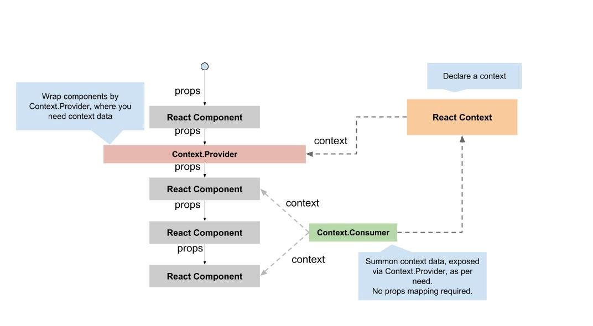
</p>

The React Context API allows to easily access data at different levels of the component tree, without having to pass data down through `props`.

```js
import React from "react"
import ReactDOM from "react-dom"

// Create a Context
const NumberContext = React.createContext()
// It returns an object with 2 values:
// { Provider, Consumer }

function App() {
  // Use the Provider to make a value available to all
  // children and grandchildren
  return (
    <NumberContext.Provider value={10}>
      <div>
        <Display />
      </div>
    </NumberContext.Provider>
  )
}

function Display() {
  const value = useContext(NumberContext)
  return <div>The answer is {value}.</div>
}
```

<div align="right">
    <b><a href="#">↥ back to top</a></b>
</div>

## Q. ***How to update React Context from inside a child component?***

*ToDo*

<div align="right">
    <b><a href="#">↥ back to top</a></b>
</div>

## Q. ***How to use context api inside react-router-dom?***

*ToDo*

<div align="right">
    <b><a href="#">↥ back to top</a></b>
</div>

## Q. ***What is difference between useEffect() vs componentDidMount()?***

In react when we use class based components we get access to lifecycle methods(like componentDidMount, componentDidUpdat, etc). But when we want use a functional component and also we want to use lifecycle methods, then using useEffect() we can implement those lifecycle methods.

The `componentDidMount()` and `useEffect()` run after the mount. However useEffect() runs after the paint has been committed to the screen as opposed to before. This means we would get a flicker if needed to read from the DOM, then synchronously set state to make new UI.

The `useLayoutEffect()` was designed to have the same timing as componentDidMount(). So `useLayoutEffect(fn, [])` is a much closer match to componentDidMount() than useEffect(fn, []) -- at least from a timing standpoint.

```js
//Using a class based component.
import React, { Component } from 'react'

export default class SampleComponent extends Component {
  componentDidMount() {
    // code to run on component mount
  }
render() {
    return (<div>foo</div>)
  }
}

//Using a functional component
import React, { useEffect } from 'react'

const SampleComponent = () => {
  useEffect(() => {
    // code to run on component mount
  }, [])
return (<div>foo</div>)
}
export SampleComponent
```

**useEffect() Limitations**

When useEffect() is used to get data from server.

* The first argument is a callback that will be fired after browser layout and paint. Therefore it does not block the painting process of the browser.
* The second argument is an array of values (usually props).
* If any of the value in the array changes, the callback will be fired after every render.
* When it is not present, the callback will always be fired after every render.
* When it is an empty list, the callback will only be fired once, similar to componentDidMount.

<div align="right">
    <b><a href="#">↥ back to top</a></b>
</div>

## Q. ***How to compare oldValues and newValues on React Hooks useEffect?***

*ToDo*

<div align="right">
    <b><a href="#">↥ back to top</a></b>
</div>

## Q. ***What do you understand by refs in React?***

`Refs` provide a way to access DOM nodes or React elements created in the render method. React Refs are a useful feature that act as a means to reference a DOM element or a class component from within a parent component.

Refs also provide some flexibility for referencing elements within a child component from a parent component, in the form of ref forwarding.

*Example*:

```javascript
class App extends React.Component {
    constructor(props) {
      super(props)
      // create a ref to store the textInput DOM element
      this.textInput = React.createRef()
      this.state = {
        value: ''
      }
    }
  
  // Set the state for the ref
  handleSubmit = e => {
    e.preventDefault()
    this.setState({ value: this.textInput.current.value})
  }

  render() {
    return (
      <div>
        <h1>React Ref - createRef</h1>
         {/** This is what will update **/}
        <h3>Value: {this.state.value}</h3>
        <form onSubmit={this.handleSubmit}>
          {/** Call the ref on <input> so we can use it to update the <h3> value **/}
          <input type="text" ref={this.textInput} />
          <button>Submit</button>
        </form>
      </div>
    )
  }
}
```

**When to Use Refs**  

* Managing focus, text selection, or media playback.
* Triggering imperative animations.
* Integrating with third-party DOM libraries.

**When not to use refs**  

* Should not be used with functional components because they dont have instances.
* Not to be used on things that can be done declaritvely.

<div align="right">
    <b><a href="#">↥ back to top</a></b>
</div>

## Q. ***How can I use multiple refs for an array of elements with hooks?***

*ToDo*

<div align="right">
    <b><a href="#">↥ back to top</a></b>
</div>

## Q. ***What is the difference between `useRef` and `createRef`?***

*ToDo*

<div align="right">
    <b><a href="#">↥ back to top</a></b>
</div>

## Q. ***What will happen if you use setState() in constructor?***

When we use `setState()`, then apart from assigning to the object state react also rerenders the component and all it\'s children. Which we don\'t need in the constructor, since the component hasn\'t been rendered anyway.

Inside constructor uses `this.state = {}` directly, other places use `this.setState({ })`

*Example*:

```js
import React, { Component } from 'react'

class Food extends Component {

  constructor(props) {
    super(props)

    this.state = {
      fruits: ['apple', 'orange'],
      count: 0
    }
  }
  render() {
    return (
      <div className = "container">
        <h2> Hello!!!</h2>
        <p> I have {this.state.count} fruit(s)</p>
      </div>
    )
  }
}
```

<div align="right">
    <b><a href="#">↥ back to top</a></b>
</div>

## Q. ***What is the difference between DOM and virtual DOM?***

**DOM**

DOM stands for "Document Object Model". The HTML DOM provides an interface (API) to traverse and modify the nodes. It contains methods like `getElementById()` or `removeChild()`.

The DOM is represented as a tree data structure. Because of that, the changes and updates to the DOM are fast. But after the change, the updated element and it\'s children have to be re-rendered to update the application UI. The re-rendering or re-painting of the UI is what makes it slow.

**Virtual DOM**  

The virtual DOM is only a virtual representation of the DOM. Everytime the state of our application changes, the virtual DOM gets updated instead of the real DOM.

The Virtual DOM is an abstraction of the HTML DOM. It is lightweight and detached from the browser-specific implementation details. Since the DOM itself was already an abstraction, the virtual DOM is, in fact, an abstraction of an abstraction.

**Why Virtual DOM is faster**

When new elements are added to the UI, a virtual DOM, which is represented as a tree is created. Each element is a node on this tree. If the state of any of these elements changes, a new virtual DOM tree is created. This tree is then compared or “diffed” with the previous virtual DOM tree.

Once this is done, the virtual DOM calculates the best possible method to make these changes to the real DOM. This ensures that there are minimal operations on the real DOM. Hence, reducing the performance cost of updating the real DOM.

**Pros of Virtual DOM**  

* Updates process is optimized and accelerated.
* JSX makes components/blocks code readable.
* React data binding establishes conditions for creation dynamic applications.
* Virtual DOM is ideal for mobile first applications.
* Prompt rendering. Using comprises methods to minimize number of DOM operations helps to optimize updating process and accelerate it.

<p align="center">
  
</p>

<div align="right">
    <b><a href="#">↥ back to top</a></b>
</div>

## Q. ***When should we use arrow functions with React?***

**Arrows prevent `this` bugs**

Arrow functions don not redefine the value of `this` within their function body. This makes it a lot easier to predict their behavior when passed as callbacks, and prevents bugs caused by use of this within callbacks. Using inline arrow functions in function components is a good way to achieve some decoupling.

*Example*:

```js
import React from 'react'
import ReactDOM from 'react-dom'

class Button extends React.Component {
  render() {
    return (
      <button onClick={this.handleClick} style={this.state}>
        Set background to red
      </button>
    )
  }

  handleClick = () => {
    this.setState({ backgroundColor: 'red' })
  }
}

ReactDOM.render(
  <Button />,
  document.getElementById('root')
)
```
1. When we use `this` it generates a new function on every render, which will obviously have a new reference.
2. If the component we pass this generated function to is extending `PureComponent()`, it will not be able to bail out on rerendering, even if the actual data has not changed.

<div align="right">
    <b><a href="#">↥ back to top</a></b>
</div>

## Q. ***Differentiate between stateful and stateless components?***

Stateful and stateless components have many different names. They are also known as:

– Container vs Presentational components  
– Smart vs Dumb components  

The literal difference is that one has state, and the other does not. That means the stateful components are keeping track of changing data, while stateless components print out what is given to them via props, or they always render the same thing.

*Example*: Stateful/Container/Smart component

```js
class Main extends Component {
 constructor() {
   super()
   this.state = {
     books: []
   }
 }
 render() {
   <BooksList books={this.state.books} />
 }
}
```

*Example*: Stateless/Presentational/Dumb component

```js
const BooksList = ({books}) => {
 return (
   <ul>
     {books.map(book => {
       return <li>book</li>
     })}
   </ul>
 )
}
```
**Functional Component or Stateless component**  

* Functional component is like pure function in JavaScript.
* Functional component is also called as a stateless component.
* The functional component only receives props from parent component and return you JSX elements.
* The functional component doesn’t play with any lifecycle methods of React and doesn’t play with the component state.

**Class component or statefull component**  

* React class component is called as a stateful component.
* Stateful component plays with all life cycle methods of React.
* This component will modify state.

**When would you use a stateless component**

* When you just need to present the props
* When you do not need a state, or any internal variables
* When creating element does not need to be interactive
* When you want reusable code

**When would you use a stateful component?**  

* When building element that accepts user input or element that is interactive on page
* When dependent on state for rendering, such as, fetching data before rendering
* When dependent on any data that cannot be passed down as props

<div align="right">
    <b><a href="#">↥ back to top</a></b>
</div>

## Q. ***Can you force a React component to rerender without calling setState?***

*ToDo*

<div align="right">
    <b><a href="#">↥ back to top</a></b>
</div>

## Q. ***What are the different phases of React component lifecycle?***

<p align="center">
  
</p>

React provides several methods that notify us when certain stage of this process occurs. These methods are called the component lifecycle methods and they are invoked in a predictable order. The lifecycle of the component is divided into four phases.

**1. Mounting**  

These methods are called in the following order when an instance of a component is being created and inserted into the DOM:

* `constructor()`
* `getDerivedStateFromProps()`
* `render()`
* `componentDidMount()`

**constructor**  

The `constructor()` method is called before anything else, when the component is initiated, and it is the natural place to set up the initial state and other initial values.

The `constructor()` method is called with the `props`, as arguments, and we should always start by calling the `super(props)` before anything else, this will initiate the parent\'s constructor method and allows the component to inherit methods from its parent (`React.Component`).

**getDerivedStateFromProps**

The `getDerivedStateFromProps()` method is called right before rendering the element(s) in the DOM. It takes state as an argument, and returns an object with changes to the state.

*Example*:

```js
class Color extends React.Component {

  constructor(props) {
    super(props)
    this.state = {color: "red"}
  }
  static getDerivedStateFromProps(props, state) {
    return {color: props.favcol }
  }
  render() {
    return (
      <h1>My Favorite Color is {this.state.color}</h1>
    )
  }
}

ReactDOM.render(<Color favcol="yellow"/>, document.getElementById('root'))
```

**render()**

The render() method is required, and is the method that actual outputs HTML to the DOM.

**componentDidMount()**  

The `componentDidMount()` method is called after the component is rendered.

**2. Updating**  

The next phase in the lifecycle is when a component is updated. A component is updated whenever there is a change in the component\'s state or props.

React has five built-in methods that gets called, in this order, when a component is updated:

* `getDerivedStateFromProps()`
* `shouldComponentUpdate()`
* `render()`
* `getSnapshotBeforeUpdate()`
* `componentDidUpdate()`

**getDerivedStateFromProps**  

This is the first method that is called when a component gets updated. This is still the natural place to set the state object based on the initial props.

*Example*:

```js
class Color extends React.Component {

  constructor(props) {
    super(props)
    this.state = {color: "red"}
  }
  static getDerivedStateFromProps(props, state) {
    return {color: props.favcol }
  }
  changeColor = () => {
    this.setState({color: "blue"})
  }
  render() {
    return (
      <div>
      <h1>My Favorite Color is {this.state.color}</h1>
      <button type="button" onClick={this.changeColor}>Change color</button>
      </div>
    )
  }
}

ReactDOM.render(<Color favcol="yellow"/>, document.getElementById('root'))
```

**shouldComponentUpdate**

In the `shouldComponentUpdate()` method you can return a Boolean value that specifies whether React should continue with the rendering or not. The default value is `true`.

```js
class Color extends React.Component {

  constructor(props) {
    super(props)
    this.state = {color: "red"}
  }
  shouldComponentUpdate() {
    return false
  }
  changeColor = () => {
    this.setState({color: "blue"})
  }
  render() {
    return (
      <div>
      <h1>My Favorite Color is {this.state.color}</h1>
      <button type="button" onClick={this.changeColor}>Change color</button>
      </div>
    )
  }
}

ReactDOM.render(<Color />, document.getElementById('root'))
```

**render()**

The `render()` method is of course called when a component gets updated, it has to re-render the HTML to the DOM, with the new changes.

**getSnapshotBeforeUpdate**

In the `getSnapshotBeforeUpdate()` method we have access to the `props` and `state` before the update, meaning that even after the update, we can check what the values were before the update.

If the `getSnapshotBeforeUpdate()` method is present, we should also include the `componentDidUpdate()` method, otherwise it will throw an error.

*Example*:

```js
class Color extends React.Component {

  constructor(props) {
    super(props)
    this.state = {color: "red"}
  }
  componentDidMount() {
    setTimeout(() => {
      this.setState({color: "yellow"})
    }, 1000)
  }
  getSnapshotBeforeUpdate(prevProps, prevState) {
    document.getElementById("div1").innerHTML =
    "Before the update, the favorite was " + prevState.color
  }
  componentDidUpdate() {
    document.getElementById("div2").innerHTML =
    "The updated favorite is " + this.state.color
  }
  render() {
    return (
      <div>
        <h1>My Favorite Color is {this.state.color}</h1>
        <div id="div1"></div>
        <div id="div2"></div>
      </div>
    )
  }
}

ReactDOM.render(<Color />, document.getElementById('root'))
```

**componentDidUpdate**  

The `componentDidUpdate()` method is called after the component is updated in the DOM.

*Example*:

```js
class Color extends React.Component {
  constructor(props) {
    super(props)
    this.state = {color: "red"}
  }
  componentDidMount() {
    setTimeout(() => {
      this.setState({color: "yellow"})
    }, 1000)
  }
  componentDidUpdate() {
    document.getElementById("mydiv").innerHTML =
    "The updated favorite is " + this.state.color
  }
  render() {
    return (
      <div>
      <h1>My Favorite Color is {this.state.color}</h1>
      <div id="mydiv"></div>
      </div>
    )
  }
}

ReactDOM.render(<Color />, document.getElementById('root'))
```

**3. Unmounting**  

The next phase in the lifecycle is when a component is removed from the DOM, or unmounting as React likes to call it.

* `componentWillUnmount()`

*Example*: Click the button to delete the header

```js
class Container extends React.Component {
  constructor(props) {
    super(props)
    this.state = {show: true}
  }
  delHeader = () => {
    this.setState({show: false})
  }
  render() {
    let myheader
    if (this.state.show) {
      myheader = <Child />
    }
    return (
      <div>
      {myheader}
      <button type="button" onClick={this.delHeader}>Delete Header</button>
      </div>
    )
  }
}

class Child extends React.Component {
  componentWillUnmount() {
    alert("The component named Header is about to be unmounted.")
  }
  render() {
    return (
      <h1>Hello World!</h1>
    )
  }
}

ReactDOM.render(<Container />, document.getElementById('root'))
```

<div align="right">
    <b><a href="#">↥ back to top</a></b>
</div>

## Q. ***How to use InnerHtml in React?***

*ToDo*

<div align="right">
    <b><a href="#">↥ back to top</a></b>
</div>

## Q. ***What is the significance of keys in React?***

Keys help React identify which items have changed, are added, or are removed. Keys should be given to the elements inside the array to give the elements a stable identity.

```js
function NumberList(props) {

  const numbers = props.numbers
  const listItems = numbers.map((number) =>
    <li key={number.toString()}>
      {number}
    </li>
  )
  return (
    <ul>{listItems}</ul>
  )
}

const numbers = [1, 2, 3, 4, 5]
ReactDOM.render(
  <NumberList numbers={numbers} />,
  document.getElementById('root')
)
```

**Exceptions where it is safe to use index as key**

* If your list is static and will not change.
* The list will never be re-ordered.
* The list will not be filtered (adding/removing items from the list).
* There are no ids for the items in the list.

*Note: Using `index` as a key can lead to potential unexpected behaviour within the component.*

<div align="right">
    <b><a href="#">↥ back to top</a></b>
</div>

## Q. ***What is React Router? Why is switch keyword used in React Router v4?***

React router implements a component-based approach to routing. It provides different routing components according to the needs of the application and platform. React Router keeps your UI in sync with the URL. It has a simple API with powerful features like lazy loading, dynamic route matching, and location transition handling built right in.

```bash
npm install react-router-dom
```

```js
import React, { Component } from 'react'
import { Router, Route, Redirect, Switch } from 'react-router-dom'

import Todos from './components/Todos/Todos'
import TodosNew from './components/TodosNew/TodosNew'
import TodoShow from './components/TodoShow/TodoShow'

class Router extends Component {
    constructor(props) {
        super(props)
    }

    render() {
        return (
            <Router>
                <Switch>
                    <Route path='/todos/new' component={ TodosNew } />
                    <Route path='/todos/:id' component={ TodoShow } />
                    <Route exact path='/' component={ Todos } />
                    <Redirect from='*' to='/' />
                </Switch>
            </Router>
        )
    }
}

export default Router
```

**`< Router />`**  

The `< Router />` component wraps our main application routing. Nested within Router will be all of our `< Route />` components, which will point to all other URLs.

**`<Switch />`**

The Switch component helps us to render the components only when path matches otherwise it fallbacks to the not found component. The `<Switch>` returns only one first matching route.

**exact**

The `exact` returns any number of routes that match exactly.

<div align="right">
    <b><a href="#">↥ back to top</a></b>
</div>

## Q. ***What is the purpose of IndexRoute?***

*ToDo*

<div align="right">
    <b><a href="#">↥ back to top</a></b>
</div>

## Q. ***Explain the standard JavaScript toolchain, transpilation (via Babel or other compilers), JSX, and these items significance in recent development?***

Typically, we use build tools like Grunt, Watchify/Browserify, Broccoli, or Webpack to watch the filesystem for file events (like when you add or edit a file). After this occurs, the build tool is configured to carry out a group of sequential or parallel tasks.

The rest of the tools belong in that group of sequential or parallel tasks:

* *Style linting* - typically a linter like JSCS is used to ensure the source code is following a certain structure and style
* *Dependency Management* - for JavaScript projects, most people use other packages from npm; some plugins exist for build systems (e.g. Webpack) and compilers (e.g. Babel) that allow automatic installation of packages being imported or require()‘d
* *Transpilation* - a specific sub-genre of compilation, transpilation involves compiling code from one source version to another, only to a similar runtime level (e.g. ES6 to ES5)
* *Compilation* - specifically separate from transpiling ES6 and JSX to ES5, is the act of including assets, processing CSS files as JSON, or other mechanisms that can load and inject external assets and code into a file. In addition, there are all sorts of build steps that can analyze your code and even optimize it for you.
* *Minification and Compression* - typically part of – but not exclusively controlled by – compilation, is the act of minifying and compressing a JS file into fewer and/or smaller files
* *Source-Mapping* - another optional part of compilation is building source maps, which help identify the line in the original source code that corresponds with the line in the output code (i.e. where an error occurred)

<div align="right">
    <b><a href="#">↥ back to top</a></b>
</div>

## Q. ***How React handle or restrict Props to certain types?***

React `PropTypes` are a good way to help you catching bugs by validating data types of values passed through `props`. They also offer possibilities to flag props as mandatory or set default values.

*Example*:

```js
import React from 'react'
import PropTypes from 'prop-types'

const Person = (props) => <div>
  <h1>{props.firstName} {props.lastName}</h1>
  {props.country ? <p>Country: {props.country}</p> : null}
</div>

Person.propTypes = {
  firstName:PropTypes.string,
  lastName:PropTypes.string,
  country:PropTypes.string
}

export default Person
```

`PropTypes` define the type of a prop. So each time, a value is passed through a prop, it gets validated for it\'s type. If you pass a value through a prop with a different data type than it is specified in the PropTypes, an error message will be printed in the console of your browser.

<div align="right">
    <b><a href="#">↥ back to top</a></b>
</div>

## Q. ***What is prop drilling and how can you avoid it?***

React passes data to child components via props from top to bottom. While there are few props or child components, it is easy to manage and pass down data. But when the application grows, and want to pass data from the top level component to a 3rd or 4th level level component but we end up passing these data to components on each level of the tree. This is called **Prop-drilling**.

**Context API**  

The Context API solves some of these prop drilling problems. It let pass data to all of the components in the tree without writing them manually in each of them. Shared data can be anything: state, functions, objects, we name it, and it is accessible to all nested levels that are in the scope of the context.

*Example*:

```js
import React from "react"
import ReactDOM from "react-dom"

// Create a Context
const NumberContext = React.createContext()
// It returns an object with 2 values:
// { Provider, Consumer }

function App() {
  // Use the Provider to make a value available to all
  // children and grandchildren
  return (
    <NumberContext.Provider value={10}>
      <div>
        <Display />
      </div>
    </NumberContext.Provider>
  )
}

function Display() {
  const value = useContext(NumberContext)
  return <div>The answer is {value}.</div>
}
```

<div align="right">
    <b><a href="#">↥ back to top</a></b>
</div>

## Q. ***If you wanted a component to perform an action only once when the component initially rendered - how would you achieve this in react?***

The `componentDidMount()` lifecycle hook can be used with class components.
```js
class Homepage extends React.Component {
  componentDidMount() {
    trackPageView('Homepage')
  }
  render() {
    return <div>Homepage</div>
  }
}
```
Any actions defined within a `componentDidMount()` lifecycle hook are called only once when the component is first mounted.

The `useEffect()` hook can be used with function components.
```js
const Homepage = () => {
  useEffect(() => {
    trackPageView('Homepage')
  }, [])
  
  return <div>Homepage</div>
}
```
The `useEffect()` hook is more flexible than the lifecycle methods used for class components. It receives two parameters:

* The first parameter it takes is a callback function to be executed.
* The optional second parameter it takes is an array containing any variables that are to be tracked.

The value passed as the second argument controls when the callback is executed:

* If the second parameter is undefined, the callback is executed every time that the component is rendered.
* If the second parameter contains an array of variables, then the callback will be executed as part of the first render cycle and will be executed again each time an item in the array is modified.
* If the second parameter contains an empty array, the callback will be executed only once as part of the first render cycle. The  example above shows how passing an empty array can result in similar behaviour to the `componentDidMount()` hook within a function component.

<div align="right">
    <b><a href="#">↥ back to top</a></b>
</div>

## Q. ***How can automated tooling be used to improve the accessibility of a React application?***

There are two main categories of automated tools that can be used to identify accessibility issues:

**Static Analysis Tools**

Linting tools like `ESLint` can be used with plugins such as `eslint-plugin-jsx-a11y` to analyse React projects at a component level. Static analysis tools run very quickly, so they bring a good benefit at a low cost.

**Browser Tools**  

Browser accessibility tools such as `aXe` and `Google Lighthouse` perform automated accessibility at the app level. This can discover more real-world issues, because a browser is used to simulate the way that a user interacts with a website.

<div align="right">
    <b><a href="#">↥ back to top</a></b>
</div>

## Q. ***What is the purpose of using super constructor with props argument?***

The `super()` keyword is used to call the parent constructor. `super(props)` would pass `props` to the parent constructor.

```js
class App extends React.Component {
  constructor(props) {
      super(props)
      this.state = {}
   }

  // React says we have to define render()
  render() {
    return <div>Hello world</div>
  }
}

export default App
```
Here, `super(props)` would call the `React.Component` constructor passing in props as the argument.

<div align="right">
    <b><a href="#">↥ back to top</a></b>
</div>

## Q. ***Why should not we update the state directly?***

The `setState()` does not immediately mutate `this.state()` but creates a pending state transition. Accessing `this.state` after calling this method can potentially return the existing value.

There is no guarantee of synchronous operation of calls to `setState()` and calls may be batched for performance gains.

The `setState()` will always trigger a re-render unless conditional rendering logic is implemented in `shouldComponentUpdate()`. If mutable objects are being used and the logic cannot be implemented in `shouldComponentUpdate()`, calling `setState()` only when the new state differs from the previous state will avoid unnecessary re-renders.

Basically, if we modify `this.state()` directly, we create a situation where those modifications might get overwritten.

*Example*:

```js
import React, { Component } from 'react'

class App extends Component {
  constructor(props) {
    super(props)

    this.state = {
      list: [
        { id: '1', age: 42 },
        { id: '2', age: 33 },
        { id: '3', age: 68 },
      ],
    }
  }

  onRemoveItem = id => {
    this.setState(state => {
      const list = state.list.filter(item => item.id !== id)

      return {
        list,
      }
    })
  }

  render() {
    return (
      <div>
        <ul>
          {this.state.list.map(item => (
            <li key={item.id}>
              The person is {item.age} years old.
              <button
                type="button"
                onClick={() => this.onRemoveItem(item.id)}
              >
                Remove
              </button>
            </li>
          ))}
        </ul>
      </div>
    )
  }
}

export default App
```

<div align="right">
    <b><a href="#">↥ back to top</a></b>
</div>

## Q. ***What do these three dots (...) in React do?***

The ES6 Spread operator or Rest Parameters is use to pass `props` to a React component. Let us take an example for a component that expects two props:

```js
function App() {
  return <Hello firstName="Alex" lastName="K" />
}
```
Using the Spread operator, it become like this

```js
function App() {
  const props = {firstName: 'Alex', lastName: 'K'}
  return <Hello {...props} />
}
```

When we use the `...props` syntax, actaully it expand the props object from the parent component, which means all its attributes are passed down the child component that may not need them all. This will make things like debugging harder.

**Using the Spread Operator with setState() for Setting the Nested State**

let us suppose we have a state with a nested object in our component:

```js
this.state = {
  stateObj: {
    attr1: '',
    attr2: '',
  },
}
```
We can use the Spread syntax to update the nested state object.

```js
this.setState(state => ({
  person: {
    ...state.stateObj,
    attr1: 'value1',
    attr2: 'value2',
  },
}))
```

<div align="right">
    <b><a href="#">↥ back to top</a></b>
</div>

## Q. ***Why we need to be careful when spreading props on DOM elements?***

*ToDo*

<div align="right">
    <b><a href="#">↥ back to top</a></b>
</div>

## Q. ***What are React Hooks? What are advantages of using React Hooks?***

React Hooks are in-built functions that allow to use **state** and **lifecycle** methods inside functional components, they also work together with existing code, so they can easily be adopted into a codebase.

**Rules of Hooks**

* Make sure to not use Hooks inside loops, conditions, or nested functions
* Only use Hooks from inside React Functions

**Built-in Hooks**

*Basic Hooks*

* useState()
* useEffect()
* useContext()

*Additional Hooks*

* useReducer()
* useCallback()
* useMemo()
* useRef()
* useImperativeHandle()
* useLayoutEffect()
* useDebugValue()

**React Hooks advantages**  

* Hooks are easier to work with and to test (as separated functions from React components*) and make the code look cleaner, easier to read — a related logic can be tightly coupled in a custom hook.
* Hooks allow to do by breaking the logic between components into small functions and using them inside the components.
* Improved code reuse
* Better code composition
* Better defaults
* Sharing non-visual logic with the use of custom hooks
* Flexibility in moving up and down the components tree.

*Example*: using classes

```js
import React, { Component } from 'react'

class App extends Component {
  constuctor(props) {
    super(props)

    this.state = {
      isButtonClicked: false,
    }
    this.handleClick = this.handleClick.bind(this)
  }

  handleClick() {
    this.setState((prevState) => ({
      isButtonClicked: !prevState.isButtonClicked,
    }))
  }
}
```

*Example*: using React Hooks

```js
import React, { useState } from 'react'

const App = () => {
  const [isButtonClicked, setIsButtonClickedStatus] = useState(false)
  
  return (
    <button
      onClick={() => setIsButtonClickedStatus(!isButtonClicked)}
    >
      {isButtonClicked ? 'Clicked' : 'Click me, please'}
    </button>
  )
}
```

<div align="right">
    <b><a href="#">↥ back to top</a></b>
</div>

## Q. ***Do Hooks replace render props and higher order components?***

*ToDo*

<div align="right">
    <b><a href="#">↥ back to top</a></b>
</div>

## Q. ***How to apply validation on Props in React?***

Props are an important mechanism for passing the **read-only** attributes to React components. React provides a way to validate the props using `PropTypes`. This is extremely useful to ensure that the components are used correctly.

```bash
npm install prop-types --save-dev
```

*Example*:

```js
import React from 'react'
import PropTypes from 'prop-types'

App.defaultProps = {
   propBool: true,
   propArray: [1, 2, 3, 4, 5],
   propNumber: 100,
   propString: "Hello React!"
}

class App extends React.Component {

   render() {
      return (
         <fragment>
            <h3>Boolean: {this.props.propBool ? "True" : "False"}</h3>
            <h3>Array: {this.props.propArray}</h3>
            <h3>Number: {this.props.propNumber}</h3>
            <h3>String: {this.props.propString}</h3>
         </fragment>
      )
   }
}

App.propTypes = {
   propBool: PropTypes.bool.isRequired,
   propArray: PropTypes.array.isRequired,
   propNumber: PropTypes.number,
   propString: PropTypes.string,
}

export default App
```

<div align="right">
    <b><a href="#">↥ back to top</a></b>
</div>

## Q. ***What is the difference between using constructor vs getInitialState in React?***

The two approaches are not interchangeable. You should initialize state in the `constructor()` when using ES6 classes, and define the `getInitialState()` method when using React.createClass.

```js
import React from 'react'

class MyComponent extends React.Component {

  constructor(props) {
    super(props)
    this.state = { /* initial state */ }
  }
}
```

is equivalent to

```js
var MyComponent = React.createClass({
  getInitialState() {
    return { /* initial state */ }
  },
})
```

The `getInitialState()` is used with `React.createClass` and `constructor()` is used with `React.Component`.

<div align="right">
    <b><a href="#">↥ back to top</a></b>
</div>

## Q. ***What are inline conditional expressions?***

*ToDo*

<div align="right">
    <b><a href="#">↥ back to top</a></b>
</div>

## Q. ***How to conditionally add attributes to React components?***

Inline conditionals in attribute props

```js
import React from 'react'

function App() {

  const [mood] = React.useState("happy")

  const greet = () => alert("Hi there! :)")

  return (
    <button onClick={greet} disabled={"happy" === mood ? false : true}>
      Say Hi
    </button>
  )
}
```

<div align="right">
    <b><a href="#">↥ back to top</a></b>
</div>

## Q. ***How would you prevent a component from rendering?***

*ToDo*

<div align="right">
    <b><a href="#">↥ back to top</a></b>
</div>

## Q. ***Do Hooks replace render props and higher-order components?***

**React Hooks**

Hooks were designed to replace `class` and provide another great alternative to compose behavior into your components. Higher Order Components are also useful for composing behavior. Hooks encapsulate the functionality to easily reusable functions

```js
const [active, setActive] = useState(defaultActive)
```

There are few build-in Hooks

```js
import {
  useState,
  useReducer,
  useEffect,
  useCallback,
  useMemo,
  useRef,
  ...
} from 'react'
```

**Higher Order Components**

A Higher Order Component (HOC) is a component that takes a component and returns a component. HOCs are composable using point-free, declarative function composition.

*Example*: logger API

```js
import React, { useEffect } from 'react'

const withLogging = Component => props => {
  useEffect(() => {
    fetch(`/logger?location=${ window.location}`)
  }, [])
  return <Component {...props } />
}
export default withLogging
```

To use it, you can mix it into an HOC that you\’ll wrap around every page:

```js
import React from 'react'
import withAuth from './with-auth.js'
import withLogging from './with-logging.js'
import withLayout from './with-layout.js'

const page = compose(
  withRedux,
  withAuth,
  withLogging,
  withLayout('default'),
)
export default page
```

To use this for a page

```js
import page from '../hocs/page.js'
import MyPageComponent from './my-page-component.js'

export default page(MyPageComponent)
```

<div align="right">
    <b><a href="#">↥ back to top</a></b>
</div>

## Q. ***How to optimize React Performance?***

React uses many techniques to minimize the number of DOM operations for us already. For many applications, if you are using the production build, you may already meet or surpass your performance expectations. Nevertheless, there are several ways you can speed up your application.

**1. React DevTools Profiler**

Experience performance problems with a specific component, the React DevTools Profiler is usually the first place to look.

<p align="center">
  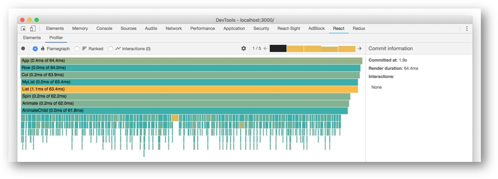
</p>

**2. Using `shouldComponentUpdate()` method**

By default, React will render the virtual DOM and compare the difference for every component in the tree for any change in its props or state. But that is obviously not reasonable. As our app grows, attempting to re-render and compare the entire virtual DOM at every action will eventually slow the whole thing down.

React provides a simple lifecycle method to indicate if a component needs re-rendering and that is, shouldComponentUpdate which is triggered before the re-rendering process starts. The default implementation of this function returns true.

```js
shouldComponentUpdate(nextProps, nextState) {
  return true
}
```

When this function returns true for any component, it allows the render differentiating process to be triggered. This gives us the power of controlling the render differentiating process. Suppose we need to prevent a component from being re-rendered, we need simply to return false from that function. As we can see from the implementation of the method, we can compare the current and next props and state to determine whether a re-render is necessary:

```js
shouldComponentUpdate(nextProps, nextState) {
  return nextProps.id !== this.props.id
}
```

**3. Using Pure Components**

Pure Components in React are the components which do not re-renders when the value of `state` and `props` has been updated with the same values. If the value of the previous `state` or `props` and the new `state` or `props` is the same, the component is not re-rendered. Pure Components restricts the re-rendering ensuring the higher performance of the Component.

**4. Using React.memo**

React.memo is a higher order component. It\'s similar to `React.PureComponent` but for function components instead of classes.

```js
const MyComponent = React.memo(function MyComponent(props) {
  /* render using props */
})
```

If your function component renders the same result given the same props, you can wrap it in a call to `React.memo` for a performance boost in some cases by memoizing the result. This means that React will skip rendering the component, and reuse the last rendered result.

`React.memo` only checks for `prop` changes. If your function component wrapped in `React.memo` has a `useState` or `useContext` Hook in its implementation, it will still rerender when `state` or `context` change.

**5. Virtualizing Long Lists**

In order to address the issue with our long chat feed, the React team recommends a technique called windowing. This technique only renders the portion of the list that is visible to the user (+/- a given offset) in order to reduce the time to render. As the user scrolls, new list items are retrieved and rendered. `react-window` and `react-virtualized` are two libraries that provide components to help with list virtualization.

**[[Read More](https://reactjs.org/docs/optimizing-performance.html)]**

<div align="right">
    <b><a href="#">↥ back to top</a></b>
</div>

## Q. ***When would you use StrictMode component in React?***

`StrictMode` is a tool for highlighting potential problems in an application. Like `Fragment`, `StrictMode` does not render any visible UI. It activates additional checks and warnings for its descendants. Strict mode checks are run in development mode only; they do not impact the production build.

```js
import React from 'react'

export default function App() {
  return (
    <Fragment>
      <Header />
      <React.StrictMode>
        <div>
          <ComponentOne />
          <ComponentTwo />
        </div>
      </React.StrictMode>
      <Footer />
    </Fragment>
  )
}
```

In the above example, strict mode checks will not be run against the `<Header>` and `<Footer>` components. However, `<ComponentOne>` and `<ComponentTwo>`, as well as all of their descendants, will have the checks.

`React.StrictMode`, in order to be efficient and avoid potential problems by any side-effects, needs to trigger some methods and lifecycle hooks twice. These are:

* Class component constructor() method
* The render() method
* setState() updater functions (the first argument)
* The static getDerivedStateFromProps() lifecycle
* React.useState() function

**Benefits of StrictMode**

* Identifying components with unsafe lifecycles
* Warning about legacy string ref API usage
* Warning about deprecated findDOMNode usage
* Detecting unexpected side effects
* Detecting legacy context API

<div align="right">
    <b><a href="#">↥ back to top</a></b>
</div>

## Q. ***How does React renderer work exactly when we call setState?***

The `state` allows React components to change their output over time in response to user actions, network responses, and anything else, without violating this rule. Components defined as classes have some additional features. Local state is a feature available only to class Components.

The `setState()` is the API method provided with the library so that the user is able to define and manipulate state over time.
`setState()` is the only legitimate way to update state after the initial state setup.

*Example*:

```js
import React, { Component } from 'react'

class Search extends Component {
  constructor(props) {
    super(props)

    this.state = {
      searchString: ''
    }
  }
}
```
we are passing an empty string as a value and, to update the state of searchString, we have to call setState().

```js
setState({ searchString: event.target.value })
```

Here, we are passing an object to setState(). The object contains the part of the state we want to update which, in this case, is the value of searchString. This is basically kicking off a process that React calls **reconciliation**. The reconciliation process is the way React updates the DOM, by making changes to the component based on the change in state.

When the request to `setState()` is triggered, React creates a new tree containing the reactive elements in the component (along with the updated state). This tree is used to figure out how the Search component\'s UI should change in response to the state change by comparing it with the elements of the previous tree.

<div align="right">
    <b><a href="#">↥ back to top</a></b>
</div>

## Q. ***How to avoid the need for binding in React?***

**1. Use Arrow Function in Class Property**

Usually when we want to access this inside a class method we would need to bind it to method like so:

```js
class Button extends Component {
  constructor(props) {
    super(props)
    this.state = { clicked: false }
  }
  handleClick = () => this.setState({ clicked: true })
  render() {
    return <button onClick={this.handleClick}>Click Me</button>
  }
}
```
Binding `this` to `handleClick()` in the `constructor()` allows us to use `this.setState()` from Component inside `handleClick()`.

**2. Bind in Render**

```js
onChange={this.handleChange.bind(this)}
```

This approach is terse and clear, however, there are performance implications since the function is reallocated on every render.

**3. Bind in Constructor**

One way to avoid binding in render is to bind in the constructor

```js
constructor(props) {
  super(props)
  this.handleChange = this.handleChange.bind(this)
}
```

This is the approach currently recommended in the React docs for "better performance in your application".

<div align="right">
    <b><a href="#">↥ back to top</a></b>
</div>

## Q. ***What would be the common mistake of function being called every time the component renders?***

*ToDo*

<div align="right">
    <b><a href="#">↥ back to top</a></b>
</div>

## Q. ***How does the state differ from props in React?***

**State**

This is data maintained inside a component. It is local or owned by that specific component. The component itself will update the state using the `setState()` function.

*Example*:

```js
class AppComponent extends React.component {
  state = {
      msg : 'Hello World!'
  }

  render() {
      return <div>Message {this.state.msg}</div>
  }
}
```

**Props**

Data passed in from a parent component. `props` are read-only in the child component that receives them. However, callback functions can also be passed, which can be executed inside the child to initiate an update.

*Example*: The parent can pass a props by using this

```js
<ChildComponent color='red' />
```
Inside the ChildComponent constructor we could access the props

```js
class ChildComponent extends React.Component {
  constructor(props) {
    super(props)
    console.log(props.color)
  }
}
```

Props can be used to set the internal state based on a prop value in the constructor, like this

```js
class ChildComponent extends React.Component {
  constructor(props) {
    super(props)
    this.state.colorName = props.color
  }
}
```

Props should never be changed in a child component. Props are also used to allow child components to access methods defined in the parent component. This is a good way to centralize managing the state in the parent component, and avoid children to have the need to have their own state.

**Difference between State and Props**

|  Props                                          | State                            |
|-------------------------------------------------|----------------------------------|
|Props are read-only.                             |State changes can be asynchronous.|
|Props allow to pass data from one component to other components as an argument.| State holds information about the components.|
|Props can be accessed by the child component.    |State cannot be accessed by child components.|
|Props are used to communicate between components.|States can be used for rendering dynamic changes with the component.|
|Stateless component can have Props.              |Stateless components cannot have State.|
|Props are external and controlled by whatever renders the component.| The State is internal and controlled by the React Component itself.|

<div align="right">
    <b><a href="#">↥ back to top</a></b>
</div>

## Q. ***How would you create a form in React?***

**App.js**

```js
import React, { Component } from "react"
import countries from "./countries"
import './App.css'

export default function App() {
  const [email, setEmail] = React.useState("")
  const [password, setPassword] = React.useState("")
  const [country, setCountry] = React.useState("")
  const [acceptedTerms, setAcceptedTerms] = React.useState(false)

  const handleSubmit = (event) => {
    console.log(`
      Email: ${email}
      Password: ${password}
      Country: ${country}
      Accepted Terms: ${acceptedTerms}
    `)
    event.preventDefault()
  }

  return (
    <form onSubmit={handleSubmit}>
      <h1>Create Account</h1>

      <label>
        Email:
        <input
          name="email"
          type="email"
          value={email}
          onChange={e => setEmail(e.target.value)}
          required />
      </label>

      <label>
        Password:
        <input
          name="password"
          type="password"
          value={password}
          onChange={e => setPassword(e.target.value)}
          required />
      </label>

      <label>
        Country:
        <select
          name="country"
          value={country}
          onChange={e => setCountry(e.target.value)}
          required>
          <option key=""></option>
          {countries.map(country => (
            <option key={country}>{country}</option>
          ))}
        </select>
      </label>

      <label>
        <input
          name="acceptedTerms"
          type="checkbox"
          onChange={e => setAcceptedTerms(e.target.value)}
          required />
        I accept the terms of service
      </label>

      <button>Submit</button>
    </form>
  )
}
```

**App.css**

```css
* {
  box-sizing: border-box;
}

body {
  font-family: Lato;
  height: 97vh;
  width: 100%;
  display: flex;
  flex-direction: column;
  justify-content: center;
  align-items: center;
  background-color: #4A4E69;
}

form {
  display: flex;
  flex-direction: column;
  width: 400px;
  min-width: 100px;
  min-height: 400px;
  padding: 20px 40px 40px 40px;
  border-radius: 6px;
  box-shadow: 0px 8px 36px #222;
  background-color: #fefefe;
}

form > h1 {
  display: flex;
  justify-content: center;
  font-family: "Segoe UI", "Ubuntu", "Roboto", "Open Sans", "Helvetica Neue", sans-serif;
  font-size: 2em;
  font-weight: lighter;
  margin-top: 0.25em;
  color: #222;
  letter-spacing: 2px;
}

.info {
  padding-bottom: 1em;
  padding-left: 0.5em;
  padding-right: 0.5em;
}

label {
  margin-bottom: 0.5em;
  color: #444;
  font-weight: lighter;
}

input {
  display: flex;
  flex-direction: column;
  margin-bottom: 15px;
  width: 100%;
}
input, select {
  padding: 10px 10px;
  border-radius: 5px;
  border: 1px solid #d6d1d5;
  margin-top: 5px;
}
select {
  display: block;
  width: 100%;
  height: 35px;
}
input[type="checkbox"] {
  display: inline-block;
  width: auto;
  margin-top: 2em;
  margin-right: 10px;
}

button {
  min-width: 100%;
  cursor: pointer;
  margin-right: 0.25em;
  margin-top: 0.5em;
  padding: 	0.938em;
  border: none;
  border-radius: 4px;
  background-color: #22223B;
  color: #fefefe;
}
button:hover {
  background-color: #4A4E69;
  color: #fefefe;
}

.error {
  color:#db2269;
  font-size: 0.5em;
  display: relative;
}

.submit {
  width: 100%;
  display: flex;
  flex-wrap: wrap;
}
```

**Countries.js**

```js
export default [
  'Austria',
  'Denmark',
  'France',
  'Germany',
  'India',
  'Italy',
  'Poland',
  'Russia',
  'Sweden',
  'United States'
];
```

Output:

<p align="center">
  
</p>

<div align="right">
    <b><a href="#">↥ back to top</a></b>
</div>

## Q. ***How to change the state of a child component from its parent in React?***

**Using Props**

We will take two components, Parent and Child. And our Parent component will set the value depends on the Child Component. Child component holds the Input field and we are going to send the input field value to the Parent component.

```js
function Parent() {
    const [value, setValue] = React.useState("")

    function handleChange(newValue) {
      setValue(newValue)
    }

    // We pass a callback to Child
    return <Child value={value} onChange={handleChange} />
}
```

As you see that we set the onChange property to the Child component. Next step is to create the Child component.

```js
function Child(props) {
    function handleChange(event) {
        // Here, we invoke the callback with the new value
        props.onChange(event.target.value)
    }
  
    return <input value={props.value} onChange={handleChange} />
}
```

On the above codes, we have created function handleChange that will pass the value through props.onChange to our Parent component.

<div align="right">
    <b><a href="#">↥ back to top</a></b>
</div>

## Q. ***What do you understand with the term polling in React?***

Using `setInterval()` inside React components allows us to execute a function or some code at specific intervals.

```js
useEffect(() => {
  const interval = setInterval(() => {
    console.log('This will run every second!')
  }, 1000)
  return () => clearInterval(interval)
}, [])
```

The code above schedules a new interval to run every second inside of the useEffect Hook. This will schedule once the React component mounts for the first time. To properly clear the interval, we return `clearInterval()` from the `useEffect()` Hook, passing in the interval.

**Using setInterval in React Components**

To schedule a new interval, we call the setInterval method inside of a React component, like so:

```js
import React, { useState, useEffect } from 'react'

const IntervalExample = () => {
  const [seconds, setSeconds] = useState(0)

  useEffect(() => {
    const interval = setInterval(() => {
      setSeconds(seconds => seconds + 1)
    }, 1000)
    return () => clearInterval(interval)
  }, [])

  return (
    <div className="App">
      <header className="App-header">
        {seconds} seconds have elapsed since mounting.
      </header>
    </div>
  )
}

export default IntervalExample
```

The example above shows a React component, IntervalExample, scheduling a new interval once it mounts to the DOM. The interval increments the seconds state value by one, every second.

<div align="right">
    <b><a href="#">↥ back to top</a></b>
</div>

## Q. ***What is the difference between Element, Component and Component instance in React?***

A React Component is a template. A blueprint. A global definition. This can be either a function or a class (with a render function).

A React Element is what gets returned from components. It is an object that virtually describes the DOM nodes that a component represents. With a function component, this element is the object that the function returns. With a class component, the element is the object that the component\'s render function returns. React elements are not what we see in the browser. They are just objects in memory and we can not change anything about them.

*Example*:

```js
import React from 'react'
import ReactDOM from 'react-dom'
import './index.css'

class MyComponent extends React.Component {
  constructor(props) {
    super(props)
    console.log('This is a component instance:', this)
  }

  render() {
    const another_element = <div>Hello, World!</div>
    console.log('This is also an element:', another_element)
    return another_element
  }
}

console.log('This is a component:', MyComponent)

const element = <MyComponent/>

console.log('This is an element:', element)

ReactDOM.render(
  element,
  document.getElementById('root')
)
```

**React Elements**

A React Element is just a plain old JavaScript Object without own methods. It has essentially four properties:

* `type`, a String representing an HTML tag or a reference referring to a React Component
* `key`, a String to uniquely identify an React Element
* `ref`, a reference to access either the underlying DOM node or React Component Instance)
* `props` (properties Object)

A React Element is not an instance of a React Component. It is just a simplified "description" of how the React Component Instance (or depending on the type an HTML tag) to be created should look like.

A React Element that describes a React Component doesn't know to which DOM node it is eventually rendered - this association is abstracted and will be resolved while rendering.

React Elements may contain child elements and thus are capable of forming element trees, which represent the Virtual DOM tree.

**React Components and React Component Instances**

A custom React Component is either created by `React.createClass` or by extending `React.Component` (ES2015). If a React Component is instantiated it expects a props Object and returns an instance, which is referred to as a React Component Instance.

A React Component can contain state and has access to the React Lifecycle methods. It must have at least a `render` method, which returns a React Element(-tree) when invoked. Please note that you never construct React Component Instances yourself but let React create it for you.

<div align="right">
    <b><a href="#">↥ back to top</a></b>
</div>

## Q. ***In which lifecycle event do you make AJAX requests in React?***

According to official React docs, the recommended place to do Ajax requests is in `componentDidMount()` which is a lifecycle method that runs after the React component has been mounted to the DOM. This is so you can use `setState()` to update your component when the data is retrieved.

*Example*:

```js
import React from 'react'

class MyComponent extends React.Component {
  constructor(props) {
    super(props)
    this.state = {
      error: null,
      isLoaded: false,
      items: []
    }
  }

  componentDidMount() {
    fetch("https://api.example.com/items")
      .then(res => res.json())
      .then(
        (result) => {
          this.setState({
            isLoaded: true,
            items: result.items
          })
        },
        // Note: it's important to handle errors here
        // instead of a catch() block so that we don't swallow
        // exceptions from actual bugs in components.
        (error) => {
          this.setState({
            isLoaded: true,
            error
          })
        }
      )
  }

  render() {
    const { error, isLoaded, items } = this.state
    if (error) {
      return <div>Error: {error.message}</div>
    } else if (!isLoaded) {
      return <div>Loading...</div>
    } else {
      return (
        <ul>
          {items.map(item => (
            <li key={item.name}>
              {item.name} {item.price}
            </li>
          ))}
        </ul>
      )
    }
  }
}
```

<div align="right">
    <b><a href="#">↥ back to top</a></b>
</div>

## Q. ***What is meant by event handling in React?***

Handling events with React elements is very similar to handling events on DOM elements. There are some syntax differences:

* React events are named using camelCase, rather than lowercase.
* With JSX you pass a function as the event handler, rather than a string.

```js
class Toggle extends React.Component {
  constructor(props) {
    super(props)
    this.state = {isToggleOn: true}

    // This binding is necessary to make `this` work in the callback
    this.handleClick = this.handleClick.bind(this)
  }

  handleClick() {
    this.setState(state => ({
      isToggleOn: !state.isToggleOn
    }))
  }

  render() {
    return (
      <button onClick={this.handleClick}>
        {this.state.isToggleOn ? 'ON' : 'OFF'}
      </button>
    )
  }
}

ReactDOM.render(
  <Toggle />,
  document.getElementById('root')
)
```

<div align="right">
    <b><a href="#">↥ back to top</a></b>
</div>

## Q. ***What is the difference between HTML and React event handling?***

*ToDo*

<div align="right">
    <b><a href="#">↥ back to top</a></b>
</div>

## Q. ***How many outermost elements can be there in a JSX expression?***

A JSX expression must have only one outer element. For Example:

```js
const headings = (
    <div id = "outermost-element">
       <h1>I am a heading </h1>
       <h2>I am also a heading</h1>
    </div>
)
```

<div align="right">
    <b><a href="#">↥ back to top</a></b>
</div>

## Q. ***Explain DOM diffing?***

**Document Object Model**

The DOM (Document Object Model) is an interface that represents an HTML document in a tree-like structure with nodes. This structure allows the document to be traversed and modified by programmers with each node being represented as an object. The DOM is created by the browser when
a web page is loaded.

**React\'s "Virtual DOM"**

The "Virtual DOM" is very similar to the real DOM, in that it is a tree-like structure kept in-memory, where React elements are represented as objects. This tree has many of the same properties as the real DOM without the power to change what is on the screen. It is a javascript object representing components in your application which can be updated quickly and efficiently by React.

When a JSX element is rendered or the state of an element changes, a new Virtual DOM tree is created. The function responsible for the creation of this tree is React\'s render() function. This is a fast process because the virtual DOM tree is just a javascript object and the UI will not be re-painted based on this new tree.

**DOM Diffing**

Once the Virtual DOM is created, React compares this new representation with a snapshot of the previous version of the virtual DOM to see exactly which elements have changed.

Once the difference is known, React updates only those objects that differ on the actual DOM and the browser re-paints the screen. The next time state or props changes for a component in the application, a new virtual DOM tree of React elements will be created and the process will repeat.

The process of checking the difference between the new Virtual DOM tree and the old Virtual DOM tree is called **diffing**. Diffing is accomplished by a **heuristic O(n)** algorithm. During this process, React will deduce the minimum number of steps needed to update the real DOM, eliminating unnecessary costly changes. This process is also referred to as **reconciliation**.

React implements a heuristic O(n) algorithm based on two assumptions:

1. Two elements of different types will produce different trees.
1. The developer can hint at which child elements may be stable across different renders with a key prop."

<div align="right">
    <b><a href="#">↥ back to top</a></b>
</div>

## Q. ***What does shouldComponentUpdate do and why is it important?***

The `shouldComponentUpdate()` method allows Component to exit the Update life cycle if there is no reason to apply a new render. React does not deeply compare `props` by default. When `props` or `state` is updated React assumes we need to re-render the content.

The default implementation of this function returns true so to stop the re-render you need to return false here:

```js
shouldComponentUpdate(nextProps, nextState) {
  console.log(nextProps, nextState)
  console.log(this.props, this.state)
  return false  
}
```

**Preventing unnecessary renders**

The `shouldComponentUpdate()` method is the first real life cycle optimization method that we can leverage in React. It checks the current props and state, compares it to the next props and state and then returns true if they are different, or false if they are the same. This method is not called for the initial render or when `forceUpdate()` is used.

<div align="right">
    <b><a href="#">↥ back to top</a></b>
</div>

## Q. ***What is the purpose of render() function in React?***

All React applications start at a root DOM node that marks the portion of the DOM that will be managed by React. When React is called to render the component tree it will first need the JSX in code to be converted into pure JavaScript. `render` function is part of the react component lifecyle where `ReactDOM` is the class object which exposes a method called `render` which is used to render the React JSX content into DOM.

Generally you would use `ReactDOM.render()` once in your App to render the top level component, all other components will be children to the top level component. A react component goes though a number of mounting and updating lifecycle method and decides to render the data in the render function. Any JSX code that you write in `render()` method is converted to `React.createElement(tag, props, children)` before it is rendered into the DOM.

```js
// App.js
import React from 'react'
import './App.css'

function App() {
  return (
    <div className="App">
      Hello World !
    </div>
  )
}

export default App
```

```js
// index.js
import React from 'react'
import ReactDOM from 'react-dom'
import './index.css'
import App from './App/App'

ReactDOM.render(
  <React.StrictMode>
    <App />
  </React.StrictMode>,
  document.getElementById('root')
)
```

<div align="right">
    <b><a href="#">↥ back to top</a></b>
</div>

## Q. ***What are React components?***

Components are the building blocks of any React app and a typical React app will have many of these. Simply put, a component is a JavaScript class or function that optionally accepts inputs i.e. properties(`props`) and returns a React element that describes how a section of the UI (User Interface) should appear.

A React component can be either **stateful** or **stateless**. Stateful components are of the class type, while stateless components are of the function type.

**Stateless Component**

```js
import React from 'react'

const ExampleComponent = (props) => {
    return (<h1>Welcome to React!</h1>)
}

export default class App extends React.Component {
  render() {
    return (
      <div>
        <ExampleComponent/>
      </div>
    )
  }
}
```

The above example shows a stateless component named ExampleComponent which is inserted in the `<App/>` component. The `ExampleComponent` just comprises of a `<h1>` element.

**Stateful Component**

```js
import React from 'react'

class ExampleComponent extends React.Component {

  constructor(props) {
    super(props)
    this.state = {
      heading: "This is an Example Component!"
    }
  }
  render() {
    return (
        <div>
            <h1>{ this.props.welcomeMsg }</h1>
            <h2>{ this.state.heading }</h2>
        </div>
    )
  }
}

export default class App extends React.Component {
  render() {
    const welcomeMsg = "Welcome to React!"
    return (
      <div>
        <ExampleComponent welcomeMsg={welcomeMsg}/>
      </div>
    )
  }
}
```

The above example shows a stateful component named ExampleComponent which is inserted in the `<App/>` component. The `ExampleComponent` contains a `<h1>` and the `<h2>` element wrapped in a `<div>`. The `<h1>` displays data using props while the `<h2>` takes its data from the internal state of the ExampleComponent.

**Props**

Props are an optional input, and can be used to send data to the component. They are immutable properties, which makes them read-only. This also makes them come in handy when you want to display fixed values.

**State**

A React component of class type maintains an internal state which acts as a data store for it. This state can be updated and whenever it is changed, React re-renders that component.

**LifeCycle**

Every component has **lifecycle methods**. They specify the behavior of the component when it undergoes a phase of its lifecycle.

<div align="right">
    <b><a href="#">↥ back to top</a></b>
</div>

## Q. ***How do I bind a function to a component instance?***

There are several ways to make sure functions have access to component attributes like `this.props` and `this.state`, depending on which syntax and build steps you are using.

**Bind in Constructor (ES5)**

```js
class App extends Component {
  constructor(props) {
    super(props)
    this.handleClick = this.handleClick.bind(this)
  }
  handleClick() {
    console.log('Click happened')
  }
  render() {
    return <button onClick={this.handleClick}>Click Me</button>
  }
}
```

**Class Properties**

```js
class App extends Component {
  // Note: this syntax is experimental and not standardized yet.
  handleClick = () => {
    console.log('Click happened')
  }
  render() {
    return <button onClick={this.handleClick}>Click Me</button>
  }
}
```

**Bind in Render**

```js
class App extends Component {
  handleClick() {
    console.log('Click happened')
  }
  render() {
    return <button onClick={this.handleClick.bind(this)}>Click Me</button>
  }
}
```

*Note: Using `Function.prototype.bind` in render creates a new function each time the component renders, which may have performance implications*

**Arrow Function in Render**

```js
class App extends Component {
  handleClick() {
    console.log('Click happened')
  }
  render() {
    return <button onClick={() => this.handleClick()}>Click Me</button>
  }
}
```

*Note: Using an arrow function in render creates a new function each time the component renders, which may break optimizations based on strict identity comparison.*

<div align="right">
    <b><a href="#">↥ back to top</a></b>
</div>

## Q. ***How to set up lazy loading components in React?***

*ToDo*

<div align="right">
    <b><a href="#">↥ back to top</a></b>
</div>

## Q. ***How do I pass a parameter to an event handler or callback?***

You can use an arrow function to wrap around an event handler and pass parameters:

```js
<button onClick={() => this.handleClick(id)} />
```

This is equivalent to calling `.bind`

```js
<button onClick={this.handleClick.bind(this, id)} />
```

*Example*: Passing params using arrow functions

```js
const A = 65 // ASCII character code

class Alphabet extends React.Component {
  constructor(props) {
    super(props)
    this.handleClick = this.handleClick.bind(this)
    this.state = {
      justClicked: null,
      letters: Array.from({length: 26}, (_, i) => String.fromCharCode(A + i))
    }
  }
  handleClick(letter) {
    this.setState({ justClicked: letter })
  }
  render() {
    return (
      <div>
        Just clicked: {this.state.justClicked}
        <ul>
          {this.state.letters.map(letter =>
            <li key={letter} onClick={() => this.handleClick(letter)}>
              {letter}
            </li>
          )}
        </ul>
      </div>
    )
  }
}
```

*Example*: Passing params using data-attributes

Alternately, you can use DOM APIs to store data needed for event handlers. Consider this approach if you need to optimize a large number of elements or have a render tree that relies on React.PureComponent equality checks.

```js
const A = 65 // ASCII character code

class Alphabet extends React.Component {
  constructor(props) {
    super(props)
    this.handleClick = this.handleClick.bind(this)
    this.state = {
      justClicked: null,
      letters: Array.from({length: 26}, (_, i) => String.fromCharCode(A + i))
    }
  }

  handleClick(e) {
    this.setState({
      justClicked: e.target.dataset.letter
    })
  }

  render() {
    return (
      <div>
        Just clicked: {this.state.justClicked}
        <ul>
          {this.state.letters.map(letter =>
            <li key={letter} data-letter={letter} onClick={this.handleClick}>
              {letter}
            </li>
          )}
        </ul>
      </div>
    )
  }
}
```

<div align="right">
    <b><a href="#">↥ back to top</a></b>
</div>

## Q. ***How to perform debounce in React.js?***

 *ToDo*

<div align="right">
    <b><a href="#">↥ back to top</a></b>
</div>

## Q. ***How can I prevent a function from being called too quickly?***

**Throttle**

Throttling prevents a function from being called more than once in a given window of time. The example below throttles a "click" handler to prevent calling it more than once per second.

```js
import throttle from 'lodash.throttle'

class LoadMoreButton extends React.Component {
  constructor(props) {
    super(props)
    this.handleClick = this.handleClick.bind(this)
    this.handleClickThrottled = throttle(this.handleClick, 1000)
  }

  componentWillUnmount() {
    this.handleClickThrottled.cancel()
  }

  render() {
    return <button onClick={this.handleClickThrottled}>Load More</button>
  }

  handleClick() {
    this.props.loadMore()
  }
}
```

**Debounce**

Debouncing ensures that a function will not be executed until after a certain amount of time has passed since it was last called. This can be useful when you have to perform some expensive calculation in response to an event that might dispatch rapidly (eg scroll or keyboard events).

The example below debounces text input with a 250ms delay.

```js
import debounce from 'lodash.debounce'

class Searchbox extends React.Component {
  constructor(props) {
    super(props)
    this.handleChange = this.handleChange.bind(this)
    this.emitChangeDebounced = debounce(this.emitChange, 250)
  }

  componentWillUnmount() {
    this.emitChangeDebounced.cancel()
  }

  render() {
    return (
      <input
        type="text"
        onChange={this.handleChange}
        placeholder="Search..."
        defaultValue={this.props.value}
      />
    )
  }

  handleChange(e) {
    // React pools events, so we read the value before debounce.
    // Alternately we could call `event.persist()` and pass the entire event.
    // For more info see reactjs.org/docs/events.html#event-pooling
    this.emitChangeDebounced(e.target.value)
  }

  emitChange(value) {
    this.props.onChange(value)
  }
}
```

**requestAnimationFrame throttling**

`requestAnimationFrame` is a way of queuing a function to be executed in the browser at the optimal time for rendering performance. A function that is queued with requestAnimationFrame will fire in the next frame. The browser will work hard to ensure that there are 60 frames per second (60 fps). However, if the browser is unable to it will naturally limit the amount of frames in a second.

For example, a device might only be able to handle 30 fps and so you will only get 30 frames in that second. Using requestAnimationFrame for throttling is a useful technique in that it prevents you from doing more than 60 updates in a second. If you are doing 100 updates in a second this creates additional work for the browser that the user will not see anyway.

```js
import rafSchedule from 'raf-schd'

class ScrollListener extends React.Component {
  constructor(props) {
    super(props)

    this.handleScroll = this.handleScroll.bind(this)

    // Create a new function to schedule updates.
    this.scheduleUpdate = rafSchedule(
      point => this.props.onScroll(point)
    )
  }

  handleScroll(e) {
    // When we receive a scroll event, schedule an update.
    // If we receive many updates within a frame, we'll only publish the latest value.
    this.scheduleUpdate({ x: e.clientX, y: e.clientY })
  }

  componentWillUnmount() {
    // Cancel any pending updates since we're unmounting.
    this.scheduleUpdate.cancel()
  }

  render() {
    return (
      <div
        style={{ overflow: 'scroll' }}
        onScroll={this.handleScroll}
      >
        
      </div>
    )
  }
}
```

<div align="right">
    <b><a href="#">↥ back to top</a></b>
</div>

## Q. ***What is reconciliation in React?***

Reconciliation is the process through which React updates the DOM.

As a developer we are creating tree of components, react then takes this tree, process it and we get a Virtual DOM that it\'s kept in memory. When there is an update in our application (e.g. change in `state` or `props`) react will take the updated Virtual DOM and compares it with the old one Virtual DOM, then decides what and how should be changed. This procedure is repeated all over again.

<p align="center">
  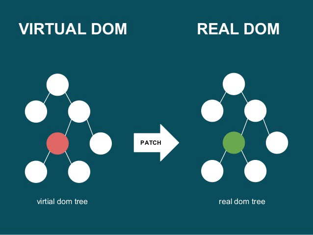
</p>

Also synced versions between Virtual DOM and "real" DOM are served by libraries such as **ReactDOM**. React needs to be very fast at comparing those trees, so it uses **heuristic algorithm** with complexity of **O(n)**, so this says for 1000 nodes we need 1000 comparasions. This approach is used instead of state of the art algorithms, which have complexity of **O(n\^3)** => for 1000 nodes we need 1 bilion comparasions.

*Example:* Let\'s build a simple component that adds two numbers. The numbers will be entered in an input field.

```js
class App extends React.Component {
  
  state = {
    result: '',
    entry1: '',
    entry2: ''
  }

  handleEntry1 = (event) => {
    this.setState({entry1: event.target.value})
  }
  
  handleEntry2 = (event) => {
    this.setState({entry2: event.target.value})
  }

  handleAddition = (event) => {
    const firstInt = parseInt(this.state.entry1)
    const secondInt = parseInt(this.state.entry2)
    this.setState({result: firstInt + secondInt })
  }
  
  render() {
    const { entry1, entry2, result } = this.state
    return(
      <div>  
        <div>
          Result: { result }
        </div>
        <span><input type='text' onChange={this.handleEntry1} /></span>
        <br />
        <br />
        <span><input type='text' onChange={this.handleEntry2} /></span>
        <div>
          <button onClick={this.handleAddition} type='submit'>Add</button>
        </div>
      </div>
    )
  }
}

ReactDOM.render(<App />, document.getElementById("root"))
```

When an entry is made in the first input field, React creates a new tree. The new tree which is the virtual DOM will contain the new state for **entry1**. Then, React compares the virtual DOM with the old DOM and, from the comparison, it figures out the difference between both DOMs and makes an update to only the part that is different. A new tree is created each time the state of App component changes — when a value is entered in either of the inputs field, or when the button is clicked.

<div align="right">
    <b><a href="#">↥ back to top</a></b>
</div>

## Q. ***What are portals in React?***

Portals provide a quick and seamless way to render children into a DOM node that exists outside the DOM hierarchy of the parent component.

Normally, a functional or a class component renders a tree of React elements (usually generated from JSX). The React element defines how the DOM of the parent component should look.

```js
ReactDOM.createPortal(child, container)
```

**Features**

* It transports its children component into a new React portal which is appended by default to `document.body`.
* It can also target user specified DOM element.
* It supports server-side rendering
* It supports returning arrays (no wrapper div\'s needed)
* It uses `<Portal />` and `<PortalWithState />` so there is no compromise between flexibility and convenience.

**When to use**

The common use-cases of React portal include:

* Modals
* Tooltips
* Floating menus
* Widgets

**Installation**

```bash
npm install react-portal --save
```

*Example:* React Portal

```js
// App.js

import React, {Component} from 'react'
import './App.css'  
import PortalDemo from './PortalDemo.js'  
  
class App extends Component {
    render () {
      return (
        <div className='App'>  
          <PortalDemo />  
        </div>
        )
    }
}

export default App
```

The next step is to create a portal component and import it in the App.js file.

```js
// PortalDemo.js

import React from 'react'  
import ReactDOM from 'react-dom'  
  
function PortalDemo(){  
    return ReactDOM.createPortal(  
      <h1>Portals Demo</h1>,  
      document.getElementById('portal-root')  
    )  
}  
export default PortalDemo
```

Now, open the Index.html file and add a <div id="portal-root"></div> element to access the child component outside the root node.

```html
<!-- index.html -->

<!DOCTYPE html>  
<html lang="en">  
  <head>  
    <meta charset="utf-8" />  
    <link rel="shortcut icon" href="%PUBLIC_URL%/favicon.ico" />  
    <meta name="viewport" content="width=device-width, initial-scale=1" />  
    <meta name="theme-color" content="#000000" />  
    <link rel="manifest" href="%PUBLIC_URL%/manifest.json" />  
    <title>React App using Portal</title>  
  </head>  
  <body>  
    <noscript>It is required to enable JavaScript to run this app.</noscript>  
    <div id="root"></div>  
    <div id="portal-root"></div>  
  </body>  
</html>  
```

<div align="right">
    <b><a href="#">↥ back to top</a></b>
</div>

## Q. ***What is ReactDOMServer?***

The `ReactDOMServer` object enables you to render components to static markup. Typically, it\'s used on a Node server:

```js
// ES modules
import ReactDOMServer from 'react-dom/server'
// CommonJS
var ReactDOMServer = require('react-dom/server')
```

The **Server-side rendering (SSR)** is a popular technique for rendering a client-side single page application (SPA) on the server and then sending a fully rendered page to the client. This allows for dynamic components to be served as static HTML markup.

* It allows your site to have a faster first page load time, which is the key to a good user experience
* This approach can be useful for search engine optimization (SEO) when indexing does not handle JavaScript properly.
* It is great when people share a page of your site on social media, as they can easily gather the metadata needed to nicely share the link (images, title, description..)

*Example:*

**Creating an Express Server**

```bash
npm install express
```

All the content inside the build folder is going to be served as-is, statically by Express.

```js
// server/server.js

import path from 'path'
import fs from 'fs'

import express from 'express'
import React from 'react'
import ReactDOMServer from 'react-dom/server'

import App from '../src/App'

const PORT = 8080
const app = express()

const router = express.Router()

const serverRenderer = (req, res, next) => {
  fs.readFile(path.resolve('./build/index.html'), 'utf8', (err, data) => {
    if (err) {
      console.error(err)
      return res.status(500).send('An error occurred')
    }
    return res.send(
      data.replace(
        '<div id="root"></div>',
        `<div id="root">${ReactDOMServer.renderToString(<App />)}</div>`
      )
    )
  })
}
router.use('^/$', serverRenderer)

router.use(
  express.static(path.resolve(__dirname, '..', 'build'), { maxAge: '30d' })
)

// tell the app to use the above rules
app.use(router)

// app.use(express.static('./build'))
app.listen(PORT, () => {
  console.log(`SSR running on port ${PORT}`)
})
```

Now, in the client application, in your src/index.js, instead of calling `ReactDOM.render()`:

```js
ReactDOM.render(<App />, document.getElementById('root'))
```

call ReactDOM.hydrate(), which is the same but has the additional ability to attach event listeners to existing markup once React loads:

```js
ReactDOM.hydrate(<App />, document.getElementById('root'))
```

All the Node.js code needs to be transpiled by Babel, as server-side Node.js code does not know anything about JSX, nor ES Modules (which we use for the include statements).

**Babel Package**

```bash
npm install @babel/register @babel/preset-env @babel/preset-react ignore-styles
```

Let\'s create an entry point in `server/index.js`:

```js
require('ignore-styles')

require('@babel/register')({
  ignore: [/(node_modules)/],
  presets: ['@babel/preset-env', '@babel/preset-react']
})

require('./server')
```

Build the React application, so that the build/ folder is populated and run this:

```bash
# Build App
npm run build

# Run App on Express
node server/index.js
```

<div align="right">
    <b><a href="#">↥ back to top</a></b>
</div>

## Q. ***How to enable Server-Side Rendering in React App?***

*ToDo*

<div align="right">
    <b><a href="#">↥ back to top</a></b>
</div>

## Q. ***What will happen if you use props in initial state?***

Using props to generate state in `getInitialState` often leads to duplication of "source of truth", i.e. where the real data is. This is because getInitialState is only invoked when the component is first created.

The danger is that if the `props` on the component are changed without the component being *'refreshed'*, the new prop value will never be displayed because the constructor function (or getInitialState) will never update the current state of the component. The initialization of state from `props` only runs when the component is first created.

**Bad**

The below component won\'t display the updated input value

```js
class App extends React.Component {

  // constructor function (or getInitialState)
  constructor(props) {
    super(props)

    this.state = {
      records: [],
      inputValue: this.props.inputValue
    }
  }

  render() {
    return <div>{this.state.inputValue}</div>
  }
}
```

**Good**

Using props inside render method will update the value:

```js
class App extends React.Component {

  // constructor function (or getInitialState)
  constructor(props) {
    super(props)

    this.state = {
      records: []
    }
  }

  render() {
    return <div>{this.props.inputValue}</div>
  }
}
```

<div align="right">
    <b><a href="#">↥ back to top</a></b>
</div>

## Q. ***How to re-render the view when the browser is resized?***

**Using React Hooks**

```js
import React, { useLayoutEffect, useState } from 'react'

function useWindowSize() {

  const [size, setSize] = useState([0, 0])

  useLayoutEffect(() => {
    function updateSize() {
      setSize([window.innerWidth, window.innerHeight])
    }
    window.addEventListener('resize', updateSize)
    updateSize()
    return () => window.removeEventListener('resize', updateSize)
  }, [])

  return size
}

function ShowWindowDimensions(props) {

  const [width, height] = useWindowSize()
  return <span>Window size: {width} x {height}</span>
}
```

**Using React classes**

```js
import React from 'react'

class ShowWindowDimensions extends React.Component {
  
  state = { width: 0, height: 0 }
  
  updateDimensions = () => {
    this.setState({ width: window.innerWidth, height: window.innerHeight })
  }
  /**
   * Add event listener
   */
  componentDidMount() {
    window.addEventListener('resize', this.updateDimensions)
  }
  /**
   * Remove event listener
   */
  componentWillUnmount() {
    window.removeEventListener('resize', this.updateDimensions)
  }

  render() {
    return (
      <span>Window size: {this.state.width} x {this.state.height}</span>
    )
  }
}
```

<div align="right">
    <b><a href="#">↥ back to top</a></b>
</div>

## Q. ***How can find the version of React at runtime in the browser?***

**Chrome Dev Tools**

```bash
window.React.version
```

<div align="right">
    <b><a href="#">↥ back to top</a></b>
</div>

## Q. ***How to use https instead of http in create-react-app?***

set the HTTPS environment variable to `true`, then start the dev server as usual with `npm start`:

```bash
# Windows
set HTTPS=true&&npm start
```

<div align="right">
    <b><a href="#">↥ back to top</a></b>
</div>

## Q. ***Why is a component constructor called only once?***

React\'s **reconciliation algorithm** assumes that without any information to the contrary, if a custom component appears in the same place on subsequent renders, it\'s the same component as before, so reuses the previous instance rather than creating a new one.

If you give each component a unique key `prop`, React can use the key change to infer that the component has actually been substituted and will create a new one from scratch, giving it the full component lifecycle.

```js
renderContent() {
  if (this.state.activeItem === 'item-one') {
    return (
      <Content title="First" key="first" />
    )
  } else {
    return (
      <Content title="Second" key="second" />
    )
  }
}
```

<div align="right">
    <b><a href="#">↥ back to top</a></b>
</div>

## Q. ***Explain React Router 5 features?***

React Router 5 embraces the power of hooks and has introduced four different hooks to help with routing.

```js
<Route path="/">
  <Home />
</Route>
```

**useHistory**

* Provides access to the `history` prop in React Router
* Refers to the history package dependency that the router uses
* A primary use case would be for programmatic routing with functions, like `push`, `replace`, etc.

```js
import { useHistory } from 'react-router-dom'

function Home() {
  const history = useHistory()
  return <button onClick={() => history.push('/profile')}>Profile</button>
}
```

**useLocation**

* Provides access to the location prop in React Router
* It is similar to window.location in the browser itself, but this is accessible everywhere as it represents the * Router state and location.
* A primary use case for this would be to access the query params or the complete route string.

```js
import { useLocation } from 'react-router-dom'

function Profile() {
  const location = useLocation()
  useEffect(() => {
    const currentPath = location.pathname
    const searchParams = new URLSearchParams(location.search)
  }, [location])
  return <p>Profile</p>
}
```

**useParams**

* Provides access to search parameters in the URL
* This was possible earlier only using match.params.

```js
import { useParams, Route } from 'react-router-dom'

function Profile() {
  const { name } = useParams()
  return <p>{name}'s Profile</p>
}

function Dashboard() {
  return (
    <>
      <nav>
        <Link to={`/profile/alex`}>Alex Profile</Link>
      </nav>
      <main>
        <Route path="/profile/:name">
          <Profile />
        </Route>
      </main>
    </>
  )
}
```

**useRouteMatch**

* Provides access to the match object
* If it is provided with no arguments, it returns the closest match in the component or its parents.
* A primary use case would be to construct nested paths.

```js
import { useRouteMatch, Route } from 'react-router-dom'

function Auth() {
  const match = useRouteMatch()
  return (
    <>
      <Route path={`${match.url}/login`}>
        <Login />
      </Route>
      <Route path={`${match.url}/register`}>
        <Register />
      </Route>
    </>
  )
}
```

We can also use `useRouteMatch` to access a match without rendering a Route. This is done by passing it the location argument.

**Redirect Component**

The easiest way to use this method is by maintaining a redirect property inside the state of the component.

```js
import { Redirect } from "react-router-dom"
...

state = { redirect: null }
render() {
  if (this.state.redirect) {
    return <Redirect to={this.state.redirect} />
  }
  return(
  // Your Code goes here
  )
}
```

**History prop**

Every component that is an immediate child of the `<Route>` component receives history object as a prop. This is the same history (library) which keeps history of the session of React Router. We can thus use its properties to navigate to the required paths.

```js
this.props.history.push("/first")
```

<div align="right">
    <b><a href="#">↥ back to top</a></b>
</div>

## Q. ***How to get parameter value from query string?***

*ToDo*

<div align="right">
    <b><a href="#">↥ back to top</a></b>
</div>

## Q. ***How to dynamicallly pass the routing coordinates to leaflet-routing using react hooks?***

*ToDo*

<div align="right">
    <b><a href="#">↥ back to top</a></b>
</div>

## Q. ***What are the kinds of information that control a segment in React?***

There are mainly two sorts of information that control a segment

* `State`: State information that will change, we need to utilize State.
* `Props`: Props are set by the parent and which are settled all through the lifetime of a part.

<div align="right">
    <b><a href="#">↥ back to top</a></b>
</div>

## Q. ***What are the drawbacks of MVW pattern?***

MVW stands for **Model-View-Whatever**

* `MVC` - Model-View-Controller
* `MVP` - Model-View-Presenter
* `MVVM` - Model-View-ViewModel
* `MVW / MV* / MVx` - Model-View-Whatever
* `HMVC` - Hierarchical Model-View-Controller
* `MMV` - Multiuse Model View
* `MVA` - Model-View-Adapter

MVW is easy to manage in a simple application, with few models/controllers. But we can easily start to witness problems as we grow in size with the following problems:

1. There is need when models/controllers communicate with each others (through a service layer probably), and these modules changes the states of each others, and the more controllers, the more easy to lose control of who changed the state of a controller.
2. Asynchronous network calls to retrieve data add uncertainty of when the model will be changed or modified, and imagine the user changing the UI while a callback from asynchronous call comeback, then we will have "nondeterministic" status of the UI.
3. Change state/model has another layer of complexity which is the mutation. When to consider the state or model is changed and how to build tools to help recognize the mutation.
4. Adding to that if the application is a collaborative applications, (like google docs for examples) where lots of data changes happening in real-time.
5. No way to do undo (travel back in time) easily without adding so much extra code.

<div align="right">
    <b><a href="#">↥ back to top</a></b>
</div>

## Q. ***What is the difference between createElement and cloneElement?***

JSX elements will be transpiled to `React.createElement()` functions to create React elements which are going to be used for the object representation of UI. Whereas cloneElement is used to clone an element and pass it new props.

The `React.cloneElement()` function returns a copy of a specified element. Additional props and children can be passed on in the function. We shoul use this function when a parent component wants to add or modify the `props` of its children.

```js
import React from 'react'

export default class App extends React.Component {
  // rendering the parent and child component
  render() {
    return (
      <ParentComp>
        <MyButton/>
        <br/>
        <MyButton/>
      </ParentComp>
    )
  }
}
// The parent component
class ParentComp extends React.Component {
  render() {
    // The new prop to the added.
    let newProp = 'red'
      // Looping over the parent's entire children,
      // cloning each child, adding a new prop.
    return (
      <div>
        {React.Children.map(this.props.children,
          child => {
            return React.cloneElement(child,
            {newProp}, null)
        })}
      </div>
    )
  }
}
// The child component
class MyButton extends React.Component {
  render() {
    return <button style =
    {{ color: this.props.newProp }}>
    Hello World!</button>
  }
}
```

<div align="right">
    <b><a href="#">↥ back to top</a></b>
</div>

## Q. ***How dynamically generate menu options for `<select>` from an array using `React.CreateElement()`?***

*ToDo*

<div align="right">
    <b><a href="#">↥ back to top</a></b>
</div>

## Q. ***What is children props?***

*ToDo*

<div align="right">
    <b><a href="#">↥ back to top</a></b>
</div>

## Q. ***When should I be using React.cloneElement vs this.props.children?***

The `React.cloneElement` only works if your child is a single React element.

*Example:*

```js
<ReactCSSTransitionGroup
     component="div"
     transitionName="example"
     transitionEnterTimeout={500}
     transitionLeaveTimeout={500}
     >
     {React.cloneElement(this.props.children, {
       key: this.props.location.pathname
      })}
</ReactCSSTransitionGroup>
```

For almost everything `{this.props.children}` is used. Cloning is useful in some more advanced scenarios, where a parent sends in an element and the child component needs to change some props on that element or add things like `ref` for accessing the actual DOM element.

*Example:*

```js
class Users extends React.Component {
  render() {
    return (
      <div>
        <h2>Users</h2>
        {this.props.children}
      </div>
    )
  }
}
```

<div align="right">
    <b><a href="#">↥ back to top</a></b>
</div>

## Q. ***How to filter input values obtained in a child component in react?***

*ToDo*

<div align="right">
    <b><a href="#">↥ back to top</a></b>
</div>

## Q. ***Explain the Lists in React?***

Using JSX we can show lists using JavaScript\'s built-in `Array.map()` method. The `.map()` method is often used to take one piece of data and convert it to another.

Keys are unique identifiers that must be attached to the top-level element inside a map. Keys are used by React to know how to update a list whether adding, updating, or deleting items. This is part of how React is so fast with large lists.

*Example:* Rendering an Array of Objects as a List

```js
import React, { Component } from "react"

class Item extends Component {
  state = {
    lists: [
      {
        id: 0,
        context: "Success",
        modifier: "list-group-item list-group-item-success"
      },
      {
        id: 1,
        context: "Warning",
        modifier: "list-group-item list-group-item-warning"
      },
      {
        id: 2,
        context: "Danger",
        modifier: "list-group-item list-group-item-danger"
      }
    ]
  }

  render() {
    return (
      <React.Fragment>
        <ul className = "list-group">
          {this.state.lists.map(list => (
            <li key = {list.id} className = {list.modifier}>
              {list.context}
            </li>
          ))}
        </ul>
      </React.Fragment>
    )
  }
}

export default Item
```

<div align="right">
    <b><a href="#">↥ back to top</a></b>
</div>

## Q. ***Why do I need Keys in React Lists?***

*ToDo*

<div align="right">
    <b><a href="#">↥ back to top</a></b>
</div>

## Q. ***Why is it necessary to start component names with a capital letter?***

In JSX, lower-case tag names are considered to be HTML tags. However, lower-case tag names with a dot (property accessor) aren\'t.

When an element type starts with a lowercase letter, it refers to a built-in component like or and results in a string `<div>` or `<span>` passed to `React.createElement`. Types that start with a capital letter like compile to `React.createElement(Foo)` and correspond to a component defined or imported in your JavaScript file.

* `<component />` compiles to `React.createElement('component')` (html tag)
* `<Component />` compiles to `React.createElement(Component)`
* `<obj.component />` compiles to `React.createElement(obj.component)`

<div align="right">
    <b><a href="#">↥ back to top</a></b>
</div>

## Q. ***What are fragments? Why are fragments better than container divs?***

Fragments allows to group a list of children without adding extra nodes to the DOM.

*Example:*

```js
class App extends React.Component {
  render() {
    return (
      <React.Fragment>
        <ChildA />
        <ChildB />
        <ChildC />
      </React.Fragment>
    )
  }
}
```

**Benefits**

* It\'s a tiny bit faster and has less memory usage (no need to create an extra DOM node). This only has a real benefit on very large and/or deep trees, but application performance often suffers from death by a thousand cuts. This is one cut less.
* Some CSS mechanisms like Flexbox and CSS Grid have a special parent-child relationship, and adding divs in the middle makes it hard to keep the desired layout while extracting logical components.
* The DOM inspector is less cluttered.

<div align="right">
    <b><a href="#">↥ back to top</a></b>
</div>

## Q. ***What is `forwardRef()` in React?***

Ref forwarding is a technique for passing a `ref` through a component to one of its children. It is very useful for cases like reusable component libraries and Higher Order Components (HOC).

We can forward a `ref` to a component by using the `React.forwardRef()` function. Ref forwarding allows components to take a ref they receive and pass it further down (in other words, "forward" it) to a child.

*Example:*

```js
// Ref.js
const TextInput = React.forwardRef((props, ref) => (
  <input type="text" placeholder="Hello World" ref={ref} />
))

const inputRef = React.createRef()

class CustomTextInput extends React.Component {
  handleSubmit = e => {
    e.preventDefault()
    console.log(inputRef.current.value)
  }

  render() {
    return (
      <div>
        <form onSubmit={e => this.handleSubmit(e)}>
          <TextInput ref={inputRef} />
          <button>Submit</button>
        </form>
      </div>
    )
  }
}
```

In the example above, we have a component called TextInput that has a child which is an input field. First, we start by creating a ref with the line of code below:

```js
const inputRef = React.createRef()
```

We pass our ref down to `<TextInput ref={inputRef}>` by specifying it as a JSX attribute. React then forwards the `ref` to the `forwardRef()` function as a second argument. Next, We forward this `ref` argument down to `<input ref={ref}>`. The value of the DOM node can now be accessed at `inputRef.current`.

<div align="right">
    <b><a href="#">↥ back to top</a></b>
</div>

## Q. ***What is the difference between useRef and createRef?***

*ToDo*

<div align="right">
    <b><a href="#">↥ back to top</a></b>
</div>

## Q. ***Which is the preferred option callback refs or findDOMNode()?***

It is preferred to use **callback refs** over `findDOMNode()` API. Because `findDOMNode()` prevents certain improvements in React in the future.

The legacy approach of using `findDOMNode()`:

```js
class MyComponent extends Component {
  componentDidMount() {
    findDOMNode(this).scrollIntoView()
  }

  render() {
    return <div />
  }
}
```

The recommended approach is:

```js
class MyComponent extends Component {
  componentDidMount() {
    this.node.scrollIntoView()
  }

  render() {
    return <div ref={node => this.node = node} />
  }
}
```

<div align="right">
    <b><a href="#">↥ back to top</a></b>
</div>

## Q. ***Why are string refs considered legacy in React?***

*ToDo*

<div align="right">
    <b><a href="#">↥ back to top</a></b>
</div>

## Q. ***How is React Router different from Conventional Routing?***

<p align="center">
  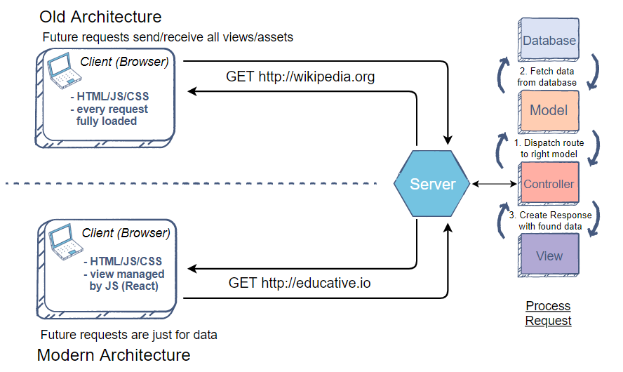
</p>

In React, there is only a single 'Html' file involved. Whenever a user types in a new URL request, instead of fetching data from the server, the Router swaps in a different Component for each new URL request. The user is tricked into switching among multiple pages but in reality, each separate Component re-renders achieving multiple views as per our needs.

**How does React achieve this?**

In React, the Router looks at the **History** of each Component and when there is any change in the History, that Component re-renders. Until Router version 4 we had to manually set the `History` value. However, from Router v4 the base path is bypassed by the `<BrowserRouter>` saving us a lot of work.

<div align="right">
    <b><a href="#">↥ back to top</a></b>
</div>

## Q. ***What is a switching component?***

*ToDo*

<div align="right">
    <b><a href="#">↥ back to top</a></b>
</div>

## Q. ***How many ways can we style the React Component?***

**1. CSS Stylesheet**

```css
.DottedBox {
  margin: 40px;
  border: 5px dotted pink;
}

.DottedBox_content {
  font-size: 15px;
  text-align: center;
}
```

```js
import React from 'react'
import './DottedBox.css'

const DottedBox = () => (
  <div className="DottedBox">
    <p className="DottedBox_content">Get started with CSS styling</p>
  </div>
)

export default DottedBox
```

**2. Inline styling**

In React, inline styles are not specified as a string. Instead they are specified with an object whose **key** is the **camelCased** version of the style name, and whose value is the style\'s value, usually a string.

```js
import React from 'react'

const divStyle = {
  margin: '40px',
  border: '5px solid pink'
}
const pStyle = {
  fontSize: '15px',
  textAlign: 'center'
}

const Box = () => (
  <div style={divStyle}>
    <p style={pStyle}>Get started with inline style</p>
  </div>
)

export default Box
```

* We can create a variable that stores style properties and then pass it to the element like `style={nameOfvariable}`
* We can also pass the styling directly `style={{color: 'pink'}}`

**3. CSS Modules**

A CSS Module is a CSS file in which all class names and animation names are scoped locally by default.

```css
:local(.container) {
   margin: 40px;
   border: 5px dashed pink;
 }
 :local(.content) {
   font-size: 15px;
   text-align: center;
 }
```

```js
import React from 'react'
import styles from './DashedBox.css'

const DashedBox = () => (
  <div className={styles.container}>
    <p className={styles.content}>Get started with CSS Modules style</p>
  </div>
)

export default DashedBox
```

we import css file `import styles './DashedBox.css'`, then we access to className as we access to object.

* `:local(.className)`- this when you use create-react-app because of webpack configurations
* `.className` - this if you use your own react boilerplate.

**4. Styled-components**

Styled-components is a library for React and React Native that allows to use component-level styles in component application that are written with a mixture of JavaScript and CSS

```bash
npm install styled-components --save
```

```js
import React from 'react'
import styled from 'styled-components'

const Div = styled.div`
  margin: 40px;
  border: 5px outset pink;
  &:hover {
   background-color: yellow;
 }
`;

const Paragraph = styled.p`
  font-size: 15px;
  text-align: center;
`;

const OutsetBox = () => (
  <Div>
    <Paragraph>Get started with styled-components</Paragraph>
  </Div>
)

export default OutsetBox
```

<div align="right">
    <b><a href="#">↥ back to top</a></b>
</div>

## Q. ***What are the advantages of using jsx?***

JSX is an optional syntax extension to JavaScript that makes writing your own components much easier. It accepts HTML quoting and makes a subcomponent rendering easier. In fact, it is a set of shortcuts for writing `React.createElement` with a few rules to make your source cleaner and simpler.

While JSX is often a matter of dispute, it can prove useful in building high-volume apps or custom components, excluding typos in large tree structures, and making it easier to convert from HTML mockups to ReactElement trees. Besides that, it provides React developers with informative warning and error messages and also helps to prevent code injections.

<div align="right">
    <b><a href="#">↥ back to top</a></b>
</div>

## Q. ***What are the popular animation package in React?***

**ReactCSSTransitionGroup**

ReactCSSTransitionGroup is a high-level API based on ReactTransitionGroup and is an easy way to perform CSS transitions and animations when a React component enters or leaves the DOM. It has four components that display transitions from one component state to another using a declarative API used for mounting and unmounting of components:

1. Transition
2. CSSTransition
3. SwitchTransition
4. TransitionGroup

*Example:*

```js
import ReactCSSTransitionGroup from 'react-transition-group'

class TodoList extends React.Component {
  constructor(props) {
    super(props)
    this.state = {items: ['hello', 'world', 'click', 'me']}
    this.handleAdd = this.handleAdd.bind(this)
  }

  handleAdd() {
    const newItems = this.state.items.concat([
      prompt('Enter some text')
    ])
    this.setState({items: newItems})
  }

  handleRemove(i) {
    let newItems = this.state.items.slice()
    newItems.splice(i, 1)
    this.setState({items: newItems})
  }

  render() {
    const items = this.state.items.map((item, i) => (
      <div key={item} onClick={() => this.handleRemove(i)}>
        {item}
      </div>
    ))

    return (
      <div>
        <button onClick={this.handleAdd}>Add Item</button>
        <ReactCSSTransitionGroup
          transitionName="example"
          transitionEnterTimeout={500}
          transitionLeaveTimeout={300}>
          {items}
        </ReactCSSTransitionGroup>
      </div>
    )
  }
}
```

In this component, when a new item is added to ReactCSSTransitionGroup it will get the `example-enter` CSS class and the `example-enter-active` CSS class added in the next tick. This is a convention based on the `transitionName` prop.

<div align="right">
    <b><a href="#">↥ back to top</a></b>
</div>

## Q. ***Explain synthetic event in React js?***

Inside React event handlers, the event object is wrapped in a `SyntheticEvent` object. These objects are pooled, which means that the objects received at an event handler will be reused for other events to increase performance. This also means that accessing the event object\'s properties asynchronously will be impossible since the event\'s properties have been reset due to reuse.

The following piece of code will log null because event has been reused inside the SyntheticEvent pool:

```js
function handleClick(event) {
  setTimeout(function () {
    console.log(event.target.name)
  }, 1000)
}
```

To avoid this we need to store the event\'s property:

```js
function handleClick(event) {
  let name = event.target.name
  setTimeout(function () {
    console.log(name)
  }, 1000)
}
```

**SyntheticEvent Object**

```js
void preventDefault()
void stopPropagation()
boolean isPropagationStopped()
boolean isDefaultPrevented()
void persist()
boolean bubbles
boolean cancelable
DOMEventTarget currentTarget
boolean defaultPrevented
number eventPhase
boolean isTrusted
DOMEvent nativeEvent
DOMEventTarget target
number timeStamp
string type
```

<div align="right">
    <b><a href="#">↥ back to top</a></b>
</div>

## Q. ***What is Event Pooling in React?***

The `SyntheticEvent` is pooled. This means that the SyntheticEvent object will be reused and all properties will be nullified after the event callback has been invoked. This is for performance reasons. As such, you cannot access the event in an `asynchronous` way.

*Example:*

```js
function onClick(event) {
  console.log(event) // => nullified object.
  console.log(event.type) // => "click"
  const eventType = event.type // => "click"

  setTimeout(function() {
    console.log(event.type) // => null
    console.log(eventType) // => "click"
  }, 0)

  // Won't work. this.state.clickEvent will only contain null values.
  this.setState({clickEvent: event})

  // You can still export event properties.
  this.setState({eventType: event.type})
}
```

If we want to access the event properties in an asynchronous way, we should call `event.persist()` on the event, which will remove the synthetic event from the pool and allow references to the event to be retained by user code.

<div align="right">
    <b><a href="#">↥ back to top</a></b>
</div>

## Q. ***What are error boundaries in React?***

Error boundaries are React components that catch JavaScript errors anywhere in their child component tree, log those errors, and display a fallback UI instead of the component tree that crashed. Error boundaries catch errors during rendering, in lifecycle methods, and in constructors of the whole tree below them.

A class component becomes an error boundary if it defines either (or both) of the lifecycle methods `static getDerivedStateFromError()` or `componentDidCatch()`. Use `static getDerivedStateFromError()` to render a fallback UI after an error has been thrown. Use `componentDidCatch()` to log error information.

*Example:*

```js
import React, {Component} from 'react'

class ErrorBoundary extends Component {
   state = {
      isErrorOccured: false,
      errorMessage: ''
   }
   componentDidCatch = (error,info) => {
      this.setState({
        isErrorOccured: true,
        errorMessage: error
      })
   }
   render() {
      if(this.state.isErrorOccured) {
         return <p>Something went wrong</p>
      } else {
         return <div>{this.props.children}</div>
      }
   }
}

export default ErrorBoundary
```

Here, We have a state object having two variables isErrorOccured and errorMessage which will be updated to true if any error occurs. We have used a React life cycle method componentDidCatch which receives two arguments error and info related to it.

**How to use error boundary**

```js
<ErrorBoundary>
   <User/>
</ErrorBoundary>
```

**Error boundaries do not catch errors for:**

* Event handlers
* Asynchronous code (e.g. setTimeout() )
* Server side rendering
* Errors thrown in the error boundary itself

<div align="right">
    <b><a href="#">↥ back to top</a></b>
</div>

## Q. ***what will happen if you use setstate() in constructor***

*ToDo*

<div align="right">
    <b><a href="#">↥ back to top</a></b>
</div>

## Q. ***How can you re-render a component without using setState() function?***

React components automatically re-render whenever there is a change in their state or props. A simple update of the state, from anywhere in the code, causes all the User Interface (UI) elements to be re-rendered automatically.

However, there may be cases where the render() method depends on some other data. After the initial mounting of components, a re-render will occur.

**1. Using setState()**

In the following example, the `setState()` method is called each time a character is entered into the text box. This causes re-rendering, ​which updates the text on the screen.

```js
import React, { Component } from 'react'
import 'bootstrap/dist/css/bootstrap.css'

class Greeting extends Component {
  state = {
    fullname: '',
  }

  stateChange = (f) => {
    const {name, value} = f.target
    this.setState({
      [name]: value,
    })
  }

  render() {
    return (
      <div className="text-center">
        <label htmlFor="fullname"> Full Name: </label>
        <input type="text" name="fullname" onChange={this.stateChange} />
        <div className="border border-primary py-3">
            <h4> Greetings, {this.state.fullname}!</h4>
        </div>
      </div>
    )
  }
}

export default Greeting
```

**2. Using forceUpdate()**

The following example generates a random number whenever it loads. Upon clicking the button, the `forceUpdate()` function is called which causes a new, random ​number to be rendered:

```js
import React, { Component } from 'react'

class App extends React.Component{
  constructor() {
    super()
    this.forceUpdateHandler = this.forceUpdateHandler.bind(this)
  }
  
  forceUpdateHandler() {
    this.forceUpdate()
  }
  
  render() {
    return (
      <div>
        <button onClick={this.forceUpdateHandler}>FORCE UPDATE</button>
        <h4>Random Number: { Math.random() }</h4>
      </div>
    )
  }
}

export default App
```

*Note: We should try to avoid all uses of `forceUpdate()` and only read from `this.props` and `this.state` in render().*

<div align="right">
    <b><a href="#">↥ back to top</a></b>
</div>

## Q. ***Why we need to pass a function to setState()?***

*ToDo*

<div align="right">
    <b><a href="#">↥ back to top</a></b>
</div>

## Q. ***How to update nested state properties in React.js?***

*ToDo*

<div align="right">
    <b><a href="#">↥ back to top</a></b>
</div>

## Q. ***What is difference between componentDidMount() and componentWillMount()?***

**componentDidMount()**

The `componentDidMount()` is executed after the first render only on the client side. This is where AJAX requests and DOM or state updates should occur. This method is also used for integration with other JavaScript frameworks and any functions with delayed execution such as `setTimeout()` or `setInterval()`.

*Example:*

```js
import React, { Component } from 'react'

class App extends Component {

  constructor(props) {
    super(props)
    this.state = {
      data: 'Alex Belfort'
    }
  }

  getData(){
    setTimeout(() => {
      console.log('Our data is fetched')
      this.setState({
        data: 'Hello Alex'
      })
    }, 1000)
  }

  componentDidMount() {
    this.getData()
  }

  render() {
    return (
      <div>
        {this.state.data}
      </div>
    )
  }
}

export default App
```

**componentWillMount()**

The `componentWillMount()` method is executed before rendering, on both the server and the client side. `componentWillMount()` method is the least used lifecycle method and called before any HTML element is rendered. It is useful when we want to do something programatically right before the component mounts.

*Example:*

```js
import React, { Component } from 'react'

class App extends Component {

  constructor(props) {
    super(props)
    this.state = {
      data: 'Alex Belfort'
    }
  }
  componentWillMount() {
    console.log('First this called')
  }

  getData() {
    setTimeout(() => {
      console.log('Our data is fetched')
      this.setState({
        data: 'Hello Alex'
      })
    }, 1000)
  }

  componentDidMount() {
    this.getData()
  }

  render() {
    return (
      <div>
        {this.state.data}
      </div>
    )
  }
}

export default App
```

<div align="right">
    <b><a href="#">↥ back to top</a></b>
</div>

## Q. ***Is it good to use setState() in componentWillMount() method?***

*ToDo*

<div align="right">
    <b><a href="#">↥ back to top</a></b>
</div>

## Q. ***Explain the use of Webpack and Babel in React?***

**Babel**

Babel is a JS transpiler that converts new JS code into old ones. It is a very flexible tool in terms of transpiling. One can easily add presets such as `es2015`, `es2016`, `es2017`, or `env`; so that Babel compiles them to ES5. Babel allows us to have a clean, maintainable code using the latest JS specifications without needing to worry about browser support.

**Webpack**

Webpack is a modular build tool that has two sets of functionality — Loaders and Plugins. Loaders transform the source code of a module. For example, style-loader adds CSS to DOM using style tags. sass-loader compiles SASS files to CSS. babel-loader transpiles JS code given the presets. Plugins are the core of Webpack. They can do things that loaders can\'t. For example, there is a plugin called UglifyJS that minifies and uglifies the output of webpack.

**create-react-app**

[create-react-app](https://create-react-app.dev/docs/getting-started/), a popular tool that lets you set up a React app with just one command. You don\'t need to get your hands dirty with Webpack or Babel because everything is preconfigured and hidden away from you.

*Example:* Quick Start

```bash
npx create-react-app my-app
cd my-app
npm start
```

<div align="right">
    <b><a href="#">↥ back to top</a></b>
</div>

## Q. ***Why to avoid using setState() after a component has been unmounted?***

Calling `setState()` after a component has unmounted will emit a warning. The "setState warning" exists to help you catch bugs, because calling `setState()` on an unmounted component is an indication that your app/component has somehow failed to clean up properly. Specifically, calling `setState()` in an unmounted component means that your app is still holding a reference to the component after the component has been unmounted - which often indicates a memory leak.

*Example:*

```js
class News extends Component {
  _isMounted = false // flag to check Mounted

  constructor(props) {
    super(props)

    this.state = {
      news: [],
    }
  }

  componentDidMount() {
    this._isMounted = true

    axios
      .get('https://hn.algolia.com/api/v1/search?query=react')
      .then(result => {
        if (this._isMounted) {
          this.setState({
            news: result.data.hits,
          })
        }
      })
  }

  componentWillUnmount() {
    this._isMounted = false
  }

  render() {
    return (
      <ul>
        {this.state.news.map(topic => (
          <li key={topic.objectID}>{topic.title}</li>
        ))}
      </ul>
    )
  }
  }
}
```

Here, even though the component got unmounted and the request resolves eventually, the flag in component will prevent to set the state of the React component after it got unmounted.

<div align="right">
    <b><a href="#">↥ back to top</a></b>
</div>

## Q. ***Why is isMounted() an anti-pattern and what is the proper solution?***

*ToDo*

<div align="right">
    <b><a href="#">↥ back to top</a></b>
</div>

## Q. ***How to set focus on an input field after rendering?***

Refs can be used to access DOM nodes or React components that are rendered in the render method. Refs are created with `React.createRef()` function. Refs can then be assigned to an element with ref-attribute. Following example shows a component that will focus to the text input when rendered.

```js
class AutoFocusTextInput extends React.Component {

  constructor(props) {
    super(props)
    this.textInput = React.createRef()
  }
  componentDidMount() {
    this.textInput.current.focus()
  }
  render() {
    return <input ref={this.textInput} />
  }
}
```

<div align="right">
    <b><a href="#">↥ back to top</a></b>
</div>

## Q. ***How do you set a timer to update every second?***

Using `setInterval()` inside React components allows us to execute a function or some code at specific intervals. A function or block of code that is bound to an interval executes until it is stopped. To stop an interval, we can use the `clearInterval()` method.

*Example:*

```js
class Clock extends React.Component {
  constructor(props) {
    super(props)
    this.state = {
      time: new Date().toLocaleString()
    }
  }
  componentDidMount() {
    this.intervalID = setInterval(
      () => this.tick(),
      1000
    )
  }
  componentWillUnmount() {
    clearInterval(this.intervalID)
  }
  tick() {
    this.setState({
      time: new Date().toLocaleString()
    })
  }
  render() {
    return (
      <p className="App-clock">
        The time is {this.state.time}.
      </p>
    )
  }
}
```

<div align="right">
    <b><a href="#">↥ back to top</a></b>
</div>

## Q. ***How to implement two way data binding in React js?***

Two data binding means

* The data we changed in the view has updated the state.
* The data in the state has updated the view.

<p align="center">
  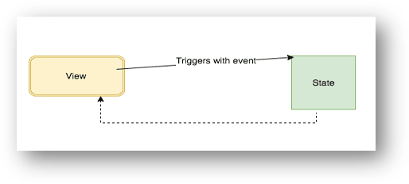
</p>

```js
class UserInput extends React.Component{

  state = {
      name: "Hello React"
  }

  handleChange = (e) =>{
    this.setState({
        name: e.target.value
    })
  }

   render(){
    return(
      <div>
       <h1>{this.state.name}</h1>
       <input type="text"
         onChange={this.handleChange}
         value={this.state.name} />
      </div>
      )
   }
}
```

In the above code, we have attached an `onChange()` event handler to the input element and also value attribute is connected to the `this.state.name` so that the value attribute is always synced with `this.state.name` property.

Whenever the user changes an input in the view it triggers the onChange event handler then it calls the this.setState method and updates the this.state.name property value at final the UserInput component is re-rendered with the updated changes.

This is also called **controlled component** because the value of an input element is controlled by the react.

**Two way data binding in React hooks**

```js
import React, {useState} "react"

function App(){
  const [name,setName] = useState('')

  const handleChange = (e) => {
     setName(e.target.value)
  }

 return (
   <div>
     <input onChange={handleChange} value={name} />
     <h1>{name}</h1>
   </div>
 )
}

export default App
```

<div align="right">
    <b><a href="#">↥ back to top</a></b>
</div>

## Q. ***How to show and hide elements in React***

**Returning Null**

```js
const AddToCart = ({ available }) => {
  if (!available) return null

  return (
    <div className="full tr">
      <button className="product--cart-button">Add to Cart</button>
    </div>
  )
}
```

**Ternary Display**

When you need to control whether one element vs. another is displayed, or even one element vs. nothing at all (null), you can use the ternary operator embedded inside of a larger portion of JSX.

```js
<div className="half">
  <p>{description}</p>

  {remaining === 0 ? (
    <span className="product-sold-out">Sold Out</span>
  ) : (
    <span className="product-remaining">{remaining} remaining</span>
  )}
</div>
```

In this case, if there are no products remaining, we will display "Sold Out"; otherwise we will display the number of products remaining.

**Shortcut Display**

It involves using a conditional inside of your JSX that looks like `checkIfTrue && <span>display if true</span>`. Because if statements that use `&&` operands stop as soon as they find the first value that evaluates to false, it won\'t reach the right side (the JSX) if the left side of the equation evaluates to false.

```js
<h2>
  <span className="product--title__large">{nameFirst}</span>
  {nameRest.length > 0 && (
    <span className="product--title__small">{nameRest.join(" ")}</span>
  )}
</h2>
```

**Using Style Property**

```js
<div style={{ display: showInfo ? "block" : "none" }}>info</div>
```

<div align="right">
    <b><a href="#">↥ back to top</a></b>
</div>

## Q. ***How to trigger click event programmatically?***

We can use `ref` prop to acquire a reference to the underlying `HTMLInputElement` object through a callback, store the reference as a class property, then use that reference to later trigger a click from your event handlers using the `HTMLElement.click` method.

*Example:*

```js
class MyComponent extends React.Component {

  render() {
    return (
      <div onClick={this.handleClick}>
        <input ref={input => this.inputElement = input} />
      </div>
    )
  }

  handleClick = (e) => {
    this.inputElement.click()
  }
}
```

*Note: The `ES6 arrow function` provides the correct lexical scope for `this` in the callback.*

<div align="right">
    <b><a href="#">↥ back to top</a></b>
</div>

## Q. ***How to listen for click events that are outside of a component?***

*ToDo*

<div align="right">
    <b><a href="#">↥ back to top</a></b>
</div>

## Q. ***How to display style based on props value?***

```js
import styled from 'styled-components'

const Button = styled.button`
  background: ${props => props.primary ? 'palevioletred' : 'white'}
  color: ${props => props.primary ? 'white' : 'palevioletred'}
`;

function MyPureComponent(props) {
  return (
    <div>
      <Button>Normal</Button>
      <Button primary>Primary</Button>
    </div>
  )
}
```

<div align="right">
    <b><a href="#">↥ back to top</a></b>
</div>

## Q. ***How to convert text to uppercase on user input entered?***

```js
import React, { useState } from "react"
import ReactDOM from "react-dom"

const toInputUppercase = e => {
  e.target.value = ("" + e.target.value).toUpperCase()
}

const App = () => {
  const [name, setName] = useState("")

  return (
    <input
      name={name}
      onChange={e => setName(e.target.value)}
      onInput={toInputUppercase} // apply on input which do you want to be capitalize
    />
  )
}

ReactDOM.render(<App />, document.getElementById("root"))
```

<div align="right">
    <b><a href="#">↥ back to top</a></b>
</div>

## Q. ***How to create props proxy for HOC component?***

It\'s nothing more than a function, propsProxyHOC, that receives a Component as an argument (in this case we\'ve called the argument WrappedComponent) and returns a new component with the WrappedComponent within.

When we return the Wrapped Component we have the possibility to manipulate props and to abstract state, even passing state as a prop into the Wrapped Component.

We can create `props` passed to the component using props proxy pattern as below

```js
const propsProxyHOC = (WrappedComponent) => {

  return class extends React.Component {
    render() {
      const newProps = {
        user: currentLoggedInUser
      }

      return <WrappedComponent {...this.props} {...newProps} />
    }
  }
}
```

**Props Proxy HOCs are useful to the following situations:**

* Manipulating props
* Accessing the instance via Refs (be careful, avoid using refs)
* Abstracting State
* Wrapping/Composing the WrappedComponent with other elements

<div align="right">
    <b><a href="#">↥ back to top</a></b>
</div>

## Q. ***Explain Inheritance Inversion (iiHOC) in react?***

Inverted Inheritance HOCs are elementarily expressed like this

```js
const inheritanceInversionHOC = (WrappedComponent) => {
  return class extens WrappedComponent {
    render() {
      return super.render()
    }
  }
}
```

Here, the returned class **extends** the WrappedComponent. It is called Inheritance Inversion, because instead of the WrappedComponent extending some Enhancer class, it is passively extended. In this way the relationship between them seems **inverse**.

Inheritance Inversion gives the HOC access to the WrappedComponent instance via this, which means we can use the `state`, `props`, component lifecycle and even the `render` method.

**Inversion Inheritance HOCs are useful for the following situations**

* Render Highjacking
* Manipulating state

*Example:*

```js
class Welcome extends React.Component {
  render() {
    return (
      <div> Welcome {his.props.user}</div>
    )
  }
}

const withUser = (WrappedComponent) => {
  return class extends React.Component {
    render() {
      if(this.props.user) {
        return  (
          <WrappedComponent {...this.props} />
        )
      }
      return <div>Welcome Guest!</div>
    }
  }
}

const withLoader = (WrappedComponent) => {
  return class extends WrappedComponent {
    render() {
      const { isLoader } = this.props
      if(!isLoaded) {
        return <div>Loading...</div>
      }
      return super.render()
    }
  }
}

export default withLoader(withUser(Welcome))
```

<div align="right">
    <b><a href="#">↥ back to top</a></b>
</div>

## Q. ***How to set a dynamic key for state?***

**Dynamic Key**

```js
onChange(e) {
  const key = e.target.name
  const value = e.target.value
  this.setState({ [key]: value })
}
```

**Nested States**

```js
handleSetState(cat, key, val) {
  const category = {...this.state[cat]}
  category[key] = val
  this.setState({ [cat]: category })
}
```

<div align="right">
    <b><a href="#">↥ back to top</a></b>
</div>

## Q. ***What are the pointer events in React?***

Pointer events, in essence, are very similar to mouse events (mousedown, mouseup, etc.) but are hardware-agnostic and thus can handle all input devices such as a mouse, stylus or touch. This is great since it removes the need for separate implementations for each device and makes authoring for cross-device pointers easier.

The API of pointer events works in the same manner as existing various event handlers. Pointer events are added as attributes to React component and are passed a callback that accepts an event. Inside the callback we process the event.

The following event types are now available in React DOM

* onPointerDown
* onPointerMove
* onPointerUp
* onPointerCancel
* onGotPointerCapture
* onLostPointerCapture
* onPointerEnter
* onPointerLeave
* onPointerOver
* onPointerOut

*Example:* Drag and Drop using Point Events

```js
// App Component
import React, { Component } from 'react'
import logo from './logo.svg'
import './App.css'
import DragItem from './DragItem'

class App extends Component {
   render() {
      return (
        <div className="App">
          <header className="App-header">
            
            <h1 className="App-title">Welcome to React sample of Point Events</h1>
          </header>
          <div className="App-intro">
            <DragItem />
          </div>
        </div>
      )
   }
}
export default App
```

DragItem Component

```js
import React from 'react'
const CIRCLE_DIAMETER = 100

export default class DragItem extends React.Component {

  state = {
     gotCapture: false,
     circleLeft: 500,
     circleTop: 100
  }
  isDragging = false
  previousLeft = 0
  previousTop = 0

  onDown = e => {
     this.isDragging = true
     e.target.setPointerCapture(e.pointerId)
     this.getDelta(e)
  }
  onMove = e => {
      if (!this.isDragging) {
         return
      }
  
      const {left, top} = this.getDelta(e)
      this.setState(({circleLeft, circleTop}) => ({
         circleLeft: circleLeft + left,
         circleTop: circleTop + top
      }))
  }
  onUp = e => (this.isDragging = false)
  onGotCapture = e => this.setState({gotCapture: true})
  onLostCapture = e => this.setState({gotCapture: false})
  getDelta = e => {
      const left = e.pageX
      const top = e.pageY
      const delta = {
         left: left - this.previousLeft,
         top: top - this.previousTop,
      }
      this.previousLeft = left
      this.previousTop = top

      return delta
  }
  render() {
      const {gotCapture, circleLeft, circleTop} = this.state
      const boxStyle = {
         border: '2px solid #cccccc',
         margin: '10px 0 20px',
         minHeight: 400,
         width: '100%',
         position: 'relative',
      }
      const circleStyle = {
         width: CIRCLE_DIAMETER,
         height: CIRCLE_DIAMETER,
         borderRadius: CIRCLE_DIAMETER / 2,
         position: 'absolute',
         left: circleLeft,
         top: circleTop,
         backgroundColor: gotCapture ? 'red' : 'green',
         touchAction: 'none',
      }
      return (
         <div style={boxStyle}>
            <div
               style={circleStyle}
               onPointerDown={this.onDown}
               onPointerMove={this.onMove}
               onPointerUp={this.onUp}
               onPointerCancel={this.onUp}
               onGotPointerCapture={this.onGotCapture}
               onLostPointerCapture={this.onLostCapture}
            />
         </div>
      )
  }
}
```

*Note: It work only in browsers that support the Pointer Events specification*

<div align="right">
    <b><a href="#">↥ back to top</a></b>
</div>

## Q. ***What is difference between Pure Component vs Component?***

PureComponent is exactly the same as Component except that it handles the `shouldComponentUpdate()` method. The major difference between React.PureComponent and React.Component is PureComponent does a shallow comparison on state change. It means that when comparing scalar values it compares their values, but when comparing objects it compares only references. It helps to improve the performance of the app.

A component rerenders every time its parent rerenders, regardless of whether the component\'s props and state have changed.
On the other hand, a pure component will not rerender if its parent rerenders, unless the pure component\'s `props` (or `state`) have changed.

**When to use React.PureComponent**

* State/Props should be an immutable object
* State/Props should not have a hierarchy
* We should call forceUpdate when data changes

*Example*

```js
// Regular class component
class App extends React.Component {
  render() {
    return <h1>Component Example !</h1>
  }
}

// React Pure class component
class Message extends React.Component {
  render() {
    return <h1>PureComponent Example !</h1>
  }
}
```

<div align="right">
    <b><a href="#">↥ back to top</a></b>
</div>

## Q. ***How to programmatically redirect to another page using React router?***

**1. Using useHistory()**

```js
import { useHistory } from "react-router-dom"

function HomeButton() {
  const history = useHistory()

  function handleClick() {
    history.push('/home')
  }

  return (
    <button type="button" onClick={handleClick}>
      Navigate to Home Page
    </button>
  )
}
```

**2. Using withRouter()**

```js
import { withRouter } from 'react-router-dom'

const Button = withRouter(({ history }) => (
  <button type='button' onClick={() => { history.push('/home') }}>
    Navigate to Home Page
  </button>
))
```

<div align="right">
    <b><a href="#">↥ back to top</a></b>
</div>

## Q. ***What is the use of {…this.props} ?***

It is called spread operator (ES6 feature) and its aim is to make the passing of props easier.

*Example:*

```js
<div {...this.props}>
  Content Here
</div>
```

It is equal to Class Component

```js
const person = {
    name: "Alex",
    age: 26,
    country: "India"
}

class SpreadExample extends React.Component {
    render() {
      const {name, age, country} = {...this.props}
      return (
        <div>
            <h3> Person Information: </h3>
            <ul>
              <li>name={name}</li>
              <li>age={age}</li>
              <li>country={country}</li>
            </ul>
        </div>
      )
    }
}

ReactDOM.render(
    <SpreadExample {...person}/>
    , mountNode
)
```

<div align="right">
    <b><a href="#">↥ back to top</a></b>
</div>

## Q. ***How to pass props in React router?***

A component with a render prop takes a function that returns a React element and calls it instead of implementing its own render logic. The **render prop** refers to a technique for sharing code between React components using a prop whose value is a function.

*Example:*

```js
import React from "react"
import { render } from "react-dom"
import { Greeting } from "./components"

import { BrowserRouter as Router, Route, Link } from "react-router-dom"

const styles = {
  fontFamily: "sans-serif",
  textAlign: "center"
}

const App = () => (
  <div style={styles}>
    <h2>Click below to go to other page. Also, open source code</h2>
    <Link to="/greeting/World">Go to /greeting/World</Link>
  </div>
)

const RouterExample = () => (
  <Router>
    <div>
      <ul>
        <li>
          <Link to="/">Home</Link>
        </li>
      </ul>

      <hr />

      <Route exact path="/" component={App} />
      <Route
        path="/greeting/:name"
        render={props => <Greeting text="Hello, " {...props} />}
      />
    </div>
  </Router>
)

render(<RouterExample />, document.getElementById("root"))
```

```js
import React from "react"

export class Greeting extends React.Component {
  render() {
    const { text, match: { params } } = this.props

    const { name } = params

    return (
      <React.Fragment>
        <h1>Greeting page</h1>
        <p>
          {text} {name}
        </p>
      </React.Fragment>
    )
  }
}
```

<div align="right">
    <b><a href="#">↥ back to top</a></b>
</div>

## Q. ***How to get query parameters in react routing?***

**Using `useParams()`**

*Example:*

```js
import React from "react"
import { BrowserRouter as Router, Switch, Route, Link, useParams } from "react-router-dom"

export default function ParamsExample() {

  return (
    <Router>
      <div>
        <h2>Accounts</h2>
        <ul>
          <li>
            <Link to="/netflix">Netflix</Link>
          </li>
          <li>
            <Link to="/zillow-group">Zillow Group</Link>
          </li>
          <li>
            <Link to="/yahoo">Yahoo</Link>
          </li>
          <li>
            <Link to="/modus-create">Modus Create</Link>
          </li>
        </ul>

        <Switch>
          <Route path="/:id" children={<Child />} />
        </Switch>
      </div>
    </Router>
  )
}

function Child() {
  // We can use the `useParams` hook here to access
  // the dynamic pieces of the URL.
  let { id } = useParams()

  return (
    <div>
      <h3>ID: {id}</h3>
    </div>
  )
}
```

<div align="right">
    <b><a href="#">↥ back to top</a></b>
</div>

## Q. ***What is the difference between HashRouter and BrowserRouter in React?***

*ToDo*

<div align="right">
    <b><a href="#">↥ back to top</a></b>
</div>

## Q. ***How do you remove an element in the react state?***

**Using filter()**

In the child component, we need to pass the id of the item we want to delete to the parent.

```js
// Item.js
import React, { Component } from "react"

class Item extends Component {
  state = {
    count: this.props.item.value
  }

  handleIncrement = e => {
    this.setState({ count: this.state.count + 1 })
  }

  render() {
    return (
      <React.Fragment>
        <div className="card mb-2">
          <h5 className={this.styleCardHeader()}>{this.styleCount()}</h5>
          <div className="card-body">
            <button
              onClick={item => {
                this.handleIncrement({ item })
              }}
              className="btn btn-lg btn-outline-secondary"
            >
              Increment
            </button>

            <button
              onClick={() => this.props.onDelete(this.props.item.id)}
              className="btn btn-lg btn-outline-danger ml-4"
            >
              Delete
            </button>
          </div>
        </div>
      </React.Fragment>
    )
  }

  styleCardHeader() {
    let classes = "card-header h4 text-white bg-"
    classes += this.state.count === 0 ? "warning" : "primary"
    return classes
  }

  styleCount() {
    const { count } = this.state
    return count === 0 ? "No Items!" : count
  }
}

export default Item
```

Now in the parent component, we need to update the `handleDelete()` function to accept that id as a parameter. In addition, we need to use the filter function to create a new array of items which does not contain the item which was clicked. Then we have to call the `setState()` function to update the state.

```js
import React, { Component } from "react"
import Item from "./item"

class Items extends Component {
  state = {
    items: [{ id: 1, value: 0 }, { id: 2, value: 10 }, { id: 3, value: 0 }]
  }

  handleDelete = itemId => {
    const items = this.state.items.filter(item => item.id !== itemId)
    this.setState({ items: items })
  }

  render() {
    return (
      <React.Fragment>
        {this.state.items.map(item => (
          <Item
            key={item.id}
            onDelete={this.handleDelete}
            item={item}
          />
        ))}
      </React.Fragment>
    )
  }
}

export default Items
```

<div align="right">
    <b><a href="#">↥ back to top</a></b>
</div>

## Q. ***What is Destructuring in React?***

Destructuring is a convenient way of accessing multiple properties stored in objects and arrays. It was introduced to JavaScript by ES6 and has provided developers with an increased amount of utility when accessing data properties in Objects or Arrays.

When used, destructuring does not modify an object or array but rather copies the desired items from those data structures into variables. These new variables can be accessed later on in a React component.

**Destructuring in JS**

Without destructuring

```js
const person = {
  firstName: "Alex",
  lastName: "K",
  age: 25,
  sex: ""
}

const first = person.firstName
const age = person.age
const sex = person.sex || "Male"

console.log(first) // "Alex"
console.log(age) // 25
console.log(sex) // Male --> default value
```

With destructuring

```js
const person = {
  firstName: "Alex",
  lastName: "K",
  age: 25,
  sex: "M"
}

const { firstName, lastName, age, sex } = person

console.log(firstName) // Alex
console.log(lastName) // K
console.log(age) // 25
console.log(sex) // M
```

**Destructuring in React**

*Example:*

```js
import React from 'react'
import Button from '@material-ui/core/Button'


export default function Events() {

  const [counter, setcounter] = React.useState(0)

  return (
      <div className='Counter'>
          <div>Result: {counter}</div>
          <Button
            variant='contained'
            color='primary'
            onClick={() => setcounter(counter + 1)}
          >
            Increment
          </Button>

          <Button
            variant='contained'
            color='primary'
            onClick={() => setcounter((counter > 0) ? (counter - 1) : 0)}
          >
            Decrement
          </Button>
      </div>
    )
}
```

<div align="right">
    <b><a href="#">↥ back to top</a></b>
</div>

## Q. ***What is the difference between NavLink and Link?***

The `<Link>` component is used to navigate the different routes on the site. But `<NavLink>` is used to add the style attributes to the active routes.

**Link**

```js
<Link to="/">Home</Link>
```

**NavLink**

```js
<NavLink to="/" activeClassName="active">Home</NavLink>
```

*Example:*

index.css

```css
.active {
  color: blue;
}
```

Routes.js

```js
import ReactDOM from 'react-dom'
import './index.css'
import { Route, NavLink, BrowserRouter as Router, Switch } from 'react-router-dom'
import App from './App'
import Users from './users'
import Contact from './contact'
import Notfound from './notfound'

const Routes = (
  <Router>
    <div>
      <ul>
        <li>
          <NavLink exact activeClassName="active" to="/">
            Home
          </NavLink>
        </li>
        <li>
          <NavLink activeClassName="active" to="/users">
            Users
          </NavLink>
        </li>
        <li>
          <NavLink activeClassName="active" to="/contact">
            Contact
          </NavLink>
        </li>
      </ul>
      <hr />
      <Switch>
        <Route exact path="/" component={App} />
        <Route path="/users" component={Users} />
        <Route path="/contact" component={Contact} />
        <Route component={Notfound} />
      </Switch>
    </div>
  </Router>
)

ReactDOM.render(Routes, document.getElementById('root'))
```

<div align="right">
    <b><a href="#">↥ back to top</a></b>
</div>

## Q. ***What is withRouter for in react-router-dom?***

`withRouter()` is a higher-order component that allows to get access to the `history` object\'s properties and the closest `<Route>`\'s match. `withRouter` will pass updated `match`, `location`, and `history` props to the wrapped component whenever it renders.

*Example:*

```js
import React from "react"
import PropTypes from "prop-types"
import { withRouter } from "react-router"

// A simple component that shows the pathname of the current location
class ShowTheLocation extends React.Component {
  static propTypes = {
    match: PropTypes.object.isRequired,
    location: PropTypes.object.isRequired,
    history: PropTypes.object.isRequired
  }

  render() {
    const { match, location, history } = this.props

    return <div>You are now at {location.pathname}</div>
  }
}

const ShowTheLocationWithRouter = withRouter(ShowTheLocation)
```

<div align="right">
    <b><a href="#">↥ back to top</a></b>
</div>

## Q. ***How to display API data using Axios in React?***

Axios is a promise based HTTP client for making HTTP requests from a browser to any web server.

**Features**

* **Interceptors**: Access the request or response configuration (headers, data, etc) as they are outgoing or incoming. These functions can act as gateways to check configuration or add data.
* **Instances**: Create reusable instances with baseUrl, headers, and other configuration already set up.
* **Defaults**: Set default values for common headers (like Authorization) on outgoing requests. This can be useful if you are authenticating to a server on every request.

**Installation**

```bash
npm install axios -- save
```

**Shorthand Methods**

* `axios.request(config)`
* `axios.get(url[, config])`
* `axios.delete(url[, config])`
* `axios.head(url[, config])`
* `axios.options(url[, config])`
* `axios.post(url[, data[, config]])`
* `axios.put(url[, data[, config]])`
* `axios.patch(url[, data[, config]])`

**POST Request Example**

```js

axios.post('/url',{data: 'data'})
  .then((res)=>{
    //on success
  })
  .catch((error)=>{
    //on error
  })
```

**GET Request Example**

```js
axios.get('/url')
  .then((res)=>{
    //on success
  })
  .catch((error)=>{
    //on error
  })
```

**Performing Multiple Concurrent Requests Example**

```js
function getUserAccount() {
  return axios.get('/user/12345')
}

function getUserPermissions() {
  return axios.get('/user/12345/permissions')
}

axios.all([getUserAccount(), getUserPermissions()])
  .then(axios.spread(function (acct, perms) {
    // Both requests are now complete
  }))

```

*Example*: Making a POST Request

```js
import React from 'react'
import axios from 'axios'

export default class PersonList extends React.Component {
  state = {
    name: '',
  }

  handleChange = event => {
    this.setState({ name: event.target.value })
  }

  handleSubmit = event => {
    event.preventDefault()

    const user = {
      name: this.state.name
    }

    axios.post(`https://jsonplaceholder.typicode.com/users`, { user })
      .then(res => {
        console.log(res)
        console.log(res.data)
      })
  }

  render() {
    return (
      <div>
        <form onSubmit={this.handleSubmit}>
          <label>
            Person Name:
            <input type="text" name="name" onChange={this.handleChange} />
          </label>
          <button type="submit">Add</button>
        </form>
      </div>
    )
  }
}
```

<div align="right">
    <b><a href="#">↥ back to top</a></b>
</div>

## Q. ***How to translate your React app with react-i18next?***

**Installing dependencies**

```bash
npm install react-i18next i18next --save
```

**Configure i18next**

Create a new file `i18n.js` beside your `index.js` containing following content:

```js
import i18n from "i18next"
import { initReactI18next } from "react-i18next"

// Translations
const resources = {
  en: {
    translation: {
      "welcome.title": "Welcome to React and react-i18next"
    }
  }
}

i18n
  .use(initReactI18next) // passes i18n down to react-i18next
  .init({
    resources,
    lng: "en",
    keySeparator: false, // we do not use keys in form messages.welcome
    interpolation: {
      escapeValue: false // react already safes from xss
    }
  })

export default i18n
```

we pass the i18n instance to `react-i18next` which will make it available for all the components via the context api.

```js
import React, { Component } from "react"
import ReactDOM from "react-dom"
import './i18n'
import App from './App'

// append app to dom
ReactDOM.render(
  <App />,
  document.getElementById("root")
)
```

**Using the Hook**

The `t` function is the main function in i18next to translate content.

```js
import React from 'react'
import { useTranslation } from 'react-i18next'

function MyComponent () {
  const { t, i18n } = useTranslation()
  return <h1>{t('welcome.title')}</h1>
}
```

**Using the HOC**

Using higher order components is one of the most used method to extend existing components by passing additional props to them. The `t` function is in `i18next` the main function to translate content.

```js
import React from 'react'
import { withTranslation } from 'react-i18next'

class HighOrderComponent extends React.Component {
    render() {

      return (
        <h1>{this.props.t('welcome.title')}</h1>
      )
    }
}

export default withTranslation()(HighOrderComponent)
```

**[[Read More](https://react.i18next.com/guides/quick-start)]**

<div align="right">
    <b><a href="#">↥ back to top</a></b>
</div>

## Q. ***How RxJS is used in React for state management?***

RxJS is a library for reactive programming using Observables, to make it easier to compose asynchronous or callback-based code. Reactive programming is an event-based paradigm that allows us to run asynchronous sequences of events as soon as data is pushed to a consumer.

**RxJS Terminology**

* **Observable**: An Observable is a data stream that houses data that can be passed through different threads.
* **Observer**: An Observer consumes the data supplied by an Observable
* **Subscription**: In order for Observer to consume data from Observable, Observer has to subscribe it to the Observable.
* **Subject**: An RxJS Subject can act as both an Observable and an Observer at the same time. In this way, values can be multicasted to many Observers from it so that when a Subject receives any data, that data can be forwarded to every Observer subscribed to it.
* **Operators**: Operators are methods that can use on Observables and subjects to manipulate, filter or change the Observable in a specified manner into a new Observable.
* **BehaviorSubject**: It allows multiple observers to listen on stream and events multicasted to the observers, BehaviorSubject stores the latest value and broadcasts it to any new subscribers.

*Example:*

```js
// messageService.js
import { BehaviourSubject } from 'rxjs'

const subscriber = new BehaviourSubject(0)

const messageService = {
   send: function(msg) {
     subscriber.next(msg)
   }
}
export {
  messageService,
  subscriber
}
```

The messageService object has a send function, which takes a msg parameter which holds the data we need to broadcast all listening components, in the function body we call the emit method in the subscriber object it multicasts the data to the subscribing components.

```js
import React, { Component } from 'react'
import { render } from 'react-dom'
import './style.css'
import { subscriber, messageService } from './messageService'

class ConsumerA extends React.Component {
  constructor() {
    this.state = {
      counter: 0
    }
  }

  componentDidMount() {
    subscriber.subscribe((v) => {
      let { counter } = this.state
      counter = counter + v
      this.setState({ counter })
    })
  }

  render() {
    let { counter } = this.state
    return (
      <div>
        <hr/>
          <h3> Counter for Consumer A </h3>
          <div> Counter: {counter} </div>
        <hr/>
      </div>
    )
  }
}

class ConsumerB extends React.Component {
  constructor() {
    this.state = {
      counter: 0
    }
  }
  componentDidMount() {
    subscriber.subscribe((v) => {
      let { counter } = this.state
      counter = counter + v
      this.setState({ counter })
    })
  }

  render() {
    let { counter } = this.state
    return (
      <div>
        <hr/>
          <h3>Counter for Consumer B</h3>
          <div> Counter: { counter } </div>
        <hr/>
        <ProducerB />
      </div>
    )
  }
}

class ProducerA extends React.Component {
  render() {
    return (
      <div>
        <h3>ProducerA</h3>
        <butto onClick={(e) => subscriber.next(1)}>Increment Counter</button>
        <ConsumerA />
      </div>
    )
  }
}

class ProducerB extends React.Component {
  render() {
    return (
      <div>
        <h3>ProducerB</h3>
        <button onClick={(e) => subscriber.next(-1)}>Decrement Counter</button>
      </div>
    )
  }
}

class App extends Component {
  render() {
    return (
      <div>
        <ProducerA />
        <hr/>
        <ConsumerB />
      </div>
    )
  }
}

render(<App/>, document.getElementById('root'));
```

The ConsumerA and ConsumerB components keep a state counter individual. In their componentDidMount they subscribe to the same stream subscriber, anytime an event is published they both update the counter. The ProducerA and ProducerB have buttons Increment Counter and Decrement Counter when clicked they emit `1` or `-1`.

**[[Read More](https://www.learnrxjs.io/)]**

<div align="right">
    <b><a href="#">↥ back to top</a></b>
</div>

## Q. ***What is lazy function in React?***

`React.lazy()` makes it easy to create components that are loaded using dynamic `import()` but are rendered like regular components. This will automatically cause the bundle containing the component to be loaded when the component is rendered.

`React.lazy()` takes a function as its argument that must return a promise by calling `import()` to load the component. The returned Promise resolves to a module with a default export containing the React component.

*Example:*

```js
import React, { lazy } from 'react'

const MyComponent = React.lazy(() => import('./MyComponent'))

const App = () => {
  <div>
    <MyComponent />
  </div>
}
```

<div align="right">
    <b><a href="#">↥ back to top</a></b>
</div>

## Q. ***What are the benefits of using Axios() over Fetch() for making http requests?***

**Fetch**: The Fetch API provides a `fetch()` method defined on the window object. It also provides a JavaScript interface for accessing and manipulating parts of the HTTP pipeline (requests and responses). The fetch method has one mandatory argument- the URL of the resource to be fetched. This method returns a Promise that can be used to retrieve the response of the request.

*Example:*

```js
fetch('path-to-the-resource-to-be-fetched')
  .then((response) => {
    // Code for handling the response
  })
  .catch((error) => {
    // Error Handling
  });
```

**Axios**: Axios is a Javascript library used to make HTTP requests from node.js or XMLHttpRequests from the browser and it supports the Promise API that is native to JS ES6. It can be used intercept HTTP requests and responses and enables client-side protection against XSRF. It also has the ability to cancel requests.

*Example:*

```js
axios.get('url')
  .then((response) => {
    // Code for handling the response
  })
  .catch((error) => {
    // Error Handling
  });
```

**Differences between Axios and Fetch**

| Axios()                         | Fetch()                            |
|---------------------------------|------------------------------------|
|Axios has **url** in request object. | Fetch has no url in request object.|
|Axios is a stand-alone third party package that can be easily installed.|Fetch is built into most modern browsers|
|Axios has built-in XSRF protection.|Fetch does not.|
|Axios uses the **data** property.    |Fetch uses the **body** property.|
|Axios data contains the object.  |Fetch\'s body has to be stringified.|
|Axios request is ok when status is 200 and statusText is 'OK'.|Fetch request is ok when response object contains the ok property.|
|Axios performs automatic transforms of JSON data.|Fetch is a two-step process when handling JSON data- first, to make the actual request; second, to call the `.json()` method on the response.|
|Axios allows cancelling request and request timeout.|Fetch does not.|
|Axios has the ability to intercept HTTP requests.|Fetch, by default, doesn\'t provide a way to intercept requests.|
|Axios has built-in support for download progress.|Fetch does not support upload progress.|
|Axios has wide browser support.  |Fetch only supports Chrome 42+, Firefox 39+, Edge 14+, and Safari 10.1+.|

<div align="right">
    <b><a href="#">↥ back to top</a></b>
</div>

## Q. ***What is the difference between rendering and mounting in ReactJS?***

**Rendering** is any time a function component gets called (or a class-based render method gets called) which returns a set of instructions for creating DOM. `render()` function will be invoked every time rerendering happens in the component. It may happen either through a `state` change or a `prop` change.

**Mounting** is when React `renders` the component for the first time and actually builds the initial DOM from those instructions. Mounting a react component means the actual addition of the DOM elements created by the react component into the browser DOM for the first time.

A **re-render** is when React calls the function component again to get a new set of instructions on an already mounted component.

*Example:*

```js
class App extends React.Component {
  state = {
    showUser: false
  }

  render() {
    return (
      <div>
        {this.state.showUser && <User name="Brad" />}
        <button onClick={() => this.setState({ showUser: true })}>
          Show User
        </button>
        <button onClick={() => this.setState({ showUser: false })}>
          Hide User
        </button>
      </div>
    )
  }
}

ReactDOM.render(<App />, document.getElementById('root'))
```

Internally, React will create an instance of `App` and will eventually call the `render()` method to get the first set of instructions for what it needs to build in the DOM. Anytime React calls the render method of a class-based component, we call that a **render**.

<div align="right">
    <b><a href="#">↥ back to top</a></b>
</div>

## Q. ***What is Flow in react?***

**Type Checking**

Type checking means ensuring that the type of a property (variable, object, function, string) in a programming language is being used as it should be. It is the process of verifying and enforcing the constraints of types, and it can occur either at compile time or at runtime. It helps to detect and report errors.

Type checking can be divided into two: static type checking and dynamic type checking.

**1. Static Type Checking**

Static type checking is used in static-typed languages where the type of the variable is known at the compile time. This means that the type of the variable must be declared beforehand. Static typing usually results in compiled code that executes more quickly because the compiler already knows the exact data types that are in use.

**2. Dynamic type checking**

Dynamic type checking is used in dynamic-typed languages where the type is usually known at runtime. This means that the type of the variable doesn\'t need to be explicitly defined.

**Flow**

Flow is a static type checker for JavaScript apps that aims to find and eliminate problems as you code. Designed by the Facebook team for JavaScript developers, it\'s a static type checker that catches common errors in your application before they run.

**Integrating Flow**

```bash
# Create React App with Flowchecker
npx create-react-app flowchecker

# Add Dependency
npm install --save-dev flow-bin
```

The next thing to do is add Flow to the "scripts" section of your package.json so that Flow can be used in the terminal. In the package.json file, add the code snippet below.

```json
 "scripts": {
      "flow": "flow",
    }
```

Finally, for the Flow setup, run any of the commands below:

```bash
npm run flow init
```

This will help to create a Flow configuration file that should be committed. The Flow config file helps to determine the files that Flow should work with and what should be ignored.

<div align="right">
    <b><a href="#">↥ back to top</a></b>
</div>

## Q. ***What is an alternative way to avoid having to bind to this in event callback methods?***

**Bind in Constructor**

```js
class App extends Component {

  constructor(props) {
    super(props)
    this.handleClick = this.handleClick.bind(this)
  }
  handleClick() {
    console.log('Clicked !')
  }
  render() {
    return <button onClick={this.handleClick}>Click Me</button>
  }
}
```

**Bind in Render**

```js
class App extends Component {

  handleClick() {
    console.log('Clicked !')
  }
  render() {
    return <button onClick={this.handleClick.bind(this)}>Click Me</button>
  }
}
```

**Arrow Function in Render**

```js
class App extends Component {

  handleClick() {
    console.log('Clicked !')
  }
  render() {
    return <button onClick={() => this.handleClick()}>Click Me</button>
  }
}
```

Using an arrow function in render creates a new function each time the component renders, which may break optimizations based on strict identity comparison.

<div align="right">
    <b><a href="#">↥ back to top</a></b>
</div>

## Q. ***Why is it advised to pass a callback function to setState as opposed to an object?***

Because `this.props` and `this.state` may be updated asynchronously, we should not rely on their values for calculating the next state.

*Example: setState Callback in a Class Component*

```js
import React, { Component } from 'react'

class App extends Component {
  constructor(props) {
    super(props)
    this.state = {
      age: 0,
    }
  }
  
  // this.checkAge is passed as the callback to setState
  updateAge = (value) => {
    this.setState({ age: value}, this.checkAge)
  }

  checkAge = () => {
    const { age } = this.state
    if (age !== 0 && age >= 21) {
      // Make API call to /beer
    } else {
      // Throw error 404, beer not found
    }
  }

  render() {
    const { age } = this.state
    return (
      <div>
        <p>Drinking Age Checker</p>
        <input
          type="number"
          value={age}
          onChange={e => this.updateAge(e.target.value)}
        />
      </div>
    )
  }
}
export default App
```

*Example: setState Callback in a Functional Component*

```js
import React, { useEffect, useState } from 'react'

function App() {
  const [age, setAge] = useState(0)
  
  updateAge(value) {
    setAge(value)
  }

  useEffect(() => {
    if (age !== 0 && age >= 21) {
      // Make API call to /beer
    } else {
      // Throw error 404, beer not found
    }
  }, [age])

  return (
    <div>
      <p>Drinking Age Checker</p>
      <input
        type="number"
        value={age} 
        onChange={e => setAge(e.target.value)}
      />
    </div>
  )
}

export default App
```

<div align="right">
    <b><a href="#">↥ back to top</a></b>
</div>

## Q. ***What is the alternative of binding `this` in the constructor?***

**Arrow Function**: This creates and binds the function all at once. Inside render (and elsewhere), the function is already bound because the arrow function preserves the this binding.

*Example:*

```js
class Button extends React.Component {
  // no binding
  handleClick = (e) => {
    console.log('clicked !');
  }
  render() {
    return <button onClick={this.handleClick}>Click Me</button>;
  }
}
```

<div align="right">
    <b><a href="#">↥ back to top</a></b>
</div>

## Q. ***What is Virtual DOM?***

*ToDo*

<div align="right">
    <b><a href="#">↥ back to top</a></b>
</div>

## Q. ***What is the difference between ShadowDOM and VirtualDOM?***

<p align="center">
  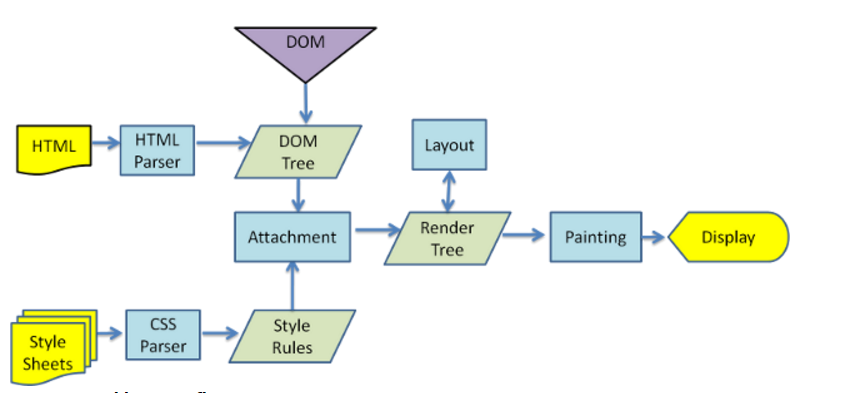
</p>

**Document Object Model**

It a way of representing a structured document via objects. It is cross-platform and language-independent convention for representing and interacting with data in HTML, XML, and others. Web browsers handle the DOM implementation details, so we can interact with it using JavaScript and CSS.

**Virtual DOM**

Virtual DOM is any kind of representation of a real DOM. Virtual DOM is about avoiding unnecessary changes to the DOM, which are expensive performance-wise, because changes to the DOM usually cause re-rendering of the page. It allows to collect several changes to be applied at once, so not every single change causes a re-render, but instead re-rendering only happens once after a set of changes was applied to the DOM.

**Shadow DOM**

Shadow DOM is mostly about encapsulation of the implementation. A single custom element can implement more-or-less complex logic combined with more-or-less complex DOM. Shadow DOM refers to the ability of the browser to include a subtree of DOM elements into the rendering of a document, but not into the main document DOM tree.

**Difference**

The virtual DOM creates an additional DOM. The shadow DOM simply hides implementation details and provides isolated scope for web components.

<div align="right">
    <b><a href="#">↥ back to top</a></b>
</div>

## Q. ***Why React uses className over class attribute?***

*ToDo*

<div align="right">
    <b><a href="#">↥ back to top</a></b>
</div>

## Q. ***What is Lifting State Up in ReactJS?***

The common approach to share state between two components is to move the state to common parent of the two components. This approach is called as lifting state up in React.js. With the shared state, changes in state reflect in relevant components simultaneously.

**Example:**

The App component containing PlayerContent and PlayerDetails component. PlayerContent shows the player name buttons. PlayerDetails shows the details of the in one line.

The app component contains the state for both the component. The selected player is shown once we click on the one of the player button.

App.js

```js
import React from 'react'
import PlayerContent from './PlayerContent'
import PlayerDetails from './PlayerDetails'
import './App.css'

class App extends React.Component {
   constructor(props) {
      super(props)
      this.state = { selectedPlayer: [0,0], playerName: ''}
      this.updateSelectedPlayer = this.updateSelectedPlayer.bind(this)
   }
   updateSelectedPlayer(id, name) {
      var arr = [0, 0, 0, 0]
      arr[id] = 1
      this.setState({
         playerName: name,
         selectedPlayer: arr
      })
   }
   render () {
      return (
        <div>
            <PlayerContent active={this.state.selectedPlayer[0]}
            clickHandler={this.updateSelectedPlayer} id={0} name="David"/>
            <PlayerContent active={this.state.selectedPlayer[1]}
            clickHandler={this.updateSelectedPlayer} id={1} name="Steve"/>
            <PlayerDetails name={this.state.playerName}/>
        </div>
      )
   }
}
export default App
```

PlayerContent.js

```js
import React , { Component} from 'react'

class PlayerContent extends Component {
   render () {
      return (
        <button
          onClick={() => {this.props.clickHandler(this.props.id, this.props.name)}}
          style={{color: this.props.active? 'red': 'blue'}}
        >
          {this.props.name}
        </button>
      )
   }
}
export default PlayerContent
```

PlayerDetails.js

```js
import React, { Component } from 'react'

class PlayerDetails extends Component {
  render () {
    return (
      <div>{this.props.name}</div>
    )
  }
}

export default PlayerDetails
```

<div align="right">
    <b><a href="#">↥ back to top</a></b>
</div>

## Q. ***What is "Children" in React?***

The children, in React, refer to the generic box whose contents are unknown until they\'re passed from the parent component. Children allows to pass components as data to other components, just like any other prop you use. The special thing about children is that React provides support through its `ReactElement API` and `JSX`. XML children translate perfectly to React children!

*Example:*

```js
const Picture = (props) => {
  return (
    <div>
      
      {props.children}
    </div>
  )
}
```

This component contains an `` that is receiving some props and then it is displaying `{props.children}`.
Whenever this component is invoked `{props.children}` will also be displayed and this is just a reference to what is between the opening and closing tags of the component.

```js
//App.js

render () {
  return (
    <div className='container'>
      <Picture key={picture.id} src={picture.src}>
          //what is placed here is passed as props.children  
      </Picture>
    </div>
  )
}
```

<div align="right">
    <b><a href="#">↥ back to top</a></b>
</div>

## Q. ***What does Eject do in Create React App?***

The `create-react-app` commands generate **React App** with an excellent configuration and helps you build your React app with the best practices in mind to optimize it. However, running the `eject` script will remove the single build dependency from your project. That means it will copy the configuration files and the transitive dependencies (e.g. `Webpack`, `Babel`, etc.) as dependencies in the `package.json` file. If you do that, you\'ll have to ensure that the dependencies are installed before building your project.

After running the `eject`, commands like `npm start` and `npm run build` will still work, but they will point to the copied scripts so you can tweak them. It won\'t be possible to run it again since all scripts will be available except the eject one.

<div align="right">
    <b><a href="#">↥ back to top</a></b>
</div>

## Q. ***Why are string refs considered legacy in React?***

Reactjs provides a way to get references to dom elements that react is rendering through jsx. Previously, it was through what are now legacy refs:

```js
componentWillUpdate() {
  this.refs.example.tagName == "div";
}

render() {
  return (
    <div ref="example"/>
  )
}
```

Where we can assign an element an identifier and react would keep a `refs` hash up to date with references to the dom for that element.

The new react version uses callbacks

```js
render() {
  return (
    <div ref={(div) => { console.log('tag name:', div.tagName); }} />
  )
}
```

This callback is called when the component `mounts` with a reference to the dom element as an argument. Importantly, when the component `unmounts` the callback is called again but this time with `null` as an argument.

<div align="right">
    <b><a href="#">↥ back to top</a></b>
</div>

## Q. ***What are the recommended way for static type checking?***

Static type checkers like `Flow` and `TypeScript` identify certain types of problems before you even run your code. They can also improve developer workflow by adding features like auto-completion. For this reason, we should use `Flow` or `TypeScript` instead of `PropTypes` for larger code bases.

<div align="right">
    <b><a href="#">↥ back to top</a></b>
</div>

## Q. ***What is the difference between Flow and PropTypes?***

`Flow` is a static analysis tool which uses a superset of the language, allows to add type annotations to all of your code and catch an entire class of bugs at compile time.

`PropTypes` is a basic type checker which has been patched onto React. It can't check anything other than the types of the props being passed to a given component.

<div align="right">
    <b><a href="#">↥ back to top</a></b>
</div>

## Q. ***What is Compound Components in React?***

A compound component is a type of component that manages the internal state of a feature while delegating control of the rendering to the place of implementation opposed to the point of declaration. They provide a way to shield feature specific logic from the rest of the app providing a clean and expressive API for consuming the component.

Internally they are built to operate on a set of data that is passed in through children instead of props. Behind the scenes they make use of React\'s lower level API such as `React.children.map()`, and `React.cloneElement()`. Using these methods, the component is able to express itself in such a way that promotes patterns of composition and extensibility.

*Example:*

```js
function App() {
  return (
    <Menu>
      <MenuButton>
        Actions <span aria-hidden>▾</span>
      </MenuButton>
      <MenuList>
        <MenuItem onSelect={() => alert('Download')}>Download</MenuItem>
        <MenuItem onSelect={() => alert('Copy')}>Create a Copy</MenuItem>
        <MenuItem onSelect={() => alert('Delete')}>Delete</MenuItem>
      </MenuList>
    </Menu>
  )
}
```

In this example, the `<Menu>` establishes some shared implicit state. The `<MenuButton>`, `<MenuList>`, and `<MenuItem>` components each access and/or manipulate that state, and it\'s all done implicitly. This allows you to have the expressive API you're looking for.

<div align="right">
    <b><a href="#">↥ back to top</a></b>
</div>

## Q. ***What is React Fiber?***

React Fiber is the new **reconciliation algorithm**. Reconciliation is the process of comparing or diffing old trees with a new tree in order to find what is changed or modified. In the original reconciliation algorithm (now called **Stack Reconciler**), the processing of component trees was done synchronously in a single pass, so the main thread was not available for other UI related tasks like animation, layouts, and gesture handling. Fiber Reconciler has different goals:

* Ability to split interruptible work in chunks.
* Ability to prioritize, rebase, and reuse work in progress.
* Ability to yield back and forth between parents and children to support layout in React.
* Ability to return multiple elements from `render()`.

A fiber is a JavaScript object that contains information about a component, its input, and output. At any time, a component instance has at most two fibers that correspond to it: the current fiber and the work-in-progress fiber. A fiber can be defined as a unit of work.

React Fiber performs reconciliation in two phases: Render and Commit

**1. Lifecycle methods called during render phase:**

* `UNSAFE_componentWillMount()`
* `UNSAFE_componentWillReceiveProps()`
* `getDerivedStateFromProps()`
* `shouldComponentUpdate()`
* `UNSAFE_componentWillUpdate()`
* `render()`

**2. Lifecycle methods called during commit phase:**

* `getSnapshotBeforeUpdate()`
* `componentDidMount()`
* `componentDidUpdate()`
* `componentWillUnmount()`

The earlier whole reconciliation process was synchronous (recursive), but in Fiber, it is divided into two phases. Render phase (a.k.a. Reconciliation phase) is asynchronous, so three of the lifecycle methods were marked unsafe because putting the code with side-effects inside these methods can cause problems, as lifecycle methods of different components are not guaranteed to fire in a predictable order.

React Fiber uses `requestIdleCallback()` to schedule the low priority work and `requestAnimationFrame()` to schedule high priority work.

**Problems with Current Implementation:**

* Long-running tasks cause frame drops.
* Different tasks have different priorities.

**How React Fiber works**

* It makes apps more fluid and responsible.
* In the future, it could parallelize work a.k.a. Time Slicing.
* It would improve startup time while rendering components using React Suspense.

Fiber is currently available for use but it runs in compatibility mode with the current implementation.

<div align="right">
    <b><a href="#">↥ back to top</a></b>
</div>

## Q. ***Explain Composition vs Inheritance in React?***

**Inheritance**

Inheritance is a concept in object-oriented programming in which one class inherits properties and methods of another class. This is useful in code reusability.

*Example:*

```js
class UserNameForm extends React.Component {
   render() {
      return (
         <div>
            <input type="text" />
         </div>
      )
   }
}
class CreateUserName extends UserNameForm {
   render() {
      const parent = super.render();
      return (
         <div>
            {parent}
            <button>Create</button>
         </div>
      )
   }
}
class UpdateUserName extends UserNameForm {
   render() {
      const parent = super.render();
      return (
         <div>
            {parent}
            <button>Update</button>
         </div>
      )
   }
}
ReactDOM.render(
   (<div>
      < CreateUserName />
      < UpdateUserName />
   </div>), document.getElementById('root')
)
```

Here, We extended the `UserNameForm` component and extracted its method in child component using `super.render()`

**Composition**

Composition is also a familiar concept in Object Oriented Programming. Instead of inheriting properties from a base class, it describes a class that can reference one or more objects of another class as instances.

*Example:*

```js
class UserNameForm extends React.Component {
   render() {
      return (
         <div>
            <input type="text" />
         </div>
      );
   }
}
class CreateUserName extends React.Component {
   render() {
      return (
         <div>
            < UserNameForm />
            <button>Create</button>
         </div>
      )
   }
}
class UpdateUserName extends React.Component {
   render() {
      return (
         <div>
            < UserNameForm />
            <button>Update</button>
         </div>
      )
   }
}
ReactDOM.render(
   (<div>
      <CreateUserName />
      <UpdateUserName />
   </div>), document.getElementById('root')
)
```

**Inheritance vs Composition**

Inheritance used the `is-a` relationship method. Derived components had to inherit the properties of the base component and it was quite complicated while modifying the behavior of any component.

Composition does not inherit properties, only the behavior. In inheritance, it was difficult to add new behavior because the derived component was inheriting all the properties of parent class and it was quite difficult to add new behavior. But in composition, we only inherit behavior and adding new behavior is fairly simple and easy.

React recommends use of Composition over Inheritance, here is why. Everything in React is a component, and it follows a strong component based model. This is one of the primary reasons that composition is a better approach than inheritance for code reuse.

<div align="right">
    <b><a href="#">↥ back to top</a></b>
</div>

## Q. ***What is a Webhook in React?***

Web hooks provide a mechanism where by a server-side application can notify a client-side application when a new event (that the client-side application might be interested in) has occurred on the server.

Webhooks are also sometimes referred to as "Reverse APIs". In APIs, the client-side application calls (consumes) the server-side application. Whereas, in case of web hooks it is the server-side that calls (consumes) the web hook (the end-point URL provided by the client-side application), i.e. it is the server-side application that calls the client-side application.

*Example: ToDo*

<div align="right">
    <b><a href="#">↥ back to top</a></b>
</div>

## Q. ***Exlain is useCallback(), useMemo(), useImperativeHandle(), useLayoutEffect(), useDebugValue()  in React?***

**1. useCallback()**

React\'s `useCallback()` Hook can be used to optimize the rendering behavior of your React function components. The `useCallback` will return a memoized version of the callback that only changes if one of the dependencies has changed. This is useful when passing callbacks to optimized child components that rely on reference equality to prevent unnecessary renders (e.g. shouldComponentUpdate).

```js
function App() {

  const memoizedHandleClick = useCallback(
    () => console.log('Click happened'), [],
  ) // Tells React to memoize regardless of arguments.
  return <Button onClick={memoizedHandleClick}>Click Me</Button>
}
```

**2. useMemo()**

React\'s `useMemo()` Hook can be used to optimize the computation costs of your React function components. The `useMemo()` is similar to `useCallback()` except it allows you to apply memoization to any value type (not just functions). It does this by accepting a function which returns the value and then that function is only called when the value needs to be retrieved (which typically will only happen once each time an element in the dependencies array changes between renders).

*Example:*

React application which renders a list of users and allows us to filter the users by their name. The filter happens only when a user explicitly clicks a button; not already when the user types into the input field.

```js
import React from 'react'

const users = [
  { id: 'a', name: 'Robin' },
  { id: 'b', name: 'Dennis' },
]

const App = () => {
  const [text, setText] = React.useState('')
  const [search, setSearch] = React.useState('')

  const handleText = (event) => {
    setText(event.target.value)
  }

  const handleSearch = () => {
    setSearch(text)
  }

  // useMemo Hooks
  const filteredUsers = React.useMemo(
    () =>
      users.filter((user) => {
        console.log('Filter function is running ...');
        return user.name.toLowerCase().includes(search.toLowerCase());
      }),
    [search]
  );

  return (
    <div>
      <input type="text" value={text} onChange={handleText} />
      <button type="button" onClick={handleSearch}>
        Search
      </button>

      <List list={filteredUsers} />
    </div>
  )
}

const List = ({ list }) => {
  return (
    <ul>
      {list.map((item) => (
        <ListItem key={item.id} item={item} />
      ))}
    </ul>
  )
}

const ListItem = ({ item }) => {
  return <li>{item.name}</li>
}

export default App
```

Here, the **filteredUsers** function is only executed once the search state changes. It doesn\'t run if the text state changes, because that\'s not a dependency for this filter function and thus not a dependency in the dependency array for the useMemo hook.

**3. useImperativeHandle()**

`useImperativeHandle()` customizes the instance value that is exposed to parent components when using `ref`. As always, imperative code using `refs` should be avoided in most cases. `useImperativeHandle` should be used with `forwardRef`.

```js
function FancyInput(props, ref) {
  const inputRef = useRef()
  useImperativeHandle(ref, () => ({
    focus: () => {
      inputRef.current.focus()
    }
  }))
  return <input ref={inputRef} ... />
}
FancyInput = forwardRef(FancyInput)
```

**4. useLayoutEffect()**

<p align="center">
  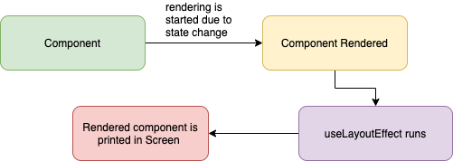
</p>

This runs synchronously immediately after React has performed all DOM mutations. This can be useful if you need to make DOM measurements (like getting the scroll position or other styles for an element) and then make DOM mutations or trigger a synchronous re-render by updating state.

As far as scheduling, this works the same way as `componentDidMount` and `componentDidUpdate`. Your code runs immediately after the DOM has been updated, but before the browser has had a chance to "paint" those changes (the user doesn\'t actually see the updates until after the browser has repainted).

*Example:*

```js
import React, { useState, useLayoutEffect } from 'react'
import ReactDOM from 'react-dom'

const BlinkyRender = () => {
  const [value, setValue] = useState(0)

  useLayoutEffect(() => {
    if (value === 0) {
      setValue(10 + Math.random() * 200)
    }
  }, [value])

  console.log('render', value)

  return (
    <div onClick={() => setValue(0)}>
      value: {value}
    </div>
  )
}

ReactDOM.render( <BlinkyRender />, document.querySelector('#root'))
```

**useLayoutEffect vs useEffect**

* **useLayoutEffect**: If you need to mutate the DOM and/or do need to perform measurements
* **useEffect**: If you don\'t need to interact with the DOM at all or your DOM changes are unobservable (seriously, most of the time you should use this).

**5. useDebugValue()**

`useDebugValue()` can be used to display a label for custom hooks in React DevTools.

*Example:*

```js
function useFriendStatus(friendID) {
  const [isOnline, setIsOnline] = useState(null)

  // ...

  // Show a label in DevTools next to this Hook
  // e.g. "FriendStatus: Online"
  useDebugValue(isOnline ? 'Online' : 'Offline')

  return isOnline
}
```

<div align="right">
    <b><a href="#">↥ back to top</a></b>
</div>

## Q. ***How to Memoize Components in React?***

*ToDo*

<div align="right">
    <b><a href="#">↥ back to top</a></b>
</div>

## Q. ***How does Axios Interceptors work in react?***

Axios interceptors are functions that Axios calls for every request. We can use interceptors to transform the request before Axios sends it, or transform the response before Axios returns the response to our code.

There are two types of interceptors:

* **request interceptor**: This is called before the actual call to the endpoint is made.
* **response interceptor**: This is called before the promise is completed and the data is received by the then callback.

**1. Request interceptor**

One common use case for a request handler is to modify or add new HTTP headers. For example, an authentication token could be injected into all requests.

*Example:*

```js
// Add request handler
const requestHandler = (request) => {
  if (isHandlerEnabled(request)) {
    // Modify request here
    request.headers['X-Auth'] = 'https://example.com/vPvKWe'
  }
  return request
}

// Enable request interceptor
axiosInstance.interceptors.request.use(
  request => requestHandler(request)
)
```

**2. Response and error interceptors**

*Example:*

```js
// Add response handlers
const errorHandler = (error) => {
  if (isHandlerEnabled(error.config)) {
    // Handle errors
  }
  return Promise.reject({ ...error })
}

const successHandler = (response) => {
  if (isHandlerEnabled(response.config)) {
    // Handle responses
  }
  return response
}

// Enable interceptors
axiosInstance.interceptors.response.use(
  response => successHandler(response),
  error => errorHandler(error)
)
```

<div align="right">
    <b><a href="#">↥ back to top</a></b>
</div>

## Q. ***How to use useSpring() for animation?***

React Spring is a spring-physics based animation library that powers most UI related animation in React. It is a bridge on the two existing React animation libraries; `React Motion` and `Animated`. It inherits animated powerful interpolations and performance while maintaining react-motion\'s ease of use.

There are 5 hooks in react-spring currently:

* `useSpring` a single spring, moves data from a -> b
* `useSprings` multiple springs, for lists, where each spring moves data from a -> b
* `useTrail` multiple springs with a single dataset, one spring follows or trails behind the other
* `useTransition` for mount/unmount transitions (lists where items are added/removed/updated)
* `useChain` to queue or chain multiple animations together

**1. useSpring()**

It turns defined values into animated values. It does this in two ways, either by overwriting the existing props with a different set of props on component re-render or by passing an updater function that returns a different set of props that is then used to update the props using set.

*Example:*

```js
import {useSpring, animated} from 'react-spring'

function App() {
  const props = useSpring({opacity: 1, from: {opacity: 0}})
  return <animated.div style={props}>I will fade in</animated.div>
}
```

**2. useSpring()**

It works kind of like a mix between useSpring and useTransition in that it takes an array, maps over it, and uses the from and to properties to assign the animation. For our styles we can just pass in the values from each item in our array.

*Example:*

```js
import React, { useState } from 'react'
import { animated, useSprings } from 'react-spring'


const App = () => {
  const [on, toggle] = useState(false)

  const items = [
    { color: 'red', opacity: .5 },
    { color: 'blue', opacity: 1 },
    { color: 'green', opacity: .2 },
    { color: 'orange', opacity: .8 },
  ]

  const springs = useSprings(items.length, items.map(item => ({
    from: { color: '#fff', opacity: 0 },
    to: {
      color: on ? item.color : '#fff',
      opacity: on ? item.opacity : 0
    }
  })))

  return (
    <div>
      {springs.map(animation => (
        <animated.div style={animation}>Hello World</animated.div>
      ))}

      <button onClick={() => toggle(!on)}>Change</button>
    </div>
  )
}
```

**3. useTrail()**

`useTrail` allows to create an effect similar to both useSpring and useSprings, it will allow us to attach an animation to multiple items but instead of being executed at the same time, they will be executed one after the other. It just takes a number for how many we want and the style object.

*Example:*

```js
import { animated, useTrail, config } from 'react-spring'

const App = () => {
  const [on, toggle] = useState(false)

  const springs = useTrail(5, {
    to: { opacity: on ? 1 : 0 },
    config: { tension: 250 }
  })

  return (
    <div>
      {springs.map((animation, index) => (
        <animated.div style={animation} key={index}>Hello World</animated.div>
      ))}

      <button onClick={() => toggle(!on)}>Change</button>
    </div>
  )
}
```

**4. useTransition()**

`useTransition` allows to create an animated transition group. It takes in the elements of the list, their keys, and lifecycles. The animation is triggered on appearance and disappearance of the elements.

*Example:*

```js
import React, { useState } from 'react'
import { animated, useTransition } from 'react-spring'

const [on, toggle] = useState(false)

const transition = useTransition(on, null, {
  from: { opacity: 0 },
  enter: { opacity: 1 },
  leave: { opacity: 0 }
})

return (
<div>
  {transition.map(({ item, key, props }) => (
  item && <animated.div style={props} >Hello world</animated.div>
  ))}

  <button onClick={() => toggle(!on)}>Change</button>
</div>
)
```

**5. useChain()**

`useChain` allows to set the execution sequence of previously defined animation hooks. To do this, you need to use `refs`, which will subsequently prevent the independent execution of the animation.

*Example:*

```js
import React, { useState, useRef } from 'react'
import { animated, useSpring, useTrail, useChain} from 'react-spring'


const App = () => {
  const [on, toggle] = useState(false)

  const springRef = useRef()
  const spring = useSpring({
    ref: springRef,
    from: { opacity: .5 },
    to: { opacity: on ? 1 : .5 },
    config: { tension: 250 }
  })

  const trailRef = useRef()
  const trail = useTrail(5, {
    ref: trailRef,
    from: { fontSize: '10px' },
    to: { fontSize: on ? '45px' : '10px' }
  })

  useChain(on ? [springRef, trailRef] : [trailRef, springRef])

  return (
    <div>
      {trail.map((animation, index) => (
        <animated.h1 style={{ ...animation, ...spring }} key={index}>Hello World</animated.h1>
      ))}

      <button onClick={() => toggle(!on)}>Change</button>
    </div>
  )
}
```

<div align="right">
    <b><a href="#">↥ back to top</a></b>
</div>

## Q. ***How to do caching in React?***

In React, caching data can be achieved in multiple ways

* Local Storage
* Redux Store
* Keep data between mouting and unmounting

**1. Memoizing Fetched Data**

Memoization is a technique we would use to make sure that we don\'t hit the API if we have made some kind of request to fetch it at some initial phase. Storing the result of expensive fetch calls will save the users some load time, therefore, increasing overall performance.

*Example:*

```js
const cache = {}

const useFetch = (url) => {
  const [status, setStatus] = useState('idle')
  const [data, setData] = useState([])

  useEffect(() => {
    if (!url) return

    const fetchData = async () => {
      setStatus('fetching')

      if (cache[url]) {
        const data = cache[url]
        setData(data)
        setStatus('fetched')
      } else {
        const response = await fetch(url)
        const data = await response.json()
        cache[url] = data // set response in cache
        setData(data)
        setStatus('fetched')
      }
    }

    fetchData()
  }, [url])

  return { status, data }
}
```

Here, we\'re mapping URLs to their data. So, if we make a request to fetch some existing data, we set the data from our local cache, else, we go ahead to make the request and set the result in the cache. This ensures we do not make an API call when we have the data available to us locally.

**2. Memoizing Data With `useRef()`**

With `useRef()`, we can set and retrieve mutable values at ease and its value persists throughout the component\'s lifecycle.

```js
const useFetch = (url) => {
  const cache = useRef({})
  const [status, setStatus] = useState('idle')
  const [data, setData] = useState([])

  useEffect(() => {
    if (!url) return

    const fetchData = async () => {
      setStatus('fetching')

      if (cache.current[url]) {
        const data = cache.current[url]
        setData(data)
        setStatus('fetched')
      } else {
        const response = await fetch(url)
        const data = await response.json()
        cache.current[url] = data // set response in cache
        setData(data)
        setStatus('fetched')
      }
    }

    fetchData()
  }, [url])

  return { status, data }
}
```

**3. Using `localStorage()`**

```js
const InitialState = {
   someState: 'a'
}
class App extends Component {

 constructor(props) {
  super(props)

  // Retrieve the last state
  this.state = localStorage.getItem("appState") ? JSON.parse(localStorage.getItem("appState")) : InitialState

}

componentWillUnmount() {
  // Remember state for the next mount
  localStorage.setItem('appState', JSON.stringify(this.state))
}

render() {
  ...
 }
}

export default App
```

**4. Keep data between mouting and unmounting**

```js
import React, { Component } from 'react'

// Set initial state
let state = { counter: 5 }

class Counter extends Component {

 constructor(props) {
  super(props)

  // Retrieve the last state
  this.state = state

  this.onClick = this.onClick.bind(this)
}

componentWillUnmount() {
  // Remember state for the next mount
  state = this.state
}

onClick(e) {
  e.preventDefault()
  this.setState(prev => ({ counter: prev.counter + 1 }))
}

render() {
  return (
    <div>
      <span>{ this.state.counter }</span>
      <button onClick={this.onClick}>Increase</button>
    </div>
  )
 }
}

export default Counter
```

<div align="right">
    <b><a href="#">↥ back to top</a></b>
</div>

#### Q. ***What is useRef() in React?***
#### Q. ***What is useHooks() in React?***
#### Q. ***How to put React in production mode?***

<br/>

### React Unit Testing

## Q. ***Explain react unit testing using Jest and Enzyme?***

**Jest**  

Jest is a JavaScript unit testing framework, used by Facebook to test services and React applications. Jest acts as a **test runner**, **assertion library**, and **mocking library**.

Jest also provides Snapshot testing, the ability to create a rendered *snapshot* of a component and compare it to a previously saved *snapshot*. The test will fail if the two do not match.

**Enzyme**

Enzyme is a JavaScript Testing utility for React that makes it easier to assert, manipulate, and traverse your React Components output. Enzyme, created by Airbnb, adds some great additional utility methods for rendering a component (or multiple components), finding elements, and interacting with elements.

**Setup with Create React App**

```bash
# for rendering snapshots
npm install  react-test-renderer --save-dev

# for dom testing
npm install enzyme --save-dev
```

```json
{
  "react": "^16.13.1",
  "@testing-library/jest-dom": "^4.2.4",
  "@testing-library/react": "^9.5.0",
  "@testing-library/user-event": "^7.2.1",
  "enzyme": "3.9",
  "jest": "24.5.0",
  "jest-cli": "24.5.0",
  "babel-jest": "24.5.0"
}
```

**Set up a React application**

```bash
npx create-react-app counter-app
```

```js
// src/App.js

import React, { Component } from 'react'

class App extends Component {
  constructor() {
    super()
    this.state = {
      count: 0,
    }
  }
  makeIncrementer = amount => () =>
    this.setState(prevState => ({
      count: prevState.count + amount,
    }))
  increment = this.makeIncrementer(1)
  render() {
    return (
      <div>
        <p>Count: {this.state.count}</p>
        <button className="increment" onClick={this.increment}>Increment count</button>
      </div>
    )
  }
}
export default App
```

**Using Enzyme**

```js
 // src/App.test.js

import React from 'react'
import { shallow } from 'enzyme'
import App from './App'

describe('App component', () => {
  it('starts with a count of 0', () => {
    const wrapper = shallow(<App />)
    const text = wrapper.find('p').text()
    expect(text).toEqual('Count: 0')
  })
})
```

**Testing User Interaction**

```js
// src/App.test.js

describe('App component', () => {

  it('increments count by 1 when the increment button is clicked', () => {
    const wrapper = shallow(<App />)
    const incrementBtn = wrapper.find('button.increment')
    incrementBtn.simulate('click')
    const text = wrapper.find('p').text()
    expect(text).toEqual('Count: 1')
  })
})
```

**[Read More]**

* [Jest Framework](https://jestjs.io/docs/en/tutorial-react)
* [Enzyme Framework](https://enzymejs.github.io/enzyme/)

<div align="right">
    <b><a href="#">↥ back to top</a></b>
</div>

## Q. ***Explain about shallow() method in enzyme?***

The `shallow()` method is used to render the single component that we are testing. It does not render child components. Simple shallow calls the `constructor()`, `render()`, `componentDidMount()` methods.

*Example*:

```js
import React from "react"
import { shallow } from "enzyme"
import Enzyme from "enzyme"
import Adapter from "enzyme-adapter-react-16"

Enzyme.configure({ adapter: new Adapter() })

function Name(props) {
  return <span>Welcome {props.name}</span>
}

function Welcome(props) {
  return (
    <h1>
      <Name name={props.name} />
    </h1>
  )
}

const wrapper = shallow(<Welcome name="Alex" />)
console.log(wrapper.debug())
```

**When not to use Shallow Rendering**

* Shallow rendering is not useful for testing the end-user experience.
* Shallow rendering is not useful for testing DOM rendering or interactions.
* Shallow rendering is not useful for integration testing.
* Shallow rendering is not useful for browser testing.
* Shallow rendering is not useful for end to end testing.

<div align="right">
    <b><a href="#">↥ back to top</a></b>
</div>

## Q. ***What is mount() method in Enzyme?***

**Full DOM rendering** generates a virtual DOM of the component with the help of a library called `jsdom`. It is useful when we want to test the behavior of a component with its children.

This is more suitable when there are components which directly interfere with DOM API or lifecycle methods of React. Simple mount calls the `constructor()`, `render()`, `componentDidMount()` methods.

*Example*:

```js
...
import ListItem from './ListItem'
...

return (
    <ul className="list-items">
      {items.map(item => <ListItem key={item} item={item} />)}
    </ul>
)
```

```js
import React from 'react'
import { mount } from '../enzyme'
import List from './List'

describe('List tests', () => {

  it('renders list-items', () => {
    const items = ['one', 'two', 'three']

    const wrapper = mount(<List items={items} />)

    // Let's check what wrong in our instance
    console.log(wrapper.debug())

    // Expect the wrapper object to be defined
    expect(wrapper.find('.list-items')).toBeDefined()
    expect(wrapper.find('.item')).toHaveLength(items.length)
  })

  ...
})
```

<div align="right">
    <b><a href="#">↥ back to top</a></b>
</div>

## Q. ***What is render() method in Enzyme?***

**Static rendering** is used to render react components to static HTML. It\'s implemented using a library called **Cheerio**. It renders the children. But this does not have access to React lifecycle methods.

For static rendering, we can not access to Enzyme API methods such as `contains()` and `debug()`. However we can access to the full arsenal of Cheerios manipulation and traversal methods such as `addClass()` and `find()` respectively.

*Example*:

```js
import React from 'react'
import { render } from '../enzyme'

import List from './List'
import { wrap } from 'module'

describe('List tests', () => {

  it('renders list-items', () => {
    const items = ['one', 'two', 'three']
    const wrapper = render(<List items={items} />)

    wrapper.addClass('foo')
    // Expect the wrapper object to be defined
    expect(wrapper.find('.list-items')).toBeDefined()
    expect(wrapper.find('.item')).toHaveLength(items.length)
  })

  ...
})
```

<div align="right">
    <b><a href="#">↥ back to top</a></b>
</div>

## Q. ***What is the purpose of the ReactTestUtils package?***

**ReactTestUtils** is used to test React-based components. It can simulate all the JavaScript-based events, which ReactJS supports. Some of its frequently methods are

* `act()`
* `mockComponent()`
* `isElement()`
* `isElementOfType()`
* `isDOMComponent()`
* `renderIntoDocument()`
* `Simulate()`

**act()**

To prepare a component for assertions, wrap the code rendering it and performing updates inside an act() call. This makes your test run closer to how React works in the browser.

```js
class Counter extends React.Component {
  constructor(props) {
    super(props)
    this.state = {count: 0}
    this.handleClick = this.handleClick.bind(this)
  }
  componentDidMount() {
    document.title = `You clicked ${this.state.count} times`
  }
  componentDidUpdate() {
    document.title = `You clicked ${this.state.count} times`
  }
  handleClick() {
    this.setState(state => ({
      count: state.count + 1,
    }))
  }
  render() {
    return (
      <div>
        <p>You clicked {this.state.count} times</p>
        <button onClick={this.handleClick}>
          Click me
        </button>
      </div>
    )
  }
}
```

```js
import React from 'react'
import ReactDOM from 'react-dom'
import { act } from 'react-dom/test-utils'
import Counter from './Counter'

let container

beforeEach(() => {
  container = document.createElement('div')
  document.body.appendChild(container)
})

afterEach(() => {
  document.body.removeChild(container)
  container = null
})

it('can render and update a counter', () => {
  // Test first render and componentDidMount
  act(() => {
    ReactDOM.render(<Counter />, container)
  })
  const button = container.querySelector('button')
  const label = container.querySelector('p')
  expect(label.textContent).toBe('You clicked 0 times')
  expect(document.title).toBe('You clicked 0 times')

  // Test second render and componentDidUpdate
  act(() => {
    button.dispatchEvent(new MouseEvent('click', {bubbles: true}))
  })
  expect(label.textContent).toBe('You clicked 1 times')
  expect(document.title).toBe('You clicked 1 times')
})
```

<div align="right">
    <b><a href="#">↥ back to top</a></b>
</div>

## Q. ***What is react-test-renderer package in React?***

This package provides a React renderer that can be used to render React components to pure JavaScript objects, without depending on the DOM or a native mobile environment.

Essentially, this package makes it easy to grab a snapshot of the platform view hierarchy (similar to a DOM tree) rendered by a React DOM or React Native component without using a browser or `jsdom`.

*Example*:

```js
import React from 'react'
import renderer from 'react-test-renderer'
import App from './app.js' // The component being tested

/**
 * Snapshot tests are a useful when UI does not change frequently.
 *
 * A typical snapshot test case for a mobile app renders a UI component, takes a snapshot,
 * then compares it to a reference snapshot file stored alongside the test.
 */
describe('APP Component', () => {

    test('Matches the snapshot', () => {
      const tree = renderer.create(<App />).toJSON()
      expect(tree).toMatchSnapshot()
    })
}
```

<div align="right">
    <b><a href="#">↥ back to top</a></b>
</div>

## Q. ***Why should we use Test-Driven Development (TDD) for ReactJS?***

Test-driven development is an approach when developers create a product backwards. TDD requires developers to write tests first and only then start to write the code. TDD is a development method that utilizes repetition of a short development cycle called Red-Green-Refactor.

**Process:**

1. Add a test
1. Run all tests and see if the new test fails (red)
1. Write the code to pass the test (green)
1. Run all tests
1. Refactor
1. Repeat

**Pros:**

1. Design before implementation
1. Helps prevent future regressions and bugs
1. Increases confidence that the code works as expected

**Cons:**

1. Takes longer to develop (but it can save time in the long run)
1. Testing edge cases is hard
1. Mocking, faking, and stubbing are all even harder

<div align="right">
    <b><a href="#">↥ back to top</a></b>
</div>

## Q. ***What are the benefits of using data-test selector over className or Id selector in Jest?***

HTML structure and css classes tend to change due to design changes. Which will cause to re-write tests quite often. Also, if we are using css-modules we can not rely on class names. Because of that, React provides `data-test` attribute for selecting elements in jsx.

```js
// APP Component
import React from 'react'
import './App.scss'

function App() {
  return (
    <div data-test='app-header'>
      Hello React
    </div>
  )
}
export default App
```

```js
import React from 'react'
import { shallow } from 'enzyme'
import App from './App'


describe('APP Component', () => {

  test('title', () => {
    let wrapper = shallow(<APP />)
    let title = wrapper.find(`[data-test='app-header']`).text()

    expect(title).toMatch('Hello React')
  })

})
```

<div align="right">
    <b><a href="#">↥ back to top</a></b>
</div>

## Q. ***What is service worker in React.js?***

*ToDo*

<div align="right">
    <b><a href="#">↥ back to top</a></b>
</div>

<br/>

## Redux Questions

## Q. ***What is Redux?***

Redux is a predictable state container for JavaScript applications. It helps you write applications that behave consistently, run in different environments (client, server, and native), and are easy to test.

Simply put, Redux is a state management tool. While it is mostly used with React, it can be used with any other JavaScript framework or library. With Redux, the state of your application is kept in a store, and each component can access any state that it needs from this store.

**How Redux works**

There is a central store that holds the entire state of the application. Each component can access the stored state without having to send down props from one component to another. There are three building parts: actions, store, and reducers.

**Benefits and limitations of Redux**

**1. State transfer**

State is stored together in a single place called the ‘store.’ While you do not need to store all the state variables in the ‘store,’ it is especially important to when state is being shared by multiple components or in a more complex architecture. It also allows you to call state data from any component easily.

**2. Predictability**

Redux is “a predictable state container for Javascript apps.” Because reducers are pure functions, the same result will always be produced when a state and action are passed in.

**3. Maintainability**

Redux provides a strict structure for how the code and state should be managed, which makes the architecture easy to replicate and scale for somebody who has previous experience with Redux.

**4. Ease of testing and debugging**

Redux makes it easy to test and debug your code since it offers powerful tools such as Redux DevTools in which you can time travel to debug, track your changes, and much more to streamline your development process.

<div align="right">
    <b><a href="#">↥ back to top</a></b>
</div>

## Q. ***Explain pros and cons of Redux?***

**Pros using redux**

* Central store, any component can access any state from the store, there is no need of passing props back and forth.
* Another way to look at centralised store, it persists the state of a component even after the component has  unmounted.
* Prevents unnecessary re-renders, as when the state changes it returns new state which uses shallow copy.
* Testing will be easy as UI and data management are separated.
* History of state is maintained which helps in implementing features like undo very easily.

**Cons using redux**

* No encapsulation. Any component can access the data which can cause security issues.
* Boilerplate code. Restricted design.
* As state is immutable in redux, the reducer updates the state by returning a new state every time which can cause excessive use of memory.

<div align="right">
    <b><a href="#">↥ back to top</a></b>
</div>

## Q. ***What are redux core concepts?***

<p align="center">
  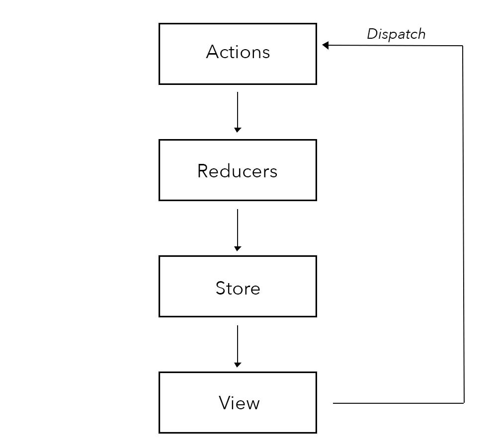
</p>

**1. Actions in Redux**

Action is static information about the event that initiates a state change. When you update your state with Redux, you always start with an action. Actions are in the form of Javascript objects, containing a `type` and an optional `payload`. Actions are sent using the `store.dispatch()` method. Actions are created via an action creator.

**Action creators** are simple functions that help to create actions. They are functions that return action objects, and then, the returned object is sent to various reducers in the application.

*Example:*

```js
const setLoginStatus = (name, password) => {
  return {
    type: "LOGIN",
    payload: {
      username: "foo",
      password: "bar"
    }
  }
}
```

**2. Reducers in Redux**

Reducers are pure functions that take the current state of an application, perform an action, and return a new state. These states are stored as objects, and they specify how the state of an application changes in response to an action sent to the store.

It is based on the reduce function in JavaScript, where a single value is calculated from multiple values after a callback function has been carried out.

```js
const LoginComponent = (state = initialState, action) => {
    switch (action.type) {

      // This reducer handles any action with type "LOGIN"
      case "LOGIN":
          return state.map(user => {
              if (user.username !== action.username) {
                  return user
              }

              if (user.password == action.password) {
                  return {
                      ...user,
                      login_status: "LOGGED IN"
                  }
              }
          });
      default:
          return state;
      }
}
```

**combine multiple reducers**: The `combineReducers()` helper function turns an object whose values are different reducing functions into a single reducing function you can pass to createStore.

*Syntax*

```js
const rootReducert = combineReducer(reducer1, reducer2)
```

**3. Store in Redux**

A Store is an object that holds the whole state tree of your application. The Redux store is the application state stored as objects. Whenever the store is updated, it will update the React components subscribed to it. The store has the responsibility of storing, reading, and updating state.

*Example:*

```js
import React from 'react'
import { render } from 'react-dom'
import { Provider } from 'react-redux'
import { createStore } from 'redux'
import rootReducer from './reducers'
import App from './components/App'

const store = createStore(rootReducer)
 render (
   <provider store="{store}">
     <app>
   </app></provider>,
   document.getElementById('root')
 )
```

When using Redux with React, states will no longer need to be lifted up; thus, it makes it easier to trace which action causes any change.

**4. Dispatch**

Dispatch is a method that triggers an action with type and payload to Reducer.

```js
store.dispatch() 
```

**5. Subscribe**

Subscribe is a method that is used to subscribe data/state from the Store.

```js
store.subscribe()
```

**6. Provider**

The Provider is a component that has a reference to the Store and provides the data from the Store to the component it wraps.

**7. Connect**

Connect is a function that communicates with the Provider.

**8. Middleware**

Middleware is the suggested way to extend Redux with custom functionality. Middlewares are used to dispatch async functions. We configure Middleware\'s while creating a store.

*Syntax*

```js
const store = createStore(reducers, initialState, middleware);
```

<div align="right">
    <b><a href="#">↥ back to top</a></b>
</div>

## Q. ***What is the typical flow of data like in a React + Redux app?***

*ToDo*

<div align="right">
    <b><a href="#">↥ back to top</a></b>
</div>

## Q. ***What is an action?***

*ToDo*

<div align="right">
    <b><a href="#">↥ back to top</a></b>
</div>

## Q. ***What do you understand by "Single source of truth" in Redux?***

The single source of truth is our state tree, that is not rewritten or reshaped. It gives us the availability to easily retrieve information in constant time and maintain a clean structure for the state of our application.

In React-Redux applications, when your Redux is a single source of truth, it means that the only way to change your data in UI is to dispatch redux action which will change state within redux reducer. And your React components will watch this reducer and if that reducer changes, then UI will change itself too. But never other way around, because Redux state is single source of truth.

<p align="center">
  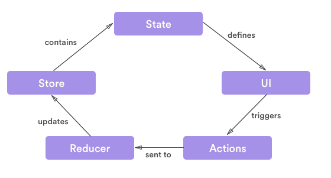
</p>

A practical example would be that you have Redux store which contains items you want to display. In order to change list of items to be displayed, you don\'t change this data anywhere else other than store. And if that is changed, everything else related to it, should change as well.

<div align="right">
    <b><a href="#">↥ back to top</a></b>
</div>

## Q. ***What are the features of Workflow in Redux?***

When using Redux with React, states will no longer need to be lifted up. Everything is handled by Redux. Redux simplifies the app and makes it easier to maintain.

* Redux offers a solution for storing all your application state in one place, called a **store**.
* Components then **dispatch** state changes to the store, not directly to other components.
* The components that need to be aware of state changes can subscribe to the store.
* The **store** can be thought of as a "middleman" for all state changes in the application.
* With Redux involved, components don\'t communicate directly with each other. Rather, all state changes must go  through the single source of truth, the **store**.

**Core Principal**

Redux has three core principals:

**1. Single Source of Truth**: The state of your whole application is stored in an object tree within a single **store**.  
**2. State Is Read-Only**: The only way to change the state is to dispatch an **action**, an object describing what happened.  
**3. Changes Are Made With Pure Functions**: To specify how the state tree is transformed by actions, you write pure **reducers**.  

**Redux Workflow**

Redux allows you to manage the state of the application using Store. A child component can directly access the state from the Store.

The following are details of how Redux works:

* When UI Event triggers (OnClick, OnChange, etc) it can dispatch Actions based on the event.
* Reducers process Actions and return a new state as an Object.
* The new state of the whole application goes into a single Store.
* Components can easily subscribe to the Store.

<p align="center">
  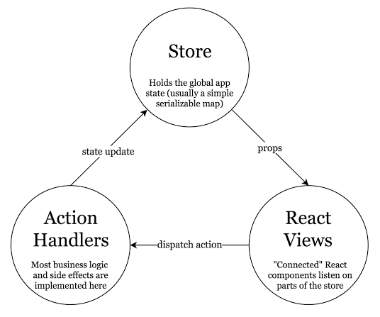
</p>

<div align="right">
    <b><a href="#">↥ back to top</a></b>
</div>

## Q. ***What is the difference between Component and Container in Redux?***

*ToDo*

<div align="right">
    <b><a href="#">↥ back to top</a></b>
</div>

## Q. ***What is Redux Thunk used for?***

Redux Thunk is a **middleware** that lets you call action creators that return a function instead of an action object. That function receives the store\'s dispatch method, which is then used to dispatch regular synchronous actions inside the body of the function once the asynchronous operations have completed. The inner function receives the store methods `dispatch()` and `getState()` as parameters.

**Setup**

```bash
# install create react app
npm install -g create-react-app

# Create a React App
create-react-app my-simple-async-app

# Switch directory
cd my-simple-app

# install Redux-Thunk
npm install --save redux react-redux redux-thunk
```

*Example:*

We are going to use Redux Thunk to asynchronously fetch the most recently updated repos by username from Github using this REST URL:

https://api.github.com/users/learning-zone/repos?sort=updated

```js
import { applyMiddleware, combineReducers, createStore } from 'redux'

import thunk from 'redux-thunk'

// actions.js
export const addRepos = repos => ({
  type: 'ADD_REPOS',
  repos,
})

export const clearRepos = () => ({ type: 'CLEAR_REPOS' })

export const getRepos = username => async dispatch => {
  try {
    const url = `https://api.github.com/users/${username}/repos?sort=updated`
    const response = await fetch(url)
    const responseBody = await response.json()
    dispatch(addRepos(responseBody))
  } catch (error) {
    console.error(error)
    dispatch(clearRepos())
  }
}

// reducers.js
export const repos = (state = [], action) => {
  switch (action.type) {
    case 'ADD_REPOS':
      return action.repos
    case 'CLEAR_REPOS':
      return []
    default:
      return state
  }
}

export const reducers = combineReducers({ repos })

// store.js
export function configureStore(initialState = {}) {
  const store = createStore(reducers, initialState, applyMiddleware(thunk))
  return store
}

export const store = configureStore()
```

`applyMiddleware(thunk)`: This tells redux to accept and execute functions as return values. Redux usually only accepts objects like { type: 'ADD_THINGS', things: ['list', 'of', 'things'] }.

The middleware checks if the action\'s return value is a function and if it is it will execute the function and inject a callback function named dispatch. This way you can start an asynchronous task and then use the dispatch callback to return a regular redux object action some time in the future.

```js
// This is your typical redux sync action
function syncAction(listOfThings) {
  return { type: 'ADD_THINGS', things: listOfThings  }
}

// This would be the async version
// where we may need to go fetch the
// list of things from a server before
// adding them via the sync action
function asyncAction() {
  return function(dispatch) {
    setTimeout(function() {
      dispatch(syncAction(['list', 'of', 'things']))
    }, 1000)
  }
}
```

**App.js**

```js
import React, { Component } from 'react'

import { connect } from 'react-redux'

import { getRepos } from './redux'

// App.js
export class App extends Component {
  state = { username: 'learning-zone' }

  componentDidMount() {
    this.updateRepoList(this.state.username)
  }

  updateRepoList = username => this.props.getRepos(username)

  render() {
    return (
      <div>
        <h1>I AM AN ASYNC APP!!!</h1>

        <strong>Github username: </strong>
        <input
          type="text"
          value={this.state.username}
          onChange={ev => this.setState({ username: ev.target.value })}
          placeholder="Github username..."
        />
        <button onClick={() => this.updateRepoList(this.state.username)}>
          Get Lastest Repos
        </button>

        <ul>
          {this.props.repos.map((repo, index) => (
            <li key={index}>
              <a href={repo.html_url} target="_blank">
                {repo.name}
              </a>
            </li>
          ))}
        </ul>

      </div>
    )
  }
}

// AppContainer.js
const mapStateToProps = (state, ownProps) => ({ repos: state.repos })
const mapDispatchToProps = { getRepos }
const AppContainer = connect(mapStateToProps, mapDispatchToProps)(App)

export default AppContainer
```

**index.js**

```js
import React from 'react'
import ReactDOM from 'react-dom'
import AppContainer from './App'
import './index.css'

// Add these imports - Step 1
import { Provider } from 'react-redux'
import { store } from './redux'

// Wrap existing app in Provider - Step 2
ReactDOM.render(
  <Provider store={store}>
    <AppContainer />
  </Provider>,
  document.getElementById('root')
)
```

<div align="right">
    <b><a href="#">↥ back to top</a></b>
</div>

## Q. ***What is difference between presentational component and container component in react redux?***

**1. Container Components**

* Container components are primarily concerned with how things work
* They rarely have any HTML tags of their own, aside from a wrapping `<div>`
* They are often stateful
* They are responsible for providing data and behavior to their children (usually presentational components)

Container is an informal term for a React component that is `connect`-ed to a redux store. Containers receive Redux state updates and `dispatch` actions, and they usually don\'t render DOM elements; they delegate rendering to **presentational** child components.

*Example:*

```js
class Collage extends Component {
   constructor(props) {
      super(props);

      this.state = {
         images: []
      };
   }
   componentDidMount() {
      fetch('/api/current_user/image_list')
         .then(response => response.json())
         .then(images => this.setState({images}));
   }
   render() {
      return (
         <div className="image-list">
            {this.state.images.map(image => {
               <div className="image">
                  
               </div>
            })}
         </div>
      )
   }
}
```

**2. Presentational Components**

* Presentational Components are primarily concerned with how things look
* Probably only contain a render method and little else logic
* They do not know how to load or alter the data that they render
* They are best written as stateless functional components

*Example:*

```js
//defining the component as a React Component
class Image extends Component {
   render() {
      return ;
   }
}
export default Image
//defining the component as a constant
const Image = props => (
   
)
export default Image
```

<div align="right">
    <b><a href="#">↥ back to top</a></b>
</div>

## Q. ***Explain the role of Reducer?***

A reducer is a function that determines changes to an application\'s state. It uses the action it receives to determine this change. Redux manage an application\'s state changes in a single store so that they behave consistently. Redux relies heavily on reducer functions that take the previous state and an action in order to execute the next state.

**1. State**

State changes are based on a user\'s interaction, or even something like a network request. If the application\'s state is managed by Redux, the changes happen inside a reducer function — this is the only place where state changes happen. The reducer function makes use of the initial state of the application and something called action, to determine what the new state will look like.

*Syntax*

```js
const contactReducer = (state = initialState, action) => {
  // Do something
}
```

**2. State Parameter**

The state parameter that gets passed to the reducer function has to be the current state of the application. In this case, we\'re calling that our initialState because it will be the first (and current) state and nothing will precede it.

```js
contactReducer(initialState, action)
```

*Example:*

Let\'s say the initial state of our app is an empty list of contacts and our action is adding a new contact to the list.

```js
const initialState = {
  contacts: []
}
```

**3. Action Parameter**

An action is an object that contains two keys and their values. The state update that happens in the reducer is always dependent on the value of action.type.

```js
const action = {
  type: 'NEW_CONTACT',
  name: 'Alex K',
  location: 'Lagos Nigeria',
  email: 'alex@example.com'
}
```

There is typically a `payload` value that contains what the user is sending and would be used to update the state of the application. It is important to note that `action.type` is required, but `action.payload` is optional. Making use of `payload` brings a level of structure to how the action object looks like.

**4. Updating State**

The state is meant to be immutable, meaning it shouldn\'t be changed directly. To create an updated state, we can make use of `Object.assign()` or opt for the **spread operator**.

*Example:*

```js
const contactReducer = (state, action) => {
  switch (action.type) {
    case 'NEW_CONTACT':
    return {
        ...state, contacts:
        [...state.contacts, action.payload]
    }
    default:
      return state
  }
}
```

This ensures that the incoming state stays intact as we append the new item to the bottom.

```js
const initialState = {
  contacts: [{
    name: 'Alex K',
    age: 26
  }]
}

const contactReducer = (state = initialState, action) => {
  switch (action.type) {
    case "NEW_CONTACT":
      return Object.assign({}, state, {
        contacts: [...state.contacts, action.payload]
      });
    default:
      return state
  }
}

class App extends React.Component {
  constructor(props) {
    super(props)
    this.name = React.createRef()
    this.age = React.createRef()
    this.state = initialState
  }

  handleSubmit = e => {
    e.preventDefault()
    const action = {
      type: "NEW_CONTACT",
      payload: {
        name: this.name.current.value,
        age: this.age.current.value
      }
    }
    const newState = contactReducer(this.state, action)
    this.setState(newState)
  }

  render() {
    const { contacts } = this.state
    return (
      <div className="box">
        <div className="content">
          <pre>{JSON.stringify(this.state, null, 2)}</pre>
        </div>

        <div className="field">
          <form onSubmit={this.handleSubmit}>
            <div className="control">
              <input className="input" placeholder="Full Name" type="text" ref={this.name} />
            </div>
            <div className="control">
              <input className="input" placeholder="Age" type="number" ref={this.age} />
            </div>
            <div>
              <button type="submit" className="button">Submit</button>
            </div>
          </form>
        </div>
      </div>
    )
  }
}


ReactDOM.render(
  <App />,
  document.getElementById('root')
)
```

<div align="right">
    <b><a href="#">↥ back to top</a></b>
</div>

## Q. ***What are Pure Functions and why should the reducer be a "pure" function?***

**Pure Functions**

Any function that doesn\'t alter input data and that doesn\'t depend on external state (like a database, DOM, or global variable) and consistently provides the same output for the same input is a "pure" function.

A  pure function adheres to the following rules:

* A function returns the same result for same arguments.
* Its evaluation has no side effects, i.e., it does not alter input data.
* No mutation of local & global variables.
* It does not depend on the external state like a global variable.

*Example:*

The below `add()` function doesn\'t alter “a” or “b”, doesn\'t depending on external state, and always returns the same output for the same input.

```js
const add = (a, b) => a + b //pure function
```

**Why Reducer must be pure function**

Redux takes a given state (object) and passes it to each reducer in a loop. And it expects a brand new object from the reducer if there are any changes. And it also expects to get the old object back if there are no changes.

Redux simply checks whether the old object is the same as the new object by comparing the memory locations of the two objects. So if you mutate the old object\'s property inside a reducer, the "new state" and the "old state" will both point to the same object. Hence Redux thinks nothing has changed! So this won\'t work.

<div align="right">
    <b><a href="#">↥ back to top</a></b>
</div>

## Q. ***How to split the reducers?***

Putting all your update logic into a single reducer function is quickly going to become unmaintainable. While there\'s no single rule for how long a function should be, it\'s generally agreed that functions should be relatively short and ideally only do one specific thing. It\'s good programming practice to take pieces of code that are very long or do many different things, and break them into smaller pieces that are easier to understand.

In Redux reducer, we can split some of our reducer logic out into another function, and call that new function from the parent function. These new functions would typically fall into one of three categories:

1. Small utility functions containing some reusable chunk of logic that is needed in multiple places (which may or may not be actually related to the specific business logic)
2. Functions for handling a specific update case, which often need parameters other than the typical (state, action) pair
3. Functions which handle all updates for a given slice of state. These functions do generally have the typical  (state, action) parameter signature

These terms will be used to distinguish between different types of functions and different use cases:

* **reducer**: any function with the signature `(state, action) -> newState` (ie, any function that could be used as an argument to `Array.prototype.reduce`)
* **root reducer**: the reducer function that is actually passed as the first argument to `createStore`. This is the only part of the reducer logic that must have the `(state, action) -> newState` signature.
* **slice reducer**: a reducer that is being used to handle updates to one specific slice of the state tree, usually done by passing it to `combineReducers`
* **case function**: a function that is being used to handle the update logic for a specific action. This may actually be a reducer function, or it may require other parameters to do its work properly.
* **higher-order reducer**: a function that takes a reducer function as an argument, and/or returns a new reducer  function as a result (such as `combineReducers`, or `redux-undo`).

**Benefits**

* **For fast page loads**

Splitting reducers will have and advantage of loading only required part of web application which in turn makes it very efficient in rendering time of main pages

* **Organization of code**

Splitting reducers on page level or component level will give a better code organization instead of just putting all reducers at one place. Since reducer is loaded only when page/component is loaded will ensure that there are standalone pages which are not dependent on other parts of the application.

* **One page/component**

One reducer design pattern. Things are better written, read and understood when they are modular. With dynamic reducers, it becomes possible to achieve it.

* **SEO**

With reducer level code-splitting, reducers can be code split on a split component level which will reduce the loading time of website thereby increasing SEO rankings.

<div align="right">
    <b><a href="#">↥ back to top</a></b>
</div>

## Q. ***How to create action creators react with redux?***

**Action Type**

An action type is a string that simply describes the type of an action. They\'re commonly stored as constants or collected in enumerations to help reduce typos.

*Example:*

```js
export const Actions = {
  GET_USER_DETAILS_REQUEST: 'GET_USER_DETAILS_REQUEST',
  GET_USER_DETAILS_SUCCESS: 'GET_USER_DETAILS_SUCCESS',
  GET_USER_DETAILS_FAILURE: 'GET_USER_DETAILS_FAILURE',
  ...
}
```

**Action**

An action is like a message that we send (i.e. dispatch) to our central Redux store. It can literally be anything. But ideally we want to stick to an agreed-upon pattern. And the standard pattern is as follows (this is a TypeScript type declaration):

```ts
type Action = {
    type: string;    // Actions MUST have a type
    payload?: any;   // Actions MAY have a payload
    meta?: any;      // Actions MAY have meta information
    error?: boolean; // Actions MAY have an error field
                     // when true, payload SHOULD contain an Error
}
```

An action to fetch the user named "Alex" might look something like this

```js
{
    type: 'GET_USER_DETAILS_REQUEST',
    payload: 'Alex'
}
```

**Action Creator**

```js
export const getUserDetailsRequest = id => ({
  type: Actions.GET_USER_DETAILS_REQUEST,
  payload: id,
})
```

When writing basic Redux, an action creator simply returns an action. You would typically dispatch the action to your store immediately.

```js
store.dispatch(getUserDetailsRequest('Alex'))
```

Although, realistically, you\'ll be doing this via dispatch properties that are passed into a React component like this:

```js
// ES6
export const mapDispatchToProps = dispatch => ({
  onClick: () => dispatch(getUserDetailsRequest('Alex'))
})
```

<div align="right">
    <b><a href="#">↥ back to top</a></b>
</div>
## 12Q. ***How to set the dataflow using react with redux?***

<p align="center">
  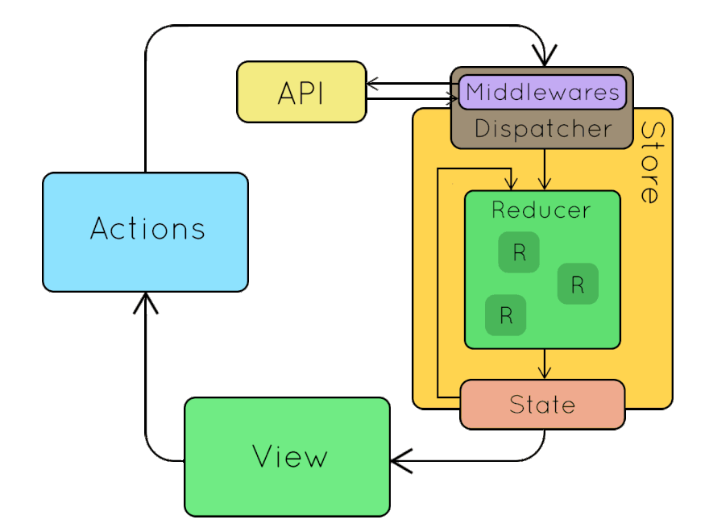
</p>

Redux offers this data sharing of components possible by maintaining one single state in the store. A single source of truth. All the components which want to get state data at some point are subscribed to the store and they will receive the state each time it gets updated.

Redux has five main entities. Action Creators, Dispatching Function, Reducers, State and Store.

* An action is dispatched when a user interacts with the application.
* The root reducer function is called with the current state and the dispatched action. The root reducer may divide the task among smaller reducer functions, which ultimately returns a new state.
* The store notifies the view by executing their callback functions.
* The view can retrieve updated state and re-render again.

<div align="right">
    <b><a href="#">↥ back to top</a></b>
</div>

## Q. ***What are the three principles that Redux follows?***

Redux can be described in three fundamental principles:

**1. Single source of truth**

> The state of your whole application is stored in an object tree inside a single store.

This makes it easy to create universal apps, as the state from your server can be serialized and hydrated into the client with no extra coding effort. A single state tree also makes it easier to debug or inspect an application; it also enables you to persist your app\'s state in development, for a faster development cycle.

*Example:*

```js
console.log(store.getState())

/* Prints
{
  visibilityFilter: 'SHOW_ALL',
  todos: [
    {
      text: 'Consider using Redux',
      completed: true,
    },
    {
      text: 'Keep all state in a single tree',
      completed: false
    }
  ]
}
*/
```

**2. State is read-only**

> The only way to change the state is to emit an action, an object describing what happened.

This ensures that neither the views nor the network callbacks will ever write directly to the state. Instead, they express an intent to transform the state. Because all changes are centralized and happen one by one in a strict order, there are no subtle race conditions to watch out for.

*Example:*

```js
store.dispatch({
  type: 'COMPLETE_TODO',
  index: 1
})

store.dispatch({
  type: 'SET_VISIBILITY_FILTER',
  filter: 'SHOW_COMPLETED'
})
```

**3. Changes are made with pure functions**

> To specify how the state tree is transformed by actions, you write pure reducers.

Reducers are just pure functions that take the previous state and an action, and return the next state. Remember to return new state objects, instead of mutating the previous state. You can start with a single reducer, and as your app grows, split it off into smaller reducers that manage specific parts of the state tree.

```js
import { combineReducers, createStore } from 'redux'

function visibilityFilter(state = 'SHOW_ALL', action) {
  switch (action.type) {
    case 'SET_VISIBILITY_FILTER':
      return action.filter
    default:
      return state
  }
}

function todos(state = [], action) {
  switch (action.type) {
    case 'ADD_TODO':
      return [
        ...state,
        {
          text: action.text,
          completed: false
        }
      ]
    case 'COMPLETE_TODO':
      return state.map((todo, index) => {
        if (index === action.index) {
          return Object.assign({}, todo, {
            completed: true
          })
        }
        return todo
      })
    default:
      return state
  }
}

const reducer = combineReducers({ visibilityFilter, todos })
const store = createStore(reducer)
```

<div align="right">
    <b><a href="#">↥ back to top</a></b>
</div>

## Q. ***How can I represent "side effects" such as AJAX calls? Why do we need things like "action creators", "thunks", and "middleware" to do async behavior?***

Any meaningful web app needs to execute complex logic, usually including asynchronous work such as making AJAX requests. That code is no longer purely a function of its inputs, and the interactions with the outside world are known as "side effects".

Redux is inspired by functional programming, and out of the box, has no place for side effects to be executed. In particular, reducer functions must always be pure functions of `(state, action) => newState`. However, Redux\'s middleware (eg. **Redux Thunk**, **Redux Saga**) makes it possible to intercept dispatched actions and add additional complex behavior around them, including side effects.

<div align="right">
    <b><a href="#">↥ back to top</a></b>
</div>

## Q. ***What is the '@' (at symbol) in the Redux @connect decorator?***

Decorators make it possible to annotate and modify classes and properties at design time.

Here\'s an example of setting up Redux without and with a decorator:

**Without a decorator**

```js
import React from 'react'
import * as actionCreators from './actionCreators'
import { bindActionCreators } from 'redux'
import { connect } from 'react-redux'

function mapStateToProps(state) {
  return { todos: state.todos }
}

function mapDispatchToProps(dispatch) {
  return { actions: bindActionCreators(actionCreators, dispatch) }
}

class MyApp extends React.Component {
  // ...define your main app here
}

export default connect(mapStateToProps, mapDispatchToProps)(MyApp)
```

**Using a decorator**

```js
import React from 'react'
import * as actionCreators from './actionCreators'
import { bindActionCreators } from 'redux'
import { connect } from 'react-redux'

function mapStateToProps(state) {
  return { todos: state.todos }
}

function mapDispatchToProps(dispatch) {
  return { actions: bindActionCreators(actionCreators, dispatch) }
}

@connect(mapStateToProps, mapDispatchToProps)
export default class MyApp extends React.Component {
  // ...define your main app here
}
```

<div align="right">
    <b><a href="#">↥ back to top</a></b>
</div>

## Q. ***What is the difference between React State vs Redux State?***

React state is stored locally within a component. When it needs to be shared with other components, it is passed down through props. In practice, this means that the top-most component in your app needing access to a mutable value will hold that value in its state. If it can be mutated by subcomponents, you must pass a callback to handle the change into subcomponents.

When using Redux, state is stored globally in the Redux store. Any component that needs access to a value may subscribe to the store and gain access to that value. Typically, this is done using container components. This centralizes all data but makes it very easy for a component to get the state it needs, without surrounding components knowing of its needs.

<div align="right">
    <b><a href="#">↥ back to top</a></b>
</div>

## Q. ***What is the best way to access redux store outside a react component?***

To access redux store outside a react component, Redux `connect` function works great for regular React components.

In the examples below shows how to access a JWT token from the Redux store.

**Option 1: Export the Store**

```js
import { createStore } from 'redux'
import reducer from './reducer'

const store = createStore(reducer)

export default store
```

Here, we are creating the store and exporting it. This will make it available to other files. Here we\'ll see an `api` file making a call where we need to pass a JWT token to the server:

```js
import store from './store'

export function getProtectedThing() {
  // grab current state
  const state = store.getState()

  // get the JWT token out of it
  // (obviously depends on how your store is structured)
  const authToken = state.currentUser.token

  // Pass the token to the server
  return fetch('/user/thing', {
    method: 'GET',
    headers: {
      Authorization: `Bearer ${authToken}`
    }
  }).then(res => res.json())
}
```

**Option 2: Pass the Value From a React Component**

It\'s simple to get access to the store inside a React component – no need to pass the store as a prop or import it, just use the `connect()` function from React Redux, and supply a `mapStateToProps()` function that pulls out the data.

```js
import React from 'react'
import { connect } from 'react-redux'
import * as api from 'api'

const ItemList = ({ authToken, items }) => {
  return (
    <ul>
      {items.map(item => (
        <li key={item.id}>
          {item.name}
          <button
            onClick={
              () => api.deleteItem(item, authToken)
            }>
            DELETE THIS ITEM
          </button>
        </li>
      )}
    </ul>
  )
}

const mapStateToProps = state => ({
  authToken: state.currentUser && state.currentUser.authToken,
  items: state.items
})

export connect(mapStateToProps)(ItemList)
```

<div align="right">
    <b><a href="#">↥ back to top</a></b>
</div>

## Q. ***What are the drawbacks of Redux contrasted with Flux?***

<p align="center">
  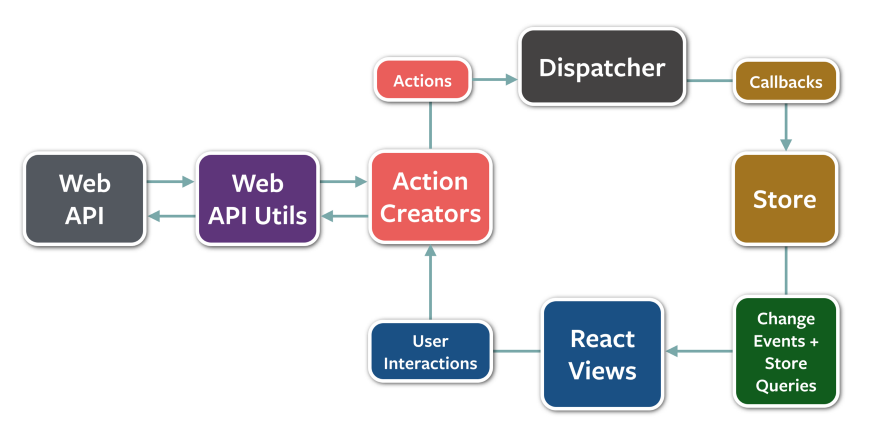
</p>

Flux is application architecture or pattern designed, developed and used by Facebook for building user interface or client-side web application. Flux follows unidirectional data flow which supports or empowers composable view of React\'s components.

**Flux Architecture**

The Flux architecture is based on the following components:

* **Store/ Stores**: Serves as a container for the app state & logic
* **Action**: Enables data passing to the dispatcher
* **View**: Same as the view in MVC architecture, but in the context of React components
* **Dispatcher**: Coordinates actions & updates to stores

<p align="center">
  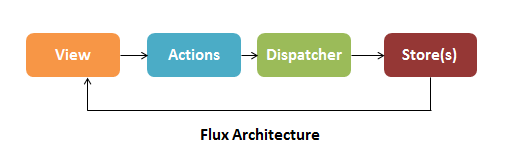
</p>

In the Flux architecture, when a user clicks on something, the view creates actions. Action can create new data and send it to the dispatcher. The dispatcher then dispatches the action result to the appropriate store. The store updates the state based on the result and sends an update to the view.

**Redux Architecture**

Redux is a library, which implements the idea of Flux but in quite a different way. Redux architecture introduces new components like:

* **Reducer**: Logic that decides how your data changes exist in pure functions
* **Centralized store**: Holds a state object that denotes the state of the entire app

<p align="center">
  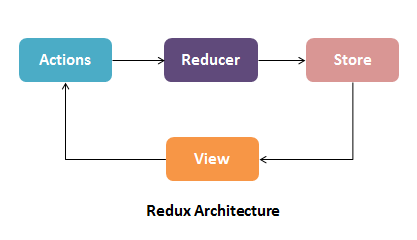
</p>

In Redux architecture, application event is denoted as an Action, which is dispatched to the reducer, the pure function. Then reducer updates the centralized store with new data based on the kind of action it receives. Store creates a new state and sends an update to view. At that time, the view was recreated to reflect the update.

**Flux vs Redux**

| Flux                                       | Redux                            |
|--------------------------------------------|----------------------------------|
|Follows the unidirectional flow             |Follows the unidirectional flow   |
|Includes multiple stores                    |Includes single store             |
|Store handles all logic                     |Reducer handles all logic         |
|Ensures simple debugging with the dispatcher|Single store makes debugging lot easier|

<div align="right">
    <b><a href="#">↥ back to top</a></b>
</div>

## Q. ***Describe Flux vs MVC?***

**1. MVC**

MVC stands for Model View Controller. It is an architectural pattern used for developing the user interface. It divides the application into three different logical components: the Model, the View, and the Controller.

<p align="center">
  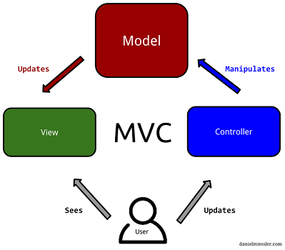
</p>

* **Model**: It is responsible for maintaining the behavior and data of an application.
* **View**: It is used to display the model in the user interface.
* **Controller**: It acts as an interface between the Model and the View components. It takes user input, manipulates the data(model) and causes the view to update.

MVC can be interpreted or modified in many ways to fit a particular framework or library. The core ideas of MVC can be formulated as:

* Separating the presentation from the model: enables implementation of different UIs and better testability
* Separating the controller from the view: most useful with web interfaces and not commonly used in most GUI frameworks

In general, MVC makes no assumptions about whether data flow within an application should be unidirectional or bidirectional. In server Side, MVC is good, but in Client side most of the JS frameworks provide data binding support which let the view can talk with model directly, It shoudn\'t be, Many times it become hard to debug something as there are scope for a property being changed by many ways.

**2. Flux**

Flux places unidirectional data flow front and center, by making it a requirement. Here are the four major roles that make up the Flux architecture:

* Actions, which are helper methods that relay information to the dispatcher
* Stores are similar to the models in MVC, except they act as containers for application state and logic for a particular domain within the application
* The Dispatcher receives Actions and acts as the sole registry of callbacks to all stores within an application. It also manages the dependencies between stores
* Views are the same as the view in MVC, except in the context of React and Flux, and also include Controller-Views for change events and retrieve application state from stores as required.

<p align="center">
  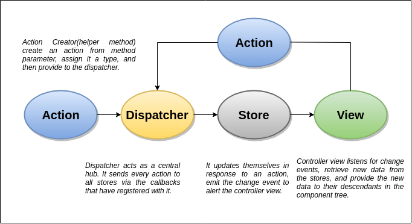
</p>

1. All data in the application flow through a central hub called the Dispatcher
2. This data is tracked as actions, which are provided to the dispatcher in an action creator method, often as a result of a user interacting with the view
3. The dispatcher invokes the registered callback, effectively dispatching the action to all stores that have registered with that callback
4. The stores in turn relay that change event to the controller-views to alert them of the change
5. The controller-views listen for events, retrieve data from the appropriate stores as required and re-render themselves and all their children in the component tree accordingly.

**MVC Vs. Flux**

|  MVC                   |Flux                              |
|------------------------|----------------------------------|
|Bidirectional data flow |Unidirectional data flow          |
|Data binding is the key |Events or actions are the main players |
|Controllers handle the business logic | Store does all calculations |
|Somewhat synchronous    |Can be implemented as completely asynchronous |
|It is hard to debug.    |It is easy to debug because it has common initiating point: Dispatcher.|
|Its maintainability is difficult as the project scope goes huge. | Its maintainability is easy and reduces runtime errors.|

<div align="right">
    <b><a href="#">↥ back to top</a></b>
</div>

## Q. ***How to add multiple middleware to redux?***

The most common use case for middleware is to support asynchronous actions without much boilerplate code or a dependency on a library like `RxJS`. It does so by letting you dispatch async actions in addition to normal actions.

`applyMiddleware` takes each piece of middleware as a new argument (not an array). It provides a third-party extension point between dispatching an action, and the moment it reaches the reducer. It can be use for logging, crash reporting, talking to an asynchronous API, routing, and more.

```js
const createStoreWithMiddleware = applyMiddleware(ReduxThunk, logger)(createStore);
```

**Example: Custom Logger Middleware**

```js
import { createStore, applyMiddleware } from 'redux'
import todos from './reducers'

function logger({ getState }) {
  return next => action => {
    console.log('will dispatch', action)

    // Call the next dispatch method in the middleware chain.
    const returnValue = next(action)

    console.log('state after dispatch', getState())

    // This will likely be the action itself, unless
    // a middleware further in chain changed it.
    return returnValue
  }
}

const store = createStore(todos, ['Use Redux'], applyMiddleware(logger))

store.dispatch({
  type: 'ADD_TODO',
  text: 'Understand the middleware'
})
// (These lines will be logged by the middleware:)
// will dispatch: { type: 'ADD_TODO', text: 'Understand the middleware' }
// state after dispatch: [ 'Use Redux', 'Understand the middleware' ]
```

<div align="right">
    <b><a href="#">↥ back to top</a></b>
</div>

## Q. ***How to set initial state in Redux?***

**1. Initializing State**

In Redux, all application state is held in the store; which is an object that holds the complete state tree of your app. There is only one way to change its state and that is by dispatching actions.

Actions are objects that consist of a type and a payload property. They are created and dispatched by special functions called action creators.

*Example: First creating the Redux store*

```js
import { createStore } from 'redux'

function todosReducer(state = [], action) {
  switch (action.type) {
    case 'ADD_TODO':
      return state.concat([action.payload])
    default:
      return state
  }
}

const store = createStore(todosReducer)
```

Next updating the store

```js
const ADD_TODO = add_todo; // creates the action type
const newTodo = ["blog on dev.to"];
function todoActionCreator (newTodo) {
  const action = {
    type: ADD_TODO,
    payload: newTodo
  }
  dispatch(action)
}
```

When a store is created, Redux dispatches a dummy action to your reducer to populate the store with the initial state.

**2. createStore Pattern**

The createStore method can accept an optional preloadedState value as its second argument. In our example, we called `createStore()` without passing this value. When a value is passed to the `preloadedState` it becomes the initial state.

```js
const initialState = ["eat", "code", "sleep"];
const store = createStore(todosReducer, initialState)
```

**3. Reducer Pattern**

Reducers can also specify an initial state value by looking for an incoming state argument that is undefined, and returning the value they'd like to use as a default.

```js
function todosReducer(state = [], action) {
  switch (action.type) {
    case 'ADD_TODO':
      return state.concat([action.payload])
    default:
      return state
  }
}
/**
* sets initial state to []. But would only take effect if the initial state is undefined,
* which means it was not set using createStore().
**/
```

In general, `preloadedState` wins over the state specified by the `reducer`. This lets reducers specify initial data that makes sense to them as default arguments, but also allows loading existing data (fully or partially) when you\'re hydrating the store from some persistent storage or the server.

<div align="right">
    <b><a href="#">↥ back to top</a></b>
</div>

## Q. ***Are there any similarities between Redux and RxJS?***

**Redux**:

Predictable state container for JavaScript apps. Redux helps you write applications that behave consistently, run in different environments (client, server, and native), and are easy to test. On top of that, it provides a great developer experience, such as live code editing combined with a time traveling debugger. However, Redux has one, but very significant problem - it doesn\'t handle asynchronous operations very well by itself.

**RxJS**

The Reactive Extensions for JavaScript. RxJS is a library for reactive programming using Observables, to make it easier to compose asynchronous or callback-based code.

Redux belongs to "State Management Library" category of the tech stack, while RxJS can be primarily classified under "Concurrency Frameworks".

| Redux                         | RxJS                               |
|-------------------------------|------------------------------------|
|Redux is a tool for managing state throughout the application.| RxJS is a reactive programming library|
|It is usually used as an architecture for UIs. |It is usually used as a tool to accomplish asynchronous tasks in JavaScript.|
|Redux uses the Reactive paradigm because the Store is reactive. The Store observes actions from a distance, and changes itself.|RxJS also uses the Reactive paradigm, but instead of being an architecture, it gives you basic building blocks, Observables, to accomplish this pattern.|

*Example:* React, Redux and RxJS

```js
import React from 'react';  
import ReactDOM from 'react-dom';  
import { Subject } from 'rxjs/Subject';

// create our stream as a subject so arbitrary data can be sent on the stream
const action$ = new Subject();

// Initial State
const initState = { name: 'Alex' };

// Redux reducer
const reducer = (state, action) => {  
  switch(action.type) {
    case 'NAME_CHANGED':
      return {
        ...state,
        name: action.payload
      };
    default:
      return state;
  }
}

// Reduxification
const store$ = action$  
    .startWith(initState)
    .scan(reducer);

// Higher order function to send actions to the stream
const actionDispatcher = (func) => (...args) =>  
  action$.next(func(...args));

// Example action function
const changeName = actionDispatcher((payload) => ({  
  type: 'NAME_CHANGED',
  payload
}));

// React view component
const App = (props) => {  
  const { name } = props;
  return (
    <div>
      <h1>{ name }</h1>
      <button onClick={() => changeName('Alex')} >Alex</button>
      <button onClick={() => changeName('John')} >John</button>
    </div>
  );
}

// subscribe and render the view
const dom =  document.getElementById('app');  
store$.subscribe((state) =>  
    ReactDOM.render(<App {...state} />, dom));
```

**Async actions**

Let\'s say we want to do something asynchronous like fetch some information from a rest api all we need to do is send an ajax stream in place of our action payload and then use one of the lodash style stream operators, `flatMap()` to squash the results of the asynchronous operation back onto the `action$` stream.

```js
import { isObservable } from './utils';

// Action creator
const actionCreator = (func) => (...args) => {  
  const action = func.call(null, ...args);
  action$.next(action);
  if (isObservable(action.payload))
    action$.next(action.payload);
  return action;
};

// method called from button click
const loadUsers = actionCreator(() => {  
  return {
    type: 'USERS_LOADING',
    payload: Observable.ajax('/api/users')
      .map(({response}) => map(response, 'username'))
      .map((users) => ({
        type: 'USERS_LOADED',
        payload: users
      }))
  };
});

// Reducer
export default function reducer(state, action) {  
  switch (action.type) {
    case 'USERS_LOADING':
      return {
        ...state,
        isLoading: true
      };
    case 'USERS_LOADED':
      return {
        ...state,
        isLoading: false,
        users: action.payload,
      };
    //...
  }
}

// rest of code...

// Wrap input to ensure we only have a stream of observables
const ensureObservable = (action) =>  
  isObservable(action)
    ? action
    : Observable.from([action]);

// Using flatMap to squash async streams
const action$  
    .flatMap(wrapActionToObservable)
    .startWith(initState)
    .scan(reducer);
```

The advantage of swapping the action payload for a stream is so we can send data updates at the start and the end of the async operation

<div align="right">
    <b><a href="#">↥ back to top</a></b>
</div>

## Q. ***What is the purpose of the constants in Redux?***

* It helps keep the naming consistent because all action types are gathered in a single place.
* Sometimes you want to see all existing actions before working on a new feature. It may be that the action you need was already added by somebody on the team, but you didn\'t know.
* The list of action types that were added, removed, and changed in a Pull Request helps everyone on the team keep track of scope and implementation of new features.
* If you make a typo when importing an action constant, you will get undefined. This is much easier to notice than a typo when you wonder why nothing happens when the action is dispatched.

*Example:* Constants in Redux can be used into two places, reducers and during actions creation.

```js
// actionTypes.js

export const ADD_TODO = 'ADD_TODO'
export const DELETE_TODO = 'DELETE_TODO'
export const EDIT_TODO = 'EDIT_TODO'
export const COMPLETE_TODO = 'COMPLETE_TODO'
export const COMPLETE_ALL = 'COMPLETE_ALL'
export const CLEAR_COMPLETED = 'CLEAR_COMPLETED'
```

And then require it in actions creator file

```js
// actions.js

import { ADD_TODO } from './actionTypes'

export function addTodo(text) {
  return { type: ADD_TODO, text }
}
```

And in some reducer

```js
import { ADD_TODO } from './actionTypes'

export default (state = [], action) => {
  switch (action.type) {
    case ADD_TODO:
      return [
        ...state,
        {
          text: action.text,
          completed: false
        }
      ]
    default:
      return state
  }
}
```

It allows to easily find all usages of that constant across the project. It also prevents from introducing silly bugs caused by typos -- in which case, you will get a `ReferenceError` immediately.

<div align="right">
    <b><a href="#">↥ back to top</a></b>
</div>

## Q. ***What are the differences between redux-saga and redux-thunk?***

**1. Redux Thunk**

Redux Thunk is a middleware that lets you call action creators that return a function instead of an action object. That function receives the store\'s dispatch method, which is then used to dispatch regular synchronous actions inside the body of the function once the asynchronous operations have completed.

<p align="center">
  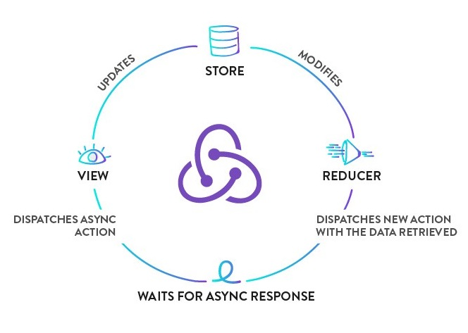
</p>

```bash
npm i --save react-redux redux redux-logger redux-saga redux-thunk
```

Thunk is a function which optionaly takes some parameters and returns another function, it takes dispatch and getState functions and both of these are supplied by Redux Thunk middleware.

Here is the basic structure of Redux-thunk

```js
export const thunkName = parameters => (dispatch, getState) => {
// You can write your application logic here
}
```

*Example*

```js
import axios from "axios"
import GET_LIST_API_URL from "../config"

const fetchList = () => {
  return (dispatch) => {
    axios.get(GET_LIST_API_URL)
    .then((responseData) => {
      dispatch(getList(responseData.list))
    })
    .catch((error) => {
      console.log(error.message)
    })
  }
}

const getList = (payload) => {
  return {
    type: "GET_LIST",
    payload
  }
}

export { fetchList }
```

**2. Redux Saga**

Redux Saga leverages an `ES6` feature called `Generators`, allowing us to write asynchronous code that looks synchronous, and is very easy to test. In the saga, we can test our asynchronous flows easily and our actions stay pure. It organized complicated asynchronous actions easily and make then very readable and the saga has many useful tools to deal with asynchronous actions.

<p align="center">
  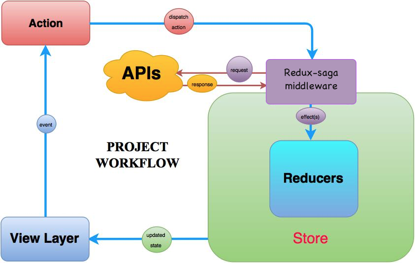
</p>

*Example:*

```js
import axios from "axios"
import GET_LIST_API_URL from "../config"
import {call, put} from "redux-saga/effects"

const fetchList = () => {
  return axios.get(GET_LIST_API_URL)
}

function *fetchList () {
  try {
    const responseData = yield call(getCharacters)
    yield put({type: "GET_LIST", payload: responseData.list})
  } catch (error) {
    console.log(error.message)
  }
}

export { fetchList }
```

Both Redux Thunk and Redux Saga take care of dealing with side effects. In very simple terms, applied to the most common scenario (async functions, specifically AJAX calls) Thunk allows Promises" to deal with them, Saga uses Generators. Thunk is simple to use and Promises are familiar to many developers, Saga/Generators are more powerful but you will need to learn them. When Promises are just good enough, so is Thunk, when you deal with more complex cases on a regular basis, Saga gives you better tools.

<div align="right">
    <b><a href="#">↥ back to top</a></b>
</div>

## Q. ***Explain Redux form with an example?***

This is a simple demonstration of how to connect all the standard HTML form elements to redux-form.

For the most part, it is a matter of wrapping each form control in a `<Field>` component, specifying which type of `React.DOM` component you wish to be rendered.

The Field component will provide your input with `onChange`, `onBlur`, `onFocus`, `onDrag`, and `onDrop` props to listen to the events, as well as a **value** prop to make each input a **controlled component**. Notice that the SimpleForm component has no state; in fact, it uses the functional stateless component syntax.

```js
// SimpleForm.js

import React from 'react'
import { Field, reduxForm } from 'redux-form'

const SimpleForm = (props) => {
  const { handleSubmit, pristine, reset, submitting } = props
  return (
    <form onSubmit={handleSubmit}>
      <div>
        <label>First Name</label>
        <div>
          <Field name="firstName" component="input" type="text" placeholder="First Name"/>
        </div>
      </div>
      <div>
        <label>Last Name</label>
        <div>
          <Field name="lastName" component="input" type="text" placeholder="Last Name"/>
        </div>
      </div>
      <div>
        <label>Email</label>
        <div>
          <Field name="email" component="input" type="email" placeholder="Email"/>
        </div>
      </div>
      <div>
        <label>Sex</label>
        <div>
          <label><Field name="sex" component="input" type="radio" value="male"/> Male</label>
          <label><Field name="sex" component="input" type="radio" value="female"/> Female</label>
        </div>
      </div>
      <div>
        <label>Favorite Color</label>
        <div>
          <Field name="favoriteColor" component="select">
            <option></option>
            <option value="ff0000">Red</option>
            <option value="00ff00">Green</option>
            <option value="0000ff">Blue</option>
          </Field>
        </div>
      </div>
      <div>
        <label htmlFor="employed">Employed</label>
        <div>
          <Field name="employed" id="employed" component="input" type="checkbox"/>
        </div>
      </div>
      <div>
        <label>Notes</label>
        <div>
          <Field name="notes" component="textarea"/>
        </div>
      </div>
      <div>
        <button type="submit" disabled={pristine || submitting}>Submit</button>
        <button type="button" disabled={pristine || submitting} onClick={reset}>Clear</button>
      </div>
    </form>
  )
}

export default reduxForm({
  form: 'simple'  // a unique identifier for this form
})(SimpleForm)
```

<p align="center">
  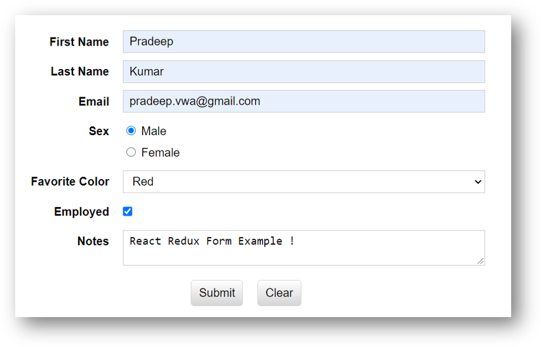
</p>

**[[READ MORE](https://redux-form.com/6.5.0/examples/syncvalidation/)]**

<div align="right">
    <b><a href="#">↥ back to top</a></b>
</div>

## Q. ***How to reset state in redux?***

The root reducer would normally delegate handling the action to the reducer generated by `combineReducers()`. However, whenever it receives `USER_LOGOUT` action, it returns the initial state all over again.

```js
import { combineReducers } from 'redux';
import AppReducer from './AppReducer';

import UsersReducer from './UsersReducer';
import OrderReducer from './OrderReducer';
import NotificationReducer from './NotificationReducer';
import CommentReducer from './CommentReducer';

/**
 * In order to reset all reducers back to their initial states when user logout,
 * rewrite rootReducer to assign 'undefined' to state when logout
 *
 * If state passed to reducer is 'undefined', then the next state reducer returns
 * will be its initial state instead; since we have assigned it as the default value
 * of reducer's state parameter
 *   ex: const Reducer = (state = InitialState, action) => { ... }
 *
 * See: https://goo.gl/GSJ98M and combineReducers() source codes for details
 */

const appReducer = combineReducers({
  /* your app's top-level reducers */
  users: UsersReducer,
  orders: OrderReducer,
  notifications: NotificationReducer,
  comment: CommentReducer,
});

const rootReducer = (state, action) => {
  // when a logout action is dispatched it will reset redux state
  if (action.type === 'USER_LOGGED_OUT') {
    state = undefined;
  }

  return appReducer(state, action);
}

export default rootReducer
```

<div align="right">
    <b><a href="#">↥ back to top</a></b>
</div>

## Q. ***Why are Redux state functions called as reducers?***

Redux state functions called a reducer because it\'s the type of function we pass to `Array.prototype.reduce(reducer, ?initialValue)`. Reducers do not just return default values. They always return the accumulation of the state (based on all previous and current actions).

Therefore, they act as a reducer of state. Each time a redux reducer is called, the state is passed in with the action `(state, action)`. This state is then reduced (or accumulated) based on the action, and then the next state is returned. This is one cycle of the classic `fold` or `reduce` function.

<div align="right">
    <b><a href="#">↥ back to top</a></b>
</div>

## Q. ***How to make Ajax request in Redux?***

There are three most widely used and stable Redux Ajax middleware are:

* Redux Promise Middleware
* Redux Thunk Middleware
* Redux Saga Middleware

**1. Redux Promise Middleware**

This is the most simple way of doing Ajax calls with Redux. When using Redux Promise, your action creator can return a Promise inside the Action.

```js
function getUserName(userId) {
    return {
        type: "SET_USERNAME",
        payload: fetch(`/api/personalDetails/${userId}`)
                .then(response => response.json())
                .then(json =>  json.userName)
    }
}
```

This middleware automatically dispatches two events when the Ajax call succeeds: `SETUSERNAMEPENDING`  and `SETUSERNAMEFULFILLED`. If something fails it dispatches `SETUSERNAMEREJECTED`.

**When to use**

* You want the simplest thing with minimum overhead
* You prefer convention over configuration
* You have simple Ajax requirements

**2. Redux Thunk Middleware**

This is the standard way of doing Ajax with Redux. When using Redux Thunk, your action creators returns a function that takes one argument dispatch:

```js
function getUserName(userId) {
    return dispatch => {
        return fetch(`/api/personalDetails/${userId}`)
        .then(response => response.json())
        .then(json => dispatch({ type: "SET_USERNAME", userName: json.userName })
    }
}
```

The action creator can call dispatch inside `.then` to execute it asynchronously. The action creator can call dispatch as many time as it wants.

**When to use**

* You make many Ajax calls in one action, and need to dispatch many actions
* You require full control of the format of your actions

**3. Redux Saga Middleware**

This is the most advanced way of doing Ajax with Redux. It uses an ES6 feature called `generators`. When using Redux Saga you do your Ajax calls in a saga instead of an action creator. This is how a saga looks like:

```js
import { call, put, takeEvery } from 'redux-saga/effects'

// call getUserName when action SET_USERNAME is dispatched
function* mySaga() {
  yield takeEvery("SET_USERNAME", getUserName);
}

function* getUserName(action) {
   try {
      const user = yield call(fetch, `/api/personalDetails/${userId}`);
      yield put({type: "SET_USERNAME_SUCCEEDED", user: user});
   } catch (e) {
      yield put({type: "SET_USERNAME_FAILED", message: e.message});
   }
}

export default mySaga
```

Here, sagas listen to actions which you dispatch as regular synchronous actions. In this case, the saga `getUserName` is executed when the action `SET_USERNAME` is dispatched. The `*` next to the function means it\'s a generator and yield is a generator keyword.

**When to use**

* You need to be able to test the asynchronous flow easily
* You are comfortable working with ES6 Generators
* You value pure functions

<div align="right">
    <b><a href="#">↥ back to top</a></b>
</div>

## Q. ***What are the differences between call and put in redux-saga?***

Both `call()` and `put()` are effect creator functions. `call()` function is used to create effect description, which instructs middleware to call the promise. `put()` function creates an effect, which instructs middleware to dispatch an action to the store.

Let\'s take example of how these effects work for fetching particular user data.

```js
function* fetchUserSaga(action) {
  // `call` function accepts rest arguments, which will be passed to `api.fetchUser` function.
  // Instructing middleware to call promise, it resolved value will be assigned to `userData` variable
  const userData = yield call(api.fetchUser, action.userId)
 
  // Instructing middleware to dispatch corresponding action.
  yield put({
    type: 'FETCH_USER_SUCCESS',
    userData
  })
}
```

<div align="right">
    <b><a href="#">↥ back to top</a></b>
</div>

## Q. ***What is the mental model of redux-saga?***

Saga is like a separate thread in your application, that is solely responsible for side effects. `redux-saga` is a redux middleware, which means this thread can be **started**, **paused** and **cancelled** from the main application with normal Redux actions, it has access to the full Redux application state and it can dispatch Redux actions as well.

*Example:*

```bash
npm install --save redux-saga
```

Suppose we have a UI to fetch some user data from a remote server when a button is clicked.

```js
class UserComponent extends React.Component {
  ...
  onSomeButtonClicked() {
    const { userId, dispatch } = this.props
    dispatch({type: 'USER_FETCH_REQUESTED', payload: {userId}})
  }
  ...
}
```

The Component dispatches a plain Object action to the Store. We\'ll create a Saga that watches for all `USER_FETCH_REQUESTED` actions and triggers an API call to fetch the user data.

```js
// sagas.js

import { call, put, takeEvery, takeLatest } from 'redux-saga/effects'
import Api from '...'

// worker Saga: will be fired on USER_FETCH_REQUESTED actions
function* fetchUser(action) {
   try {
      const user = yield call(Api.fetchUser, action.payload.userId);
      yield put({type: "USER_FETCH_SUCCEEDED", user: user});
   } catch (e) {
      yield put({type: "USER_FETCH_FAILED", message: e.message});
   }
}

/*
  Starts fetchUser on each dispatched `USER_FETCH_REQUESTED` action.
  Allows concurrent fetches of user.
*/
function* mySaga() {
  yield takeEvery("USER_FETCH_REQUESTED", fetchUser);
}

/*
  Alternatively you may use takeLatest.

  Does not allow concurrent fetches of user. If "USER_FETCH_REQUESTED" gets
  dispatched while a fetch is already pending, that pending fetch is cancelled
  and only the latest one will be run.
*/
function* mySaga() {
  yield takeLatest("USER_FETCH_REQUESTED", fetchUser);
}

export default mySaga;
```

To run our Saga, we\'ll have to connect it to the Redux Store using the `redux-saga` middleware.

```js
// main.js

import { createStore, applyMiddleware } from 'redux'
import createSagaMiddleware from 'redux-saga'

import reducer from './reducers'
import mySaga from './sagas'

// create the saga middleware
const sagaMiddleware = createSagaMiddleware()
// mount it on the Store
const store = createStore(
  reducer,
  applyMiddleware(sagaMiddleware)
)

// then run the saga
sagaMiddleware.run(mySaga)

// render the application
```

<div align="right">
    <b><a href="#">↥ back to top</a></b>
</div>

## Q. ***How Relay is different from Redux?***

**Redux**

Predictable state container for JavaScript apps. Redux helps you write applications that behave consistently, run in different environments (client, server, and native). In redux the application state is located in a single store, each component can access the state, and can also change the state by dispatching actions. Redux doesn\'t handle data fetching out of the box, though it can be done manually: simply create an action that fetches the data from the server into the store.

Some of the features offered by Redux are:

* Predictable state
* Easy testing
* Works with other view layers besides React

**Relay**

Created by facebook for react, and also used internally there. Relay is similar to redux in that they both use a single store. The main difference is that relay only manages state originated from the server, and all access to the state is used via GraphQL querys (for reading data) and mutations (for changing data). Relay caches the data for you and optimizes data fetching for you, by fetching only changed data and nothing more. Relay also supports optimistic updates, i.e. changing the state before the server\'s result arrives.

Relay provides the following key features:

* Build data driven apps
* Declarative style
* Mutate data on the client and server

**GraphQL** is a web service framework and protocol using declarative and composable queries, and solves problem like over fetching and under fetching, it is believed to be a valid candidate to replace REST.

<div align="right">
    <b><a href="#">↥ back to top</a></b>
</div>

## Q. ***When would bindActionCreators be used in react/redux?***

**`bindActionCreators(actionCreators, dispatch)`**: Turns an object whose values are action creators, into an object with the same keys, but with every action creator wrapped into a dispatch call so they may be invoked directly.

When we use Redux with React, react-redux will provide `dispatch()` function and we can call it directly. The only use case for `bindActionCreators()` is when we want to pass some action creators down to a component that isn\'t aware of Redux, and we don\'t want to pass `dispatch` or the Redux store to it.

**Parameters**

1. `actionCreators` (Function or Object): An action creator, or an object whose values are action creators.
2. `dispatch` (Function): A dispatch function available on the Store instance.

**Returns**

(Function or Object): An object mimicking the original object, but with each function immediately dispatching the action returned by the corresponding action creator. If you passed a function as actionCreators, the return value will also be a single function.

*Example:*

```js
// TodoActionCreators.js

export function addTodo(text) {
  return {
    type: 'ADD_TODO',
    text
  }
}

export function removeTodo(id) {
  return {
    type: 'REMOVE_TODO',
    id
  }
}
```

```js
// TodoListContainer.js

import { Component } from 'react'
import { bindActionCreators } from 'redux'
import { connect } from 'react-redux'

import * as TodoActionCreators from './TodoActionCreators'

console.log(TodoActionCreators)
// {
//   addTodo: Function,
//   removeTodo: Function
// }

class TodoListContainer extends Component {
  constructor(props) {
    super(props)

    const { dispatch } = props

    // Here's a good use case for bindActionCreators:
    // You want a child component to be completely unaware of Redux.
    // We create bound versions of these functions now so we can
    // pass them down to our child later.

    this.boundActionCreators = bindActionCreators(TodoActionCreators, dispatch)
    console.log(this.boundActionCreators)
    // {
    //   addTodo: Function,
    //   removeTodo: Function
    // }
  }

  componentDidMount() {
    // Injected by react-redux:
    let { dispatch } = this.props

    // Note: this won't work:
    // TodoActionCreators.addTodo('Use Redux')

    // You're just calling a function that creates an action.
    // You must dispatch the action, too!

    // This will work:
    let action = TodoActionCreators.addTodo('Use Redux')
    dispatch(action)
  }

  render() {
    // Injected by react-redux:
    let { todos } = this.props

    return <TodoList todos={todos} {...this.boundActionCreators} />

    // An alternative to bindActionCreators is to pass
    // just the dispatch function down, but then your child component
    // needs to import action creators and know about them.

    // return <TodoList todos={todos} dispatch={dispatch} />
  }
}

export default connect(state => ({ todos: state.todos }))(TodoListContainer)
```

<div align="right">
    <b><a href="#">↥ back to top</a></b>
</div>

## Q. ***What is mapStateToProps and mapDispatchToProps?***

`react-redux`package provides 3 functions `Connect`, `mapStapteToProps` and `mapDispatchToProps`. Connect is a higher order function that takes in both mapStateToProps and mapDispatchToProps as parameters.

**1. Using MapStateToProps**

In React, `MapStatetoProps` pulls in the state of a specific reducer state object from global store and maps it to the props of component. MapStateToProps is called everytime your store is updated. You pass in your state a retrieve that specific objects from the reducer.

**2. Using MapDisptachToProps**

`MapDispatchToProp` takes the dispatch functions in component and executes them against the Redux Reducer when that function is fired. MapDispatchToProps allows to dispatch state changes to your store.

In a simple term,

**mapStateToProps**: It connects redux state to props of react component.  
**mapDispatchToProps**: It connects redux actions to react props.

*Example:*

```js
const {createStore} = Redux
const {connect, Provider} = ReactRedux
const InitialState = {Collection: ["COW", "COW", "DUCK", "DUCK"]}

function reducer(state=InitialState, action) {
    if (action.type === "REVERSE") {
      return Object.assign({}, state, {
         Collection: state.Collection.slice().reverse()
      })
    }
    return state
}

var store = createStore(reducer)

function mapStateToProps(state) {
  return state
}

var PresentationalComponent = React.createClass({
    render: function() {
        return (
          <div>
            <h2>Store State ( as Props) </h2>
            <pre> {JSON.stringify(this.props.Collection)}</pre>
            <StateChangerUI />
          </div>
          )
    }
})

// State changer UI
var StateChangerUI = React.createClass({
 // Action Dispatch  
  handleClick: function() {
     store.dispatch({
         type: 'REVERSE'
      })
  },
  render: function() {
    return (
      <button type="button" className="btn btn-success" onClick={this.handleClick}>REVERSE</button>
    )
  }
})

PresentationalComponent = connect(mapStateToProps)(PresentationalComponent)

ReactDOM.render(
    <Provider store={store}>
        <PresentationalComponent />
    </Provider>,
    document.getElementById('App')
)
```

<div align="right">
    <b><a href="#">↥ back to top</a></b>
</div>

## Q. ***What is reselect and how it works?***

**`Reselect`** is a simple library for creating memoized, composable **selector** functions. Reselect selectors can be used to efficiently compute derived data from the Redux store.

Selectors can compute derived data, allowing Redux to store the minimal possible state. Which can be considered as keep the store as minimal as possible. A selector is not recomputed unless one of its arguments change. A memoized selector that recalculates only when that part of the start tree changes which are input arguments to the selector. The value of selector doesn\'t change when there is no change in other (unrelated) parts of the state tree.

**selectors**

In our context, selectors are nothing but functions which can compute or retrive data from the store. We usually fetch the state data using `mapStateToProps()` function like this.

```js
const mapStateToProps = (state) => {
  return {
    activeData: getActiveData(state.someData, state.isActive)
  }
}
```

Where `getActiveData()` will be a function which returns all the records from `someData` having the status as `isActive`. The drawback with this function is, whenever any part of the state state updates, this function will recalculate this data.

When we use `Reselect` it caches the input arguments to the memoized function. So only when the arguments of the function changes from the previous call, the selector recalculates.

*Example:*

```js
// todo.reducer.js
// ...
import { createSelector } from 'reselect';

const todoSelector = state => state.todo.todos;
const searchTermSelector = state => state.todo.searchTerm;

export const filteredTodos = createSelector(
  [todoSelector, searchTermSelector],
  (todos, searchTerm) => {
    return todos.filter(todo => todo.title.match(new RegExp(searchTerm, 'i')));
  }
);

// ...
```

We can use the `filteredTodos` selectors to get all the todos if there\'s no searchTerm set in the state, or a filtered list otherwise.

<div align="right">
    <b><a href="#">↥ back to top</a></b>
</div>

## Q. ***What are the different ways to dispatch actions in Redux?***

**Redux** is a state container for Javascript apps, mostly used with React. It\'s based on actions that are dispatched and listened by reducers which modify the state properly.

**1. Passing dispatch method to our component**

The dispatch method is a method of the store object. An action is dispatched to trigger an update to the store.

```js
// App.js
import { createStore } from 'redux';
import { MessageSender } from './MessageSender';
import reducer from './reducer';

const store = createStore(reducer);
class App extends React.Component {
 render() {
 <MessageSender store={store} />
 };
};
```

```js
// MessageSender.js
import { sendMsg } from './actions';
// ...
this.props.store.dispatch(sendMsg(msg))
// ...
```

**2. Using React-Redux to make dumb/smart components**

The downside of the above approach is that our React component is aware of the app logic. It\'s best to separate the logic in our smart component connected to the store from the user interface, i.e., from the dumb component.

From the official docs for `connect()`, we can describe `mapDispatchToProps()` this way: If an object is passed, each function inside it is assumed to be a Redux action creator. An object with the same function names, but with every action creator wrapped into a dispatch call so they may be invoked directly, will be merged into the component\'s props.

```js
// MessageSender.container.js

import { connect } from 'react-redux';
import { sendMsg } from './actions';
import MessageSender from './MessageSender';

const mapDispatchToProps = {
 sendMsg
};

export default connect(null, mapDispatchToProps)(MessageSender);

// MessageSender.js
// ...
this.props.sendMsg(msg);
// ...
```

**3. Using the bindActionCreators() method**

The `bindActionCreators()` method allows us to dispatch actions from any React component that is not connected to the store as `mapDispatchToPros()` in the connect function of react-redux.

```js
// MsgSenderPage.js

import { bindActionCreators } from 'redux';
import { connect } from 'react-redux';
import * as actions from './actions';

class MsgSenderPage extends React.Component {
 constructor(props) {
 super(props);
 const { dispatch } = props;
 this.boundedActions = bindActionCreators(actions, dispatch);
 }

 render() {
 return <MsgSending {...this.boundedActions} />;
 }
}

export default connect()(MsgSenderPage);
```

<div align="right">
    <b><a href="#">↥ back to top</a></b>
</div>

#### Q. ***How to use Redux for Error Handling?***
#### Q. ***How to set conditional payload in Reducer React Typescript***
#### Q. ***What is the best way to access redux store outside a react component?***
#### Q. ***Can I dispatch an action in reducer?***

*ToDO*

<div align="right">
    <b><a href="#">↥ back to top</a></b>
</div>
