# React Basics

> *Click &#9733; if you like the project. Your contributions are heartily ♡ welcome.*

<br/>

## Related Topics

* *[HTML Basics](https://github.com/learning-zone/html-basics)*
* *[CSS Basics](https://github.com/learning-zone/css-basics)*
* *[JavaScript Basics](https://github.com/learning-zone/javascript-basics)*
* *[React Coding Practice](react-coding-practice.md)*
* *[React Quick Reference](react-quick-reference.md)*
* *[React 19 Interview Questions](react-19-interview-questions.md)*
* *[Redux Interview Questions](redux-interview-questions.md)*
* *[Redux Quick Reference](redux-quick-reference.md)*
* *[Jest Quick Reference](jest-quick-reference.md)*
* *[React Best Practices](best-practices.md)*
* *[React Unit Testing](react-unit-testing.md)*
* *[React Unit Testing Project](https://github.com/learning-zone/react-unit-testing)*
* *[React Project - ToDo App](https://github.com/learning-zone/react-todo-app)*
* *[React Project - My Store App](https://github.com/learning-zone/my-store-app)*

<br/>

## Table of Contents

* React
  * [Introduction](#-1-introduction)
  * [React Setup](#-2-react-setup)
  * [React JSX](#-3-react-jsx)
  * [React Components](#-4-react-components)
    * [Functional Components](#-41-functional-components)
    * [Class Components](#-42-class-components)
      * [React Lifecycle](#-421-react-lifecycle)
    * [Pure Components](#-43-pure-components)
    * [Higher Order Components](#-44-higher-order-components)
    * [Lazy Loading](#-45-lazy-loading)
  * [React Props](#-5-react-props)
  * [React State](#-6-react-state)
  * [React Events](#-7-react-events)
  * [React Lists](#-8-react-lists)
  * [React RESTful API](#-9-react-restful-api)
  * [React Forms](#-10-react-forms)
  * [React Hooks](#-11-react-hooks)
  * [React Context](#-12-react-context)
  * [React Router](#-13-react-router)
  * [React Error Boundaries](#-14-react-error-boundaries)
  * [React Refs](#-15-react-refs)
  * [React Composition](#-16-react-composition)
  * [React CSS Styling](#-17-react-css-styling)
  * [React Internationalization](#-18-react-internationalization)
  * [React Miscellaneous](#-19-react-miscellaneous)

<br/>

## # 1. INTRODUCTION

<br/>

## Q. What is React.js?

React is a JavaScript library created for building fast and interactive user interfaces for web and mobile applications. It is an open-source, component-based, front-end library responsible only for the application view layer.

The main objective of ReactJS is to develop User Interfaces (UI) that improves the speed of the apps. It uses virtual DOM (JavaScript object), which improves the performance of the app. The JavaScript virtual DOM is faster than the regular DOM. We can use ReactJS on the client and server-side as well as with other frameworks. It uses component and data patterns that improve readability and helps to maintain larger apps.

**Reference:**

* *[https://reactjs.org/tutorial/tutorial.html](https://reactjs.org/tutorial/tutorial.html)*

<div align="right">
    <b><a href="#table-of-contents">↥ back to top</a></b>
</div>

## Q. How React works?

* **Virtual DOM**: React maintains a lightweight copy of the actual DOM in memory. When state changes, React creates a new virtual DOM tree, compares it with the previous one (diffing), and calculates the minimal set of changes needed to update the real DOM.

* **Component-Based Architecture**: React apps are built from reusable components - JavaScript functions or classes that return JSX (HTML-like syntax). Each component manages its own state and props (data passed from parent).

* **Reconciliation**: When data changes, React uses its reconciliation algorithm to efficiently update only the parts of the DOM that actually changed, rather than re-rendering everything.

* **Unidirectional Data Flow**: Data flows one way - from parent to child components via props. Child components communicate back via callback functions, maintaining predictable data flow.

<div align="right">
    <b><a href="#table-of-contents">↥ back to top</a></b>
</div>

## Q. List some of the major advantages and limitations of React?

<p align="center">
  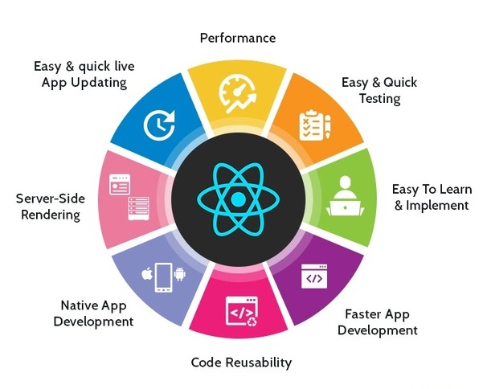
</p>

**Major Advantages:**

* **Virtual DOM** - React uses a Virtual DOM to track UI changes and update only the necessary elements rather than reloading the entire page, significantly boosting application speed.
* **Reusable Component Architecture**: Applications are built using self-contained, modular components that can be reused across different parts of a project or even in separate applications, improving maintainability.
* **SEO-Friendly** - Server-side rendering with Next.js improves search engine visibility
* **One-Way Data Flow** - Predictable data management and easier debugging
* **JSX Syntax** - Combines HTML and JavaScript for better readability
* **React Native** - Code reuse for mobile app development
* **Easy Learning Curve** - Simple API and good documentation

**Limitations:**  

* Learning curve. Being not full-featured framework it is required in-depth knowledge for integration user interface free library into MVC framework.
* View-orientedness is one of the cons of ReactJS. It should be found 'Model' and 'Controller' to resolve 'View' problem.
* Not using isomorphic approach to exploit application leads to search engines indexing problems.

<div align="right">
    <b><a href="#table-of-contents">↥ back to top</a></b>
</div>

## Q. Why does React emphasize on unidirectional data flow?

React emphasizes unidirectional data flow (also called "one-way data binding") because it provides a predictable, easy-to-debug, and modular way to manage how data moves through an application.

In this pattern, data is passed from parent to child components via read-only **props**. If a child needs to change the data, it doesn\'t modify it directly; instead, it triggers a callback function provided by the parent to update the "single source of truth". 

**Key Benefits**

* **Predictability**: Because data follows a strict one-way path, you always know where a specific piece of state originates and what caused it to change.
* **Easier Debugging**: Tracing bugs becomes a linear process: you check the output, the component, and then move up the tree until you find the source of the state.
* **Efficiency**: React can easily determine which parts of the UI need to re-render by simply checking if props or state have changed, reducing unnecessary updates.
* **Decoupling**: Child components focus purely on rendering (often called "dumb" or presentational components), while parent components handle the logic and state management.
* **Scalability**: This pattern scales well for large apps. Tools like the React Context API or Redux extend these same unidirectional principles to global state

**Example:**

```jsx
// Parent controls state
function Parent() {
  const [data, setData] = useState('hello');
  
  return <Child data={data} onChange={setData} />;
}

// Child receives data and callback
function Child({ data, onChange }) {
  return <input value={data} onChange={(e) => onChange(e.target.value)} />;
}
```

<div align="right">
    <b><a href="#table-of-contents">↥ back to top</a></b>
</div>

## Q. What is Destructuring in React.js?

Destructuring in React.js is a JavaScript ES6 feature that allows you to extract values from arrays or properties from objects into distinct variables. In React, it is widely used to make code cleaner and more readable.

**Key Uses in React:**

**1. Props Destructuring:**

```js
// Without destructuring
function Welcome(props) {
  return <h1>Hello, {props.name}</h1>;
}

// With destructuring
function Welcome({ name, age }) {
  return <h1>Hello, {name}, you are {age} years old</h1>;
}
```

**2. State Destructuring with Hooks:**

```js
// Array destructuring with useState
const [counter, setCounter] = React.useState(0);
const [name, setName] = React.useState("John");

// Object destructuring with useContext
const { user, theme } = useContext(AppContext);
```

**3. Nested Object Destructuring:**

```js
const user = {
  name: "Alice",
  address: {
    city: "New York",
    country: "USA"
  }
};

// Destructure nested properties
const { name, address: { city } } = user;
// name = "Alice", city = "New York"
```

**4. Class Component State:**

```js
class App extends React.Component {
  render() {
    const { isLoggedIn, user } = this.state;
    return <div>{isLoggedIn ? user.name : "Guest"}</div>;
  }
}
```

<div align="right">
    <b><a href="#table-of-contents">↥ back to top</a></b>
</div>

## Q. Why is it necessary to start component names with a capital letter?

In React, component names must start with a capital letter because of how JSX distinguishes between HTML elements and React components:

**Key Reasons:**

**1. JSX Compilation Behavior:**

* `<component />` → compiles to React.createElement('component') (treated as HTML tag string)
* `<Component />` → compiles to React.createElement(Component) (treated as React component)

**2. Built-in vs Custom Components:**

* Lowercase names refer to built-in HTML elements like `<div>`, `<span>`, `<button>`
* Capitalized names refer to custom React components you\'ve defined or imported

**3. Exception:**

Lowercase with dot notation works: `<obj.component />` compiles to `React.createElement(obj.component)`

**Example:**

```js
// ❌ Wrong - React treats this as HTML <mybutton> tag
function myButton() {
  return <button>Click me</button>;
}

// Using it: <myButton /> // Won't work as expected

// ✅ Correct - React treats this as a component
function MyButton() {
  return <button>Click me</button>;
}

// Using it: <MyButton /> // Works correctly
```

<div align="right">
    <b><a href="#table-of-contents">↥ back to top</a></b>
</div>

## Q. What are fragments?

React Fragments are a way to group multiple elements without adding an extra node to the browser\'s DOM.

**Why use Fragments?**

* Avoid extra DOM nodes that can affect styling and layout
* Cleaner DOM structure
* Better performance (fewer nodes to render)
* Satisfy React\'s requirement that components return a single element
* Adding a `<div>` inside elements like `<table>`, `<tr>`, or `<ul>` can break the browser\'s layout rules.

**Example:**

```js
// Long syntax
import React, { Fragment } from 'react';

function MyComponent() {
  return (
    <Fragment>
      <h1>Title</h1>
      <p>Description</p>
    </Fragment>
  );
}

// Short syntax (more common)
function MyComponent() {
  return (
    <>
      <h1>Title</h1>
      <p>Description</p>
    </>
  );
}
```

<div align="right">
    <b><a href="#table-of-contents">↥ back to top</a></b>
</div>

## Q. What is Virtual DOM?

The Virtual DOM is a programming concept where a "virtual" representation of a User Interface is kept in memory and synchronized with the "real" browser DOM by a library like ReactDOM

**How it works:**

**1. Initial Render**: React creates a lightweight tree of JavaScript objects (the Virtual DOM) that mirrors the structure of the real DOM.

**2. State Change**: When a component\'s state or props change, React creates a new Virtual DOM tree.

**3. Diffing**: React compares the new tree with the previous version to identify exactly what changed. This is handled by a highly efficient diffing algorithm.

**4. Reconciliation**: Based on the "diffs," React calculates the minimal set of changes needed and updates only those specific parts in the real DOM. 

**Benefits:**

* **Performance** - Direct DOM manipulation is expensive. The Virtual DOM allows React to minimize actual DOM operations
* **Efficiency** - Instead of updating the entire DOM, only changed elements are updated
* **Declarative** - Developers describe what the UI should look like, and React handles the efficient updates

**Example:**

```js
// When count changes from 0 to 1
const [count, setCount] = useState(0);

return <div>Count: {count}</div>;
```

React only updates the text node containing the count value, not the entire `<div>` element.

**&#9885; [Virtual DOM Example](https://codesandbox.io/s/react-virtual-dom-2w52y?file=/src/index.js)**

<div align="right">
    <b><a href="#table-of-contents">↥ back to top</a></b>
</div>

## Q. What is the difference between ShadowDOM and VirtualDOM?

<p align="center">
  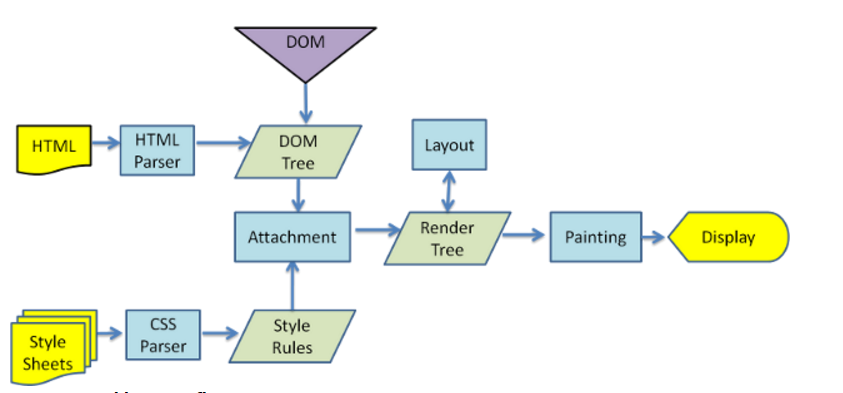
</p>

**1. Document Object Model:**

It a way of representing a structured document via objects. It is cross-platform and language-independent convention for representing and interacting with data in HTML, XML, and others. Web browsers handle the DOM implementation details, so we can interact with it using JavaScript and CSS.

**2. Virtual DOM:**

Virtual DOM is any kind of representation of a real DOM. Virtual DOM is about avoiding unnecessary changes to the DOM, which are expensive performance-wise, because changes to the DOM usually cause re-rendering of the page. It allows to collect several changes to be applied at once, so not every single change causes a re-render, but instead re-rendering only happens once after a set of changes was applied to the DOM.

**3. Shadow DOM:**

Shadow DOM is mostly about encapsulation of the implementation. A single custom element can implement more-or-less complex logic combined with more-or-less complex DOM. Shadow DOM refers to the ability of the browser to include a subtree of DOM elements into the rendering of a document, but not into the main document DOM tree.

**Difference:**

The virtual DOM creates an additional DOM. The shadow DOM simply hides implementation details and provides isolated scope for web components.

Virtual DOM is about performance (efficiently updating the UI), while Shadow DOM is about encapsulation (isolating component styles and structure from the rest of the page).

**Note:** 

*React uses Virtual DOM but doesn\'t use Shadow DOM by default.*

<div align="right">
    <b><a href="#table-of-contents">↥ back to top</a></b>
</div>

## # 2. REACT SETUP

<br/>

## Q. How to set up a react project with Vite?

**Vite** is a modern, fast build tool that provides a superior development experience compared to traditional bundlers. It offers instant server start, lightning-fast Hot Module Replacement (HMR), and optimized builds.

It replaces older tools like Create React App by providing a leaner, faster build process

**Requirements:**

* [Node.js version >= 18](https://nodejs.org/en/download/)
* [Visual Studio Code Editor](https://code.visualstudio.com/download)

**Installation:**

```bash
npm create vite@latest my-react-app -- --template react   #Initialize the Project
cd my-react-app
npm install   #Install Dependencies
npm run dev   #Start the Development Server
```

**Essential Vite Commands:**

```bash
npm run dev     #Starts the development server with Hot Module Replacement (HMR).
npm run build   #Creates an optimized production bundle in the /dist folder.
npm run preview #Locally previews the production build you just created.
```

**Available Templates:**

* `react` - React with JavaScript
* `react-ts` - React with TypeScript
* `react-swc` - React with SWC (faster compilation)
* `react-swc-ts` - React with TypeScript and SWC

**Project Structure:**

```js
my-react-app
├── node_modules
├── public
│   └── vite.svg
├── src
│   ├── assets
│   │   └── react.svg
│   ├── App.css
│   ├── App.jsx
│   ├── index.css
│   └── main.jsx
├── .gitignore
├── index.html
├── package.json
├── vite.config.js
└── README.md
```

**Key Differences from Create React App:**

* **Faster startup** - Vite uses native ES modules and doesn\'t bundle during development
* **Instant HMR** - Updates reflect immediately without full page reload
* **Optimized builds** - Uses Rollup for production builds
* **Smaller bundle sizes** - Better tree-shaking and code splitting
* **Modern by default** - No legacy browser support overhead

**Reference:**

* *[https://vitejs.dev/guide/](https://vitejs.dev/guide/)*
* *[https://github.com/vitejs/vite](https://github.com/vitejs/vite)*

<div align="right">
    <b><a href="#table-of-contents">↥ back to top</a></b>
</div>

## Q. What are the features of Vite?

Vite is a modern build tool and development server with these key features:

**Core Features**

* Lightning-fast cold start using native ES modules
* Instant Hot Module Replacement (HMR) that stays fast regardless of app size
* No bundling during development

**Optimized Production Build**

* Uses Rollup for production bundling
* Pre-configured and optimized out of the box
* Code splitting and tree-shaking

**Rich Features**

* TypeScript support out of the box
* JSX/TSX support
* CSS pre-processors (Sass, Less, Stylus)
* PostCSS support
* Static asset handling
* JSON importing

<div align="right">
    <b><a href="#table-of-contents">↥ back to top</a></b>
</div>

## Q. What are the popular React-specific linter?

**1. ESLint:**

ESLint is a popular JavaScript linter. There are plugins available that analyse specific code styles. One of the most common for React is an npm package called `eslint-plugin-react`.

```bash
npm install -g eslint-plugin-react
```

This will install the plugin we need, and in our ESLint config file, we just need a few extra lines.

```js
"extends": [
    "eslint:recommended",
    "plugin:react/recommended"
]
```

```js
"scripts": {
    "start": "react-scripts start",
    "build": "react-scripts build",
    "test": "react-scripts test --env=jsdom",
    "eject": "react-scripts eject",
    "lint": "eslint src/**/*.js src/**/*.jsx"
}
```

**2. eslint-plugin-jsx-a11y:**

* Focuses on accessibility issues in JSX
* Catches issues with `alt` text, `tabindex`, and other accessibility concerns
* Works alongside ESLint to ensure React components are accessible

**3. Other Popular Options:**

* **eslint-plugin-react-hooks** - Enforces Rules of Hooks
* **@typescript-eslint/eslint-plugin** - For TypeScript React projects
* **Prettier** - Code formatter that works well with ESLint
* **eslint-config-airbnb** - Airbnb\'s ESLint config includes React rules

<div align="right">
    <b><a href="#table-of-contents">↥ back to top</a></b>
</div>

## Q. What is the browser support for react applications?

React applications are supported by all modern web browsers. Because React uses JavaScript ES5 features as its baseline, it can be extended to older browsers with the right configuration.

Support for Internet Explorer 9, 10, and 11 requires polyfills. For a set of polyfills to support older browsers, use **react-app-polyfill**.

**Browser Configuration:**

The `browserslist` configuration in `package.json` controls which browsers are supported by determining what JavaScript transformations are applied:

**Example:**

```js
// package.json

"browserslist": {
  "production": [
    ">0.2%",          // Browsers with >0.2% market share
    "not dead",       // Still maintained browsers
    "not op_mini all" // Exclude Opera Mini
  ],
  "development": [
    "last 1 chrome version",
    "last 1 firefox version",
    "last 1 safari version"
  ]
}
```

<div align="right">
    <b><a href="#table-of-contents">↥ back to top</a></b>
</div>

## Q. Explain the use of Webpack and Babel in React?

**1. Webpack (The Transpiler):**

Webpack primary job is to take all your individual files (JavaScript, CSS, images) and "bundle" them into a few optimized files. 

* **Dependency Management**: It starts from an entry point (usually index.js) and creates a dependency graph to understand how every file is connected.

* **Asset Handling**: It treats everything—including CSS and images—as a module, allowing you to import them directly into your JavaScript components.

* **Performance:** It performs optimizations like tree shaking (removing unused code), minification, and code splitting (loading only what is needed).

* **Development Features:** Tools like webpack-dev-server enable Hot Module Replacement (HMR), allowing you to see changes instantly without a full page refresh. 

**2. Babel (The Module Bundler):**

Babel is a "translator" that converts modern code into a version that all browsers can understand. 

* **JSX Transformation**: Browsers cannot natively read JSX (the HTML-like syntax in React). Babel converts JSX into standard React.createElement() calls.

* **Modern JS (ES6+) Support**: It transpiles newer features (like arrow functions, classes, and destructuring) into ES5 syntax for compatibility with older browsers.

* **Future-Proofing**: It allows developers to use experimental JavaScript features before they are officially supported by browsers

**How they work together:**

* You write React code with JSX and modern JavaScript
* Webpack bundles your modules and passes JavaScript files through babel-loader
* Babel transpiles JSX → React.createElement() calls and ES6+ → ES5
* Webpack outputs optimized bundles for the browser

<div align="right">
    <b><a href="#table-of-contents">↥ back to top</a></b>
</div>

## Q. What is ReactDOM?

ReactDOM is a package that provides DOM-specific methods for managing DOM elements in web applications. It serves as the bridge between React components and the browser\'s DOM.

ReactDOM provides the developers with an API containing the following methods

**Key Methods (React 18+):**

* **createRoot()** - Creates a React root for displaying content inside a browser DOM element. Use it to render and update your React component tree.

* **hydrateRoot()** - Replaces `hydrate()` for server-side rendering. Attaches React to existing server-rendered HTML and enables React to manage it.

* **root.unmount()** - Destroys a rendered React tree inside a root, cleaning up all associated resources.

* **createPortal()** - The `createPortal()` allows rendering a component into a DOM node that resides outside the current DOM hierarchy of the parent component.

**Note:** 

*`ReactDOM.render()`, `ReactDOM.hydrate()`, `ReactDOM.unmountComponentAtNode()`, and `ReactDOM.findDOMNode()` are deprecated as of React 18. Use the `react-dom/client` APIs instead.*

**Syntax:**

```js
import { createRoot, hydrateRoot } from 'react-dom/client';
import { createPortal } from 'react-dom';

const root = createRoot(container);   // createRoot()
root.render(element);                 // render()
root.unmount();                       // unmount()

hydrateRoot(container, element);      // hydrateRoot() — replaces hydrate()

createPortal(child, container);       // createPortal()
```

**Example:**

```js
import { createRoot } from 'react-dom/client';

const rootElement = document.getElementById('root');
const root = createRoot(rootElement);

root.render(<App />);
```

<div align="right">
    <b><a href="#table-of-contents">↥ back to top</a></b>
</div>

## Q. What is the difference between ReactDOM and React?

**React** is the core library that contains the fundamental React functionality used across all platforms (web, mobile, etc.)

**ReactDOM** is a separate package that provides DOM-specific methods for web applications - it\'s the bridge between React components and the browser\'s DOM.

**Key Differences:**

|React	                                |ReactDOM                           |
|---------------------------------------|-----------------------------------|
|It is core engine. It manages component logic, state, hooks, and props.|The web renderer. It translates React components into actual HTML DOM nodes.|
|It is used for Creating the Virtual DOM (a blueprint of what the UI should look like).	|Updating the Real DOM (the actual elements visible in the browser).|
|It is Platform-independent; used for Web, Mobile, VR, etc.|Browser-specific; used only for web applications.|
|useState, useEffect, createElement, Component.|createRoot, createPortal, hydrateRoot.|

**Example:**

```js
/**
 * React vs ReactDOM
 */
import React from 'react';                      // Core functionality
import { createRoot } from 'react-dom/client';  // DOM rendering

export default function App() {
  return <h1>Hello React</h1>;
}

const rootElement = document.getElementById("root");
const root = createRoot(rootElement);

root.render(<App />);
```

**&#9885; [Try this example on CodeSandbox](https://codesandbox.io/s/react-vs-reactdom-o52zfc?file=/src/index.js)**

<div align="right">
    <b><a href="#table-of-contents">↥ back to top</a></b>
</div>

## Q. How to build a progressive web app with react?

A **Progressive Web App (PWA)** is a web application that uses modern web capabilities to deliver an app-like experience to users. React applications can be converted into PWAs by adding service workers, manifest files, and implementing offline capabilities.

Building a Progressive Web App (PWA) with React is mostly about adding a web app manifest, a service worker (for Offline, Caching, and updates), and meeting installability criteria (HTTPS, icons, etc).

**Steps to Build a PWA with React:**

**1. Vite with PWA Template:**

Vite offers a modern approach for building PWAs using the `vite-plugin-pwa` package. 

```bash
# Create new React app with PWA template
npm create vite@latest my-pwa-app -- --template react
cd my-pwa-app
npm install

npm install vite-plugin-pwa -D # Install the PWA package
```

**2. Registering the Service Worker:**

The Service Worker manage tasks between browser and server, intercepting network requests, managing caching, and providing offline functionality.

**Basic Service Worker Registration:** 

Add this code to your `src/main.jsx` file:

```js
import React from 'react'
import ReactDOM from 'react-dom/client'
import App from './App.jsx'
import './index.css'

ReactDOM.createRoot(document.getElementById('root')).render(
  <React.StrictMode>
    <App />
  </React.StrictMode>
)

// Service Worker registration
if ('serviceWorker' in navigator) {
  // Check if browser supports Service Worker
  window.addEventListener('load', () => {
    // Execute after page is fully loaded
    navigator.serviceWorker.register('/sw.js')
      .then(registration => {
        console.log('SW registered: ', registration);
        // Registration successful
      })
      .catch(registrationError => {
        console.log('SW registration failed: ', registrationError);
        // Registration failed
      });
  });
}
```

**3. Configuring the Manifest File:**

Modify your `vite.config.js` to include and configure the plugin, specifying manifest and service worker options.

```js
import { defineConfig } from 'vite'
import react from '@vitejs/plugin-react'
import { VitePWA } from 'vite-plugin-pwa'

export default defineConfig({
  plugins: [
    react(),
    VitePWA({
      registerType: 'autoUpdate',  // Automatically update Service Worker
      includeAssets: ['favicon.ico', 'robots.txt', 'apple-touch-icon.png'],  // Files to cache
      manifest: {
        name: 'My First PWA',  // Full app name
        short_name: 'PWA App',  // Short name displayed on home screen
        description: 'My first Progressive Web App built with React',
        theme_color: '#ffffff',  // Color of the top bar
        background_color: '#ffffff',  // Splash screen background color
        display: 'standalone',  // Makes it look like a native app (hides browser UI)
        icons: [
          {
            src: 'pwa-192x192.png',  // Small icon
            sizes: '192x192',
            type: 'image/png'
          },
          {
            src: 'pwa-512x512.png',  // Large icon
            sizes: '512x512',
            type: 'image/png',
            purpose: 'any maskable'  // Works in various environments
          }
        ]
      }
    })
  ]
})
```

**Key PWA Features:**

* **Offline Support** - Works without internet connection
* **Installable** - Can be installed on home screen
* **Fast** - Instant reloads via caching
* **Responsive** - Works on any device size
* **Secure** - Served over HTTPS

**Reference:**

* *[https://vite-pwa-org.netlify.app/guide/](https://vite-pwa-org.netlify.app/guide/)*

<div align="right">
    <b><a href="#table-of-contents">↥ back to top</a></b>
</div>

## Q. What is the difference between vite and webpack?

The primary difference between Vite and Webpack is how they handle code during development. While Webpack bundles your entire application before serving it, Vite serves individual files directly to the browser using modern web standards.

**Key Differences:**

**Webpack:**

Webpack is a **module bundler** that:
* Bundles JavaScript files and dependencies
* Transforms and optimizes assets (CSS, images, fonts)
* Requires manual configuration
* Provides full control over build process
* Can be used with any JavaScript framework

**Vite:**

* Uses native ES modules during development (no bundling)
* Instant cold start (serves files on-demand)
* Lightning-fast Hot Module Replacement (HMR)
* Pre-configured and optimized out-of-the-box
* Uses Rollup for production builds

**Example:** Webpack Configuration (Manual Setup)

```js
// webpack.config.js
const path = require('path');
const HtmlWebpackPlugin = require('html-webpack-plugin');

module.exports = {
  entry: './src/index.js',
  output: {
    path: path.resolve(__dirname, 'dist'),
    filename: 'bundle.js'
  },
  module: {
    rules: [
      {
        test: /\.(js|jsx)$/,
        exclude: /node_modules/,
        use: {
          loader: 'babel-loader',
          options: {
            presets: ['@babel/preset-env', '@babel/preset-react']
          }
        }
      },
      {
        test: /\.css$/,
        use: ['style-loader', 'css-loader']
      }
    ]
  },
  plugins: [
    new HtmlWebpackPlugin({
      template: './public/index.html'
    })
  ],
  devServer: {
    port: 3000,
    hot: true
  }
};
```

**Example:** Vite (Zero Configuration)

```bash
# Just one command!
npx create-react-app my-app
cd my-app
npm start
```

**When to Use Webpack:**

* Working with legacy codebases
* Need specific advanced configurations
* Require specific plugins not available in Vite
* Complex multi-page applications with custom requirements

**When to Use Vite:**

* Starting new React projects
* Want faster development experience
* Prefer minimal configuration
* Building modern applications

<div align="right">
    <b><a href="#table-of-contents">↥ back to top</a></b>
</div>

## # 3. REACT JSX

<br/>

## Q. What is JSX?

JSX (JavaScript XML) is a syntax extension that allows you to write HTML-like code directly in JavaScript. It is used in React to describe what the UI should look like.

JSX is not required for React, but it makes code more readable and easier to write. Under the hood, it\'s just syntactic sugar for `React.createElement()` calls.

**Key Points:**

* **No DOM methods needed** - Write HTML in JavaScript without `createElement()` or `appendChild()`
* **Compiles to JavaScript** - JSX transforms into regular JavaScript objects
* **Type-safe** - Most errors caught during compilation
* **Performance** - Optimizations applied during compilation

**Example:**

```js
// JSX syntax
const hello = <h1 className="greet">Hello World</h1>

// Compiles to:
const hello = React.createElement("h1", {
  className: "greet"
}, "Hello World")
```

**In a component:**

```js
export default function App() {
  return (
    <div className="App">
      <h1>Hello World!</h1>
    </div>
  );
}
```

**&#9885; [Try this example on CodeSandbox](https://codesandbox.io/s/react-jsx-zjmxvb?file=/src/App.js)**

<div align="right">
    <b><a href="#table-of-contents">↥ back to top</a></b>
</div>

## Q. How JSX prevents Injection Attacks?

JSX prevents injection attacks, specifically Cross-Site Scripting (XSS), by automatically escaping any values embedded within JSX elements before they are rendered to the DOM. This means all dynamic content is converted into plain strings, neutralizing potentially malicious code. 

**Example:**

```js
export default class JSXInjectionExample extends React.Component {

  constructor(props) {
    super(props);
    this.state = {
      userContent: `JSX prevents Injection Attacks Example 
          <script src="http://example.com/malicious-script.js></script>`
    };
  }

  render() {
    return (
      <div>User content: {this.state.userContent}</div>
    );
  }
}

// Output
User content: JSX prevents Injection Attacks Example 
<script src="http://example.com/malicious-script.js></script>
```

**&#9885; [Try this example on CodeSandbox](https://codesandbox.io/s/react-jsxinjection-ckmu8z?file=/src/App.js)**

<div align="right">
    <b><a href="#table-of-contents">↥ back to top</a></b>
</div>

## Q. What are the benefits of new JSX transform?

The new JSX transform, React 19, provides several key benefits for developers and application performance

* **No Explicit React Import**: You can use JSX syntax without having to import React from 'react' at the top of every file. The compiler now automatically imports special functions from new entry points (react/jsx-runtime) to handle the transformation.

* **Reduced Bundle Size**: The new transform generates more optimized code compared to the old `React.createElement()` method, which can lead to a slight reduction in the overall application bundle size.

* **Performance Optimizations**: It eliminates some of the overhead associated with the previous transformation process, enabling faster runtime performance and more efficient rendering.

* **Simplified Configuration**: Modern versions of React include this transform by default, reducing the need for manual Babel or TypeScript configuration with multiple presets and plugins.

* **Enhanced Developer Experience**: The streamlined process can result in cleaner stack traces and more useful error messages, making debugging more straightforward. 


<div align="right">
    <b><a href="#table-of-contents">↥ back to top</a></b>
</div>

## Q. Is it possible to use React without rendering HTML?

It is possible with latest version (>=16.2). Below are the possible options:

```js
// 1. Return false
render() {
  return false
}

// 2. Return null (most common)
render() {
  return null
}

// 3. Return empty array
render() {
  return []
}

// 4. Return empty Fragment (long syntax)
render() {
  return <React.Fragment></React.Fragment>
}

// 5. Return empty Fragment (short syntax)
render() {
  return <></>
}
```

**Note**: 

*React can also run on the server side so, it will be possible to use it in such a way that it doesn\'t involve any DOM modifications (but maybe only the virtual DOM computation).*

<div align="right">
    <b><a href="#table-of-contents">↥ back to top</a></b>
</div>

## Q. How to write comments in React and JSX?

Writing comments in React components can be done just like comment in regular JavaScript classes and functions.

**React comments:**

```js
function App() {

  // Single line Comment

  /*
  * multi
  * line
  * comment
  **/

  return (
    <h1>My Application</h1>
  );
}
```

**JSX comments:**

```js
export default function App() {
  return (
    <div>
      {/* A JSX comment */}
      <h1>My Application</h1>
    </div>
  );
}
```

<div align="right">
    <b><a href="#table-of-contents">↥ back to top</a></b>
</div>

## Q. How to add custom DOM attributes in JSX?

Custom attributes are supported natively in React 16+. This means that adding a custom attribute to an element is now as simple as adding it to a render function, like so:

**Syntax:**

```js
// 1. Custom DOM Attribute
render() {
  return (
    <div custom-attribute="some-value" />
  );
}

// 2. Data Attribute ( starts with "data-" )
render() {
  return (
    <div data-id="10" data-user-role="admin"/>
  );
}

// 3. ARIA Attribute ( starts with "aria-" )
render() {
  return (
    <button aria-label="Close" onClick={onClose} />
  );
}
```

**Example:**

```js
function CustomAttributeExample() {
  return (
    <div
      custom-attribute="custom-value"
      data-testid="my-component"
      data-category="widgets"
      aria-label="Product information"
    >
      Content with custom attributes
    </div>
  );
}
```

**&#9885; [Try this example on CodeSandbox](https://codesandbox.io/s/react-custom-attribute-8enl34?file=/src/App.js)**

<div align="right">
    <b><a href="#table-of-contents">↥ back to top</a></b>
</div>

## Q. How many outermost elements can be there in a JSX expression?

A JSX expression must have only one outer element. For Example:

```js
const headings = (
    <div id = "outermost-element">
       <h1>I am a heading </h1>
       <h2>I am also a heading</h2>
    </div>
)
```

<div align="right">
    <b><a href="#table-of-contents">↥ back to top</a></b>
</div>

## Q. How to loop inside JSX?

To loop inside JSX, use the `Array.prototype.map()` method with ES6 arrow functions. This is the standard React pattern for rendering lists of elements.

**Example:**

```js
/**
 * Loop inside JSX
 */
const items = ['Apple', 'Banana', 'Cherry'];

function FruitList() {
  return (
    <ul>
      {items.map((item) => (
        <li key={item}>{item}</li>
      ))}
    </ul>
  );
}
```

**&#9885; [Try this example on CodeSandbox](https://codesandbox.io/s/react-jsx-loop-9x2pi?file=/src/App.js)**

<div align="right">
    <b><a href="#table-of-contents">↥ back to top</a></b>
</div>

## Q. How do you print false values in JSX?

In React, boolean values (`true` and `false`), `null`, and `undefined` are valid children, but these values will not be rendered in UI if you put them directly inside {} in JSX.

For example, all these JSX expressions will result in the same empty div:

```js
<div />
<div></div>
<div>{false}</div>
<div>{null}</div>
<div>{undefined}</div>
<div>{true}</div>
```

If you want a value like `false`, `true`, `null`, or `undefined` to show in the output, you have to convert it to a string first.

```js
<div>{String(true)}</div>
<div>{String(false)}</div>
<div>{String(undefined)}</div>
<div>{String(null)}</div>
```

In the output, this will render `true`, `false`, `undefined`, and `null` respectively.

**&#9885; [Try this example on CodeSandbox](https://codesandbox.io/s/react-rendering-false-values-1g1rm?file=/src/App.js)**

<div align="right">
    <b><a href="#table-of-contents">↥ back to top</a></b>
</div>

## Q. How to use React label element?

In React, you cannot use the standard HTML for attribute with `<label>` elements because for is a reserved keyword in JavaScript. Instead, React uses `htmlFor`.

❌ Wrong - Using for (produces warning):

```js
<label for={'user'}>{'User'}</label>
<input type={'text'} id={'user'} />
```

✅ Correct - Using `htmlFor`:

```js
<label htmlFor={'user'}>{'User'}</label>
<input type={'text'} id={'user'} />
```

**Example:**

```js
function LoginForm() {
  return (
    <div>
      <label htmlFor="username">Username:</label>
      <input type="text" id="username" name="username" />
      
      <label htmlFor="password">Password:</label>
      <input type="password" id="password" name="password" />
    </div>
  );
}
```

<div align="right">
    <b><a href="#table-of-contents">↥ back to top</a></b>
</div>

## Q. How to use InnerHtml in React?

The **innerHTML** is risky because it is easy to expose users to a cross-site scripting (XSS) attack. React provides **dangerouslySetInnerHTML** as a replacement for innerHTML. It allows to set HTML directly from React by using `dangerouslySetInnerHTML` and passing an object with a `__html` key that holds HTML.

**Example:**

```js
/**
 * InnerHtml in React
 */
export default function App() {
  return (
    <div
      dangerouslySetInnerHTML={{
        __html: "<p>This text is set using <b>dangerouslySetInnerHTML</b></p>"
      }}
    ></div>
  );
}
```

**Example:** Using sanitization

```js
import DOMPurify from 'dompurify';

function SafeHTML({ html }) {
  const sanitizedHTML = DOMPurify.sanitize(html);
  
  return (
    <div dangerouslySetInnerHTML={{ __html: sanitizedHTML }} />
  );
}
```

**&#9885; [Try this example on CodeSandbox](https://codesandbox.io/s/react-dangerouslysetinnerhtml-i4wqq?file=/src/App.js)**

<div align="right">
    <b><a href="#table-of-contents">↥ back to top</a></b>
</div>

## Q. How to show and hide elements in React?

**1. Returning Null:**

```js
const AddToCart = ({ available }) => {
  if (!available) return null

  return (
    <div className="full tr">
      <button className="product--cart-button">Add to Cart</button>
    </div>
  )
}
```

**2. Ternary Display:**

When you need to control whether one element vs. another is displayed, or even one element vs. nothing at all (null), you can use the ternary operator embedded inside of a larger portion of JSX.

```js
<div className="half">
  <p>{description}</p>

  {remaining === 0 ? (
    <span className="product-sold-out">Sold Out</span>
  ) : (
    <span className="product-remaining">{remaining} remaining</span>
  )}
</div>
```

In this case, if there are no products remaining, we will display "Sold Out"; otherwise we will display the number of products remaining.

**3. Shortcut Display:**

It involves using a conditional inside of your JSX that looks like `checkIfTrue && <span>display if true</span>`. Because if statements that use `&&` operands stop as soon as they find the first value that evaluates to false, it won\'t reach the right side (the JSX) if the left side of the equation evaluates to false.

```js
<h2>
  <span className="product--title__large">{nameFirst}</span>
  {nameRest.length > 0 && (
    <span className="product--title__small">{nameRest.join(" ")}</span>
  )}
</h2>
```

**4. Using Style Property:**

```js
<div style={{ display: showInfo ? "block" : "none" }}>info</div>
```

<div align="right">
    <b><a href="#table-of-contents">↥ back to top</a></b>
</div>

## # 4. REACT COMPONENTS

<br/>

## Q. What are React components?

React components are the essential building blocks of a React application. They are independent, reusable pieces of code that serve the same purpose as JavaScript functions but work in isolation to return UI elements.

**Two Main Types:**

* **Stateful Components** - Hold and manage their own state
* **Stateless Components** - Have no state, only receive data via props

**1. Stateless Component:**

```js
const Welcome = (props) => {
    return <h1>Hello, {props.name}</h1>;
};

const App = () => {
  const name = 'React'
  return (
    <div>
      <Welcome name={name} />
    </div>
  );
};

export default App;
```

The above example shows a stateless component named Welcome which is inserted in the `<App/>` component. The `Welcome` just comprises of a `<h1>` element. Although the **Stateless component** has no state, it still receives data via props from a parent component.

**2. Stateful Component:**

```js
import React, { useState } from 'react'

const ExampleComponent = (props) => {
  const [email, setEmail] = useState(props.defaultEmail) // state

  const changeEmailHandler = (e) => {
    setEmail(e.target.value)
  }

  return (
    <input type="text" value={email} onChange={changeEmailHandler} />
  );
}


const App = () => {
  const defaultEmail = "suniti.mukhopadhyay@gmail.com"
  return (
    <div>
      <ExampleComponent defaultEmail={defaultEmail} />
    </div>
  );
};

export default App;
```

The above example shows a stateful component named **ExampleComponent** which is inserted in the `<App/>` component. The **ExampleComponent** contains a `<input>`. First of all, in the **ExampleComponent**, we need to assign **defaultEmail** by props to a local **state** by a `useState()` hook in **ExampleComponent**.

Next, we have to pass **email** to **value** property of a input tag and pass a function **changeEmailHandler** to an `onChange()` event for a purpose keeping track of the current value of the input.

<div align="right">
    <b><a href="#table-of-contents">↥ back to top</a></b>
</div>

## Q. What is the difference between Component and Container in React?

In React, the "Component" (specifically a "Presentational" component) vs. "Container" distinction refers to a popular design pattern used to separate logic from presentation. While every "Container" is technically a React component, they serve different architectural roles. 

**Presentational Components:**

* Concerned with how things look
* Receive data via props
* Usually stateless (just display UI)
* No data fetching or state management

**Container Components:**

* Concerned with how things work
* Manage and store their own state
* Handle data fetching and business logic
* Pass data down to presentational components

**Example:** Presentational Component

```js
/**
 * Presentational Component 
 */
const Users = props => (
  <ul>
    {props.users.map(user => (
      <li>{user}</li>
    ))}
  </ul>
)
```

**Example:** Container Component

```js
/**
 * Container Component 
 */
class UsersContainer extends React.Component {
  constructor() {
    this.state = {
      users: []
    }
  }

  componentDidMount() {
    axios.get('/users').then(users =>
      this.setState({ users: users }))
    )
  }

  render() {
    return <Users users={this.state.users} />
  }
}
```

<div align="right">
    <b><a href="#table-of-contents">↥ back to top</a></b>
</div>

## Q. How to import and export components using React.js?

React components are typically separated into individual files to keep code modular and manageable. React uses standard JavaScript ES6 module syntax for this purpose, primarily utilizing **Default** and **Named** exports

**1. Default Export and Import (Recommended):**

Use a default export when a file exports only one primary component. 
* **Export**: You use the export default keywords before the component.
* **Import**: You import it without curly braces and can give it any name you prefer

**Example:** 

```js
// Button.js
export default function Button() {
  return <button>Click me</button>;
}

// Or with class components
class Button extends Component {
  render() {
    return <button>Click me</button>;
  }
}
export default Button;

// App.js
import MyButton from './Button'; // No curly braces; can rename 'Button' to 'MyButton'
```

**2. Named Export and Import**

Use named exports when you want to export multiple components or values from a single file. 
* **Export**: Use the export keyword before the component declaration.
* **Import**: You must wrap the component names in curly braces {} and use their exact exported names

**Example:** 

```js
// Components.js
export function Header() { return <h1>Header</h1>; }
export function Footer() { return <footer>Footer</footer>; }

// App.js
import { Header, Footer } from './Components'; // Must use exact names
```

**Key Differences**

|Default Export	    |Named Export
|-------------------|-----------------------------|
|One per file	      |Multiple per file            |
|Import with any name	|Import with exact name (or rename with as)|
|`export default Component`	|`export { Component }`|
|`import Component from './file'`|	`import { Component } from './file'`|

<div align="right">
    <b><a href="#table-of-contents">↥ back to top</a></b>
</div>

## Q. What is difference between declarative and imperative in React.js?

The main difference is that imperative programming focuses on how to perform a task using explicit, step-by-step instructions, while declarative programming (which React uses) focuses on what the desired outcome should be, and lets the system figure out the how.

**1. Declarative programming:**

In React, you simply describe what the UI should look like for a given state, and React handles updating the DOM efficiently. You don\'t manually manipulate DOM elements—you declare the desired outcome and React takes care of the "how."

This makes React code more:

* **Readable** - Easy to understand what the UI will look like
* **Maintainable** - Less boilerplate code
* **Predictable** - State changes automatically update the UI

**Example:**

```js
/**
 * React is Declarative
 */
const Welcome = () => (
  <div id="App">
    <h1>Hello World</h1>
  </div>
)

render(<Welcome />, document.getElementById('root'))
```

**2. Imperative programming:**

Imperative programming requires you to write a sequence of commands that explicitly change the program\'s state step-by-step. This is common in vanilla JavaScript when directly manipulating the DOM. 

```js
/**
 * vanilla JavaScript
 */
const string = "Hi there, I'm a web developer";
let removeSpace = "";

for (let i = 0; i < i.string.length; i++) {
  if (string[i] === " ") removeSpace += "-";
  else removeSpace += string[i]; 
}
console.log(removeSpace);
```

This example demonstrates imperative programming by looping through each character and replacing spaces one by one. The code requires extensive comments to convey its intent—without them, the logic is difficult to understand. 

In contrast, declarative programming uses self-documenting syntax that clearly expresses the desired outcome while abstracting away the implementation details.

<div align="right">
    <b><a href="#table-of-contents">↥ back to top</a></b>
</div>

## Q. What is the difference between Element and Component?

**1. React Element:**

It is a simple object that describes a DOM node and its attributes or properties. It is an immutable description object and you can not apply any methods on it.

**Example:**

```js
const element = <h1>React Element Example!</h1>;
ReactDOM.render(element, document.getElementById('app'));
```

**2. React Component:**

A React Component is a function or class that accepts inputs (props) and returns a React element. It keeps references to DOM nodes and child component instances.

**Example:**

```js
function Message() {
  return <h2>React Component Example!</h2>;
}
ReactDOM.render(<Message />, document.getElementById('app'));
```

**Key Differences:**

React Element	             |React Component         |
|--------------------------|------------------------|
|A plain JavaScript object.|A function or a class.  |
|Describes what to see on screen.	|Defines how to build the UI and logic.|
|Immutable (cannot be changed).	|Dynamic (can change via state/props).|
|No Input (it is the data).	    |Accepts "Props" as arguments.|
|No lifecycle	                  |Has hooks (useEffect) and lifecycle.|

<div align="right">
    <b><a href="#table-of-contents">↥ back to top</a></b>
</div>

## Q. How to conditionally render components in react?

Conditional rendering is a term to describe the ability to render different user interface (UI) markup if a condition is `true` or `false`. In React, it allows us to render different elements or components based on a condition.

**1. `if`/`else` Statements (and Element Variables):**

You can use variables to store elements. This can help you conditionally render a part of the component while the rest of the output doesn\'t change.

**Example:**

```js
import { createRoot } from 'react-dom/client';

function LogInComponent({ isLoggedIn }) {
  if (isLoggedIn) {
    return <UserComponent />;
  }
  return <GuestComponent />;
}

const root = createRoot(document.getElementById('root'));
root.render(<LogInComponent isLoggedIn={false} />);
```

**2. Ternary Operator(`? :`)**

The ternary operator is a concise way to handle an if/else condition inline within JSX. It is ideal for simple, two-option conditions. 

**Example:**

```js
render() {
  const isLoggedIn = this.state.isLoggedIn;
  return (
    <div>
      {isLoggedIn
        ? <LogoutButton onClick={this.handleLogoutClick} />
        : <LoginButton onClick={this.handleLoginClick} />
      }
    </div>
  );
}
```

**3. Logical AND Operator (`&&`)**

The logical `&&` operator is useful when you want to render something only if a condition is true, and render nothing otherwise.

**Example:**

```js
function Messages({ messageCount }) {
  return (
    <div>
      {messageCount > 0 && <h2>You have {messageCount} new messages.</h2>}
    </div>
  );
}
```

**4. `switch` Statements**

For scenarios with multiple conditions, a switch statement can be cleaner and more readable than a long chain of if/else if statements. 

**Example:**

```js
function StatusMessage({ status }) {
  const renderContent = () => {
    switch (status) {
      case 'loading':
        return <p>Loading...</p>;
      case 'success':
        return <p>Data loaded successfully!</p>;
      case 'error':
        return <p>Error fetching data.</p>;
      default:
        return null;
    }
  };

  return <div>{renderContent()}</div>;
}
```

**5. Returning `null` to Prevent Rendering** 

To hide a component, you can have it return `null`. This prevents the component from rendering any output, although its lifecycle methods (like `componentDidUpdate`) still fire. 

**Example:**

```js
function WarningBanner({ showWarning }) {
  if (!showWarning) {
    return null;
  }
  return <div>Warning!</div>;
}
```

**&#9885; [Try this example on CodeSandbox](https://codesandbox.io/s/react-conditional-render-xjvr10?file=/src/App.js)**

<div align="right">
    <b><a href="#table-of-contents">↥ back to top</a></b>
</div>

## Q. How to conditionally add attributes to React components?

In React, you can conditionally add attributes using several JavaScript patterns within your JSX. The most common methods include

**1. Ternary Operator**

Use this for toggling between two values or between a value and undefined. React will completely omit an attribute if its value is `undefined`, `null`, or `false`.

```js
<button disabled={isLoading ? true : false}>
  Submit
</button>

// Simplified for boolean attributes
<button disabled={isLoading}>Submit</button>
```

**2. Logical AND Operator**

```js
<input 
  type="text"
  {...(isRequired && { required: true })}
  {...(maxLength && { maxLength: maxLength })}
/>
```

**3. for Custom Data Attributes**

```js
function DataComponent({ mood, role }) {
  return (
    <div
      data-mood={mood === 'happy' ? 'positive' : 'neutral'}
      data-role={role || undefined}
      aria-disabled={mood === 'sad'}
    >
      Content
    </div>
  );
}
```

**&#9885; [Try this example on CodeSandbox](https://codesandbox.io/s/conditional-attributes-n13jg0?file=/src/App.js)**

<div align="right">
    <b><a href="#table-of-contents">↥ back to top</a></b>
</div>

## Q. How would you prevent a component from rendering?

There are several ways to prevent a component from rendering in React:

**1. Return `null`**

A component can return `null` from its render function to signify it should render nothing.

```js
function MyComponent({ isVisible }) {
  if (!isVisible) {
    return null;
  }
  return <div>Content</div>;
}
```

**2. Conditional Rendering:**

```js
function Parent() {
  return (
    <div>
      {condition && <MyComponent />}  {/* Short-Circuit Evaluation */}
      {condition ? <MyComponent /> : null} {/* Ternary Operator */}
    </div>
  );
}
```

**3. React.memo:** (Functional Components)

Wraps your component to memoize it. It will only re-render if its props actually change.

```js
const MyComponent = React.memo(({ value }) => {
  return <div>{value}</div>;
});
```

**4. shouldComponentUpdate()** (Class Components)

Control when component updates:

```js
class MyComponent extends React.Component {
  shouldComponentUpdate(nextProps, nextState) {
    return nextProps.value !== this.props.value;
  }
  
  render() {
    return <div>{this.props.value}</div>;
  }
}
```

**5. useMemo() Hook**

Memoize the entire component output:

```js
function Parent({ data }) {
  const memoizedComponent = useMemo(() => {
    return <ExpensiveComponent data={data} />;
  }, [data]);
  
  return memoizedComponent;
}
```

**&#9885; [Try this example on CodeSandbox](https://codesandbox.io/s/react-shouldcomponentupdate-mryjv?file=/src/App.js)**

<div align="right">
    <b><a href="#table-of-contents">↥ back to top</a></b>
</div>

## Q. When would you use StrictMode component in React?

`StrictMode` is a development tool that helps identify bugs and outdated code during the development phase. It is a wrapper tool that enables additional runtime checks and warnings for its child components without affecting the production build.

**Example:**

```js
/**
 * StrictMode
 */
import { StrictMode } from "react";
import MyComponent from "./MyComponent";

export default function App() {
  return (
    <StrictMode>
      <MyComponent />
    </StrictMode>
  );
}
```

React StrictMode, in order to be efficient and avoid potential problems by any side-effects, needs to trigger some methods and lifecycle hooks twice. These are:

* Class component constructor() method
* The render() method
* setState() updater functions (the first argument)
* The static getDerivedStateFromProps() lifecycle
* React.useState() function

**Benefits of StrictMode:**

* Identifying components with unsafe lifecycles
* Warning about legacy string ref API usage
* Warning about deprecated findDOMNode usage
* Detecting unexpected side effects
* Detecting legacy context API

<div align="right">
    <b><a href="#table-of-contents">↥ back to top</a></b>
</div>

## Q. Why to avoid using setState() after a component has been unmounted?

In React, calling setState() on an unmounted component should be avoided primarily because it signals a potential memory leak in your application.

The component retains references in memory even after unmounting, preventing garbage collection. Subscriptions, timers, or async operations holding references to the component keep it alive unnecessarily

**Warning Messages:**

```cmd
Warning: Can not perform a React state update on an unmounted component. 
This is a no-op, but it indicates a memory leak in your application.
```

**Prevention:**

Use cleanup in `useEffect()`:

```js
useEffect(() => {
  let isMounted = true;
  
  fetchData().then(data => {
    if (isMounted) {
      setState(data);
    }
  });
  
  return () => {
    isMounted = false; // Cleanup
  };
}, []);
```

The warning indicates a logic flaw where side effects aren\'t properly cleaned up, which can lead to performance issues and unexpected behavior in larger applications.

**&#9885; [Try this example on CodeSandbox](https://codesandbox.io/s/react-setstate-in-unmount-qmjn7m?file=/src/App.js)**

<div align="right">
    <b><a href="#table-of-contents">↥ back to top</a></b>
</div>

## Q. What is Lifting State Up in ReactJS?

In React, "Lifting State Up" is a pattern where you move state from child components to their closest common parent component so that multiple children can share and sync the same data.

Instead of each component managing its own copy of the data, the parent component becomes the "single source of truth"

**Example:**

The code shows an `App` component that manages player selection state and passes it down to:

* `PlayerContent` (displays player buttons)
* `PlayerDetails` (displays selected player info)

When a button is clicked in `PlayerContent`, it calls `updateSelectedPlayer()` in the parent `App`, which updates state that both components depend on. This keeps both components synchronized with the same player selection.

```js
/**
 * Lifting State Up
 */

import PlayerContent from "./PlayerContent";
import PlayerDetails from "./PlayerDetails";

export default class App extends React.Component {
  constructor(props) {
    super(props);
    this.state = { selectedPlayer: [0, 0], playerName: "" };
    this.updateSelectedPlayer = this.updateSelectedPlayer.bind(this);
  }
  updateSelectedPlayer(id, name) {
    const arr = [0, 0, 0, 0];
    arr[id] = 1;
    this.setState({
      playerName: name,
      selectedPlayer: arr
    });
  }
  render() {
    return (
      <div>
        <PlayerContent
          active={this.state.selectedPlayer[0]}
          clickHandler={this.updateSelectedPlayer}
          id={0}
          name="Player 1"
        />
        <PlayerContent
          active={this.state.selectedPlayer[1]}
          clickHandler={this.updateSelectedPlayer}
          id={1}
          name="Player 2"
        />
        <PlayerDetails name={this.state.playerName} />
      </div>
    );
  }
}
```

```js
/**
 * PlayerContent
 */
import React, { Component } from "react";

export default class PlayerContent extends Component {
  render() {
    return (
      <button
        onClick={() => {
          this.props.clickHandler(this.props.id, this.props.name);
        }}
        style={{ color: this.props.active ? "red" : "blue" }}
      >
        {this.props.name}
      </button>
    );
  }
}
```

```js
/**
 * PlayerDetails
 */
import React, { Component } from "react";

export default class PlayerDetails extends Component {
  render() {
    return <h2>{this.props.name}</h2>;
  }
}
```

**&#9885; [Try this example on CodeSandbox](https://codesandbox.io/s/react-lifting-state-up-z8xkci?file=/src/App.js)**

<div align="right">
    <b><a href="#table-of-contents">↥ back to top</a></b>
</div>

## Q. What is "Children" in React?

In React, **children** is a special prop that allows you to pass components, elements, or any content between the opening and closing tags of a component.

**Example:**

```js
// Component that uses children
const Picture = (props) => {
  return (
    <div>
      
      {props.children}  {/* Displays whatever is passed between tags */}
    </div>
  )
}

// Using the component with children
render() {
  return (
    <div className='container'>
      <Picture imageUrl="photo.jpg">
        <h2>Image Title</h2>
        <p>Image description here</p>
      </Picture>
    </div>
  )
}
```

In this example, the `<h2>` and `<p>` elements are the "children" of the `<Picture>` component. They\'re passed down and rendered wherever `{props.children}` appears in the Picture component.

<div align="right">
    <b><a href="#table-of-contents">↥ back to top</a></b>
</div>

## Q. What is Compound Components in React?

Compound Components is an advanced React design pattern where multiple components work together to form a cohesive unit while sharing an implicit state.

**How It Works:**

Compound components use React\'s lower-level APIs:

* `React.Children.map()` - to iterate over children
* `React.cloneElement()` - to pass implicit props/state to children
* `Context API` (modern approach) - to share state

**Example:**

```js
function App() {
  return (
    <Menu>
      <MenuButton>Actions</MenuButton>
      <MenuList>
        <MenuItem>Download</MenuItem>
        <MenuItem>Create</MenuItem>
        <MenuItem>Delete</MenuItem>
      </MenuList>
    </Menu>
  )
}
```

In this example, the `<Menu>` establishes some shared implicit state. The `<MenuButton>`, `<MenuList>`, and `<MenuItem>` components each access and/or manipulate that state, and it\'s all done implicitly. This allows you to have the expressive API you're looking for.

<div align="right">
    <b><a href="#table-of-contents">↥ back to top</a></b>
</div>

## # 4.1. FUNCTIONAL COMPONENTS

<br/>

## Q. What are functional components in react?

A React functional component is a simple JavaScript function that accepts **props** and returns a React element. It also referred as **stateless** components as it simply accept data and display them in some form.

After the introduction of React Hooks, writing functional components has become the ​standard way of writing React components in modern applications.

**Example:**

```js
function Welcome(props) {
  return <h1>Hello, {props.name}</h1>;
}

// Usage
const element = <Welcome name="World!" />;
```

**With Hooks:**

```js
import { useState } from 'react';

function Counter() {
  const [count, setCount] = useState(0); // State management via Hook
  
  return (
    <div>
      <p>Count: {count}</p>
      <button onClick={() => setCount(count + 1)}>Increment</button>
    </div>
  );
}
```

**&#9885; [Try this example on CodeSandbox](https://codepen.io/learning-zone/pen/MWmEmRj?editors=0010)**

<div align="right">
    <b><a href="#table-of-contents">↥ back to top</a></b>
</div>

## # 4.2. CLASS COMPONENTS

<br/>

## Q. What are class components in react?

**Class components** are stateful/container components that are regular ES6 classes extending `React.Component`. They\'re called stateful components because they:

* Control how state changes and implement component logic
* Have access to all React lifecycle methods
* Must have a `render()` method that returns JSX

**Example:**

```js
class Welcome extends React.Component {
  constructor(props) {
    super(props);
    this.state = { message: "Hello!" };
  }

  render() {
    return <h1>{this.state.message} {this.props.name}</h1>;
  }
}
```

**When to Use:**

* **Legacy Codebases**: Maintaining existing projects built before 2019.
* **Error Boundaries**: Implementing components that catch JavaScript errors in their child tree, as these still require class-based lifecycle methods.
* **Specific Third-Party Libraries**: Interacting with older libraries that may require a class-based structure. 

**&#9885; [Try this example on CodeSandbox](https://codepen.io/learning-zone/pen/BaRwZyB)**

<div align="right">
    <b><a href="#table-of-contents">↥ back to top</a></b>
</div>

## Q. What is the recommended ordering of methods in class component?

* static methods
* constructor()
* getChildContext()
* componentWillMount()
* componentDidMount()
* componentWillReceiveProps()
* shouldComponentUpdate()
* componentWillUpdate()
* componentDidUpdate()
* componentWillUnmount()
* click handlers or event handlers like `onClickSubmit()` or `onChangeDescription()`
* getter methods for render like `getSelectReason()` or `getFooterContent()`
* optional render methods like `renderNavigation()` or `renderProfilePicture()`
* render()

This ordering helps maintain consistency and readability in your class components by grouping related methods together: lifecycle methods first, then event handlers, helper methods, and finally the render method at the bottom.

<div align="right">
    <b><a href="#table-of-contents">↥ back to top</a></b>
</div>

## Q. How to create a dynamic table in react?

```js
/**
 * Generate dynamic table in React
 */
class Table extends React.Component {
   constructor(props) {
      super(props)
      this.state = {
         employees: [
            { id: 10, name: 'Swarna Sachdeva', email: 'swarna@email.com' },
            { id: 20, name: 'Sarvesh Date', email: 'sarvesh@email.com' },
            { id: 30, name: 'Diksha Meka', email: 'diksha@email.com' }
         ]
      };
   }

   renderTableHeader() {
      let header = Object.keys(this.state.employees[0])
      return header.map((key, index) => {
         return <th key={index}>{key.toUpperCase()}</th>
      })
   }

   renderTableData() {
      return this.state.employees.map((employee, index) => {
         const { id, name, email } = employee 
         return (
            <tr key={id}>
               <td>{id}</td>
               <td>{name}</td>
               <td>{email}</td>
            </tr>
         )
      })
   }

   render() {
      return (
        <div>
          <h1>Employee Records</h1>
          <table>
            <thead>
              <tr>{this.renderTableHeader()}</tr>
            </thead>
            <tbody>{this.renderTableData()}</tbody>
          </table>
        </div>
      )
   }
}
```

**&#9885; [Try this example on CodeSandbox](https://codepen.io/learning-zone/pen/wvdeqBm?editors=0110)**

<div align="right">
    <b><a href="#table-of-contents">↥ back to top</a></b>
</div>

## Q. How do you set a timer to update every second in React.js?

In React.js, the most reliable way to set a timer that updates every second is by using the `useEffect()` and `useState()` hooks together.

**Core Implementation:**

To ensure your timer starts correctly and doesn\'t cause memory leaks, follow these three steps:

* **State**: Store the timer value in a useState variable.
* **Interval**: Create the timer using setInterval inside a useEffect hook with an empty dependency array (`[]`) so it only starts once when the component mounts.
* **Cleanup**: Return a function that calls clearInterval to stop the timer when the component is removed (unmounted).

**Example:** Counting Up Every Second

```js
import { useState, useEffect } from 'react';

function Timer() {
  const [seconds, setSeconds] = useState(0);

  useEffect(() => {
    // 1. Set the interval to 1000ms (1 second)
    const interval = setInterval(() => {
      // Use functional update to avoid closure issues with 'seconds'
      setSeconds(prev => prev + 1);
    }, 1000);

    // 2. Clean up the interval on unmount
    return () => clearInterval(interval);
  }, []); // Empty array ensures this only runs once

  return <div>Time elapsed: {seconds} seconds</div>;
}
```

<div align="right">
    <b><a href="#table-of-contents">↥ back to top</a></b>
</div>

## Q. Differentiate between stateful and stateless components?

**1. Stateless Components (Presentational)**

Stateless components are simple functions that receive data and return what should be rendered. They do not have an internal "memory." 

* **Definition**: Often called "dumb" or "presentational" components.
* **Data Source**: They rely exclusively on props passed down from a parent.
* **Implementation**: Typically written as Functional Components.
* **Logic**: They focus on the UI and do not handle complex logic or lifecycle methods.
* **Benefits**: Highly reusable, easy to test, and predictable (pure functions). 

**2. Stateful Components (Container)**

Stateful components manage and track their own internal data (state), which can change based on user interaction or API responses. 

* **Definition**: Often called "smart" or "container" components.
* **Data Source**: They use internal state (via this.state in classes or useState in functions) and can also use props.
* **Implementation**: Traditionally written as Class Components, but now commonly created using Hooks in Functional Components.
* **Logic**: They handle business logic, data fetching, and user events that update the UI.
* **Benefits**: Essential for interactive elements like forms, counters, and toggles. 

**Example:** Stateless/Presentational/Dumb component

```js
import React from 'react';

// This is stateless: it just takes a name and displays it.
const Greeting = ({ name }) => {
  return <h1>Hello, {name}!</h1>;
};

export default Greeting;
```

**Example:** Stateful/Container/Smart component

```js
import React, { useState } from 'react';

const ClickCounter = () => {
  // 'count' is the state, 'setCount' is the function to update it.
  const [count, setCount] = useState(0);

  return (
    <div>
      <p>You clicked {count} times</p>
      <button onClick={() => setCount(count + 1)}>
        Click me
      </button>
    </div>
  );
};

export default ClickCounter;
```

**Quick Comparison Table:**

|Feature       |	Stateless Components	|Stateful Components |
|--------------|------------------------|---------------------|
|Internal State|No	                    |Yes                  |
|Knowledge	   |Knows nothing of the past/future|	Remembers past changes|
|Primary Tool	 |props	                  |state (and props)|
|Complexity	   |Simple & lightweight	  |Complex logic-heavy|
|Testing	     |Easy to test	          |Harder to test|

<div align="right">
    <b><a href="#table-of-contents">↥ back to top</a></b>
</div>

## Q. What is the difference between Element, Component and Component instance in React?

In React, these three concepts represent different levels of abstraction:

**1. React Elements:**

A React Element is just a plain old JavaScript Object without own methods. It has essentially four properties:

* **type**: a String representing an HTML tag or a reference referring to a React Component
* **key**: a String to uniquely identify an React Element
* **ref**: a reference to access either the underlying DOM node or React Component Instance
* **props**: (properties Object)

A React Element is not an instance of a React Component. It is just a simplified "description" of how the React Component Instance to be created should look like.

**Example:**

```js
const element = <h1>Hello</h1>;
// Same as: React.createElement('h1', null, 'Hello')
```

**2. React Components and React Component Instances:**

A React Component is used by extending `React.Component`. If a React Component is instantiated it expects a props Object and returns an instance, which is referred to as a React Component Instance.

A React Component can contain state and has access to the React Lifecycle methods. It must have at least a `render` method, which returns a React Element(-tree) when invoked.

**Example:**

```js
// Function Component
function Welcome(props) {
  return <h1>Hello, {props.name}</h1>;
}

// Class Component
class Welcome extends React.Component {
  render() {
    return <h1>Hello, {this.props.name}</h1>;
  }
}
```

<div align="right">
    <b><a href="#table-of-contents">↥ back to top</a></b>
</div>

## Q. What does shouldComponentUpdate do and why is it important?

The `shouldComponentUpdate()` method allows Component to exit the Update life cycle if there is no reason to apply a new render. It receives `nextProps` and `nextState` as parameters and returns a boolean.

**Example:**

```js
shouldComponentUpdate(nextProps, nextState) {
  console.log(nextProps, nextState)
  console.log(this.props, this.state)
  return false  // Prevents re-render
}
```

**Why it is Important**

* **Performance Optimization**: It\'s the first lifecycle optimization method you can leverage in React to prevent unnecessary renders.

* **Prevents Wasteful Updates**: By default, React re-renders whenever props or state change, even if the values are effectively the same. This method lets you compare current and next values to avoid redundant renders

* **Manual Control**: While React doesn\'t deeply compare props by default, `shouldComponentUpdate()` gives you fine-grained control over when updates happen

<div align="right">
    <b><a href="#table-of-contents">↥ back to top</a></b>
</div>

## Q. What is the purpose of render() function in React?

In React, the `render()` function is a core lifecycle method used primarily in class components to define the visual structure of the user interface (UI). It acts as a "blueprint" that tells React what elements should appear on the screen based on the component\'s current data

**Key purposes:**

* **Returns UI elements** - Displays specified HTML/JSX inside a DOM element
* **Reads props and state** - Accesses component data to determine what to render
* **Pure function** - Cannot modify state or cause side effects (like HTTP requests)
* **Required method** - Every class component must have a render() method

**Example:**

```js
/**
 * render() function
 * 
 */
class App extends React.Component {
  render() {
    return <h1>Render() Method Example</h1>;
  }
}
```

The `render()` method is called automatically whenever props or state change, causing React to update the DOM with the new output.

**Note**:

*The modern React (v18+), functional components use return directly instead of a render() method, and the actual DOM rendering is done via `createRoot().render()`.*

**&#9885; [Try this example on CodeSandbox](https://codesandbox.io/s/react-render-l2q7qk?file=/src/index.js)**

<div align="right">
    <b><a href="#table-of-contents">↥ back to top</a></b>
</div>

## # 4.2.1. REACT LIFECYCLE

<br/>

## Q. What are the different phases of React component lifecycle?

React provides several methods that notify us when certain stage of this process occurs. These methods are called the component lifecycle methods and they are invoked in a predictable order. The lifecycle of the component is divided into three main phases.

<p align="center">
  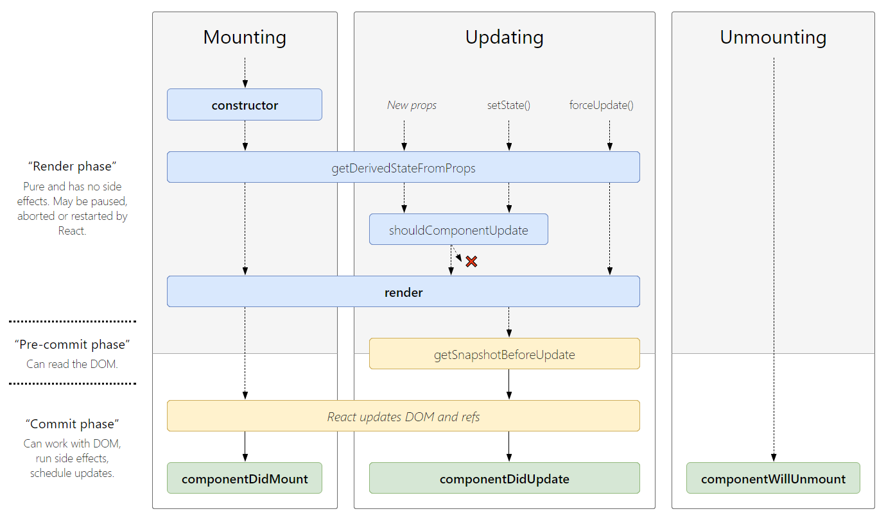
</p>

**1. Mounting:**  

These methods are called in the following order when an instance of a component is being created and inserted into the DOM:

* `constructor()`
* `getDerivedStateFromProps()`
* `render()`
* `componentDidMount()`

**2. Updating:**  

The next phase in the lifecycle is when a component is updated. A component is updated whenever there is a change in the component\'s state or props.

React has five built-in methods that gets called, in this order, when a component is updated:

* `getDerivedStateFromProps()`
* `shouldComponentUpdate()`
* `render()`
* `getSnapshotBeforeUpdate()`
* `componentDidUpdate()`

**3. Unmounting:**  

The next phase in the lifecycle is when a component is removed from the DOM, or unmounting as React likes to call it.

* `componentWillUnmount()`

<div align="right">
    <b><a href="#table-of-contents">↥ back to top</a></b>
</div>

## Q. How to make component to perform an action only once when the component initially rendered?

**1. Using Class Component:**

The `componentDidMount()` lifecycle hook can be used with class components. Any actions defined within a `componentDidMount()` lifecycle hook are called only once when the component is first mounted.

**Example:**

```js
class Homepage extends React.Component {
  componentDidMount() {
    trackPageView('Homepage') // Runs only once after first render
  }
  render() {
    return <div>Homepage</div>
  }
}
```

**2. Using Functional Component:**

The `useEffect()` hook can be used with function components. The `useEffect()` hook is more flexible than the lifecycle methods used for class components. It receives two parameters:

* The first parameter it takes is a callback function to be executed.
* The optional second parameter it takes is an array containing any variables that are to be tracked.

The value passed as the second argument controls when the callback is executed:

* If the second parameter is **undefined**, the callback is executed every time that the component is rendered.
* If the second parameter contains an array of variables, then the callback will be executed as part of the first render cycle and will be executed again each time an item in the array is modified.
* If the second parameter contains an empty array, the callback will be executed only once as part of the first render cycle.

**Example:**

```js
const Homepage = () => {
  useEffect(() => {
    trackPageView('Homepage') // Runs only once after first render
  }, []) // Empty dependency array is the key!
  
  return <div>Homepage</div>
}
```

<div align="right">
    <b><a href="#table-of-contents">↥ back to top</a></b>
</div>

## Q. What is the typical pattern for rendering a list of components from an array of data?  

The typical pattern for rendering a list of components from an array of data in React is to use the `.map()` method:

**Example:** 

```js
const fruits = ['Apple', 'Banana', 'Cherry'];

function FruitList() {
  return (
    <ul>
      {fruits.map((fruit, index) => (
        <li key={index}>{fruit}</li>
      ))}
    </ul>
  );
}
```

<div align="right">
    <b><a href="#table-of-contents">↥ back to top</a></b>
</div>

## Q. What is difference between useEffect() vs componentDidMount()?

In react when we use class based components we get access to lifecycle methods ( like `componentDidMount()`, `componentDidUpdate(), etc ). But when we want use a functional component and also we want to use lifecycle methods, then using useEffect() we can implement those lifecycle methods.

**1. componentDidMount():**

The `componentDidMount()` and `useEffect()` run after the mount. However useEffect() runs after the paint has been committed to the screen as opposed to before. This means we would get a flicker if needed to read from the DOM, then synchronously set state to make new UI.

The `useLayoutEffect()` was designed to have the same timing as componentDidMount(). So `useLayoutEffect(fn, [])` is a much closer match to componentDidMount() than useEffect(fn, []) -- at least from a timing standpoint.

```js
/**
 * componentDidMount() in Class Component
 */
import React, { Component } from "react";

export default class SampleComponent extends Component {
  componentDidMount() {
    // code to run on component mount
  }
  render() {
    return <>componentDidMount Example</>;
  }
}
```

**2. useEffect():**

```js
/**
 * useEffect() in Functional Component
 */
import React, { useEffect } from "react";

const SampleComponent = () => {
  useEffect(() => {
    // code to run on component mount
  }, []);
  return <>useEffect Example</>;
};
export default SampleComponent;
```

When `useEffect()` is used to get data from server.

* The first argument is a callback that will be fired after browser layout and paint. Therefore it does not block the painting process of the browser.
* The second argument is an array of values (usually props).
* If any of the value in the array changes, the callback will be fired after every render.
* When it is not present, the callback will always be fired after every render.
* When it is an empty list, the callback will only be fired once, similar to componentDidMount.

<div align="right">
    <b><a href="#table-of-contents">↥ back to top</a></b>
</div>

## Q. Why is a component constructor called only once?

React\'s **reconciliation algorithm** assumes that without any information to the contrary, if a custom component appears in the same place on subsequent renders, it\'s the same component as before, so reuses the previous instance rather than creating a new one.

**Key Concept:** React uses component position in the tree to determine identity. If a component renders in the same spot, React keeps the same instance alive.

**How to Force a New Instance:**

If you give each component a unique key `prop`, React can use the key change to infer that the component has actually been substituted and will create a new one from scratch, giving it the full component lifecycle.

**Example:**

```js
renderContent() {
  if (this.state.activeItem === 'item-one') {
    return (
      <ComponentA title="First" key="first" />
    )
  } else {
    return (
      <ComponentA title="Second" key="second" />
    )
  }
}
```

When the `key` changes, React recognizes it as a different component and will:

* Unmount the old instance
* Create a new instance from scratch
* Call the constructor again
* Go through the full component lifecycle

This is why constructors are called only once per component instance - React optimizes by reusing instances when possible, unless you explicitly signal otherwise with the key prop.

<div align="right">
    <b><a href="#table-of-contents">↥ back to top</a></b>
</div>

## Q. What is difference between componentDidMount() and componentWillMount()?

**componentDidMount():**

The `componentDidMount()` is executed after the first render only on the client side. This is where AJAX requests and DOM or state updates should occur. This method is also used for integration with other JavaScript frameworks and any functions with delayed execution such as `setTimeout()` or `setInterval()`.

**Example:**

```js
class App extends Component {
  componentDidMount() {
    this.getData() // API calls go here
  }
  
  getData() {
    setTimeout(() => {
      this.setState({ data: 'Data loaded!' })
    }, 1000)
  }
}
```

**componentWillMount():**

The `componentWillMount()` method is executed before rendering, on both the server and the client side. `componentWillMount()` method is the least used lifecycle method and called before any HTML element is rendered. It is useful when we want to do something programmatically right before the component mounts.

**Example:**

```js
class App extends Component {
  componentWillMount() {
    console.log('First this called') // Runs before render
  }
  
  componentDidMount() {
    this.getData() // Runs after render
  }
}
```

**Note:** 

*`componentWillMount()` is now deprecated in modern React. You should avoid using it and use `componentDidMount()` or the `constructor()` instead for initialization logic.*

<div align="right">
    <b><a href="#table-of-contents">↥ back to top</a></b>
</div>

## Q. Is it good to use setState() in componentWillMount() method?

Avoid async initialization in `componentWillMount()`.

`componentWillMount()` is invoked immediately before mounting occurs. It is called before `render()`, therefore setting state in this method will not trigger a re-render. Avoid introducing any side-effects or subscriptions in this method.

Make async calls for component initialization in `componentDidMount()` instead of `componentWillMount()`

```js
function componentDidMount() {
  axios.get(`api/messages`)
    .then((result) => {
      const messages = result.data
      console.log("COMPONENT WILL Mount messages : ", messages);
      this.setState({
        messages: [...messages.content]
      })
    })
}
```

<div align="right">
    <b><a href="#table-of-contents">↥ back to top</a></b>
</div>

## Q. How to use componentWillUnmount() with Functional Components in React?

The **useEffect()** can be used to manage API calls, as well as implementing **componentWillMount()**, and **componentWillUnmount()**.

If we pass an empty array as the second argument, it tells useEffect to fire on component load. This is the only time it will fire.

```js
import React, { useEffect } from 'react';

const ComponentExample = () => {
  useEffect(() => {
    console.log('Component mounted');
    // This runs once on mount
  }, []); // Empty array = runs only on mount
}
```

If you add a return function inside the useEffect() function, it is triggered when a component unmounts from the DOM.

```js
import React, { useEffect } from 'react';

const ComponentExample = () => {
  useEffect(() => {
    console.log('Component mounted');
    
    // Return a cleanup function
    return () => {
      console.log('Component will unmount');
      // Cleanup: remove listeners, cancel subscriptions, etc.
    };
  }, []); // Empty array ensures cleanup runs only on unmount
}
```

<div align="right">
    <b><a href="#table-of-contents">↥ back to top</a></b>
</div>

## # 4.3. PURE COMPONENTS

<br/>

## Q. What are Pure Components in React?

**Pure Components** in React are the components which do not re-renders when the value of state and props has been updated with the same values. Pure Components restricts the re-rendering ensuring the higher performance of the Component.

**Features of React Pure Components:**

* Prevents re-rendering of Component if props or state is the same
* Takes care of `shouldComponentUpdate()` implicitly
* `State()` and `Props` are Shallow Compared
* Pure Components are more performant in certain cases

**Example:**

```js
/**
 * React Pure Component
 */
export default class App extends React.PureComponent {
  constructor() {
    super();
    this.state = {
      userArray: [1, 2, 3, 4, 5]
    };
    // Here we are creating the new Array Object during setState using "Spread" Operator
    setInterval(() => {
      this.setState({
        userArray: [...this.state.userArray, 6]
      });
    }, 1000);
  }

  render() {
    return <b>Array Length is: {this.state.userArray.length}</b>;
  }
}
```

**&#9885; [Try this example on CodeSandbox](https://codesandbox.io/s/react-purecomponent-gpegf8?file=/src/App.js)**

<div align="right">
    <b><a href="#table-of-contents">↥ back to top</a></b>
</div>

## Q. What is difference between Pure Component vs Component?

PureComponent is exactly the same as Component except that it handles the `shouldComponentUpdate()` method. The major difference between React.PureComponent and React.Component is PureComponent does a shallow comparison on state change. It means that when comparing scalar values it compares their values, but when comparing objects it compares only references. It helps to improve the performance of the app.

A component rerenders every time its parent rerenders, regardless of whether the component\'s props and state have changed.
On the other hand, a pure component will not rerender if its parent rerenders, unless the pure component\'s `props` (or `state`) have changed.

**When to use React.PureComponent:**

* State/Props should be an immutable object
* State/Props should not have a hierarchy
* We should call forceUpdate when data changes

**Example:**

```js
// Regular class component
class App extends React.Component {
  render() {
    console.log('Regular component rendered');
    return <h1>Component Example !</h1>
  }
}

// React Pure class component
class Message extends React.PureComponent {
  render() {
    console.log('Pure component rendered');
    return <h1>PureComponent Example !</h1>
  }
}
```

<div align="right">
    <b><a href="#table-of-contents">↥ back to top</a></b>
</div>

## Q. What are the problems of using render props with PureComponent?

If you create a function inside a **render** method, it negates the purpose of pure component. Because the shallow prop comparison will always return **false** for new props, and each **render** in this case will generate a new value for the render prop. You can solve this issue by defining the render function as instance method.

**Example:**

```js
class Mouse extends React.PureComponent {
  // Mouse Component...
}

class MouseTracker extends React.Component {
  // Defined as an instance method, `this.renderTheCat` always
  // refers to *same* function when we use it in render
  renderTheCat(mouse) {
    return <Cat mouse={mouse} />;
  }

  render() {
    return (
      <div>
        <h1>Move the mouse around!</h1>
        {/* define the render function as instance method */}
        <Mouse render={this.renderTheCat} /> 
      </div>
    );
  }
}
```

<div align="right">
    <b><a href="#table-of-contents">↥ back to top</a></b>
</div>

## Q. When to use PureComponent over Component?

In React class components, use `PureComponent` over `Component` to optimize performance by preventing unnecessary re-renders. While Component re-renders every time its parent does, PureComponent only re-renders if its props or state actually change based on a shallow comparison.

**When to Use PureComponent**

* **Performance Bottlenecks**: When a component is expensive to render (e.g., contains complex calculations or many children) and you want to skip updates if the data is identical.
* **Predictable Props/State**: When your data consists of primitive types (strings, numbers, booleans) or stable object references.
* **Large Lists**: It is highly effective for individual items in large lists or tables where many items remain unchanged while the parent updates.
* **Immutable Data**: If you use libraries like Immutable.js or always create new object references for updates, PureComponent will accurately detect changes. 

**When to Stick with Component**

* **Deeply Nested Data**: PureComponent only does a shallow check. If you mutate a property inside a nested object without changing the top-level reference, the component will not re-render, leading to stale UI.
* **Custom Update Logic**: If you need to manually control when a component updates (e.g., only when specific props change), you must use Component and implement the shouldComponentUpdate lifecycle method.
* **Frequent Changes**: If the props/state change on every render anyway, the extra "shallow comparison" step becomes unnecessary overhead that can slightly slow down your app. 

**Example:**

```js
// ✅ Good use of PureComponent
class UserCard extends React.PureComponent {
  render() {
    const { name, age, email } = this.props; // Simple props
    return <div>{name} - {age} - {email}</div>;
  }
}

// ❌ Bad use of PureComponent
class UserProfile extends React.PureComponent {
  render() {
    const { user } = this.props; // Complex nested object
    return <div>{user.profile.settings.theme}</div>;
  }
}
```

**Modern Alternative**

React now recommends defining components as functions instead of classes. To get the performance benefits of PureComponent in a functional component, wrap it in `React.memo()`.

<div align="right">
    <b><a href="#table-of-contents">↥ back to top</a></b>
</div>

## # 4.4. HIGHER ORDER COMPONENTS

<br/>

## Q. What are Higher Order Components in React.js?

**Higher Order Components (HOCs)** are advanced React patterns where a function takes a component and returns a new enhanced component with additional props or functionality.

<p align="center">
  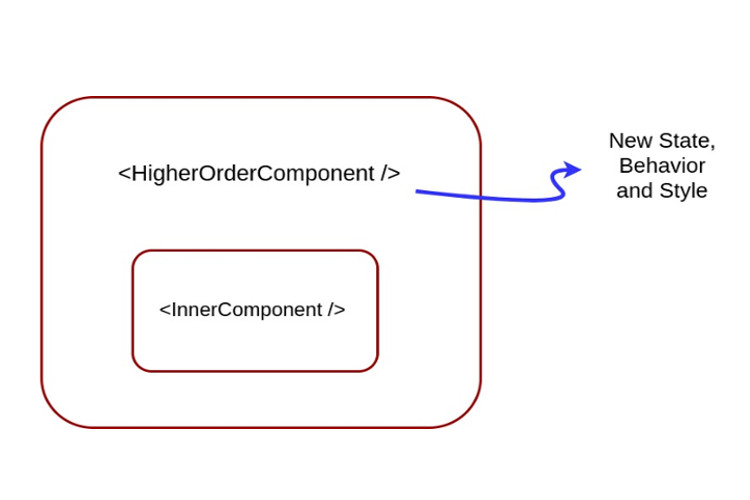
</p>

Higher-Order Components are not part of the React API. They are the pattern that emerges from React\'s compositional nature. The component transforms props into UI, and a higher-order component converts a component into another component. The examples of HOCs are Redux\'s connect and Relay\'s createContainer.

```js
/**
 * HOC that adds loading functionality
 */
function withLoading(Component) {
  return function WithLoadingComponent({ isLoading, ...props }) {
    if (isLoading) {
      return <div>Loading...</div>;
    }
    return <Component {...props} />;
  };
}

// Usage
const UserList = ({ users }) => (
  <ul>{users.map(user => <li key={user.id}>{user.name}</li>)}</ul>
);

const UserListWithLoading = withLoading(UserList);

// Render with loading state
<UserListWithLoading isLoading={true} users={[]} />
```

**Note:**

* A HOC does not modify or mutate components. It creates a new one.
* A HOC is used to compose components for code reuse.
* A HOC is a pure function. It has no side effects, returning only a new component.

**Modern alternatives:**

HOCs are still valid, but Hooks are often preferred for most use cases:

```js
// HOC approach
const UserProfile = withAuth(withData(Component));

// Hooks approach (cleaner)
function UserProfile() {
  const { isAuthenticated, user } = useAuth();
  const { data, loading } = useData('/api/user');
  
  if (!isAuthenticated) return <Redirect to="/login" />;
  if (loading) return <Spinner />;
  
  return <div>{data.name}</div>;
}
```

**&#9885; [Try this example on CodeSandbox](https://codesandbox.io/s/react-hoc-3qrt5b?file=/src/App.js)**

<div align="right">
    <b><a href="#table-of-contents">↥ back to top</a></b>
</div>

## Q. What are the benefits of using HOC?

**Benefits:**

* **Code Reusability** - HOCs allow you to extract common logic used by many components into a single, reusable function. This prevents code duplication (Don\'t Repeat Yourself) and makes updates significantly easier because changes to the shared logic only need to be made in one place

* **No Method Name Clashing** - If two HOCs implement the same method, there is no name collision

* **Single Responsibility Principle** - Easy to make small, reusable units of code that follow SRP

* **Composability** - HOCs can be nested or "composed" together to add multiple layers of functionality to a single component. Because they are pure functions that return components, they are easy to chain using utility functions like compose (often found in libraries like Redux or Lodash).

**Problems:**

* Boilerplate code needed (like setting `displayName` for debugging)
* Must ensure all relevant props are passed through to the component
* Need to hoist static methods from the wrapped component
* Composing several HOCs can create a deeply nested tree that\'s difficult to debug

<div align="right">
    <b><a href="#table-of-contents">↥ back to top</a></b>
</div>

## Q. What are Higher Order Component factory implementations?

Creating a higher order component basically involves manipulating WrappedComponent which can be done in two ways:

* Props Proxy (PP)
* Inheritance Inversion (II)

Both enable different ways of manipulating the WrappedComponent.

**1. Props Proxy:**

In this approach, The HOC creates a container component that wraps the `WrappedComponent`. It intercepts incoming props, adds or modifies them, and then passes them down.

**Example:**

```js
function ppHOC(WrappedComponent) {
   return class PP extends React.Component {
     render() {
       return <WrappedComponent {...this.props}/>
     }
   }
}
```

Props Proxy can be implemented via a number of ways

* Manipulating props
* Accessing the instance via Refs
* Abstracting State
* Wrapping the WrappedComponent with other elements

**2. Inheritance Inversion:**

Inheritance Inversion allows the HOC to have access to the `WrappedComponent` instance via `this` keyword, which means it has access to the `state`, `props`, component lifecycle hooks and the `render` method.

**Example:**

```js
function iiHOC(WrappedComponent) {
   return class Enhancer extends WrappedComponent {
     render() {
       return super.render()
     }
   }
}
```

Inheritance Inversion can be used in:

* Conditional Rendering (Render Highjacking)
* State Manipulation

The key difference is that Props Proxy wraps the component from the outside, while Inheritance Inversion extends the component directly, giving deeper access to its internals.

**Differences**

|Feature      	|Props Proxy (PP)	      |Inheritance Inversion (II)|
|---------------|-----------------------|---------------------------|
|Primary Method	|Composes via wrapping	|Composes via inheritance|
|Logic Type	    |Adding/modifying props	|Manipulating render/state|
|Component Support|	Class & Functional	|Class only|
|Complexity	    |Simple & Readable      |	Advanced & Powerful|

<div align="right">
    <b><a href="#table-of-contents">↥ back to top</a></b>
</div>

## Q. Explain Inheritance Inversion (iiHOC) in react?

Inheritance Inversion (iiHOC) is a powerful but rare implementation of Higher-Order Components where the returned component extends the WrappedComponent instead of wrapping it. 

It is called "Inversion" because, in standard object-oriented programming, a specialized component would extend a base class to get more features. Here, the HOC (the enhancer) is the one doing the extending, giving it "passive" control over the original component. 

Inheritance Inversion gives the HOC access to the WrappedComponent instance via this, which means we can use the `state`, `props`, component lifecycle and even the `render` method.

**Example:**

```js
/**
 * Inheritance Inversion
 */
class Welcome extends React.Component {
  render() {
    return (
      <div> Welcome {his.props.user}</div>
    )
  }
}

const withUser = (WrappedComponent) => {
  return class extends React.Component {
    render() {
      if(this.props.user) {
        return  (
          <WrappedComponent {...this.props} />
        )
      }
      return <div>Welcome Guest!</div>
    }
  }
}

const withLoader = (WrappedComponent) => {
  return class extends WrappedComponent {
    render() {
      const { isLoader } = this.props
      if(!isLoaded) {
        return <div>Loading...</div>
      }
      return super.render()
    }
  }
}

export default withLoader(withUser(Welcome))
```

<div align="right">
    <b><a href="#table-of-contents">↥ back to top</a></b>
</div>

## Q. How to create props proxy for Higher Order Component component?

To create a props proxy for a Higher Order Component (HOC) in React, you wrap a component and pass all received props to the `WrappedComponent`. This allows the HOC to intercept, modify, or add props before passing them down.

**Example:**

```js
function withPropsProxy(WrappedComponent) {
  return function PropsProxyComponent(props) {
    // You can modify or add props here if needed
    return <WrappedComponent {...props} />;
  };
}
```
Usage:

```js
const EnhancedComponent = withPropsProxy(MyComponent);
// <EnhancedComponent someProp="value" /> will pass someProp to MyComponent
```

This pattern is called a "props proxy" because the HOC acts as a proxy for the props, allowing you to manipulate them as needed before rendering the wrapped component.

**Props Proxy HOCs are useful to the following situations:**

* Manipulating props
* Accessing the instance via Refs (be careful, avoid using refs)
* Abstracting State
* Wrapping/Composing the WrappedComponent with other elements

<div align="right">
    <b><a href="#table-of-contents">↥ back to top</a></b>
</div>

## Q. What is the purpose of displayName class property?

By default, React infers the `displayName` from the function or class name, but it can set it explicitly—especially useful for higher-order components (HOCs) that wrap other components, so the debug output reflects the wrapped component\'s name.

It helps tools like React DevTools and error messages show a clear, descriptive name for the component, making it easier to identify in the component tree.

**Example:**

```js
function withSubscription(WrappedComponent) {
  
  class WithSubscription extends React.Component {/* ... */}
  
  WithSubscription.displayName = `WithSubscription(${getDisplayName(WrappedComponent)})`;
  return WithSubscription;
}

function getDisplayName(WrappedComponent) {
  return WrappedComponent.displayName || WrappedComponent.name || 'Component';
}
```

<div align="right">
    <b><a href="#table-of-contents">↥ back to top</a></b>
</div>

## # 4.5. LAZY LOADING

<br/>

## Q. How to set up lazy loading components in React?

**1. REACT.LAZY():**

**React.lazy** is a function that lets you load components lazily through what is called code splitting without help from any external libraries. It makes possible for us to dynamically import components but they are rendered like regular components. This means that the bundle containing the component will only be loaded when the component is rendered.

React.lazy() takes a function that returns a promise as it\'s argument, the function returns a promise by calling import() to load the content. The returned Promise resolves to a module with a default containing the React Component.

**Example:** Create a lazy wrapper for your component

```js
// Without Lazy
import MyComponent from './MyComponent';
 
// With Lazy
const MyComponent = React.lazy(() => import('./MyComponent'));
```

**2. SUSPENSE:**

**React.Suspense** is a component that can be used to wrap lazy components. A React.Suspense takes a fallback prop that can be any react element, it renders this prop as a placeholder to deliver a smooth experience and also give user feedback while the lazy component is being loaded.

**Example:** Use a suspense boundary with a custom loading indicator:

```js
/**
 * Suspense
 */
import React, { Suspense } from 'react';

const MyComponent = React.lazy(() => import('./MyComponent'));

const App = () => {
  return (
    <div>
      <Suspense fallback={<div>Loading ... </div>}>
        <MyComponent />
      </Suspense>
    </div>
  );
}
```

**Example:** For navigation, lazy load each page and wrap the navigation area:

```js
/**
 * React Lazy Loading Routes
 */
import { lazy, Suspense } from 'react';
import { Routes, Route, Link } from 'react-router-dom';

const Dashboard = lazy(() => import('./Dashboard'));
const Profile = lazy(() => import('./Profile'));

function Navigation() {
  return (
    <Suspense fallback={<span>Loading page...</span>}>
      <nav>
        <Link to="/">Dashboard</Link>
        <Link to="/profile">Profile</Link>
      </nav>
      <Routes>
        <Route path="/" element={<Dashboard />} />
        <Route path="/profile" element={<Profile />} />
      </Routes>
    </Suspense>
  );
}
```

This method ensures components are loaded only when needed, improving performance and user experience.

**&#9885; [Try this example on CodeSandbox](https://codesandbox.io/s/react-lazy-loading-967o2?file=/src/App.js)**

<div align="right">
    <b><a href="#table-of-contents">↥ back to top</a></b>
</div>

## # 5. REACT PROPS

<br/>

## Q. What is props in React?

In React, **props** (short for "properties") are read-only objects used to pass data from a parent component to a child component. However, callback functions can also be passed, which can be executed inside the child to initiate an update.

Props are **immutable** so we cannot modify the props from inside the component. These attributes are available in the class component as **this.props** and can be used to render dynamic data in our render method.

**Characteristics of Props**

* **Unidirectional Data Flow**: Data always flows in one direction—from parent to child.
* **Immutability**: Props are read-only. A child component cannot modify the props it receives; it can only consume them to render content or trigger logic.
* **Dynamic Content**: By using props, you can make a single component reusable by passing different data to it each time it is rendered.
* **Any Data Type**: You can pass strings, numbers, booleans, objects, arrays, and even functions (callbacks) as props

**Example:**

```js
// Receiving Props
function Welcome(props) {
  return <h1>Hello, {props.name}</h1>;
}

// Passing Props
const element = <Welcome name="Pradeep!" />;
```

**Example:** Destructuring 

```js
function Welcome({ name, age }) {
  return <h1>Hello, {name}. You are {age} years old.</h1>;
}
```

**Special Props**

* **children**: A built-in prop that represents whatever content is placed between the opening and closing tags of a component.
* **Default Props**: You can set fallback values for props in case the parent doesn\'t provide them. 


**&#9885; [Try this example on CodeSandbox](https://codesandbox.io/s/react-props-2k0081?file=/src/App.js)**

<div align="right">
    <b><a href="#table-of-contents">↥ back to top</a></b>
</div>

## Q. Why props in React are read only?

In React, props are read-only because components are designed to act like **pure functions**. This means they should not attempt to change their inputs (props) and must always return the same JSX output for the same set of props.

Here are the primary reasons why this rule is strictly enforced:

**1. Unidirectional Data Flow**

React follows a one-way data flow, where data travels from parent to child. If a child component could modify its own props, it would be effectively changing the state of its parent without the parent\'s knowledge. This would make the application\'s data flow unpredictable and extremely difficult to trace. 

**2. Predictability and Debugging**

When props are immutable, you can be certain that a component\'s data won\'t change unexpectedly within its own scope. If a bug occurs, you only need to look "up" the component tree to the parent to find where the data originated, rather than checking every child that might have modified it. 

**3. Performance Optimization**

React is highly efficient because it uses shallow reference equality to decide if a component needs to re-render. 

  * If you could mutate props directly (e.g., props.user.name = 'New Name'), the reference to the props object would remain the same.
  * Because the reference hasn\'t changed, React might assume nothing is different and skip necessary UI updates. 

**4. Clear Separation of Concerns**

A component should only be responsible for managing its own internal state. Props represent the "external interface" or the configuration provided by the outside world. Keeping them read-only ensures that components remain reusable and independent of where they are used. 

**&#9885; [Try this example on CodeSandbox](https://codepen.io/learning-zone/pen/zYwPYwP?editors=1010)**

<div align="right">
    <b><a href="#table-of-contents">↥ back to top</a></b>
</div>

## Q. What are default props?

The **defaultProps** is a React component property that allows you to set default values for the props argument. If the prop property is passed, it will be changed.

The `defaultProps` can be defined as a property on the component class itself to set the default props for the class. `defaultProps` is used for **undefined** props, not for **null** props.

```js
/**
 * Default Props
 */
class MessageComponent extends React.Component {
   render() {
        return (
          <div>Hello, {this.props.value}.</div>
        )
    }
}

// Pass default Props
MessageComponent.defaultProps = {
  value: 'World'  
}
```

For function components, you can use default values in destructuring:

**Example:**

```js
function Greeting({ name = "Guest" }) {
  return <h1>Hello, {name}!</h1>;
}
```

**&#9885; [Try this example on CodeSandbox](https://codepen.io/learning-zone/pen/oNWoNPm?editors=1010)**

<div align="right">
    <b><a href="#table-of-contents">↥ back to top</a></b>
</div>

## Q. How to access props inside quotes in React JSX?

React JSX doesn\'t support variable interpolation inside an attribute value, but we can put any JS expression inside curly braces as the entire attribute value.

**1. Concatenation**

```js

```

**2. Template literals**

```js

```

**Example:**

```js
/**
 * Access Props
 */
class App extends Component {
  render() {
    return (
      <div>
        
      </div>
    );
  }
}
  
export default App;
```

**&#9885; [Try this example on CodeSandbox](https://codepen.io/learning-zone/pen/VwbrYwo)**

<div align="right">
    <b><a href="#table-of-contents">↥ back to top</a></b>
</div>

## Q. How to pass numbers to React component?

In react, numbers can be passed via curly braces(`{}`) where as strings in quotes (`""`);

**Example:**

```js
function App() {
  return <Greetings name="Pradeep" age={28} occupation="Software Developer" />;
}

// Greetings Component
function Greetings(props) {
  return (
    <h2>
      Hello! I'm {props.name}, a {props.age} years old {props.occupation}.
      Pleased to meet you!
    </h2>
  );
}
```

**&#9885; [Try this example on CodeSandbox](https://codesandbox.io/s/react-number-props-tw1r1?file=/src/App.js)**

<div align="right">
    <b><a href="#table-of-contents">↥ back to top</a></b>
</div>

## Q. How are boolean props used in React?

Boolean props in React are used to pass true/false values to components. In JSX:

* To pass true: `<MyComponent prop />` or `<MyComponent prop={true} />`
* To pass false: `<MyComponent prop={false} />`

**Example:**

```js
/**
 * Boolean Props
 */
const MyComponent = ({ prop1, prop2 }) => (
  <div>
    <div>Prop1: {String(prop1)}</div>
    <div>Prop2: {String(prop2)}</div>
  </div>
) 

function App() {
  return (
    <div>
      <MyComponent prop1={true} prop2={false} />
      <MyComponent prop1 prop2 />
      <MyComponent prop1={false} prop2 />
    </div>
  );
}
```

**&#9885; [Try this example on CodeSandbox](https://codepen.io/learning-zone/pen/abWVzJx)**

<div align="right">
    <b><a href="#table-of-contents">↥ back to top</a></b>
</div>

## Q. How to apply validation on Props in React?

To apply validation on props in React, you can use either the `PropTypes` library for runtime checks or **TypeScript** for static type-checking during development

**Example:** Using PropTypes (Runtime Validation)

```js
/**
 * Props Validation
 */
import PropTypes from 'prop-types';

function MyComponent({ name, age }) {
  return <h1>{name} is {age}</h1>;
}

MyComponent.propTypes = {
  name: PropTypes.string.isRequired, // Must be a string and is mandatory
  age: PropTypes.number  // Optional number
};
```

**Example:** Using TypeScript (Static Validation)

```js
interface UserProps {
  name: string;
  age?: number; // The '?' makes it optional
}

const MyComponent: React.FC<UserProps> = ({ name, age }) => {
  return <h1>{name} is {age}</h1>;
};
```

**&#9885; [Try this example on CodeSandbox](https://codesandbox.io/s/react-proptypes-41qmyz?file=/src/App.js)**

<div align="right">
    <b><a href="#table-of-contents">↥ back to top</a></b>
</div>

## Q. How to specify the shape of an object with PropTypes

The `PropTypes.shape()` validator can be used when describing an object whose keys are known ahead of time, and may represent different types.

**Example:**

```js
/**
 * PropTypes.shape()
 * @param {*} props
 */
import PropTypes from "prop-types";

const Component = (props) => (
  <div>
    Component badge: {props.badge ? JSON.stringify(props.badge) : "none"}
  </div>
);

// PropTypes validation for the prop object
Component.propTypes = {
  badge: PropTypes.shape({
    src: PropTypes.string.isRequired,
    alt: PropTypes.string.isRequired
  })
};

const App = () => (
  <div>
    <Component badge={{ src: "horse.png", alt: "Running Horse" }} />
    {/*<Component badge={{src:null, alt: 'this one gives an error'}}/>*/}
    <Component />
  </div>
);

export default App;
```

Output:

```js
Component badge: {"src":"horse.png","alt":"Running Horse"}
Component badge: none
```

**&#9885; [Try this example on CodeSandbox](https://codesandbox.io/s/react-proptypes-khi20j?file=/src/App.js)**

<div align="right">
    <b><a href="#table-of-contents">↥ back to top</a></b>
</div>

## Q. How PropTypes.objectOf is different from PropTypes.shape?

`PropTypes.shape` checks for a specific structure (keys and their types) in an object. Each key can have a different type.

`PropTypes.objectOf` checks that all values in the object are of a specific type, but does not enforce specific keys.

**Example:**

`PropTypes.shape({ name: PropTypes.string, age: PropTypes.number })`
→ Expects an object with keys name (string) and age (number).

`PropTypes.objectOf(PropTypes.string)`
→ Expects an object where all values are strings, regardless of the keys.

```js
/**
 * PropTypes
 */
import PropTypes from 'prop-types';

// Expected prop object - dynamic keys (i.e. user ids)
const myProp = {
  25891102: 'Shila Jayashri',
  34712915: 'Employee',
  76912999: 'shila.jayashri@email.com'
};

// PropTypes validation for the prop object
MyComponent.propTypes = {
  myProp: PropTypes.objectOf(PropTypes.number)
};
```

<div align="right">
    <b><a href="#table-of-contents">↥ back to top</a></b>
</div>

## Q. How React PropTypes allow different types for one prop?

Using `PropTypes.oneOfType()` says that a prop can be one of any number of types. For instance, a phone number may either be passed to a component as a string or an integer:

```js
/**
 * PropTypes.oneOfType()
 */
const Component = (props) => <div>Phone Number: {props.phoneNumber}</div>

Component.propTypes = {
  phoneNumber: PropTypes.oneOfType([
     PropTypes.number,
     PropTypes.string
  ]),
}

const App = () => (
  <div>
    <Component phoneNumber={04403472916}/>
    {/*<Component phoneNumber={"2823788557"}/>*/}
  </div>
);
```

**&#9885; [Try this example on CodeSandbox](https://codepen.io/learning-zone/pen/LYyOmdP?editors=0011)**

<div align="right">
    <b><a href="#table-of-contents">↥ back to top</a></b>
</div>

## Q. What are render props?

Render props are a React pattern where a component accepts a **function as a prop**, and calls that function to determine what to render.

The function receives data or state from the component and returns React elements. This enables sharing logic between components.

**Example:**

```js
/**
 * Render Props
 */

import Wrapper from "./Wrapper";

class App extends React.Component {
  render() {
    return (
      <Wrapper
        render={({ increment, count }) => (
          <div>
            <h3>Render Props Counter</h3>
            <p>{count}</p>
            <button onClick={() => increment()}>Increment</button> 
          </div>
        )}
      />
    );
  }
}
```

```js
/**
 * Wrapper Component
 */
class Wrapper extends React.Component {
  state = {
    count: 0
  };

  // Increase count
  increment = () => {
    const { count } = this.state;
    return this.setState({ count: count + 1 });
  };

  render() {
    const { count } = this.state;

    return (
      <div>
        {this.props.render({ increment: this.increment, count: count })}
      </div>
    );
  }
}
```

**Important Caution:** If you define a render prop function inline (inside the render method), it creates a new function on every render, which can cause performance issues by triggering unnecessary re-renders in child components.

**&#9885; [Try this example on CodeSandbox](https://codesandbox.io/s/react-render-props-c80gs?file=/src/index.js)**

<div align="right">
    <b><a href="#table-of-contents">↥ back to top</a></b>
</div>

## Q. What are the benefits of using Render Props?

The benefits of using Render Props in React are:

* **Code Reusability**: Share logic between components without duplicating code.
* **Flexibility**: Easily customize what gets rendered by passing different render functions.
* **Isolation**: State and logic are encapsulated in the render prop component, avoiding naming collisions.
* **No Static Method Hoisting**: No need to hoist static methods as with HOCs.
* **Clear Data Flow**: It\'s explicit which data and methods are shared, making the code easier to understand and maintain.

**Problems:**

* Caution using **`shouldComponentUpdate()`** as the render prop might close over data it is unaware of.
* There could also be minor memory issues when defining a closure for every render. But be sure to measure first before  making performance changes as it might not be an issue for your app.
* Another small annoyance is the render props callback is not so neat in JSX as it needs to be wrapped in an expression.  Rendering the result of an HOC does look cleaner.

<div align="right">
    <b><a href="#table-of-contents">↥ back to top</a></b>
</div>

## Q. How do you create Higher Order Component using render props?

You can create a Higher Order Component (HOC) using render props by combining the two patterns: the HOC returns a component that uses a render prop to share logic or state with the wrapped component. Here is how you do it:

* Define a function (the HOC) that takes a component as an argument.
* Inside, return a new component that renders the original component, passing it data or methods via props.
* Use a render prop internally to provide the shared logic or state.

**Example:**

```js
// HOC using render props
function withMouse(Component) {
  return class extends React.Component {
    render() {
      return (
        <Mouse
          render={mouse => <Component {...this.props} mouse={mouse} />}
        />
      );
    }
  };
}

// Render prop component
class Mouse extends React.Component {
  state = { x: 0, y: 0 };
  handleMouseMove = e => {
    this.setState({ x: e.clientX, y: e.clientY });
  };
  render() {
    return (
      <div style={{ height: '100vh' }} onMouseMove={this.handleMouseMove}>
        {this.props.render(this.state)}
      </div>
    );
  }
}

// Usage
const Cat = ({ mouse }) => (
  
);

const CatWithMouse = withMouse(Cat);
```

<div align="right">
    <b><a href="#table-of-contents">↥ back to top</a></b>
</div>

## Q. Explain HOC vs render props in react.js?

**1. Higher-Order Component (HOC):**

* An HOC is a function that takes a component and returns a new component with enhanced behavior or additional props.
* It works like a decorator, wrapping the original component.

**Example:**

```js
function withLogger(WrappedComponent) {
  return function(props) {
    console.log('Props:', props);
    return <WrappedComponent {...props} />;
  };
}
```

**2. Render Props:**

* A render prop is a function prop that a component uses to know what to render.
* The parent component provides a function as a prop, and the child calls it, passing in data or state.

**Example:**

```js
<DataProvider render={data => <Display data={data} />} />
```

The `render` function receives data and returns React elements.

**Key Differences**:

* HOC wraps a component and returns a new one; Render Props passes a function to a component to control rendering.
* HOC is more like composition via wrapping; Render Props is composition via function-as-child.
* Render Props can be more flexible and explicit, but may lead to "wrapper hell" if overused.

<div align="right">
    <b><a href="#table-of-contents">↥ back to top</a></b>
</div>

## Q. What is children props?

The `{this.props.children}` is a special prop, automatically passed to every component, that can be used to render the content included between the opening and closing tags when invoking a component.

**Example:**

```js
/**
 * React Children Props
 */
function MyComponent(props) {
  return <div>{props.children}</div>;
}

// Usage:
<MyComponent>
  <p>This is a child element.</p>
  <AnotherComponent />
</MyComponent>
```

Here, `props.children` will contain the `<p>` and `<AnotherComponent />` elements.

**Key points:**

* Enables component composition and nesting.
* Can be a single element, multiple elements, or even text.
* Used for flexible layouts and reusable wrappers.

**&#9885; [Try this example on CodeSandbox](https://codesandbox.io/s/react-children-props-952wx?file=/src/index.js)**

<div align="right">
    <b><a href="#table-of-contents">↥ back to top</a></b>
</div>

## Q. When we should use React.cloneElement vs this.props.children?

**1. React.cloneElement():**

Use `React.cloneElement()` when you need to modify or add props to a child element before rendering it, such as injecting additional data, event handlers, or styling. This is useful for component composition where the parent wants to enhance or control its children.

**2. this.props.Children():**  

Use `this.props.children` when you simply want to render the children passed to a component without modification. It\'s the default way to render nested elements in React.

**Example:** Using `this.props.children`

```js
/**
 * React Children Props
 */
function Parent({ children }) {
  return <div>{children}</div>;
}

// Usage:
<Parent>
  <button>Click me</button>
</Parent>
```

The button is rendered as-is.

**Example:** Using `React.cloneElement`

```js
/**
 * React Clone Element
 */
function Parent({ children }) {
  return React.cloneElement(children, { style: { color: 'red' } });
}

// Usage:
<Parent>
  <button>Click me</button>
</Parent>
```

The button is rendered with the additional `style` prop (text color red)

**Summary**:

* Use `React.cloneElement` for modify/add props to children before rendering.
* Use `this.props.children` for direct rendering without changes.

**&#9885; [Try this example on CodeSandbox](https://codesandbox.io/s/react-children-props-7ry7cc?file=/src/App.js)**

<div align="right">
    <b><a href="#table-of-contents">↥ back to top</a></b>
</div>

## Q. What do these three dots in React do?

In React, the three dots (...) are most commonly known as the **Spread Operator**. They are used to "spread" or expand the contents of an object or array into a new one.

**1. Spread props**: Pass all properties of an object as props to a component.

**Example:** This spreads all properties from the props object into the Profile component, so Profile receives name and age as props.

```js
const props = { name: "Alice", age: 25 };

function Profile(props) {
  return <div>{props.name}, {props.age}</div>;
}

// Usage:
<Profile {...props} />
```

**2. Merging Arrays or Objects**: Create shallow copies or merge objects/arrays.

**Example:**

```js
const [user, setUser] = useState({ name: "Alice", age: 25 });
const updates = { age: 26, city: "NY" };

setUser({ ...user, ...updates }); // Result: { name: "Alice", age: 26, city: "NY" }
```

**3. Rest Parameters**: In destructuring, `...rest` gathers the remaining properties into a new object.

**Example:**  Here, `label` is extracted from props, and all other props (`type`, `className`, etc.) are collected in `rest` and spread onto the `<button>` element.

```js
function Button({ label, ...rest }) {
  return <button {...rest}>{label}</button>;
}

// Usage:
<Button label="Click Me" type="submit" className="primary" />
```

The spread operator is a JavaScript feature, not React-specific, but it\'s commonly used in React for props and state management.

<div align="right">
    <b><a href="#table-of-contents">↥ back to top</a></b>
</div>

## Q. Why we need to be careful when spreading props on DOM elements?

Spreading props directly onto DOM elements (e.g., `<div {...props} />`) is often considered an **anti-pattern** because it bypasses explicit control over what attributes are rendered to the browser.

* **Unknown Prop Warnings**: Spreading props may pass non-standard or custom props to DOM elements, which can result in React warnings or browser errors, since the browser doesn\'t recognize these attributes.

* **Security risks**: Sensitive data or event handlers could unintentionally be exposed or attached to the DOM, increasing the risk of XSS or leaking information.

* **Performance issues**: Passing unnecessary props can clutter the DOM and slow down rendering.

* **Maintainability**: It becomes harder to track which props are actually used, making debugging and refactoring more difficult.

To avoid these issues, always filter props and only pass valid attributes to DOM elements.

**Example:** By creating props specifically for DOM attribute, we can safely spread.

```js
const Sample = () => (<Spread flag={true} domProps={{className: "content"}}/>);
const Spread = (props) => (<div {...props.domProps}>Test</div>);
```

Or alternatively we can use prop destructuring with `...rest`:

```js
const Sample = () => (<Spread flag={true} className="content"/>);
const Spread = ({ flag, ...domProps }) => (<div {...domProps}>Test</div>);
```

**Note:**

*In scenarios where you use a PureComponent, when an update happens it re-renders the component even if domProps did not change. This is because PureComponent only shallowly compares the objects.*

<div align="right">
    <b><a href="#table-of-contents">↥ back to top</a></b>
</div>

## Q. What will happen if you use props in initial state?

Using props to generate state in `getInitialState` often leads to duplication of "source of truth", i.e. where the real data is. This is because getInitialState is only invoked when the component is first created.

The danger is that if the `props` on the component are changed without the component being *'refreshed'*, the new prop value will never be displayed because the constructor function (or getInitialState) will never update the current state of the component. The initialization of state from `props` only runs when the component is first created.

**Bad:**

The below component won\'t display the updated input value

```js
class App extends React.Component {

  // constructor function (or getInitialState)
  constructor(props) {
    super(props)

    this.state = {
      records: [],
      inputValue: this.props.inputValue
    }
  }

  render() {
    return <div>{this.state.inputValue}</div>
  }
}
```

**Good:**

Using props inside render method will update the value:

```js
class App extends React.Component {

  // constructor function (or getInitialState)
  constructor(props) {
    super(props)

    this.state = {
      records: []
    }
  }

  render() {
    return <div>{this.props.inputValue}</div>
  }
}
```

<div align="right">
    <b><a href="#table-of-contents">↥ back to top</a></b>
</div>

## Q. What is the difference between createElement and cloneElement?

`React.createElement` is used to create a new React element from scratch. It\'s what JSX compiles to under the hood. It is used when you want to define what to render for the first time.

`React.cloneElement` is used to clone and return a copy of an existing React element, with new props or children merged in. It\'s useful when you want to take an existing element (often passed as children) and add or override some props before rendering.

**Example:** React.createElement

```js
import { createElement } from 'react';

function SimpleBanner() {
  // Equivalent to <h1 className="banner">Welcome!</h1>
  return createElement(
    'h1', 
    { className: 'banner' }, 
    'Welcome!'
  );
}
```

**Example:** React.cloneElement

```js
import React, { Children, cloneElement } from 'react';

function RadioGroup({ name, children }) {
  return (
    <div className="radio-group">
      {/* 
        We map through children and "clone" each one, 
        merging the 'name' prop into them. 
      */}
      {Children.map(children, (child) => {
        if (React.isValidElement(child)) {
          return cloneElement(child, { name });
        }
        return child;
      })}
    </div>
  );
}

// Usage:
// Even though we did not add the 'name' prop to each <input />,
// RadioGroup will inject it into both clones.
function App() {
  return (
    <RadioGroup name="theme-selection">
      <input type="radio" value="light" /> Light
      <input type="radio" value="dark" /> Dark
    </RadioGroup>
  );
}
```

**Note**: 

*The React documentation warns that overusing `cloneElement` can make data flow harder to trace. In many cases, using **render props** or **Context** is preferred for passing data down the tree.*

<div align="right">
    <b><a href="#table-of-contents">↥ back to top</a></b>
</div>

## Q. How to pass JSON Objects from Child to Parent Component?

To pass JSON objects (or any data) from a child to a parent component in React, you use a **callback function**. The parent defines a function and passes it as a prop to the child. The child calls this function, passing the JSON object as an argument.

**Example:**

```js
/**
 * Parent Component
 */
class Parent extends React.Component {
  constructor(props) {
    super(props);
    this.state = { dataFromChild: null };
    this.handleData = this.handleData.bind(this);
  }

  handleData(jsonObj) {
    this.setState({ dataFromChild: jsonObj });
  }

  render() {
    return (
      <div>
        <Child sendData={this.handleData} />
        <pre>{JSON.stringify(this.state.dataFromChild, null, 2)}</pre>
      </div>
    );
  }
}
```

```js
/**
 * Child Component
 */
class Child extends React.Component {
  sendJsonToParent = () => {
    const jsonObj = { name: "Pradeep Kumar", age: 28 };
    this.props.sendData(jsonObj);
  };

  render() {
    return <button onClick={this.sendJsonToParent}>Send JSON to Parent</button>;
  }
}
```

**&#9885; [Try this example on CodeSandbox](https://codesandbox.io/s/react-callback-function-i2wv6?file=/src/App.js)**

<div align="right">
    <b><a href="#table-of-contents">↥ back to top</a></b>
</div>

## Q. What is the use of this.props?

In React, the expression `{...this.props}` is called the "spread operator" for props. Its purpose is to pass all the props received by a component down to a child or DOM element, making it easier to forward or reuse props without listing each one individually.

**Example:**

```js
<div {...this.props}>Content Here</div>
```

It is equal to Class Component

```js
const person = {
    name: "Pradeep",
    age: 26,
    country: "India"
}

class SpreadExample extends React.Component {
    render() {
      const {name, age, country} = {...this.props}
      return (
        <div>
            <h3>Person Information:</h3>
            <ul>
              <li>name={name}</li>
              <li>age={age}</li>
              <li>country={country}</li>
            </ul>
        </div>
      )
    }
}
```

<div align="right">
    <b><a href="#table-of-contents">↥ back to top</a></b>
</div>

## # 6. REACT STATE

<br/>

## Q. What is State in React?

In React, state is a built-in object that stores data or information about the component. State allows a component to keep track of changing information between renders. When the state of a component changes, React automatically re-renders the component to reflect the new state.

**Key Characteristics of State:**

* State is local to the component and controlled by the component itself.
* State can be changed using the `setState()` method (in class components) or the `useState()` hook (in function components).
* Changing state triggers a re-render of the component and its children.
* State is used for dynamic data that can change over time, such as user input, toggles, counters, etc.


**Example:**

```js
/**
 * React State
 */
import { useState } from 'react';

function Counter() {
  // Declares 'count' state variable and 'setCount' updater function
  const [count, setCount] = useState(0); 

  return <button onClick={() => setCount(count + 1)}>{count}</button>;
}
```

**&#9885; [Try this example on CodeSandbox](https://codesandbox.io/s/react-state-8d815y?file=/src/App.js)**

<div align="right">
    <b><a href="#table-of-contents">↥ back to top</a></b>
</div>

## Q. What does setState() do?

In React, the `setState()` method is used to update the state of a class component. When you call `setState()`, React schedules a re-render of the component with the new state values. This allows your UI to update in response to user actions or other events. `setState()` is asynchronous and can accept either an object with updated state values or a function that returns the new state based on the previous state.

**Example:**

```js
/**
 * React setState()
 */
export default class App extends React.Component {
  constructor(props) {
    super(props);
    this.state = {
      color: "blue"
    };
  }

  handleColor = () => {
    this.setState({ color: "red" });
  };

  render() {
    return (
      <div>
        <h1>Color: {this.state.color}</h1>
        <button type="button" onClick={this.handleColor}>Change Color</button>
      </div>
    );
  }
}
```

**Note:** 

*In modern functional components, developers use the `useState()` Hook. While it serves the same purpose, there is a key difference: the "set" function from useState replaces the state instead of merging it*

**&#9885; [Try this example on CodeSandbox](https://codesandbox.io/s/react-setstate-d58xff?file=/src/App.js)**

<div align="right">
    <b><a href="#table-of-contents">↥ back to top</a></b>
</div>

## Q. Why is setState() in React async instead of sync?

In React, `setState()` is asynchronous instead of synchronous to optimize performance and ensure a smooth user experience. When you call `setState()`, React does not immediately update the state and re-render the component. Instead, it batches multiple state updates together and schedules a re-render for later, often after the current event loop finishes.

This batching helps avoid unnecessary renders and keeps the UI responsive, especially when many state updates happen in quick succession (like during user input or network events). If `setState()` were synchronous, each update would trigger an immediate re-render, which could make the app slow and unresponsive.

<div align="right">
    <b><a href="#table-of-contents">↥ back to top</a></b>
</div>

## Q. What is the second argument that can optionally be passed to setState() and what is its purpose?

The second argument to `setState()` in React Class Component is an optional **callback function**. Its purpose is to execute code after the state has been updated and the component has re-rendered. This is useful when you need to perform actions that depend on the updated state or the DOM being updated

**Example:**

```js
/**
 * setState() Callback
 */
import React, { Component } from 'react';

class Counter extends Component {
  constructor(props) {
    super(props);
    this.state = { count: 0 };
  }

  increment = () => {
    this.setState({ count: this.state.count + 1 }, () => {
      console.log('setState has finished and the component has re-rendered.');
      console.log('Updated count:', this.state.count);
    });
  };

  render() {
    return (
      <div>
        <p>Count: {this.state.count}</p>
        <button onClick={this.increment}>Increment</button>
      </div>
    );
  }
}

export default Counter;
```

The setState() will always lead to a re-render unless `shouldComponentUpdate()` returns **false**. To avoid unnecessary renders, calling setState() only when the new state differs from the previous state makes sense and can avoid calling setState() in an infinite loop within certain lifecycle methods like `componentDidUpdate()`.

<div align="right">
    <b><a href="#table-of-contents">↥ back to top</a></b>
</div>

## Q. What are the possible ways of updating objects in state?

Instead of directly modifying the state using `this.state()`, we use `this.setState()`. This is a function available to all React components that use state, and allows us to let React know that the component state has changed. This way the component knows it should re-render, because its state has changed and its UI will most likely also change.

**Example:**

**1. Using Object.assign():** 

Create a copy of the object, update the property, and return the new object:

```js
this.setState(prevState => {
  let user = Object.assign({}, prevState.user);  // creating copy of state variable user
  user.name = 'New Name';  // update the name property, assign a new value
  return { user };
})
```

**2. Using spread Operator(`...`)**

Spread the previous object and override the property you want to update:

```js
this.setState(prevState => ({
    user: {                   
        ...prevState.user,    // keep all other key-value pairs
        name: 'New Name'       // update the value of specific key
    }
}))
```

**3. For Nested Objects:**

Spread each level to avoid mutation:

```js
this.setState(prevState => ({
  user: {
    ...prevState.user,
    address: {
      ...prevState.user.address,
      city: 'New City'
    }
  }
}));
```

**4. Functional Updates (with Hooks):**

For functional components using `useState()`:

```js
setUser(prevUser => ({
  ...prevUser,
  name: 'New Name'
}));
```

**Note:**

*Never mutate state directly. Always create a new object/array and update state with the new value. This ensures React can detect changes and re-render correctly.*

**&#9885; [Try this example on CodeSandbox](https://codepen.io/learning-zone/pen/abWVaKr?editors=0010)**

<div align="right">
    <b><a href="#table-of-contents">↥ back to top</a></b>
</div>

## Q. What will happen if you use setState() in constructor?

If you use `setState()` in the constructor of a React class component, it will not work as expected. The constructor is meant for direct state assignment using `this.state = {...}`. Calling `setState()` in the constructor does not update the state and does not trigger a re-render, because the component has not yet been mounted. React expects initial state to be set directly, not via `setState()`, inside the constructor.

Best practice:

* Use `this.state = {...}` in the constructor for initial state.
* Use `this.setState()` only after the component has mounted (e.g., in lifecycle methods or event handlers).

**Example:**

```js
import React, { Component } from 'react';

class Counter extends Component {
  constructor(props) {
    super(props);
    this.state = { count: 0 }; // Correct way
    // Incorrect: setState() should NOT be used here
    this.setState({ count: 1 }); // This will be ignored!
  }

  render() {
    return <div>Count: {this.state.count}</div>;
  }
}

export default Counter;
```

**&#9885; [Try this example on CodeSandbox](https://codepen.io/learning-zone/pen/bGWYmBK?editors=0010)**

<div align="right">
    <b><a href="#table-of-contents">↥ back to top</a></b>
</div>

## Q. How to delete an item from state array?

To delete an item from a state array in React, you should never mutate the state directly. Instead, use the `Array.prototype.filter()` method to create a new array without the item you want to remove, and then update the state with this new array.

**Example:**

```js
onDeleteByIndex(index) {
  this.setState({
    users: this.state.users.filter((item, i) => i !== index)
  });
}
```

**&#9885; [Try this example on CodeSandbox](https://codepen.io/learning-zone/pen/vYmWvZE?editors=0010)**

<div align="right">
    <b><a href="#table-of-contents">↥ back to top</a></b>
</div>

## Q. Why should not call setState() in componentWillUnmount()?

We should not call `setState()` in `componentWillUnmount()` because the component will never be re-rendered. Once a component instance is unmounted, it will never be mounted again.

The `componentWillUnmount()` is invoked immediately before a component is unmounted and destroyed. This method can be used to perform any necessary cleanup method, such as invalidating timers, canceling network requests, or cleaning up any subscriptions that were created in `componentDidMount()`.

<div align="right">
    <b><a href="#table-of-contents">↥ back to top</a></b>
</div>

## Q. How can you re-render a component without using setState() function?

React components automatically re-render whenever there is a change in their state or props. A simple update of the state, from anywhere in the code, causes all the User Interface (UI) elements to be re-rendered automatically.

However, there may be cases where the render() method depends on some other data. After the initial mounting of components, a re-render will occur.

**1. Using `forceUpdate()` (Class Component):**

The following example generates a random number whenever it loads. Upon clicking the button, the `forceUpdate()` function is called which causes a new, random ​number to be rendered:

**Example:**

```js
/**
 * forceUpdate()
 */
export default class App extends React.Component {
  constructor(){
    super();
    this.forceUpdateHandler = this.forceUpdateHandler.bind(this);
  };
  
  forceUpdateHandler(){
    this.forceUpdate();
  };
  
  render(){
    return(
      <div>
        <button onClick= {this.forceUpdateHandler} >FORCE UPDATE</button>
        <h4>Random Number : { Math.random() }</h4>
      </div>
    );
  }
}
```

**Caution:** This method is discouraged because it bypasses shouldComponentUpdate and can lead to performance issues

**2. Using `useReducer()` (Functional Components):**

The most common way to "force" a re-render in functional components is to use a useReducer hook as a simple toggle or counter.

**Example:**

```js
import { useReducer } from 'react';

function MyComponent() {
  // A simple counter that increments every time forceUpdate is called
  const [, forceUpdate] = useReducer((x) => x + 1, 0);

  const handleClick = () => {
    // This triggers a re-render without meaningful state data
    forceUpdate();
  };

  return <button onClick={handleClick}>Force Re-render</button>;
}
```

**3. Changing the `key` Prop (Remounting):**

By changing the `key` prop on a component, you force React to treat it as a brand-new element. This **unmounts** the old version and **mounts** a fresh instance, effectively resetting everything.

**Example:**

```js
function Parent() {
  const [resetKey, setResetKey] = useState(0);

  return (
    <>
      <MyForm key={resetKey} />
      <button onClick={() => setResetKey(prev => prev + 1)}>Reset Form</button>
    </>
  );
}
```

**4. Custom Hook with useState():**

You can also create a reusable custom hook that uses a "dummy" state update to trigger a re-render

**Example:**

```js
function useForceUpdate() {
  const [, setValue] = useState(0); 
  return () => setValue(value => value + 1); // update state to force render
}
```

**&#9885; [Try this example on CodeSandbox](https://codepen.io/learning-zone/pen/ZEKaqWN?editors=0010)**

<div align="right">
    <b><a href="#table-of-contents">↥ back to top</a></b>
</div>

## Q. Why we need to pass a function to setState()?

The reason behind for this is that `setState()` is an asynchronous operation. React batches state changes for performance reasons, so the state may not change immediately after `setState()` is called. That means we should not rely on the current state when calling `setState()`.

The solution is to **pass a function to setState()**, with the previous state as an argument. By doing this we can avoid issues with the user getting the old state value on access due to the asynchronous nature of `setState()`.

**Problem:**

```js
// assuming this.state.count === 0
this.setState({count: this.state.count + 1});
this.setState({count: this.state.count + 1});
this.setState({count: this.state.count + 1});
// this.state.count === 1, not 3
```

**&#9885; [Try this example on CodeSandbox](https://codepen.io/learning-zone/pen/jOmYEGG?editors=0010)**

**Solution:**

```js
this.setState((prevState) => ({
  count: prevState.count + 1
}));
this.setState((prevState) => ({
  count: prevState.count + 1
}));
this.setState((prevState) => ({
  count: prevState.count + 1
}));
// this.state.count === 3 as expected
```

**&#9885; [Try this example on CodeSandbox](https://codepen.io/learning-zone/pen/qBmpEoz?editors=0010)**

<div align="right">
    <b><a href="#table-of-contents">↥ back to top</a></b>
</div>

## Q. How to update nested state properties in React.js?

To update nested state properties in React.js, you should create a new copy of the nested object or array you want to update, modify it, and then set the new state. This ensures immutability, which is important for React to detect changes and re-render correctly.

**Example:**

```js
const [user, setUser] = useState({
  name: "Pradeep",
  address: {
    city: "Ranchi",
    zip: "560076"
  }
});
```

To update the city:

```js
setUser(prevUser => ({
  ...prevUser,
  address: {
    ...prevUser.address,
    city: "Bengaluru"
  }
}));
```

**&#9885; [Try this example on CodeSandbox](https://codepen.io/learning-zone/pen/VwbyYqv?editors=0010)**

<div align="right">
    <b><a href="#table-of-contents">↥ back to top</a></b>
</div>

## Q. What is the difference between state and props?

**Props** are read-only, immutable data passed from parent to child components. They allow components to receive data and functions from their parent, enabling reusability and unidirectional data flow. Props cannot be changed by the receiving component.

**State** is mutable data managed within a component. It represents information that can change over time, usually in response to user actions. State is local to the component and can be updated using setState (class) or useState (function), causing the component to re-render.

|Props                             |State                             |
|----------------------------------|----------------------------------|
|Props are read-only.              |State changes can be asynchronous.|
|Props are immutable.              |State is mutable.                 |
|Props allow you to pass data from one component to other components as an argument.|	State holds information about the components.|
|Props can be accessed by the child component.    |State cannot be accessed by child components.|
|Props are used to communicate between components.|States can be used for rendering dynamic changes with the component.|
|Stateless component can have Props.            |Stateless components cannot have State.|
|Props make components reusable.                 |State cannot make components reusable.|
|Props are external and controlled by whatever renders the component.|The State is internal and controlled by the React Component itself.|

<div align="right">
    <b><a href="#table-of-contents">↥ back to top</a></b>
</div>

## Q. How to set state with a dynamic key name?

To set a state with a dynamic key name in React, use ES6 **computed property** names by wrapping the variable or expression in square brackets `[]` within your state update.

**1. Using the `useState()` Hook:**

When using objects in functional components, you must spread the previous state to avoid overwriting other keys

**Example:**

```js
const [formData, setFormData] = useState({ firstName: '', lastName: '' });

const handleChange = (e) => {
  const { name, value } = e.target;
  
  // Use [name] to dynamically target the correct key
  setFormData(prevState => ({
    ...prevState,
    [name]: value
  }));
};
```

**2. Using Class Components (setState):**

In class components, React automatically merges top-level state, so you don\'t always need to spread the previous state unless you are updating nested objects.

**Example:**

```js
handleChange(event) {
  const { name, value } = event.target;
  
  // Square brackets evaluate the 'name' variable as the key
  this.setState({
    [name]: value
  });
}
```

**&#9885; [Try this example on CodeSandbox](https://codepen.io/learning-zone/pen/QWvayKp?editors=0010)**

<div align="right">
    <b><a href="#table-of-contents">↥ back to top</a></b>
</div>

## Q. How to listen state change in React.js?

In class components, use the `componentDidUpdate(prevProps, prevState)` lifecycle method. It runs after every update, so you can compare prevState with the current state to detect changes.

**Example:**

```js
componentDidUpdate(prevProps, prevState) {
  if (prevState.count !== this.state.count) {
    console.log('Count changed:', this.state.count);
  }
}
```

In functional components, use the `useEffect()` hook with the state variable as a dependency. The effect runs whenever that state changes.

**Example:**

```js
export function MyComponent(props) {
  const [count, setCount] = useState(0);

  useEffect(() => {
      console.log('Count changed:', count)
  },[count]) // <-- here put the parameter to listen
}
```

<div align="right">
    <b><a href="#table-of-contents">↥ back to top</a></b>
</div>

## Q. How to access child\'s state in React?

In React, you can access a child component\'s state from the parent using **refs**. This is mainly possible with class components. The parent creates a ref and attaches it to the child. The parent can then call methods on the child to get or update its state.

**Example:**

```js
// Parent Component
class Parent extends React.Component {
  constructor(props) {
    super(props);
    this.childRef = React.createRef();
  }
  handleClick = () => {
    // Access child method or state
    const childInstance = this.childRef.current;
    alert(childInstance.state.value); // or call a method
  };
  render() {
    return (
      <>
        <Child ref={this.childRef} />
        <button onClick={this.handleClick}>Get Child State</button>
      </>
    );
  }
}

// Child Component
class Child extends React.Component {
  state = { value: "Hello from Child" };
  render() {
    return <div>{this.state.value}</div>;
  }
}
```

**Note:** 

*This approach is not recommended for most cases. Prefer passing data up via **callbacks**. Use refs only when necessary.*

**&#9885; [Try this example on CodeSandbox](https://codesandbox.io/s/react-access-childs-state-n5uzr)**

<div align="right">
    <b><a href="#table-of-contents">↥ back to top</a></b>
</div>

## Q. How to change the state of a child component from its parent in React?

To change the state of a child component from its parent in React, you should follow the "lifting state up" pattern:

* Move the state you want to control into the parent component.
* Pass the state and a function to update it as props to the child component.
* The child component uses the function prop to request state changes.

```js
/**
 * Change Child state from its Parent
 * @param {*} param0
 */
const Child = ({ open }) => {
  return <h2>Child State: {open.toString()}</h2>;
};

const Parent = () => {
  const [isOpen, setIsOpen] = React.useState(false);

  const toggleChild = () => {
    setIsOpen((prevValue) => !prevValue);
  };

  return (
    <div>
      <button onClick={toggleChild}>Click Me</button>
      {/* Pass a callback to Child */}
      <Child open={isOpen} />
    </div>
  );
};

export default Parent;
```

**&#9885; [Try this example on CodeSandbox](https://codesandbox.io/s/agitated-aryabhata-26wdz5?file=/src/App.js)**

<div align="right">
    <b><a href="#table-of-contents">↥ back to top</a></b>
</div>

## Q. How does the state differ from props in React?

**1. State:**

This is data maintained inside a component. It is local or owned by that specific component. The component itself will update the state using the `setState()` function.

**Example:**

```js
class AppComponent extends React.component {
  state = {
      msg : 'Hello World!'
  }

  render() {
      return <div>Message {this.state.msg}</div>
  }
}
```

**2. Props:**

Data passed in from a parent component. `props` are read-only in the child component that receives them. However, callback functions can also be passed, which can be executed inside the child to initiate an update.

**Example:** The parent can pass a props by using this

```js
<ChildComponent color='red' />
```

Inside the ChildComponent constructor we could access the props

```js
class ChildComponent extends React.Component {
  constructor(props) {
    super(props)
    console.log(props.color)
  }
}
```

Props can be used to set the internal state based on a prop value in the constructor, like this

```js
class ChildComponent extends React.Component {
  constructor(props) {
    super(props)
    this.state.colorName = props.color
  }
}
```

Props should never be changed in a child component. Props are also used to allow child components to access methods defined in the parent component. This is a good way to centralize managing the state in the parent component, and avoid children to have the need to have their own state.

**Difference between State and Props:**

|  Props                                          | State                            |
|-------------------------------------------------|----------------------------------|
|Props are read-only.                             |State changes can be asynchronous.|
|Props allow to pass data from one component to other components as an argument.| State holds information about the components.|
|Props can be accessed by the child component.    |State cannot be accessed by child components.|
|Props are used to communicate between components.|States can be used for rendering dynamic changes with the component.|
|Stateless component can have Props.              |Stateless components cannot have State.|
|Props are external and controlled by whatever renders the component.| The State is internal and controlled by the React Component itself.|

<div align="right">
    <b><a href="#table-of-contents">↥ back to top</a></b>
</div>

## # 7. REACT EVENTS

<br/>

## Q. What is meant by event handling in React?

Event handling in React means responding to user actions like clicks, typing, form submits, mouse movement, etc., by attaching handler functions to JSX elements.

**Core Concepts:**

* **CamelCase Naming**: Unlike HTML where events are lowercase (e.g., onclick), React uses camelCase for event names (e.g., onClick, onChange, onSubmit).

* **Function References**: You pass a function itself as the event handler, rather than a string of code. For example, use `onClick={handleClick}` instead of `onclick="handleClick()`".

* **Synthetic Events**: React wraps native browser events in a SyntheticEvent object. This acts as a "cross-browser wrapper" that ensures the event behaves identically regardless of which browser the user is using.

**Example:**

```js
/**
 * Event Handling
 */
function Button() {
  const handleClick = () => {
    console.log("Button clicked");
  };

  return <button onClick={handleClick}>Click Me</button>;
}
```

**&#9885; [Try this example on CodeSandbox](https://codesandbox.io/s/react-event-handling-coshzh?file=/src/App.js)**

<div align="right">
    <b><a href="#table-of-contents">↥ back to top</a></b>
</div>

## Q. What are the common event handlers in React?

React provides a wide range of built-in event handlers that follow standard HTML events but use camelCase naming conventions. Below are the most common event handlers categorized by their interaction type:

**1. Mouse Events**

* **onClick**: Triggered when a user clicks on an element.
* **onDoubleClick**: Triggered when a user double-clicks an element.
* **onMouseEnter / onMouseLeave**: Fired when the mouse pointer enters or leaves the boundary of an element.
* **onMouseDown / onMouseUp**: Triggered when a mouse button is pressed or released.
* **onMouseMove:** Fires as the mouse moves over an element. 

**2. Form & Input Events**

* **onChange:** Captures user input in fields like `<input>`, `<textarea>`, and `<select>`.
* **onSubmit:** Handles form submissions. It is standard practice to use e.preventDefault() within this handler to stop a full page refresh.
* **onFocus / onBlur:** Fired when an element (like an input) gains or loses focus.
* **onInput:** Fires whenever the value of an element is changed. 

**3. Keyboard Events**

* **onKeyDown:** Triggered when a user first presses a key.
* **onKeyUp:** Triggered when a user releases a key.
* **onKeyPress:** Triggered while a key is being pressed down (now largely deprecated in favor of onKeyDown)

**4. Other Common Events**

* **Touch Events**: onTouchStart, onTouchMove, and onTouchEnd are used specifically for mobile interactions.
* **Scroll Events**: onScroll is triggered when an element\'s scroll position changes.
* **Drag & Drop**: React supports multiple drag events like onDragStart, onDragOver, and onDrop.
* **Clipboard**: onCopy, onCut, and onPaste handle user clipboard actions. 

<div align="right">
    <b><a href="#table-of-contents">↥ back to top</a></b>
</div>

## Q. How to pass a parameter to event handlers in React?

**Example:**

```js
const message = "Hello World!";

export default function App() {
  const displayMessage = (message) => {
    alert(message);
  };

  return (
    <button onClick={() => displayMessage(message)}>CLICK ME</button>
  );
}
```

**&#9885; [Try this example on CodeSandbox](https://codesandbox.io/s/react-event-handler-g2ugs?file=/src/App.js)**

<div align="right">
    <b><a href="#table-of-contents">↥ back to top</a></b>
</div>

## Q. How do you pass an event handler to a component?

In React, you pass an event handler to a component by defining a function in the parent and passing it as a **prop** to the child component. The child then "plugs" that prop into a standard HTML event attribute like `onClick`.

**Pattern**:

* Define the handler in the parent
* Pass it as a prop to the child
* The child attaches it to a DOM element

**Example:**

```js
/**
 * Pass an event handler to a component
 */
import { useState } from "react";

// Child receives handler via props and wires it to a DOM event
const CustomButton = ({ onCustomClick }: { onCustomClick: () => void }) => {
  return <button onClick={onCustomClick}>Increment</button>;
};

// Parent defines the handler and passes it down
const Container = () => {
  const [counter, setCounter] = useState(0);

  const handleCustomClick = () => {
    setCounter(counter + 1);
  };

  return (
    <div>
      <p>Count: {counter}</p>
      <CustomButton onCustomClick={handleCustomClick} />
    </div>
  );
};

export default Container;
```

**&#9885; [Try this example on CodeSandbox](https://codesandbox.io/s/react-event-handler-ijru1?file=/src/App.js)**

<div align="right">
    <b><a href="#table-of-contents">↥ back to top</a></b>
</div>

## Q. What is the difference between HTML and React event handling?

In HTML, the attribute name is in all lowercase and is given a string invoking a function defined somewhere:

```html
<!-- HTML -->
<button onclick="handleClick()">Click</button>
```

In React, the attribute name is camelCase and are passed the function reference inside curly braces:

```js
// React
<button onClick={handleClick}>Click</button>
```

In HTML, `false` can be returned to prevent default behavior, whereas in React `preventDefault()` has to be called explicitly.

```js
<a href="#" onclick="console.log('The link was clicked.'); return false" />

function handleClick(e) {
  e.preventDefault()
  console.log("The link was clicked.")
}
```

<div align="right">
    <b><a href="#table-of-contents">↥ back to top</a></b>
</div>

## Q. How to bind methods or event handlers in JSX callbacks?

There are 3 possible ways to achieve this

**1. Event Handler in Render Method:**

We can bind the handler when it is called in the render method using `bind()` method.

```js
handleClick() {
  // ...       
}

<button onClick={this.handleClick.bind(this)}>Click</button> 
```

**&#9885; [Try this example on CodeSandbox](https://codepen.io/learning-zone/pen/jOmYGMp?editors=0010)**

**2. Event Handler using Arrow Function:**

In this approach we are binding the event handler implicitly. This approach is the best if you want to pass parameters to your event.

```js
handleClick() {
  // ...       
}

<button onClick={() => this.handleClick()}>Click</button> 
```

**&#9885; [Try this example on CodeSandbox](https://codepen.io/learning-zone/pen/QWvaqdB?editors=0010)**

**3. Event Handler in Constructor:**

This has performance benefits as the events aren\'t binding every time the method is called, as opposed to the previous two approaches.

```js
constructor(props) {

  // This binding is necessary to make `this` work in the callback
  this.handleClick = this.handleClick.bind(this);
}

handleClick() {
  // ...       
}

<button onClick={this.handleClick}>Click</button>
```

**&#9885; [Try this example on CodeSandbox](https://codepen.io/learning-zone/pen/zYwpEwO?editors=0010)**

<div align="right">
    <b><a href="#table-of-contents">↥ back to top</a></b>
</div>

## Q. Why do we need to bind methods inside class component constructor?

In Class Components, when we pass the event handler function reference as a callback like this

```js
<button type="button" onClick={this.handleClick}>Click Me</button>
```

the event handler method loses its **implicitly bound** context. When the event occurs and the handler is invoked, the `this` value falls back to **default binding** and is set to `undefined`, as class declarations and prototype methods run in strict mode.

When we bind the `this` of the event handler to the component instance in the constructor, we can pass it as a callback without worrying about it losing its context.

Arrow functions are exempt from this behavior because they use **lexical** `this` binding which automatically binds them to the scope they are defined in.

**Example:**

```js
/**
 * Event Handling in React
 */
import React from "react";

export default class App extends React.Component {
  constructor(props: object) {
    super(props);
    this.handleClick = this.handleClick.bind(this);
  }

  handleClick() {
    alert("Click event triggered!");
  }

  render() {
    return <button onClick={this.handleClick}>Click Me</button>;
  }
}
```

**&#9885; [Try this example on CodeSandbox](https://codesandbox.io/s/react-event-handling-k0hugz?file=/src/App.js)**

<div align="right">
    <b><a href="#table-of-contents">↥ back to top</a></b>
</div>

## Q. How do I pass a parameter to an event handler or callback?

You can use an **arrow function** to wrap around an event handler and pass parameters:

**1. Arrow function (most common):**

```js
<button onClick={() => handleClick(id)}>Click</button>
```

**2. bind version (equivalent):**

This is equivalent to calling `.bind`

```js
<button onClick={handleClick.bind(null, id)}>Click</button>

// using event object
<button onClick={(e) => handleClick(id, e)}>Click</button>
```

**Example:**

```js
/**
 * Pass parameter to an event handler
 */
import { useState } from 'react';

const A = 65; // ASCII character code

const App = () => {
  const [justClicked, setJustClicked] = useState<string | null>(null);
  const [letters] = useState(Array.from({ length: 26 }, (_, i) => String.fromCodePoint(A + i)));

  const handleClick = (letter: string) => {
    setJustClicked(letter);
  };

  return (
    <>
      Just clicked: {justClicked}
      <ul>
        {letters.map((letter) => (
          <li key={letter}>
            <button type="button" onClick={() => handleClick(letter)}>
              {letter}
            </button>
          </li>
        ))}
      </ul>
    </>
  );
};

export default App;
```

**&#9885; [Try this example on CodeSandbox](https://codesandbox.io/s/react-event-parameter-br87ji?file=/src/App.js)**

<div align="right">
    <b><a href="#table-of-contents">↥ back to top</a></b>
</div>

## Q. When should we use arrow functions with React?

In modern React, arrow functions are the standard for most use cases due to their concise syntax and lexical this binding, which simplifies handling state and props

**When to Use Arrow Functions**

* **Defining Functional Components:** Arrow functions provide a lightweight and declarative way to define stateless components.

* **Simple Event Handlers:** Use them for short, one-off logic directly in JSX, such as `<button onClick={() => setOpen(true)} />`.

* **Passing Arguments to Handlers:** They are the easiest way to pass specific data to a function when an event occurs, e.g., `onClick={() => handleDelete(id)}`.

* **Array Methods**: They are ideal for iterating over data to generate lists (e.g., `.map()`, `.filter()`) because they reduce visual noise.

* **Asynchronous Callbacks:** Arrow functions preserve the context of the outer scope, making them reliable for `.then()` blocks or setTimeout within hooks.

* **Class Methods (Legacy):** If you still use class components, defining methods as arrow functions (class properties) avoids the need to manually `.bind(this)` in the constructor. 


**Example:**

```js
import React from 'react'

class Button extends React.Component {
  render() {
    return (
      <button onClick={this.handleClick} style={this.state}>
        Set background to red
      </button>
    )
  }

  handleClick = () => {
    this.setState({ backgroundColor: 'red' })
  }
}
```

1. When we use `this` it generates a new function on every render, which will obviously have a new reference.
2. If the component we pass this generated function to is extending `PureComponent()`, it will not be able to bail out on rerendering, even if the actual data has not changed.

<div align="right">
    <b><a href="#table-of-contents">↥ back to top</a></b>
</div>

## Q. Is it good to use arrow functions in render methods?

**Problem:**

The **bind()** method creates a new function that, when called, has its this keyword set to the provided value, with a given sequence of arguments preceding any provided when the new function is called. When arrow functions and binds in render. It breaks performance optimizations like `shouldComponentUpdate()` and `PureComponent`.

**Example:**

```js
class App extends React.Component {
  constructor(props) {
    super(props);
    ...
  }

  deleteUser = id => {
    this.setState(prevState => {
      return {
        users: prevState.users.filter(user => user.id !== id)
      };
    });
  };

  render() {
    return (
      <div>
        <ul>
          {this.state.users.map(user => {
            return (
              <User key={user.id} name={user.name} id={user.id}
                onDeleteClick={() => this.deleteUser(user.id)}
              />
            );
          })}
        </ul>
      </div>
    );
  }
}
```

**&#9885; [Try this example on CodeSandbox](https://codesandbox.io/s/react-arrow-in-render-3d0x0)**

**Solution:**

In below example, **App Component** has no arrow function in render. Instead, the relevant data is passed down to **User Component**. In User Component, `onDeleteClick()` calls the onClick function passed in on props with the relevant user.id.

```js
// User Component
class User extends React.PureComponent {
  onDeleteClick = () => {
    // No bind needed since we can compose the relevant data for this item here
    this.props.onClick(this.props.user.id);
  };

  render() {
    console.log(`${this.props.user.name} just rendered`);
    return (
      <li>
        <input type="button" value="Delete" onClick={this.onDeleteClick} />
        {this.props.user.name}
      </li>
    );
  }
}
```

```js
// App Component
class App extends React.Component {
  constructor(props) {
    super(props);
    ...
  }

  deleteUser = id => {
    this.setState(prevState => {
      return { 
        users: prevState.users.filter(user => user.id !== id) 
      };
    });
  };

  renderUser = user => {
    return <User key={user.id} user={user} onClick={this.deleteUser} />;
  }

  render() {
    return (
      <div>
        <ul>
          {this.state.users.map(this.renderUser)}
        </ul>
      </div>
    );
  }
}
```

**&#9885; [Try this example on CodeSandbox](https://codesandbox.io/s/react-arrow-functions-v8yt7?file=/src/index.js)**

<div align="right">
    <b><a href="#table-of-contents">↥ back to top</a></b>
</div>

## Q. How to avoid the need for binding in React?

**1. Use Arrow Function in Class Property:**

Arrow methods capture lexical this, so they are auto-bound.

```js
import React from 'react';

class Button extends React.Component {
  state = { clicked: false };

  handleClick = () => {
    this.setState({ clicked: true });
  };

  render() {
    return <button onClick={this.handleClick}>Click</button>;
  }
}

export default Button;
```

**2. Bind in Render:**

```js
onChange={this.handleChange.bind(this)}
```

This approach is terse and clear, however, there are performance implications since the function is reallocated on every render.

**3. Bind in Constructor:**

One way to avoid binding in render is to bind in the constructor

```js
constructor(props) {
  super(props)
  this.handleChange = this.handleChange.bind(this)
}
```

This is the approach currently recommended in the React docs for "better performance in your application".

**4. Function components with hooks (modern React):**

```js
import React from 'react';

function Button() {
  const [clicked, setClicked] = React.useState(false);
  const handleClick = () => setClicked(true);

  return <button onClick={handleClick}>{clicked ? "Clicked!" : "Click"}</button>;
}

export default Button;
```

<div align="right">
    <b><a href="#table-of-contents">↥ back to top</a></b>
</div>

## Q. How do I bind a function to a component instance?

There are several ways to make sure functions have access to component attributes like `this.props` and `this.state`, depending on which syntax and build steps you are using.

**1. Bind in Constructor (ES5):**

```js
import { Component } from 'react';

class App extends Component {
  constructor(props: object) {
    super(props)
    this.handleClick = this.handleClick.bind(this)
  }
  handleClick() {
    console.log('Clicked!');
  }
  render() {
    return <button onClick={this.handleClick}>Click Me</button>
  }
}

export default App;
```

**2. Class Properties:**

```js
import { Component } from 'react';

class App extends Component {

  handleClick = () => {
    console.log('Clicked!');
  }
  render() {
    return <button onClick={this.handleClick}>Click Me</button>
  }
}

export default App;
```

**3. Bind in Render:**

```js
import { Component } from 'react';

class App extends Component {
  handleClick() {
    console.log('Click happened')
  }
  render() {
    return <button onClick={this.handleClick.bind(this)}>Click Me</button>
  }
}

export default App;
```

**Note**: 

*Using `Function.prototype.bind` in render creates a new function each time the component renders, which may have performance implications*

**4. Arrow Function in Render:**

```js
import { Component } from 'react';

class App extends Component {
  handleClick() {
    console.log('Click happened')
  }
  render() {
    return <button onClick={() => this.handleClick()}>Click Me</button>
  }
}

export default App;
```

**Note**: 

*Using an arrow function in render creates a new function each time the component renders, which may break optimizations based on strict identity comparison.*

**Best Practice:**

* Prefer function components today (no this binding needed).
* If using class components, prefer constructor binding or class field arrow methods.
* Avoid inline bind/arrow in render for hot paths because they create a new function every render.

<div align="right">
    <b><a href="#table-of-contents">↥ back to top</a></b>
</div>

## Q. How can I prevent a function from being called too quickly?

**1. Throttle:**

Throttling prevents a function from being called more than once in a given window of time. It runs at most once every N ms. Good for scroll, resize, mousemove.

**Example:**

```js
import { throttle } from "lodash";

const onScroll = throttle(() => {
  console.log("run at most every 200ms");
}, 200);
```

**2. Debounce:**

Debouncing ensures that a function will not be executed until after a certain amount of time has passed since it was last called. This can be useful when you have to perform some expensive calculation in response to an event that might dispatch rapidly (eg scroll or keyboard events).

It waits until calls stop for N ms, then runs once. Good for search input, autosave.

**Example:**

```js
import { debounce } from "lodash";

const onSearchChange = debounce((value) => {
  console.log("run after user stops typing");
}, 300);
```

**Example:**

```js
/**
 * Throttle and Debounce in React
 */
import * as React from "react";
import * as _ from "lodash";

export default class App extends React.Component<object, { count: number }> {
  state = { count: 0 };

  handleCount() {
    this.setState((state) => ({
      count: state.count + 1
    }));
  }

  // You will run count() only once after 100ms
  handleDebounce = _.debounce(() => this.handleCount(), 100);

  // You will run count() every 200ms
  handleThrottle = _.throttle(() => this.handleCount(), 200);

  render() {
    return (
      <div>
        {this.state.count}
        <hr />
        <button onClick={this.handleThrottle}>Click Me - Throttle </button>
        <button onClick={this.handleDebounce}>Click Me - Debounce </button>
      </div>
    );
  }
}
```

**&#9885; [Try this example on CodeSandbox](https://codesandbox.io/s/react-throttle-debounce-doch91?file=/src/App.js)**

**3. RequestAnimationFrame Throttling:**

**RequestAnimationFrame (rAF) Throttling** is a performance optimization technique that limits the execution of a function to match the browser\'s native repaint cycle (typically 60 times per second, or every 16.67ms).

```js
/**
 * RequestAnimationFrame Throttling
 */
/**
 * RequestAnimationFrame Throttling
 */
import React from "react";
import rafSchedule from "raf-schd";

type Point = { x: number; y: number };
type Props = { onScroll: (point: Point) => void };

export default class App extends React.Component<Props> {
  scheduleUpdate = rafSchedule((point: Point) => this.props.onScroll(point));

  constructor(props: Props) {
    super(props);
    this.handleScroll = this.handleScroll.bind(this);
  }

  handleScroll(e: React.UIEvent<HTMLDivElement> & { clientX: number; clientY: number }) {
    // When we receive a scroll event, schedule an update.
    // If we receive many updates within a frame, we'll only publish the latest value.
    this.scheduleUpdate({ x: e.clientX, y: e.clientY });
  }

  componentWillUnmount() {
    // Cancel any pending updates since we're unmounting.
    this.scheduleUpdate.cancel();
  }

  render() {
    return (
      <div style={{ overflow: "scroll" }} onScroll={this.handleScroll}>
        
      </div>
    );
  }
}
```

**&#9885; [Try this example on CodeSandbox](https://codesandbox.io/s/react-requestanimationframe-usiqg9?file=/src/App.js)**

<div align="right">
    <b><a href="#table-of-contents">↥ back to top</a></b>
</div>

## Q. Explain synthetic event in React.js?

A Synthetic Event in React is a cross-browser wrapper around the browser\'s native event system. It provides a consistent interface that ensures events behave identically across different browsers, such as Chrome, Firefox, and Safari, by normalizing their properties

**Key Features:**

* **Cross-Browser Consistency**: React abstracts away browser-specific quirks, so you don\'t have to worry about inconsistencies in event names or behaviors.

* **Event Delegation**: To improve performance, React doesn\'t attach event listeners to individual DOM nodes. Instead, it attaches a single event listener at the root of your application and uses bubbling to catch and manage events.

* **Standardized Interface**: It implements the same interface as the W3C specification, including methods like `preventDefault()` and `stopPropagation()`.

* **Access to Native Events**: If you need the raw browser event for specialized use cases, you can access it via the nativeEvent attribute.

**Example:**

```js
function Button() {
  const handleClick = (e) => {
    e.preventDefault();
    console.log(e.type);        // "click" (Synthetic Event)
    console.log(e.nativeEvent); // underlying DOM event
  };

  return <button onClick={handleClick}>Click</button>;
}
```

**SyntheticEvent Object:**

React SyntheticEvent gives a normalized event object with these common methods/properties:

```js
void preventDefault()
void stopPropagation()
boolean isPropagationStopped()
boolean isDefaultPrevented()
boolean bubbles
boolean cancelable
DOMEventTarget currentTarget
boolean defaultPrevented
number eventPhase
boolean isTrusted
DOMEvent nativeEvent
DOMEventTarget target
number timeStamp
string type
```

<div align="right">
    <b><a href="#table-of-contents">↥ back to top</a></b>
</div>

## Q. How to trigger click event programmatically?

To trigger a click event programmatically in React, you typically use a **ref** to access the underlying DOM element and then call its native `.click()` method

**Example:**

```js
import { useRef } from 'react';

function MyComponent() {
  const buttonRef = useRef(null);

  const triggerClick = () => {
    // Check if the ref is attached, then trigger the click
      buttonRef.current?.click();
  };

  return (
    <>
      {/* Target element */}
      <button ref={buttonRef} onClick={() => console.log("Real button clicked")}>Target Button</button>
      <button onClick={triggerClick}>Trigger Programmatically</button>
    </>
  );
}
```

<div align="right">
    <b><a href="#table-of-contents">↥ back to top</a></b>
</div>

## Q. How to listen for click events that are outside of a component?

To listen for click events outside a React component, the standard approach is to attach a click listener to the `document` and use a **Ref** to check if the clicked element is contained within your component.

**Using Custom Hook:**


**Example:**

```js
import { useEffect, useRef } from "react";

function OutsideClickBox({ onOutsideClick, children }) {
  const boxRef = useRef(null);

  useEffect(() => {
    function handlePointerDown(event) {
      if (!boxRef.current) return;
      if (!boxRef.current.contains(event.target)) {
        onOutsideClick?.(event);
      }
    }

    document.addEventListener("mousedown", handlePointerDown);

    return () => {
      document.removeEventListener("mousedown", handlePointerDown);
    };
  }, [onOutsideClick]);

  return <div ref={boxRef}>{children}</div>;
}
```

**How it works:**

* Attach a **ref** to the component root.
* Listen on document for `mousedown` or `touchstart`.
* If `event.target` is not inside `ref.current`, treat it as an outside click.
* Remove listeners in cleanup to avoid leaks.

**Note:**

*Use `mousedown` instead of `click` if you want the outside action to happen earlier (before focus/click side effects inside other elements).*

**&#9885; [Try this example on CodeSandbox](https://codesandbox.io/s/react-click-event-jdf3f?file=/src/App.js)**

<div align="right">
    <b><a href="#table-of-contents">↥ back to top</a></b>
</div>

## Q. How to convert text to uppercase on user input entered?

To convert text to uppercase as a user types, you should update the state using `.toUpperCase()` within the onChange handler. This keeps your React state and the input field in sync.

**Example:**

```js
import { useState } from "react";

export default function App() {
  const [text, setText] = useState("");

  const handleChange = (e) => {
    // Convert the input value to uppercase before saving to state
    setText(e.target.value.toUpperCase());
  };

  return (
    <input
      type="text"
      value={text}
      onChange={handleChange}
      placeholder="TYPE SOMETHING..."
    />
  );
}
```

<div align="right">
    <b><a href="#table-of-contents">↥ back to top</a></b>
</div>

## Q. What are the pointer events in React?

In React, pointer events are a set of Synthetic Events designed to provide a unified way to handle inputs from various pointing devices, including **mice**, **touchscreens**, and **pens/styluses**. Instead of writing separate logic for mouse and touch interactions, you can use these events to cover all input types with a single handler. 

Common pointer event handlers are:

* onPointerDown
* onPointerMove
* onPointerUp
* onPointerCancel
* onGotPointerCapture
* onLostPointerCapture
* onPointerEnter
* onPointerLeave
* onPointerOver
* onPointerOut

**Example:** 

```js
function Box() {
  const handlePointerDown = (e) => {
    console.log("Started with:", e.pointerType); // mouse | touch | pen
  };

  return (
    <div
      onPointerDown={handlePointerDown}
      onPointerMove={(e) => console.log(e.clientX, e.clientY)}
      onPointerUp={() => console.log("Pointer up")}
      style={{ width: 200, height: 100, background: "#eee" }}
    >
      Interact here
    </div>
  );
}
```

<div align="right">
    <b><a href="#table-of-contents">↥ back to top</a></b>
</div>

## Q. What is an alternative way to avoid having to bind to this in event callback methods?

**1. Bind in Constructor:**

```js
class App extends Component {

  constructor(props) {
    super(props)
    this.handleClick = this.handleClick.bind(this)
  }
  handleClick() {
    console.log('Clicked !')
  }
  render() {
    return <button onClick={this.handleClick}>Click Me</button>
  }
}
```

**2. Bind in Render:**

```js
class App extends Component {

  handleClick() {
    console.log('Clicked !')
  }
  render() {
    return <button onClick={this.handleClick.bind(this)}>Click Me</button>
  }
}
```

**3. Arrow Function in Render:**

```js
class App extends Component {

  handleClick() {
    console.log('Clicked !')
  }
  render() {
    return <button onClick={() => this.handleClick()}>Click Me</button>
  }
}
```

**Note:**

*Using an arrow function in render creates a new function each time the component renders, which may break optimizations based on strict identity comparison.*

<div align="right">
    <b><a href="#table-of-contents">↥ back to top</a></b>
</div>

## Q. What is the alternative of binding `this` in the constructor?

**Arrow Function** creates and binds the function all at once. Inside render (and elsewhere), the function is already bound because the arrow function preserves the this binding.

**Example:**

```js
class Button extends React.Component {
  // no binding
  handleClick = (e) => {
    console.log('clicked !');
  }
  render() {
    return <button onClick={this.handleClick}>Click Me</button>;
  }
}
```

<div align="right">
    <b><a href="#table-of-contents">↥ back to top</a></b>
</div>

## # 8. REACT LISTS

<br/>

## Q. Explain the Lists in React?

In React, Lists refer to the practice of rendering multiple similar components or elements from a collection of data, such as an array. Lists are rendered by transforming an array of data into JSX elements, usually with `.map()`.

**Example:**

```js
/**
 * React List
 */
const items = ['Apple', 'Banana', 'Cherry'];

function FruitList() {
  return (
    <ul>
      {items.map((item) => (
        <li key={item}>{item}</li>
      ))}
    </ul>
  );
}
```

**The "Key" Prop:**

* React uses keys to track which items were added, removed, or reordered.
* Stable keys improve rendering performance and prevent UI bugs.
* Prefer stable IDs from data, not array index (especially if list order can change).

**&#9885; [Try this example on CodeSandbox](https://codesandbox.io/s/react-list-h3wvmz?file=/src/App.js)**

<div align="right">
    <b><a href="#table-of-contents">↥ back to top</a></b>
</div>

## Q. Why do I need Keys in React Lists?

Keys help React identify which items have changed, are added, or are removed. Keys should be given to the elements inside the array to give the elements a stable identity:

**Example:**

```js
const numbers = [10, 20, 30, 40, 50];

const listItems = numbers.map((number) =>
  <li key={number.toString()}>
    {number}
  </li>
);
```

React recommends that you do not use indexes as keys, if the order of items may change. It could impact performance negatively and could lead to some unstable component behavior.

<div align="right">
    <b><a href="#table-of-contents">↥ back to top</a></b>
</div>

## Q. How to display an array of strings in react component?

To display an array of strings in a React component, the most common and recommended approach is to use the `.map()` method. This method iterates through the array and returns a new array of JSX elements that React can render. 

**Example:**

```js
function MyList() {
  
  const items = ["this is line #1", "this is line #2", "this is line #3"];

  return (
    <ul>
      {items.map((item) => (
        <li key={item}>{item}</li>
      ))}
    </ul>
  );
}
export default MyList;
```

**&#9885; [Try this example on CodeSandbox](https://codesandbox.io/s/react-array-of-strings-zz45l?file=/src/App.js)**

<div align="right">
    <b><a href="#table-of-contents">↥ back to top</a></b>
</div>

## Q. How do you render Array, Strings and Numbers in React?

```js
/**
 * Array Component
 */
const frameworks = [
  { id: 1, name: "Angular"},
  { id: 2, name: "React"},
  { id: 3, name: "Vue.js"}
];

const ArrayList = (props) => (
  <div>
    <h2>Array of Objects</h2>
    <ul>
    {frameworks.map((item, index) => (
      <li key={item.id}>{item.name}</li>
    ))}
    </ul>
  </div>
);


/**
 * String Component
 */
const words = ["hello", "react", "world"];

const StringList = (props) => (
  <h3>Array of Strings</h3>
  <ul>
    {words.map((word, index) => (
      <li key={index}>{word}</li>
    ))}
  </ul>
);


/**
 * Number Component
 */
const numbers = [10, 20, 30];

const NumberList = (props) => (
  <h3>Array of Numbers</h3>
  <ul>
    {numbers.map((num) => (
      <li key={num}>{num}</li>
    ))}
  </ul>
);
```

**&#9885; [Try this example on CodeSandbox](https://codesandbox.io/s/react-array-list-uxl6n?file=/src/index.js)**

<div align="right">
    <b><a href="#table-of-contents">↥ back to top</a></b>
</div>

## Q. How do keys help React reconciliation?

When React re-renders a list, it needs to figure out which items changed, were added, or were removed. Without keys, React compares elements **by their position** in the array. With keys, React compares elements **by their stable identity**, which is far more efficient and correct.

React\'s diffing algorithm (reconciliation) works in two phases:

1. **Without keys (index-based diffing):** React assumes the element at position 0 is the same element as before, position 1 is the same, and so on. If you prepend an item to a list of 100 items, React sees every single element as "changed" and re-renders all 100.

2. **With keys (identity-based diffing):** React uses the key to match old elements to new ones. If you prepend an item, React recognizes that the existing 100 elements are unchanged (same keys), creates only the new one, and leaves the rest untouched.

**Example — why position-based diffing breaks:**

```js
// Initial render
<ul>
  <li key={0}>Alice</li>   {/* index 0 */}
  <li key={1}>Bob</li>     {/* index 1 */}
</ul>

// After prepending "Zara" — React sees EVERY element as "changed"
<ul>
  <li key={0}>Zara</li>   {/* index 0 — React thinks Alice became Zara */}
  <li key={1}>Alice</li>  {/* index 1 — React thinks Bob became Alice */}
  <li key={2}>Bob</li>    {/* index 2 — React thinks this is a new element */}
</ul>
```

**Example — stable keys fix this:**

```js
const users = [
  { id: 'u3', name: 'Zara' },
  { id: 'u1', name: 'Alice' },
  { id: 'u2', name: 'Bob' },
];

// React matches by ID, not position — Alice and Bob are untouched
<ul>
  {users.map(user => (
    <li key={user.id}>{user.name}</li>
  ))}
</ul>
```

**What makes a good key:**

| Good ✅                          | Bad ❌                                  |
|----------------------------------|------------------------------------------|
| Stable unique ID from data (`user.id`) | Array index when list can reorder   |
| UUID or database primary key     | `Math.random()` (new key every render)  |
| Slug or unique string identifier | Index when items can be inserted/deleted |

**Key rules:**

* Keys must be **unique among siblings**, not globally.
* Keys are **not passed as props** — the child cannot read `props.key`.
* Keys must be **stable** across renders; changing them forces a remount.

**&#9885; [Try this example on CodeSandbox](https://codesandbox.io/s/react-list-h3wvmz?file=/src/App.js)**

<div align="right">
    <b><a href="#table-of-contents">↥ back to top</a></b>
</div>

## Q. Can a child component access the key prop directly?

**No.** `key` is a reserved prop in React. React consumes it internally for reconciliation and does **not** pass it down to the component as part of `props`. If you try to read `props.key` inside a child, you will always get `undefined`.

**Example:** key is NOT accessible via props:

```js
function ListItem({ id, name }) {
  // ✅ 'id' and 'name' are accessible
  // ❌ 'key' is NOT — it is stripped by React before props reach the component
  return <li>{name}</li>;
}

function List() {
  const users = [
    { id: 1, name: 'Alice' },
    { id: 2, name: 'Bob' },
  ];

  return (
    <ul>
      {users.map(user => (
        <ListItem key={user.id} id={user.id} name={user.name} />
      ))}
    </ul>
  );
}
```

**Workaround — pass the ID as a separate prop:**

If the child needs the identifier value (e.g., to make an API call or handle a delete), pass it explicitly as a separate prop alongside `key`:

```js
// Pass id separately so the child can use it
<ListItem key={user.id} id={user.id} name={user.name} />
```

Inside `ListItem`, `props.id` will work correctly, while `props.key` will always be `undefined`.

**Why does React do this?**

`key` is part of React\'s internal reconciliation mechanism, not application data. Exposing it as a prop would conflate two separate concerns — component identity (React\'s job) and component data. Keeping them separate makes the API cleaner and avoids accidental misuse.

<div align="right">
    <b><a href="#table-of-contents">↥ back to top</a></b>
</div>

## Q. How do you avoid re-rendering the whole list unnecessarily?

When a parent re-renders, every child in a `.map()` list re-renders too — even if their individual data didn\'t change. There are several techniques to prevent this.

**1. Use stable keys (prerequisite):**

Always use stable, unique IDs as keys. This lets React skip DOM mutations for unchanged items during reconciliation.

```js
{users.map(user => <UserCard key={user.id} user={user} />)}
```

**2. Wrap list items with `React.memo`:**

`React.memo` is a higher-order component that skips re-rendering if props are shallowly equal. Wrap the individual list-item component, not the list itself.

```js
const UserCard = React.memo(function UserCard({ user }) {
  console.log('rendered:', user.name);
  return <li>{user.name}</li>;
});
```

Now only the `UserCard` whose `user` prop actually changed will re-render.

**3. Stabilize callback props with `useCallback`:**

If you pass a callback (e.g., `onDelete`) to each list item, a new function reference is created on every parent render — breaking `React.memo` shallow comparison. Wrap callbacks in `useCallback` to keep the reference stable.

```js
const handleDelete = useCallback((id) => {
  setUsers(prev => prev.filter(u => u.id !== id));
}, []); // stable reference — React.memo on child now works correctly

{users.map(user => (
  <UserCard key={user.id} user={user} onDelete={handleDelete} />
))}
```

**4. Avoid creating new object/array references in render:**

Inline object or array literals inside JSX always produce a new reference, defeating `React.memo`.

```js
// ❌ Bad — new object on every render
<UserCard key={user.id} style={{ color: 'red' }} user={user} />

// ✅ Good — stable reference defined outside render
const cardStyle = { color: 'red' };
<UserCard key={user.id} style={cardStyle} user={user} />
```

**5. Keep state as flat and granular as possible:**

If a single item changes and the whole list array reference changes, all memoized children will re-render if they receive the full item object. Prefer normalized state (e.g., a map of `id → item`) so mutations only touch the relevant slice.

```js
// ❌ Array — updating one item rebuilds the whole array
const [users, setUsers] = useState([...]);

// ✅ Map — updating one entry does not disturb others
const [usersById, setUsersById] = useState({ u1: {...}, u2: {...} });
```

<div align="right">
    <b><a href="#table-of-contents">↥ back to top</a></b>
</div>

## Q. How do you sort a list in React without mutating state?

The key rule is: **never call `.sort()` directly on the state array**, because `Array.prototype.sort()` sorts in place and mutates the original array. Instead, create a shallow copy first using the spread operator (`[...arr]`) or `.slice()`, then sort the copy.

**Why mutation is dangerous in React:**

React uses reference equality to detect state changes. If you mutate the existing array, the reference stays the same and React may not re-render. You also lose the ability to roll back to a previous state.

**1. Basic sort — spread a copy first:**

**Example:** 

```js
import { useState } from 'react';

const initialFruits = ['Banana', 'Apple', 'Cherry', 'Mango'];

export default function FruitList() {
  const [fruits, setFruits] = useState(initialFruits);

  const sortAscending = () => {
    // ✅ Spread creates a new array — original state is untouched
    setFruits([...fruits].sort((a, b) => a.localeCompare(b)));
  };

  const sortDescending = () => {
    setFruits([...fruits].sort((a, b) => b.localeCompare(a)));
  };

  return (
    <>
      <button onClick={sortAscending}>Sort A → Z</button>
      <button onClick={sortDescending}>Sort Z → A</button>
      <ul>
        {fruits.map((fruit) => (
          <li key={fruit}>{fruit}</li>
        ))}
      </ul>
    </>
  );
}
```

**2. Sort an array of objects by a property:**

**Example:** 

```js
const [users, setUsers] = useState([
  { id: 1, name: 'Priya', age: 28 },
  { id: 2, name: 'Alice', age: 34 },
  { id: 3, name: 'Bob',   age: 22 },
]);

// Sort by age (ascending)
const sortByAge = () => {
  setUsers(prev => [...prev].sort((a, b) => a.age - b.age));
};

// Sort by name (alphabetical)
const sortByName = () => {
  setUsers(prev => [...prev].sort((a, b) => a.name.localeCompare(b.name)));
};
```

**&#9885; [Try this example on CodeSandbox](https://codesandbox.io/s/react-list-h3wvmz?file=/src/App.js)**

<div align="right">
    <b><a href="#table-of-contents">↥ back to top</a></b>
</div>

## Q. How do you update one item in a state list immutably?

To update a single item in a state array without mutating the original, use `Array.prototype.map()` to return a **new array** where only the matching item is replaced. Every other item is returned as-is.

* `.map()` always returns a **new array** — the original is never mutated.
* The spread `{ ...item, ...changes }` creates a **new object** for the updated item, leaving all other fields intact.
* Items that don\'t match are returned by reference, so React can skip re-rendering them (when used with `React.memo`).

**Example:** Functional component with `useState`

```js
import { useState } from 'react';

const initialTasks = [
  { id: 1, title: 'Buy groceries', done: false },
  { id: 2, title: 'Read a book',   done: false },
  { id: 3, title: 'Go for a walk', done: false },
];

export default function TaskList() {
  const [tasks, setTasks] = useState(initialTasks);

  const toggleDone = (id: number) => {
    setTasks(prevTasks =>
      prevTasks.map(task =>
        task.id === id ? { ...task, done: !task.done } : task
      )
    );
  };

  return (
    <ul>
      {tasks.map(task => (
        <li key={task.id}>
          <span style={{ textDecoration: task.done ? 'line-through' : 'none' }}>
            {task.title}
          </span>
          <button onClick={() => toggleDone(task.id)}>
            {task.done ? 'Undo' : 'Done'}
          </button>
        </li>
      ))}
    </ul>
  );
}
```

<div align="right">
    <b><a href="#table-of-contents">↥ back to top</a></b>
</div>

## Q. How do you handle very large lists in React apps?

Rendering thousands of DOM nodes at once causes slow initial paint, sluggish scrolling, and high memory usage. The core strategies are **virtualization**, **pagination**, **infinite scrolling**, and **memoization**.

**1. Virtualization (windowing) — most impactful:**

Only render the rows currently visible in the viewport. As the user scrolls, off-screen rows are unmounted and new ones are mounted. Libraries like `react-window` and `react-virtual` implement this efficiently.

```js
import { List, RowComponentProps } from 'react-window';

const Row = ({ index, style }: RowComponentProps) => (
  <div style={style}>Row {index}</div>
);

export default function BigList() {
  return (
    <List
      style={{ height: 500, width: '100%' }}
      rowCount={100000}
      rowHeight={25}
      rowComponent={Row}
      rowProps={{}}
    />
  );
}
```

Install: `npm install react-window`

For variable-height rows use `VariableSizeList`; for grids use `FixedSizeGrid` / `VariableSizeGrid`.

**2. Pagination — load data in pages:**

Fetch and render only one page of data at a time. Users navigate between pages explicitly. This is the simplest strategy and works well for tabular data.

```js
import { useState } from 'react';

const PAGE_SIZE = 10;

const ALL_ITEMS = Array.from({ length: 100 }, (_, i) => ({ id: i + 1, name: `Item ${i + 1}` }));

export default function PaginatedList() {
  const [page, setPage] = useState(1);
  const totalPages = Math.ceil(ALL_ITEMS.length / PAGE_SIZE);
  const visible = ALL_ITEMS.slice((page - 1) * PAGE_SIZE, page * PAGE_SIZE);

  return (
    <>
      <ul>{visible.map(item => <li key={item.id}>{item.name}</li>)}</ul>
      <button disabled={page === 1} onClick={() => setPage(p => p - 1)}>Prev</button>
      <button disabled={page === totalPages} onClick={() => setPage(p => p + 1)}>Next</button>
    </>
  );
}
```

**3. Infinite scrolling — append on demand:**

Load the next batch of items when the user reaches the bottom. Use the `IntersectionObserver` API (or a library like `react-intersection-observer`) to detect when a sentinel element enters the viewport.

```js
import { useState, useRef, useCallback } from 'react';

type Item = { id: number; name: string };

const ALL_ITEMS: Item[] = Array.from({ length: 100 }, (_, i) => ({ id: i + 1, name: `Item ${i + 1}` }));
const PAGE_SIZE = 10;

export default function InfiniteList() {
  const [count, setCount] = useState(PAGE_SIZE);
  const items = ALL_ITEMS.slice(0, count);
  const hasMore = count < ALL_ITEMS.length;
  const loadMore = () => setCount(c => Math.min(c + PAGE_SIZE, ALL_ITEMS.length));

  const observer = useRef<IntersectionObserver | null>(null);

  const sentinelRef = useCallback((node: Element | null) => {
    if (observer.current) observer.current.disconnect();
    observer.current = new IntersectionObserver(entries => {
      if (entries[0].isIntersecting && hasMore) loadMore();
    });
    if (node) observer.current.observe(node);
  }, [hasMore]);

  return (
    <ul>
      {items.map((item: Item) => <li key={item.id}>{item.name}</li>)}
      {hasMore && <li ref={sentinelRef} />}
    </ul>
  );
}
```

**4. Memoization — avoid re-rendering unchanged rows:**

Combine any of the above with `React.memo` and `useCallback` so that only changed rows re-render when the parent updates.

```js
const ListRow = React.memo(function ListRow({ item, onSelect }) {
  return <li onClick={() => onSelect(item.id)}>{item.name}</li>;
});

// In parent — stable callback reference
const handleSelect = useCallback((id) => {
  setSelectedId(id);
}, []);
```

**Strategy comparison:**

| Strategy | Best for | Complexity |
|---|---|---|
| Virtualization | Any large list (1k+ items visible) | Medium |
| Pagination | Tabular data, server-side data | Low |
| Infinite scroll | Social feeds, search results | Medium |
| Memoization | Preventing unnecessary re-renders | Low |

For most apps: **virtualize** if all data is in memory (e.g. a local dataset), **paginate or infinite-scroll** if data is fetched from a server.

<div align="right">
    <b><a href="#table-of-contents">↥ back to top</a></b>
</div>

## Q. How do Suspense/loading states integrate with list rendering?

React provides two complementary approaches for handling loading states when rendering lists: the traditional **manual loading state** pattern and the modern **React Suspense** pattern.

**1. Manual loading state (classic approach)**

Manage a `loading` boolean in state, show a spinner or skeleton while data is being fetched, then render the list once data arrives.

```js
import { useState, useEffect } from 'react';

export default function UserList() {
  const [users, setUsers] = useState([]);
  const [loading, setLoading] = useState(true);
  const [error, setError] = useState(null);

  useEffect(() => {
    fetch('https://jsonplaceholder.typicode.com/users')
      .then(res => res.json())
      .then(data => {
        setUsers(data);
        setLoading(false);
      })
      .catch(err => {
        setError(err.message);
        setLoading(false);
      });
  }, []);

  if (loading) return <p>Loading...</p>;
  if (error)   return <p>Error: {error}</p>;

  return (
    <ul>
      {users.map(user => (
        <li key={user.id}>{user.name}</li>
      ))}
    </ul>
  );
}
```

**2. React Suspense with data-fetching libraries**

`React.Suspense` lets you declaratively specify a fallback UI while a child component is "suspended" (waiting for data). Libraries like **React Query**, **SWR**, and **Relay** integrate with Suspense natively.

```js
import { Suspense } from 'react';
import { useSuspenseQuery } from '@tanstack/react-query';

// Child component — suspends automatically while fetching
function UserList() {
  const { data: users } = useSuspenseQuery({
    queryKey: ['users'],
    queryFn: () =>
      fetch('https://jsonplaceholder.typicode.com/users').then(r => r.json()),
  });

  return (
    <ul>
      {users.map(user => (
        <li key={user.id}>{user.name}</li>
      ))}
    </ul>
  );
}

// Parent wraps the list in Suspense and provides a fallback
export default function App() {
  return (
    <Suspense fallback={<p>Loading users...</p>}>
      <UserList />
    </Suspense>
  );
}
```

<div align="right">
    <b><a href="#table-of-contents">↥ back to top</a></b>
</div>

## Q. How does rendering lists differ in Server Components vs Client Components 

React 18+ (with frameworks like Next.js 13+) introduced **Server Components (RSC)** and retained **Client Components**. The two render lists in fundamentally different environments and with different constraints.


**Core distinction**

| | Server Component | Client Component |
|---|---|---|
| Runs on | Server (Node.js, Edge runtime) | Browser |
| Can use hooks (`useState`, `useEffect`) | ❌ No | ✅ Yes |
| Can fetch data directly (DB, filesystem) | ✅ Yes | ❌ No (needs API) |
| Ships JS to the browser | ❌ No (HTML only) | ✅ Yes |
| Supports interactivity (click, input) | ❌ No | ✅ Yes |
| Default in Next.js App Router | ✅ Yes | Requires `"use client"` directive |


**1. Rendering a list in a Server Component**

Server Components can be `async` and fetch data directly from a database or API — no `useEffect`, no loading state, no client-side JavaScript shipped for the list itself.

```js
// app/users/page.tsx  (Next.js App Router — Server Component by default)

async function UsersPage() {
  // Direct database or API call — runs only on the server
  const res = await fetch('https://jsonplaceholder.typicode.com/users', {
    cache: 'force-cache', // or 'no-store' for dynamic data
  });
  const users = await res.json();

  return (
    <ul>
      {users.map(user => (
        <li key={user.id}>{user.name}</li>
      ))}
    </ul>
  );
}

export default UsersPage;
```

- The list HTML is rendered on the server and streamed to the browser.
- No JavaScript is sent to the client for this component.
- No hydration cost — zero interactivity overhead.


**2. Rendering a list in a Client Component**

Client Components are required whenever the list is interactive — sorting, filtering, selecting, paginating on the client, or using any React hook.

```js
'use client'; // marks this file as a Client Component

import { useState } from 'react';

type User = { id: number; name: string };

const USERS: User[] = [
  { id: 1, name: 'Alice' },
  { id: 2, name: 'Bob' },
  { id: 3, name: 'Charlie' }
];

export default function FilterableList() {
  const [query, setQuery] = useState('');

  const filtered = USERS.filter(user =>
    user.name.toLowerCase().includes(query.toLowerCase())
  );

  return (
    <>
      <input
        value={query}
        onChange={e => setQuery(e.target.value)}
        placeholder="Search users…"
      />
      <ul>
        {filtered.map(user => (
          <li key={user.id}>{user.name}</li>
        ))}
      </ul>
    </>
  );
}
```

<div align="right">
    <b><a href="#table-of-contents">↥ back to top</a></b>
</div>

## # 9. React RESTful API

<br/>

## Q. How to make a API calls in React?

In React, API calls are typically made using the **Fetch API** (built-in) or **Axios** (a popular third-party library). These calls are usually placed within the `useEffect` hook to trigger when a component mounts or when specific dependencies change

**1. Using the Fetch API (Built-in)**

The native fetch() method requires two steps: one to make the request and another to parse the response into JSON

**Example:**  

```js
/** 
 * API call using fetch()
 */
import React, { useState, useEffect } from 'react';

// Example fetching data inside useEffect
useEffect(() => {
  fetch('https://jsonplaceholder.typicode.com/users')
    .then(response => {
      if (!response.ok) throw new Error('Network response was not ok');
      return response.json();
    })
    .then(data => setUsers(data))
    .catch(err => setError(err.message));
}, []);
```

**2. Using Axios (Recommended for Larger Apps)**

Axios simplifies the process by automatically parsing JSON and throwing errors for non-2xx status codes. 

**Example:** 

```js
import axios from 'axios';

// Example using Axios inside useEffect
useEffect(() => {
  axios.get('https://jsonplaceholder.typicode.com/users')
    .then(response => setUsers(response.data))
    .catch(err => setError(err.message));
}, []);
```

**Key Differences**

* **JSON Parsing**: `fetch()` requires manual parsing (`.json()`), whereas Axios returns the parsed data in response.data.

* **Error Detection**: `fetch()` requires checking `response.ok`, while Axios automatically triggers the catch block for `non-2xx` status codes.

**Best Practices:**

* Keep API calls in `useEffect` (or a custom hook).
* Always handle loading, error, and cleanup.
* Use stable keys while rendering list data.
* For larger apps, consider **React Query** or **SWR** for caching/retries.

**&#9885; [Try this example on CodeSandbox](https://codesandbox.io/s/react-api-call-llvlbj?file=/src/App.js)**

<div align="right">
    <b><a href="#table-of-contents">↥ back to top</a></b>
</div>

## Q. How to display API data using Axios in React?

Axios is a promise based HTTP client for making HTTP requests from a browser to any web server. Use Axios inside useEffect, save response data in state, and render it with map.

**Example:**

```js
/**
 * GET Request using Axios
 */
import { useEffect, useState } from "react";
import axios from "axios";

interface User {
  id: number;
  name: string;
  email: string;
}

export default function App() {
  const [users, setUsers] = useState<User[]>([]);
  const [loading, setLoading] = useState(true);
  const [error, setError] = useState("");

  useEffect(() => {
    const fetchUsers = async () => {
      try {
        const response = await axios.get("https://jsonplaceholder.typicode.com/users");
        setUsers(response.data);
      } catch (error) {
        setError("Failed to fetch users: " + (error as Error).message);
      } finally {
        setLoading(false);
      }
    };

    fetchUsers();
  }, []);

  if (loading) return <p>Loading...</p>;
  if (error) return <p>{error}</p>;

  return (
    <div>
      <h2>User List</h2>
      <ul>
        {users.map((user) => (
          <li key={user.id}>
            {user.name} - {user.email}
          </li>
        ))}
      </ul>
    </div>
  );
}
```

**&#9885; [Try this example on CodeSandbox](https://codesandbox.io/s/react-axios-7bhnjt?file=/src/App.js)**

<div align="right">
    <b><a href="#table-of-contents">↥ back to top</a></b>
</div>

## Q. How to make a post call using Axios in React?

Use Axios post inside a submit handler, then update state with the response.

**Example:**

```js
/**
 * POST Request using Axios
 */
import { useState } from "react";
import axios, { AxiosError } from "axios";

interface CreatedUser {
  id: number;
  name: string;
}

export default function CreateUser() {
  const [name, setName] = useState("");
  const [result, setResult] = useState<CreatedUser | null>(null);
  const [error, setError] = useState("");

  const handleSubmit = async (event: React.SubmitEvent<HTMLFormElement>) => {
    event.preventDefault();
    setError("");
    setResult(null);

    try {
      const response = await axios.post(
        "https://jsonplaceholder.typicode.com/users",
        { name } // request body
      );
      setResult(response.data);
      setName("");
    } catch (err) {
      const axiosErr = err as AxiosError;
      setError("Failed to create user" + (axiosErr.response ? `: ${axiosErr.response.statusText}` : ""));
    }
  };

  return (
    <div>
      <h2>Create User</h2>

      <form onSubmit={handleSubmit}>
        <input
          value={name}
          onChange={(e) => setName(e.target.value)}
          placeholder="Enter name"
          required
        />
        <button type="submit">Submit</button>
      </form>

      {error && <p>{error}</p>}

      {result && (
        <div>
          <h3>Created:</h3>
          <p>ID: {result.id}</p>
          <p>Name: {result.name}</p>
        </div>
      )}
    </div>
  );
}
```

**&#9885; [Try this example on CodeSandbox](https://codesandbox.io/s/react-post-request-qp77q5?file=/src/App.js)**

<div align="right">
    <b><a href="#table-of-contents">↥ back to top</a></b>
</div>

## Q. What are the benefits of using Axios() over Fetch() for making http requests?

Axios is a third-party library that offers several high-level conveniences for handling HTTP requests, whereas the Fetch API is a native, low-level browser tool that often requires more manual setup.

**Key Benefits of Axios**

* **Automatic JSON Transformation:** Axios automatically stringifies your request body and parses the response data into a JavaScript object. With Fetch, you must manually call `JSON.stringify()` on requests and `.json()` on responses.

* **Built-in Error Handling:** Axios automatically rejects the promise if the server returns a status code outside the 2xx range (like 404 or 500). Fetch only rejects on network failures; otherwise, you must manually check response.ok.

* **Interceptors:** You can use Axios Interceptors to globally modify requests or responses before they reach the application, which is ideal for automatically adding authentication tokens or logging.

* **Request Timeouts:** Setting a timeout in Axios is as simple as adding a timeout property (in milliseconds) to the config. Fetch requires using the more complex AbortController interface to achieve this.

* **Progress Tracking:** Axios has built-in support for monitoring upload and download progress via onUploadProgress and onDownloadProgress events, which is particularly useful for file management.

* **Wider Compatibility:** Because Axios uses XMLHttpRequest under the hood, it supports older browsers like IE11 natively, while Fetch requires a polyfill for legacy support. 

<div align="right">
    <b><a href="#table-of-contents">↥ back to top</a></b>
</div>

## Q. How does Axios Interceptors work in React?

Axios Interceptors act as middleware for your HTTP requests and responses. They allow you to define global logic that executes automatically before a request is sent to the server or after a response is received, but before it reaches your component\'s `.then()` or `.catch()` blocks. 

**1. Request Interceptor:**

Used to modify outgoing request configurations. Common tasks include automatically attaching Authorization headers (like JWT tokens) or logging request metadata for debugging.

**Example:**

```js
axios.interceptors.request.use(
  (request) => {
    const token = localStorage.getItem('token');
    if (token) {
      request.headers['Authorization'] = `Bearer ${token}`;
    }
    return request; // must return the request
  },
  (error) => Promise.reject(error)
);
```

**2. Response Interceptor:**

Used to process incoming data or handle errors globally. This is ideal for centralized error management, such as redirecting a user to login if they receive a **401 Unauthorized error** or refreshing expired tokens.

**Example:**

```js
axios.interceptors.response.use(
  (response) => response, // pass through successful responses
  (error) => {
    if (error.response?.status === 401) {
      // redirect to login
    }
    return Promise.reject(error);
  }
);
```

**Implementation in React:**

Typically configured once in a shared `axiosInstance.js` file or in a top-level component/effect:

**Example:**

```js
// axiosInstance.js
import axios from 'axios';

const api = axios.create({ baseURL: 'https://api.example.com' });

api.interceptors.request.use((config) => {
  config.headers['Authorization'] = `Bearer ${localStorage.getItem('token')}`;
  return config;
});

api.interceptors.response.use(
  (res) => res,
  (err) => {
    if (err.response?.status === 403) console.error('Forbidden');
    return Promise.reject(err);
  }
);

export default api;
```

<div align="right">
    <b><a href="#table-of-contents">↥ back to top</a></b>
</div>

## Q. How to do caching in React?

Caching in React is typically handled through three distinct layers: Memoization (internal logic), Data Fetching (network requests), and Browser/Persistent Storage (long-term data)

**1. In-Component Memoization**

These built-in hooks prevent expensive calculations or component re-renders when inputs haven\'t changed. 

* **useMemo**: Caches the result of a calculation. Use it for heavy data processing to avoid recalculating on every render.

**Example:**

```js
const sortedList = useMemo(() => {
  return items.sort((a, b) => a.price - b.price);
}, [items]);
```

* **useCallback**: Caches a function definition between re-renders. This is crucial when passing functions to optimized child components to prevent "shallow comparison" failures. 

It memoizes a function instance, preventing unnecessary re-renders of child components.

**Example:**

```js
const handleClick = useCallback(() => {
  doSomething(id);
}, [id]);
```

* **React.memo**: A higher-order component that skips re-rendering a component if its props remain the same.

**Example:**

```js
const MyComponent = React.memo(({ name }) => {
  return <div>{name}</div>;
});
```

**2. Data & Network Caching**

Managing API responses effectively is the most common "caching" need in React. 

* **TanStack Query (React Query):** The industry standard for client-side caching. It uses a queryKey as a unique identifier to store and retrieve data. Features include staleTime (how long data is "fresh") and gcTime (how long it stays in memory after being unused).

**Example:**

```js
// TanStack Query example
const { data } = useQuery({
  queryKey: ['user', userId],
  queryFn: () => fetchUser(userId),
  staleTime: 5 * 60 * 1000, // cache for 5 minutes
});
```

* **React cache() function:** A newer React 18+ feature specifically for Server Components. It memoizes data requests within a single server request lifecycle to prevent "waterfall" performance issues.

**Example:**

```js
import { cache } from 'react';

const getUser = cache(async (id) => {
  return await db.users.findById(id);
});
```

* **SWR (Stale-While-Revalidate):** is a React hook library by Vercel for data fetching. It simplifies the process by handling caching, revalidation, and loading states automatically.

**Example:**

```js
import useSWR from 'swr';

interface User {
  id: number;
  name: string;
  email: string;
  phone: string;
}

// 1. Define a fetcher function (can use fetch, axios, etc.)
const fetcher = (url: string) => fetch(url).then((res) => res.json());

function Profile() {
  // 2. Use the hook with a unique key (URL) and the fetcher
  const { data, error, isLoading } = useSWR<User[]>('https://jsonplaceholder.typicode.com/users', fetcher);

  // 3. Handle loading and error states
  if (error) return <div>Failed to load</div>;
  if (isLoading) return <div>Loading...</div>;

  // 4. Render data
  return (
    <>
      <h1>Users</h1>
      <ul>
        {data?.map((user) => (
          <li key={user.id}>
            <strong>{user.name}</strong> — {user.email} — {user.phone}
          </li>
        ))}
      </ul>
    </>
  );
}

export default Profile;
```

**3. Persistent & Browser Caching**

For data that must survive page refreshes or be available offline. 

* **LocalStorage / SessionStorage:** Simple key-value stores for small, non-sensitive data (e.g., UI preferences, auth tokens).

* **IndexedDB:** Best for large amounts of structured data or binary files (e.g., caching images locally).

* **Redux Persist:** If you use Redux, this library automatically saves your store state to local storage and rehydrates it when the app reloads.

<div align="right">
    <b><a href="#table-of-contents">↥ back to top</a></b>
</div>

## Q. In which lifecycle event do you make AJAX requests in React?

**1. Functional Component (Modern Approach)**

The `useEffect` hook is used to perform side effects like data fetching. By passing an **empty array `[]`** as the second argument, the fetch runs only once when the component mounts.

**Example:**

```js
import { useState, useEffect } from 'react';

interface User {
  id: number;
  name: string;
}

function UserProfile() {
  const [user, setUser] = useState<User | null>(null);

  useEffect(() => {
    // AJAX request starts here
    fetch('https://jsonplaceholder.typicode.com/users/1')
      .then(res => res.json())
      .then(data => setUser(data)); // Updates state once data is received
  }, []); // Run only on mount

  return <div>{user ? user.name : "Loading..."}</div>;
}

export default UserProfile;
```

**2. Class Component (Legacy Approach)**

In a class component, you place the request in `componentDidMount()`. This ensures the component is already in the DOM before the network request starts.

**Example:**

```js
import React, { Component } from 'react';

class UserProfile extends Component {
  state = { user: null };

  componentDidMount() {
    // AJAX request starts here
    fetch('https://api.example.com/user')
      .then(res => res.json())
      .then(data => this.setState({ user: data }));
  }

  render() {
    return <div>{this.state.user ? this.state.user.name : "Loading..."}</div>;
  }
}
```

**&#9885; [Try this example on CodeSandbox](https://codesandbox.io/s/react-componentdidmount-96ys6r?file=/src/App.js)**

<div align="right">
    <b><a href="#table-of-contents">↥ back to top</a></b>
</div>

## Q. How to use async await in React?

In React, you can use async/await to make your asynchronous code cleaner and more readable than standard promise chains. However, how you implement it differs slightly between functional and class components.

**Functional Components (useEffect)**

You cannot make the useEffect callback function itself async. This is because useEffect expects to return either nothing or a synchronous cleanup function, but an async function always returns a Promise. 

To work around this, define an async function inside the effect and call it immediately.

**Example:**

```js
import { useEffect, useState } from "react";

interface User {
  id: number;
  name: string;
}

export default function Users() {
  const [users, setUsers] = useState<User[]>([]);
  const [loading, setLoading] = useState(true);
  const [error, setError] = useState("");

  useEffect(() => {
    let ignore = false;
    // Define the async function
    async function fetchUsers() {
      try {
        setLoading(true);
        const res = await fetch("https://jsonplaceholder.typicode.com/users");
        if (!res.ok) throw new Error("Request failed");
        const data = await res.json();
        if (!ignore) setUsers(data);
      } catch (err) {
        if (!ignore) setError(err instanceof Error ? err.message : "Unknown error");
      } finally {
        if (!ignore) setLoading(false);
      }
    }

    fetchUsers();

    return () => { ignore = true; };
  }, []); // Empty array runs this only once on mount

  if (loading) return <p>Loading...</p>;
  if (error) return <p>Error: {error}</p>;

  return <ul>{users.map((u) => <li key={u.id}>{u.name}</li>)}</ul>;
}
```

**2. Class Components (componentDidMount)**

```js
async componentDidMount() {
  try {
    const response = await fetch('https://api.example.com/data');
    const data = await response.json();
    this.setState({ data });
  } catch (error) {
    console.error("Fetch failed", error);
  }
}
```

**&#9885; [Try this example on CodeSandbox](https://codesandbox.io/s/react-async-await-7mu7t?file=/src/App.js)**

<div align="right">
    <b><a href="#table-of-contents">↥ back to top</a></b>
</div>

## Q. How RxJS is used in React for state management?

RxJS is a library for reactive programming using Observables, to make it easier to compose asynchronous or callback-based code. Reactive programming is an event-based paradigm that allows us to run asynchronous sequences of events as soon as data is pushed to a consumer.

**Core Concept:**

* Keep shared state in an RxJS Subject (usually `BehaviorSubject`).
* Push updates with `next()`.
* Subscribe from React components to receive updates.
* Unsubscribe on unmount to avoid memory leaks.

**RxJS Terminology:**

* **Observable**: The **Stream**. It represents a collection of future values or events. It doesn\'t do anything until someone listens to it.

* **Observer**: The **Listener**. The consumer of an Observable. It provides handlers for next, error, and complete notifications.

* **Subscription**: The **Execution**. This is the act of connecting an Observer to an Observable. It returns a "Subscription" object which you use to stop the flow.

* **Operators**: The **Filters/Tools**. Pure functions that allow you to transform, filter, or combine streams of data (e.g., `map`, `filter`, `debounceTime`).

* **Subject**: The **Multi-caster**. A special type of Observable that can broadcast to many Observers at once. It is both an Observable (you can listen to it) and an Observer (you can feed it new data via `.next()`).

* **BehaviorSubject**: A **Stateful Subject**. A Subject that stores the latest value and immediately sends that current value to new subscribers.

* **Pipe**: The **Assembly Line**. A method used to chain Operators together in a readable sequence.

**Example:**

Here is a simple example of a **Global Counter** using a `BehaviorSubject`. This pattern allows any component to read or update the state without using Props or Context.

**1. The Store (`store.js`)**

We create a `BehaviorSubject` to hold the value and a simple function to update it.

```js
import { BehaviorSubject } from 'rxjs';

// Initialize with 0
const counterSubject = new BehaviorSubject(0);

export const counterStore = {
  // Observable for components to subscribe to
  counter$: counterSubject.asObservable(),
  
  // Method to update the state
  increment: () => counterSubject.next(counterSubject.value + 1),
  decrement: () => counterSubject.next(counterSubject.value - 1)
};
```

**2. The React Component (`Counter.js`)**

We use `useEffect` to "bridge" the RxJS stream into React\'s local state so the UI re-renders.

```js
import React, { useState, useEffect } from 'react';
import { counterStore } from './store';

export function Counter() {
  const [count, setCount] = useState(0);

  useEffect(() => {
    // Subscribe to changes
    const subscription = counterStore.counter$.subscribe(setCount);

    // CRITICAL: Clean up subscription on unmount
    return () => subscription.unsubscribe();
  }, []);

  return (
    <div>
      <h1>Count: {count}</h1>
      <button onClick={counterStore.increment}>+</button>
      <button onClick={counterStore.decrement}>-</button>
    </div>
  );
}
```

**Note:**

*Use RxJS when you truly need stream composition; for simple app state, React context/useReducer may be simpler.*

**Reference:**

* *[https://www.learnrxjs.io/](https://www.learnrxjs.io/)*

<div align="right">
    <b><a href="#table-of-contents">↥ back to top</a></b>
</div>

## # 10. REACT FORMS

<br/>

## Q. How dynamically generate menu options for `<select>` from an array?

**Example:**

```js
import { useState } from "react";

export default function ColorPicker() {
  const colors = ["Red", "Green", "Blue", "Black"];
  const [selectedColor, setSelectedColor] = useState("");

  return (
    <div>
      <label htmlFor="color">Choose a color: </label>
      <select
        id="color"
        value={selectedColor}
        onChange={(e) => setSelectedColor(e.target.value)}
      >
        <option value="">-- Select color --</option>
        {colors.map((color) => (
          <option key={color} value={color}>
            {color}
          </option>
        ))}
      </select>

      <p>Selected: {selectedColor || "None"}</p>
    </div>
  );
}
```

**&#9885; [Try this example on CodeSandbox](https://codesandbox.io/s/react-select-dropdown-1oz9f?file=/src/App.js)**

<div align="right">
    <b><a href="#table-of-contents">↥ back to top</a></b>
</div>

## Q. How would you create a form in React?

Create it as a controlled form: keep each input value in state, update state on change, and handle submit in one function.

**Example:**

```js
import { useState } from "react";

const countries = ["Austria", "India", "Italy", "Russia", "United States"];

export default function App() {
  const [form, setForm] = useState({
    email: "",
    password: "",
    country: "",
    acceptedTerms: false,
  });

  const handleChange = (event) => {
    const { name, value, type, checked } = event.target;
    setForm((prev) => ({
      ...prev,
      [name]: type === "checkbox" ? checked : value,
    }));
  };

  const handleSubmit = (event) => {
    event.preventDefault();
    console.log("Submitted data:", form);
    // call API here
  };

  return (
    <form onSubmit={handleSubmit}>
      <h2>Sign Up</h2>

      <label>
        Email
        <input
          type="email"
          name="email"
          value={form.email}
          onChange={handleChange}
          required
        />
      </label>

      <label>
        Password
        <input
          type="password"
          name="password"
          value={form.password}
          onChange={handleChange}
          required
          minLength={6}
        />
      </label>

      <label>
        Country
        <select
          name="country"
          value={form.country}
          onChange={handleChange}
          required
        >
          <option value="">Select country</option>
          {countries.map((country) => (
            <option key={country} value={country}>
              {country}
            </option>
          ))}
        </select>
      </label>

      <label>
        <input
          type="checkbox"
          name="acceptedTerms"
          checked={form.acceptedTerms}
          onChange={handleChange}
        />
        I accept terms
      </label>

      <button type="submit" disabled={!form.acceptedTerms}>
        Submit
      </button>
    </form>
  );
}
```

**Output:**

<p align="center">
  
</p>

**&#9885; [Try this example on CodeSandbox](https://codesandbox.io/s/react-form-p9z2y)**

<div align="right">
    <b><a href="#table-of-contents">↥ back to top</a></b>
</div>

## Q. How to use react hook form with material-ui?

**React Hook Form:**

React Hook Form is a library for managing form state and validation in React with minimal re-renders. Use React Hook Form with MUI by wiring MUI inputs through Controller (or register for simple native inputs), then handling submit with handleSubmit.

**Install:**

```js
npm i react-hook-form @mui/material @emotion/react @emotion/styled
```

**Example:**


```js
/**
 * React Hook Form with MUI
 */
import { useForm, Controller, SubmitHandler } from "react-hook-form";
import { TextField, Button, Stack } from "@mui/material";

type FormValues = {
  name: string;
  email: string;
};

export default function SignupForm() {
  const {
    control,
    handleSubmit,
    formState: { errors, isSubmitting }
  } = useForm<FormValues>({
    defaultValues: {
      name: "",
      email: ""
    },
    mode: "onBlur"
  });

  const onSubmit: SubmitHandler<FormValues> = async (data) => {
    console.log("Form data:", data);
    // await apiCall(data)
  };

  return (
    <form onSubmit={handleSubmit(onSubmit)} noValidate>
      <Stack spacing={2} sx={{ maxWidth: 420 }}>
        <Controller
          name="name"
          control={control}
          rules={{ required: "Name is required" }}
          render={({ field }) => (
            <TextField
              {...field}
              label="Name"
              error={!!errors.name}
              helperText={errors.name?.message}
              fullWidth
            />
          )}
        />

        <Controller
          name="email"
          control={control}
          rules={{
            required: "Email is required",
            pattern: {
              value: /^[^\s@]+@[^\s@]+\.[^\s@]+$/,
              message: "Enter a valid email"
            }
          }}
          render={({ field }) => (
            <TextField
              {...field}
              label="Email"
              type="email"
              error={!!errors.email}
              helperText={errors.email?.message}
              fullWidth
            />
          )}
        />

        <Button type="submit" variant="contained" disabled={isSubmitting}>
          Submit
        </Button>
      </Stack>
    </form>
  );
}
```


**&#9885; [Try this example on CodeSandbox](https://codesandbox.io/s/react-hook-form-dc8m7)**

<div align="right">
    <b><a href="#table-of-contents">↥ back to top</a></b>
</div>

## Q. Why You Should Choose React Hook Form Over Formik and Redux-Form?

Below are the main reasons to recommend **React Hook Form** Over Formik and Redux-Form,

**1. Isolate Component Re-Rendering:**

React Hook Form isolates the component and avoids the other components from re-rending. This feature will improve the performance by avoiding unwanted rendering in other child components. However, libraries like Formik and Redux-Form re-render the other child components along with the form component.

**2. Reduce Rendering:**

Besides isolating the component, it also limits its own (form components) form re-rendering on particular events such as onChange, onBlur, etc.

**3. Faster Mounting:**

Mounting time is about 13% faster than Formik and 25% faster than Redux-Form. In other words, the form\'s DOM elements will be inserted into the DOM tree quicker, leading to fast rendering compared with other libraries.

**4. Input Change Subscriptions:**

React Hook Form allows you to subscribe to each input element without going through the re-rendering of each element inside the form component.

**5. Typescript Support:**

React Hook Form is built with TypeScript and can define a FormData type to support form values.

**6. Less Code to Maintain:**

The React Hook Form provides a hook called `useForm()`, consisting of methods and props handleSubmit, register, and errors. They would handle the submit events, the input via refs using register, and display any errors. However, in the other two libraries, you need to write your custom handlers for events and validations.

<div align="right">
    <b><a href="#table-of-contents">↥ back to top</a></b>
</div>

## Q. What are controlled and uncontrolled components in React?

In a controlled component, form data is handled by a React component. The alternative is uncontrolled components, where form data is handled by the DOM itself.

**1. Controlled Components:**  

In a controlled component, the form data is handled by the state within the component. The state within the component serves as "the single source of truth" for the input elements that are rendered by the component.

**2. Uncontrolled Components:**  

Uncontrolled components act more like traditional HTML form elements. The data for each input element is stored in the DOM, not in the component. Instead of writing an event handler for all of your state updates, It uses `ref` to retrieve values from the DOM. `Refs` provide a way to access DOM nodes or React elements created in the render method.

**Example:**

```js
import { useRef, useState } from "react";

export default function FormExamples() {
  // Controlled state
  const [name, setName] = useState("");

  // Uncontrolled ref
  const ageRef = useRef(null);

  const handleSubmit = (e) => {
    e.preventDefault();
    console.log(`Controlled name: ${name}`);
    console.log(`Uncontrolled name: ${name}`);
  };

  return (
    <form onSubmit={handleSubmit}>
      <h3>Controlled Input</h3>
      <input
        type="text"
        value={name}
        onChange={(e) => setName(e.target.value)}
        placeholder="Enter name"
      />

      <h3>Uncontrolled Input</h3>
      <input
        type="number"
        ref={ageRef}
        defaultValue="18"
        placeholder="Enter age"
      />

      <button type="submit">Submit</button>
    </form>
  );
}
```

* Controlled: `name` is fully managed by React state (`value` + `onChange`).
* Uncontrolled: `age` is managed by the DOM and read via `ref` on submit.

**&#9885; [Try this example on CodeSandbox](https://codesandbox.io/s/react-controlled-components-1ilt72?file=/src/App.js)**

<div align="right">
    <b><a href="#table-of-contents">↥ back to top</a></b>
</div>

## Q. How do you set default value for uncontrolled components?

React provides **defaultValue** attribute that pre-populate the input field with the default Value without overriding any value input by the user.

**Example:**

```js
/**
 * React defaultValue
 */
import { useRef } from "react";

export default function UncontrolledForm() {
  const nameRef = useRef(null);
  const newsletterRef = useRef(null);

  const handleSubmit = (e) => {
    e.preventDefault();
    console.log(
      `Name: ${nameRef.current.value}, Newsletter: ${newsletterRef.current.checked}`
    );
  };

  return (
    <form onSubmit={handleSubmit}>
      <input
        ref={nameRef}
        type="text"
        defaultValue="Pradeep"   // initial value only
      />

      <label>
        <input
          ref={newsletterRef}
          type="checkbox"
          defaultChecked={true}  // initial checked state
        />
        Subscribe
      </label>

      <button type="submit">Submit</button>
    </form>
  );
}
```

**&#9885; [Try this example on CodeSandbox](https://codesandbox.io/s/react-form-qmx9s?file=/src/App.js)**

<div align="right">
    <b><a href="#table-of-contents">↥ back to top</a></b>
</div>

## # 11. REACT HOOKS

<br/>

## Q. What are React Hooks?

React Hooks are in-built functions that let you "hook into" React features like state, lifecycle behavior, context, and more from function components (without writing class components).

**Rules of Hooks:**

* Call Hooks only at the top level
* Hooks should not be called inside loops, conditions, or nested functions.
* Hooks should be used inside React function components or custom Hooks

**Built-in Hooks:**

| Hooks               | Description                                                                     |
|---------------------|---------------------------------------------------------------------------------|
|useState()           |To manage states. Returns a stateful value and an updater function to update it. |
|useEffect()          |To manage side-effects like API calls, subscriptions, timers, mutations, and more.|
|useContext()         |To return the current value for a context.|
|useReducer()         |A useState alternative to help with complex state management.|
|useCallback()        |It returns a memorized version of a callback to help a child component not re-render unnecessarily.|
|useMemo()            |It returns a memoized value that helps in performance optimizations.|
|useRef()             |It returns a ref object with a `.current` property. The ref object is mutable. It is mainly used to access a child component imperatively.|
|useImperativeHandle()|It customizes the instance value that is exposed to parent components when using ref.|
|useLayoutEffect()    |It fires at the end of all DOM mutations. It\'s best to use useEffect as much as possible over this one as the useLayoutEffect fires synchronously.|
|useDebugValue()      |Helps to display a label in React DevTools for custom hooks.

**Example:**

```js
/**
 * useState() Hooks
 */
import { useState } from "react";

function App() {
  const [isButtonClicked, setIsButtonClicked] = useState(false);

  return (
    <button onClick={() => setIsButtonClicked(!isButtonClicked)}>
      {isButtonClicked ? "Clicked" : "Click Me, Please"}
    </button>
  );
}

export default App;
```

**&#9885; [Try this example on CodeSandbox](https://codesandbox.io/s/react-usestate-mqb4jb?file=/src/App.js)**

<div align="right">
    <b><a href="#table-of-contents">↥ back to top</a></b>
</div>

## Q. What are advantages of using React Hooks?

* **Code Reusability**: Hooks allow you to extract stateful logic into custom hooks, which can then be shared across multiple components without changing the component hierarchy.

* **Improved Readability and Simplicity**: Functional components with hooks generally have a flatter structure and are more concise than class components. They eliminate the need for ES6 classes, this keyword binding, and complex constructors.

* **Organized Logic**: In class components, related logic is often split across different lifecycle methods (e.g., fetching data in componentDidMount and cleaning up in componentWillUnmount). Hooks like useEffect allow you to group related code together in one place.

* **Reduced "Wrapper Hell"**: Hooks replace patterns like Higher-Order Components (HOCs) and render props, which often lead to deeply nested component trees that are difficult to debug and maintain.

* **Easier Testing**: Because hooks are just JavaScript functions, they are easier to isolate and unit test compared to class components with complex lifecycle. 

* **Performance Optimization:**

  * Hooks like `useMemo()` and `useCallback()` help prevent unnecessary re-calculations and re-renders by memoizing values and functions.
  * Functional components are generally lighter and easier for build tools to minify than class-based counterparts.

<div align="right">
    <b><a href="#table-of-contents">↥ back to top</a></b>
</div>

## Q. How to create custom Hooks?

React also allows us to create custom Hooks with unique features that extracts component logic into reusable functions.

A custom Hooks has following features:

* As a function, it takes input and returns output.
* Its name starts with **use** like useQuery, useMedia…
* Unlike functional components, custom hooks return a normal, non-jsx data.
* Unlike normal functions, custom hooks can use other hooks such as useState, useRef… and other custom hooks.

**Example:** Custom Hook - useFetch()

```js
/**
 * Custom Hook
 */
import { useState, useEffect } from "react";

const useFetch = (url: string) => {
  const [data, setData] = useState(null);

  useEffect(() => {
    fetch(url)
      .then((res) => res.json())
      .then((data) => setData(data));
  }, [url]);

  return [data];
};

export default useFetch;
```

```js
/**
 * App Component
 */
import "./styles.css";
import useFetch from "./useFetch";

export default function App() {
  // custom hook
  const [data] = useFetch("https://jsonplaceholder.typicode.com/todos");
  return (
    <>
      {data &&
        data.map((item) => {
          return <p key={item.id}>{item.title}</p>;
        })}
    </>
  );
}
```

**&#9885; [Try this example on CodeSandbox](https://codesandbox.io/s/react-custom-hooks-2x8eu9?file=/src/App.js)**

<div align="right">
    <b><a href="#table-of-contents">↥ back to top</a></b>
</div>

## Q. How to fetch data with React Hooks?

The two main hooks used for fetching data are:

* `useState()` - Maintains local state in function components
* `useEffect()` - Executes functions after a component renders (performs side effects)

**Example:**

```js
/**
 * useState() and useEffect() Hooks
 */
import { useState, useEffect } from "react";

interface User {
  id: number;
  login: string;
}

function App() {
  const [users, setUsers] = useState<User[]>([]);

  useEffect(() => {
    fetch("https://api.github.com/users")
      .then((response) => response.json())
      .then((data) => setUsers(data));
  }, []); // Empty dependency array = run once on mount

  return (
    <ul>
      {users.map(user => (
        <li key={user.id}>{user.login}</li>
      ))}
    </ul>
  );
}
export default App;
```

**&#9885; [Try this example on CodeSandbox](https://codesandbox.io/s/react-hooks-siuu6t?file=/src/App.js)**

<div align="right">
    <b><a href="#table-of-contents">↥ back to top</a></b>
</div>

## Q. Do Hooks replace render props and higher-order components?

In most cases, yes, Hooks replace the need for render props and higher-order components (HOCs). While they haven\'t made these patterns obsolete, Hooks are now the recommended default for sharing stateful logic in modern React applications. 

**Why Hooks are Preferred**

* **Reduced Nesting**: HOCs and render props often lead to "wrapper hell," where components are buried under layers of wrappers. Hooks allow you to call logic directly inside a component without adding extra layers to the tree.

* **Clearer Data Flow**: With HOCs, it can be unclear which prop comes from which wrapper (prop collision). Hooks make dependencies explicit because you call the hook and assign its return value to a variable you name yourself.

* **Better Composability**: You can easily use multiple hooks together in a single component, whereas nesting multiple HOCs or render props quickly becomes difficult to read and maintain. 

**When You Might Still Use HOCs or Render Props**

Despite the shift to Hooks, these patterns still have specific use cases: 

**Higher-Order Components:**

* **Conditional Rendering**: Useful for wrapping a component with logic that decides whether to render it at all (e.g., an withAuthentication wrapper).

* **External Components**: Best when you need to inject behavior into a component you don\'t "own" or cannot modify.

* **Render Props**:

  * **Custom Renderers:** Ideal when a component handles complex logic but needs the parent to define the actual UI (e.g., a virtual scroller where the parent provides a renderItem function).

  * **Legacy Support:** Necessary if you are maintaining older codebases that still use Class components, as Hooks only work in Functional components

<div align="right">
    <b><a href="#table-of-contents">↥ back to top</a></b>
</div>

## Q. How to compare oldValues and newValues on React Hooks useEffect?

Use a **ref** to store the previous value. Refs persist across renders and updating them does not trigger a re-render, which makes them perfect for old vs new comparisons in `useEffect`.

**Example:**

```js
// Custom Hook
const usePrevious = (value) => {
  const ref = useRef();
   
  // Store the current value in the ref AFTER every render
  useEffect(() => {
    ref.current = value;
  }, [value]); // Only update when the value actually changes

  // Return the value from the PREVIOUS render cycle
  return ref.current;
};
```

```js
import { useEffect, useRef, useState } from "react";

function Example() {
  const [count, setCount] = useState(0);
  const prevCountRef = useRef();

  useEffect(() => {
    const prevCount = prevCountRef.current;

    if (prevCount !== undefined && prevCount !== count) {
      console.log("old:", prevCount, "new:", count);
    }

    // update ref after comparison
    prevCountRef.current = count;
  }, [count]);

  return <button onClick={() => setCount((c) => c + 1)}>+1</button>;
}
```

We create a custom `usePrevious` hook that accepts the current state value as input and returns the value from the previous render. Inside the hook, `useRef` stores that value without causing a re-render, and `useEffect` updates `ref.current` after each render so it is available as the previous value on the next render.

**&#9885; [Try this example on CodeSandbox](https://codesandbox.io/s/react-hooks-useeffect-ho6vh?file=/src/App.js)**

<div align="right">
    <b><a href="#table-of-contents">↥ back to top</a></b>
</div>

## Q. How to re-render the view when the browser is resized?

To re-render a React component when the browser is resized, you can use the `useEffect` hook to listen to the resize event. When this event fires, you update the component\'s state, which automatically triggers a re-render.

**Example:**

```js
import { useState, useEffect } from 'react';

/**
 * Custom hook that tracks the current browser window dimensions.
 * Updates on every resize event and cleans up the listener on unmount.
 * @returns The current `{ width, height }` of the window, or `undefined` before first mount.
 */
function useWindowSize() {
  const [windowSize, setWindowSize] = useState<{ width: number; height: number } | undefined>(
    undefined
  );

  useEffect(() => {
    const handleResize = () => {
      setWindowSize({
        width: window.innerWidth,
        height: window.innerHeight,
      });
    };

    handleResize();
    window.addEventListener('resize', handleResize);
    return () => window.removeEventListener('resize', handleResize);
  }, []);

  return windowSize;
}
```
```js
/**
 * Page component that displays the current window width and height.
 */
export default function Page() {
  const size = useWindowSize();

  return (
    <div>
      <p>Width: {size?.width}</p>
      <p>Height: {size?.height}</p>
    </div>
  );
}
```

<div align="right">
    <b><a href="#table-of-contents">↥ back to top</a></b>
</div>

## Q. How can I force a component to re-render with hooks in React?

The **useState()** or **useReducer()** hooks can be used to force a React component to rerender.

* The `useState()` hook returns an array with two elements, a value and an updater function.
* Here, we are instantly calling the updater function, which in this case is called with `undefined`, so it is the same as calling `updater(undefined)`.

**Example:**

```js
/**
 * Rerender Component using useState()
 */
import { useState } from "react";

function Example() {
  const [, setTick] = useState(0);

  const forceRender = () => {
    setTick((tick) => tick + 1);
  };

  return <button onClick={forceRender}>Re-render</button>;
}
```

```js
/**
 * Rerender Component using useReducer()
 */
import { useReducer } from "react";

function Example() {
  const [, forceRender] = useReducer((count) => count + 1, 0);

  return <button onClick={forceRender}>Re-render</button>;
}
```

**&#9885; [Try this example on CodeSandbox](https://codesandbox.io/s/react-re-render-with-hooks-9c3ui?file=/src/App.js)**

<div align="right">
    <b><a href="#table-of-contents">↥ back to top</a></b>
</div>

## Q. What is useState() in React?

The `useState()` is a built-in React Hook that allows to have state variables in functional components. State is data that needs to be tracked within an application, and when a state variable changes, React automatically re-renders the component to display the updated value.

**Example:**

```js
import { useState } from 'react';

function Counter() {
  // Declares a state variable 'count' initialized to 0, and a function 'setCount' to update it
  const [count, setCount] = useState(0); 

  return (
    <>
      <p>You clicked {count} times</p>
      {/* The onClick handler calls setCount to update the state, triggering a re-render */}
      <button onClick={() => setCount(count + 1)}>
        Click me
      </button>
    </>
  );
}
```

The `useState()` function takes as argument a value for the initial state. In this case, the count starts out with 0. In addition, the hook returns an array of two values: **count** and **setCount**. 

<div align="right">
    <b><a href="#table-of-contents">↥ back to top</a></b>
</div>

## Q. Why do we use array destructuring in useState?

We use array destructuring because `useState` returns a pair (an array with exactly two items), and destructuring is the cleanest way to give those items custom names in a single line.

The `useState` hook allows us to make our function components stateful. When called, `useState()` returns an array of two items. The first being our state value and the second being a function for setting or updating that value.

**Example:** State with Various Data Types

```js
const [count, setCount] = useState(0)
const [color, setColor] = useState('#526b2d')
const [isHidden, setIsHidden] = useState(true)
const [products, setProducts] = useState([])
const [user, setUser] = useState({
    name: '',
    age: '',
    email: '',
})
```

<div align="right">
    <b><a href="#table-of-contents">↥ back to top</a></b>
</div>

## Q. What is useReducer() in React?

`useReducer()` is a React Hook for managing state with a reducer function, especially when state logic is complex or depends on previous state.

It accepts a reducer function with the application initial state, returns the current application state, then dispatches a function.

**Syntax:**

The useReducer Hook returns an array with exactly two values: the current state and a dispatch function

```js
const [state, dispatch] = useReducer(reducer, initialState);
```

* **reducer**: A function that takes the current state and an action as arguments and returns the next state.
* **initialState**: The value the state starts with.
* **dispatch**: A function you call to trigger a state update by passing it an "action" (usually an object like { type: 'increment' }).

**Example:**

```js
import { useReducer } from 'react'

type Action = 'increment' | 'decrement' | 'reset'

const initialState = 0

/**
 * Reducer function for managing a counter state.
 * @param state - The current counter value.
 * @param action - The action to perform: 'increment', 'decrement', or 'reset'.
 * @returns The updated counter value.
 */
const reducer = (state: number, action: Action) => {
  switch (action) {
    case 'increment': return state + 1
    case 'decrement': return state - 1
    case 'reset': return 0
    default: throw new Error('Unexpected Action!')
  }
}

/**
 * Component that demonstrates useReducer with increment, decrement, and reset actions.
 */
const ReducerExample = () => {
  const [count, dispatch] = useReducer(reducer, initialState)
  return (
    <div>
      {count}
      <button onClick={() => dispatch('increment')}>+1</button>
      <button onClick={() => dispatch('decrement')}>-1</button>
      <button onClick={() => dispatch('reset')}>reset</button>
    </div>
  )
}

export default ReducerExample
```

Here, we first define an initialState and a reducer. When a user clicks a button, it will dispatch an action which updates the count and the updated count will be displayed. We could define as many actions as possible in the reducer, but the limitation of this pattern is that actions are finite.

<div align="right">
    <b><a href="#table-of-contents">↥ back to top</a></b>
</div>

## Q. When to use useReducer vs useState Hooks in React?

**Use `useState` when:**

* **Simple Primitives**: Ideal for managing single strings, booleans, or numbers (e.g., a "show/hide" toggle or a simple counter).

* **Independent Updates**: When changing one state value has no effect on others.

* **Straightforward Transitions**: Updates that don\'t depend heavily on the previous state or don\'t require complex "if/else" validation before setting the new value

**Use `useReducer` when:**

* **Complex State Objects:** When you have an object or array with many properties that often update together (e.g., a multi-field user registration form).

* **Interdependent Logic:** When the "next" state depends on multiple parts of the "previous" state (e.g., a chess game board where moving a piece affects turn order and board layout).

* **Predictable Transitions:** When you want to enforce specific "rules" for how state can change using a centralized reducer function.

* **Performance with Deep Updates:** useReducer can be more efficient for passing state down to deep child components because the dispatch function remains stable (it doesn\'t change on re-renders), helping to avoid unnecessary updates in children.

* **Testing:** Reducer functions are "pure" functions (meaning they only depend on their arguments), which makes them very easy to test in isolation from the UI. 

<div align="right">
    <b><a href="#table-of-contents">↥ back to top</a></b>
</div>

## Q. How does React renderer work exactly when we call setState?

When you call `setState`, the React renderer doesn\'t immediately touch the real DOM. Instead, it triggers a two-phase process managed by the Fiber reconciler to efficiently determine and apply only the necessary changes

**1. The Render Phase (Asynchronous & Interruptible)**

This phase is purely internal and does not produce user-visible changes. 

* **Scheduling:** React enqueues the state update in an internal updateQueue for that component. It then schedules a "unit of work" with a specific priority level.

* **Virtual DOM Creation:** React calls the component\'s render method (or executes the function component) to generate a new Virtual DOM tree.

* **Diffing (Reconciliation):** React compares the new Virtual DOM tree against the previous one using a heuristic algorithm.

* **Fiber Tree Construction:** During this traversal, React builds a workInProgress fiber tree. Each fiber node represents a component and tracks "effects" (e.g., "this node needs an update" or "this node should be deleted").

* **Time-Slicing:** Because this phase has no side effects, React can pause it to let the browser handle high-priority tasks (like user input) and then resume exactly where it left off. 

**2. The Commit Phase (Synchronous & Non-Interruptible)**

Once the entire tree has been processed and the "effect list" is complete, React enters the commit phase. 

* **DOM Updates:** The renderer (e.g., react-dom) iterates through the list of effects and applies the minimal set of changes to the Real DOM.

* **Switching Trees:** After the DOM is updated, React points its "current" internal pointer to the workInProgress tree, making it the new source of truth for the next update.

* **Lifecycle & Effects:** Finally, React executes post-mutation logic like `componentDidUpdate` or `useEffect` hooks. 

**Key Performance Features**

* **Automatic Batching:** React groups multiple setState calls within the same event loop into a single re-render to avoid unnecessary work.

* **Bailing Out:** If you provide the same state value (based on a shallow comparison), React can "bail out" and skip the render phase for that entire subtree.

<div align="right">
    <b><a href="#table-of-contents">↥ back to top</a></b>
</div>

## Q. What is a Webhook in React?

Webhooks provide a mechanism where by a server-side application can notify a client-side application when a new event (that the client-side application might be interested in) has occurred on the server.

These are HTTP-based callbacks that allow a backend server to "push" real-time data to another system when a specific event occurs (like a successful payment or a new GitHub commit).

**How Webhooks Work with React**

Because webhooks require a permanent URL (endpoint) to receive incoming POST requests, they cannot be hosted directly inside a React frontend. A standard integration works as follows: 

* **Backend Listener:** You set up a backend server (e.g., Node.js/Express) with a public URL to receive the webhook.
* **External Trigger:** A third-party service (like Stripe or Shopify) sends a request to your backend URL when an event happens.
* **Real-Time Update:** Your backend then notifies your React app—typically using WebSockets (e.g., Socket.io) or a real-time database—to update the UI without the user refreshing the page.

**Common Use Cases in React Apps**

* **Payments:** Updating an order status to "Paid" after a Stripe webhook confirms the transaction.
* **Authentication:** Handling "Email Verified" events from services like Auth0.
* **CI/CD:** Triggering a new site build on Vercel when you push code to GitHub. 

<div align="right">
    <b><a href="#table-of-contents">↥ back to top</a></b>
</div>

## Q. Explain is useCallback(), useMemo(), useImperativeHandle(), useLayoutEffect(), useDebugValue() in React?

**1. useCallback():** 

React\'s `useCallback()` Hook can be used to optimize the rendering behavior of your React function components. The `useCallback` will return a memoized version of the callback that only changes if one of the dependencies has changed.

This is useful when passing callbacks to optimized child components that rely on reference equality to prevent unnecessary renders (e.g. shouldComponentUpdate).

**Example:**

```js
/**
 * Demonstrates useCallback() to memoize a function reference.
 * The memoized `increment` callback is only recreated when `counter` changes, preventing unnecessary re-renders and function calls.
 */
import { useState, useCallback, useEffect } from "react";

const count = new Set();

function App() {
  const [counter, setCounter] = useState(0);

  const increment = useCallback(() => {
    setCounter(counter + 1);
  }, [counter]);

  useEffect(() => {
    count.add(increment);
    console.log(count.size);
  }, [increment]);

  return (
    <>
      <h1>useCallback Hook Example</h1>
      <h2>Function Call: {count.size}</h2>
      <button onClick={increment}>Increment</button>
    </>
  );
}

export default App;
```

**&#9885; [Try this example on CodeSandbox](https://codesandbox.io/s/react-usecallback-zecshz?file=/src/App.js)**

**2. useMemo():** 

The `useMemo()` is similar to `useCallback()` except it allows you to apply memoization to any value type. It does this by accepting a function which returns the value and then that function is only called when the value needs to be retrieved.

**Example:**

```js
import React from 'react'

const users = [
  { id: '101', name: 'Dennis' },
  { id: '102', name: 'Alice' },
  { id: '103', name: 'Bob' },
  { id: '104', name: 'Carol' },
  { id: '105', name: 'Dave' }
]

/**
 * App component that renders a searchable list of users.
 * Uses `useMemo` to memoize the filtered user list, recomputing
 * only when the search query changes.
 */
const App = () => {
  const [search, setSearch] = React.useState('')

  const filteredUsers = React.useMemo(
    () => users.filter((user) => user.name.toLowerCase().includes(search.toLowerCase())),
    [search]
  )

  return (
    <div>
      <input
        type="text"
        value={search}
        onChange={(e) => setSearch(e.target.value)}
        placeholder="Search users"
      />
      <ul>
        {filteredUsers.map((user) => (
          <li key={user.id}>{user.name}</li>
        ))}
      </ul>
    </div>
  )
}

export default App
```

**3. useImperativeHandle():**

`useImperativeHandle()` customizes the instance value that is exposed to parent components when using `ref`. As always, imperative code using `refs` should be avoided in most cases. `useImperativeHandle` should be used with `forwardRef`.

```js
import { useRef, useImperativeHandle, forwardRef } from 'react'

interface InputHandle {
  focus: () => void
  clear: () => void
}

/**
 * A custom input component that exposes `focus` and `clear` methods
 * to parent components via `useImperativeHandle`.
 */
const CustomInput = forwardRef<InputHandle>((_, ref) => {
  const inputRef = useRef<HTMLInputElement>(null)

  useImperativeHandle(ref, () => ({
    focus() {
      inputRef.current?.focus()
    },
    clear() {
      if (inputRef.current) inputRef.current.value = ''
    },
  }))

  return <input ref={inputRef} type="text" placeholder="Type something..." />
})

CustomInput.displayName = 'CustomInput'

/**
 * App component that uses a ref to imperatively call `focus` and `clear`
 * on the CustomInput child component.
 */
const App = () => {
  const inputRef = useRef<InputHandle>(null)

  return (
    <div>
      <CustomInput ref={inputRef} />
      <button onClick={() => inputRef.current?.focus()}>Focus</button>
      <button onClick={() => inputRef.current?.clear()}>Clear</button>
    </div>
  )
}

export default App
```

**4. useLayoutEffect():**

<p align="center">
  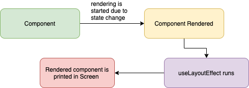
</p>

This runs synchronously immediately after React has performed all DOM mutations. This can be useful if you need to make DOM measurements (like getting the scroll position or other styles for an element) and then make DOM mutations or trigger a synchronous re-render by updating state.

As far as scheduling, this works the same way as `componentDidMount` and `componentDidUpdate`. Your code runs immediately after the DOM has been updated, but before the browser has had a chance to "paint" those changes (the user doesn\'t actually see the updates until after the browser has repainted).

**Example:**

```js
import { useRef, useLayoutEffect } from 'react'

/**
 * Demonstrates useLayoutEffect() to measure a DOM element\'s width
 * synchronously after the browser has performed layout, before paint.
 */
const App = () => {
  const boxRef = useRef<HTMLDivElement>(null)
  const labelRef = useRef<HTMLSpanElement>(null)

  useLayoutEffect(() => {
    const measure = () => {
      if (boxRef.current && labelRef.current) {
        const width = boxRef.current.getBoundingClientRect().width
        labelRef.current.textContent = `Box width: ${Math.round(width)}px`
      }
    }

    measure()
    window.addEventListener('resize', measure)
    return () => window.removeEventListener('resize', measure)
  }, [])

  return (
    <div>
      <div ref={boxRef} style={{ width: '50%', background: '#d1d5db', padding: '1rem' }}>
        Resize the window
      </div>
      <span ref={labelRef} />
    </div>
  )
}

export default App
```

**useLayoutEffect vs useEffect:**

* **useLayoutEffect**: If you need to mutate the DOM and/or do need to perform measurements
* **useEffect**: If you don\'t need to interact with the DOM at all or your DOM changes are unobservable (seriously, most of the time you should use this).

**5. useDebugValue():**

`useDebugValue()` can be used to display a label for custom hooks in React DevTools.

**Example:**

```js
function useFriendStatus(friendID) {
  const [isOnline, setIsOnline] = useState(null)

  // ...

  // Show a label in DevTools next to this Hook
  useDebugValue(isOnline ? 'Online' : 'Offline')

  return isOnline
}
```

**Note:**:

* useCallback = memoize function
* useMemo = memoize value
* useImperativeHandle = expose controlled ref API
* useLayoutEffect = run before paint for layout work
* useDebugValue = improve custom hook visibility in DevTools

<div align="right">
    <b><a href="#table-of-contents">↥ back to top</a></b>
</div>

## Q. What is the difference between useEffect() and useLayoutEffect() hooks?

The main difference between the useEffect() hook and the useLayoutEffect() hook is that the useEffect() hook serves **asynchronously**, whereas the useLayoutEffect() hook works **synchronously**.

After all DOM mutations have been completed by React, useLayoutEffect executes synchronously. If you need to measure the DOM (for example, to determine the scroll position or other styles for an element) and then modify the DOM or cause a synchronous re-render by changing the state, this can be helpful.

**1. useEffect():**

* Runs after the browser paints the updated screen.
* Does not block visual updates.
* Best for non-visual side effects: API calls, subscriptions, timers, logging, updating document title.

**2. useLayoutEffect():**

* Runs synchronously after DOM updates but before the browser paints.
* Blocks painting until it finishes.
* Best when you must read layout or make DOM measurements/mutations before user sees anything: measuring element size/position, preventing flicker in animations or tooltip positioning.

<div align="right">
    <b><a href="#table-of-contents">↥ back to top</a></b>
</div>

## Q. How to Memoize Components in React?

If your component renders the same result given the same props, you can wrap it in a call to `React.memo` for a performance boost in some cases by memoizing the result. This means that React will skip rendering the component, and reuse the last rendered result.

`React.memo` only checks for prop changes. If your function component wrapped in `React.memo` has a `useState`, `useReducer` or `useContext` Hook in its implementation, it will still rerender when state or context change.

**Example:** Let\'s take an example of search functionality. In the example below, the App component contains:

* Search input for the fruit name
* A button and a child component where the user search will be displayed
* A count of the number of times a user has clicked the button

```js
import { useState, useMemo } from 'react';

const fruits = ['apple', 'orange', 'banana'];

/**
 * App component that renders a searchable fruit list.
 * Uses `useMemo` to memoize the filtered results, recomputing
 * only when the search query changes.
 */
function App() {
  const [query, setQuery] = useState('');

  const filteredFruits = useMemo(
    () => fruits.filter((fruit) => fruit.includes(query.toLowerCase())),
    [query]
  );

  return (
    <div>
      <input
        type="text"
        placeholder="Search fruits..."
        value={query}
        onChange={(e) => setQuery(e.target.value)}
      />
      <ul>
        {filteredFruits.map((fruit) => (
          <li key={fruit}>{fruit}</li>
        ))}
      </ul>
    </div>
  );
}

export default App;
```

**&#9885; [Try this example on CodeSandbox](https://codesandbox.io/s/react-memo-yp7hb?file=/src/App.js)**

<div align="right">
    <b><a href="#table-of-contents">↥ back to top</a></b>
</div>

## Q. How to prevent unnecessary updates using React.memo()?

The **React.memo()** is a higher-order component that will memoize your component, very similar to **PureComponent**. It will shallowly compare current and new props of the component, and if nothing changes, React will skip the rendering of that component.

**Key rules to prevent unnecessary updates:**

* Wrap child component with React.memo.
* Pass stable props.
* Use useCallback for function props.
* Avoid creating new objects/arrays inline in JSX on every render.
* Use stable keys for list items.

**Example:**

```js
// Memo.js
const Text = (props) => {
  console.log(`Text Component`);
  return <div>Text Component re-render: {props.count} times </div>;
};

const MemoText = React.memo(
  (props) => {
    console.log(`MemoText Component`);
    return <div>MemoText Component re-render: {props.count} times </div>;
  },
  (preprops, nextprops) => true
);

```

```js
// App.js
const App = () => {
  console.log(`App Component`);
  const [count, setCount] = useState(0);
  return (
    <>
      <h2>This is function component re-render: {count} times </h2>
      <Text count={count} />
      <MemoText count={count} />
      <br />
      <button
        onClick={() => {
          setCount(count + 1);
        }}
      >
        CLICK ME
      </button>
    </>
  );
};
```

**&#9885; [Try this example on CodeSandbox](https://codesandbox.io/s/reactmomo-v85l8?file=/src/index.js:187-196)**

<div align="right">
    <b><a href="#table-of-contents">↥ back to top</a></b>
</div>

## # 12. REACT CONTEXT

<br/>

## Q. What is Context API in React?

The React Context API allows you to share data across the component tree without manually passing props at every level (avoiding "prop drilling").

<p align="center">
  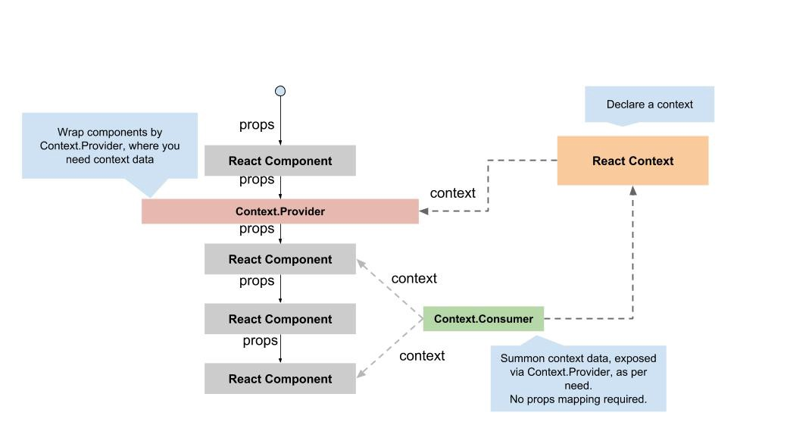
</p>

**Core Concepts:**

* **React.createContext():**	Creates a context object
* **`<Context.Provider>`:**	Wraps components and supplies the value
* **useContext():**	Consumes the context value in any descendant

**Common Use Cases:**

* **Theming:** Switching between Light and Dark modes.
* **User Authentication:** Sharing the current logged-in user\'s info and login status.
* **Localization:** Managing language preferences (e.g., English vs. Spanish).
* **Routing:** Many libraries like React Router use Context internally to track the current URL

**Example:**

```js
/**
 * Counter Component
 */
const { useState, useContext } = React;

const CountContext = React.createContext();

function Counter() {
  const { count, increase, decrease } = useContext(CountContext);
  return (
    <h2>
      <button onClick={decrease}>Decrement</button>
      <span className="count">{count}</span>
      <button onClick={increase}>Increment</button>
    </h2>
  );
}
```

```js
/**
 * App Component
 */
function App() {
  const [count, setCount] = useState(0);

  const increase = () => {
    setCount(count + 1);
  };
  const decrease = () => {
    setCount(count - 1);
  };

  return (
    <div>
      <CountContext.Provider value={{ count, increase, decrease }}>
        <Counter />
      </CountContext.Provider>
    </div>
  );
}
```

**&#9885; [Try this example on CodeSandbox](https://codesandbox.io/s/react-context-api-v8syu?file=/src/index.js)**

<div align="right">
    <b><a href="#table-of-contents">↥ back to top</a></b>
</div>

## Q. How do you solve performance corner cases while using context?

Performance issues in the React Context API typically stem from **unnecessary re-renders** — when the context value changes, every component that consumes that context (via useContext) will re-render, even if it only uses a piece of the data that didn\'t change.

Here are the primary ways to solve these performance corner cases:

**1. Split Your Contexts**

The most effective way to prevent unnecessary renders is to break a large, multi-purpose context into several smaller, highly specific ones. 

* **By Domain:** Create separate contexts for different parts of your app (e.g., UserContext, ThemeContext, CartContext).
* **By Update Frequency:** Keep static or rarely-changing data (like a user\'s name) in a different context than high-frequency data (like a timer or scroll position). 

**2. Separate State and Dispatch**

If you are using a useReducer or useState pattern, components that only need the "setter" (dispatch) function should not re-render when the "getter" (state) changes. 

* **The Pattern:** Provide the state in one context and the dispatch function in another.
* **Benefit:** Buttons or controls that only trigger actions will never re-render just because the state they modify was updated. 

**3. Stabilize the Context Value**

If you pass an object literal directly into the value prop (e.g., `value={{ user, theme }}`), React sees a "new" object on every render of the provider, triggering all consumers to update. 

* **Use useMemo:** Wrap your value in the useMemo hook to ensure the object reference only changes when the actual dependencies change.
* **Use useCallback:** If you are passing functions, wrap them in useCallback to maintain a stable reference. 

**4. Optimize with Component Composition**

You can "short-circuit" re-renders by moving the context consumption as far down the tree as possible. 

* **Pass as Children:** Wrap the provider around a component that takes children. Since children is just a prop that hasn\'t changed, React will skip re-rendering the intermediate tree.
* **Use React.memo:** Wrap consumer components in `React.memo` so they only re-render if their own props or the context they subscribe to actually changes. 

**5. Advanced: Selectors and External Stores**

For massive applications where these methods aren\'t enough, consider these "pro" alternatives:

* **Context Selectors:** Use libraries like use-context-selector to subscribe only to specific "slices" of a context value.
* **External State Management:** If you have high-frequency updates (like mouse movements), React Context may not be the right tool. Libraries like Zustand or Jotai are specifically optimized to avoid the wholesale re-rendering issues of Context. 

**Example**:

```js
/**
 * Counter Component
 *
 * Consumes CountContext to display the current count value
 * and provides Increment/Decrement buttons to update it.
 */
import { createContext, useContext } from 'react';

interface CountContextType {
  count: number;
  increase: () => void;
  decrease: () => void;
}

export const CountContext = createContext<CountContextType | undefined>(undefined);

function Counter() {
  const { count, increase, decrease } = useContext(CountContext) as CountContextType;
  return (
    <h2>
      <button onClick={decrease}>Decrement</button>
      <span className="count"> {count} </span>
      <button onClick={increase}>Increment</button>
    </h2>
  );
}

export default Counter;
```

```js
/**
 * App Component
 *
 * Root page component that manages the counter state and provides
 * it via CountContext to the Counter child component.
 * Uses useCallback to stabilize handlers and useMemo to avoid
 * unnecessary context re-renders.
 */
import { useState, useMemo, useCallback } from 'react';
import Counter, { CountContext } from './child';

function App() {
  const [count, setCount] = useState(0);

  const increase = useCallback(() => setCount(prev => prev + 1), []);
  const decrease = useCallback(() => setCount(prev => prev - 1), []);

  const contextValue = useMemo(() => ({ count, increase, decrease }), [count, increase, decrease]);

  return (
    <div>
      <CountContext.Provider value={contextValue}>
        <Counter />
      </CountContext.Provider>
    </div>
  );
}

export default App;
```

<div align="right">
    <b><a href="#table-of-contents">↥ back to top</a></b>
</div>

## Q. What is the purpose of default value in context?

The **defaultValue** argument is **only** used when a component does not have a matching Provider above it in the tree. This can be helpful for testing components in isolation without wrapping them. Passing **undefined** as a Provider value does not cause consuming components to use **defaultValue**.

**Purpose:**

* It provides a fallback so consumers do not crash when no Provider is present.
* It makes components easier to test in isolation.
* It documents the expected shape/type of the context value.

**Example:**

```js
/**
 * Default value in Context API
 */
import { createContext, useContext } from "react";

const Context = createContext("Default Value");

/**
 * Child1 Component
 */
function Child1() {
  const context = useContext(Context);
  return <h2>Child1: {context}</h2>;
}

/**
 * Child2 Component
 */
function Child2() {
  const context = useContext(Context);
  return <h2>Child2: {context}</h2>;
}

/**
 * App Component
 */
export default function App() {
  return (
    <>
      <Context.Provider value={"Initial Value"}>
        <Child1 /> {/* Child inside Provider will get "Initial Value" */}
      </Context.Provider>
      <Child2 /> {/* Child outside Provider will get "Default Value" */}
    </>
  );
}
```

**&#9885; [Try this example on CodeSandbox](https://codesandbox.io/s/react-default-value-in-context-1vh1c)**

<div align="right">
    <b><a href="#table-of-contents">↥ back to top</a></b>
</div>

## Q. How to use contextType react?

The **ContextType** property on a **class component** can be assigned a Context object created by `React.createContext()` method. This property lets you consume the nearest current value of the context using `this.context`. We can access `this.context` in any lifecycle method including the render functions.

**Key Concept:**

* Create a context with `React.createContext(defaultValue)`.
* Wrap part of the tree with Provider and pass value.
* In a class component, assign static `contextType = MyContext`.
* Access context anywhere in the class with `this.context` (render and lifecycle methods).

**Example:**

```js
/**
 * ContextType Example
 *
 * Demonstrates class-based context consumption using static contextType.
 * ThemeContext provides a "dark" theme value to the Header component,
 * which reads it via this.context.
 */
import React from "react";

const ThemeContext = React.createContext("light");

class Header extends React.Component {
  static readonly contextType = ThemeContext;

  componentDidMount() {
    console.log("Current theme:", this.context);
  }

  render() {
    const theme = this.context as string;
    return <h1>Theme: {theme}</h1>;
  }
}

export default function App() {
  return (
    <ThemeContext.Provider value="dark">
      <Header />
    </ThemeContext.Provider>
  );
}
```

**&#9885; [Try this example on CodeSandbox](https://codesandbox.io/s/react-contexttype-q4l4pg?file=/src/index.js)**

<div align="right">
    <b><a href="#table-of-contents">↥ back to top</a></b>
</div>

## Q. How to update React Context from inside a child component?

The Context API allows data storage and makes it accessible to any child component who want to use it. This is valid whatever level of component graph the children is in.

**Example:**

```js
/**
 * React Context API
 */
import { useState, useContext, createContext, useMemo, useCallback } from "react";

interface MyContextType {
  count: number;
  increment: () => void;
}

const MyContext = createContext<MyContextType | undefined>(undefined);

/**
 * Child Component
 */
const ChildComponent = () => {
  const { count, increment } = useContext(MyContext) as MyContextType;

  return (
    <div>
      <p>Count: {count}</p>
      <button onClick={increment}>Increment</button>
    </div>
  );
};

/**
 * App Component
 * 
 * Root component that manages count state and provides it via MyContext.
 * Uses useMemo to memoize the context value and useCallback to stabilize
 * the increment handler, preventing unnecessary re-renders in consumers.
 */
export default function App() {
  const [count, setCount] = useState(0);
  
  const increment = useCallback(() => {
    setCount(prev => prev + 1);
  }, []);

  const contextValue = useMemo(() => ({ count, increment }), [count, increment]);

  return (
    <MyContext.Provider value={contextValue}>
        <ChildComponent />
    </MyContext.Provider>
  );
}
```

Here, the state is managed in the parent component alongside an updater function that modifies it. Both the state value and the updater function are passed as the context value via the Provider. Any child component can then consume this context, call the updater function, and trigger a state change in the parent — effectively updating the shared context.

**&#9885; [Try this example on CodeSandbox](https://codesandbox.io/s/react-context-api-kdd2v0?file=/src/App.js)**

<div align="right">
    <b><a href="#table-of-contents">↥ back to top</a></b>
</div>

## Q. What is prop drilling and how can you avoid it?

**Prop drilling** is when data is passed through multiple intermediate component layers via props just to reach a deeply nested child that needs it — even though the components in between don\'t use that data themselves.

**Why it\'s a problem:**

* **Maintenance:** Changing the data structure requires updating every component in the chain.
* **Complexity:** It makes components harder to reuse because they are tightly coupled to the props they pass down.
* **Readability:** It becomes difficult to track where data is coming from in large trees.

**Using Context API:**  

The Context API solves some of these prop drilling problems. It let pass data to all of the components in the tree without writing them manually in each of them. Shared data can be anything: state, functions, objects, we name it, and it is accessible to all nested levels that are in the scope of the context.

**Example:**

```js
/**
 * React Context API
 * 
 * Demonstrates sharing a value across the component tree without prop drilling.
 * NumberContext provides a numeric value to all descendant consumers.
 */
import { useContext, createContext } from "react";

// It returns an object with 2 values:
// { Provider, Consumer }
const NumberContext = createContext<number>(0);
const CONTEXT_VALUE = 100;

function Display() {
  const value = useContext(NumberContext);
  return <h3>Context Value: {value}</h3>;
}

/**
 * App Component
 * 
 * Wraps the component tree with NumberContext.Provider,
 * making CONTEXT_VALUE available to all children via useContext.
 */
export default function App() {
  return (
    <NumberContext.Provider value={CONTEXT_VALUE}>
        <Display />
    </NumberContext.Provider>
  );
}
```

**&#9885; [Try this example on CodeSandbox](https://codesandbox.io/s/react-prop-drilling-knowbp?file=/src/App.js)**

<div align="right">
    <b><a href="#table-of-contents">↥ back to top</a></b>
</div>

## # 13. REACT ROUTER

<br/>

## Q. What is React Router?

React router enables the navigation among views of various components in a React Application, allows changing the browser URL, and keeps the UI in sync with the URL. It has a simple API with powerful features like lazy loading, dynamic route matching, and location transition handling.

**Core components (v7):**

* **BrowserRouter:**	Parent wrapper; uses HTML5 History API to sync UI with URL
* **Routes:**	Container for all Route definitions; matches the best route
* **Route:**	Maps a URL path to a component
* **Link / NavLink:**	Declarative navigation; NavLink adds active styling


**Example:**

```js
/**
 * React Router v7
 */
import { BrowserRouter, Route, Routes, NavLink } from "react-router-dom";

/**
 * Home Component
 */
const Home = () => {
  return <h1>Home Page</h1>;
};

/**
 * Contacts Component
 */
const Contacts = () => {
  return <h1>Contact Page</h1>;
};

/**
 * App Component
 */
export default function App() {
  return (
    <div className="App">
      <BrowserRouter>
        <div className="navbar">
          <NavLink to={"/"}>Home</NavLink>
          <NavLink to={"/contact"}>Contact Us</NavLink>
        </div>
        <Routes>
          <Route path="/" element={<Home />} />
          <Route path="/contact" element={<Contacts />} />
        </Routes>
      </BrowserRouter>
    </div>
  );
}
```

**&#9885; [Try this example on CodeSandbox](https://codesandbox.io/s/react-router-v6-xuycsq?file=/src/App.js)**

<div align="right">
    <b><a href="#table-of-contents">↥ back to top</a></b>
</div>

## Q. What are the components of react router?

The main components of React router are

**1. BrowserRouter**:

BrowserRouter is a router implementation that uses the HTML5 history API (`pushState`, `replaceState` and `popstate` event) to keep your UI in sync with the URL. It is the parent component that is used to store all of the other components.

**2. Routes**:

It\'s a new component introduced in the v6 and a upgrade of the component. The main advantages of Routes over Switch that routes are chosen based on the best match instead of being traversed in order.

**3. Route**:

Route is the conditionally shown component that renders some UI when its path matches the current URL.

**4. Link**:

Link component is used to create links to different routes and implement navigation around the application. It works like HTML anchor tag.

**5. NavLink:**

Adds active styling to the link when its route matches the current URL

**6. Outlet:**

A critical component for nested routing. It acts as a placeholder within a parent route\'s component, indicating where child route elements should be rendered.

<div align="right">
    <b><a href="#table-of-contents">↥ back to top</a></b>
</div>

## Q. What is the difference between NavLink and Link?

The `<Link>` component is used to navigate the different routes on the site. But `<NavLink>` is used to add the style attributes to the active routes.

**Link:**

Renders an anchor tag that navigates without a full page reload. No awareness of whether the route is currently active.

```js
<Link to="/">Home</Link>
```

**NavLink:**

Same as `Link`, but automatically applies an `active` CSS class (or custom class) when the `to` path matches the current URL.

```js
<NavLink to="/" activeClassName="active">Home</NavLink>
```

**Example:**

index.css

```css
.active {
  color: blue;
}
```

Routes.js

```js
import { BrowserRouter as Router, Routes, Route, NavLink } from 'react-router-dom'
import './index.css'
import App from './App'
import Users from './users'
import Contact from './contact'
import Notfound from './notfound'

const nav = ({ isActive }) => isActive ? 'active' : undefined

const AppRoutes = () => (
  <Router>
    <div>
      <ul>
        <li><NavLink className={nav} to="/">Home</NavLink></li>
        <li><NavLink className={nav} to="/users">Users</NavLink></li>
        <li><NavLink className={nav} to="/contact">Contact</NavLink></li>
      </ul>
      <hr />
      <Routes>
        <Route path="/" element={<App />} />
        <Route path="/users" element={<Users />} />
        <Route path="/contact" element={<Contact />} />
        <Route path="*" element={<Notfound />} />
      </Routes>
    </div>
  </Router>
)

export default AppRoutes;
```

**Note:**

*In React Router v7, `NavLink` uses a function for `className` instead of `activeClassName`.*

<div align="right">
    <b><a href="#table-of-contents">↥ back to top</a></b>
</div>

## Q. How React Router is different from history library?

React Router is a high-level, React-specific routing library built **on top of** the low-level `history` library. While the `history` library handles raw browser history manipulation, React Router adds declarative routing, component rendering, and React hooks on top of it.

**Key Differences:**

| Feature | `history` library | React Router v7 |
|---|---|---|
| Level | Low-level | High-level |
| React awareness | None | React-specific |
| Navigation | `history.push('/path')` | `useNavigate()` hook |
| Location access | `history.location` | `useLocation()` hook |
| URL params | Manual | `useParams()` hook |
| UI sync | Manual | Automatic |

React Router v7 **internalizes** the `history` dependency — you no longer install or interact with it directly. All navigation is handled through hooks.

```js
// <BrowserRouter> — clean URLs using HTML5 History API
http://example.com/about

// <HashRouter> — hash-based URLs for static hosting / legacy browsers
http://example.com/#/about
```

The `<BrowserRouter>` is preferred for modern apps as it uses the HTML5 History API. Use `<HashRouter>` only when you cannot configure the server to handle all routes (e.g., static file hosting).

**Example (React Router v7):**

```js
// src/index.js
import { createRoot } from "react-dom/client";
import { BrowserRouter } from "react-router-dom";
import App from "./App";

createRoot(document.getElementById("root")).render(
  <BrowserRouter>
    <App />
  </BrowserRouter>
);
```

**Navigating programmatically in v7:**

```js
import { useNavigate, useLocation } from "react-router-dom";

function MyComponent() {
  const navigate = useNavigate();   // replaces history.push / history.replace
  const location = useLocation();   // replaces history.location

  return (
    <button onClick={() => navigate("/home")}>Go Home</button>
  );
}
```

In React Router v7, `history.goBack()` and `history.goForward()` are replaced by `navigate(-1)` and `navigate(1)` respectively.

<div align="right">
    <b><a href="#table-of-contents">↥ back to top</a></b>
</div>

## Q. How to use useNavigate() in React Router v7?

The **useNavigate()** hook is introduced in React Router v7 to replace the `useHistory()` hook. In the earlier version, the `useHistory()` hook accesses the React Router history object and navigates to the other routers using the `push()` or `replace()` methods.

The `useNavigate()` hook returns a function that lets you navigate programmatically, for example after a form is submitted. If using `replace: true`, the navigation will replace the current entry in the history stack instead of adding a new one.

**Example:**

```js
/**
 * useNavigate()
 */
import { useNavigate } from "react-router-dom";

function Home() {
  const navigate = useNavigate();

  return (
    <button onClick={() => navigate("/profile")}>
      Go to Profile
    </button>
  );
}
```

**&#9885; [Try this example on CodeSandbox](https://codesandbox.io/s/cool-paper-vxgn15?file=/src/App.js)**

<div align="right">
    <b><a href="#table-of-contents">↥ back to top</a></b>
</div>

## Q. How to get parameter value from query string in React?

**1. useSearchParams:**

The **useSearchParams** hook is a feature provided by libraries such as React Router and Next.js that allows React components to read and update the query string parameters (the portion of the URL after the `?` symbol). 

This hook is essential for managing URL-based state, which keeps the application\'s state persistent when the page is reloaded or the link is shared

**Usage:**

* `searchParams.get("key"):` Get a single value, returns null if missing
* `searchParams.getAll("key"):`	Get all values for a key (multi-value params)
* `searchParams.has("key"):` Check if param exists
* `setSearchParams({ key: val }):` Update the query string (triggers re-render)

**Example:**

```js
// http://localhost:3000/search?q=react

import { useSearchParams } from "react-router-dom";

function SearchPage() {
  const [searchParams] = useSearchParams();
  
  // Get a specific parameter by its key
  const query = searchParams.get("q"); // URL: /search?q=react

  return <div>Search results for: {query}</div>;
}
```

**2. useParams:**

**useParams** is a React Router hook used to extract dynamic parameters from the current URL path. These parameters are defined in your route configuration using a colon (`:`) followed by a variable name.

**Example:**

```js
// http://localhost:3000/:userId

import { useParams } from "react-router-dom";

function Profile() {
  // Extract userId from the URL path
  const { userId } = useParams();

  return <h1>Viewing profile for user: {userId}</h1>;
}
```

**&#9885; [Try this example on CodeSandbox](https://codesandbox.io/s/react-query-parameters-yqx7e?file=/src/ParamsExample.js)**

<div align="right">
    <b><a href="#table-of-contents">↥ back to top</a></b>
</div>

## Q. How to access history object in React Router v7?

The **useNavigate()** hook has been added to React Router v7 to replace the `useHistory()` hook.

**Difference:**

|v5 (useHistory)	        |v7 (useNavigate)     |
|-------------------------|---------------------|
|`history.push('/path')`    |	`navigate('/path')`   |
|`history.replace('/path')` |	`navigate('/path', { replace: true })`|
|`history.goBack()`	        | `navigate(-1)`         |
|`history.goForward()`      |	`navigate(1)`         |

**Example:**

```js
/**
 * React Router
 */
import { BrowserRouter, Routes, NavLink, Route, useParams, useNavigate } from "react-router-dom";

export default function App() {
  return (
    <BrowserRouter>
      <div>
        <ul>
          <li><NavLink to="/">Home</NavLink></li>
          <li><NavLink to="/user/Bhavya/bhavyasingh@email.com">User Profile</NavLink></li>
        </ul>
        <Routes>
          <Route path="/user/:name/:email" element={<User />} />
          <Route path="/" element={<Home />} />
        </Routes>
        <HomeButton />
      </div>
    </BrowserRouter>
  );
}

function Home() {
  return <h2>Welcome Home</h2>;
}

function User() {
  let { name, email } = useParams();
  return (
    <h2>Name: {name} <br /> Email: {email}</h2>
  );
}

function HomeButton() {
  const navigate = useNavigate();

  function handleClick() {
    navigate("/");
  }

  return (
    <>
      <button type="button" onClick={handleClick}>Go Home</button>
    </>
  );
}
```

**&#9885; [Try this example on CodeSandbox](https://codesandbox.io/s/react-usenavigate-j5fkzn?file=/src/App.js)**

<div align="right">
    <b><a href="#table-of-contents">↥ back to top</a></b>
</div>

## Q. How to perform automatic redirect in React.js?

In contrast to the Navigate component and its declarative redirect, we can perform a programmatic redirect by using React Router\'s **useNavigate()** Hook:

**Example:** Using `<Navigate>` component (declarative)

```js
/**
 * Automatic Redirect in React Router v7
 */
import {
  BrowserRouter,
  Routes,
  Route,
  Navigate,
  NavLink,
} from "react-router-dom";

// --- Approach 1: <Navigate> component (declarative) ------------------------------

function AppWithNavigate() {
  return (
    <BrowserRouter>
      <nav style={{ display: "flex", gap: "1em" }}>
        <NavLink to="/home">Home</NavLink>
        <NavLink to="/about">About</NavLink>
        <NavLink to="/help">Help</NavLink>
      </nav>
      <Routes>
        {/* Visiting "/" automatically redirects to "/home" */}
        <Route index element={<Navigate replace to="/home" />} />
        <Route path="home" element={<h1>Home Page</h1>} />
        <Route path="about" element={<h1>About Page</h1>} />
        <Route path="help" element={<h1>Help Page</h1>} />
      </Routes>
    </BrowserRouter>
  );
}
export default AppWithNavigate;
```

**Example:** Using `redirect()` in a loader (v7 data router)

```js
// --- Approach 2: redirect() in a loader (v7 data router) ---------------------

import { createBrowserRouter, RouterProvider, redirect } from "react-router-dom";

const router = createBrowserRouter([
  {
    path: "/",
    // loader runs before rendering; returning redirect() sends the user elsewhere
    loader: () => redirect("/home"),
  },
  {
    path: "/home",
    element: <h1>Home Page</h1>,
  },
  {
    path: "/about",
    element: <h1>About Page</h1>,
  },
]);

function AppWithLoaderRedirect() {
  return <RouterProvider router={router} />;
}
export default AppWithLoaderRedirect;
```

**Note**: 

*To keep the history clean, you should set `replace` prop. This will avoid extra redirects after the user click back.*

**&#9885; [Try this example on CodeSandbox](https://codesandbox.io/s/react-automatic-redirect-odw0yn?file=/src/App.js)**

<div align="right">
    <b><a href="#table-of-contents">↥ back to top</a></b>
</div>

## Q. How to pass additional data while redirecting to a route in React?

**Using Link:**

**Example:**

```js
/**
 * Pass additional data while redirecting
 */
import { BrowserRouter, Link, Route, Routes, useLocation } from "react-router-dom";

/**
 * View User Component
 */
function ViewUser() {
  const location = useLocation();
  return (
    <>
      <h2>User Details</h2>
      <div>Name:{location.state.name}</div>
      <div>Email:{location.state.email}</div>
    </>
  );
}

/**
 * User Component
 */
function User() {
  return (
    <div>
      <h2>Pass additional data while redirecting</h2>
      <Link
        to="/view-user"
        state={{
          name: "Kalini Khalsa",
          email: "kalini.khalsa@email.com"
        }}
      >
        <button>View User</button>
      </Link>
    </div>
  );
}

/**
 * App Component
 */
export default function App() {
  return (
    <BrowserRouter>
      <Routes>
        <Route exact path="/" element={<User />} />
        <Route exact path="/user" element={<User />} />
        <Route exact path="/view-user" element={<ViewUser />} />
      </Routes>
    </BrowserRouter>
  );
}
```

**&#9885; [Try this example on CodeSandbox](https://codesandbox.io/s/react-pass-data-using-router-br5kdb?file=/src/App.js)**

<div align="right">
    <b><a href="#table-of-contents">↥ back to top</a></b>
</div>

## Q. How to pass props in React router v7?

React Router uses a declarative, component-based approach to routing. `Route` allows you to map URL paths to different React components.

**Example:**

```js
/**
 * pass props directly via the element prop
 */
import { BrowserRouter, Routes, Route, NavLink } from "react-router-dom";

export function Greeting(props) {
  const { text } = props;
  return (
    <>
      <h2>Greetings Page</h2>
      <p>{text}</p>
    </>
  );
}

const RouterExample = () => <h2>Home Page</h2>;

const App = () => (
  <BrowserRouter>
    <ul>
      <li><NavLink to="/">Home</NavLink></li>
      <li><NavLink to="/greeting/pradeep">Greeting</NavLink></li>
    </ul>
    <hr />
    <Routes>
      <Route exact path="/" element={<RouterExample />} />
      <Route path="/greeting/:name" element={<Greeting text="Hello World" />} />
    </Routes>
  </BrowserRouter>
);

export default App;
```

**&#9885; [Try this example on CodeSandbox](https://codesandbox.io/s/react-pass-props-in-router-g9zjg4?file=/src/App.js)**

<div align="right">
    <b><a href="#table-of-contents">↥ back to top</a></b>
</div>

## Q. How to get query parameters in react routing?

**1. `useParams()` — for dynamic path segments**

Used when the parameter is part of the URL path, defined with `:` in the route.

**2. `useSearchParams()` — for query string parameters**

Used when the parameter is in the query string (after `?`).

**Example:**

```js
/**
 * useParams()
 */
import { BrowserRouter, Route, Routes, Link, useParams } from "react-router-dom";

export default function App() {
  return (
    <BrowserRouter>
      <div>
        <ul>
          <li><Link to="/home">Home</Link></li>
          <li><Link to="/contact-us">Contact Us</Link></li>
          <li><Link to="/help">Help</Link></li>
        </ul>
        <Routes>
          <Route path="/:id" element={<Child />} />
        </Routes>
      </div>
    </BrowserRouter>
  );
}

function Child() {
  // `useParams` hook used here to access parameters
  let { id } = useParams();

  return <h2>Parameter: {id}</h2>;
}
```

**&#9885; [Try this example on CodeSandbox](https://codesandbox.io/s/react-get-query-parameters-ngsm3l?file=/src/App.js)**

<div align="right">
    <b><a href="#table-of-contents">↥ back to top</a></b>
</div>

## Q. What is the difference between HashRouter and BrowserRouter in React?

**1. BrowserRouter:**

* The widely popular router and a router for modern browsers which user HTML5 pushState API. (i.e. `pushState`, `replaceState` and `popState` API).
* It routes as normal URL in browser, you can\'t differentiate whether it is server rendered page or client rendered page through the URL.
* It assumes, your server handles all the request URL (eg., `/`, `/about`) and points to root `index.html`. From there, BrowserRouter take care of routing the relevant page.
* It accepts `forceRefresh` props to support legacy browsers which doesn\'t support HTML5 pushState API

**Syntax:**

```js
/**
 * https://example.com/home
 * https://example.com/about
 */
<BrowserRouter
  basename={optionalString}
  forceRefresh={optionalBool}
  getUserConfirmation={optionalFunc}
  keyLength={optionalNumber}
>
  <App />
</BrowserRouter>
```

**Example:**

```js
/**
 * BrowserRouter()
 */
import { Link, BrowserRouter, Routes, Route } from "react-router-dom";

const HomePage = () => {
  return <h2>Home Page</h2>;
};

const AboutPage = () => {
  return <h2>About Page</h2>;
};

export default function App() {
  return (
    <section className="App">
      <BrowserRouter>
        <ul>
          <li><Link to="/home">Home</Link></li>
          <li><Link to="/about">About</Link></li>
        </ul>
        <Routes>
          <Route exact path="/home" element={<HomePage />} />
          <Route exact path="/about" element={<AboutPage />} />
        </Routes>
      </BrowserRouter>
    </section>
  );
}
```

**&#9885; [Try this example on CodeSandbox](https://codesandbox.io/s/react-browserrouter-53zjvx?file=/src/App.js)**

**2. HashRouter:**

* A router which uses client side hash routing.
* Whenever, there is a new route get rendered, it updated the browser URL with hash routes. (eg., `/#/about`)
* Hash portion of the URL won\'t be handled by server, server will always send the `index.html` for every request and ignore hash value. Hash value will be handled by react router.
* It is used to support legacy browsers which usually doesn\'t support HTML `pushState` API

**Syntax:**

```js
/**
 * https://example.com/#/home
 * https://example.com/#/about
 */
<HashRouter
  basename={optionalString}
  getUserConfirmation={optionalFunc}
  hashType={optionalString}
>
  <App />
</HashRouter>
```

**Example:**

```js
/**
 * HashRouter()
 */
import { Link, HashRouter, Routes, Route } from "react-router-dom";

const HomePage = () => {
  return <h2>Home Page</h2>;
};

const AboutPage = () => {
  return <h2>About Page</h2>;
};

export default function App() {
  return (
    <section className="App">
      <HashRouter>
        <ul>
          <li><Link to="/home">Home</Link></li>
          <li><Link to="/about">About</Link></li>
        </ul>
        <Routes>
          <Route exact path="/home" element={<HomePage />} />
          <Route exact path="/about" element={<AboutPage />} />
        </Routes>
      </HashRouter>
    </section>
  );
}
```

**&#9885; [Try this example on CodeSandbox](https://codesandbox.io/s/react-hashrouter-pcn4dj?file=/src/App.js)**

<div align="right">
    <b><a href="#table-of-contents">↥ back to top</a></b>
</div>

## Q. What is route based code splitting?

Route based code splitting is essential during the page transitions on the web, which takes some amount of time to load. Here is an example of how to setup route-based code splitting into the app using React Router with `React.lazy`.

**Key Benefits**

* **Faster Initial Load:** By shrinking the initial JavaScript payload, the time to first render is significantly reduced.
* **Reduced Bandwidth:** Users only download the code for the parts of the site they actually visit.
* **Better Caching:** When you update one page, only the chunk for that specific route needs to be re-downloaded by returning users, while others remain cached.
* **Improved Interactivity:** Smaller bundles are parsed and executed faster by the browser, leading to a better Interaction to Next Paint (INP)

**Example:**

```js
/**
 * Lazy Loading
 */
import React, { Suspense, lazy } from "react";
import { BrowserRouter, Routes, Route } from "react-router-dom";

const Home = lazy(() => import("./Home"));
const About = lazy(() => import("./About"));

export default function App() {
  return (
    <BrowserRouter>
      <Suspense fallback={<div>Loading...</div>}>
        <Routes>
          <Route exact path="/" element={<Home />} />
          <Route path="/about" element={<About />} />
        </Routes>
      </Suspense>
    </BrowserRouter>
  );
}
```

**&#9885; [Try this example on CodeSandbox](https://codesandbox.io/s/react-route-based-code-splitting-s2uq6n?file=/src/App.js)**

<div align="right">
    <b><a href="#table-of-contents">↥ back to top</a></b>
</div>

## Q. What is lazy function in React?

`React.lazy()` makes it easy to create components that are loaded using dynamic `import()` but are rendered like regular components. This will automatically cause the bundle containing the component to be loaded when the component is rendered.

`React.lazy()` takes a function as its argument that must return a promise by calling `import()` to load the component. The returned Promise resolves to a module with a default export containing the React component.

**Example:**

```js
import React, { lazy } from 'react'

const MyComponent = React.lazy(() => import('./MyComponent'))

const App = () => {
  <div>
    <MyComponent />
  </div>
}
```

<div align="right">
    <b><a href="#table-of-contents">↥ back to top</a></b>
</div>

## Q. What is code-splitting?

Code-Splitting is a feature supported by bundlers like **Webpack**, **Rollup** and **Browserify** ( via factor-bundle ) which can create multiple bundles that can be dynamically loaded at runtime.

Code splitting uses `React.lazy` and `Suspense` library, which helps to load a dependency lazily and only load it when needed by the user. The code splitting improves:

* The performance of the app
* The impact on memory
* The downloaded Kilobytes (or Megabytes) size

**React.lazy and Suspense:**

The `React.lazy` function allows us to render a dynamic import as a regular component. The `suspense` component is responsible for handling the output when the lazy component is fetched and rendered.

**Example:**

```js
import React, { Suspense } from 'react';

const UsersComponent = React.lazy(() => import('./UsersComponent'));

function MyComponent() {
  return (
    <div>
      <Suspense fallback={<div>Loading...</div>}>
        <UsersComponent />
      </Suspense>
    </div>
  );
}
```

<div align="right">
    <b><a href="#table-of-contents">↥ back to top</a></b>
</div>

## Q. What is dynamic import in react?

`React.lazy()` wraps a dynamic `import()` call. The import returns a Promise that resolves to a module with a default export of a React component. The lazy component must be rendered inside `<Suspense>` to show a fallback while loading.

**Example:**

```js
import React, { Suspense } from 'react';

const UsersComponent = React.lazy(() => import('./UsersComponent'));

function MyComponent() {
  return (
    <div>
      <Suspense fallback={<div>Loading...</div>}>
        <UsersComponent />
      </Suspense>
    </div>
  );
}
```

<div align="right">
    <b><a href="#table-of-contents">↥ back to top</a></b>
</div>

## Q. What are loadable components?

If you want to do code-splitting in a server rendered app, it is recommend to use Loadable Components because `React.lazy` and `Suspense` is not available for server-side rendering (SSR). Loadable lets you render a dynamic import as a regular component.

**Installation:**

```js
npm install @loadable/component
```

**Key Features**

* **Automatic Chunk Naming:** It generates meaningful names for your code chunks automatically, which is helpful for debugging.
* **Error Handling:** It works seamlessly with React Error Boundaries to handle network failures or loading errors gracefully.
* **Developer Experience:** The API is designed to be simple, allowing you to wrap an import in a `loadable()` function and use it like a regular component.

**Example:**

```js
import React from 'react'
import { BrowserRouter as Router, Route, Switch } from 'react-router-dom'
import loadable from '@loadable/component'

// 1. Define your loadable components
// The fallback prop shows a UI while the component is downloading
const Home = loadable(() => import('./routes/Home'), {
  fallback: <div>Loading Home...</div>,
})

const Dashboard = loadable(() => import('./routes/Dashboard'), {
  fallback: <div>Loading Dashboard...</div>,
})

const App = () => (
  <Router>
    <Switch>
      <Route exact path="/" component={Home} />
      <Route path="/dashboard" component={Dashboard} />
    </Switch>
  </Router>
)

export default App
```

<div align="right">
    <b><a href="#table-of-contents">↥ back to top</a></b>
</div>

## # 14. REACT ERROR BOUNDARIES

<br/>

## Q. What are error boundaries in React?

Error boundaries are React components that catch JavaScript errors anywhere in their child component tree, log those errors, and display a fallback UI instead of the component tree that crashed. Error boundaries catch errors during rendering, in lifecycle methods, and in constructors of the whole tree below them.

**Key methods:**

* `static getDerivedStateFromError()`	Update state to render fallback UI
* `componentDidCatch()`	Log error info to a reporting service
* `render()`	Render children or fallback UI

**Syntax:**

```js
<ErrorBoundary>
   <User/>
</ErrorBoundary>
```

**Example:**

```js
/**
 * ErrorBoundary Component
 *
 * Note: Error boundaries only catch errors during rendering, in lifecycle
 * methods, and in constructors of the whole tree below them. They do NOT
 * catch errors inside event handlers.
 */
import React from "react";

class ErrorBoundary extends React.Component<
  { children: React.ReactNode },
  { hasError: boolean }
> {
  constructor(props: { children: React.ReactNode }) {
    super(props);
    this.state = { hasError: false };
  }

  // Updates state so the next render shows the fallback UI
  static getDerivedStateFromError() {
    return { hasError: true };
  }

  // Used for logging error information
  componentDidCatch(error: Error, errorInfo: React.ErrorInfo) {
    console.error(error, errorInfo);
  }

  render() {
    if (this.state.hasError) {
      return <h1>Something went wrong.</h1>;
    }

    return this.props.children;
  }
}

function MyComponent() {
  return <p>Hello from MyComponent</p>;
}

// Usage: Wrap components that might crash during render
export default function App() {
  return (
    <ErrorBoundary>
      <MyComponent />
    </ErrorBoundary>
  );
}
```

Here, We have a state object having two variables `isErrorOccured` and `errorMessage` which will be updated to true if any error occurs.

**&#9885; [Try this example on CodeSandbox](https://codesandbox.io/s/react-error-boundary-pfj9vt?file=/src/App.js)**

<div align="right">
    <b><a href="#table-of-contents">↥ back to top</a></b>
</div>

## Q. What is the difference between try catch block and error boundaries?

**1. Try…catch** is used in specific code blocks where you program the functionality of the application.

```js
/**
 * Try…catch
 */
import { useState } from 'react';

function Profile() {
  const [error, setError] = useState<string | null>(null);

  const handleUpdate = async () => {
    try {
      // Imperative logic: Step-by-step actions
      const response = await fetch('/api/update-profile');
      if (!response.ok) throw new Error('Update failed');
      // ... process data
    } catch (err) {
      // Manually handle the error state for the UI
      setError(err instanceof Error ? err.message : 'An unknown error occurred');
    }
  };

  return (
    <div>
      {error && <p>Error: {error}!</p>}
      <button onClick={handleUpdate}>Update Profile</button>
    </div>
  );
}
export default Profile;
```

**2. Error Boundaries** deal with declarative code. Imperative programming is how you do something and declarative programming is what you do.

With error boundary, if there is an error, you can trigger a fallback UI; whereas, with `try…catch`, you can catch errors in your code.

```js
import ErrorBoundary from "error-boundary";

function Users() {
  return (
    <div>
      <ErrorBoundary>
        <Users />
      </ErrorBoundary>
    </div>
  )
}
```

**Differences:**

In React, the primary difference is that Error Boundaries are for declarative code (the UI structure), while `try-catch` is for imperative code (logical steps or actions). If there\'s an error, Error Boundaries trigger a fallback UI for the entire component subtree, whereas `try...catch` catches errors within specific code execution paths.

**Note:**

*Error Boundaries cannot catch errors in event handlers — you must use `try...catch` for those.*

**&#9885; [Try this example on CodeSandbox](https://codesandbox.io/s/react-vendor-prefix-k29wi?file=/src/App.js)**

<div align="right">
    <b><a href="#table-of-contents">↥ back to top</a></b>
</div>

## Q. What is the benefit of component stack trace from error boundary?

Component Stack Trace prints all errors that occurred during rendering to the console in development, even if the application accidentally swallows them. It also display the filenames and line numbers in the component stack trace.

**Example:**

<p align="center">
  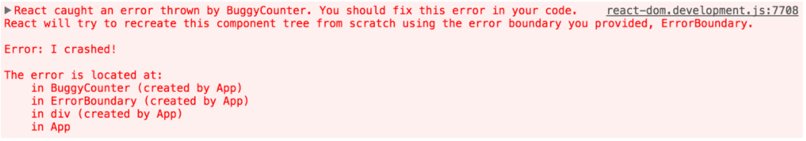
</p>

<div align="right">
    <b><a href="#table-of-contents">↥ back to top</a></b>
</div>

## Q. What are the methods invoked during error handling?

To create an error boundary, we simply have to create a class component and define a state variable for determining whether the error boundary has caught an error. Our class component should also have at least three methods:

* A static method called **getDerivedStateFromError()**, which is used to update the error boundary\'s state
* A **componentDidCatch()** lifecycle method for performing operations when our error boundaries catch an error, such as logging to an error logging service
* A **render()** method for rendering our error boundary\'s child or the fallback UI in case of an error

**Example:**

```js
/**
 * Error Boundary in React
 */
import React from 'react';

class ErrorBoundary extends React.Component<
  { children: React.ReactNode },
  { hasError: boolean }
> {
  constructor(props: { children: React.ReactNode }) {
    super(props);
    this.state = { hasError: false };
  }

  static getDerivedStateFromError(): { hasError: boolean } {
    // Update state so the next render will show the fallback UI.
    return { hasError: true };
  }

  componentDidCatch(error: Error, errorInfo: React.ErrorInfo) {
    // Log the error to an error reporting service
    console.error(error, errorInfo);
  }

  render() {
    if (this.state.hasError) {
      // You can render any custom fallback UI
      return <h1>Something went wrong.</h1>;
    }

    return this.props.children;
  }
}

export default ErrorBoundary;
```

<div align="right">
    <b><a href="#table-of-contents">↥ back to top</a></b>
</div>

## # 15. REACT REFS

<br/>

## Q. What do you understand by refs in React?

The **Refs** (short for "references") provide a way to access DOM without triggering a component re-render. React `Refs` are a useful feature that act as a means to reference a DOM element or a class component from within a parent component.

Refs also provide some flexibility for referencing elements within a child component from a parent component, in the form of **ref forwarding**.

**Example:**

```javascript
/**
 * Refs
 */
import { useRef, useState } from "react";

function App() {
  // create a ref to store the textInput DOM element
  const textInput = useRef<HTMLInputElement>(null);
  const [value, setValue] = useState('');

  // Set the state for the ref
  const handleSubmit = (e: React.SubmitEvent<HTMLFormElement>) => {
    e.preventDefault();
    setValue(textInput.current?.value ?? '');
  };

  return (
    <div>
      <h1>React Ref - useRef Example</h1>
      <h3>Value: {value}</h3>
      <form onSubmit={handleSubmit}>
        {/** Call the ref on <input> so we can use it to update the <h3> value **/}
        <input type="text" ref={textInput} />
        <button>Submit</button>
      </form>
    </div>
  );
}

export default App;
```

**When to Use Refs:**  

* Managing focus, text selection, or media playback.
* Triggering imperative animations.
* Integrating non-React libraries (like D3.js or Google Maps) that require direct access to DOM nodes.
* Keeping track of `setTimeout` or `setInterval` IDs so they can be cleared later.

**When not to use refs:**  

* Should not be used with functional components (they don\'t have instances).
* Not to be used on things that can be done declaratively.

<div align="right">
    <b><a href="#table-of-contents">↥ back to top</a></b>
</div>

## Q. How can I use multiple refs for an array of elements with hooks?

To manage multiple **refs** for an array of elements, use a single `useRef` initialized to an empty array, then populate it via callback refs in your `.map()`:

**Example:**

```js
/**
 * Multiple Refs
 */
import { useRef } from 'react';

function MyComponent() {
  const items = [10, 20, 30];
  const itemRefs = useRef<(HTMLLIElement | null)[]>([]);

  return (
    <ul>
      {items.map((item, index) => (
        <li 
          key={item} 
          ref={el => { itemRefs.current[index] = el; }}
        >
          {item}
        </li>
      ))}
    </ul>
  );
}

export default MyComponent; 
```

**&#9885; [Try this example on CodeSandbox](https://codesandbox.io/s/react-multiple-refs-z2wqm?file=/src/App.js)**

<div align="right">
    <b><a href="#table-of-contents">↥ back to top</a></b>
</div>

## Q. What is the difference between useRef() and createRef()?

**1. useRef():**

The `useRef` is a hook that uses the same `ref` throughout. It saves its value between re-renders in a functional component and doesn\'t create a new instance of the `ref` for every re-render. It persists the existing `ref` between re-renders.

**Example:**

```js
/**
 * useRef()
 */
import { useEffect, useRef, useState } from "react";

export default function App() {
  const [count, setCount] = useState(0);
  const ref = useRef<number | null>(null);

  useEffect(() => {
    ref.current = 100; // Initial Value
  }, []);

  useEffect(() => {
    console.log(count, ref.current);
  }, [count]);

  return (
    <div className="App">
      <button onClick={() => setCount((c) => c + 10)}>Increment</button>
      <p>{count}</p>
    </div>
  );
}
```

**&#9885; [Try this example on CodeSandbox](https://codesandbox.io/s/react-useref-44wfd?file=/src/App.js)**

**2. createRef():**

The `createRef` is a function that creates a new ref every time. Unlike the `useRef`, it does not save its value between re-renders, instead creates a new instance of the `ref` for every re-render. Thus implying that it does not persist the existing `ref` between re-renders.

**Example:**

```js
/**
 * createRef()
 */
import React, { createRef } from "react";

type AppProps = Record<string, never>;
type AppState = { count: number };

export default class App extends React.Component<AppProps, AppState> {
  ref = createRef<number>();

  constructor(props: AppProps) {
    super(props);
    this.state = { count: 0 };
  }

  componentDidMount() {
    this.ref.current = 100; // Initial Value
  }

  componentDidUpdate(prevProps: AppProps, prevState: AppState) {
    if (prevState.count !== this.state.count) {
      console.log(this.state.count, this.ref.current);
    }
  }

  render() {
    return (
      <div className="App">
        <button onClick={() => this.setState((s) => ({ count: s.count + 10 }))}>
          Increment
        </button>
        <p>{this.state.count}</p>
      </div>
    );
  }
}
```

**Note:**

*Always use `useRef()` in functional components. `createRef()` is intended for class components where it\'s called once in the constructor. In classes, you typically call it once in the constructor and assign it to `this.myRef`. Because the class instance stays the same during re-renders, the `ref` remains stable.*

**&#9885; [Try this example on CodeSandbox](https://codesandbox.io/s/react-createref-pgu2x?file=/src/App.js)**

<div align="right">
    <b><a href="#table-of-contents">↥ back to top</a></b>
</div>

## Q. Why are inline ref callback or function not recommended?

Inline **ref callbacks** are not recommended because they get called twice on every update:

* **Cleanup:** It calls the old function with null to clear the previous reference.
* **Setup:** It calls the new function with the actual DOM element to set the new reference.

This happens because a new function instance is created on every render, so React treats it as a different ref each time and must clean up the old one before assigning the new one.

**Example:** The Problem: `Inline Ref` Callbacks

```js
/**
 * Inline Ref Callback()
 */
import { useState } from 'react';

function InlineRefExample() {
  const [count, setCount] = useState(0);

  return (
    <div>
      <input 
        ref={(node) => {
          // This logs TWICE on every re-render: 
          // 1. "Ref is null" (cleanup)
          // 2. "Ref is [object HTMLInputElement]" (setup)
          console.log("Ref is:", node); 
        }} 
      />
      <button onClick={() => setCount(c => c + 1)}>Re-render ({count})</button>
    </div>
  );
}
```

**Example:** The Solution: `useCallback` Ref

```js
import { useState, useCallback } from 'react';

function StableRefExample() {
  const [count, setCount] = useState(0);

  // Memoize the function so it does not change on re-renders
  const stableRef = useCallback((node) => {
    if (node !== null) {
      console.log("Ref initialized once:", node);
    }
  }, []); // Empty deps means it never changes

  return (
    <div>
      <input ref={stableRef} />
      <button onClick={() => setCount(c => c + 1)}>Re-render ({count})</button>
    </div>
  );
}
```

**&#9885; [Try this example on CodeSandbox](https://codesandbox.io/s/react-ref-callback-6ry5o?file=/src/App.js)**

<div align="right">
    <b><a href="#table-of-contents">↥ back to top</a></b>
</div>

## Q. Which is the preferred option callback refs or findDOMNode()?

**Callback refs** are the preferred option over `findDOMNode()` in React. 

While `findDOMNode()` was once a common way to access an element\'s underlying DOM node, it is now discouraged and **deprecated** in Strict Mode. In modern React, you should use **refs** (either via `useRef` for functional components or `createRef`/callback refs for class components)

**Example**: The legacy approach of using `findDOMNode()`

```js
class MyComponent extends Component {
  componentDidMount() {
    findDOMNode(this).scrollIntoView()
  }

  render() {
    return <div />
  }
}
```

**Example**: The recommended approach is `useRef`

```js
import { useRef, useEffect } from 'react';

function MyComponent() {
  const nodeRef = useRef(null);

  useEffect(() => {
    nodeRef.current.scrollIntoView();
  }, []);

  return <div ref={nodeRef} />;
}
```

<div align="right">
    <b><a href="#table-of-contents">↥ back to top</a></b>
</div>

## Q. How to set focus on an input field after rendering?

Use `useRef` to get a reference to the input element and `useEffect` with an empty dependency array to call `.focus()` once after the component mounts.

**Example**:

```js
import { useRef, useEffect } from 'react';

function AutoFocusTextInput() {
  const textInput = useRef(null);

  useEffect(() => {
    textInput.current.focus();
  }, []);

  return <input ref={textInput} />;
}
```

<div align="right">
    <b><a href="#table-of-contents">↥ back to top</a></b>
</div>

## Q. Why are string refs considered legacy in React?

> Although string refs are not deprecated, they are considered legacy, and will likely be deprecated at some point in the future. Callback refs are preferred.

**Callback Refs:**

Instead of passing a **ref** attribute created by `createRef()`, you pass a function. The function receives the React component instance or HTML DOM element as its argument, which can be stored and accessed elsewhere.

**Example:** Legacy String Ref (Deprecated)

```js
// LEGACY: Do not use this in modern React
class LegacyComponent extends React.Component {
  componentDidMount() {
    // Accessing the element via the string name
    this.refs.myInput.focus();
  }

  render() {
    return <input ref="myInput" />;
  }
}
```

**Example:** Modern useRef Hook (Recommended)

```js
// MODERN: The standard approach
import { useRef } from 'react';

function ModernComponent() {
  const inputRef = useRef(null);

  const handleClick = () => {
    // Accessing the DOM element via .current
    inputRef.current.focus();
  };

  return (
    <>
      <input ref={inputRef} />
      <button onClick={handleClick}>Focus Input</button>
    </>
  );
}
```

**Example:** Modern Callback Ref

```js
// ADVANCED: Useful for dynamic elements
function CallbackRefExample() {
  const setRef = (node) => {
    if (node) {
      console.log("Input is mounted:", node);
      node.focus();
    } else {
      console.log("Input is unmounted");
    }
  };

  return <input ref={setRef} />;
}
```

**&#9885; [Try this example on CodeSandbox](https://codesandbox.io/s/react-refs-hiw59?file=/src/index.js)**

<div align="right">
    <b><a href="#table-of-contents">↥ back to top</a></b>
</div>

## Q. What is `forwardRef()` in React?

Ref forwarding is a technique for passing a `ref` through a component to one of its children. It is very useful for cases like reusable component libraries and Higher Order Components (HOC).

We can forward a `ref` to a component by using the `React.forwardRef()` function. Ref forwarding allows components to take a ref they receive and pass it further down (in other words, "forward" it) to a child.

**Example:**

```js
// Child component wraps itself with forwardRef
const TextInput = React.forwardRef((props, ref) => (
  <input type="text" ref={ref} />
));

// Parent creates a ref and passes it to the child
function Parent() {
  const inputRef = React.createRef();

  const handleClick = () => {
    inputRef.current.focus(); // directly accesses the <input> DOM node
  };

  return (
    <>
      <TextInput ref={inputRef} />
      <button onClick={handleClick}>Focus</button>
    </>
  );
}
```

In the example above, we have a component called TextInput that has a child which is an input field. First, we start by creating a ref with the line of code below:

```js
const inputRef = React.createRef()
```

We pass our ref down to `<TextInput ref={inputRef}>` by specifying it as a JSX attribute. React then forwards the `ref` to the `forwardRef()` function as a second argument. Next, We forward this `ref` argument down to `<input ref={ref}>`. The value of the DOM node can now be accessed at `inputRef.current`.

**Common use cases:**

* Reusable component libraries (e.g., `<Input>`, `<Button>`) that need to expose DOM nodes
* Higher Order Components (HOCs) that wrap components but must pass refs through
* Integrating with third-party libraries that require a direct DOM reference.

<div align="right">
    <b><a href="#table-of-contents">↥ back to top</a></b>
</div>

## Q. How to debug forwardRefs() in DevTools?

**React.forwardRef** accepts a render function as parameter and DevTools uses this function to determine what to display for the ref forwarding component.

**Problem:** If you don\'t name the render function or not using displayName property then it will appear as "ForwardRef" in the DevTools,

```js
const WrappedComponent = React.forwardRef((props, ref) => {
  return <LogProps {...props} forwardedRef={ref} />;
});
```

**Solution:** If you name the render function then it will appear as "ForwardRef(myFunction)"

```js
/**
 * set displayName explicitly
 */
const WrappedComponent = React.forwardRef((props, ref) => {
  return <LogProps {...props} forwardedRef={ref} />;
});

WrappedComponent.displayName = 'myFunction';
// DevTools shows: ForwardRef(myFunction)
```

**Example:**

```js
const ForwardP = React.forwardRef(function ForwardP(props, ref) {
  return (
    <>
      <p>I'm a real component too</p>
      <p>
        Especially with <code>useImperativeMethods</code>
      </p>
      <p {...props} ref={ref} />
    </>
  );
});

function App() {
  return (
    <div className="App">
      <ForwardP style={{ opacity: 0.5 }}>
        But my props are <code>null</code> in DevTools
      </ForwardP>
    </div>
  );
}
```

<p align="center">
  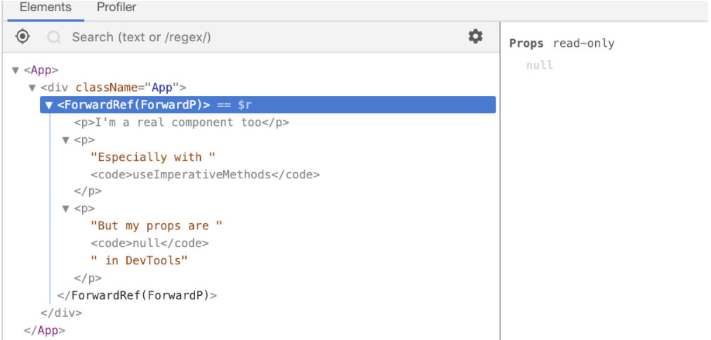
</p>

**&#9885; [Try this example on CodeSandbox](https://codesandbox.io/s/react-forwardref-ccqgu?file=/src/index.js)**

<div align="right">
    <b><a href="#table-of-contents">↥ back to top</a></b>
</div>

## Q. What is difference between useRef() and useState() in React?

Both **useRef()** and **useState()** are React hooks for managing data, but they serve different purposes and behave differently. `useState` triggers a re-render when updated; `useRef` does not.

**Key Differences:**

| Feature | useRef() | useState() |
|---------|----------|-----------|
| **Purpose** | Store mutable values that persist | Manage component state |
| **Re-render** | Does NOT trigger re-render | Triggers re-render |
| **Update** | Synchronous | Asynchronous |
| **Access** | .current property | Direct value |
| **Common Use** | DOM references, timers | UI state, user input |

**useState():** for values that drive the UI

```js
import React, { useState } from 'react';

function Counter() {
  const [count, setCount] = useState(0);

  const handleClick = () => {
    setCount(count + 1); // Triggers re-render
    console.log(count); // May show old value (async)
  };

  return (
    <div>
      <h2>Count: {count}</h2>
      <button onClick={handleClick}>Increment</button>
    </div>
  );
}
```

**useRef():** for values that don\'t need to update the UI

```js
import React, { useRef } from 'react';

function Counter() {
  const countRef = useRef(0);

  const handleClick = () => {
    countRef.current += 1; // Does NOT trigger re-render
    console.log(countRef.current); // Shows updated value immediately
  };

  return (
    <div>
      <h2>Count: {countRef.current}</h2> {/* Won\'t update on screen */}
      <button onClick={handleClick}>Increment</button>
    </div>
  );
}
```

**Common Use Cases:**

**1. useRef for DOM Access:**

```js
function TextInput() {
  const inputRef = useRef(null);

  const focusInput = () => {
    inputRef.current.focus();
  };

  return (
    <div>
      <input ref={inputRef} type="text" />
      <button onClick={focusInput}>Focus Input</button>
    </div>
  );
}
```

**2. useRef for Storing Previous Values:**

```js
function Component() {
  const [count, setCount] = useState(0);
  const prevCountRef = useRef();

  useEffect(() => {
    prevCountRef.current = count;
  }, [count]);

  return (
    <div>
      <h2>Current: {count}</h2>
      <h2>Previous: {prevCountRef.current}</h2>
      <button onClick={() => setCount(count + 1)}>Increment</button>
    </div>
  );
}
```

**3. useRef for Timers:**

```js
function Timer() {
  const [seconds, setSeconds] = useState(0);
  const intervalRef = useRef(null);

  const startTimer = () => {
    intervalRef.current = setInterval(() => {
      setSeconds(s => s + 1);
    }, 1000);
  };

  const stopTimer = () => {
    clearInterval(intervalRef.current);
  };

  return (
    <div>
      <h2>{seconds} seconds</h2>
      <button onClick={startTimer}>Start</button>
      <button onClick={stopTimer}>Stop</button>
    </div>
  );
}
```

**Use useState when:**

* Value changes should update the UI
* Managing form inputs
* Toggling UI elements
* Any data that affects rendering

**Use useRef when:**

* Accessing DOM elements
* Storing mutable values that do not affect rendering
* Keeping track of previous values
* Storing timer IDs
* Avoiding unnecessary re-renders

**Note:**

* useRef updates are **synchronous**, useState updates are **asynchronous**
* useRef doesn\'t notify about changes, useState triggers re-render
* Both persist values across re-renders

<div align="right">
    <b><a href="#table-of-contents">↥ back to top</a></b>
</div>

## # 16. REACT COMPOSITION

<br/>

## Q. Explain Inheritance in React?

In React, **inheritance** is a concept where one component inherits properties or behaviors from another, typically using the `extends` keyword in Class Components. However, it is considered an **anti-pattern** and is officially discouraged by the React team. The React team recommends **Composition** over Inheritance.

**Example:**

```js
/**
 * Parent Class
 */
import React from "react";

export class ParentClass extends React.Component {
  constructor(props) {
    super(props);
    this.callMe = this.callMe.bind(this);
  }

  // ParentClass function
  callMe() {
    console.log("This is a method from parent class");
  }

  render() {
    return false;
  }
}
```

```js
/**
 * Child Class
 */
export default class App extends ParentClass {
  render() {
    return <button onClick={() => this.callMe()}>Call Parent</button>;
  }
}
```

**&#9885; [Try this example on CodeSandbox](https://codesandbox.io/s/react-inheritance-c6uc64?file=/src/App.js)**

**Note**: 

*React does not use inheritance except in the initial component class, which extends from the **react** package.*

<div align="right">
    <b><a href="#table-of-contents">↥ back to top</a></b>
</div>

## Q. Explain Composition in React?

Composition is a pattern where components are built by **combining** smaller, reusable components together — rather than inheriting from a parent. It follows the "has-a" relationship (a component uses another component).

**Benefits**

* **Solves "Prop Drilling"**: By composing components at a higher level, you can pass data directly to the deep child that needs it, rather than passing it through five intermediate layers.

* **Avoids "Prop Hell"**: Instead of one massive component with 20 props to toggle every feature, you break it into small pieces (e.g., Alert.Title, Alert.Icon, Alert.Body) that the user can mix and match.

* **Performance:** Composition can reduce unnecessary re-renders. When a parent\'s state changes, React only re-renders the parts that actually changed; wrapped children often stay the same and are skipped.

* **Flexibility:** You can change the internal structure of a child component without worrying about breaking a parent class\'s internal logic

**Example**: Basic Containment using `children` prop

```js
/**
 * Composition in React
 */
// Card.jsx (a reusable wrapper component)
const Card = ({ children }) => (
  <div style={{ border: '1px solid gray', padding: '10px', borderRadius: '5px' }}>
    {children}
  </div>
);

// App.jsx (composing content inside the Card)
function App() {
  return (
    <Card>
      <h2>Card Title</h2>
      <p>This is some content inside the card.</p>
    </Card>
  );
}

export default App;
```

**&#9885; [Try this example on CodeSandbox](https://codesandbox.io/s/react-composition-kq6fpc?file=/src/App.js)**

<div align="right">
    <b><a href="#table-of-contents">↥ back to top</a></b>
</div>

## Q. How Composition is different from Inheritance in React?

Inheritance used the `is-a` relationship method. Derived components had to inherit the properties of the base component and it was quite complicated while modifying the behavior of any component.

Composition does not inherit properties, only the behavior. In inheritance, it was difficult to add new behavior because the derived component was inheriting all the properties of parent class and it was quite difficult to add new behavior. But in composition, we only inherit behavior and adding new behavior is fairly simple and easy.

React recommends use of Composition over Inheritance, here is why. Everything in React is a component, and it follows a strong component based model. This is one of the primary reasons that composition is a better approach than inheritance for code reuse.

**Composition vs Inheritance**

|	            |Inheritance	    |Composition  |
|-------------|-----------------|-------------|
|Relationship	|is-a	            |has-a        |
|Coupling	    |Tightly coupled	|Loosely coupled|
|Behavior reuse|	Inherits all parent properties| Shares only needed behavior|
|Flexibility	|Rigid — hard to modify	|Flexible — easy to extend|
|React recommendation| Anti-pattern	| Preferred|

<div align="right">
    <b><a href="#table-of-contents">↥ back to top</a></b>
</div>

## # 17. REACT CSS STYLING

<br/>

## Q. How to use styles in React.js?

React Components can add styling in the following ways:

**1. Inline Styles:**

Inline styles are applied directly to elements using the style attribute. In React, this attribute accepts a JavaScript object rather than a string.

* **CamelCase Keys:** CSS properties with hyphens (e.g., background-color) must be written in camelCase (e.g., backgroundColor).
* **Syntax:** Use double curly braces `{{ }}`—the outer pair for JSX expression and the inner for the object literal.
* **Use Case:** Best for dynamic, state-based styles (like a progress bar width)

**Example:**

```js
/**
 * Inline Styling
 */
class HeaderComponent extends React.Component {
  render() {
    return (
      <div>
        <h1 style={{backgroundColor: "lightblue"}}>Header Component Style!</h1>
        <p>Add a little style!</p>
      </div>
    );
  }
}
```

**&#9885; [Try this example on CodeSandbox](https://codepen.io/learning-zone/pen/BaRJmyG?editors=0010)**

**2. Styled-Components (CSS-in-JS)**

This popular library allows you to write actual CSS code directly inside your JavaScript files using tagged template literals. 

* **Installation:** Requires `npm install styled-components`.
* **Benefits:** It creates unique class names automatically and supports full CSS features like nesting and media queries.

**Example:**

```js
/**
 * Styled Components
 */
import styled from 'styled-components';

const Wrapper = styled.div`
  color: white;
  background: black;
  &:hover { color: gold; }
`;
```

**&#9885; [Try this example on CodeSandbox](https://codepen.io/learning-zone/pen/abWEVvp?editors=0010)**

**3. CSS Stylesheet:**

You can write your CSS styling in a separate file, just save the file with the `.css` file extension, and import it in your application.

**Example:**

```css
/**  
 * App.css 
 */
body {
  background-color: #282c34;
  color: white;
  padding: 40px;
  font-family: Arial;
  text-align: center;
}
```

```js
/**
 * CSS Stylesheet
 */
import './App.css';

class HeaderComponent extends React.Component {
  render() {
    return (
      <div>
        <h1>Header Component Style!</h1>
        <p>Add a little style!.</p>
      </div>
    );
  }
}
```

**4. CSS Modules:**

CSS Modules allow you to scope CSS locally to a specific component, preventing global naming conflicts.

**Example:**

```js
import styles from './Button.module.css';

function Button() {
  return <button className={styles.error}>Click Me</button>;
}
```

<div align="right">
    <b><a href="#table-of-contents">↥ back to top</a></b>
</div>

## Q. How to conditionally apply CSS classes in React JS?

**Example:** Using ternary operator

```js
import { useState } from 'react'

function App() {
  const [isRed, setIsRed] = useState(true)

  return <p style={{ color: isRed ? 'red' : 'blue' }}>Example Text</p>
}
```

**Example:** Using Logical AND (&&)

```js
import { useState } from 'react'

function App() {
  const [isLoggedIn, setIsLoggedIn] = useState(false)

  return (
    <>
      <p className={`message ${isLoggedIn && 'active'}`}>
        {isLoggedIn ? 'Welcome back!' : 'Please log in.'}
      </p>
      <button onClick={() => setIsLoggedIn(!isLoggedIn)}>
        {isLoggedIn ? 'Logout' : 'Login'}
      </button>
    </>
  )
}
```

**&#9885; [Try this example on CodeSandbox](https://codepen.io/learning-zone/pen/BaRJGre?editors=0010)**

<div align="right">
    <b><a href="#table-of-contents">↥ back to top</a></b>
</div>

## Q. How to combine multiple inline style objects?

**Example:** Using Spread operator

```js
const box = {
    color: "green",
    fontSize: '23px'
}

const shadow = {
    background: "orange",
    boxShadow: "1px 1px 1px 1px #cccd"
}

export default function App(){
    return (
      <div style={{...box, ...shadow}}>
         <h1>Hello React</h1>
      </div>
    )
}
```

**Example:**  Using `Object.assign()`

```js
import { useState } from 'react'

export default function App() {
  const [isActive, setIsActive] = useState(false)

  const baseStyle = {
    padding: '10px 20px',
    borderRadius: '4px',
    border: '1px solid #ccc',
    cursor: 'pointer'
  }

  const activeStyle = {
    background: 'blue',
    color: 'white',
    border: '1px solid blue'
  }

  const combinedStyle = Object.assign({}, baseStyle, isActive ? activeStyle : {})

  return (
    <div>
      <div style={combinedStyle} onClick={() => setIsActive(!isActive)}>
        {isActive ? 'Active' : 'Inactive'}
      </div>
    </div>
  )
}
```

**&#9885; [Try this example on CodeSandbox](https://codepen.io/learning-zone/pen/RwVxqdv?editors=0010)**

<div align="right">
    <b><a href="#table-of-contents">↥ back to top</a></b>
</div>

## Q. What are the popular package for animation in React JS?

* [React Transition Group](https://reactcommunity.org/react-transition-group/)
* [React Spring](https://react-spring.io/)
* [Framer Motion](https://www.framer.com/motion/)
* [React Move](https://react-move.js.org/#/getting-started/features)
* [React Reveal](https://www.react-reveal.com/)

**Quick Comparison**

|Package	     |Style	                |Best For           |                         
|--------------|----------------------|--------------------|
|Framer Motion |Declarative	          |General UI, gestures|
|React Spring	 |Physics-based	        |Natural motion       |
|React Transition Group	|CSS-based	  |Enter/exit transitions|
|React Move	   |Data-driven	          |Data visualizations|
|React Reveal	 |Scroll-based	        |Landing pages|

<div align="right">
    <b><a href="#table-of-contents">↥ back to top</a></b>
</div>

## Q. What is the benefit of styles modules?

In React, the primary benefit of using CSS Modules is that it **provides local scoping for styles by default**. This solves the common problem of global namespace collisions where styles from one component accidentally overwrite styles in another.

**Benefits of CSS modules:**

* **No Class Name Collisions:** Each component gets unique, auto-generated class names at build time, so `.button` in one component never conflicts with `.button` in another.

* **Local Scope by Default:** Styles are scoped to the component that imports them — changes in one file don\'t accidentally break other components.

* **Reuse the Same Class Names:** You can use `.container`, `.title`, `.btn` in every component\'s CSS file without worrying about conflicts.

* **Maintainability:** You can confidently update or delete a CSS file knowing it only affects the one component that imports it.

* **Dead Code Elimination:** Bundlers can detect and remove unused CSS module classes since the relationship between JS and CSS is explicit.

<div align="right">
    <b><a href="#table-of-contents">↥ back to top</a></b>
</div>

## Q. What are styled components?

**styled-components** is a **CSS-in-JS** library that lets you write actual CSS inside JavaScript using tagged template literals.

The `styled-components` comes with a collection of helper methods, each corresponding to a DOM node for example `<h1>`, `<header>`, `<button>`, and SVG elements like `line` and `path`. The helper methods are called with a chunk of CSS, using an obscure JavaScript feature known as “tagged template literals”.

**Key Features**

* **Scoped styles:**	Auto-generated unique class names
* **Dynamic styling:**	Props-based style logic
* **Full CSS support:**	Nesting, media queries, pseudo-classes
* **Theming:**	`ThemeProvider` for app-wide themes
* **No class naming:**	No need to manually manage class names
* **SSR support:**	Works with server-side rendering

**Example:**

```js
import styled from 'styled-components';

// This creates a button component with specific styles
const StyledButton = styled.button`
  background: transparent;
  border-radius: 3px;
  border: 2px solid #bf4f74;
  color: #bf4f74;
  padding: 0.25em 1em;
`;

// Use it like any other React component
render(<StyledButton>Click Me</StyledButton>);
```

<div align="right">
    <b><a href="#table-of-contents">↥ back to top</a></b>
</div>

## Q. How to use useSpring() for animation?

In the React Spring library, `useSpring()` is a custom hook used to create single-spring animations that move data from one state to another. Unlike traditional CSS animations that rely on fixed durations and easing curves, `useSpring` uses **spring physics**—such as tension, friction, and mass—to produce motion that feels natural and mimics the real world.

**Basic Implementation:**

The most common way to use useSpring is by passing an object with from (initial state) and to (target state) properties.

**Example:**

```js
/**
 * useSpring()
 */
import { useSpring, animated } from '@react-spring/web';

function FadeIn() {
  const styles = useSpring({
    from: { opacity: 0 },
    to: { opacity: 1 },
  });

  return <animated.div style={styles}>I will fade in!</animated.div>;
}
```

**2. Interactive Animations:**

You can trigger animations based on state changes (like hovers or clicks) by passing conditional values directly into the hook.

**Example**:

```js
const [clicked, setClicked] = useState(false);

const springs = useSpring({
  width: clicked ? '300px' : '100px',
  background: clicked ? 'blue' : 'red',
  config: { tension: 200, friction: 20 } // Adjust physics here
});

return (
  <animated.div 
    onClick={() => setClicked(!clicked)} 
    style={springs} 
  />
);
```

<div align="right">
    <b><a href="#table-of-contents">↥ back to top</a></b>
</div>

## Q. How do you apply vendor prefixes to inline styles in React?

React does not automatically apply vendor prefixes to inline styles. You must either add them manually as camelCased properties or use a third-party library to handle them at runtime.

**Manual Prefixing**

To apply prefixes manually, add them as separate properties in your style object using camelCase.

* **Webkit, Moz, and O**: These must start with a capital letter (e.g., `WebkitTransform`).
* **ms**: This is the only prefix that should stay lowercase (e.g., `msTransform`).

**Example**:

```js
const myStyle = {
  transform: 'rotate(45deg)',
  WebkitTransform: 'rotate(45deg)', // Chrome, Safari, newer Opera
  msTransform: 'rotate(45deg)'      // Internet Explorer 9
};

return <div style={myStyle}>Hello World</div>;
```

**&#9885; [Try this example on CodeSandbox](https://codesandbox.io/s/react-vendor-prefix-k29wi?file=/src/App.js)**

<div align="right">
    <b><a href="#table-of-contents">↥ back to top</a></b>
</div>

## Q. How to display style based on props value?

When using Styled Components, you can access props by passing a function into the tagged template literal. This is the most common way to handle dynamic styles in React.

**1. Simple Ternary (Toggle):**

```js
import styled from 'styled-components'

const Button = styled.button`
  background: ${props => props.primary ? 'blue' : 'gray'}
  color: 'white'
`;

function MyPureComponent(props) {
  return (
    <div>
      <Button>Normal</Button>
      <Button primary>Primary</Button>
    </div>
  )
}
```

**2. Multi-line Blocks (CSS Helper)**

If you need to apply a whole block of CSS rules based on a prop, use the css helper from the library. This keeps the code clean and ensures syntax highlighting works.

```js
import styled, { css } from 'styled-components';

const Alert = styled.div`
  padding: 10px;
  
  ${props => props.urgent && css`
    background: red;
    font-weight: bold;
    border: 2px solid darkred;
  `}
`;

// Usage
<Alert urgent>Emergency!</Alert>
```

**3. Complex Mapping (The "Switch" Pattern)**

If your component has multiple states (e.g., 'success', 'warning', 'error'), use a mapping object to avoid long if/else chains.

```js
const themeColors = {
  success: 'green',
  warning: 'orange',
  error: 'red'
};

const StatusBox = styled.div`
  background: ${props => themeColors[props.status] || 'gray'};
`;

// Usage
<StatusBox status="success">Task Complete</StatusBox>
```

<div align="right">
    <b><a href="#table-of-contents">↥ back to top</a></b>
</div>

## # 18. REACT INTERNATIONALIZATION

<br/>

## Q. How to translate your React app with react-i18next?

**1. Install Dependencies:**

```bash
npm install i18next react-i18next i18next-browser-languagedetector i18next-http-backend
```

* `i18next-browser-languagedetector`: Automatically detects the user\'s browser language.
* `i18next-http-backend`: Allows you to load translation files from your `/public` folder rather than bundling them into your JavaScript.

**2. Configure i18next:**

Create a new file `i18n.js` beside your `index.js` containing following content:

```js
/**
 * i18next Component
 */
import i18n from 'i18next';
import { initReactI18next } from 'react-i18next';
import LanguageDetector from 'i18next-browser-languagedetector';
import HttpBackend from 'i18next-http-backend';

i18n
  .use(HttpBackend)
  .use(LanguageDetector)
  .use(initReactI18next)
  .init({
    fallbackLng: 'en',
    debug: true,
    interpolation: {
      escapeValue: false, // React already escapes by default
    },
    backend: {
      loadPath: '/locales/{{lng}}/translation.json',
    }
  });

export default i18n;
```

**3. Create Translation Files**

Organize your translations in JSON files within the public/locales directory. For example: 

* `public/locales/en/translation.json`: `{"welcome": "Hello World"}`
* `public/locales/fr/translation.json`: `{"welcome": "Bonjour le monde"}`

**4. Use in Components:**

Use the `useTranslation` hook to access the translation function (`t`) and the `i18n` instance.

```js
/**
 * useTranslation() in React
 */

import { useTranslation } from "react-i18next";

export default function App() {
  const { t, i18n } = useTranslation();

  const changeLanguage = (lng) => {
    i18n.changeLanguage(lng);
  };

  return (
    <>
      <h2>{t("Welcome")}</h2>
      <button onClick={() => changeLanguage("en")}>English</button>
      <button onClick={() => changeLanguage("fr")}>French</button>
    </>
  );
}
```

**&#9885; [Try this example on CodeSandbox](https://codesandbox.io/s/react-usetranslation-5gb2jx?file=/src/App.js)**

**Reference:**

* *[https://react.i18next.com/guides/quick-start](https://react.i18next.com/guides/quick-start)*

<div align="right">
    <b><a href="#table-of-contents">↥ back to top</a></b>
</div>

## # 19. REACT MISCELLANEOUS

<br/>

## Q. What is render hijacking in React?

In React, **render hijacking** is a technique where one component controls or modifies the render output of another component. It is most commonly achieved using **Higher-Order Components (HOCs)**, specifically through a pattern called **Inheritance Inversion**.

In Render Highjacking we can:

* Read, add, edit, remove props in any of the React Elements outputted by render
* Read, and modify the React Elements tree outputted by render
* Conditionally display the elements tree
* Wrapping the element\'s tree for styling purposes.

**Common Use Cases**

Render hijacking is typically used for advanced cross-cutting concerns: 

* **Access Control:** Checking permissions and rendering a "Denied" message instead of the requested component.
* **Loading States:** Wrapping components to display a loader while waiting for data.
* **Performance Optimization:** Intercepting the render to prevent unnecessary updates or to cache results.
* **Error Handling:** Implementing Error Boundaries to catch crashes in child components and display a safe UI instead.

**Example:** Inheritance Inversion HOC

```js
function withHijack(WrappedComponent) {
  return class extends WrappedComponent {
    render() {
      // Hijack the render output
      const elementsTree = super.render();
      
      // Modify the output (e.g., adding a style or changing props)
      if (elementsTree && elementsTree.type === 'div') {
        return React.cloneElement(elementsTree, { 
          style: { color: 'blue' } 
        });
      }
      
      return elementsTree;
    }
  };
}
```

<div align="right">
    <b><a href="#table-of-contents">↥ back to top</a></b>
</div>

## Q. What is windowing technique in react?

Windowing (also known as list virtualization) is a performance optimization technique that renders only the items currently visible in the user\'s viewport, plus a small buffer, rather than rendering an entire large dataset at once.

**How It Works**

Instead of mounting thousands of DOM nodes simultaneously—which can cause laggy scrolling and high memory usage—windowing calculates which elements should be visible based on the scroll position. 

* **Visible "Window":** Only the 5–10 items the user can see are rendered in the DOM.
* **Dynamic Swapping:** As the user scrolls, items exiting the viewport are unmounted, and new items entering the "window" are mounted.
* **Absolute Positioning:** A large "inner container" is used to simulate the total height of the full list, ensuring the scrollbar behaves accurately even though most items are not actually there.

**Popular Libraries:**

* **[react-window](https://react-window.vercel.app/#/examples/list/fixed-size)**: A modern, lightweight (approx. 2KB) library focused on speed and simplicity.

* **[react-virtualized](https://bvaughn.github.io/react-virtualized/#/components/List)**: A more feature-rich but larger library (approx. 33KB) for complex use cases like masonry layouts.

**Example:** react-window

```js
import React from 'react';
import { FixedSizeList as List } from 'react-window';

// 1. Define the Row component
// It receives 'index' (to fetch data) and 'style' (crucial for positioning)
const Row = ({ index, style }) => (
  <div style={{ 
    ...style, 
    display: 'flex', 
    alignItems: 'center', 
    borderBottom: '1px solid #eee' 
  }}>
    Item {index}
  </div>
);

const App = () => {
  return (
    // 2. Wrap the Row in a List component
    <List
      height={400}        // Visible height of the "window"
      width={300}         // Width of the list
      itemCount={10000}   // Total number of items in the dataset
      itemSize={50}       // Height of each individual row in pixels
    >
      {Row}
    </List>
  );
};

export default App;
```

**&#9885; [Try this example on CodeSandbox](https://codesandbox.io/s/react-window-rz5hf?file=/src/App.js)**

<div align="right">
    <b><a href="#table-of-contents">↥ back to top</a></b>
</div>

## Q. How to optimize React Performance?

Optimizing React performance generally falls into three categories: reducing the size of your code, minimizing unnecessary rendering, and managing heavy data efficiently.

**1. Reduce Initial Load (Bundle Size)**

Large JavaScript bundles are a major cause of slow "Time to Interactive" (TTI). 

* **Code Splitting:** Use `React.lazy()` and `Suspense` to split your app into smaller chunks. Instead of loading every page at once, load only what the user needs for their current route.

* **Tree Shaking:** Ensure your build tool (like Vite or Webpack) removes unused code by using named imports (e.g., `import { map } from 'lodash-es'`) instead of importing entire libraries.

* **Production Build:** Always deploy the minified production version (`npm run build`). Development builds include extra warnings and checks that make the app significantly slower.

**2. Prevent Unnecessary Re-renders**

React re-renders a component whenever its parent renders or its state/props change. You can skip this work for components that haven\'t actually changed: 

* **React.memo:** Wrap pure functional components in `memo()` to skip re-rendering if their props remain the same.

* **useCallback & useMemo:** Use these hooks to maintain "referential equality." If you pass a new function or object as a prop on every render, it will break React.memo in child components. Caching them prevents this.

* **Localize State:** Move state as low as possible in the component tree. If only one input field needs a piece of state, don\'t keep it in the root App component, as updating it will re-render everything.

**3. Handle Large Data & Interactions**

* **Windowing (Virtualization):** For lists with hundreds or thousands of items, use libraries like react-window or react-virtualized. These render only the items currently visible in the viewport, drastically reducing DOM nodes.

* **Transition Hook (useTransition):** Use this to mark non-urgent state updates (like filtering a long list). It allows React to keep the UI responsive for urgent tasks (like typing in an input) while the heavy rendering happens in the background.

* **Throttling & Debouncing:** For events that fire rapidly (scrolling, resizing, typing), use lodash to limit how often your functions execute.

<div align="right">
    <b><a href="#table-of-contents">↥ back to top</a></b>
</div>

## Q. What do you understand with the term polling in React?

Polling in React is a mechanism where the application repeatedly calls an API at regular intervals to check for updated data and refresh the UI accordingly. 

**How Polling works in React**

React itself doesn\'t provide polling out of the box, so its implemented using:

* setInterval or setTimeout
* useEffect Hook
* API calls (Fetch/Axios)

There are two primary ways polling is implemented:

**1. Short Polling**

The client sends an HTTP request at a fixed interval (e.g., every 5 seconds) regardless of whether the data has actually changed.

* **How it works**: Uses setInterval or setTimeout within a useEffect hook to trigger a fetch function.
* **Best for**: Dashboards, notification counters, or status indicators where slight delays are acceptable.
* **Drawback:** Can be inefficient and resource-heavy for the server if many requests return no new data.

**2. Long Polling**

The client sends a request, and the server holds the connection open until new data is available or a timeout occurs.

* **How it works:** Once the client receives a response, it immediately initiates a new request to wait again.
* **Best for:** Scenarios needing closer to "real-time" responsiveness without the complexity of WebSockets.

**Example:**  Recommended Approach (TanStack Query)

Using a library like TanStack Query (formerly React Query) is better because it handles background refetching, caching, and loading states automatically.

```js
import { useQuery } from '@tanstack/react-query';

function UserActivity() {
  const { data, isLoading } = useQuery({
    queryKey: ['activeUsers'],
    queryFn: () => fetch('/api/active-users').then(res => res.json()),
    // Polls every 3 seconds
    refetchInterval: 3000, 
    // Continues polling even when the tab is in the background
    refetchIntervalInBackground: true 
  });

  if (isLoading) return <div>Loading...</div>;
  return <div>Active Users: {data.count}</div>;
}
```

<div align="right">
    <b><a href="#table-of-contents">↥ back to top</a></b>
</div>

## Q. What are the drawbacks of MVW pattern?

MVW stands for **Model-View-Whatever**

* `MVC` - Model-View-Controller
* `MVP` - Model-View-Presenter
* `MVVM` - Model-View-ViewModel
* `MVW / MV* / MVx` - Model-View-Whatever
* `HMVC` - Hierarchical Model-View-Controller
* `MMV` - Multiuse Model View
* `MVA` - Model-View-Adapter

In React.js, the MVW (Model-View-Whatever) pattern—which typically encompasses variations like MVC (Model-View-Controller) or MVVM (Model-View-ViewModel)—is often considered a "mismatch" for React\'s core philosophy.

Drawbacks as applications scale:

* **Uncontrolled state changes** — As the number of models and controllers grows, they start communicating with each other through service layers, each modifying the other\'s state. It becomes increasingly difficult to track who changed what and when.

* **Nondeterministic UI state** — Asynchronous network calls make the timing of model updates unpredictable. If a user interacts with the UI while an async callback is still in-flight, the resulting state can be inconsistent and hard to reason about.

* **Complex mutation tracking** — Determining when state has actually changed adds another layer of complexity. You need additional tooling or conventions just to detect and respond to mutations reliably.

* **Poor fit for real-time/collaborative apps** — Applications like Google Docs, where many data changes happen simultaneously from multiple sources, expose the fundamental weaknesses of MVW\'s bidirectional data flow.

* **No built-in undo/time-travel** — Implementing undo/redo requires significant extra boilerplate because there is no single source of truth or immutable state history.

React\'s unidirectional data flow (actions → reducer → state → UI) and Redux\'s single immutable state tree were specifically designed to solve these MVW problems — making state changes predictable, traceable, and replayable.

<div align="right">
    <b><a href="#table-of-contents">↥ back to top</a></b>
</div>

## Q. How do you update render elements?

React Elements are immutable — once created, you cannot update their children or attributes directly. To update a rendered element, you must re-render with a new element.

**Using `useState` + `useEffect` (Recommended approach):**

In practice, managing periodic updates via `setInterval` inside a component using hooks is the idiomatic React way. State changes trigger re-renders automatically.

**Example**:

```js
import { useState, useEffect } from "react";

function Clock() {
  const [time, setTime] = useState(new Date());

  useEffect(() => {
    const id = setInterval(() => setTime(new Date()), 1000);
    return () => clearInterval(id); // cleanup on unmount
  }, []);

  return <h2>Current Time: {time.toLocaleTimeString()}</h2>;
}

export default Clock;
```

React\'s diffing algorithm ensures only the changed part of the DOM (the time string) is updated on each re-render.

**&#9885; [Try this example on CodeSandbox](https://codesandbox.io/s/react-clock-1f5xp?file=/src/index.js)**

<div align="right">
    <b><a href="#table-of-contents">↥ back to top</a></b>
</div>

## Q. What is the difference between rendering and mounting in ReactJS?

**Mounting** happens once — when React inserts a component into the DOM for the first time and builds the initial DOM nodes from the component\'s output.

**Rendering** happens every time React calls the component function (or render() method) to get instructions for what the DOM should look like. This occurs on mount and on every subsequent re-render.

**Re-rendering** is when an already-mounted component renders again due to a state or prop change — React calls the component again, diffs the new output against the previous one, and updates only what changed.

**Example:**

```js
import { useState, useEffect } from "react";

/**
 * Message Component
 * Mounts when showMessage is true, unmounts when false.
 */
function Message({ name }) {
  // Runs once after this component is mounted into the DOM
  useEffect(() => {
    console.log("Message mounted");
    return () => console.log("Message unmounted"); // cleanup on unmount
  }, []);

  // Runs after every re-render when `name` prop changes
  useEffect(() => {
    console.log("Message re-rendered, name =", name);
  }, [name]);

  return <h2>{name}</h2>;
}

/**
 * App Component
 * Renders on every state change, but Message only mounts/unmounts
 * when showMessage toggles between true and false.
 */
export default function App() {
  const [showMessage, setShowMessage] = useState(false);
  const [name, setName] = useState("Hello React!");

  return (
    <div>
      <button onClick={() => setShowMessage(true)}>Show Message</button>
      <button onClick={() => setShowMessage(false)}>Hide Message</button>
      <button onClick={() => setName("Hello World!")}>Change Name</button>
      {showMessage && <Message name={name} />}
    </div>
  );
}
```

**&#9885; [Try this example on CodeSandbox](https://codesandbox.io/s/react-render-mh521n?file=/src/App.js)**

<div align="right">
    <b><a href="#table-of-contents">↥ back to top</a></b>
</div>

## Q. What is Flow in react?

**Type Checking:**

Type checking means ensuring that the type of a property (variable, object, function, string) in a programming language is being used as it should be. It is the process of verifying and enforcing the constraints of types, and it can occur either at compile time or at runtime. It helps to detect and report errors.

Type checking can be divided into two: static type checking and dynamic type checking.

**1. Static Type Checking:**

Static type checking is used in static-typed languages where the type of the variable is known at the compile time. This means that the type of the variable must be declared beforehand. Static typing usually results in compiled code that executes more quickly because the compiler already knows the exact data types that are in use.

**2. Dynamic type checking:**

Dynamic type checking is used in dynamic-typed languages where the type is usually known at runtime. This means that the type of the variable doesn\'t need to be explicitly defined.

**Flow:**

Flow is a static type checker for JavaScript apps that aims to find and eliminate problems as you code. Designed by the Facebook team for JavaScript developers, it\'s a static type checker that catches common errors in your application before they run.

**Integrating Flow:**

```bash
# Create React App with Flowchecker
npx create-react-app flowchecker

# Add Dependency
npm install --save-dev flow-bin
```

The next thing to do is add Flow to the "scripts" section of your package.json so that Flow can be used in the terminal. In the package.json file, add the code snippet below.

```json
 "scripts": {
      "flow": "flow",
    }
```

Finally, for the Flow setup, run any of the commands below:

```bash
npm run flow init
```

This will help to create a Flow configuration file that should be committed. The Flow config file helps to determine the files that Flow should work with and what should be ignored.

**Flow vs PropTypes vs TypeScript**

|               |Flow	        |PropTypes	|TypeScript       |
|---------------|-------------|-----------|-----------------|
|Check time	    |Compile time	|Runtime	  |Compile time     |
|Scope	        |Entire codebase|	Props only|	Entire codebase|
|Recommended for|	Medium/large apps|	Small apps|	Large apps|

**Note**:

*React recommends using **Flow** or **TypeScript** over PropTypes for larger codebases, as they catch a broader class of bugs at compile time rather than at runtime.*

<div align="right">
    <b><a href="#table-of-contents">↥ back to top</a></b>
</div>

## Q. What is the difference between Flow and PropTypes?

`Flow` is a static analysis tool which uses a superset of the language, allows to add type annotations to all of your code and catch an entire class of bugs at compile time.

`PropTypes` is a basic type checker which has been patched onto React. It can not check anything other than the types of the props being passed to a given component.

<div align="right">
    <b><a href="#table-of-contents">↥ back to top</a></b>
</div>

## Q. What is React Fiber?

React Fiber is the reimplemented reconciliation algorithm introduced in React 16. It replaced the old Stack Reconciler, which processed component trees synchronously in a single pass — blocking the main thread from handling animations, layouts, and gestures.

**Core Goals of Fiber**

* Split interruptible work into chunks
* Prioritize work (urgent vs. non-urgent tasks)
* Pause, reuse, or abort work in progress
* Support returning multiple elements from `render()`

**What is a Fiber?**

A fiber is a plain JavaScript object representing a unit of work for a component. At any time, a component has at most two fibers:

* `current` — what\'s currently rendered
* `work-in-progress` — what\'s being calculated

React Fiber performs reconciliation in two phases: Render and Commit

**1. Lifecycle methods called during render phase:(Asynchronous)**

* `UNSAFE_componentWill*`
* `getDerivedStateFromProps()`
* `shouldComponentUpdate()`
* `render()`

**2. Lifecycle methods called during commit phase:(Synchronous)**

* `getSnapshotBeforeUpdate()`
* `componentDidMount()`
* `componentDidUpdate()`
* `componentWillUnmount()`

The render phase is **asynchronous** — this is why three lifecycle methods were marked `UNSAFE_`: their execution order is no longer guaranteed.

React Fiber uses `requestIdleCallback()` to schedule the low priority work and `requestAnimationFrame()` to schedule high priority work.

**Problems with Current Implementation:**

* Long-running tasks cause frame drops.
* Different tasks have different priorities.

**How React Fiber works:**

* It makes apps more fluid and responsible.
* In the future, it could parallelize work a.k.a. Time Slicing.
* It would improve startup time while rendering components using React Suspense.

Fiber is currently available for use but it runs in compatibility mode with the current implementation.

<div align="right">
    <b><a href="#table-of-contents">↥ back to top</a></b>
</div>

## Q. Does the static object work with ES6 classes in React?

Yes, Although `statics` only works with the legacy `React.createClass()`, you can still write static methods in ES6 notation. If you are using ES7, then you can also write static properties.

**Example**:

```js
import React from 'react';
import PropTypes from 'prop-types';

class UserCard extends React.Component {
  // ES7 static property: type validation
  static propTypes = {
    name: PropTypes.string.isRequired,
    age: PropTypes.number,
    role: PropTypes.oneOf(['admin', 'user', 'guest'])
  };

  // ES7 static property: default values
  static defaultProps = {
    age: 0,
    role: 'user'
  };

  // ES6 static method: utility / factory helper
  static formatRole(role) {
    return role.charAt(0).toUpperCase() + role.slice(1);
  }

  render() {
    const { name, age, role } = this.props;
    return (
      <div>
        <h2>{name}</h2>
        <p>Age: {age}</p>
        <p>Role: {UserCard.formatRole(role)}</p>
      </div>
    );
  }
}

// Static methods can be called directly on the class (no instance needed)
console.log(UserCard.formatRole('admin')); // "Admin"

export default UserCard;
```

<div align="right">
    <b><a href="#table-of-contents">↥ back to top</a></b>
</div>

## Q. How do you access imperative API of web components?

Web Components often expose an imperative API (methods you call directly on the DOM element, like `.play()`, `.focus()`, `.open()`). Since React\'s declarative model does not directly call these, you need a ref to access the underlying DOM node.

**Example:** Using React in your Web Components

```js
// 1. Define the Web Component (vanilla JS)
import { createRoot } from 'react-dom/client';

class XSearch extends HTMLElement {
  connectedCallback() {
    const mountPoint = document.createElement('span');
    this.attachShadow({ mode: 'open' }).appendChild(mountPoint);

    const name = this.getAttribute('name');
    const url = 'https://www.google.com/search?q=' + encodeURIComponent(name);
    createRoot(mountPoint).render(<a href={url}>{name}</a>);
  }
}
customElements.define('x-search', XSearch);
```

```js
// 2. Use the Web Component from a React Functional Component
import { useRef, useEffect } from 'react';

function SearchComponent({ name }) {
  const searchRef = useRef(null);

  useEffect(() => {
    if (searchRef.current) {
      // Access the web component's imperative API via the ref
      // e.g., searchRef.current.someMethod();
    }
  }, [name]);

  return (
    <div>
      Results: <x-search ref={searchRef} name={name}></x-search>!
    </div>
  );
}

export default SearchComponent;
```

<div align="right">
    <b><a href="#table-of-contents">↥ back to top</a></b>
</div>

## Q. What is the purpose of eslint plugin for hooks?

The ESLint plugin ( **eslint-plugin-react-hooks** ) enforces rules of Hooks to avoid bugs. It assumes that any function starting with "use" and a capital letter right after it is a Hook. In particular, the rule enforces that,

* Calls to Hooks are either inside a PascalCase function (assumed to be a component) or another useSomething function (assumed to be a custom Hook).
* Hooks are called in the same order on every render.

```js
// ESLint configuration
{
  "plugins": [
    // ...
    "react-hooks"
  ],
  "rules": {
    // ...
    "react-hooks/rules-of-hooks": "error", // Checks rules of Hooks
    "react-hooks/exhaustive-deps": "warn" // Checks effect dependencies
  }
}
```

**Note**: 

*This plugin is included by default in Create React App.*

<div align="right">
    <b><a href="#table-of-contents">↥ back to top</a></b>
</div>

## Q. What is service worker in React.js?

A service worker is a background worker that acts as a programmable proxy, allowing us to control what happens on a request-by-request basis. We can use it to make (parts of, or even entire) React apps work offline.

Service workers depend on two APIs to work effectively: `Fetch` (a standard way to retrieve content from the network) and `Cache` (content storage for application data. This cache is independent from the browser cache or network status).

**Service Worker Lifecycle:**

Each service worker goes through three steps in its lifecycle: registration, installation and activation.

<p align="center">
  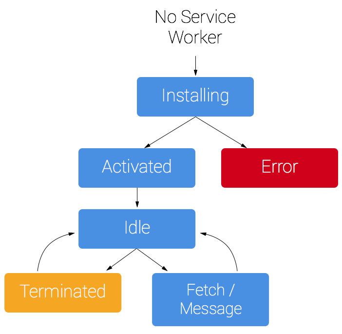
</p>

**Registration:**

To install a service worker, you need to register it in script. Registration informs the browser where your service worker is located and lets it know it can start installing in the background.

**Example:** Basic registration in your `index.html` could look like this

```js
// Check for browser support of service worker
if ('serviceWorker' in navigator) {
  navigator.serviceWorker.register('service-worker.js')

 .then(function(registration) {
   // Successful registration
   console.log('Registration successful, scope is:', registration.scope);

 }).catch(function(err) {
   // Failed registration, service worker won\'t be installed
   console.log('Service worker registration failed, error:', error);

 });
}
```

**Installation and activation:**

Service workers are event driven. The installation and activation processes fire off corresponding **install** and **activate** events to which the service workers can respond.

With the service worker registered, the first time a user hits your PWA, the install event will be triggered and this is where you\'ll want to cache the static assets for the page. 

<div align="right">
    <b><a href="#table-of-contents">↥ back to top</a></b>
</div>

## Q. What is the purpose of registerServiceWorker in React?

React creates a service worker for you without any configuration by default. The service worker is a web API that helps you cache your assets and other files so that when the user is offline or on slow network, user can still see results on the screen.

**Example:** Enable service worker in react

```js
/**
 * Register Service Worker
 */
import React from 'react';
import { createRoot } from 'react-dom/client';
import App from './App';
import * as serviceWorkerRegistration from './serviceWorkerRegistration';

const root = createRoot(document.getElementById('root'));
root.render(
  <React.StrictMode>
    <App />
  </React.StrictMode>
);

// Register the service worker for offline support and faster loads.
// Pass optional callbacks to handle lifecycle events:
serviceWorkerRegistration.register({
  onSuccess: (registration) => {
    console.log('Service Worker registered successfully:', registration.scope);
  },
  onUpdate: (registration) => {
    // Notify the user that a new version is available
    console.log('New content available; please refresh.', registration);
  },
});

// To opt out of service workers entirely, call unregister() instead:
serviceWorkerRegistration.unregister();
```

<div align="right">
    <b><a href="#table-of-contents">↥ back to top</a></b>
</div>

## Q. How Virtual-DOM is more efficient than Dirty checking?

<p align="center">
  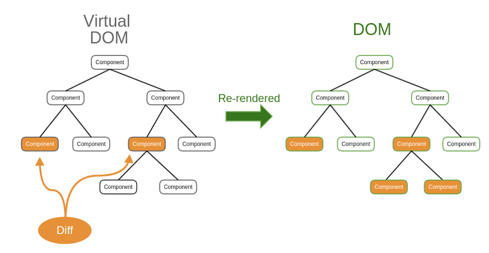
</p>

**React Virtual DOM:**  

In React, Each time the DOM updates or data of page changes, a new Virtual DOM representation of the user interface is made. It is just a lightweight copy or DOM.

Virtual DOM in React has almost same properties like a real DOM, but it can not directly change the content on the page. Working with Virtual DOM is faster as it does not update anything on the screen at the same time. In a simple way, Working with Virtual DOM is like working with a copy of real DOM nothing more than that.

Updating virtual DOM in ReactJS is faster because ReactJS uses

1. It is efficient diff algorithm.
1. It batched update operations
1. It efficient update of sub tree only
1. It uses observable instead of dirty checking to detect change

**How Virtual DOM works in React:**  

When we render a JSX element, each virtual DOM updates. This approach updates everything very quickly. Once the Virtual DOM updates, React matches the virtual DOM with a virtual DOM copy that was taken just before the update. By Matching the new virtual DOM with pre-updated version, React calculates exactly which virtual DOM has changed. This entire process is called **diffing**.

When React knows which virtual DOM has changed, then React updated those objects. and only those object, in the real DOM. React only updates the necessary parts of the DOM. React\'s reputation for performance comes largely from this innovation.

In brief, here is what happens when we update the DOM in React:

1. The entire virtual DOM gets updated.
1. The virtual DOM gets compared to what it looked like before you updated it. React matches out which objects have changed.
1. The changed objects and the changed objects only get updated on the real DOM.
1. Changes on the real DOM cause the screen to change finally.

<div align="right">
    <b><a href="#table-of-contents">↥ back to top</a></b>
</div>

## Q. What is the difference between DOM and virtual DOM?

**1. DOM:**

DOM stands for "Document Object Model". The HTML DOM provides an interface (API) to traverse and modify the nodes. It contains methods like `getElementById()` or `removeChild()`.

The DOM is represented as a tree data structure. Because of that, the changes and updates to the DOM are fast. But after the change, the updated element and it\'s children have to be re-rendered to update the application UI. The re-rendering or re-painting of the UI is what makes it slow.

**2. Virtual DOM:**  

The virtual DOM is only a virtual representation of the DOM. Every time the state of our application changes, the virtual DOM gets updated instead of the real DOM.

The Virtual DOM is an abstraction of the HTML DOM. It is lightweight and detached from the browser-specific implementation details. Since the DOM itself was already an abstraction, the virtual DOM is, in fact, an abstraction of an abstraction.

**Why Virtual DOM is faster:**

When new elements are added to the UI, a virtual DOM, which is represented as a tree is created. Each element is a node on this tree. If the state of any of these elements changes, a new virtual DOM tree is created. This tree is then compared or “diffed” with the previous virtual DOM tree.

Once this is done, the virtual DOM calculates the best possible method to make these changes to the real DOM. This ensures that there are minimal operations on the real DOM. Hence, reducing the performance cost of updating the real DOM.

**Pros of Virtual DOM:**  

* Updates process is optimized and accelerated.
* JSX makes components/blocks code readable.
* React data binding establishes conditions for creation dynamic applications.
* Virtual DOM is ideal for mobile first applications.
* Prompt rendering. Using comprises methods to minimize number of DOM operations helps to optimize updating process and accelerate it.

<p align="center">
  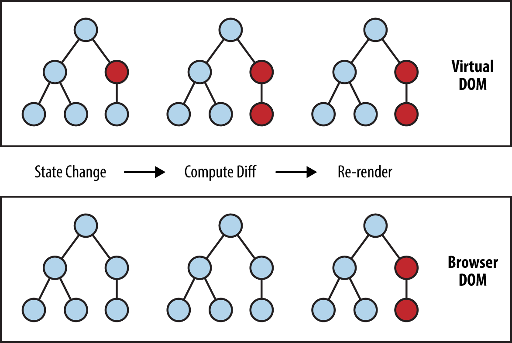
</p>

<div align="right">
    <b><a href="#table-of-contents">↥ back to top</a></b>
</div>

## Q. Explain DOM diffing?

Once the Virtual DOM is created, React compares this new representation with a snapshot of the previous version of the virtual DOM to see exactly which elements have changed.

Once the difference is known, React updates only those objects that differ on the actual DOM and the browser re-paints the screen. The next time state or props changes for a component in the application, a new virtual DOM tree of React elements will be created and the process will repeat.

The process of checking the difference between the new Virtual DOM tree and the old Virtual DOM tree is called **diffing**. Diffing is accomplished by a **heuristic O(n)** algorithm. During this process, React will deduce the minimum number of steps needed to update the real DOM, eliminating unnecessary costly changes. This process is also referred to as **reconciliation**.

React implements a heuristic O(n) algorithm based on two assumptions:

1. Two elements of different types will produce different trees.
1. The developer can hint at which child elements may be stable across different renders with a key prop."

<div align="right">
    <b><a href="#table-of-contents">↥ back to top</a></b>
</div>

## Q. How Diff Algorithm is implemented in React.js?

The main work of a **diff algorithm** is to find a heuristic to change anything from a state to another. When diffing two trees, React first compares the two root elements. The behavior is different depending on the types of the root elements.

**1. Elements Of Different Types:**

Whenever the root elements have different types, React will tear down the old tree and build the new tree from scratch.
When tearing down a tree, old DOM nodes are destroyed. Component instances receive `componentWillUnmount()`.

When building up a new tree, new DOM nodes are inserted into the DOM. Component instances receive `UNSAFE_componentWillMount()` and then `componentDidMount()`. Any state associated with the old tree is lost.

**2. DOM Elements Of The Same Type:**

When comparing two React DOM elements of the same type, React looks at the attributes of both, keeps the same underlying DOM node, and only updates the changed attributes.

**Example:** By comparing these two elements, React knows to only modify the `className` on the underlying DOM node.

```js
<div className="before" title="React JS" />

<div className="after" title="React JS" />
```

**3. Component Elements Of The Same Type:**

When a component updates, the instance stays the same, so that state is maintained across renders. React updates the props of the underlying component instance to match the new element, and calls `UNSAFE_componentWillReceiveProps()`, `UNSAFE_componentWillUpdate()` and `componentDidUpdate()` on the underlying instance.

**Recursing On Children:**

By default, when recursing on the children of a DOM node, React just iterates over both lists of children at the same time and generates a mutation whenever there\'s a difference.

For example, when adding an element at the end of the children, converting between these two trees works well:

```js
<ul>
  <li>first</li>
  <li>second</li>
</ul>

<ul>
  <li>first</li>
  <li>second</li>
  <li>third</li>
</ul>
```

React will match the two `<li>first</li>` trees, match the two `<li>second</li>` trees, and then insert the `<li>third</li>` tree.

**Keys:**

When children have keys, React uses the key to match children in the original tree with children in the subsequent tree. For example, adding a key to our inefficient example above can make the tree conversion efficient:

```js
<ul>
  <li key="2015">Duke</li>
  <li key="2016">Villanova</li>
</ul>

<ul>
  <li key="2014">Connecticut</li>
  <li key="2015">Duke</li>
  <li key="2016">Villanova</li>
</ul>
```

<div align="right">
    <b><a href="#table-of-contents">↥ back to top</a></b>
</div>

## Q. What is reconciliation in React?

Reconciliation is the process React uses to determine how to efficiently update the real browser DOM when a component\'s state or props change. Instead of rebuilding the entire UI from scratch, React compares a new representation of the interface with the previous one and applies only the necessary changes.

**How the Process Works**

* **Virtual DOM Creation**: When an update is triggered, React creates a new Virtual DOM (a lightweight, in-memory copy of the UI).
* **Diffing:** React uses a "diffing algorithm" to compare the new Virtual DOM tree with the old one.
* **Patching:** Once the differences are identified, React calculates the minimal set of operations needed to update the actual DOM and applies them in a single batch to ensure high performance.

**Key Rules of the Diffing Algorithm**

To keep the reconciliation process fast (complexity), React follows two primary heuristic assumptions: 

* **Elements of Different Types:** If the root elements of a subtree have different types (e.g., changing a `<div>` to a `<span>`), React will tear down the old tree, destroy its state, and build the new one from scratch.
* **Elements of the Same Type:** If elements are of the same type, React keeps the underlying DOM node and only updates the changed attributes or properties.
* **Keys for Lists:** For lists of elements, React uses the key prop to track which items have moved, been added, or removed, preventing unnecessary re-renders of stable items.

**Evolution: React Fiber**

Since React 16, the core reconciliation engine has been reimplemented as React Fiber. This modern architecture allows React to break rendering work into small units and pause, resume, or prioritize them, making complex UIs much more responsive by not blocking the main thread

<div align="right">
    <b><a href="#table-of-contents">↥ back to top</a></b>
</div>

## Q. What are portals in React?

Portals provide a quick and seamless way to render children into a DOM node that exists outside the DOM hierarchy of the parent component.

Normally, a functional or a class component renders a tree of React elements (usually generated from JSX). The React element defines how the DOM of the parent component should look.

**Syntax**:

```js
import { createPortal } from 'react-dom';

function MyPortal({ children }) {
  // Renders 'children' into the document body, 
  // away from this component physical DOM parent.
  return createPortal(children, document.body);
}
```

**Features:**

* It transports its children component into a new React portal which is appended by default to `document.body`.
* It can also target user specified DOM element.
* It supports server-side rendering
* It supports returning arrays (no wrapper div\'s needed)
* It uses `<Portal />` and `<PortalWithState />` so there is no compromise between flexibility and convenience.

**Installation:**

```bash
npm install react-portal --save
```

**Example:**

```js
/**
 * React Portal
 */
import PortalExample from "./PortalExample.js";

export default function App() {
  return (
    <div>
      <h2>React Component Example</h2>
      <PortalExample />
    </div>
  );
}


/**
 * Portal Component
 */
import { createPortal } from 'react-dom';

export default function PortalExample() {
  return createPortal(
    <h2>React Portal Example</h2>,
    document.getElementById("portal-root")
  );
}
```

Now, open the Index.html file and add a `<div id="portal-root"></div>` element to access the child component outside the root node.

```html
<!-- index.html -->

<!DOCTYPE html>  
<html lang="en">  
  <head>  
    <meta charset="utf-8" />  
    <link rel="shortcut icon" href="%PUBLIC_URL%/favicon.ico" />  
    <meta name="viewport" content="width=device-width, initial-scale=1" />  
    <meta name="theme-color" content="#000000" />  
    <link rel="manifest" href="%PUBLIC_URL%/manifest.json" />  
    <title>React App using Portal</title>  
  </head>  
  <body>  
    <noscript>It is required to enable JavaScript to run this app.</noscript>  
    <div id="root"></div>  
    <div id="portal-root"></div>  
  </body>  
</html>  
```

**&#9885; [Try this example on CodeSandbox](https://codesandbox.io/s/keen-clarke-y10jp2?file=/src/App.js)**

<div align="right">
    <b><a href="#table-of-contents">↥ back to top</a></b>
</div>

## Q. What is ReactDOMServer?

**ReactDOMServer** is an object that enables you to render React components to static HTML markup, typically used on a Node.js server for **Server-Side Rendering (SSR)**.

```js
// ES modules
import ReactDOMServer from 'react-dom/server'
// CommonJS
var ReactDOMServer = require('react-dom/server')
```

The **Server-side rendering (SSR)** is a popular technique for rendering a client-side single page application (SPA) on the server and then sending a fully rendered page to the client. This allows for dynamic components to be served as static HTML markup.

* It allows your site to have a faster first page load time, which is the key to a good user experience
* This approach can be useful for search engine optimization (SEO) when indexing does not handle JavaScript properly.
* It is great when people share a page of your site on social media, as they can easily gather the metadata needed to nicely share the link (images, title, description..)

**Example:**

**Creating an Express Server:**

```bash
npm install express
```

All the content inside the build folder is going to be served as-is, statically by Express.

```js
/**
 * server/server.js
 */
import path from 'path'
import fs from 'fs'

import express from 'express'
import React from 'react'
import ReactDOMServer from 'react-dom/server'

import App from '../src/App'

const PORT = 8080
const app = express()

const router = express.Router()

const serverRenderer = (req, res, next) => {
  fs.readFile(path.resolve('./build/index.html'), 'utf8', (err, data) => {
    if (err) {
      console.error(err)
      return res.status(500).send('An error occurred')
    }
    return res.send(
      data.replace(
        '<div id="root"></div>',
        `<div id="root">${ReactDOMServer.renderToString(<App />)}</div>`
      )
    )
  })
}
router.use('^/$', serverRenderer)

router.use(
  express.static(path.resolve(__dirname, '..', 'build'), { maxAge: '30d' })
)

// tell the app to use the above rules
app.use(router)

// app.use(express.static('./build'))
app.listen(PORT, () => {
  console.log(`SSR running on port ${PORT}`)
})
```

Now, in the client application, in your src/index.js, instead of calling `ReactDOM.render()`:

```js
ReactDOM.render(<App />, document.getElementById('root'))
```

call ReactDOM.hydrate(), which is the same but has the additional ability to attach event listeners to existing markup once React loads:

```js
ReactDOM.hydrate(<App />, document.getElementById('root'))
```

All the Node.js code needs to be transpiled by Babel, as server-side Node.js code does not know anything about JSX, nor ES Modules (which we use for the include statements).

**Babel Package:**

```bash
npm install @babel/register @babel/preset-env @babel/preset-react ignore-styles
```

Let\'s create an entry point in `server/index.js`:

```js
require('ignore-styles')

require('@babel/register')({
  ignore: [/(node_modules)/],
  presets: ['@babel/preset-env', '@babel/preset-react']
})

require('./server')
```

Build the React application, so that the build/ folder is populated and run this:

```bash
# Build App
npm run build

# Run App on Express
node server/index.js
```

<div align="right">
    <b><a href="#table-of-contents">↥ back to top</a></b>
</div>

## Q. How can automated tooling be used to improve the accessibility of a React application?

There are two main categories of automated tools that can be used to identify accessibility issues:

**1. Static Analysis Tools (Compile-time)**

Linting tools like `ESLint` with the `eslint-plugin-jsx-a11y` plugin analyze React projects at the component level — catching issues before code even runs.

Examples of issues it catches:

* Images missing `alt` attributes
* Form inputs missing associated `<label>` elements
* Interactive elements with no keyboard support
* Invalid ARIA roles or attributes

**2. Browser Tools (Runtime)**  

Browser accessibility tools such as `aXe` and `Google Lighthouse` perform automated accessibility at the app level. This can discover more real-world issues, because a browser is used to simulate the way that a user interacts with a website.

<div align="right">
    <b><a href="#table-of-contents">↥ back to top</a></b>
</div>

## Q. How to do SEO on react?

React applications are typically Single Page Applications (SPAs) that render content on the client-side, which can pose challenges for SEO since search engine crawlers may not execute JavaScript. Here are the main approaches to optimize React apps for SEO:

**1. Server-Side Rendering (SSR):**

SSR renders React components on the server and sends fully rendered HTML to the client. This ensures search engines can crawl and index your content.

Use **Next.js** to render pages on the server before sending HTML to the client:

```bash
npm install next react react-dom
```

```js
// pages/index.js
export default function Home({ data }) {
  return (
    <div>
      <h1>Welcome to SEO-Optimized React</h1>
      <p>{data.content}</p>
    </div>
  )
}

// This function runs on the server
export async function getServerSideProps() {
  const data = await fetchDataFromAPI()
  return {
    props: { data }
  }
}
```

**2. Static Site Generation (SSG):**

Pre-render pages at build time with `getStaticProps()` / `getStaticPaths()` — best for content that doesn\'t change frequently (blogs, docs).

```js
// pages/blog/[slug].js
export default function BlogPost({ post }) {
  return (
    <article>
      <h1>{post.title}</h1>
      <div>{post.content}</div>
    </article>
  )
}

export async function getStaticProps({ params }) {
  const post = await getPostBySlug(params.slug)
  return {
    props: { post }
  }
}

export async function getStaticPaths() {
  const posts = await getAllPosts()
  return {
    paths: posts.map(post => ({
      params: { slug: post.slug }
    })),
    fallback: false
  }
}
```

**3. Dynamic Meta Tags (React Helmet)**

Use `react-helmet-async` to set page-specific `<title>`, `<meta>` descriptions, and Open Graph tags per route.

```bash
npm install react-helmet-async
```

```js
import { Helmet } from 'react-helmet-async'

function ProductPage({ product }) {
  return (
    <>
      <Helmet>
        <title>{product.name} | My Store</title>
        <meta name="description" content={product.description} />
        <meta property="og:title" content={product.name} />
        <meta property="og:description" content={product.description} />
        <meta property="og:image" content={product.image} />
        <meta property="og:url" content={`https://mystore.com/products/${product.id}`} />
        <meta name="twitter:card" content="summary_large_image" />
        <link rel="canonical" href={`https://mystore.com/products/${product.id}`} />
      </Helmet>
      <div>
        <h1>{product.name}</h1>
        <p>{product.description}</p>
      </div>
    </>
  )
}
```

**4. Pre-rendering**

Use `react-snap` to generate static HTML snapshots at build time — a lighter alternative to full SSR.

```bash
npm install react-snap --save-dev
```

```json
// package.json
{
  "scripts": {
    "postbuild": "react-snap"
  },
  "reactSnap": {
    "inlineCss": true,
    "minifyHtml": true
  }
}
```

**5. Dynamic Rendering:**

Serve pre-rendered content to search engines while serving the SPA to users.

```js
// server.js (Express example)
const express = require('express')
const puppeteer = require('puppeteer')
const app = express()

app.get('*', async (req, res) => {
  const isBot = /bot|googlebot|crawler|spider|robot|crawling/i.test(
    req.headers['user-agent']
  )
  
  if (isBot) {
    // Serve pre-rendered content to bots
    const browser = await puppeteer.launch()
    const page = await browser.newPage()
    await page.goto(`http://localhost:3000${req.url}`)
    const html = await page.content()
    await browser.close()
    res.send(html)
  } else {
    // Serve SPA to regular users
    res.sendFile('index.html')
  }
})
```

<div align="right">
    <b><a href="#table-of-contents">↥ back to top</a></b>
</div>

## Q. Explain SEO Best Practices for React?

**1. Semantic HTML:**

Use proper HTML5 elements (`<article>`, `<header>`, `<section>`, etc.) instead of generic `<div>` tags. This helps crawlers understand your content structure.

```js
function Article({ title, content }) {
  return (
    <article>
      <header>
        <h1>{title}</h1>
      </header>
      <section>{content}</section>
    </article>
  )
}
```

**2. Structured Data (JSON-LD):**

Embed schema.org markup to help search engines understand entities like products, articles, and organizations.

```js
function ProductStructuredData({ product }) {
  const structuredData = {
    "@context": "https://schema.org/",
    "@type": "Product",
    "name": product.name,
    "image": product.image,
    "description": product.description,
    "brand": {
      "@type": "Brand",
      "name": product.brand
    },
    "offers": {
      "@type": "Offer",
      "price": product.price,
      "priceCurrency": "USD"
    }
  }

  return (
    <script
      type="application/ld+json"
      dangerouslySetInnerHTML={{ __html: JSON.stringify(structuredData) }}
    />
  )
}
```

**3. Image Optimization:**

Always include:

* Descriptive `alt` attributes (for accessibility + SEO)
* Explicit `width` and `height` (reduces Cumulative Layout Shift)
* `loading="lazy"` for below-the-fold images

```js
function OptimizedImage({ src, alt }) {
  return (
    
  )
}
```

**4. URL Structure:**

Use clean, descriptive paths instead of hash-based routing:

```js
// Good SEO-friendly URLs
<Link to="/blog/react-seo-guide">React SEO Guide</Link>

// Avoid hash-based routing
// Bad: /#/blog/react-seo-guide
```

**5. sitemap.xml and robots.txt:**

Place these in `/public`:

* **sitemap.xml** — lists all crawlable URLs with priority and last-modified date
* **robots.txt** — tells crawlers what to index; includes a reference to your sitemap

```xml
<!-- public/sitemap.xml -->
<?xml version="1.0" encoding="UTF-8"?>
<urlset xmlns="http://www.sitemaps.org/schemas/sitemap/0.9">
  <url>
    <loc>https://example.com/</loc>
    <lastmod>2026-02-03</lastmod>
    <priority>1.0</priority>
  </url>
  <url>
    <loc>https://example.com/about</loc>
    <lastmod>2026-02-03</lastmod>
    <priority>0.8</priority>
  </url>
</urlset>
```

```bash
# public/robots.txt
User-agent: *
Allow: /
Sitemap: https://example.com/sitemap.xml
```

<div align="right">
    <b><a href="#table-of-contents">↥ back to top</a></b>
</div>

## Q. Explain popular React SEO Tools?

**Popular React SEO Tools:**

* **Next.js** - React framework with built-in SSR/SSG
* **Gatsby** - Static site generator for React
* **React Helmet Async** - Manage document head
* **React Snap** - Pre-render SPA at build time
* **React Static** - Static site generator

**Reference:**

* *[Next.js Documentation](https://nextjs.org/docs)*
* *[Google Search Central - JavaScript SEO](https://developers.google.com/search/docs/crawling-indexing/javascript/javascript-seo-basics)*

<div align="right">
    <b><a href="#table-of-contents">↥ back to top</a></b>
</div>
