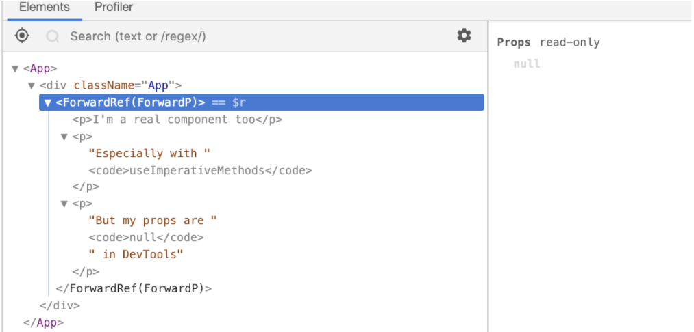

# Important React Interview Questions

<br/>

## Q. What is Destructuring in React?

Destructuring is a convenient way of accessing multiple properties stored in objects and arrays. It was introduced to JavaScript by ES6 and has provided developers with an increased amount of utility when accessing data properties in Objects or Arrays.

When used, destructuring does not modify an object or array but rather copies the desired items from those data structures into variables. These new variables can be accessed later on in a React component.

**Example:**

```js
/**
 * Destructuring in React
 */
import React from "react";

export default function App() {
  // Destructuring
  const [counter, setcounter] = React.useState(0);

  return (
    <>
      <button onClick={() => setcounter(counter + 1)}> Increment </button>
      <button onClick={() => setcounter(counter > 0 ? counter - 1 : 0)}>
        Decrement
      </button>

      <h2>Result: {counter}</h2>
    </>
  );
}
```

**&#9885; [Try this example on CodeSandbox](https://codesandbox.io/s/destructuring-in-react-6fxnbh?file=/src/App.js)**

<div align="right">
    <b><a href="#table-of-contents">↥ back to top</a></b>
</div>

## Q. How to add custom DOM attributes in JSX?

Custom attributes are supported natively in React 16. This means that adding a custom attribute to an element is now as simple as adding it to a render function, like so:

**Example:**

```js
// 1. Custom DOM Attribute
render() {
  return (
    <div custom-attribute="some-value" />
  );
}

// 2. Data Attribute ( starts with "data-" )
render() {
  return (
    <div data-id="10" />
  );
}

// 3. ARIA Attribute ( starts with "aria-" )
render() {
  return (
    <button aria-label="Close" onClick={onClose} />
  );
}
```

**&#9885; [Try this example on CodeSandbox](https://codesandbox.io/s/react-custom-attribute-8enl34?file=/src/App.js)**

<div align="right">
    <b><a href="#table-of-contents">↥ back to top</a></b>
</div>

## Q. How to use InnerHtml in React?

The **innerHTML** is risky because it is easy to expose users to a cross-site scripting (XSS) attack. React provides **dangerouslySetInnerHTML** as a replacement for innerHTML. It allows to set HTML directly from React by using `dangerouslySetInnerHTML` and passing an object with a `__html` key that holds HTML.

**Example:**

```js
function App() {
    return (
      <div
        dangerouslySetInnerHTML={{
          __html: "<h2>This text is set using dangerouslySetInnerHTML</h2>"
        }}
      ></div>
    );
  }
```

**&#9885; [Try this example on CodeSandbox](https://codesandbox.io/s/react-dangerouslysetinnerhtml-i4wqq?file=/src/App.js)**

<div align="right">
    <b><a href="#table-of-contents">↥ back to top</a></b>
</div>

## Q. What are React components?

Components are the building blocks of any React app and a typical React app will have many of these. Simply put, a component is a JavaScript class or function that optionally accepts inputs i.e. properties(`props`) and returns a React element that describes how a section of the UI (User Interface) should appear.

A React component can be either **stateful** or **stateless**. A stateful component is a component that holds some state. Stateless components, by contrast, have no state.

**1. Stateless Component:**

```js
import React from 'react'

const ExampleComponent = () => {
    return (<h1>Stateless Component</h1>)
}

export default class App extends React.Component {
  render() {
    return (
      <div>
        <ExampleComponent/>
      </div>
    )
  }
}
```

The above example shows a stateless component named ExampleComponent which is inserted in the `<App/>` component. The `ExampleComponent` just comprises of a `<h1>` element.

**2. Stateful Component:**

```js
import React from 'react'

class ExampleComponent extends React.Component {

  constructor(props) {
    super(props)
    this.state = {
      heading: "Stateful Component"
    }
  }
  render() {
    return (
        <div>
            <h1>{ this.props.welcomeMsg }</h1>
            <h2>{ this.state.heading }</h2>
        </div>
    )
  }
}

export default class App extends React.Component {
  render() {
    const welcomeMsg = "Welcome to React!"
    return (
      <div>
        <ExampleComponent welcomeMsg={welcomeMsg}/>
      </div>
    )
  }
}
```

The above example shows a stateful component named ExampleComponent which is inserted in the `<App/>` component. The `ExampleComponent` contains a `<h1>` and the `<h2>` element wrapped in a `<div>`. The `<h1>` displays data using props while the `<h2>` takes its data from the internal state of the ExampleComponent.

<div align="right">
    <b><a href="#table-of-contents">↥ back to top</a></b>
</div>

## Q. What is the difference between Component and Container in React?

The **presentational** components are concerned with the look, **container** components are concerned with making things work.

For example, this is a presentational component. It gets data from its props, and just focuses on showing an element

```js
/**
 * Presentational Component
 * 
 **/
const Users = props => (
  <ul>
    {props.users.map(user => (
      <li>{user}</li>
    ))}
  </ul>
)
```

On the other hand this is a container component. It manages and stores its own data, and uses the presentational component to display it.

```js
/**
 * Container Component
 * 
 **/
class UsersContainer extends React.Component {
  constructor() {
    this.state = {
      users: []
    }
  }

  componentDidMount() {
    axios.get('/users').then(users =>
      this.setState({ users: users }))
    )
  }

  render() {
    return <Users users={this.state.users} />
  }
}
```

<div align="right">
    <b><a href="#table-of-contents">↥ back to top</a></b>
</div>

## Q. How would you prevent a component from rendering?

React **shouldComponentUpdate()** is a performance optimization method, and it tells React to avoid re-rendering a component, even if state or prop values may have changed. This method only used when a component will stay static or pure.

The React `shouldComponentUpdate()` method return `true` if it needs to re-render or `false` to avoid being re-render.

**Syntax:**

```js
shouldComponentUpdate(nextProps, nextState){ }
```

**Example:**

```js
/**
 * Prevent a component from rendering
 */
export default class App extends React.Component {
  constructor() {
    super();
    this.state = {
      countOfClicks: 0
    };
    this.handleClick = this.handleClick.bind(this);
  }

  handleClick() {
    this.setState({
      countOfClicks: this.state.countOfClicks + 1
    });
  }

  shouldComponentUpdate(nextProps, nextState) {
    console.log("this.state.countOfClicks", this.state.countOfClicks);
    console.log("nextState.countOfClicks", nextState.countOfClicks);
    return true;
  }

  render() {
    return (
      <div>
        <h2>shouldComponentUpdate Example</h2>
        <p>Count of clicks: <b>{this.state.countOfClicks}</b></p>
        <button onClick={this.handleClick}>CLICK ME</button>
      </div>
    );
  }
}
```

**&#9885; [Try this example on CodeSandbox](https://codesandbox.io/s/react-shouldcomponentupdate-mryjv?file=/src/App.js)**

<div align="right">
    <b><a href="#table-of-contents">↥ back to top</a></b>
</div>

## Q. What is Compound Components in React?

A compound component is a type of component that manages the internal state of a feature while delegating control of the rendering to the place of implementation opposed to the point of declaration. They provide a way to shield feature specific logic from the rest of the app providing a clean and expressive API for consuming the component.

Internally they are built to operate on a set of data that is passed in through children instead of props. Behind the scenes they make use of React\'s lower level API such as `React.children.map()`, and `React.cloneElement()`. Using these methods, the component is able to express itself in such a way that promotes patterns of composition and extensibility.

**Example:**

```js
function App() {
  return (
    <Menu>
      <MenuButton>
        Actions <span aria-hidden>▾</span>
      </MenuButton>
      <MenuList>
        <MenuItem onSelect={() => alert('Download')}>Download</MenuItem>
        <MenuItem onSelect={() => alert('Copy')}>Create a Copy</MenuItem>
        <MenuItem onSelect={() => alert('Delete')}>Delete</MenuItem>
      </MenuList>
    </Menu>
  )
}
```

In this example, the `<Menu>` establishes some shared implicit state. The `<MenuButton>`, `<MenuList>`, and `<MenuItem>` components each access and/or manipulate that state, and it\'s all done implicitly. This allows you to have the expressive API you're looking for.

<div align="right">
    <b><a href="#table-of-contents">↥ back to top</a></b>
</div>

## Q. What is the recommended ordering of methods in class component?

* static methods
* constructor()
* getChildContext()
* componentWillMount()
* componentDidMount()
* componentWillReceiveProps()
* shouldComponentUpdate()
* componentWillUpdate()
* componentDidUpdate()
* componentWillUnmount()
* click handlers or event handlers like `onClickSubmit()` or `onChangeDescription()`
* getter methods for render like `getSelectReason()` or `getFooterContent()`
* optional render methods like `renderNavigation()` or `renderProfilePicture()`
* render()

<div align="right">
    <b><a href="#table-of-contents">↥ back to top</a></b>
</div>

## Q. How to create a dynamic table in react?

```js
/**
 * Generate dynamic table in React
 */
class Table extends React.Component {
   constructor(props) {
      super(props)
      this.state = {
         employees: [
            { id: 10, name: 'Swarna Sachdeva', email: 'swarna@email.com' },
            { id: 20, name: 'Sarvesh Date', email: 'sarvesh@email.com' },
            { id: 30, name: 'Diksha Meka', email: 'diksha@email.com' }
         ]
      }
   }

   renderTableHeader() {
      let header = Object.keys(this.state.employees[0])
      return header.map((key, index) => {
         return <th key={index}>{key.toUpperCase()}</th>
      })
   }

   renderTableData() {
      return this.state.employees.map((employee, index) => {
         const { id, name, age, email } = employee 
         return (
            <tr key={id}>
               <td>{id}</td>
               <td>{name}</td>
               <td>{email}</td>
            </tr>
         )
      })
   }

   render() {
      return (
         <div>
            <h1 id='title'>React Dynamic Table</h1>
            <table id='employees'>
               <tbody>
                  <tr>{this.renderTableHeader()}</tr>
                  {this.renderTableData()}
               </tbody>
            </table>
         </div>
      )
   }
}
```

**&#9885; [Try this example on CodeSandbox](https://codepen.io/learning-zone/pen/wvdeqBm?editors=0110)**

<div align="right">
    <b><a href="#table-of-contents">↥ back to top</a></b>
</div>

## Q. How do you set a timer to update every second?

Using `setInterval()` inside React components allows us to execute a function or some code at specific intervals. A function or block of code that is bound to an interval executes until it is stopped. To stop an interval, we can use the `clearInterval()` method.

**Example:**

```js
class Clock extends React.Component {
  constructor(props) {
    super(props)
    this.state = {
      time: new Date().toLocaleString()
    }
  }
  componentDidMount() {
    this.intervalID = setInterval(
      () => this.tick(),
      1000
    )
  }
  componentWillUnmount() {
    clearInterval(this.intervalID)
  }
  tick() {
    this.setState({
      time: new Date().toLocaleString()
    })
  }
  render() {
    return (
      <p className="App-clock">
        The time is {this.state.time}.
      </p>
    )
  }
}
```

<div align="right">
    <b><a href="#table-of-contents">↥ back to top</a></b>
</div>

## Q. What is the purpose of using super constructor with props argument?

The `super()` keyword is used to call the parent constructor. `super(props)` would pass `props` to the parent constructor.

```js
/**
 * super constructor
 */
class App extends React.Component {
  constructor(props) {
      super(props)
      this.state = {}
   }

  // React says we have to define render()
  render() {
    return <div>Hello world</div>
  }
}

export default App
```

Here, `super(props)` would call the `React.Component` constructor passing in props as the argument.

<div align="right">
    <b><a href="#table-of-contents">↥ back to top</a></b>
</div>

## Q. What does shouldComponentUpdate() do and why is it important?

The `shouldComponentUpdate()` method allows Component to exit the Update life cycle if there is no reason to apply a new render. React does not deeply compare `props` by default. When `props` or `state` is updated React assumes we need to re-render the content.

The default implementation of this function returns true so to stop the re-render you need to return false here:

```js
shouldComponentUpdate(nextProps, nextState) {
  console.log(nextProps, nextState)
  console.log(this.props, this.state)
  return false  
}
```

**Preventing unnecessary renders:**

The `shouldComponentUpdate()` method is the first real life cycle optimization method that we can leverage in React. It checks the current props and state, compares it to the next props and state and then returns true if they are different, or false if they are the same. This method is not called for the initial render or when `forceUpdate()` is used.

<div align="right">
    <b><a href="#table-of-contents">↥ back to top</a></b>
</div>

## Q. What is the purpose of render() function in React?

The React class components uses render() function. It is used to update the UI.

**Purpose of render():**

* React renders HTML to the web page by using a function called render().
* The purpose of the function is to display the specified HTML code inside the specified HTML element.
* In the render() method, we can read props and state and return our JSX code to the root component of our app.
* In the render() method, we cannot change the state, and we cannot cause side effects ( such as making an HTTP request to the webserver).

```js
/**
 * render() function
 * 
 * React v18.0.0
 */
import React from "react";
import { createRoot } from "react-dom/client";

class App extends React.Component {
  render() {
    return <h1>Render() Method Example</h1>;
  }
}

const container = document.getElementById("root");
const root = createRoot(container);
root.render(<App />);
```

**&#9885; [Try this example on CodeSandbox](https://codesandbox.io/s/react-render-l2q7qk?file=/src/index.js)**

<div align="right">
    <b><a href="#table-of-contents">↥ back to top</a></b>
</div>

## Q. What are the different phases of React component lifecycle?

React provides several methods that notify us when certain stage of this process occurs. These methods are called the component lifecycle methods and they are invoked in a predictable order. The lifecycle of the component is divided into four phases.

<p align="center">
  
</p>

**1. Mounting:**  

These methods are called in the following order when an instance of a component is being created and inserted into the DOM:

* `constructor()`
* `getDerivedStateFromProps()`
* `render()`
* `componentDidMount()`

**2. Updating:**  

The next phase in the lifecycle is when a component is updated. A component is updated whenever there is a change in the component\'s state or props.

React has five built-in methods that gets called, in this order, when a component is updated:

* `getDerivedStateFromProps()`
* `shouldComponentUpdate()`
* `render()`
* `getSnapshotBeforeUpdate()`
* `componentDidUpdate()`

**3. Unmounting:**  

The next phase in the lifecycle is when a component is removed from the DOM, or unmounting as React likes to call it.

* `componentWillUnmount()`

<div align="right">
    <b><a href="#table-of-contents">↥ back to top</a></b>
</div>

## Q. How to make component to perform an action only once when the component initially rendered?

**1. Using Class Component:**

The `componentDidMount()` lifecycle hook can be used with class components. Any actions defined within a `componentDidMount()` lifecycle hook are called only once when the component is first mounted.

**Example:**

```js
class Homepage extends React.Component {
  componentDidMount() {
    trackPageView('Homepage')
  }
  render() {
    return <div>Homepage</div>
  }
}
```

**2. Using Function Component:**

The `useEffect()` hook can be used with function components. The `useEffect()` hook is more flexible than the lifecycle methods used for class components. It receives two parameters:

* The first parameter it takes is a callback function to be executed.
* The optional second parameter it takes is an array containing any variables that are to be tracked.

The value passed as the second argument controls when the callback is executed:

* If the second parameter is **undefined**, the callback is executed every time that the component is rendered.
* If the second parameter contains an array of variables, then the callback will be executed as part of the first render cycle and will be executed again each time an item in the array is modified.
* If the second parameter contains an empty array, the callback will be executed only once as part of the first render cycle.

**Example:**

```js
const Homepage = () => {
  useEffect(() => {
    trackPageView('Homepage')
  }, [])
  
  return <div>Homepage</div>
}
```

<div align="right">
    <b><a href="#table-of-contents">↥ back to top</a></b>
</div>

## Q. What is difference between useEffect() vs componentDidMount()?

In react when we use class based components we get access to lifecycle methods ( like `componentDidMount()`, `componentDidUpdate(), etc ). But when we want use a functional component and also we want to use lifecycle methods, then using useEffect() we can implement those lifecycle methods.

**1. componentDidMount():**

The `componentDidMount()` and `useEffect()` run after the mount. However useEffect() runs after the paint has been committed to the screen as opposed to before. This means we would get a flicker if needed to read from the DOM, then synchronously set state to make new UI.

The `useLayoutEffect()` was designed to have the same timing as componentDidMount(). So `useLayoutEffect(fn, [])` is a much closer match to componentDidMount() than useEffect(fn, []) -- at least from a timing standpoint.

```js
/**
 * componentDidMount() in Class Component
 */
import React, { Component } from "react";

export default class SampleComponent extends Component {
  componentDidMount() {
    // code to run on component mount
  }
  render() {
    return <>componentDidMount Example</>;
  }
}
```

**2. useEffect():**

```js
/**
 * useEffect() in Functional Component
 */
import React, { useEffect } from "react";

const SampleComponent = () => {
  useEffect(() => {
    // code to run on component mount
  }, []);
  return <>useEffect Example</>;
};
export default SampleComponent;
```

When `useEffect()` is used to get data from server.

* The first argument is a callback that will be fired after browser layout and paint. Therefore it does not block the painting process of the browser.
* The second argument is an array of values (usually props).
* If any of the value in the array changes, the callback will be fired after every render.
* When it is not present, the callback will always be fired after every render.
* When it is an empty list, the callback will only be fired once, similar to componentDidMount.

<div align="right">
    <b><a href="#table-of-contents">↥ back to top</a></b>
</div>

## Q. What is difference between componentDidMount() and componentWillMount()?

**1. componentDidMount():**

The `componentDidMount()` is executed after the first render only on the client side. This is where AJAX requests and DOM or state updates should occur. This method is also used for integration with other JavaScript frameworks and any functions with delayed execution such as `setTimeout()` or `setInterval()`.

**Example:**

```js
import React, { Component } from 'react'

class App extends Component {

  constructor(props) {
    super(props)
    this.state = {
      data: 'Alex Belfort'
    }
  }

  getData(){
    setTimeout(() => {
      console.log('Our data is fetched')
      this.setState({
        data: 'Hello Alex'
      })
    }, 1000)
  }

  componentDidMount() {
    this.getData()
  }

  render() {
    return (
      <div>
        {this.state.data}
      </div>
    )
  }
}

export default App
```

**2. componentWillMount():**

The `componentWillMount()` method is executed before rendering, on both the server and the client side. `componentWillMount()` method is the least used lifecycle method and called before any HTML element is rendered. It is useful when we want to do something programatically right before the component mounts.

**Example:**

```js
import React, { Component } from 'react'

class App extends Component {

  constructor(props) {
    super(props)
    this.state = {
      data: 'Alex Belfort'
    }
  }
  componentWillMount() {
    console.log('First this called')
  }

  getData() {
    setTimeout(() => {
      console.log('Our data is fetched')
      this.setState({
        data: 'Hello Alex'
      })
    }, 1000)
  }

  componentDidMount() {
    this.getData()
  }

  render() {
    return (
      <div>
        {this.state.data}
      </div>
    )
  }
}

export default App
```

<div align="right">
    <b><a href="#table-of-contents">↥ back to top</a></b>
</div>

## Q. What are Pure Components in React?

**Pure Components** in React are the components which do not re-renders when the value of state and props has been updated with the same values. Pure Components restricts the re-rendering ensuring the higher performance of the Component.

**Features of React Pure Components:**

* Prevents re-rendering of Component if props or state is the same
* Takes care of `shouldComponentUpdate()` implicitly
* `State()` and `Props` are Shallow Compared
* Pure Components are more performant in certain cases

**Example:**

```js
/**
 * React Pure Component
 */
import React from "react";

export default class App extends React.PureComponent {
  constructor() {
    super();
    this.state = {
      userArray: [1, 2, 3, 4, 5]
    };
    // Here we are creating the new Array Object during setState using "Spread" Operator
    setInterval(() => {
      this.setState({
        userArray: [...this.state.userArray, 6]
      });
    }, 1000);
  }

  render() {
    return <b>Array Length is: {this.state.userArray.length}</b>;
  }
}
```

**&#9885; [Try this example on CodeSandbox](https://codesandbox.io/s/react-purecomponent-gpegf8?file=/src/App.js)**

<div align="right">
    <b><a href="#table-of-contents">↥ back to top</a></b>
</div>

## Q. What is Higher Order Components in React.js?

A **Higher-Order Component(HOC)** is a function that takes a component and returns a new component. It is the advanced technique in React.js for reusing a component logic.

<p align="center">
  
</p>

Higher-Order Components are not part of the React API. They are the pattern that emerges from React\'s compositional nature. The component transforms props into UI, and a higher-order component converts a component into another component. The examples of HOCs are Redux\'s connect and Relay\'s createContainer.

```js
// HOC.js

import React, { Component } from "react";

export default function Hoc(HocComponent) {
  return class extends Component {
    render() {
      return (
        <div>
          <HocComponent></HocComponent>
        </div>
      );
    }
  };
}
```

```js
// App.js

import React, { Component } from "react";
import Hoc from "./HOC";

export default class App extends Component {
  render() {
    return <h2>Higher Order Component!</h2>;
  }
}
App = Hoc(App);
```

*Notes:*

* We do not modify or mutate components. We create new ones.
* A HOC is used to compose components for code reuse.
* A HOC is a pure function. It has no side effects, returning only a new component.

**&#9885; [Try this example on CodeSandbox](https://codesandbox.io/s/react-hoc-3qrt5b?file=/src/App.js)**

<div align="right">
    <b><a href="#table-of-contents">↥ back to top</a></b>
</div>

## Q. What are Higher Order Component factory implementations?

Creating a higher order component basically involves manipulating WrappedComponent which can be done in two ways:

* Props Proxy
* Inheritance Inversion

Both enable different ways of manipulating the WrappedComponent.

**1. Props Proxy:**

In this approach, the render method of the HOC returns a React Element of the type of the WrappedComponent. We also pass through the props that the HOC receives, hence the name **Props Proxy**.

**Example:**

```js
function ppHOC(WrappedComponent) {
   return class PP extends React.Component {
     render() {
       return <WrappedComponent {...this.props}/>
     }
   }
}
```

Props Proxy can be implemented via a number of ways

* Manipulating props
* Accessing the instance via Refs
* Abstracting State
* Wrapping the WrappedComponent with other elements

**2. Inheritance Inversion:**

Inheritance Inversion allows the HOC to have access to the WrappedComponent instance via `this` keyword, which means it has access to the `state`, `props`, component lifecycle hooks and the `render` method.

**Example:**

```js
function iiHOC(WrappedComponent) {
   return class Enhancer extends WrappedComponent {
     render() {
       return super.render()
     }
   }
}
```

Inheritance Inversion can be used in:

* Conditional Rendering (Render Highjacking)
* State Manipulation

<div align="right">
    <b><a href="#table-of-contents">↥ back to top</a></b>
</div>

## Q. What is the purpose of displayName class property?

The **displayName** string is used in debugging messages. Usually, you don\'t need to set it explicitly because it\'s inferred from the name of the function or class that defines the component. You might want to set it explicitly if you want to display a different name for debugging purposes or when you create a higher-order component.

**Example:**

```js
function withSubscription(WrappedComponent) {
  
  class WithSubscription extends React.Component {/* ... */}
  
  WithSubscription.displayName = `WithSubscription(${getDisplayName(WrappedComponent)})`;
  return WithSubscription;
}

function getDisplayName(WrappedComponent) {
  return WrappedComponent.displayName || WrappedComponent.name || 'Component';
}
```

<div align="right">
    <b><a href="#table-of-contents">↥ back to top</a></b>
</div>

## Q. How to set up lazy loading components in React?

**1. REACT.LAZY():**

**React.lazy** is a function that lets you load components lazily through what is called code splitting without help from any external libraries. It makes possible for us to dynamically import components but they are rendered like regular components. This means that the bundle containing the component will only be loaded when the component is rendered.

React.lazy() takes a function that returns a promise as it\'s argument, the function returns a promise by calling import() to load the content. The returned Promise resolves to a module with a default containing the React Component.

```js
// Without Lazy
import MyComponent from './MyComponent';
 
// With Lazy
const MyComponent = React.lazy(() => import('./MyComponent'));
```

**2. SUSPENSE:**

**React.Suspense** is a component that can be used to wrap lazy components. A React.Suspense takes a fallback prop that can be any react element, it renders this prop as a placeholder to deliver a smooth experience and also give user feedback while the lazy component is being loaded.

```js
/**
 * Suspense
 */
import React, { Suspense } from 'react';

const MyComponent = React.lazy(() => import('./MyComponent'));

const App = () => {
  return (
    <div>
      <Suspense fallback={<div>Loading ... </div>}>
        <MyComponent />
      </Suspense>
    </div>
  );
}
```

**Example:**

```js
/**
 * React Lazy Loading Routes
 */
import React, { Suspense, lazy } from "react";
import { Switch, BrowserRouter as Router, Route, Link } from "react-router-dom";

const Home = lazy(() => import("./Home"));
const ContactUs = lazy(() => import("./ContactUs"));
const HelpPage = lazy(() => import("./Help"));

export default function App() {
  return (
      <Router>
        <ul>
          <li><Link to="/">Home</Link></li>
          <li><Link to="/contact-us">ContactUs</Link></li>
          <li><Link to="/help">HelpPage</Link></li>
        </ul>
        <hr />
        <Suspense fallback={<h1>Loading...</h1>}>
          <Switch>
            <Route exact component={Home} path="/" />
            <Route component={ContactUs} path="/contact-us" />
            <Route component={HelpPage} path="/help" />
          </Switch>
        </Suspense>
      </Router>
  );
}
```

**&#9885; [Try this example on CodeSandbox](https://codesandbox.io/s/react-lazy-loading-967o2?file=/src/App.js)**

<div align="right">
    <b><a href="#table-of-contents">↥ back to top</a></b>
</div>

## Q. What is props in React?

**Props** is a special keyword in React, which stands for properties and is being used for passing data from one component to another. However, callback functions can also be passed, which can be executed inside the child to initiate an update.

Props are **immutable** so we cannot modify the props from inside the component. These attributes are available in the class component as **this.props** and can be used to render dynamic data in our render method.

**Example:**

```js
function Welcome(props) {
  return <h1>Hello, {props.name}</h1>;
}

const element = <Welcome name="World!" />;
```

**&#9885; [Try this example on CodeSandbox](https://codesandbox.io/s/react-props-2k0081?file=/src/App.js)**

<div align="right">
    <b><a href="#table-of-contents">↥ back to top</a></b>
</div>

## Q. What are default props?

The defaultProps is a React component property that allows you to set default values for the props argument. If the prop property is passed, it will be changed.

The `defaultProps` can be defined as a property on the component class itself to set the default props for the class. `defaultProps` is used for **undefined** props, not for **null** props.

```js
/**
 * Default Props
 */
class MessageComponent extends React.Component {
   render() {
        return (
          <div>Hello, {this.props.value}.</div>
        )
    }
}

// Default Props
MessageComponent.defaultProps = {
  value: 'World'  
}

ReactDOM.render(
  <MessageComponent />, 
  document.getElementById('default')
)

ReactDOM.render(
  <MessageComponent value='Folks'/>, 
  document.getElementById('custom')
)
```

**&#9885; [Try this example on CodeSandbox](https://codepen.io/learning-zone/pen/oNWoNPm?editors=1010)**

<div align="right">
    <b><a href="#table-of-contents">↥ back to top</a></b>
</div>

## Q. How to apply validation on Props in React?

Props are an important mechanism for passing the **read-only** attributes to React components. React provides a way to validate the props using `PropTypes`. This is extremely useful to ensure that the components are used correctly.

**Example:**

```js
/**
 * Props Validation
 */
import React from "react";
import PropTypes from "prop-types";

export default class App extends React.Component {
  render() {
    return (
      <>
        <h3>Boolean: {this.props.propBool ? "True" : "False"}</h3>
        <h3>Array: {this.props.propArray}</h3>
        <h3>Number: {this.props.propNumber}</h3>
        <h3>String: {this.props.propString}</h3>
      </>
    );
  }
}

App.defaultProps = {
  propBool: true,
  propArray: [10, 20, 30],
  propNumber: 100,
  propString: "Hello React!"
};

App.propTypes = {
  propBool: PropTypes.bool.isRequired,
  propArray: PropTypes.array.isRequired,
  propNumber: PropTypes.number,
  propString: PropTypes.string
};
```

**&#9885; [Try this example on CodeSandbox](https://codesandbox.io/s/react-proptypes-41qmyz?file=/src/App.js)**

<div align="right">
    <b><a href="#table-of-contents">↥ back to top</a></b>
</div>

## Q. What are render props?

The term **render props** refers to a technique for sharing code between React components using a prop whose value is a function.

In simple words, render props are simply props of a component where you can pass functions. These functions need to return elements, which will be used in rendering the components.

**Example:**

```js
/**
 * Render Props
 */
import React from "react";
import Wrapper from "./Wrapper";

class App extends React.Component {
  render() {
    return (
      <Wrapper
        render={({ increment, count }) => (
          <div>
            <h3>Render Props Counter</h3>
            <p>{count}</p>
            <button onClick={() => increment()}>Increment</button> 
          </div>
        )}
      />
    );
  }
}
```

```js
/**
 * Wrapper Component
 */
class Wrapper extends React.Component {
  state = {
    count: 0
  };

  // Increase count
  increment = () => {
    const { count } = this.state;
    return this.setState({ count: count + 1 });
  };

  render() {
    const { count } = this.state;

    return (
      <div>
        {this.props.render({ increment: this.increment, count: count })}
      </div>
    );
  }
}
```

**&#9885; [Try this example on CodeSandbox](https://codesandbox.io/s/react-render-props-c80gs?file=/src/index.js)**

<div align="right">
    <b><a href="#table-of-contents">↥ back to top</a></b>
</div>

## Q. How do you create Higher Order Component using render props?

It is possible to implement most higher-order components (HOC) using a regular component with a render prop. This way render props gives the flexibility of using either pattern.

**Example:**

```js
function withMouse(Component) {
  return class extends React.Component {
    render() {
      return (
        <Mouse render={mouse => (
          <Component {...this.props} mouse={mouse} />
        )}/>
      );
    }
  }
}
```

<div align="right">
    <b><a href="#table-of-contents">↥ back to top</a></b>
</div>

## Q. What is children props?

The `{this.props.children}` is a special prop, automatically passed to every component, that can be used to render the content included between the opening and closing tags when invoking a component.

**Example:**

```js
/**
 * React Children Props
 */
class MyComponent extends React.Component {
  render() {
    return (
      <div>
        <h1>React Children Props Example</h1>
        {this.props.children}
      </div>
    );
  }
}

class OtherComponent extends React.Component {
  render() {
    return <div>Other Component Props</div>;
  }
}

ReactDOM.render(
  <MyComponent>
    <p>React DOM Props</p> {/* Children Props*/}
    <OtherComponent />
  </MyComponent>,
  document.getElementById("root")
);
```

**&#9885; [Try this example on CodeSandbox](https://codesandbox.io/s/react-children-props-952wx?file=/src/index.js)**

<div align="right">
    <b><a href="#table-of-contents">↥ back to top</a></b>
</div>

## Q. Why we need to be careful when spreading props on DOM elements?

When we spread props we run into the risk of adding unknown HTML attributes, which is a bad practice.

**Problem:** This will try to add the unknown HTML attribute `flag` to the DOM element.

```js
const Sample = () => (<Spread flag={true} className="content"/>);
const Spread = (props) => (<div {...props}>Test</div>);
```

**Solution:** By creating props specifically for DOM attribute, we can safely spread.

```js
const Sample = () => (<Spread flag={true} domProps={{className: "content"}}/>);
const Spread = (props) => (<div {...props.domProps}>Test</div>);
```

Or alternatively we can use prop destructuring with `...rest`:

```js
const Sample = () => (<Spread flag={true} className="content"/>);
const Spread = ({ flag, ...domProps }) => (<div {...domProps}>Test</div>);
```

**Note:**

*In scenarios where you use a PureComponent, when an update happens it re-renders the component even if domProps did not change. This is because PureComponent only shallowly compares the objects.*

<div align="right">
    <b><a href="#table-of-contents">↥ back to top</a></b>
</div>

## Q. When should I be using React.cloneElement vs this.props.children?

The `React.cloneElement` only works if your child is a single React element.

**Example:**

```js
<ReactCSSTransitionGroup
     component="div"
     transitionName="example"
     transitionEnterTimeout={500}
     transitionLeaveTimeout={500}
     >
     {React.cloneElement(this.props.children, {
       key: this.props.location.pathname
      })}
</ReactCSSTransitionGroup>
```

For almost everything `{this.props.children}` is used. Cloning is useful in some more advanced scenarios, where a parent sends in an element and the child component needs to change some props on that element or add things like `ref` for accessing the actual DOM element.

**Example:**

```js
class Users extends React.Component {
  render() {
    return (
      <div>
        <h2>Users</h2>
        {this.props.children}
      </div>
    )
  }
}
```

<div align="right">
    <b><a href="#table-of-contents">↥ back to top</a></b>
</div>

## Q. How to pass JSON Objects from Child to Parent Component?

**Example:** Passing JSON Objects from Child to Parent Component using callback function

```js
// Parent Component

export default class App extends React.Component {
  constructor() {
    super();
    this.state = {
      message: ""
    };
    this.onSubmitMessage = this.onSubmitMessage.bind(this);
  }

  onSubmitMessage(message) {
    this.setState({ message: message });
  }

  render() {
    const { message } = this.state;

    return (
      <div>
        <h3>Parent component</h3>
        <div>The message coming from the child component is : {message}</div>
        <hr />
        <Child
          // passing as callback function
          onSubmitMessage={this.onSubmitMessage}
        />
      </div>
    );
  }
}
```

```js
// Child Component

export default class Child extends React.Component {
  constructor() {
    super();
    this.state = {
      greetingMessag: ""
    };
    this.onMessageChange = this.onMessageChange.bind(this);
    this.onSubmit = this.onSubmit.bind(this);
  }

  onMessageChange(event) {
    let message = event.target.value;
    this.setState({ greetingMessag: message });
  }

  // pass message to parent component using callback
  onSubmit() {
    this.props.onSubmitMessage(this.state.greetingMessag);
  }

  render() {
    return (
      <div>
        <h3>Child Component</h3>
        <input
          type="text"
          onChange={this.onMessageChange}
          placeholder="Enter a message"
        />
        <button onClick={this.onSubmit}>Submit</button>
      </div>
    );
  }
}
```

**&#9885; [Try this example on CodeSandbox](https://codesandbox.io/s/react-callback-function-i2wv6?file=/src/App.js)**

<div align="right">
    <b><a href="#table-of-contents">↥ back to top</a></b>
</div>

## Q. What is the use of this props?

It is called spread operator (ES6 feature) and its aim is to make the passing of props easier.

**Example:**

```js
<div {...this.props}>
  Content Here
</div>
```

It is equal to Class Component

```js
const person = {
    name: "Alex",
    age: 26,
    country: "India"
}

class SpreadExample extends React.Component {
    render() {
      const {name, age, country} = {...this.props}
      return (
        <div>
            <h3> Person Information: </h3>
            <ul>
              <li>name={name}</li>
              <li>age={age}</li>
              <li>country={country}</li>
            </ul>
        </div>
      )
    }
}

ReactDOM.render(
    <SpreadExample {...person}/>
    , mountNode
)
```

<div align="right">
    <b><a href="#table-of-contents">↥ back to top</a></b>
</div>

## Q. What is the second argument that can optionally be passed to setState() and what is its purpose?

A **callback function** which will be invoked when `setState()` has finished and the component is re-rendered. The setState() is asynchronous, which is why it takes in a second callback function. Typically it\'s best to use another lifecycle method rather than relying on this callback function, but it is good to know it exists.

**Example:**

```js
this.setState(
  { username: 'Lila' },
  () => console.log('setState has finished and the component has re-rendered.')
)
```

The setState() will always lead to a re-render unless `shouldComponentUpdate()` returns **false**. To avoid unnecessary renders, calling setState() only when the new state differs from the previous state makes sense and can avoid calling setState() in an infinite loop within certain lifecycle methods like `componentDidUpdate()`.

<div align="right">
    <b><a href="#table-of-contents">↥ back to top</a></b>
</div>

## Q. How to delete an item from state array?

When using React, we should never mutate the state directly. If an object is changed, we should create a new copy. The better approach is to use `Array.prototype.filter()` method which creates a new array.

**Example:**

```js
onDeleteByIndex(index) {
  this.setState({
    users: this.state.users.filter((item, i) => i !== index)
  });
}
```

**&#9885; [Try this example on CodeSandbox](https://codepen.io/learning-zone/pen/vYmWvZE?editors=0010)**

<div align="right">
    <b><a href="#table-of-contents">↥ back to top</a></b>
</div>

## Q. How can you re-render a component without using setState() function?

React components automatically re-render whenever there is a change in their state or props. A simple update of the state, from anywhere in the code, causes all the User Interface (UI) elements to be re-rendered automatically.

However, there may be cases where the render() method depends on some other data. After the initial mounting of components, a re-render will occur.

**Using forceUpdate():**

The following example generates a random number whenever it loads. Upon clicking the button, the `forceUpdate()` function is called which causes a new, random ​number to be rendered:

```js
/**
 * forceUpdate()
 */
export default class App extends React.Component {
  constructor(){
    super();
    this.forceUpdateHandler = this.forceUpdateHandler.bind(this);
  };
  
  forceUpdateHandler(){
    this.forceUpdate();
  };
  
  render(){
    return(
      <div>
        <button onClick= {this.forceUpdateHandler} >FORCE UPDATE</button>
        <h4>Random Number : { Math.random() }</h4>
      </div>
    );
  }
}
```

**&#9885; [Try this example on CodeSandbox](https://codepen.io/learning-zone/pen/ZEKaqWN?editors=0010)**

*Note: We should try to avoid all uses of `forceUpdate()` and only read from `this.props` and `this.state` in render().*

<div align="right">
    <b><a href="#table-of-contents">↥ back to top</a></b>
</div>

## Q. Why we need to pass a function to setState()?

The reason behind for this is that `setState()` is an asynchronous operation. React batches state changes for performance reasons, so the state may not change immediately after `setState()` is called. That means we should not rely on the current state when calling `setState()`.

The solution is to **pass a function to setState()**, with the previous state as an argument. By doing this we can avoid issues with the user getting the old state value on access due to the asynchronous nature of `setState()`.

**Problem:**

```js
// assuming this.state.count === 0
this.setState({count: this.state.count + 1});
this.setState({count: this.state.count + 1});
this.setState({count: this.state.count + 1});
// this.state.count === 1, not 3
```

**&#9885; [Try this example on CodeSandbox](https://codepen.io/learning-zone/pen/jOmYEGG?editors=0010)**

**Solution:**

```js
this.setState((prevState) => ({
  count: prevState.count + 1
}));
this.setState((prevState) => ({
  count: prevState.count + 1
}));
this.setState((prevState) => ({
  count: prevState.count + 1
}));
// this.state.count === 3 as expected
```

**&#9885; [Try this example on CodeSandbox](https://codepen.io/learning-zone/pen/qBmpEoz?editors=0010)**

<div align="right">
    <b><a href="#table-of-contents">↥ back to top</a></b>
</div>

## Q. How to update nested state properties in React.js?

We can pass the old nested object using the spread operator and then override the particular properties of the nested object.

**Example:**

```js
// Nested object
state = {
  name: 'Vyasa Agarwal',
  address: {
    colony: 'Old Cross Rds, Mehdipatnam',
    city: 'Patna',
    state: 'Jharkhand'
  }
};
  
handleUpdate = () => {
  // Overriding the city property of address object
  this.setState({ address: { ...this.state.address, city: "Ranchi" } })
}
```

**&#9885; [Try this example on CodeSandbox](https://codepen.io/learning-zone/pen/VwbyYqv?editors=0010)**

<div align="right">
    <b><a href="#table-of-contents">↥ back to top</a></b>
</div>

## Q. How to set state with a dynamic key name?

If you are using ES6 or the Babel transpiler to transform your JSX code then you can accomplish this with *computed property* names.

```js
inputChangeHandler : function (event) {
  this.setState({ [event.target.id]: event.target.value });

  // alternatively using template strings for strings
  // this.setState({ [`key${event.target.id}`]: event.target.value });
}
```

**&#9885; [Try this example on CodeSandbox](https://codepen.io/learning-zone/pen/QWvayKp?editors=0010)**

<div align="right">
    <b><a href="#table-of-contents">↥ back to top</a></b>
</div>

## Q. How to listen state change in React.js?

The following lifecycle methods will be called when state changes. You can use the provided arguments and the current state to determine if something meaningful changed.

```js
componentWillUpdate(object nextProps, object nextState)
componentDidUpdate(object prevProps, object prevState)
```

In functional component, listen state changes with useEffect hook like this

```js
export function MyComponent(props) {
    const [myState, setMystate] = useState('initialState')

    useEffect(() => {
        console.log(myState, '- Has changed')
    },[myState]) // <-- here put the parameter to listen
}
```

<div align="right">
    <b><a href="#table-of-contents">↥ back to top</a></b>
</div>

## Q. How to access child\'s state in React?

**Using Refs:**

In React we can access the child\'s state using `React.createRef()`. We will assign a Refs for the child component in the parent component, then using Refs we can access the child\'s state.

```js
// App.js

class App extends React.Component {
  constructor(props) {
    super(props);
    this.ChildElement = React.createRef();
  }
  handleClick = () => {
    const childelement = this.ChildElement.current;
    childelement.getMsg("Message from Parent Component!");
  };
  render() {
    return (
      <div>
        <Child ref={this.ChildElement} />
        <button onClick={this.handleClick}>CLICK ME</button>
      </div>
    );
  }
}
```

```js
// Child.js

class Child extends React.Component {
  state = {
    name: "Message from Child Component!"
  };
  getMsg = (msg) => {
    this.setState({
      name: msg
    });
  };
  render() {
    return <h2>{this.state.name}</h2>;
  }
}
```

**&#9885; [Try this example on CodeSandbox](https://codesandbox.io/s/react-access-childs-state-n5uzr)**

<div align="right">
    <b><a href="#table-of-contents">↥ back to top</a></b>
</div>

## Q. How to change the state of a child component from its parent in React?

To change child component\'s state from parent component with React, we can pass props.

```js
/**
 * Change Child state from its Parent
 * @param {*} param0
 */
const Child = ({ open }) => {
  return <h2>Child State: {open.toString()}</h2>;
};

const Parent = () => {
  const [isOpen, setIsOpen] = React.useState(false);

  const toggleChild = () => {
    setIsOpen((prevValue) => !prevValue);
  };

  return (
    <div>
      <button onClick={toggleChild}>Click Me</button>
      {/* Pass a callback to Child */}
      <Child open={isOpen} />
    </div>
  );
};

export default Parent;
```

**&#9885; [Try this example on CodeSandbox](https://codesandbox.io/s/agitated-aryabhata-26wdz5?file=/src/App.js)**

<div align="right">
    <b><a href="#table-of-contents">↥ back to top</a></b>
</div>

## Q. How to pass a parameter to event handlers in React?

**Example:**

```js
const message = "Hey there!";
export default class App extends React.Component {
  displayMessage(message) {
    alert(message);
  }

  render() {
    return (
      <button onClick={() => this.displayMessage(message)}>CLICK ME</button>
    );
  }
}
```

**&#9885; [Try this example on CodeSandbox](https://codesandbox.io/s/react-event-handler-g2ugs?file=/src/App.js)**

<div align="right">
    <b><a href="#table-of-contents">↥ back to top</a></b>
</div>

## Q. How do you pass an event handler to a component?

**Example:**

```js
import React, {useState} from "react";
import "./styles.css";

export default function App() {
  return (
    <Container/>
  );
}

const Container = () => {
  const [counter, setCounter] = useState(0);
  
  const handleCustomClick = () => {
    setCounter(counter + 1)
  }

  return (
    <div>
      <div>Counter: {counter}</div>
      <CustomButton onCustomClick={handleCustomClick}/>
    </div>
  );
}

const CustomButton = ({onCustomClick}) => {
  return (
    <button onClick={onCustomClick}>
      My Custom Button
    </button>
  );
}
```

**&#9885; [Try this example on CodeSandbox](https://codesandbox.io/s/react-event-handler-ijru1?file=/src/App.js)**

<div align="right">
    <b><a href="#table-of-contents">↥ back to top</a></b>
</div>

## Q. How to bind methods or event handlers in JSX callbacks?

There are 3 possible ways to achieve this

**1. Event Handler in Render Method:**

We can bind the handler when it is called in the render method using `bind()` method.

```js
handleClick() {
  // ...       
}

<button onClick={this.handleClick.bind(this)}>Click</button> 
```

**&#9885; [Try this example on CodeSandbox](https://codepen.io/learning-zone/pen/jOmYGMp?editors=0010)**

**2. Event Handler using Arrow Function:**

In this approach we are binding the event handler implicitly. This approach is the best if you want to pass parameters to your event.

```js
handleClick() {
  // ...       
}

<button onClick={() => this.handleClick()}>Click</button> 
```

**&#9885; [Try this example on CodeSandbox](https://codepen.io/learning-zone/pen/QWvaqdB?editors=0010)**

**3. Event Handler in Constructor:**

This has performance benefits as the events aren\'t binding every time the method is called, as opposed to the previous two approaches.

```js
constructor(props) {

  // This binding is necessary to make `this` work in the callback
  this.handleClick = this.handleClick.bind(this);
}

handleClick() {
  // ...       
}

<button onClick={this.handleClick}>Click</button>
```

**&#9885; [Try this example on CodeSandbox](https://codepen.io/learning-zone/pen/zYwpEwO?editors=0010)**

<div align="right">
    <b><a href="#table-of-contents">↥ back to top</a></b>
</div>

## Q. When should we use arrow functions with React?

**Arrows prevent `this` bugs**

Arrow functions don not redefine the value of `this` within their function body. This makes it a lot easier to predict their behavior when passed as callbacks, and prevents bugs caused by use of this within callbacks. Using inline arrow functions in function components is a good way to achieve some decoupling.

**Example:**

```js
import React from 'react'
import ReactDOM from 'react-dom'

class Button extends React.Component {
  render() {
    return (
      <button onClick={this.handleClick} style={this.state}>
        Set background to red
      </button>
    )
  }

  handleClick = () => {
    this.setState({ backgroundColor: 'red' })
  }
}

ReactDOM.render(
  <Button />,
  document.getElementById('root')
)
```

1. When we use `this` it generates a new function on every render, which will obviously have a new reference.
2. If the component we pass this generated function to is extending `PureComponent()`, it will not be able to bail out on rerendering, even if the actual data has not changed.

<div align="right">
    <b><a href="#table-of-contents">↥ back to top</a></b>
</div>

## Q. How can I prevent a function from being called too quickly?

**1. Throttle:**

Throttling prevents a function from being called more than once in a given window of time.

**2. Debounce:**

Debouncing ensures that a function will not be executed until after a certain amount of time has passed since it was last called. This can be useful when you have to perform some expensive calculation in response to an event that might dispatch rapidly (eg scroll or keyboard events).

**Example:**

```js
/**
 * Throttle and Debounce in React
 */
import * as React from "react";
import * as _ from "lodash";

export default class App extends React.Component {
  state = { count: 0 };

  handleCount() {
    this.setState((state) => ({
      count: state.count + 1
    }));
  }

  // You will run count() only once after 100ms
  handleDebounce = _.debounce(() => this.handleCount(), 100);

  // You will run count() every 200ms
  handleThrottle = _.throttle(() => this.handleCount(), 200);

  render() {
    return (
      <div>
        {this.state.count}
        <hr />
        <button onClick={this.handleThrottle}>Click Me - Throttle </button>
        <button onClick={this.handleDebounce}>Click Me - Debounce </button>
      </div>
    );
  }
}
```

**&#9885; [Try this example on CodeSandbox](https://codesandbox.io/s/react-throttle-debounce-doch91?file=/src/App.js)**

**3. RequestAnimationFrame Throttling:**

The **requestAnimationFrame** is a way of queuing a function to be executed in the browser at the optimal time for rendering performance. A function that is queued with requestAnimationFrame will fire in the next frame. The browser will work hard to ensure that there are 60 frames per second (60 fps). However, if the browser is unable to it will naturally limit the amount of frames in a second.

For example, a device might only be able to handle 30 fps and so you will only get 30 frames in that second. Using requestAnimationFrame for throttling is a useful technique in that it prevents you from doing more than 60 updates in a second. If you are doing 100 updates in a second this creates additional work for the browser that the user will not see anyway.

```js
/**
 * RequestAnimationFrame Throttling
 */
import rafSchedule from "raf-schd";
import React from "react";

export default class App extends React.Component {
  constructor(props) {
    super(props);

    this.handleScroll = this.handleScroll.bind(this);

    // Create a new function to schedule updates.
    this.scheduleUpdate = rafSchedule((point) => this.props.onScroll(point));
  }

  handleScroll(e) {
    // When we receive a scroll event, schedule an update.
    // If we receive many updates within a frame, we'll only publish the latest value.
    this.scheduleUpdate({ x: e.clientX, y: e.clientY });
  }

  componentWillUnmount() {
    // Cancel any pending updates since we're unmounting.
    this.scheduleUpdate.cancel();
  }

  render() {
    return (
      <div style={{ overflow: "scroll" }} onScroll={this.handleScroll}>
        
      </div>
    );
  }
}
```

**&#9885; [Try this example on CodeSandbox](https://codesandbox.io/s/react-requestanimationframe-usiqg9?file=/src/App.js)**

<div align="right">
    <b><a href="#table-of-contents">↥ back to top</a></b>
</div>

## Q. Explain synthetic event in React js?

Inside React event handlers, the event object is wrapped in a `SyntheticEvent` object. These objects are pooled, which means that the objects received at an event handler will be reused for other events to increase performance. This also means that accessing the event object\'s properties asynchronously will be impossible since the event\'s properties have been reset due to reuse.

The following piece of code will log null because event has been reused inside the SyntheticEvent pool:

```js
function handleClick(event) {
  setTimeout(function () {
    console.log(event.target.name)
  }, 1000)
}
```

To avoid this we need to store the event\'s property:

```js
function handleClick(event) {
  let name = event.target.name
  setTimeout(function () {
    console.log(name)
  }, 1000)
}
```

**SyntheticEvent Object:**

```js
void preventDefault()
void stopPropagation()
boolean isPropagationStopped()
boolean isDefaultPrevented()
void persist()
boolean bubbles
boolean cancelable
DOMEventTarget currentTarget
boolean defaultPrevented
number eventPhase
boolean isTrusted
DOMEvent nativeEvent
DOMEventTarget target
number timeStamp
string type
```

<div align="right">
    <b><a href="#table-of-contents">↥ back to top</a></b>
</div>

## Q. What is Event Pooling in React?

The `SyntheticEvent` is pooled. This means that the SyntheticEvent object will be reused and all properties will be nullified after the event callback has been invoked. This is for performance reasons. As such, you cannot access the event in an `asynchronous` way.

**Example:**

```js
function onClick(event) {
  console.log(event) // => nullified object.
  console.log(event.type) // => "click"
  const eventType = event.type // => "click"

  setTimeout(function() {
    console.log(event.type) // => null
    console.log(eventType) // => "click"
  }, 0)

  // Won't work. this.state.clickEvent will only contain null values.
  this.setState({clickEvent: event})

  // You can still export event properties.
  this.setState({eventType: event.type})
}
```

If we want to access the event properties in an asynchronous way, we should call `event.persist()` on the event, which will remove the synthetic event from the pool and allow references to the event to be retained by user code.

<div align="right">
    <b><a href="#table-of-contents">↥ back to top</a></b>
</div>

## Q. How to trigger click event programmatically?

We can use `ref` prop to acquire a reference to the underlying `HTMLInputElement` object through a callback, store the reference as a class property, then use that reference to later trigger a click from your event handlers using the `HTMLElement.click` method.

**Example:**

```js
class MyComponent extends React.Component {

  render() {
    return (
      <div onClick={this.handleClick}>
        <input ref={input => this.inputElement = input} />
      </div>
    )
  }

  handleClick = (e) => {
    this.inputElement.click()
  }
}
```

*Note: The `ES6 arrow function` provides the correct lexical scope for `this` in the callback.*

<div align="right">
    <b><a href="#table-of-contents">↥ back to top</a></b>
</div>

## Q. How to listen for click events that are outside of a component?

**Example:**

```js
class OutsideAlerter extends Component {
  // ...
  componentDidMount() {
    document.addEventListener("mousedown", this.handleClickOutside);
  }

  componentWillUnmount() {
    document.removeEventListener("mousedown", this.handleClickOutside);
  }

  /**
   * Set the wrapper ref
   */
  setWrapperRef(node) {
    this.wrapperRef = node;
  }

  /**
   * Alert if clicked on outside of element
   */
  handleClickOutside(event) {
    if (this.wrapperRef && !this.wrapperRef.contains(event.target)) {
      alert("You clicked outside of me!");
    }
  }

  render() {
    return <div ref={this.setWrapperRef}>{this.props.children}</div>;
  }
}

OutsideAlerter.propTypes = {
  children: PropTypes.element.isRequired
};

```

**&#9885; [Try this example on CodeSandbox](https://codesandbox.io/s/react-click-event-jdf3f?file=/src/App.js)**

<div align="right">
    <b><a href="#table-of-contents">↥ back to top</a></b>
</div>

## Q. How to convert text to uppercase on user input entered?

```js
import React, { useState } from "react"
import ReactDOM from "react-dom"

const toInputUppercase = e => {
  e.target.value = ("" + e.target.value).toUpperCase()
}

const App = () => {
  const [name, setName] = useState("")

  return (
    <input
      name={name}
      onChange={e => setName(e.target.value)}
      onInput={toInputUppercase} // apply on input which do you want to be capitalize
    />
  )
}

ReactDOM.render(<App />, document.getElementById("root"))
```

<div align="right">
    <b><a href="#table-of-contents">↥ back to top</a></b>
</div>

## Q. How to set a dynamic key for state?

**1. Dynamic Key:**

```js
onChange(e) {
  const key = e.target.name
  const value = e.target.value
  this.setState({ [key]: value })
}
```

**2. Nested States:**

```js
handleSetState(cat, key, val) {
  const category = {...this.state[cat]}
  category[key] = val
  this.setState({ [cat]: category })
}
```

<div align="right">
    <b><a href="#table-of-contents">↥ back to top</a></b>
</div>

## Q. Explain the Lists in React?

Using JSX we can show lists using JavaScript\'s built-in `Array.map()` method. The `.map()` method is often used to take one piece of data and convert it to another.

Keys are unique identifiers that must be attached to the top-level element inside a map. Keys are used by React to know how to update a list whether adding, updating, or deleting items. This is part of how React is so fast with large lists.

**Example:**

```js
/**
 * React List
 */
export default class App extends Component {
  state = {
    lists: [
      { id: 0, context: "Success" },
      { id: 1, context: "Warning" },
      { id: 2, context: "Danger" }
    ]
  };

  render() {
    return (
      <>
        <h2>React List</h2>
        <ul className="list-group">
          {this.state.lists.map((list) => (
            <li key={list.id}>{list.context}</li>
          ))}
        </ul>
      </>
    );
  }
}
```

**&#9885; [Try this example on CodeSandbox](https://codesandbox.io/s/react-list-h3wvmz?file=/src/App.js)**

<div align="right">
    <b><a href="#table-of-contents">↥ back to top</a></b>
</div>

## Q. How do you render Array, Strings and Numbers in React?

```js
/**
 * Array Component
 */
const items = [
  { name: "AngularJS", description: "" },
  { name: "React", description: "" },
  { name: "Vue.js", description: "" }
];
const ArrayList = (props) => (
  <div>
    <h2>Render Array List</h2>
    {items.map((item, index) => (
      <div key={index}>{item.name}</div>
    ))}
  </div>
);


/**
 * String Component
 */
const StringList = (props) => (
  <div>
    <h2>Render String List</h2>
    {["test", "render", "array", "list"]}
  </div>
);


/**
 * Number Component
 */
const numbers = [10, 20, 30];
const NumberList = (props) => (
  <div>
    <h2>Render Number List</h2>
    {numbers.map((item, index) => (
      <div key={index}>{item}</div>
    ))}
  </div>
);
```

**&#9885; [Try this example on CodeSandbox](https://codesandbox.io/s/react-array-list-uxl6n?file=/src/index.js)**

<div align="right">
    <b><a href="#table-of-contents">↥ back to top</a></b>
</div>

## Q. How to make a API calls in React?

Consuming REST APIs in a React Application can be done in various ways. Some popular are Axios, fetch etc.

**Example:**

```js
/**
 * API call using fetch()
 */
export default class App extends React.Component {
  constructor(props) {
    super(props);
    this.state = {
      users: []
    };
  }

  componentDidMount() {
    fetch("https://api.github.com/users")
      .then((res) => res.json())
      .then((result) => {
        this.setState({ users: result });
      });
  }

  render() {
    const { users } = this.state;
    return (
      <ul>
        {users.map((user) => (
          <li key={user.id}>
            
          </li>
        ))}
      </ul>
    );
  }
}
```

**&#9885; [Try this example on CodeSandbox](https://codesandbox.io/s/react-api-call-llvlbj?file=/src/App.js)**

<div align="right">
    <b><a href="#table-of-contents">↥ back to top</a></b>
</div>

## Q. How to display API data using Axios in React?

Axios is a promise based HTTP client for making HTTP requests from a browser to any web server.

**Example:**

```js
/**
 * GET Request using Axios
 */
import React, { useEffect, useState } from "react";
import axios from "axios";

export default function App() {
  const [users, setUsers] = useState([]);

  const fetchData = () => {
    axios.get("https://jsonplaceholder.typicode.com/users").then((response) => {
      setUsers(response.data);
    });
  };

  useEffect(() => {
    fetchData();
  }, []);

  return (
    <div>
      {users.length > 0 && (
        <ul>
          {users.map((user) => (
            <li key={user.id}>{user.name}</li>
          ))}
        </ul>
      )}
    </div>
  );
}
```

**&#9885; [Try this example on CodeSandbox](https://codesandbox.io/s/react-axios-7bhnjt?file=/src/App.js)**

<div align="right">
    <b><a href="#table-of-contents">↥ back to top</a></b>
</div>

## Q. How does Axios Interceptors work in React?

Axios interceptors are the default configurations that are added automatically to every request or response that a user receives. It is useful to check response status code for every response that is being received.

Interceptors are methods which are triggered before or after the main method. There are two types of interceptors:

**1. Request Interceptor:**

This is called before the actual call to the endpoint is made. One common use case for a request handler is to modify or add new HTTP headers. For example, an authentication token could be injected into all requests.

**Example:**

```js
// Request Handler
const requestHandler = (request) => {
  const token = localStorageService.getAccessToken()
  if (token) {
    request.headers['Authorization'] = 'Bearer ' + token
  }
  return request
}

// Request Interceptor
axios.interceptors.request.use(
  request => requestHandler(request)
)
```

**2. Response and error Interceptor:**

This is called before the promise is completed and the data is received by the then callback.

**Example:**

```js
// Response Handlers
const errorHandler = (error) => {
  if (isHandlerEnabled(error.config)) {
    // Handle errors
  }
  return Promise.reject({ ...error })
}

const successHandler = (response) => {
  if (isHandlerEnabled(response.config)) {
    // Handle responses
  }
  return response
}

// Response Interceptors
axios.interceptors.response.use(
  response => successHandler(response),
  error => errorHandler(error)
)
```

<div align="right">
    <b><a href="#table-of-contents">↥ back to top</a></b>
</div>

## Q. How to do caching in React?

In React, caching data can be achieved in multiple ways

* Local Storage
* Redux Store
* Keep data between mouting and unmounting
* useMemo()

**1. Memoizing Fetched Data:**

Memoization is a technique we would use to make sure that we don\'t hit the API if we have made some kind of request to fetch it at some initial phase. Storing the result of expensive fetch calls will save the users some load time, therefore, increasing overall performance.

**Example:**

```js
const cache = {}

const useFetch = (url) => {
  const [status, setStatus] = useState('idle')
  const [data, setData] = useState([])

  useEffect(() => {
    if (!url) return

    const fetchData = async () => {
      setStatus('fetching')

      if (cache[url]) {
        const data = cache[url]
        setData(data)
        setStatus('fetched')
      } else {
        const response = await fetch(url)
        const data = await response.json()
        cache[url] = data // set response in cache
        setData(data)
        setStatus('fetched')
      }
    }

    fetchData()
  }, [url])

  return { status, data }
}
```

Here, we\'re mapping URLs to their data. So, if we make a request to fetch some existing data, we set the data from our local cache, else, we go ahead to make the request and set the result in the cache. This ensures we do not make an API call when we have the data available to us locally.

**2. Memoizing Data With useRef():**

With `useRef()`, we can set and retrieve mutable values at ease and its value persists throughout the component\'s lifecycle.

```js
const useFetch = (url) => {
  const cache = useRef({})
  const [status, setStatus] = useState('idle')
  const [data, setData] = useState([])

  useEffect(() => {
    if (!url) return

    const fetchData = async () => {
      setStatus('fetching')

      if (cache.current[url]) {
        const data = cache.current[url]
        setData(data)
        setStatus('fetched')
      } else {
        const response = await fetch(url)
        const data = await response.json()
        cache.current[url] = data // set response in cache
        setData(data)
        setStatus('fetched')
      }
    }

    fetchData()
  }, [url])

  return { status, data }
}
```

**3. Using localStorage():**

```js
const InitialState = {
   someState: 'a'
}
class App extends Component {

 constructor(props) {
  super(props)

  // Retrieve the last state
  this.state = localStorage.getItem("appState") ? JSON.parse(localStorage.getItem("appState")) : InitialState

}

componentWillUnmount() {
  // Remember state for the next mount
  localStorage.setItem('appState', JSON.stringify(this.state))
}

render() {
  ...
 }
}

export default App
```

**4. Keep data between Mouting and Unmounting:**

```js
import React, { Component } from 'react'

// Set initial state
let state = { counter: 5 }

class Counter extends Component {

 constructor(props) {
  super(props)

  // Retrieve the last state
  this.state = state

  this.onClick = this.onClick.bind(this)
}

componentWillUnmount() {
  // Remember state for the next mount
  state = this.state
}

onClick(e) {
  e.preventDefault()
  this.setState(prev => ({ counter: prev.counter + 1 }))
}

render() {
  return (
    <div>
      <span>{ this.state.counter }</span>
      <button onClick={this.onClick}>Increase</button>
    </div>
  )
 }
}

export default Counter
```

<div align="right">
    <b><a href="#table-of-contents">↥ back to top</a></b>
</div>

## Q. How to use async await in React?

**Example:**

```js

class App extends Component {
  // ...
  async componentDidMount() {
    try {
      const response = await fetch(`https://api.github.com/users`);

      if (!response.ok) {
        throw Error(response.statusText);
      } else {
        const json = await response.json();
        this.setState({ data: json });
      }
    } catch (error) {
      console.log(error);
    }
  }

  render() {
    return (
      <div>
        <ul>
          {this.state.data.map((el) => (
            <li key={el.id}>
              
              <span className="UserLogin">{el.login}</span>
            </li>
          ))}
        </ul>
      </div>
    );
  }
}
```

**&#9885; [Try this example on CodeSandbox](https://codesandbox.io/s/react-async-await-7mu7t?file=/src/App.js)**

<div align="right">
    <b><a href="#table-of-contents">↥ back to top</a></b>
</div>

## Q. How dynamically generate menu options for `<select>` from an array?

**Example:**

```js
class App extends React.Component {

  constructor(props) {
    super(props);
    this.state = {
      colors: {}
    };
    this.selectColor = this.selectColor.bind(this);
  }

  selectColor = (e) => {
    console.log("Selected Color: ", e.target.value);
  };

  componentDidMount() {
    this.setState({
      colors: {
        "#ff0000": "Red",
        "#00ff00": "Green",
        "#0000ff": "Blue"
      }
    });
  }

  render() {
    const { colors } = this.state;

    let colorsList = Object.keys(colors).map((k) => {
      return (
        <option key={k} value={k}>
          {colors[k]}
        </option>
      );
    }, this);

    return (
      <div>
        <select onChange={this.selectColor}>{colorsList}</select>
      </div>
    );
  }
}
```

**&#9885; [Try this example on CodeSandbox](https://codesandbox.io/s/react-select-dropdown-1oz9f?file=/src/App.js)**

<div align="right">
    <b><a href="#table-of-contents">↥ back to top</a></b>
</div>

## Q. How would you create a form in React?

**Example:**

```js
import React from "react";
import "./styles.css";

const countries = ["Austria", "India", "Italy", "Russia", "United States"];

export default function App() {
  const [email, setEmail] = React.useState("");
  const [password, setPassword] = React.useState("");
  const [country, setCountry] = React.useState("");
  const [acceptedTerms, setAcceptedTerms] = React.useState(false);

  const handleSubmit = (event) => {
    console.log(`
      Email: ${email}
      Password: ${password}
      Country: ${country}
      Accepted Terms: ${acceptedTerms}
    `);
    event.preventDefault();
  };

  return (
    <form onSubmit={handleSubmit}>
      <h1>Create Account</h1>

      <label>Email:
        <input name="email" type="email" value={email}
          onChange={(e) => setEmail(e.target.value)}
          required
        />
      </label>

      <label>Password:
        <input name="password" type="password" value={password}
          onChange={(e) => setPassword(e.target.value)}
          required
        />
      </label>

      <label>Country:
        <select name="country" value={country}
          onChange={(e) => setCountry(e.target.value)}
          required
        >
          <option key=""></option>
          {countries.map((country) => (
            <option key={country}>{country}</option>
          ))}
        </select>
      </label>

      <label><input name="acceptedTerms" type="checkbox"
          onChange={(e) => setAcceptedTerms(e.target.value)}
          required
        />
        I accept the terms of service
      </label>

      <button>Submit</button>
    </form>
  );
}
```

**Output:**

<p align="center">
  
</p>

**&#9885; [Try this example on CodeSandbox](https://codesandbox.io/s/react-form-p9z2y)**

<div align="right">
    <b><a href="#table-of-contents">↥ back to top</a></b>
</div>

## Q. What are controlled and uncontrolled components in React?

In a controlled component, form data is handled by a React component. The alternative is uncontrolled components, where form data is handled by the DOM itself.

**1. Controlled Components:**  

In a controlled component, the form data is handled by the state within the component. The state within the component serves as “the single source of truth” for the input elements that are rendered by the component.

**Example:**

```js
/**
 * Controlled Components
 */
import React, { Component } from "react";

export default class App extends Component {
  state = {
    message: ""
  };
  updateMessage = (newText) => {
    console.log(newText);
    this.setState(() => ({
      message: newText
    }));
  };
  render() {
    return (
      <div className="App">
        <div className="container">
          <input
            type="text"
            placeholder="Your message here.."
            value={this.state.message}
            onChange={(event) => this.updateMessage(event.target.value)}
          />
          <h3>Message: {this.state.message}</h3>
        </div>
      </div>
    );
  }
}
```

**&#9885; [Try this example on CodeSandbox](https://codesandbox.io/s/react-controlled-components-1ilt72?file=/src/App.js)**

**2. Uncontrolled Components:**  

Uncontrolled components act more like traditional HTML form elements. The data for each input element is stored in the DOM, not in the component. Instead of writing an event handler for all of your state updates, It uses `ref` to retrieve values from the DOM. `Refs` provide a way to access DOM nodes or React elements created in the render method.

```js
/**
 * Uncontrolled Component
 */
import React, { Component } from "react";

export default class App extends Component {
  constructor(props) {
    super(props);
    this.handleChange = this.handleChange.bind(this);
    this.input = React.createRef();
  }
  handleChange = (newText) => {
    console.log(newText);
  };
  render() {
    return (
      <div className="App">
        <div className="container">
          <input
            type="text"
            placeholder="Your message here.."
            ref={this.input}
            onChange={(event) => this.handleChange(event.target.value)}
          />
        </div>
      </div>
    );
  }
}
```

**&#9885; [Try this example on CodeSandbox](https://codesandbox.io/s/react-uncontrolled-component-4o7lw7?file=/src/App.js)**

<div align="right">
    <b><a href="#table-of-contents">↥ back to top</a></b>
</div>

## Q. How do you set default value for uncontrolled components?

React provides **defaultValue** attribute that pre-populate the input field with the default Value without overriding any value input by the user.

**Example:**

```js
/**
 * React defaultValue
 */
render() {
  return (
    <form onSubmit={this.handleSubmit}>
      <label>
        Name:
        <input
          defaultValue="Samir Chahal"
          type="text"
          ref={this.input} />
      </label>
      <input type="submit" value="Submit" />
    </form>
  );
}
```

**&#9885; [Try this example on CodeSandbox](https://codesandbox.io/s/react-form-qmx9s?file=/src/App.js)**

<div align="right">
    <b><a href="#table-of-contents">↥ back to top</a></b>
</div>

## Q. What are React Hooks?

React Hooks are in-built functions that allow to use **state** and **lifecycle** methods inside functional components, they also work together with existing code, so they can easily be adopted into a codebase.

**Rules of Hooks:**

* Hooks should not be called inside loops, conditions, or nested functions.
* Hooks should be used inside React function components

**Built-in Hooks:**

| Hooks               | Description                                                                     |
|---------------------|---------------------------------------------------------------------------------|
|useState()           |To manage states. Returns a stateful value and an updater function to update it. |
|useEffect()          |To manage side-effects like API calls, subscriptions, timers, mutations, and more.|
|useContext()         |To return the current value for a context.|
|useReducer()         |A useState alternative to help with complex state management.|
|useCallback()        |It returns a memorized version of a callback to help a child component not re-render unnecessarily.|
|useMemo()            |It returns a memoized value that helps in performance optimizations.|
|useRef()             |It returns a ref object with a `.current` property. The ref object is mutable. It is mainly used to access a child component imperatively.|
|useImperativeHandle()|It customizes the instance value that is exposed to parent components when using ref.|
|useLayoutEffect()    |It fires at the end of all DOM mutations. It\'s best to use useEffect as much as possible over this one as the useLayoutEffect fires synchronously.|
|useDebugValue()      |Helps to display a label in React DevTools for custom hooks.

**Example:**

```js
/**
 * useState() Hooks
 */
import React, { useState } from "react";

export default function App() {
  const [isButtonClicked, setIsButtonClickedStatus] = useState(false);

  return (
    <button onClick={() => setIsButtonClickedStatus(!isButtonClicked)}>
      {isButtonClicked ? "Clicked" : "Click Me, Please"}
    </button>
  );
}
```

**&#9885; [Try this example on CodeSandbox](https://codesandbox.io/s/react-usestate-mqb4jb?file=/src/App.js)**

<div align="right">
    <b><a href="#table-of-contents">↥ back to top</a></b>
</div>

## Q. How to create custom Hooks?

React also allows us to create custom Hooks with unique features that extracts component logic into reusable functions.

A custom Hooks has following features:

* As a function, it takes input and returns output.
* Its name starts with **use** like useQuery, useMedia…
* Unlike functional components, custom hooks return a normal, non-jsx data.
* Unlike normal functions, custom hooks can use other hooks such as useState, useRef… and other custom hooks.

**Example:** Custom Hook - useFetch()

```js
/**
 * Custom Hook
 */
import { useState, useEffect } from "react";

const useFetch = (url) => {
  const [data, setData] = useState(null);

  useEffect(() => {
    fetch(url)
      .then((res) => res.json())
      .then((data) => setData(data));
  }, [url]);

  return [data];
};

export default useFetch;
```

```js
/**
 * App Component
 */
import "./styles.css";
import useFetch from "./useFetch";

export default function App() {
  // custom hook
  const [data] = useFetch("https://jsonplaceholder.typicode.com/todos");
  return (
    <>
      {data &&
        data.map((item) => {
          return <p key={item.id}>{item.title}</p>;
        })}
    </>
  );
}
```

**&#9885; [Try this example on CodeSandbox](https://codesandbox.io/s/react-custom-hooks-2x8eu9?file=/src/App.js)**

<div align="right">
    <b><a href="#table-of-contents">↥ back to top</a></b>
</div>

## Q. How to fetch data with React Hooks?

The **useState()** is a hook used to maintain local states in function components and **useEffect()** hook is used to execute functions after a component gets rendered (to "perform side effects").

**Example:**

```js
/**
 * useState() and useEffect() Hooks
 */
import React, { useState, useEffect } from "react";

export default function App() {
  const [users, setUsers] = useState([]);

  useEffect(() => {
    fetch("https://api.github.com/users")
      .then((response) => response.json())
      .then((data) => {
        setUsers(data);
      });
  }, []);

  return (
    <div>
      {users.map((user) => (
        <div key={user.id}>
          <span>
            
          </span>
          <span> {user.login.toUpperCase()}</span>
        </div>
      ))}
    </div>
  );
}
```

**&#9885; [Try this example on CodeSandbox](https://codesandbox.io/s/react-hooks-siuu6t?file=/src/App.js)**

<div align="right">
    <b><a href="#table-of-contents">↥ back to top</a></b>
</div>

## Q. How to re-render the view when the browser is resized?

```js
import React from 'react'

class ShowWindowDimensions extends React.Component {
  
  state = { width: 0, height: 0 }
  
  updateDimensions = () => {
    this.setState({ width: window.innerWidth, height: window.innerHeight })
  }
  /**
   * Add event listener
   */
  componentDidMount() {
    window.addEventListener('resize', this.updateDimensions)
  }
  /**
   * Remove event listener
   */
  componentWillUnmount() {
    window.removeEventListener('resize', this.updateDimensions)
  }

  render() {
    return (
      <span>Window size: {this.state.width} x {this.state.height}</span>
    )
  }
}
```

<div align="right">
    <b><a href="#table-of-contents">↥ back to top</a></b>
</div>

## Q. What is useReducer() in React?

It accepts a reducer function with the application initial state, returns the current application state, then dispatches a function.

Although `useState()` is a Basic Hook and `useReducer()` is an Additional Hook, `useState()` is actually implemented with `useReducer()`. This means `useReducer()` is primitive and we can use `useReducer()` for everything can do with useState(). Reducer is so powerful that it can apply for various use cases.

**Example:**

```js
import React, { useReducer } from 'react'

const initialState = 0
const reducer = (state, action) => {
  switch (action) {
    case 'increment': return state + 1
    case 'decrement': return state - 1
    case 'reset': return 0
    default: throw new Error('Unexpected action')
  }
}

const ReducerExample = () => {
  const [count, dispatch] = useReducer(reducer, initialState)
  return (
    <div>
      {count}
      <button onClick={() => dispatch('increment')}>+1</button>
      <button onClick={() => dispatch('decrement')}>-1</button>
      <button onClick={() => dispatch('reset')}>reset</button>
    </div>
  )
}

export default ReducerExample
```

Here, we first define an initialState and a reducer. When a user clicks a button, it will dispatch an action which updates the count and the updated count will be displayed. We could define as many actions as possible in the reducer, but the limitation of this pattern is that actions are finite.

<div align="right">
    <b><a href="#table-of-contents">↥ back to top</a></b>
</div>

## Q. Exlain is useCallback(), useMemo(), useImperativeHandle(), useLayoutEffect(), useDebugValue() in React?

**1. useCallback():**

React\'s `useCallback()` Hook can be used to optimize the rendering behavior of your React function components. The `useCallback` will return a memoized version of the callback that only changes if one of the dependencies has changed. This is useful when passing callbacks to optimized child components that rely on reference equality to prevent unnecessary renders (e.g. shouldComponentUpdate).

```js
/**
 * useCallback()
 */
function App() {

  const memoizedHandleClick = useCallback(
    () => console.log('Click happened'), [],
  ) // Tells React to memoize regardless of arguments.
  return <Button onClick={memoizedHandleClick}>Click Me</Button>
}
```

**2. useMemo():**

React\'s `useMemo()` Hook can be used to optimize the computation costs of your React function components. The `useMemo()` is similar to `useCallback()` except it allows you to apply memoization to any value type (not just functions). It does this by accepting a function which returns the value and then that function is only called when the value needs to be retrieved (which typically will only happen once each time an element in the dependencies array changes between renders).

**Example:**

React application which renders a list of users and allows us to filter the users by their name. The filter happens only when a user explicitly clicks a button; not already when the user types into the input field.

```js
/**
 * useMemo()
 */
import React from 'react'

const users = [
  { id: 'a', name: 'Robin' },
  { id: 'b', name: 'Dennis' },
]

const App = () => {
  const [text, setText] = React.useState('')
  const [search, setSearch] = React.useState('')

  const handleText = (event) => {
    setText(event.target.value)
  }

  const handleSearch = () => {
    setSearch(text)
  }

  // useMemo Hooks
  const filteredUsers = React.useMemo(
    () =>
      users.filter((user) => {
        console.log('Filter function is running ...');
        return user.name.toLowerCase().includes(search.toLowerCase());
      }),
    [search]
  );

  return (
    <div>
      <input type="text" value={text} onChange={handleText} />
      <button type="button" onClick={handleSearch}>
        Search
      </button>

      <List list={filteredUsers} />
    </div>
  )
}

const List = ({ list }) => {
  return (
    <ul>
      {list.map((item) => (
        <ListItem key={item.id} item={item} />
      ))}
    </ul>
  )
}

const ListItem = ({ item }) => {
  return <li>{item.name}</li>
}

export default App
```

Here, the **filteredUsers** function is only executed once the search state changes. It doesn\'t run if the text state changes, because that\'s not a dependency for this filter function and thus not a dependency in the dependency array for the useMemo hook.

**3. useImperativeHandle():**

`useImperativeHandle()` customizes the instance value that is exposed to parent components when using `ref`. As always, imperative code using `refs` should be avoided in most cases. `useImperativeHandle` should be used with `forwardRef`.

```js
/**
 * useImperativeHandle()
 */
function FancyInput(props, ref) {
  const inputRef = useRef()
  useImperativeHandle(ref, () => ({
    focus: () => {
      inputRef.current.focus()
    }
  }))
  return <input ref={inputRef} ... />
}
FancyInput = forwardRef(FancyInput)
```

**4. useLayoutEffect():**

<p align="center">
  
</p>

This runs synchronously immediately after React has performed all DOM mutations. This can be useful if you need to make DOM measurements (like getting the scroll position or other styles for an element) and then make DOM mutations or trigger a synchronous re-render by updating state.

As far as scheduling, this works the same way as `componentDidMount` and `componentDidUpdate`. Your code runs immediately after the DOM has been updated, but before the browser has had a chance to "paint" those changes (the user doesn\'t actually see the updates until after the browser has repainted).

**Example:**

```js
/**
 * useLayoutEffect()
 */
import React, { useState, useLayoutEffect } from 'react'
import ReactDOM from 'react-dom'

const BlinkyRender = () => {
  const [value, setValue] = useState(0)

  useLayoutEffect(() => {
    if (value === 0) {
      setValue(10 + Math.random() * 200)
    }
  }, [value])

  console.log('render', value)

  return (
    <div onClick={() => setValue(0)}>
      value: {value}
    </div>
  )
}

ReactDOM.render( <BlinkyRender />, document.querySelector('#root'))
```

**useLayoutEffect vs useEffect:**

* **useLayoutEffect**: If you need to mutate the DOM and/or do need to perform measurements
* **useEffect**: If you don\'t need to interact with the DOM at all or your DOM changes are unobservable (seriously, most of the time you should use this).

**5. useDebugValue():**

`useDebugValue()` can be used to display a label for custom hooks in React DevTools.

**Example:**

```js
/**
 * useDebugValue()
 */
function useFriendStatus(friendID) {
  const [isOnline, setIsOnline] = useState(null)

  // ...

  // Show a label in DevTools next to this Hook
  // e.g. "FriendStatus: Online"
  useDebugValue(isOnline ? 'Online' : 'Offline')

  return isOnline
}
```

<div align="right">
    <b><a href="#table-of-contents">↥ back to top</a></b>
</div>

## Q. What is Context API in React?

The React Context API allows to easily access data at different levels of the component tree, without having to pass data down through `props`.

<p align="center">
  
</p>

**Example:**

```js
/**
 * Counter Component
 */
const { useState, useContext } = React;

const CountContext = React.createContext();

function Counter() {
  const { count, increase, decrease } = useContext(CountContext);
  return (
    <h2>
      <button onClick={decrease}>Decrement</button>
      <span className="count">{count}</span>
      <button onClick={increase}>Increment</button>
    </h2>
  );
}
```

```js
/**
 * App Component
 */
export default function App() {
  const [count, setCount] = useState(0);

  const increase = () => {
    setCount(count + 1);
  };
  const decrease = () => {
    setCount(count - 1);
  };

  return (
    <div>
      <CountContext.Provider value={{ count, increase, decrease }}>
        <Counter />
      </CountContext.Provider>
    </div>
  );
}
```

**&#9885; [Try this example on CodeSandbox](https://codesandbox.io/s/react-context-api-v8syu?file=/src/index.js)**

<div align="right">
    <b><a href="#table-of-contents">↥ back to top</a></b>
</div>

## Q. What is the purpose of default value in context?

The **defaultValue** argument is **only** used when a component does not have a matching Provider above it in the tree. This can be helpful for testing components in isolation without wrapping them. Passing **undefined** as a Provider value does not cause consuming components to use **defaultValue**.

```js
/**
 * Default value in Context API
 */
import { createContext, useContext } from "react";

const Context = createContext("Default Value");

/**
 * Child1 Component
 */
function Child1() {
  const context = useContext(Context);
  return <h2>Child1: {context}</h2>;
}

/**
 * Child2 Component
 */
function Child2() {
  const context = useContext(Context);
  return <h2>Child2: {context}</h2>;
}

/**
 * App Component
 */
export default function App() {
  return (
    <>
      <Context.Provider value={"Initial Value"}>
        <Child1 /> {/* Child inside Provider will get "Initial Value" */}
      </Context.Provider>
      <Child2 /> {/* Child outside Provider will get "Default Value" */}
    </>
  );
}
```

**&#9885; [Try this example on CodeSandbox](https://codesandbox.io/s/react-default-value-in-context-1vh1c)**

<div align="right">
    <b><a href="#table-of-contents">↥ back to top</a></b>
</div>

## Q. How to use contextType react?

The **ContextType** property on a **class component** can be assigned a Context object created by `React.createContext()` method. This property lets you consume the nearest current value of the context using `this.context`. We can access `this.context` in any lifecycle method including the render functions.

**Example:**

```js
/**
 * ContextType()
 */
import React, { Component } from "react";
import ReactDOM from "react-dom";

const MyContext = React.createContext({
  name: "Context Type"
});

const { Provider, Consumer } = MyContext;

/**
 * StoreProvider Component
 */
class StoreProvider extends Component {
  state = {
    count: 0
  };

  incrementCount = () => {
    console.log("Increment");
    const { count } = this.state;
    this.setState({ count: count + 1 });
  };

  render() {
    return (
      <Provider
        value={{
          state: this.state,
          incrementCount: this.incrementCount
        }}
      >
        {this.props.children}
      </Provider>
    );
  }
}

/**
 * VoteCount Component
 */
class VoteCount extends Component {
  static contextType = MyContext;

  render() {
    const { state, incrementCount } = this.context;

    return (
      <div>
        <button onClick={incrementCount}>Click Me</button> {state.count}
      </div>
    );
  }
}

const rootElement = document.getElementById("root");
ReactDOM.render(
  <StoreProvider>
    <VoteCount />
  </StoreProvider>,
  rootElement
);
```

**&#9885; [Try this example on CodeSandbox](https://codesandbox.io/s/react-contexttype-q4l4pg?file=/src/index.js)**

<div align="right">
    <b><a href="#table-of-contents">↥ back to top</a></b>
</div>

## Q. How to update React Context from inside a child component?

The Context API allows data storage and makes it accessible to any child component who want to use it. This is valid whatever level of component graph the children is in.

**Example:**

```js
/**
 * React Context API
 */
import React, { useState, useContext } from "react";
const MyContext = React.createContext();

/**
 * Child Component
 */
const MyComponent = () => {
  const { count, increment } = useContext(MyContext);

  return (
    <div>
      <button onClick={increment}>Click Me</button> {count}
    </div>
  );
};

/**
 * App Component
 */
export default function App() {
  const [count, updateCount] = useState(0);
  function increment() {
    updateCount(count + 1);
  }

  return (
    <MyContext.Provider value={{ count, increment }}>
      <div>
        <MyComponent />
      </div>
    </MyContext.Provider>
  );
}
```

Here, We are storing data in component state in which we want to use context and we created a function that modify this state. We pass the state and function as context values. It then become possible from the child to get the function and to use it to update your context.

**&#9885; [Try this example on CodeSandbox](https://codesandbox.io/s/react-context-api-kdd2v0?file=/src/App.js)**

<div align="right">
    <b><a href="#table-of-contents">↥ back to top</a></b>
</div>

## Q. What is prop drilling and how can you avoid it?

React passes data to child components via props from top to bottom. While there are few props or child components, it is easy to manage and pass down data. But when the application grows, and want to pass data from the top level component to a 3rd or 4th level level component but we end up passing these data to components on each level of the tree. This is called **Prop-drilling**.

**Using Context API:**  

The Context API solves some of these prop drilling problems. It let pass data to all of the components in the tree without writing them manually in each of them. Shared data can be anything: state, functions, objects, we name it, and it is accessible to all nested levels that are in the scope of the context.

**Example:**

```js
/**
 * Prop Drilling
 */
import React, { useContext, createContext } from "react";

// It returns an object with 2 values:
// { Provider, Consumer }
const NumberContext = createContext();

function Display() {
  const value = useContext(NumberContext);
  return <h3>Contex Value: {value}</h3>;
}

export default function App() {
  // Use the Provider to make a value available to all
  // children and grandchildren
  return (
    <NumberContext.Provider value={100}>
      <div>
        <Display />
      </div>
    </NumberContext.Provider>
  );
}
```

**&#9885; [Try this example on CodeSandbox](https://codesandbox.io/s/react-prop-drilling-knowbp?file=/src/App.js)**

<div align="right">
    <b><a href="#table-of-contents">↥ back to top</a></b>
</div>

## Q. What is React Router?

React router enables the navigation among views of various components in a React Application, allows changing the browser URL, and keeps the UI in sync with the URL. It has a simple API with powerful features like lazy loading, dynamic route matching, and location transition handling.

```js
/**
 * React Router v6
 */
import { BrowserRouter, Route, Routes, NavLink } from "react-router-dom";

/**
 * Home Component
 */
const Home = () => {
  return <h1>Home Page</h1>;
};

/**
 * Contacts Component
 */
const Contacts = () => {
  return <h1>Contact Page</h1>;
};

/**
 * App Component
 */
export default function App() {
  return (
    <div className="App">
      <BrowserRouter>
        <div className="navbar">
          <NavLink to={"/"}>Home</NavLink>
          <NavLink to={"/contact"}>Contact Us</NavLink>
        </div>
        <Routes>
          <Route path="/" element={<Home />} />
          <Route path="/contact" element={<Contacts />} />
        </Routes>
      </BrowserRouter>
    </div>
  );
}
```

**&#9885; [Try this example on CodeSandbox](https://codesandbox.io/s/react-router-v6-xuycsq?file=/src/App.js)**

<div align="right">
    <b><a href="#table-of-contents">↥ back to top</a></b>
</div>

## Q. What is the difference between NavLink and Link?

The `<Link>` component is used to navigate the different routes on the site. But `<NavLink>` is used to add the style attributes to the active routes.

**Link:**

```js
<Link to="/">Home</Link>
```

**NavLink:**

```js
<NavLink to="/" activeClassName="active">Home</NavLink>
```

**Example:**

index.css

```css
.active {
  color: blue;
}
```

Routes.js

```js
import ReactDOM from 'react-dom'
import './index.css'
import { Route, NavLink, BrowserRouter as Router, Switch } from 'react-router-dom'
import App from './App'
import Users from './users'
import Contact from './contact'
import Notfound from './notfound'

const Routes = (
  <Router>
    <div>
      <ul>
        <li>
          <NavLink exact activeClassName="active" to="/">
            Home
          </NavLink>
        </li>
        <li>
          <NavLink activeClassName="active" to="/users">
            Users
          </NavLink>
        </li>
        <li>
          <NavLink activeClassName="active" to="/contact">
            Contact
          </NavLink>
        </li>
      </ul>
      <hr />
      <Switch>
        <Route exact path="/" component={App} />
        <Route path="/users" component={Users} />
        <Route path="/contact" component={Contact} />
        <Route component={Notfound} />
      </Switch>
    </div>
  </Router>
)

ReactDOM.render(Routes, document.getElementById('root'))
```

<div align="right">
    <b><a href="#table-of-contents">↥ back to top</a></b>
</div>

## Q. What is withRouter for in react-router-dom?

`withRouter()` is a higher-order component that allows to get access to the `history` object\'s properties and the closest `<Route>`\'s match. `withRouter` will pass updated `match`, `location`, and `history` props to the wrapped component whenever it renders.

**Example:**

```js
import React from "react"
import PropTypes from "prop-types"
import { withRouter } from "react-router"

// A simple component that shows the pathname of the current location
class ShowTheLocation extends React.Component {
  static propTypes = {
    match: PropTypes.object.isRequired,
    location: PropTypes.object.isRequired,
    history: PropTypes.object.isRequired
  }

  render() {
    const { match, location, history } = this.props

    return <div>You are now at {location.pathname}</div>
  }
}

const ShowTheLocationWithRouter = withRouter(ShowTheLocation)
```

<div align="right">
    <b><a href="#table-of-contents">↥ back to top</a></b>
</div>

## Q. How to use useNavigate() in React Router v6?

The **useNavigate()** hook is introduced in React Router v6 to replace the `useHistory()` hook. In the earlier version, the `useHistory()` hook accesses the React Router history object and navigates to the other routers using the push() or replace() methods.

The `useNavigate()` hook returns a function that lets you navigate programmatically, for example after a form is submitted. If using `replace: true`, the navigation will replace the current entry in the history stack instead of adding a new one.

```js
/**
 * useNavigate()
 */
import React from "react";
import { NavLink, Link, Routes, Route,  useParams, useNavigate } from "react-router-dom";
import "./styles.css";

function Home() {
  return <h1>Home Page</h1>;
}

function Users() {
  return (
    <ul>
      <li><Link to={"/users/1"}>User 1</Link></li>
    </ul>
  );
}

function UserDetail() {
  let { id } = useParams();
  let navigate = useNavigate();

  function handleClick() {
    navigate("/users");
  }
  return (
    <>
      <h1>User Details Page: {id}</h1>
      <button onClick={handleClick}>Back</button>
    </>
  );
}

function AppRoutes() {
  return (
    <Routes>
      <Route path="/" element={<Home />} />
      <Route path="users" element={<Users />} />
      <Route path="users/:id" element={<UserDetail />} />
    </Routes>
  );
}

export default function App() {
  return (
    <div className="App">
      <nav>
        <ul>
          <li><NavLink to="/" end>Home Page</NavLink></li>
          <li><NavLink to="/users">Users Page</NavLink></li>
        </ul>
      </nav>
      <AppRoutes />
    </div>
  );
}
```

**&#9885; [Try this example on CodeSandbox](https://codesandbox.io/s/cool-paper-vxgn15?file=/src/App.js)**

<div align="right">
    <b><a href="#table-of-contents">↥ back to top</a></b>
</div>

## Q. How to get parameter value from query string?

In order to get query parameters from the URL, we can use **URLSearchParams**. In simple words, URLSearchParams is a defined interface, implemented by modern browsers, that allows us to work with the query string. It does not require React Router or even React itself.

**Example:**

```js
// http://localhost:3000/?id=100&name=react

const queryParams = new URLSearchParams(window.location.search);

const id = queryParams.get('id');
const name = queryParams.get('name');

console.log(id, name); // 100 react
```

**&#9885; [Try this example on CodeSandbox](https://codesandbox.io/s/react-query-parameters-yqx7e?file=/src/ParamsExample.js)**

<div align="right">
    <b><a href="#table-of-contents">↥ back to top</a></b>
</div>

## Q. How to access history object in React Router v6?

The **useNavigate()** hook has been added to React Router v6 to replace the `useHistory()` hook.

**Example:**

```js
/**
 * React Router
 */
import { BrowserRouter, Routes, NavLink, Route, useParams, useNavigate } from "react-router-dom";

export default function App() {
  return (
    <BrowserRouter>
      <div>
        <ul>
          <li><NavLink to="/">Home</NavLink></li>
          <li><NavLink to="/user/Bhavya/bhavyasingh@email.com">User Profile</NavLink></li>
        </ul>
        <Routes>
          <Route path="/user/:name/:email" element={<User />} />
          <Route path="/" element={<Home />} />
        </Routes>
        <HomeButton />
      </div>
    </BrowserRouter>
  );
}

function Home() {
  return <h2>Welcome Home</h2>;
}

function User() {
  let { name, email } = useParams();
  return (
    <h2>Name: {name} <br /> Email: {email}</h2>
  );
}

function HomeButton() {
  const history = useNavigate();

  function handleClick() {
    history("/");
  }

  return (
    <>
      <button type="button" onClick={handleClick}>Go Home</button>
    </>
  );
}
```

**&#9885; [Try this example on CodeSandbox](https://codesandbox.io/s/react-usenavigate-j5fkzn?file=/src/App.js)**

<div align="right">
    <b><a href="#table-of-contents">↥ back to top</a></b>
</div>

## Q. How to perform automatic redirect in React.js?

In contrast to the Navigate component and its declarative redirect, we can perform a programmatic redirect by using React Router\'s **useNavigate()** Hook:

**Example:**

```js
/**
 * Automatic Redirect in router-v6
 */
import { NavLink, BrowserRouter, Routes, Route, Navigate } from "react-router-dom";

export default function App() {
  return (
    <BrowserRouter>
      <nav style={{ display: "flex", flexDirection: "row", gap: "1em" }}>
        <NavLink to="/" children="Home" />
        <NavLink to="/about" children="About" />
        <NavLink to="/help" children="Help" />
      </nav>
      <Routes>
        <Route index element={<Navigate replace to="home" />} />
        <Route path="home" element={<h1>Home Page</h1>} />
        <Route path="about" element={<h1>About Page</h1>} />
        <Route path="help" element={<h1>Help Page</h1>} />
      </Routes>
    </BrowserRouter>
  );
}
```

*Note: To keep the history clean, you should set `replace` prop. This will avoid extra redirects after the user click back.*

**&#9885; [Try this example on CodeSandbox](https://codesandbox.io/s/react-automatic-redirect-odw0yn?file=/src/App.js)**

<div align="right">
    <b><a href="#table-of-contents">↥ back to top</a></b>
</div>

## Q. How to pass additional data while redirecting to a route in React?

**Using Link:**

**Example:**

```js
/**
 * Pass additional data while redirecting
 */
import { BrowserRouter, Link, Route, Routes, useLocation } from "react-router-dom";

/**
 * View User Component
 */
function ViewUser() {
  const location = useLocation();
  return (
    <>
      <h2>User Details</h2>
      <div>Name:{location.state.name}</div>
      <div>Email:{location.state.email}</div>
    </>
  );
}

/**
 * User Component
 */
function User() {
  return (
    <div>
      <h2>Pass additional data while redirecting</h2>
      <Link
        to="/view-user"
        state={{
          name: "Kalini Khalsa",
          email: "kalini.khalsa@email.com"
        }}
      >
        <button>View User</button>
      </Link>
    </div>
  );
}

/**
 * App Component
 */
export default function App() {
  return (
    <BrowserRouter>
      <Routes>
        <Route exact path="/" element={<User />} />
        <Route exact path="/user" element={<User />} />
        <Route exact path="/view-user" element={<ViewUser />} />
      </Routes>
    </BrowserRouter>
  );
}
```

**&#9885; [Try this example on CodeSandbox](https://codesandbox.io/s/react-pass-data-using-router-br5kdb?file=/src/App.js)**

<div align="right">
    <b><a href="#table-of-contents">↥ back to top</a></b>
</div>

## Q. How to pass props in React router v6?

React Router uses a declarative, component-based approach to routing. `Route` allows you to map URL paths to different React components.

**Example:**

```js
/**
 * Pass props in React Router-v6
 */
import React from "react";
import { BrowserRouter, Routes, Route, NavLink } from "react-router-dom";

export function Greeting(props) {
  const { text } = props;
  return (
    <>
      <h2>Greetings Page</h2>
      <p>{text}</p>
    </>
  );
}

const RouterExample = () => <h2>Home Page</h2>;

const App = () => (
  <BrowserRouter>
    <ul>
      <li><NavLink to="/">Home</NavLink></li>
      <li><NavLink to="/greeting/pradeep">Greeting</NavLink></li>
    </ul>
    <hr />
    <Routes>
      <Route exact path="/" element={<RouterExample />} />
      <Route path="/greeting/:name" element={<Greeting text="Hello World" />} />
    </Routes>
  </BrowserRouter>
);

export default App;
```

**&#9885; [Try this example on CodeSandbox](https://codesandbox.io/s/react-pass-props-in-router-g9zjg4?file=/src/App.js)**

<div align="right">
    <b><a href="#table-of-contents">↥ back to top</a></b>
</div>

## Q. How to get query parameters in react routing?

**Using `useParams()`**

**Example:**

```js
/**
 * useParams()
 */
import React from "react";
import { BrowserRouter, Route, Routes, Link, useParams } from "react-router-dom";

export default function App() {
  return (
    <BrowserRouter>
      <div>
        <ul>
          <li><Link to="/home">Home</Link></li>
          <li><Link to="/contact-us">Contact Us</Link></li>
          <li><Link to="/help">Help</Link></li>
        </ul>
        <Routes>
          <Route path="/:id" element={<Child />} />
        </Routes>
      </div>
    </BrowserRouter>
  );
}

function Child() {
  // `useParams` hook used here to access parameters
  let { id } = useParams();

  return <h2>Parameter: {id}</h2>;
}
```

**&#9885; [Try this example on CodeSandbox](https://codesandbox.io/s/react-get-query-parameters-ngsm3l?file=/src/App.js)**

<div align="right">
    <b><a href="#table-of-contents">↥ back to top</a></b>
</div>

## Q. What is the difference between HashRouter and BrowserRouter in React?

**1. BrowserRouter:**

* The widely popular router and a router for modern browsers which user HTML5 pushState API. (i.e. `pushState`, `replaceState` and `popState` API).
* It routes as normal URL in browser, you can\'t differentiate whether it is server rendered page or client rendered page through the URL.
* It assumes, your server handles all the request URL (eg., `/`, `/about`) and points to root `index.html`. From there, BrowserRouter take care of routing the relevant page.
* It accepts `forceRefresh` props to support legacy browsers which doesn\'t support HTML5 pushState API

**Syntax:**

```js
/**
 * https://example.com/home
 * https://example.com/about
 */

<BrowserRouter
  basename={optionalString}
  forceRefresh={optionalBool}
  getUserConfirmation={optionalFunc}
  keyLength={optionalNumber}
>
  <App />
</BrowserRouter>
```

**Example:**

```js
/**
 * BrowserRouter()
 */
import { Link, BrowserRouter, Routes, Route } from "react-router-dom";

const HomePage = () => {
  return <h2>Home Page</h2>;
};

const AboutPage = () => {
  return <h2>About Page</h2>;
};

export default function App() {
  return (
    <section className="App">
      <BrowserRouter>
        <ul>
          <li><Link to="/home">Home</Link></li>
          <li><Link to="/about">About</Link></li>
        </ul>
        <Routes>
          <Route exact path="/home" element={<HomePage />} />
          <Route exact path="/about" element={<AboutPage />} />
        </Routes>
      </BrowserRouter>
    </section>
  );
}
```

**&#9885; [Try this example on CodeSandbox](https://codesandbox.io/s/react-browserrouter-53zjvx?file=/src/App.js)**

**2. HashRouter:**

* A router which uses client side hash routing.
* Whenever, there is a new route get rendered, it updated the browser URL with hash routes. (eg., `/#/about`)
* Hash portion of the URL won\'t be handled by server, server will always send the `index.html` for every request and ignore hash value. Hash value will be handled by react router.
* It is used to support legacy browsers which usually doesn\'t support HTML `pushState` API

**Syntax:**

```js
/**
 * https://example.com/#/home
 * https://example.com/#/about
 */

<HashRouter
  basename={optionalString}
  getUserConfirmation={optionalFunc}
  hashType={optionalString}
>
  <App />
</HashRouter>
```

**Example:**

```js
/**
 * HashRouter()
 */
import { Link, HashRouter, Routes, Route } from "react-router-dom";

const HomePage = () => {
  return <h2>Home Page</h2>;
};

const AboutPage = () => {
  return <h2>About Page</h2>;
};

export default function App() {
  return (
    <section className="App">
      <HashRouter>
        <ul>
          <li><Link to="/home">Home</Link></li>
          <li><Link to="/about">About</Link></li>
        </ul>
        <Routes>
          <Route exact path="/home" element={<HomePage />} />
          <Route exact path="/about" element={<AboutPage />} />
        </Routes>
      </HashRouter>
    </section>
  );
}
```

**&#9885; [Try this example on CodeSandbox](https://codesandbox.io/s/react-hashrouter-pcn4dj?file=/src/App.js)**

<div align="right">
    <b><a href="#table-of-contents">↥ back to top</a></b>
</div>

## Q. What are error boundaries in React?

Error boundaries are React components that catch JavaScript errors anywhere in their child component tree, log those errors, and display a fallback UI instead of the component tree that crashed. Error boundaries catch errors during rendering, in lifecycle methods, and in constructors of the whole tree below them.

Use **static getDerivedStateFromError()** to render a fallback UI after an error has been thrown. Use **componentDidCatch()** to log error information.

**Syntax:**

```js
<ErrorBoundary>
   <User/>
</ErrorBoundary>
```

**Example:**

```js
/**
 * ErrorBoundary Component
 */
import React, {Component} from 'react'

export default class ErrorBoundary extends Component {
   state = {
      isErrorOccured: false,
      errorMessage: ''
   }
   componentDidCatch = (error,info) => {
      this.setState({
        isErrorOccured: true,
        errorMessage: error
      })
   }
   render() {
      if(this.state.isErrorOccured) {
         return <p>Something went wrong</p>
      } else {
         return <div>{this.props.children}</div>
      }
   }
}
```

Here, We have a state object having two variables `isErrorOccured` and `errorMessage` which will be updated to true if any error occurs.

**&#9885; [Try this example on CodeSandbox](https://codesandbox.io/s/react-error-boundary-pfj9vt?file=/src/App.js)**

<div align="right">
    <b><a href="#table-of-contents">↥ back to top</a></b>
</div>

## Q. What are the methods invoked during error handling?

To create an error boundary, we simply have to create a class component and define a state variable for determining whether the error boundary has caught an error. Our class component should also have at least three methods:

* A static method called **getDerivedStateFromError()**, which is used to update the error boundary\'s state
* A **componentDidCatch()** lifecycle method for performing operations when our error boundaries catch an error, such as logging to an error logging service
* A **render()** method for rendering our error boundary\'s child or the fallback UI in case of an error

**Example:**

```js
/**
 * Error Boundary in React
 */
class ErrorBoundary extends React.Component {
  constructor(props) {
    super(props);
    this.state = { hasError: false };
  }

  static getDerivedStateFromError(error) {
    // Update state so the next render will show the fallback UI.
    return { hasError: true };
  }

  componentDidCatch(error, errorInfo) {
    // You can also log the error to an error reporting service
    logErrorToMyService(error, errorInfo);
  }

  render() {
    if (this.state.hasError) {
      // You can render any custom fallback UI
      return <h1>Something went wrong.</h1>;
    }

    return this.props.children; 
  }
}
```

<div align="right">
    <b><a href="#table-of-contents">↥ back to top</a></b>
</div>

## Q. What do you understand by refs in React?

The **Refs** provide a way to access DOM nodes or React elements created in the render method. React `Refs` are a useful feature that act as a means to reference a DOM element or a class component from within a parent component.

Refs also provide some flexibility for referencing elements within a child component from a parent component, in the form of **ref forwarding**.

**Example:**

```javascript
/**
 * Refs
 */
class App extends React.Component {
    constructor(props) {
      super(props)
      // create a ref to store the textInput DOM element
      this.textInput = React.createRef()
      this.state = {
        value: ''
      }
    }
  
  // Set the state for the ref
  handleSubmit = e => {
    e.preventDefault()
    this.setState({ value: this.textInput.current.value })
  }

  render() {
    return (
      <div>
        <h1>React Ref - createRef</h1>
         {/** This is what will update **/}
        <h3>Value: {this.state.value}</h3>
        <form onSubmit={this.handleSubmit}>
          {/** Call the ref on <input> so we can use it to update the <h3> value **/}
          <input type="text" ref={this.textInput} />
          <button>Submit</button>
        </form>
      </div>
    )
  }
}
```

**When to Use Refs:**  

* Managing focus, text selection, or media playback.
* Triggering imperative animations.
* Integrating with third-party DOM libraries.

**When not to use refs:**  

* Should not be used with functional components because they dont have instances.
* Not to be used on things that can be done declaritvely.

<div align="right">
    <b><a href="#table-of-contents">↥ back to top</a></b>
</div>

## Q. How can I use multiple refs for an array of elements with hooks?

**Example:**

```js
/**
 * Multiple Refs
 */
import React, { useRef } from "react";

export default function App() {
  const arr = [10, 20, 30];
  // multiple refs
  const refs = useRef([]); 

  return (
    <div>
      {arr.map((item, index) => {
        return (
          <div
            key={index}
            ref={(element) => {
              refs.current[index] = element;
            }}
          >
            {item}
          </div>
        );
      })}
    </div>
  );
}
```

**&#9885; [Try this example on CodeSandbox](https://codesandbox.io/s/react-multiple-refs-z2wqm?file=/src/App.js)**

<div align="right">
    <b><a href="#table-of-contents">↥ back to top</a></b>
</div>

## Q. What is the difference between useRef() and createRef()?

**1. useRef():**

The useRef is a hook that uses the same ref throughout. It saves its value between re-renders in a functional component and doesn\'t create a new instance of the ref for every re-render. It persists the existing ref between re-renders.

**Example:**

```js
/**
 * useRef()
 */
export default function App() {
  const [count, setCount] = useState(0);
  const ref = useRef();

  useEffect(() => {
    ref.current = "SomeInitialValue";
  }, []);

  useEffect(() => {
    console.log(count, ref.current);
  }, [count]);

  return (
    <div className="App">
      <button onClick={() => setCount((c) => c + 1)}>Increment</button>
      <p>{count}</p>
    </div>
  );
}
```

**&#9885; [Try this example on CodeSandbox](https://codesandbox.io/s/react-useref-44wfd?file=/src/App.js)**

**2. createRef():**

The createRef is a function that creates a new ref every time. Unlike the useRef, it does not save its value between re-renders, instead creates a new instance of the ref for every re-render. Thus implying that it does not persist the existing ref between re-renders.

**Example:**

```js
/**
 * createRef()
 */
export default function App() {
  const [count, setCount] = useState(0);
  const ref = createRef();

  useEffect(() => {
    ref.current = "SomeInitialValue";
  }, []);

  useEffect(() => {
    console.log(count, ref.current);
  }, [count]);

  return (
    <div className="App">
      <button onClick={() => setCount((c) => c + 1)}>Increment</button>
      <p>{count}</p>
    </div>
  );
}
```

**&#9885; [Try this example on CodeSandbox](https://codesandbox.io/s/react-createref-pgu2x?file=/src/App.js)**

<div align="right">
    <b><a href="#table-of-contents">↥ back to top</a></b>
</div>

## Q. Why are inline ref callback or function not recommended?

If **ref callback** is defined as an inline function, it will get called twice during updates, first with `null` and then again with the DOM element. This is because a new instance of the function is created with each render, so React needs to clear the old ref and set up the new one.

**Example:**

```js
/**
 * Inline Ref Callback()
 */
import React from "react";

export default class App extends React.Component {
  handleSubmit = (e) => {
    e.preventDefault();
    console.log("Input Value is: " + this.input.value);
  };
  render() {
    return (
      <form onSubmit={(e) => this.handleSubmit(e)}>
        <input type="text" ref={(input) => (this.input = input)} />
        <button type="submit">Submit</button>
      </form>
    );
  }
}
```

Here, When the `<input>` element is rendered, React calls the function defined in the ref attribute, passing that function the `<input>` element as an argument.

**&#9885; [Try this example on CodeSandbox](https://codesandbox.io/s/react-ref-callback-6ry5o?file=/src/App.js)**

<div align="right">
    <b><a href="#table-of-contents">↥ back to top</a></b>
</div>

## Q. How to set focus on an input field after rendering?

Refs can be used to access DOM nodes or React components that are rendered in the render method. Refs are created with `React.createRef()` function. Refs can then be assigned to an element with ref-attribute. Following example shows a component that will focus to the text input when rendered.

```js
class AutoFocusTextInput extends React.Component {

  constructor(props) {
    super(props)
    this.textInput = React.createRef()
  }
  componentDidMount() {
    this.textInput.current.focus()
  }
  render() {
    return <input ref={this.textInput} />
  }
}
```

<div align="right">
    <b><a href="#table-of-contents">↥ back to top</a></b>
</div>

## Q. Why are string refs considered legacy in React?

> Although string refs are not deprecated, they are considered legacy, and will likely be deprecated at some point in the future. Callback refs are preferred.

**Callback Refs:**

Instead of passing a **ref** attribute created by `createRef()`, you pass a function. The function receives the React component instance or HTML DOM element as its argument, which can be stored and accessed elsewhere.

**Example:**

```js
// Ref.js

class CustomTextInput extends React.Component {
  constructor(props) {
    super(props);
    this.textInput = null;

    this.setTextInputRef = (element) => {
      this.textInput = element;
    };
  }

  handleSubmit = (e) => {
    e.preventDefault();
    console.log(this.textInput.value);
  };

  render() {
    return (
      <div>
        <form onSubmit={(e) => this.handleSubmit(e)}>
          <input type="text" ref={this.setTextInputRef} />
          <button>Submit</button>
        </form>
      </div>
    );
  }
}
```

```js
// App.js

const App = () => (
  <div style={styles}>
    <Hello name="React Refs" />
    <CustomText />
  </div>
)
```

**&#9885; [Try this example on CodeSandbox](https://codesandbox.io/s/react-refs-hiw59?file=/src/index.js)**

<div align="right">
    <b><a href="#table-of-contents">↥ back to top</a></b>
</div>

## Q. What is `forwardRef()` in React?

Ref forwarding is a technique for passing a `ref` through a component to one of its children. It is very useful for cases like reusable component libraries and Higher Order Components (HOC).

We can forward a `ref` to a component by using the `React.forwardRef()` function. Ref forwarding allows components to take a ref they receive and pass it further down (in other words, "forward" it) to a child.

**Example:**

```js
// Ref.js
const TextInput = React.forwardRef((props, ref) => (
  <input type="text" placeholder="Hello World" ref={ref} />
))

const inputRef = React.createRef()

class CustomTextInput extends React.Component {
  handleSubmit = e => {
    e.preventDefault()
    console.log(inputRef.current.value)
  }

  render() {
    return (
      <div>
        <form onSubmit={e => this.handleSubmit(e)}>
          <TextInput ref={inputRef} />
          <button>Submit</button>
        </form>
      </div>
    )
  }
}
```

In the example above, we have a component called TextInput that has a child which is an input field. First, we start by creating a ref with the line of code below:

```js
const inputRef = React.createRef()
```

We pass our ref down to `<TextInput ref={inputRef}>` by specifying it as a JSX attribute. React then forwards the `ref` to the `forwardRef()` function as a second argument. Next, We forward this `ref` argument down to `<input ref={ref}>`. The value of the DOM node can now be accessed at `inputRef.current`.

<div align="right">
    <b><a href="#table-of-contents">↥ back to top</a></b>
</div>

## Q. How to debug forwardRefs() in DevTools?

**React.forwardRef** accepts a render function as parameter and DevTools uses this function to determine what to display for the ref forwarding component.

**Problem:** If you don\'t name the render function or not using displayName property then it will appear as "ForwardRef" in the DevTools,

```js
const WrappedComponent = React.forwardRef((props, ref) => {
  return <LogProps {...props} forwardedRef={ref} />;
});
```

**Solution:** If you name the render function then it will appear as "ForwardRef(myFunction)"

```js
const WrappedComponent = React.forwardRef(function myFunction(props, ref) {
  return <LogProps {...props} forwardedRef={ref} />;
});
```

**Example:**

```js
const ForwardP = React.forwardRef(function ForwardP(props, ref) {
  return (
    <>
      <p>I'm a real component too</p>
      <p>
        Especially with <code>useImperativeMethods</code>
      </p>
      <p {...props} ref={ref} />
    </>
  );
});

function App() {
  return (
    <div className="App">
      <ForwardP style={{ opacity: 0.5 }}>
        But my props are <code>null</code> in DevTools
      </ForwardP>
    </div>
  );
}
```

<p align="center">
  
</p>

**&#9885; [Try this example on CodeSandbox](https://codesandbox.io/s/react-forwardref-ccqgu?file=/src/index.js)**

<div align="right">
    <b><a href="#table-of-contents">↥ back to top</a></b>
</div>

## Q. Explain Composition in React?

Composition is also a familiar concept in Object Oriented Programming. Instead of inheriting properties from a base class, it describes a class that can reference one or more objects of another class as instances.

**Example:**

```js
/**
 * Composition in React
 */
import React, { useState } from "react";
import Name from "./Name";

export default function App() {
  const [name, setName] = useState("");

  return (
    <form>
      <h2>React Composition Example</h2>
      <Name name={name} setName={setName} />
      <h3>{name}</h3>
    </form>
  );
}
```

```js
/**
 * Name Component
 * @param {*} param0 - name
 * @param {*} param1 - setName
 */
export default function Name({ name, setName }) {
  return (
    <div>
      <label>Name: </label>
      <input value={name} onChange={(event) => setName(event.target.value)} />
    </div>
  );
}
```

**&#9885; [Try this example on CodeSandbox](https://codesandbox.io/s/react-composition-kq6fpc?file=/src/App.js)**

<div align="right">
    <b><a href="#table-of-contents">↥ back to top</a></b>
</div>

## Q. How to use styles in React.js?

React Components can add styling in the following ways:

**1. Inline Styling:**

In JSX, JavaScript expressions are written inside curly braces, and since JavaScript objects also use curly braces, the styling in the example above is written inside two sets of curly braces `{{}}`. Since the inline CSS is written in a JavaScript object, properties with two names, like `background-color`, must be written with camel case syntax:

**Example:**

```js
/**
 * Inline Styling
 */
class HeaderComponent extends React.Component {
  render() {
    return (
      <div>
        <h1 style={{backgroundColor: "lightblue"}}>Header Component Style!</h1>
        <p>Add a little style!</p>
      </div>
    );
  }
}
```

**&#9885; [Try this example on CodeSandbox](https://codepen.io/learning-zone/pen/BaRJmyG?editors=0010)**

**2. JavaScript Object:**

We can also create an object with styling information, and refer to it in the style attribute:

**Example:**

```js
/**
 * JavaScript Object
 */
class HeaderComponent extends React.Component {
  render() {
    const mystyle = {
      color: "white",
      backgroundColor: "DodgerBlue",
      padding: "10px",
      fontFamily: "Arial"
    };
    return (
      <div>
        <h1 style={mystyle}>Header Component Style!</h1>
        <p>Add a little style!</p>
      </div>
    );
  }
}
```

**&#9885; [Try this example on CodeSandbox](https://codepen.io/learning-zone/pen/abWEVvp?editors=0010)**

**3. CSS Stylesheet:**

You can write your CSS styling in a separate file, just save the file with the .css file extension, and import it in your application.

**Example:**

```css
/**  
 * App.css 
 */
body {
  background-color: #282c34;
  color: white;
  padding: 40px;
  font-family: Arial;
  text-align: center;
}
```

```js
/**
 * CSS Stylesheet
 */
import './App.css';

class HeaderComponent extends React.Component {
  render() {
    return (
      <div>
        <h1>Header Component Style!</h1>
        <p>Add a little style!.</p>
      </div>
    );
  }
}
```

**4. CSS Modules:**

CSS Modules are convenient for components that are placed in separate files

**Example:**

```css
/**
 * mystyle.module.css
 */
.bigblue {
  color: DodgerBlue;
  padding: 40px;
  font-family: Arial;
  text-align: center;
}
```

```js
/**
 * CSS Modules
 */
import styles from './mystyle.module.css'; 

class HeaderComponent extends React.Component {
  render() {
    return (
      <div>
        <h1 className={styles.bigblue}>Header Component Style!</h1>
        <p>Add a little style!.</p>
      </div>
    );
  }
}
```

<div align="right">
    <b><a href="#table-of-contents">↥ back to top</a></b>
</div>

## Q. How to conditionally apply CSS classes in React JS?

**Example:** Using the ternary operator

```js
class App extends Component {
  constructor() {
    super()
    this.state = { isRed: true }
  }

  render() {
    const isRed = this.state.isRed

    return <p style={{ color: isRed ? 'red' : 'blue' }}>Example Text</p>
  }
}
```

**&#9885; [Try this example on CodeSandbox](https://codepen.io/learning-zone/pen/BaRJGre?editors=0010)**

<div align="right">
    <b><a href="#table-of-contents">↥ back to top</a></b>
</div>

## Q. What are styled components?

The `Styled-components` is a CSS-in-JS styling framework that uses tagged template literals in JavaScript and the power of CSS to provide a platform that allows you to write actual CSS to style React components.

The `styled-components` comes with a collection of helper methods, each corresponding to a DOM node for example `<h1>`, `<header>`, `<button>`, and SVG elements like `line` and `path`. The helper methods are called with a chunk of CSS, using an obscure JavaScript feature known as “tagged template literals”.

**Example:**

```js
import styled from 'styled-components'

const Button = styled.button`
  color: black;
  //...
`

const WhiteButton = Button.extend`
  color: white;
  //...
`

render(
  <div>
    <Button>A black button, like all buttons</Button>
    <WhiteButton>A white button</WhiteButton>
  </div>
)
```

<div align="right">
    <b><a href="#table-of-contents">↥ back to top</a></b>
</div>

## Q. How to translate your React app with react-i18next?

**1. Installing dependencies:**

```bash
npm install react-i18next i18next i18next-browser-languagedetector --save
```

**2. Configure i18next:**

Create a new file `i18n.js` beside your `index.js` containing following content:

```js
/**
 * i18next Component
 */
import i18n from "i18next";
import LanguageDetector from "i18next-browser-languagedetector";
import { initReactI18next } from "react-i18next";

i18n
  .use(LanguageDetector)
  .use(initReactI18next)
  .init({
    // we init with resources
    resources: {
      en: {
        translations: {
          "Welcome to React": "Welcome to React and react-i18next"
        }
      },
      hi: {
        translations: {
          "Welcome to React": "React और react-i18next में आपका स्वागत है"
        }
      }
    },
    fallbackLng: "en",
    debug: true,

    // have a common namespace used around the full app
    ns: ["translations"],
    defaultNS: "translations",

    keySeparator: false, // we use content as keys

    interpolation: {
      escapeValue: false
    }
  });

export default i18n;
```

We pass the i18n instance to `react-i18next` which will make it available for all the components via the context api.

```js
/**
 * useTranslation() in React
 */
import React from "react";
import { useTranslation } from "react-i18next";

export default function App() {
  const { t, i18n } = useTranslation();

  const changeLanguage = (lng) => {
    i18n.changeLanguage(lng);
  };

  return (
    <>
      <h2>{t("Welcome to React")}</h2>
      <button onClick={() => changeLanguage("en")}>English</button>
      <button onClick={() => changeLanguage("hi")}>Hindi</button>
    </>
  );
}
```

**&#9885; [Try this example on CodeSandbox](https://codesandbox.io/s/react-usetranslation-5gb2jx?file=/src/App.js)**

**Reference:**

* *[https://react.i18next.com/guides/quick-start](https://react.i18next.com/guides/quick-start)*

<div align="right">
    <b><a href="#table-of-contents">↥ back to top</a></b>
</div>

## Q. Explain unit test structure in React?

```js
describe('Component Description', () => {
  beforeAll(() => {
    /* Runs before all tests */
  })
  afterAll(() => {
    /* Runs after all tests */
  })
  beforeEach(() => {
    /* Runs before each test */
  })
  afterEach(() => {
    /* Runs after each test */
  })

  test('test case decription', () => {
    const actual = fn(['one', 'Two', 'Three'])
    expect(actual).toEqual(['1 => One', '2 => Two', '3 => Three'])
  })
})
```

<div align="right">
    <b><a href="#table-of-contents">↥ back to top</a></b>
</div>

## Q. What are the matchers available in jest framework?

**1. Basic matchers:**

| Method   |Example                       | Description              |
|----------|------------------------------|--------------------------|
|toBe()    |expect(42).toBe(42)           | Strict equality (===)    |
|not.toBe()|expect(42).not.toBe(3)        | Strict equality (!==)    |
|toEqual() |expect({ a: undefined, b: 2 }).toEqual({ b: 2 }) |Deep equality|
|not.toStrictEqual()|expect({ a: undefined, b: 2 }).not.toStrictEqual({ b: 2 })|Strict equality|

**2. Truthiness:**

| Method   |Example                       | Description              |
|----------|------------------------------|--------------------------|
|toBeTruthy()|expect('foo').toBeTruthy()| Matches anything that an if statement treats as true (not false, 0, '', null, undefined, NaN)|
|toBeFalsy()|expect('').toBeFalsy() |Matches anything that an if statement treats as false (false, 0, '', null, undefined, NaN)|
|toBeNull()|expect(null).toBeNull()|Matches only null|
|toBeUndefined()|expect(undefined).toBeUndefined()|Matches only undefined|
|toBeDefined()|expect(7).toBeDefined()|The opposite of toBeUndefined|
|toEqual()  |expect(true).toEqual(expect.any(Boolean)) |Matches true or false|
|toBeInTheDocument()|expect(getByText(/React/i)).toBeInTheDocument()| Return true/false |

**3. Numbers:**

| Method   |Example                       | Description              |
|----------|------------------------------|--------------------------|
|toBeGreaterThan()|expect(2).toBeGreaterThan(1)| |
|toBeGreaterThanOrEqual()|expect(1).toBeGreaterThanOrEqual(1)| |
|toBeLessThan() | expect(1).toBeLessThan(2)| |
|toBeLessThanOrEqual()|expect(1).toBeLessThanOrEqual(1)| |
|toBeCloseTo()|expect(0.2 + 0.1).toBeCloseTo(0.3, 5) | |
|toEqual()    |expect(NaN).toEqual(expect.any(Number))| |

**4. Strings:**

| Method   |Example                       | Description              |
|----------|------------------------------|--------------------------|
|toMatch() |expect('long string').toMatch('str')| |
|toEqual() |expect('string').toEqual(expect.any(String))| |
|toMatch() |expect('coffee').toMatch(/ff/) | |
|not.toMatch()|expect('pizza').not.toMatch('coffee')| |
|toEqual() | expect(['pizza', 'coffee']).toEqual([expect.stringContaining('zz'), expect.stringMatching(/ff/)])| |

**5. Arrays:**

| Method   |Example                       | Description              |
|----------|------------------------------|--------------------------|
|toEqual() |expect([]).toEqual(expect.any(Array))|  |
|toHaveLength()|expect(['Alice', 'Bob', 'Eve']).toHaveLength(3)| |
|toContain() |expect(['Alice', 'Bob', 'Eve']).toContain('Alice')| | 
|toContainEqual()|expect([{ a: 1 }, { a: 2 }]).toContainEqual({ a: 1 })| |
|toEqual() |expect(['Alice', 'Bob', 'Eve']).toEqual(expect.arrayContaining(['Alice', 'Bob']))| |

**6. Objects:**

| Method   |Example                       | Description              |
|----------|------------------------------|--------------------------|
|toHaveProperty()|expect({ a: 1 }).toHaveProperty('a')| |
|toMatchObject()|expect({ a: 1, b: 2 }).toMatchObject({ a: 1 })| |

**7. Exceptions:**

```js
const fn = () => { throw new Error('Throw some custom error!') }
```

| Method   |Example                       | Description              |
|----------|------------------------------|--------------------------|
|toThrow() |expect(fn).toThrow()| |
|toThrow() |expect(fn).toThrow('Out of cheese')| |
|toThrowErrorMatchingSnapshot()|expect(fn).toThrowErrorMatchingSnapshot()| |

<div align="right">
    <b><a href="#table-of-contents">↥ back to top</a></b>
</div>

## Q. What is react-test-renderer package in React?

This package provides a React renderer that can be used to render React components to pure JavaScript objects, without depending on the DOM or a native mobile environment.

Essentially, this package makes it easy to grab a snapshot of the platform view hierarchy (similar to a DOM tree) rendered by a React DOM or React Native component without using a browser or `jsdom`.

**Example:**

```js
import React from 'react'
import renderer from 'react-test-renderer'
import App from './app.js' // The component being tested

/**
 * Snapshot tests are a useful when UI does not change frequently.
 *
 * A typical snapshot test case for a mobile app renders a UI component, takes a snapshot,
 * then compares it to a reference snapshot file stored alongside the test.
 */
describe('APP Component', () => {

    test('Matches the snapshot', () => {
      const tree = renderer.create(<App />).toJSON()
      expect(tree).toMatchSnapshot()
    })
}
```

<div align="right">
    <b><a href="#table-of-contents">↥ back to top</a></b>
</div>

## REDUX OVERVIEW

<br/>

## Q. What are redux core concepts?

<p align="center">
  
</p>

**1. Actions in Redux:**

Action is static information about the event that initiates a state change. When you update your state with Redux, you always start with an action. Actions are in the form of Javascript objects, containing a `type` and an optional `payload`. Actions are sent using the `store.dispatch()` method. Actions are created via an action creator.

**Action creators** are simple functions that help to create actions. They are functions that return action objects, and then, the returned object is sent to various reducers in the application.

**2. Reducers in Redux:**

Reducers are pure functions that take the current state of an application, perform an action, and return a new state. These states are stored as objects, and they specify how the state of an application changes in response to an action sent to the store.

It is based on the reduce function in JavaScript, where a single value is calculated from multiple values after a callback function has been carried out.

**combine multiple reducers**: The `combineReducers()` helper function turns an object whose values are different reducing functions into a single reducing function you can pass to createStore.

**Syntax:**

```js
const rootReducers = combineReducer(reducer1, reducer2)
```

**3. Store in Redux:**

A Store is an object that holds the whole state tree of your application. The Redux store is the application state stored as objects. Whenever the store is updated, it will update the React components subscribed to it. The store has the responsibility of storing, reading, and updating state.

When using Redux with React, states will no longer need to be lifted up; thus, it makes it easier to trace which action causes any change.

**4. Dispatch:**

Dispatch is a method that triggers an action with type and payload to Reducer.

```js
store.dispatch() 
```

**5. Subscribe:**

Subscribe is a method that is used to subscribe data/state from the Store.

```js
store.subscribe()
```

**6. Provider:**

The Provider is a component that has a reference to the Store and provides the data from the Store to the component it wraps.

**7. Connect:**

Connect is a function that communicates with the Provider.

**8. Middleware:**

Middleware is the suggested way to extend Redux with custom functionality. Middlewares are used to dispatch async functions. We configure Middleware\'s while creating a store.

**Syntax:**

```js
const store = createStore(reducers, initialState, middleware);
```

**Example:**

```js
/**
 * React Redux Simple Example
 */
import React from "react";
import "./styles.css";
import { signIn, signOut } from "./actions";
import { useSelector, useDispatch } from "react-redux";

export default function App() {
  const isLogged = useSelector((state) => state.isLogged);
  const dispatch = useDispatch();

  return (
    <div className="App">
      <h1>React Redux Example</h1>
      <button onClick={() => dispatch(signIn())}>SignIn</button>
      <button onClick={() => dispatch(signOut())}>SignOut</button>

      {isLogged ? <h2>You are now logged in...</h2> : ""}
    </div>
  );
}
```

```js
/**
 * Actions
 */
export const signIn = () => {
  return {
    type: "SIGN_IN"
  };
};

export const signOut = () => {
  return {
    type: "SIGN_OUT"
  };
};
```

```js
/**
 * Reducers
 */
import { combineReducers } from "redux";

const loggedReducer = (state = false, action) => {
  switch (action.type) {
    case "SIGN_IN":
      return true;
    case "SIGN_OUT":
      return false;
    default:
      return state;
  }
};

const allReducers = combineReducers({
  isLogged: loggedReducer
});

export default allReducers;
```

**&#9885; [Try this example on CodeSandbox](https://codesandbox.io/s/react-redux-simple-example-y3i7u6?file=/src/App.js)**

<div align="right">
    <b><a href="#table-of-contents">↥ back to top</a></b>
</div>

## # 3. REDUX DATA FLOW

<br/>

## Q. How to set the dataflow using react with redux?

<p align="center">
  
</p>

Redux offers this data sharing of components possible by maintaining one single state in the store. A single source of truth. All the components which want to get state data at some point are subscribed to the store and they will receive the state each time it gets updated.

Redux has five main entities. Action Creators, Dispatching Function, Reducers, State and Store.

* An action is dispatched when a user interacts with the application.
* The root reducer function is called with the current state and the dispatched action. The root reducer may divide the task among smaller reducer functions, which ultimately returns a new state.
* The store notifies the view by executing their callback functions.
* The view can retrieve updated state and re-render again.

<div align="right">
    <b><a href="#table-of-contents">↥ back to top</a></b>
</div>

## Q. What is a store in Redux?

A store is an object that holds the whole state tree of your application. The Redux store is the application state stored as objects. Whenever the store is updated, it will update the React components subscribed to it. The store has the responsibility of storing, reading, and updating state.

**Example:**

```js
/**
 * store in Redux
 */
import { createRoot } from "react-dom/client";
import { Provider } from "react-redux";
import { createStore } from "redux";
import rootReducer from "./reducers";
import App from "./components/App";

const rootElement = document.getElementById("root");
const root = createRoot(rootElement);

// create store
const store = createStore(rootReducer);

root.render(
  <provider store="{store}">
    <App />
  </provider>
);
```

When using Redux with React, states will no longer need to be lifted up; thus, it makes it easier to trace which action causes any change.

<div align="right">
    <b><a href="#table-of-contents">↥ back to top</a></b>
</div>

## Q. What is the best way to access redux store outside a react component?

To access redux store outside a react component, Redux `connect` function works great for regular React components.

In the examples below shows how to access a JWT token from the Redux store.

**Option 1:** Export the Store

```js
import { createStore } from 'redux'
import reducer from './reducer'

const store = createStore(reducer)

export default store
```

Here, we are creating the store and exporting it. This will make it available to other files. Here we\'ll see an `api` file making a call where we need to pass a JWT token to the server:

```js
import store from './store'

export function getProtectedThing() {
  // grab current state
  const state = store.getState()

  // get the JWT token out of it
  // (obviously depends on how your store is structured)
  const authToken = state.currentUser.token

  // Pass the token to the server
  return fetch('/user/thing', {
    method: 'GET',
    headers: {
      Authorization: `Bearer ${authToken}`
    }
  }).then(res => res.json())
}
```

**Option 2:** Pass the Value From a React Component

It\'s simple to get access to the store inside a React component – no need to pass the store as a prop or import it, just use the `connect()` function from React Redux, and supply a `mapStateToProps()` function that pulls out the data.

```js
import React from 'react'
import { connect } from 'react-redux'
import * as api from 'api'

const ItemList = ({ authToken, items }) => {
  return (
    <ul>
      {items.map(item => (
        <li key={item.id}>
          {item.name}
          <button
            onClick={
              () => api.deleteItem(item, authToken)
            }>
            DELETE THIS ITEM
          </button>
        </li>
      )}
    </ul>
  )
}

const mapStateToProps = state => ({
  authToken: state.currentUser && state.currentUser.authToken,
  items: state.items
})

export connect(mapStateToProps)(ItemList)
```

<div align="right">
    <b><a href="#table-of-contents">↥ back to top</a></b>
</div>

## Q. How to use connect from React Redux?

The `connect()` function connects a React component to a Redux store. It provides its connected component with the pieces of the data it needs from the store, and the functions it can use to dispatch actions to the store.

It does not modify the component class passed to it; instead, it returns a new, connected component class that wraps the component you passed in.

* **Use `mapStateToProps()`**: It maps the state variables from your store to the props that you specify.
* **Connect props to container**: The object returned by the `mapStateToProps` function is connected to the container.

**Example:**

```js
import React from 'react'
import { connect } from 'react-redux'

class App extends React.Component {
  render() {
    return <div>{this.props.containerData}</div>
  }
}

function mapStateToProps(state) {
  return { containerData: state.data }
}

export default connect(mapStateToProps)(App)
```

<div align="right">
    <b><a href="#table-of-contents">↥ back to top</a></b>
</div>

## Q. How to dispatch an action on load?

You can dispatch an action in `componentDidMount()` method and in `render()` method you can verify the data.

**Example:**

```js
/**
 * Dispatch an action on load
 */
class App extends Component {
  componentDidMount() {
    this.props.fetchData()
  }

  render() {
    return this.props.isLoaded
      ? <div>{'Loaded'}</div>
      : <div>{'Not Loaded'}</div>
  }
}

const mapStateToProps = (state) => ({
  isLoaded: state.isLoaded
})

const mapDispatchToProps = { fetchData }

export default connect(mapStateToProps, mapDispatchToProps)(App)
```

<div align="right">
    <b><a href="#table-of-contents">↥ back to top</a></b>
</div>

## Q. What is reducers in redux?

Reducers are pure functions that take the current state of an application, perform an action, and return a new state. These states are stored as objects, and they specify how the state of an application changes in response to an action sent to the store.

It is based on the reduce function in JavaScript, where a single value is calculated from multiple values after a callback function has been carried out.

**Example:**

```js
const LoginComponent = (state = initialState, action) => {
    switch (action.type) {

      // This reducer handles any action with type "LOGIN"
      case "LOGIN":
          return state.map(user => {
              if (user.username !== action.username) {
                  return user
              }

              if (user.password == action.password) {
                  return {
                      ...user,
                      login_status: "LOGGED IN"
                  }
              }
          });
      default:
          return state;
      }
}
```

<div align="right">
    <b><a href="#table-of-contents">↥ back to top</a></b>
</div>

## Q. What is Redux Thunk used for?

Redux Thunk is a **middleware** that lets you call action creators that return a function instead of an action object. That function receives the store\'s dispatch method, which is then used to dispatch regular synchronous actions inside the body of the function once the asynchronous operations have completed. The inner function receives the store methods `dispatch()` and `getState()` as parameters.

**Setup:**

```bash
# install create react app
npm install -g create-react-app

# Create a React App
create-react-app my-simple-async-app

# Switch directory
cd my-simple-app

# install Redux-Thunk
npm install --save redux react-redux redux-thunk
```

**Example:**

We are going to use Redux Thunk to asynchronously fetch the most recently updated repos by username from Github using this REST URL:

https://api.github.com/users/learning-zone/repos?sort=updated

```js
import { applyMiddleware, combineReducers, createStore } from 'redux'

import thunk from 'redux-thunk'

// actions.js
export const addRepos = repos => ({
  type: 'ADD_REPOS',
  repos,
})

export const clearRepos = () => ({ type: 'CLEAR_REPOS' })

export const getRepos = username => async dispatch => {
  try {
    const url = `https://api.github.com/users/${username}/repos?sort=updated`
    const response = await fetch(url)
    const responseBody = await response.json()
    dispatch(addRepos(responseBody))
  } catch (error) {
    console.error(error)
    dispatch(clearRepos())
  }
}

// reducers.js
export const repos = (state = [], action) => {
  switch (action.type) {
    case 'ADD_REPOS':
      return action.repos
    case 'CLEAR_REPOS':
      return []
    default:
      return state
  }
}

export const reducers = combineReducers({ repos })

// store.js
export function configureStore(initialState = {}) {
  const store = createStore(reducers, initialState, applyMiddleware(thunk))
  return store
}

export const store = configureStore()
```

`applyMiddleware(thunk)`: This tells redux to accept and execute functions as return values. Redux usually only accepts objects like { type: 'ADD_THINGS', things: ['list', 'of', 'things'] }.

The middleware checks if the action\'s return value is a function and if it is it will execute the function and inject a callback function named dispatch. This way you can start an asynchronous task and then use the dispatch callback to return a regular redux object action some time in the future.

```js
// This is your typical redux sync action
function syncAction(listOfThings) {
  return { type: 'ADD_THINGS', things: listOfThings  }
}

// This would be the async version
// where we may need to go fetch the
// list of things from a server before
// adding them via the sync action
function asyncAction() {
  return function(dispatch) {
    setTimeout(function() {
      dispatch(syncAction(['list', 'of', 'things']))
    }, 1000)
  }
}
```

**App.js:**

```js
import React, { Component } from 'react'

import { connect } from 'react-redux'

import { getRepos } from './redux'

// App.js
export class App extends Component {
  state = { username: 'learning-zone' }

  componentDidMount() {
    this.updateRepoList(this.state.username)
  }

  updateRepoList = username => this.props.getRepos(username)

  render() {
    return (
      <div>
        <h1>I AM AN ASYNC APP!!!</h1>

        <strong>Github username: </strong>
        <input
          type="text"
          value={this.state.username}
          onChange={ev => this.setState({ username: ev.target.value })}
          placeholder="Github username..."
        />
        <button onClick={() => this.updateRepoList(this.state.username)}>
          Get Lastest Repos
        </button>

        <ul>
          {this.props.repos.map((repo, index) => (
            <li key={index}>
              <a href={repo.html_url} target="_blank">
                {repo.name}
              </a>
            </li>
          ))}
        </ul>

      </div>
    )
  }
}

// AppContainer.js
const mapStateToProps = (state, ownProps) => ({ repos: state.repos })
const mapDispatchToProps = { getRepos }
const AppContainer = connect(mapStateToProps, mapDispatchToProps)(App)

export default AppContainer
```

**index.js:**

```js
import React from 'react'
import ReactDOM from 'react-dom'
import AppContainer from './App'
import './index.css'

// Add these imports - Step 1
import { Provider } from 'react-redux'
import { store } from './redux'

// Wrap existing app in Provider - Step 2
ReactDOM.render(
  <Provider store={store}>
    <AppContainer />
  </Provider>,
  document.getElementById('root')
)
```

<div align="right">
    <b><a href="#table-of-contents">↥ back to top</a></b>
</div>

## Q. What are the differences between redux-saga and redux-thunk?

**1. Redux Thunk:**

Redux Thunk is a middleware that lets you call action creators that return a function instead of an action object. That function receives the store\'s dispatch method, which is then used to dispatch regular synchronous actions inside the body of the function once the asynchronous operations have completed.

<p align="center">
  
</p>

```bash
npm i --save react-redux redux redux-logger redux-saga redux-thunk
```

Thunk is a function which optionaly takes some parameters and returns another function, it takes dispatch and getState functions and both of these are supplied by Redux Thunk middleware.

Here is the basic structure of Redux-thunk

```js
export const thunkName = parameters => (dispatch, getState) => {
// You can write your application logic here
}
```

**Example:**

```js
import axios from "axios"
import GET_LIST_API_URL from "../config"

const fetchList = () => {
  return (dispatch) => {
    axios.get(GET_LIST_API_URL)
    .then((responseData) => {
      dispatch(getList(responseData.list))
    })
    .catch((error) => {
      console.log(error.message)
    })
  }
}

const getList = (payload) => {
  return {
    type: "GET_LIST",
    payload
  }
}

export { fetchList }
```

**2. Redux Saga:**

Redux Saga leverages an `ES6` feature called `Generators`, allowing us to write asynchronous code that looks synchronous, and is very easy to test. In the saga, we can test our asynchronous flows easily and our actions stay pure. It organized complicated asynchronous actions easily and make then very readable and the saga has many useful tools to deal with asynchronous actions.

<p align="center">
  
</p>

**Example:**

```js
import axios from "axios"
import GET_LIST_API_URL from "../config"
import {call, put} from "redux-saga/effects"

const fetchList = () => {
  return axios.get(GET_LIST_API_URL)
}

function *fetchList () {
  try {
    const responseData = yield call(getCharacters)
    yield put({type: "GET_LIST", payload: responseData.list})
  } catch (error) {
    console.log(error.message)
  }
}

export { fetchList }
```

Both Redux Thunk and Redux Saga take care of dealing with side effects. In very simple terms, applied to the most common scenario (async functions, specifically AJAX calls) Thunk allows Promises" to deal with them, Saga uses Generators. Thunk is simple to use and Promises are familiar to many developers, Saga/Generators are more powerful but you will need to learn them. When Promises are just good enough, so is Thunk, when you deal with more complex cases on a regular basis, Saga gives you better tools.

<div align="right">
    <b><a href="#table-of-contents">↥ back to top</a></b>
</div>

## Q. How to make Ajax request in Redux?

There are three most widely used and stable Redux Ajax middleware are:

* Redux Promise Middleware
* Redux Thunk Middleware
* Redux Saga Middleware

**1. Redux Promise Middleware:**

This is the most simple way of doing Ajax calls with Redux. When using Redux Promise, your action creator can return a Promise inside the Action.

```js
function getUserName(userId) {
    return {
        type: "SET_USERNAME",
        payload: fetch(`/api/personalDetails/${userId}`)
                .then(response => response.json())
                .then(json =>  json.userName)
    }
}
```

This middleware automatically dispatches two events when the Ajax call succeeds: `SETUSERNAMEPENDING`  and `SETUSERNAMEFULFILLED`. If something fails it dispatches `SETUSERNAMEREJECTED`.

**When to use:**

* You want the simplest thing with minimum overhead
* You prefer convention over configuration
* You have simple Ajax requirements

**2. Redux Thunk Middleware:**

This is the standard way of doing Ajax with Redux. When using Redux Thunk, your action creators returns a function that takes one argument dispatch:

```js
function getUserName(userId) {
    return dispatch => {
        return fetch(`/api/personalDetails/${userId}`)
        .then(response => response.json())
        .then(json => dispatch({ type: "SET_USERNAME", userName: json.userName })
    }
}
```

The action creator can call dispatch inside `.then` to execute it asynchronously. The action creator can call dispatch as many time as it wants.

**When to use:**

* You make many Ajax calls in one action, and need to dispatch many actions
* You require full control of the format of your actions

**3. Redux Saga Middleware:**

This is the most advanced way of doing Ajax with Redux. It uses an ES6 feature called `generators`. When using Redux Saga you do your Ajax calls in a saga instead of an action creator. This is how a saga looks like:

```js
import { call, put, takeEvery } from 'redux-saga/effects'

// call getUserName when action SET_USERNAME is dispatched
function* mySaga() {
  yield takeEvery("SET_USERNAME", getUserName);
}

function* getUserName(action) {
   try {
      const user = yield call(fetch, `/api/personalDetails/${userId}`);
      yield put({type: "SET_USERNAME_SUCCEEDED", user: user});
   } catch (e) {
      yield put({type: "SET_USERNAME_FAILED", message: e.message});
   }
}

export default mySaga
```

Here, sagas listen to actions which you dispatch as regular synchronous actions. In this case, the saga `getUserName` is executed when the action `SET_USERNAME` is dispatched. The `*` next to the function means it\'s a generator and yield is a generator keyword.

**When to use:**

* You need to be able to test the asynchronous flow easily
* You are comfortable working with ES6 Generators
* You value pure functions

<div align="right">
    <b><a href="#table-of-contents">↥ back to top</a></b>
</div>

## Q. How to set initial state in Redux?

**1. Initializing State:**

In Redux, all application state is held in the store; which is an object that holds the complete state tree of your app. There is only one way to change its state and that is by dispatching actions.

Actions are objects that consist of a type and a payload property. They are created and dispatched by special functions called action creators.

**Example:** First create the Redux store

```js
import { createStore } from 'redux'

function todosReducer(state = [], action) {
  switch (action.type) {
    case 'ADD_TODO':
      return state.concat([action.payload])
    default:
      return state
  }
}

const store = createStore(todosReducer)
```

Next update the store

```js
const ADD_TODO = add_todo; // creates the action type
const newTodo = ["blog on dev.to"];
function todoActionCreator (newTodo) {
  const action = {
    type: ADD_TODO,
    payload: newTodo
  }
  dispatch(action)
}
```

When a store is created, Redux dispatches a dummy action to your reducer to populate the store with the initial state.

**2. createStore Pattern:**

The createStore method can accept an optional preloadedState value as its second argument. In our example, we called `createStore()` without passing this value. When a value is passed to the `preloadedState` it becomes the initial state.

```js
const initialState = ["eat", "code", "sleep"];
const store = createStore(todosReducer, initialState)
```

**3. Reducer Pattern:**

Reducers can also specify an initial state value by looking for an incoming state argument that is undefined, and returning the value they'd like to use as a default.

```js
function todosReducer(state = [], action) {
  switch (action.type) {
    case 'ADD_TODO':
      return state.concat([action.payload])
    default:
      return state
  }
}
/**
* sets initial state to []. But would only take effect if the initial state is undefined,
* which means it was not set using createStore().
**/
```

In general, `preloadedState` wins over the state specified by the `reducer`. This lets reducers specify initial data that makes sense to them as default arguments, but also allows loading existing data (fully or partially) when you\'re hydrating the store from some persistent storage or the server.

<div align="right">
    <b><a href="#table-of-contents">↥ back to top</a></b>
</div>

## Q. What is the difference between React context and React Redux?

**React Context:**

Context provides a way to pass data through the component tree without having to pass props down manually at every level.

In a typical React application, data is passed top-down (parent to child) via props, but this can be cumbersome for certain types of props (e.g. locale preference, UI theme) that are required by many components within an application. Context provides a way to share values like these between components without having to explicitly pass a prop through every level of the tree.

**Redux:**

Redux is a pattern and library for managing and updating application state, using events called "actions". It serves as a centralized store for state that needs to be used across your entire application, with rules ensuring that the state can only be updated in a predictable fashion.

Redux helps you manage "global" state - state that is needed across many parts of your application.

The patterns and tools provided by Redux make it easier to understand when, where, why, and how the state in your application is being updated, and how your application logic will behave when those changes occur.

**Redux vs Context API:**

**1. Implementation:**

Context API is easy to is use as it has a short learning curve. It requires less code, and because there\'s no need of extra libraries, bundle sizes are reduced. Redux on the other hand requires adding more libraries to the application bundle. The syntax is complex and extensive creating unnecessary work and complexity. However, it\'s still a great alternative regarding prop drilling.

**2. Rendering:**

Context API prompts a re-render on each update of the state and re-renders all components regardless. Redux however, only re-renders the updated components.

<div align="right">
    <b><a href="#table-of-contents">↥ back to top</a></b>
</div>

## Q. When would bindActionCreators() be used in react/redux?

**`bindActionCreators(actionCreators, dispatch)`**: Turns an object whose values are action creators, into an object with the same keys, but with every action creator wrapped into a dispatch call so they may be invoked directly.

When we use Redux with React, react-redux will provide `dispatch()` function and we can call it directly. The only use case for `bindActionCreators()` is when we want to pass some action creators down to a component that isn\'t aware of Redux, and we don\'t want to pass `dispatch` or the Redux store to it.

**Parameters:**

1. `actionCreators` (Function or Object): An action creator, or an object whose values are action creators.
2. `dispatch` (Function): A dispatch function available on the Store instance.

**Returns:**

(Function or Object): An object mimicking the original object, but with each function immediately dispatching the action returned by the corresponding action creator. If you passed a function as actionCreators, the return value will also be a single function.

**Example:**

```js
// TodoActionCreators.js

export function addTodo(text) {
  return {
    type: 'ADD_TODO',
    text
  }
}

export function removeTodo(id) {
  return {
    type: 'REMOVE_TODO',
    id
  }
}
```

```js
// TodoListContainer.js

import { Component } from 'react'
import { bindActionCreators } from 'redux'
import { connect } from 'react-redux'

import * as TodoActionCreators from './TodoActionCreators'

console.log(TodoActionCreators)
// {
//   addTodo: Function,
//   removeTodo: Function
// }

class TodoListContainer extends Component {
  constructor(props) {
    super(props)

    const { dispatch } = props

    // Here's a good use case for bindActionCreators:
    // You want a child component to be completely unaware of Redux.
    // We create bound versions of these functions now so we can
    // pass them down to our child later.

    this.boundActionCreators = bindActionCreators(TodoActionCreators, dispatch)
    console.log(this.boundActionCreators)
    // {
    //   addTodo: Function,
    //   removeTodo: Function
    // }
  }

  componentDidMount() {
    // Injected by react-redux:
    let { dispatch } = this.props

    // Note: this won't work:
    // TodoActionCreators.addTodo('Use Redux')

    // You're just calling a function that creates an action.
    // You must dispatch the action, too!

    // This will work:
    let action = TodoActionCreators.addTodo('Use Redux')
    dispatch(action)
  }

  render() {
    // Injected by react-redux:
    let { todos } = this.props

    return <TodoList todos={todos} {...this.boundActionCreators} />

    // An alternative to bindActionCreators is to pass
    // just the dispatch function down, but then your child component
    // needs to import action creators and know about them.

    // return <TodoList todos={todos} dispatch={dispatch} />
  }
}

export default connect(state => ({ todos: state.todos }))(TodoListContainer)
```

<div align="right">
    <b><a href="#table-of-contents">↥ back to top</a></b>
</div>

## Q. What is mapStateToProps and mapDispatchToProps?

`react-redux`package provides 3 functions `Connect`, `mapStapteToProps` and `mapDispatchToProps`. Connect is a higher order function that takes in both mapStateToProps and mapDispatchToProps as parameters.

**1. Using MapStateToProps:**

In React, `MapStatetoProps` pulls in the state of a specific reducer state object from global store and maps it to the props of component. MapStateToProps is called everytime your store is updated. You pass in your state a retrieve that specific objects from the reducer.

**2. Using MapDisptachToProps:**

`MapDispatchToProp` takes the dispatch functions in component and executes them against the Redux Reducer when that function is fired. MapDispatchToProps allows to dispatch state changes to your store.

In a simple term,

**mapStateToProps**: It connects redux state to props of react component.  
**mapDispatchToProps**: It connects redux actions to react props.

**Example:**

```js
const {createStore} = Redux
const {connect, Provider} = ReactRedux
const InitialState = {Collection: ["COW", "COW", "DUCK", "DUCK"]}

function reducer(state=InitialState, action) {
    if (action.type === "REVERSE") {
      return Object.assign({}, state, {
         Collection: state.Collection.slice().reverse()
      })
    }
    return state
}

var store = createStore(reducer)

function mapStateToProps(state) {
  return state
}

var PresentationalComponent = React.createClass({
    render: function() {
        return (
          <div>
            <h2>Store State ( as Props) </h2>
            <pre> {JSON.stringify(this.props.Collection)}</pre>
            <StateChangerUI />
          </div>
          )
    }
})

// State changer UI
var StateChangerUI = React.createClass({
 // Action Dispatch  
  handleClick: function() {
     store.dispatch({
         type: 'REVERSE'
      })
  },
  render: function() {
    return (
      <button type="button" className="btn btn-success" onClick={this.handleClick}>REVERSE</button>
    )
  }
})

PresentationalComponent = connect(mapStateToProps)(PresentationalComponent)

ReactDOM.render(
    <Provider store={store}>
        <PresentationalComponent />
    </Provider>,
    document.getElementById('App')
)
```

<div align="right">
    <b><a href="#table-of-contents">↥ back to top</a></b>
</div>

## Q. What are the different ways to write mapDispatchToProps()?

**mapDispatchToProps** is the second argument that connect expects to receive. In the context of a react-redux application, the `mapDispatchToProps` argument is responsible for enabling a component to dispatch actions.

In practical terms, `mapDispatchToProps` is where react events (and lifecycle events) are mapped to redux actions. There are a few ways of binding action creators to `dispatch()` in `mapDispatchToProps()`.

```js
const mapDispatchToProps = (dispatch) => ({
 action: () => dispatch(action())
})

// shorthand way
const mapDispatchToProps = { action }
```

```js
const mapDispatchToProps = (dispatch) => ({
 action: bindActionCreators(action, dispatch)
})
```

<div align="right">
    <b><a href="#table-of-contents">↥ back to top</a></b>
</div>

## Q. What is the use of the ownProps parameter in mapStateToProps() and mapDispatchToProps()?

**mapStateToProps:**

```js
function mapStateToProps(state, ownProps?)
```

It should take a first argument called `state`, optionally a second argument called `ownProps`, and return a plain object containing the data that the connected component needs.

This function should be passed as the first argument to connect, and will be called every time when the Redux store state changes. If you do not wish to subscribe to the store, pass `null` or `undefined` to connect in place of `mapStateToProps`.

**Arguments:**

* state
* ownProps (optional)

**State:**

The first argument to a `mapStateToProps` function is the entire Redux store state.

**Example:**

```js
// Employee.js

function mapStateToProps(state) {
  const { emp } = state
  return { empList: emp.allIds }
}

export default connect(mapStateToProps)(EmpList)
```

**ownProps (optional):**

If your component needs the data from its own props to retrieve data from the store. This argument will contain all of the props given to the wrapper component that was generated by connect.

**Example:**

```js
// Employee.js

function mapStateToProps(state, ownProps) {
  const { visibilityFilter } = state
  // ownProps would look like { "id" : 100 }
  const { id } = ownProps
  const emp = getEmployeeById(state, id)

  // component receives additionally:
  return { emp, visibilityFilter }
}

// Later, in your application, a parent component renders:
;<ConnectedEmployee id={100} />
// and your component receives props.id, props.emp, and props.visibilityFilter
```

<div align="right">
    <b><a href="#table-of-contents">↥ back to top</a></b>
</div>

## Q. What are the different ways to dispatch actions in Redux?

**Redux** is a state container for Javascript apps, mostly used with React. It\'s based on actions that are dispatched and listened by reducers which modify the state properly.

**1. Passing dispatch method to component:**

The dispatch method is a method of the store object. An action is dispatched to trigger an update to the store.

```js
// App.js
import { createStore } from 'redux';
import { MessageSender } from './MessageSender';
import reducer from './reducer';

const store = createStore(reducer);
class App extends React.Component {
 render() {
 <MessageSender store={store} />
 };
};
```

```js
// MessageSender.js
import { sendMsg } from './actions';
// ...
this.props.store.dispatch(sendMsg(msg))
// ...
```

**2. Using React-Redux to make dumb/smart components:**

The downside of the above approach is that our React component is aware of the app logic. It\'s best to separate the logic in our smart component connected to the store from the user interface, i.e., from the dumb component.

From the official docs for `connect()`, we can describe `mapDispatchToProps()` this way: If an object is passed, each function inside it is assumed to be a Redux action creator. An object with the same function names, but with every action creator wrapped into a dispatch call so they may be invoked directly, will be merged into the component\'s props.

```js
// MessageSender.container.js

import { connect } from 'react-redux';
import { sendMsg } from './actions';
import MessageSender from './MessageSender';

const mapDispatchToProps = {
 sendMsg
};

export default connect(null, mapDispatchToProps)(MessageSender);

// MessageSender.js
// ...
this.props.sendMsg(msg);
// ...
```

**3. Using the bindActionCreators() method:**

The `bindActionCreators()` method allows us to dispatch actions from any React component that is not connected to the store as `mapDispatchToPros()` in the connect function of react-redux.

```js
// MsgSenderPage.js

import { bindActionCreators } from 'redux';
import { connect } from 'react-redux';
import * as actions from './actions';

class MsgSenderPage extends React.Component {
 constructor(props) {
 super(props);
 const { dispatch } = props;
 this.boundedActions = bindActionCreators(actions, dispatch);
 }

 render() {
 return <MsgSending {...this.boundedActions} />;
 }
}

export default connect()(MsgSenderPage);
```

<div align="right">
    <b><a href="#table-of-contents">↥ back to top</a></b>
</div>

## Q. What are Redux selectors and Why to use them?

A **selector** is simply a function that accepts Redux state as an argument and returns data that is derived from that state.

Selectors help to keep your Redux store state minimal and derive data from the state as needed. They can compute derived data, allowing Redux to store the minimal possible state. Selectors are also very efficient. A selector is not recomputed unless one of its arguments changes.

**Example:**

```js
// Arrow function, direct lookup
const selectEntities = state => state.entities

// Function declaration, mapping over an array to derive values
function selectItemIds(state) {
  return state.items.map(item => item.id)
}
```

<div align="right">
    <b><a href="#table-of-contents">↥ back to top</a></b>
</div>

## Q. Can I dispatch an action in reducer?

Dispatching an action within a reducer is an **anti-pattern**. Your reducer should be without side effects, simply digesting the action payload and returning a new state object. Adding listeners and dispatching actions within the reducer can lead to chained actions and other side effects.

<div align="right">
    <b><a href="#table-of-contents">↥ back to top</a></b>
</div>

## Q. What are lifecycle of error boundaries in react?

**1. static getDerivedStateFromError():**

Use static getDerivedStateFromError() to render a fallback UI after an error has been thrown

**2. componentDidCatch:**

Use componentDidCatch() to log error information.

<div align="right">
    <b><a href="#table-of-contents">↥ back to top</a></b>
</div>

## Q. How to create protected route in react?

Protected Routes are routes that can only be accessed if a condition is met(usually, if user is properly authenticated). It returns a Route that either renders a component or redirects a user to another route based on a set condition.

* create a functional component that accepts component and other route details as props, and then
* check a condition to confirm if user is authenticated or not. (In our case, we'll be getting **isAutheticated** from **localStorage**)
* if the value is true, render the component, else, **Redirect** route to **/signin** page.

```js
/**
 * Protected Route
 */
import React from "react";
import { Redirect, Route } from "react-router-dom";

export default function ProtectedRoute({ component: Component, ...restOfProps }) {
  const isAuthenticated = localStorage.getItem("isAuthenticated");
  console.log("this", isAuthenticated);

  return (
    <Route
      {...restOfProps}
      render={(props) =>
        isAuthenticated ? <Component {...props} /> : <Redirect to="/signin" />
      }
    />
  );
}
```

```js
import Home from "./View/Home";
import { BrowserRouter, Route } from "react-router-dom";
import Signin from "./View/Authentication/Signin";
import ProtectedRoute from "./Components/ProtectedRoute";

export default function App() {
  return (
    <BrowserRouter>
      <Route exact path="/signin" component={signin} />
      <ProtectedRoute exact path="/" component={Home} />
    </BrowserRouter>
  );
}
```

<div align="right">
    <b><a href="#table-of-contents">↥ back to top</a></b>
</div>

## Q. How to avoid render parent component in react?

Memoization enables your code to re-render components only if there\'s a change in the props. With this technique, developers can avoid unnecessary renderings and reduce the computational load in applications.

React provides two Hooks to implement memoization:

* useMemo()
* UseCallback()

These Hooks reduce re-renderings by caching and returning the same result if the inputs are the same without any computations. When the inputs change, the cache gets invalidated and the new component state gets rendered.

**1. useMemo():**

If we use the useMemo() Hook, we can avoid component re-rendering if the inputs are the same and save the result in the cache.

**Example:**

```js
/**
 * useMemo() Hook
 */
import { useState, useMemo } from 'react';

export default function App() {

  const [number, setNumber] = useState(1);
  const [inc, setInc] = useState(0);
  const factorial = useMemo(() => factorialOf(number), [number]);
  
  const onChange = event => {
    setNumber(Number(event.target.value));
  };
  const onClick = () => setInc(i => i + 1);
  
  return (
    <div>
      Factorial of 
      <input type="number" value={number} onChange={onChange} />
      is {factorial}
      <button onClick={onClick}>Re-render</button>
    </div>
  );
}

function factorialOf(n) {
  return n <= 0 ? 1 : n * factorialOf(n - 1);
}
```

**2. UseCallback():**

The UseCallback() is another React Hook to implement memoization. But, unlike useMemo(), it does not cache the result. Instead, it memoizes the callback function provided to it.

```js
/**
 * UseCallback() Hook
 */
import { useCallback } from 'react';

export default function MyParent() {

  const onClick = useCallback(event => {
    console.log('Clicked Item : ', event.currentTarget);
  }, [item]);
  
  return (
    <Listitem={item} onClick={onClick}
    />
  );
}
```

In the above example, useCallBack() memoizes the onClick callback. So, it will not re-render the component if the user clicks the same item again and again.

<div align="right">
    <b><a href="#table-of-contents">↥ back to top</a></b>
</div>

## Q. What is the difference between "super()" and "super(props)" in React?

* **Super()**: It is used to call the constructor of its parent class. This is required when we need to access some variables of its parent class.

* **Props**: It is a special keyword that is used in react stands for properties. Used for passing data from one component to another.

super(props) would pass props to the parent constructor.

**Case 01:**

```js
import React from "react";

export default class MyComponent extends React.Component {
  constructor(props) {
    super();
    console.log(this.props); // Undefined
    console.log(props); // Defined Props Will Be Logged
  }

  render() {
    return <div>Hello {this.props.message}</div>; // Defined
  }
}
```

**Case 02:**

```js
import React from "react";

class MyComponent extends React.Component {
  constructor(props) {
    super(props);
    console.log(this.props); // Props Will Be Logged
  }

  render() {
    return <div>Hello {this.props.message}</div>; // defined
  }
}

export default MyComponent;
```

<div align="right">
    <b><a href="#table-of-contents">↥ back to top</a></b>
</div>

## Q. Why does useEffect() run multiple times?

The useEffect() hook is executed only once per render cycle, but you have several state updates in your useEffect() which cause a re-render. useEffect executes on every re-render if you don\'t pass the dependency array.

**Problem:**

```js
function App() {
  const [count, setCount] = useState(0); //initial value of this 

  useEffect(() => {
    setCount((count) => count + 1); //increment this Hook
  }); //no dependency array.

  return (
    <div className="App">
      <p> value of count: {count} </p>
    </div>
  );
}
```

The useEffect() by default triggers on every update cycle if there are no dependencies. As a result, the app here will execute the setCount function upon every render. So, this causes an infinite loop:

**Solution:**

```js
function App() {
  const [count, setCount] = useState(0); 

  useEffect(() => {
    setCount((count) => count + 1); 
  }, []); //empty array as second argument.

  return (
    <div className="App">
      <p> value of count: {count} </p>
    </div>
  );
}
```

In React 18, the default behavior of useEffect() changed to run it **2 times**. The only way to disable this behavior is to disable **strict mode**.

**Example:**

```js
import React from 'react';
import { createRoot } from 'react-dom/client';

import App from './App';

const rootElement = document.getElementById('root');
const root = createRoot(rootElement);

root.render(
  <App /> // no strict mode
);
```

<div align="right">
    <b><a href="#table-of-contents">↥ back to top</a></b>
</div>

## Q. What is the difference between useLayoutEffect() and useEffect() hook?

**1. useEffect():**

The useEffect() runs asynchronously after a render is painted to the screen, unblocking the browser paint process.

```js
import { useEffect, useState, useLayoutEffect } from 'react';

function App() {
 const [count, setCount] = useState(0);
  useEffect(() => {
    console.log('useEffect is fired');
    // side effect
  }, [count]);

return(
 <div>
    <h1>Count: {count} </h1>
    <button onClick={() => setCount(count + 1)}>Increment count</button>
 </div>
 )
}
```

**2. useLayoutEffect():**

useLayoutEffect fires synchronously after all DOM mutations.

Most of the time we are fetching data and setting up event handlers that do not need to happen immediately. It also does not affect page appearance. For all such cases, we should use the useEffect() hook.

If our effect will mutate the DOM (like getting the scroll position or other styles for an element) or involves animation prefer useLayoutEffect over useEffect.

Reason:

useEffect hook is called after the screen is painted. Therefore mutating the DOM again immediately after the screen has been painted, will cause a flickering effect if the mutation is visible to the client.

<div align="right">
    <b><a href="#table-of-contents">↥ back to top</a></b>
</div>

## Q. How to use componentWillUnmount() with Functional Components in React?

The **useEffect()** can be used to manage API calls, as well as implementing **componentWillMount()**, and **componentWillUnmount()**.

If we pass an empty array as the second argument, it tells useEffect to fire on component load. This is the only time it will fire.

```js
import React, { useEffect } from 'react';

const ComponentExample => () => {
   useEffect( () => {
      // Anything in here is fired on component mount.
   }, []);
}
```

If you add a return function inside the useEffect() function, it is triggered when a component unmounts from the DOM.

```js
import React, { useEffect } from 'react';

const ComponentExample => () => {
    useEffect(() => {
        return () => {
            // Anything in here is fired on component unmount.
        }
    }, [])
}
```

<div align="right">
    <b><a href="#table-of-contents">↥ back to top</a></b>
</div>
