# Redux Interview Questions

> *Comprehensive guide to Redux features and interview questions*

<br/>

## Table of Contents

  * [Redux Overview](#-1-redux-overview)
  * [Redux Toolkit](#-2-redux-toolkit)
  * [Redux Setup](#-3-redux-setup)
  * [Redux Data Flow](#-4-redux-data-flow)
  * [Redux Store](#-5-redux-store)
  * [Redux Actions](#-6-redux-actions)
  * [Redux Reducers](#-7-redux-reducers)
  * [Redux Middleware](#-8-redux-middleware)
  * [RTK Query](#-9-rtk-query)
  * [Redux Forms](#-10-redux-forms)

<br/>

## # 1. REDUX OVERVIEW

<br/>

## Q. What is Redux?

Redux is a state management tool. While it is mostly used with React, it can be used with any other JavaScript framework or library. With Redux, the state of your application is kept in a store, and each component can access any state that it needs from this store.

**Architecture:**

In Redux architecture, application event is denoted as an Action, which is dispatched to the reducer, the pure function. Then reducer updates the centralized store with new data based on the kind of action it receives. Store creates a new state and sends an update to view. At that time, the view was recreated to reflect the update.

<p align="center">
  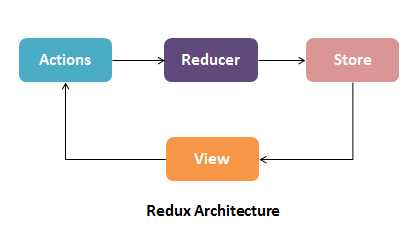
</p>

There is a central store that holds the entire state of the application. Each component can access the stored state without having to send down props from one component to another. There are three building parts: `actions`, `store`, and `reducers`.

## Q. What are the benefits of using Redux?

**1. State transfer:**

State is stored together in a single place called the ‘store.’ While you do not need to store all the state variables in the ‘store,’ it is especially important to when state is being shared by multiple components or in a more complex architecture. It also allows you to call state data from any component easily.

**2. Predictability:**

Redux is “a predictable state container for Javascript apps.” Because reducers are pure functions, the same result will always be produced when a state and action are passed in.

**3. Maintainability:**

Redux provides a strict structure for how the code and state should be managed, which makes the architecture easy to replicate and scale for somebody who has previous experience with Redux.

**4. Ease of testing and debugging:**

Redux makes it easy to test and debug your code since it offers powerful tools such as Redux DevTools in which you can time travel to debug, track your changes, and much more to streamline your development process.

<div align="right">
    <b><a href="#table-of-contents">↥ back to top</a></b>
</div>

## Q. What are redux core concepts?

<p align="center">
  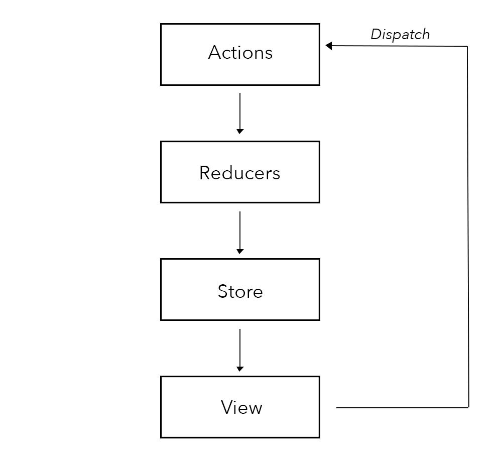
</p>

**1. Actions in Redux:**

Action is static information about the event that initiates a state change. When you update your state with Redux, you always start with an action. Actions are in the form of Javascript objects, containing a `type` and an optional `payload`. Actions are sent using the `store.dispatch()` method. Actions are created via an action creator.

**Action creators:** are simple functions that help to create actions. They are functions that return action objects, and then, the returned object is sent to various reducers in the application.

**2. Reducers in Redux:**

Reducers are pure functions that take the current state of an application, perform an action, and return a new state. These states are stored as objects, and they specify how the state of an application changes in response to an action sent to the store.

It is based on the reduce function in JavaScript, where a single value is calculated from multiple values after a callback function has been carried out.

**combine multiple reducers:** The `combineReducers()` helper function turns an object whose values are different reducing functions into a single reducing function you can pass to `createStore` (or `configureStore` in Redux Toolkit).

**Syntax:**

```js
const rootReducers = combineReducers({ reducer1, reducer2 })
```

**3. Store in Redux:**

A Store is an object that holds the whole state tree of your application. The Redux store is the application state stored as objects. Whenever the store is updated, it will update the React components subscribed to it. The store has the responsibility of storing, reading, and updating state.

When using Redux with React, states will no longer need to be lifted up; thus, it makes it easier to trace which action causes any change.

**4. Dispatch:**

Dispatch is a method that triggers an action with type and payload to Reducer.

```js
store.dispatch() 
```

**5. Subscribe:**

Subscribe is a method that is used to subscribe data/state from the Store.

```js
store.subscribe()
```

**6. Provider:**

The Provider is a component that has a reference to the Store and provides the data from the Store to the component it wraps.

**7. Connect:**

Connect is a function that communicates with the Provider.

**8. Middleware:**

Middleware is the suggested way to extend Redux with custom functionality. Middlewares are used to dispatch async functions. We configure Middleware\'s while creating a store.

**Syntax:**

```js
const store = createStore(reducers, initialState, middleware);
```

**Example:**

```js
/**
 * React Redux Simple Example
 */
import React from "react";
import "./styles.css";
import { signIn, signOut } from "./actions";
import { useSelector, useDispatch } from "react-redux";

export default function App() {
  const isLogged = useSelector((state) => state.isLogged);
  const dispatch = useDispatch();

  return (
    <div className="App">
      <h1>React Redux Example</h1>
      <button onClick={() => dispatch(signIn())}>SignIn</button>
      <button onClick={() => dispatch(signOut())}>SignOut</button>

      {isLogged ? <h2>You are now logged in...</h2> : ""}
    </div>
  );
}
```

```js
/**
 * Actions
 */
export const signIn = () => {
  return {
    type: "SIGN_IN"
  };
};

export const signOut = () => {
  return {
    type: "SIGN_OUT"
  };
};
```

```js
/**
 * Reducers
 */
import { combineReducers } from "redux";

const loggedReducer = (state = false, action) => {
  switch (action.type) {
    case "SIGN_IN":
      return true;
    case "SIGN_OUT":
      return false;
    default:
      return state;
  }
};

const allReducers = combineReducers({
  isLogged: loggedReducer
});

export default allReducers;
```

**&#9885; [Try this example on CodeSandbox](https://codesandbox.io/s/react-redux-simple-example-y3i7u6?file=/src/App.js)**

<div align="right">
    <b><a href="#table-of-contents">↥ back to top</a></b>
</div>

## Q. What is difference between presentational component and container component in react redux?

**1. Container Components:**

* Container components are primarily concerned with how things work
* They rarely have any HTML tags of their own, aside from a wrapping `<div>`
* They are often stateful
* They are responsible for providing data and behavior to their children (usually presentational components)

Container is an informal term for a React component that is `connect`-ed to a redux store. Containers receive Redux state updates and `dispatch` actions, and they usually don\'t render DOM elements; they delegate rendering to **presentational** child components.

**Example:**

```js
class Collage extends Component {
   constructor(props) {
      super(props);

      this.state = {
         images: []
      };
   }
   componentDidMount() {
      fetch('/api/current_user/image_list')
         .then(response => response.json())
         .then(images => this.setState({images}));
   }
   render() {
      return (
         <div className="image-list">
            {this.state.images.map(image => {
               <div className="image">
                  
               </div>
            })}
         </div>
      )
   }
}
```

**2. Presentational Components:**

* Presentational Components are primarily concerned with how things look
* Probably only contain a render method and little else logic
* They do not know how to load or alter the data that they render
* They are best written as stateless functional components

**Example:**

```js
//defining the component as a React Component
class Image extends Component {
   render() {
      return ;
   }
}
export default Image
//defining the component as a constant
const Image = props => (
   
)
export default Image
```

<div align="right">
    <b><a href="#table-of-contents">↥ back to top</a></b>
</div>

## # 3. REDUX SETUP

<br/>

## Q. How to add redux into create react app?

Redux is the most popular State container library for frontend apps. It helps you manage your state in a predictable and easy way.

**Installation:**

React Redux 9.x requires **React 18** or later. React Redux 8.x supports React 16.8.3+.

```bash
# Recommended: Vite + TypeScript template (using degit)
npx degit reduxjs/redux-templates/packages/vite-template-redux my-app

# Next.js with Redux
npx create-next-app --example with-redux my-app

# Legacy CRA templates (create-react-app is no longer actively maintained)
# Redux + Plain JS template
npx create-react-app my-app --template redux

# Redux + TypeScript template
npx create-react-app my-app --template redux-typescript
```

**An Existing React App:**

To use React Redux with your React app, install it as a dependency:

```js
# If you use npm (recommended - RTK includes redux and redux-thunk):
npm install @reduxjs/toolkit react-redux

# Or if you use Yarn:
yarn add @reduxjs/toolkit react-redux
```

> **Note:** With Redux Toolkit 2.x, you do **not** need to install `redux` or `redux-thunk` separately — they are bundled inside `@reduxjs/toolkit`.

**Folder structure:**

<p align="center">
  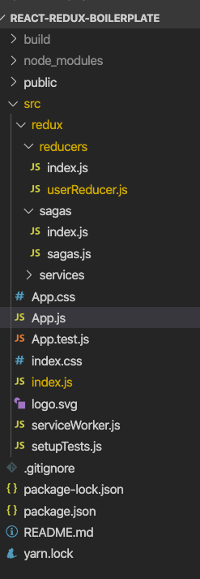
</p>

**Reference:**

* *[https://react-redux.js.org/introduction/getting-started](https://react-redux.js.org/introduction/getting-started)*

<div align="right">
    <b><a href="#table-of-contents">↥ back to top</a></b>
</div>

## Q. How to structure Redux top level directories?

The most of the applications has several top-level directories as below:

* **Components** - Contains all 'dumb' or presentational components, consisting only of HTML and styling.
* **Containers** - Contains all corresponding components with logic in them. Each container will have one or more component depending on the view represented by the container.
* **Actions** - All Redux actions
* **Reducers** - All Redux reducers
* **API** - API connectivity related code. Handler usually involves setting up an API connector centrally with authentication and other necessary headers.
* **Utils** - Other logical codes that are not React specific. For example, authUtils would have functions to process the JWT token from the API to determine the user scopes.
* **Store** - Used for redux store initialization.

**Example:**

```js
└── src
    ├── actions
    │   ├── articleActions.js
    │   ├── categoryActions.js
    │   └── userActions.js
    ├── api
    │   ├── apiHandler.js
    │   ├── articleApi.js
    │   ├── categoryApi.js
    │   └── userApi.js
    ├── components
    │   ├── ArticleComponent.jsx
    │   ├── ArticleListComponent.jsx
    │   ├── CategoryComponent.jsx
    │   ├── CategoryPageComponent.jsx
    │   └── HomePageComponent.jsx
    ├── containers
    │   ├── ArticleContainer.js
    │   ├── CategoryPageContainer.js
    │   └── HomePageContainer.js
    ├── index.js
    ├── reducers
    │   ├── articleReducer.js
    │   ├── categoryReducer.js
    │   └── userReducer.js
    ├── routes.js
    ├── store.js
    └── utils
        └── authUtils.js
```

<div align="right">
    <b><a href="#table-of-contents">↥ back to top</a></b>
</div>

## # 4. REDUX DATA FLOW

<br/>

## Q. How to set the dataflow using react with redux?

<p align="center">
  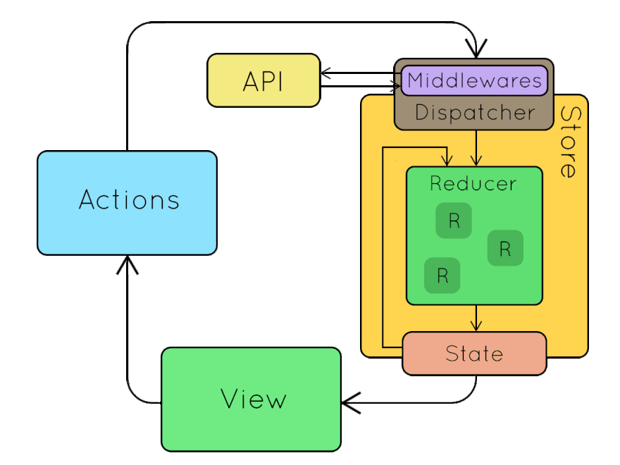
</p>

Redux offers this data sharing of components possible by maintaining one single state in the store. A single source of truth. All the components which want to get state data at some point are subscribed to the store and they will receive the state each time it gets updated.

Redux has five main entities. Action Creators, Dispatching Function, Reducers, State and Store.

* An action is dispatched when a user interacts with the application.
* The root reducer function is called with the current state and the dispatched action. The root reducer may divide the task among smaller reducer functions, which ultimately returns a new state.
* The store notifies the view by executing their callback functions.
* The view can retrieve updated state and re-render again.

<div align="right">
    <b><a href="#table-of-contents">↥ back to top</a></b>
</div>

## Q. What are the three principles that Redux follows?

Redux can be described in three fundamental principles:

**1. Single source of truth:**

> The state of your whole application is stored in an object tree inside a single store.

This makes it easy to create universal apps, as the state from your server can be serialized and hydrated into the client with no extra coding effort. A single state tree also makes it easier to debug or inspect an application; it also enables you to persist your app\'s state in development, for a faster development cycle.

**Example:**

```js
console.log(store.getState())

/* Prints
{
  visibilityFilter: 'SHOW_ALL',
  todos: [
    {
      text: 'Consider using Redux',
      completed: true,
    },
    {
      text: 'Keep all state in a single tree',
      completed: false
    }
  ]
}
*/
```

**2. State is read-only:**

> The only way to change the state is to emit an action, an object describing what happened.

This ensures that neither the views nor the network callbacks will ever write directly to the state. Instead, they express an intent to transform the state. Because all changes are centralized and happen one by one in a strict order, there are no subtle race conditions to watch out for.

**Example:**

```js
store.dispatch({
  type: 'COMPLETE_TODO',
  index: 1
})

store.dispatch({
  type: 'SET_VISIBILITY_FILTER',
  filter: 'SHOW_COMPLETED'
})
```

**3. Changes are made with pure functions:**

> To specify how the state tree is transformed by actions, you write pure reducers.

Reducers are just pure functions that take the previous state and an action, and return the next state. Remember to return new state objects, instead of mutating the previous state. You can start with a single reducer, and as your app grows, split it off into smaller reducers that manage specific parts of the state tree.

```js
import { combineReducers, createStore } from 'redux'

function visibilityFilter(state = 'SHOW_ALL', action) {
  switch (action.type) {
    case 'SET_VISIBILITY_FILTER':
      return action.filter
    default:
      return state
  }
}

function todos(state = [], action) {
  switch (action.type) {
    case 'ADD_TODO':
      return [
        ...state,
        {
          text: action.text,
          completed: false
        }
      ]
    case 'COMPLETE_TODO':
      return state.map((todo, index) => {
        if (index === action.index) {
          return Object.assign({}, todo, {
            completed: true
          })
        }
        return todo
      })
    default:
      return state
  }
}

const reducer = combineReducers({ visibilityFilter, todos })
const store = createStore(reducer)
```

<div align="right">
    <b><a href="#table-of-contents">↥ back to top</a></b>
</div>

## Q. What do you understand by "Single source of truth" in Redux?

The single source of truth is our state tree, that is not rewritten or reshaped. It gives us the availability to easily retrieve information in constant time and maintain a clean structure for the state of our application.

In React-Redux applications, when your Redux is a single source of truth, it means that the only way to change your data in UI is to dispatch redux action which will change state within redux reducer. And your React components will watch this reducer and if that reducer changes, then UI will change itself too. But never other way around, because Redux state is single source of truth.

<p align="center">
  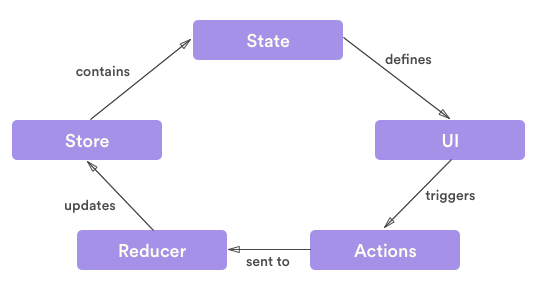
</p>

A practical example would be that you have Redux store which contains items you want to display. In order to change list of items to be displayed, you don\'t change this data anywhere else other than store. And if that is changed, everything else related to it, should change as well.

<div align="right">
    <b><a href="#table-of-contents">↥ back to top</a></b>
</div>

## Q. What are the features of Workflow in Redux?

When using Redux with React, states will no longer need to be lifted up. Everything is handled by Redux. Redux simplifies the app and makes it easier to maintain.

* Redux offers a solution for storing all your application state in one place, called a **store**.
* Components then **dispatch** state changes to the store, not directly to other components.
* The components that need to be aware of state changes can subscribe to the store.
* The **store** can be thought of as a "middleman" for all state changes in the application.
* With Redux involved, components don\'t communicate directly with each other. Rather, all state changes must go  through the single source of truth, the **store**.

**Core Principal:**

Redux has three core principals:

**1. Single Source of Truth**: The state of your whole application is stored in an object tree within a single **store**.  
**2. State Is Read-Only**: The only way to change the state is to dispatch an **action**, an object describing what happened.  
**3. Changes Are Made With Pure Functions**: To specify how the state tree is transformed by actions, you write pure **reducers**.  

**Redux Workflow:**

Redux allows you to manage the state of the application using Store. A child component can directly access the state from the Store.

The following are details of how Redux works:

* When UI Event triggers (OnClick, OnChange, etc) it can dispatch Actions based on the event.
* Reducers process Actions and return a new state as an Object.
* The new state of the whole application goes into a single Store.
* Components can easily subscribe to the Store.

<p align="center">
  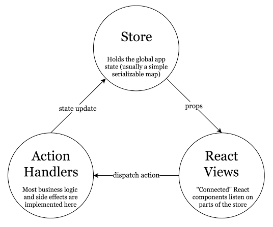
</p>

<div align="right">
    <b><a href="#table-of-contents">↥ back to top</a></b>
</div>

## # 5. REDUX STORE

<br/>

## Q. What is a store in Redux?

A store is an object that holds the whole state tree of your application. The Redux store is the application state stored as objects. Whenever the store is updated, it will update the React components subscribed to it. The store has the responsibility of storing, reading, and updating state.

**Example (Legacy — using `createStore`):**

> **Note:** `createStore` has been **deprecated** since Redux 4.2.0. The recommended approach is `configureStore` from `@reduxjs/toolkit` (shown below).

```js
/**
 * store in Redux (Legacy)
 */
import { createRoot } from "react-dom/client";
import { Provider } from "react-redux";
import { createStore } from "redux"; // ⚠️ deprecated
import rootReducer from "./reducers";
import App from "./components/App";

const rootElement = document.getElementById("root");
const root = createRoot(rootElement);

// create store (legacy)
const store = createStore(rootReducer);

root.render(
  <Provider store={store}>
    <App />
  </Provider>
);
```

**Recommended (Redux Toolkit):**

```js
import { createRoot } from "react-dom/client";
import { Provider } from "react-redux";
import { configureStore } from "@reduxjs/toolkit";
import rootReducer from "./reducers";
import App from "./components/App";

const store = configureStore({ reducer: rootReducer });

const root = createRoot(document.getElementById("root"));
root.render(
  <Provider store={store}>
    <App />
  </Provider>
);
```

When using Redux with React, states will no longer need to be lifted up; thus, it makes it easier to trace which action causes any change.

<div align="right">
    <b><a href="#table-of-contents">↥ back to top</a></b>
</div>

## Q. What is the best way to access redux store outside a react component?

To access redux store outside a react component, Redux `connect` function works great for regular React components.

In the examples below shows how to access a JWT token from the Redux store.

**Option 1:** Export the Store

```js
import { createStore } from 'redux'
import reducer from './reducer'

const store = createStore(reducer)

export default store
```

Here, we are creating the store and exporting it. This will make it available to other files. Here we\'ll see an `api` file making a call where we need to pass a JWT token to the server:

```js
import store from './store'

export function getProtectedThing() {
  // grab current state
  const state = store.getState()

  // get the JWT token out of it
  // (obviously depends on how your store is structured)
  const authToken = state.currentUser.token

  // Pass the token to the server
  return fetch('/user/thing', {
    method: 'GET',
    headers: {
      Authorization: `Bearer ${authToken}`
    }
  }).then(res => res.json())
}
```

**Option 2:** Pass the value from a React Component

It\'s simple to get access to the store inside a React component – no need to pass the store as a prop or import it, just use the `connect()` function from React Redux, and supply a `mapStateToProps()` function that pulls out the data.

```js
import React from 'react'
import { connect } from 'react-redux'
import * as api from 'api'

const ItemList = ({ authToken, items }) => {
  return (
    <ul>
      {items.map(item => (
        <li key={item.id}>
          {item.name}
          <button
            onClick={
              () => api.deleteItem(item, authToken)
            }>
            DELETE THIS ITEM
          </button>
        </li>
      )}
    </ul>
  )
}

const mapStateToProps = state => ({
  authToken: state.currentUser && state.currentUser.authToken,
  items: state.items
})

export connect(mapStateToProps)(ItemList)
```

<div align="right">
    <b><a href="#table-of-contents">↥ back to top</a></b>
</div>

## Q. Should all component states be kept in Redux Store

There is no "right" answer for this. Some users prefer to keep every single piece of data in Redux, to maintain a fully serializable and controlled version of their application at all times. Others prefer to keep non-critical or UI state, such as "is this dropdown currently open", inside a component\'s internal state.

Some common rules for determining what kind of data should be put into Redux:

* Do other parts of the application needs data to be shared.
* Is the same data being used to drive multiple components.
* Do you want to cache the data.
* Do you want to keep this data consistent while hot-reloading UI components.

<div align="right">
    <b><a href="#table-of-contents">↥ back to top</a></b>
</div>

## Q. How to use connect from React Redux?

The `connect()` function connects a React component to a Redux store. It provides its connected component with the pieces of the data it needs from the store, and the functions it can use to dispatch actions to the store.

It does not modify the component class passed to it; instead, it returns a new, connected component class that wraps the component you passed in.

* **Use `mapStateToProps()`:** It maps the state variables from your store to the props that you specify.
* **Connect props to container:** The object returned by the `mapStateToProps` function is connected to the container.

**Example:**

```js
import React from 'react'
import { connect } from 'react-redux'

class App extends React.Component {
  render() {
    return <div>{this.props.containerData}</div>
  }
}

function mapStateToProps(state) {
  return { containerData: state.data }
}

export default connect(mapStateToProps)(App)
```

<div align="right">
    <b><a href="#table-of-contents">↥ back to top</a></b>
</div>

## # 6. REDUX ACTIONS

<br/>

## Q. What is an action in Redux?

**Actions** are plain JavaScript objects or **payloads** of information that send data from your application to your store. They are the only source of information for the store. Actions must have a type property that indicates the type of action being performed.

An action is an object that contains two keys and their values. The state update that happens in the reducer is always dependent on the value of action.type.

**Example:**

```js
const action = {
  type: 'NEW_CONTACT',
  name: 'Alex K',
  location: 'Lagos Nigeria',
  email: 'alex@example.com'
}
```

There is typically a payload value that contains what the user is sending and would be used to update the state of the application. It is important to note that action.type is required, but action.payload is optional. Making use of payload brings a level of structure to how the action object looks like.

<div align="right">
    <b><a href="#table-of-contents">↥ back to top</a></b>
</div>

## Q. How to create action creators react with redux?

**1. Action Type:**

An action type is a string that simply describes the type of an action. They\'re commonly stored as constants or collected in enumerations to help reduce typos.

**Example:**

```js
export const Actions = {
  GET_USER_DETAILS_REQUEST: 'GET_USER_DETAILS_REQUEST',
  GET_USER_DETAILS_SUCCESS: 'GET_USER_DETAILS_SUCCESS',
  GET_USER_DETAILS_FAILURE: 'GET_USER_DETAILS_FAILURE',
  ...
}
```

**2. Action:**

An action is like a message that we send (i.e. dispatch) to our central Redux store. It can literally be anything. But ideally we want to stick to an agreed-upon pattern. And the standard pattern is as follows (this is a TypeScript type declaration):

**Example:**

```ts
type Action = {
    type: string;    // Actions MUST have a type
    payload?: any;   // Actions MAY have a payload
    meta?: any;      // Actions MAY have meta information
    error?: boolean; // Actions MAY have an error field
                     // when true, payload SHOULD contain an Error
}
```

An action to fetch the user named "Ram" might look something like this

```js
{
    type: 'GET_USER_DETAILS_REQUEST',
    payload: 'Ram'
}
```

**3. Action Creator:**

When writing basic Redux, an action creator simply returns an action. You would typically dispatch the action to your store immediately.

**Example:**

```js
export const getUserDetailsRequest = id => ({
  type: Actions.GET_USER_DETAILS_REQUEST,
  payload: id,
})
```

```js
store.dispatch(getUserDetailsRequest('Ram'))
```

Although, realistically, you\'ll be doing this via dispatch properties that are passed into a React component like this:

```js
// ES6
export const mapDispatchToProps = dispatch => ({
  onClick: () => dispatch(getUserDetailsRequest('Ram'))
})
```

<div align="right">
    <b><a href="#table-of-contents">↥ back to top</a></b>
</div>

## Q. How to dispatch an action on load?

You can dispatch an action in `componentDidMount()` method and in `render()` method you can verify the data.

**Example:**

```js
/**
 * Dispatch an action on load
 */
class App extends Component {
  componentDidMount() {
    this.props.fetchData()
  }

  render() {
    return this.props.isLoaded
      ? <div>{'Loaded'}</div>
      : <div>{'Not Loaded'}</div>
  }
}

const mapStateToProps = (state) => ({
  isLoaded: state.isLoaded
})

const mapDispatchToProps = { fetchData }

export default connect(mapStateToProps, mapDispatchToProps)(App)
```

<div align="right">
    <b><a href="#table-of-contents">↥ back to top</a></b>
</div>

## # 7. REDUX REDUCERS

<br/>

## Q. What is reducers in redux?

Reducers are pure functions that take the current state of an application, perform an action, and return a new state. These states are stored as objects, and they specify how the state of an application changes in response to an action sent to the store.

It is based on the reduce function in JavaScript, where a single value is calculated from multiple values after a callback function has been carried out.

**Example:**

```js
const LoginComponent = (state = initialState, action) => {
    switch (action.type) {

      // This reducer handles any action with type "LOGIN"
      case "LOGIN":
          return state.map(user => {
              if (user.username !== action.username) {
                  return user
              }

              if (user.password == action.password) {
                  return {
                      ...user,
                      login_status: "LOGGED IN"
                  }
              }
          });
      default:
          return state;
      }
}
```

<div align="right">
    <b><a href="#table-of-contents">↥ back to top</a></b>
</div>

## Q. Explain the role of Reducer?

A reducer is a function that determines changes to an application\'s state. It uses the action it receives to determine this change. Redux manage an application\'s state changes in a single store so that they behave consistently. Redux relies heavily on reducer functions that take the previous state and an action in order to execute the next state.

**1. State:**

State changes are based on a user\'s interaction, or even something like a network request. If the application\'s state is managed by Redux, the changes happen inside a reducer function — this is the only place where state changes happen. The reducer function makes use of the initial state of the application and something called action, to determine what the new state will look like.

**Syntax:**

```js
const contactReducer = (state = initialState, action) => {
  // Do something
}
```

**2. State Parameter:**

The state parameter that gets passed to the reducer function has to be the current state of the application. In this case, we\'re calling that our initialState because it will be the first (and current) state and nothing will precede it.

```js
contactReducer(initialState, action)
```

**Example:**

Let\'s say the initial state of our app is an empty list of contacts and our action is adding a new contact to the list.

```js
const initialState = {
  contacts: []
}
```

**3. Action Parameter:**

An action is an object that contains two keys and their values. The state update that happens in the reducer is always dependent on the value of action.type.

```js
const action = {
  type: 'NEW_CONTACT',
  name: 'Alex K',
  location: 'Lagos Nigeria',
  email: 'alex@example.com'
}
```

There is typically a `payload` value that contains what the user is sending and would be used to update the state of the application. It is important to note that `action.type` is required, but `action.payload` is optional. Making use of `payload` brings a level of structure to how the action object looks like.

**4. Updating State:**

The state is meant to be immutable, meaning it shouldn\'t be changed directly. To create an updated state, we can make use of `Object.assign()` or opt for the **spread operator**.

**Example:**

```js
const contactReducer = (state, action) => {
  switch (action.type) {
    case 'NEW_CONTACT':
    return {
        ...state, contacts:
        [...state.contacts, action.payload]
    }
    default:
      return state
  }
}
```

This ensures that the incoming state stays intact as we append the new item to the bottom.

```js
const initialState = {
  contacts: [{
    name: 'Alex K',
    age: 26
  }]
}

const contactReducer = (state = initialState, action) => {
  switch (action.type) {
    case "NEW_CONTACT":
      return Object.assign({}, state, {
        contacts: [...state.contacts, action.payload]
      });
    default:
      return state
  }
}

class App extends React.Component {
  constructor(props) {
    super(props)
    this.name = React.createRef()
    this.age = React.createRef()
    this.state = initialState
  }

  handleSubmit = e => {
    e.preventDefault()
    const action = {
      type: "NEW_CONTACT",
      payload: {
        name: this.name.current.value,
        age: this.age.current.value
      }
    }
    const newState = contactReducer(this.state, action)
    this.setState(newState)
  }

  render() {
    const { contacts } = this.state
    return (
      <div className="box">
        <div className="content">
          <pre>{JSON.stringify(this.state, null, 2)}</pre>
        </div>

        <div className="field">
          <form onSubmit={this.handleSubmit}>
            <div className="control">
              <input className="input" placeholder="Full Name" type="text" ref={this.name} />
            </div>
            <div className="control">
              <input className="input" placeholder="Age" type="number" ref={this.age} />
            </div>
            <div>
              <button type="submit" className="button">Submit</button>
            </div>
          </form>
        </div>
      </div>
    )
  }
}


ReactDOM.render(
  <App />,
  document.getElementById('root')
)
```

<div align="right">
    <b><a href="#table-of-contents">↥ back to top</a></b>
</div>

## Q. Why should the reducer be a "pure" function?

Redux takes a given state (object) and passes it to each reducer in a loop. And it expects a brand new object from the reducer if there are any changes. And it also expects to get the old object back if there are no changes.

Redux simply checks whether the old object is the same as the new object by comparing the memory locations of the two objects. So if you mutate the old object\'s property inside a reducer, the "new state" and the "old state" will both point to the same object. Hence Redux thinks nothing has changed! So this won\'t work.

<div align="right">
    <b><a href="#table-of-contents">↥ back to top</a></b>
</div>

## Q. How to split the reducers?

Putting all your update logic into a single reducer function is quickly going to become unmaintainable. While there\'s no single rule for how long a function should be, it\'s generally agreed that functions should be relatively short and ideally only do one specific thing. It\'s good programming practice to take pieces of code that are very long or do many different things, and break them into smaller pieces that are easier to understand.

In Redux reducer, we can split some of our reducer logic out into another function, and call that new function from the parent function. These new functions would typically fall into one of three categories:

1. Small utility functions containing some reusable chunk of logic that is needed in multiple places (which may or may not be actually related to the specific business logic)
2. Functions for handling a specific update case, which often need parameters other than the typical (state, action) pair
3. Functions which handle all updates for a given slice of state. These functions do generally have the typical  (state, action) parameter signature

These terms will be used to distinguish between different types of functions and different use cases:

* **reducer**: any function with the signature `(state, action) -> newState` (ie, any function that could be used as an argument to `Array.prototype.reduce`)
* **root reducer**: the reducer function that is actually passed as the first argument to `createStore`. This is the only part of the reducer logic that must have the `(state, action) -> newState` signature.
* **slice reducer**: a reducer that is being used to handle updates to one specific slice of the state tree, usually done by passing it to `combineReducers`
* **case function**: a function that is being used to handle the update logic for a specific action. This may actually be a reducer function, or it may require other parameters to do its work properly.
* **higher-order reducer**: a function that takes a reducer function as an argument, and/or returns a new reducer  function as a result (such as `combineReducers`, or `redux-undo`).

**Benefits:**

* **For fast page loads**

Splitting reducers will have and advantage of loading only required part of web application which in turn makes it very efficient in rendering time of main pages

* **Organization of code**

Splitting reducers on page level or component level will give a better code organization instead of just putting all reducers at one place. Since reducer is loaded only when page/component is loaded will ensure that there are standalone pages which are not dependent on other parts of the application.

* **One page/component**

One reducer design pattern. Things are better written, read and understood when they are modular. With dynamic reducers, it becomes possible to achieve it.

* **SEO**

With reducer level code-splitting, reducers can be code split on a split component level which will reduce the loading time of website thereby increasing SEO rankings.

<div align="right">
    <b><a href="#table-of-contents">↥ back to top</a></b>
</div>

## # 8. REDUX MIDDLEWARE

<br/>

## Q. What is Redux Thunk used for?

Redux Thunk is a **middleware** that lets you call action creators that return a function instead of an action object. That function receives the store\'s dispatch method, which is then used to dispatch regular synchronous actions inside the body of the function once the asynchronous operations have completed. The inner function receives the store methods `dispatch()` and `getState()` as parameters.

**Setup:**

```bash
# install create react app
npm install -g create-react-app

# Create a React App
create-react-app my-simple-async-app

# Switch directory
cd my-simple-app

# install Redux-Thunk
npm install --save redux react-redux redux-thunk
```

**Example:**

We are going to use Redux Thunk to asynchronously fetch the most recently updated repos by username from Github using this REST URL:

https://api.github.com/users/learning-zone/repos?sort=updated

```js
import { applyMiddleware, combineReducers, createStore } from 'redux' // ⚠️ createStore deprecated

import { thunk } from 'redux-thunk' // Named import required since redux-thunk v3

// actions.js
export const addRepos = repos => ({
  type: 'ADD_REPOS',
  repos,
})

export const clearRepos = () => ({ type: 'CLEAR_REPOS' })

export const getRepos = username => async dispatch => {
  try {
    const url = `https://api.github.com/users/${username}/repos?sort=updated`
    const response = await fetch(url)
    const responseBody = await response.json()
    dispatch(addRepos(responseBody))
  } catch (error) {
    console.error(error)
    dispatch(clearRepos())
  }
}

// reducers.js
export const repos = (state = [], action) => {
  switch (action.type) {
    case 'ADD_REPOS':
      return action.repos
    case 'CLEAR_REPOS':
      return []
    default:
      return state
  }
}

export const reducers = combineReducers({ repos })

// store.js
export function configureStore(initialState = {}) {
  const store = createStore(reducers, initialState, applyMiddleware(thunk))
  return store
}

export const store = configureStore()
```

`applyMiddleware(thunk)`: This tells redux to accept and execute functions as return values. Redux usually only accepts objects like { type: 'ADD_THINGS', things: ['list', 'of', 'things'] }.

The middleware checks if the action\'s return value is a function and if it is it will execute the function and inject a callback function named dispatch. This way you can start an asynchronous task and then use the dispatch callback to return a regular redux object action some time in the future.

```js
// This is your typical redux sync action
function syncAction(listOfThings) {
  return { type: 'ADD_THINGS', things: listOfThings  }
}

// This would be the async version
// where we may need to go fetch the
// list of things from a server before
// adding them via the sync action
function asyncAction() {
  return function(dispatch) {
    setTimeout(function() {
      dispatch(syncAction(['list', 'of', 'things']))
    }, 1000)
  }
}
```

**App.js:**

```js
import React, { Component } from 'react'

import { connect } from 'react-redux'

import { getRepos } from './redux'

// App.js
export class App extends Component {
  state = { username: 'learning-zone' }

  componentDidMount() {
    this.updateRepoList(this.state.username)
  }

  updateRepoList = username => this.props.getRepos(username)

  render() {
    return (
      <div>
        <h1>I AM AN ASYNC APP!!!</h1>

        <strong>Github username: </strong>
        <input
          type="text"
          value={this.state.username}
          onChange={ev => this.setState({ username: ev.target.value })}
          placeholder="Github username..."
        />
        <button onClick={() => this.updateRepoList(this.state.username)}>
          Get Lastest Repos
        </button>

        <ul>
          {this.props.repos.map((repo, index) => (
            <li key={index}>
              <a href={repo.html_url} target="_blank">
                {repo.name}
              </a>
            </li>
          ))}
        </ul>

      </div>
    )
  }
}

// AppContainer.js
const mapStateToProps = (state, ownProps) => ({ repos: state.repos })
const mapDispatchToProps = { getRepos }
const AppContainer = connect(mapStateToProps, mapDispatchToProps)(App)

export default AppContainer
```

**index.js:**

```js
import React from 'react'
import ReactDOM from 'react-dom'
import AppContainer from './App'
import './index.css'

// Add these imports - Step 1
import { Provider } from 'react-redux'
import { store } from './redux'

// Wrap existing app in Provider - Step 2
ReactDOM.render(
  <Provider store={store}>
    <AppContainer />
  </Provider>,
  document.getElementById('root')
)
```

<div align="right">
    <b><a href="#table-of-contents">↥ back to top</a></b>
</div>

## Q. What are typical middleware choices for handling asynchronous calls in Redux?

By default, Redux\'s actions are dispatched synchronously, which is a problem for any non-trivial app that needs to communicate with an external API or perform side effects. Redux also allows for middleware that sits between an action being dispatched and the action reaching the reducers.

There are three very popular middleware libraries that allow for side effects and asynchronous actions: `Redux Thunk` `Redux Saga` and `Redux Promise`.

<div align="right">
    <b><a href="#table-of-contents">↥ back to top</a></b>
</div>

## Q. How can I represent "side effects" such as AJAX calls? Why do we need things like "action creators", "thunks", and "middleware" to do async behavior?

Any meaningful web app needs to execute complex logic, usually including asynchronous work such as making AJAX requests. That code is no longer purely a function of its inputs, and the interactions with the outside world are known as "side effects".

Redux is inspired by functional programming, and out of the box, has no place for side effects to be executed. In particular, reducer functions must always be pure functions of `(state, action) => newState`. However, Redux\'s middleware (eg. **Redux Thunk**, **Redux Saga**) makes it possible to intercept dispatched actions and add additional complex behavior around them, including side effects.

<div align="right">
    <b><a href="#table-of-contents">↥ back to top</a></b>
</div>

## Q. Are there any similarities between Redux and RxJS?

**Redux**:

Predictable state container for JavaScript apps. Redux helps you write applications that behave consistently, run in different environments (client, server, and native), and are easy to test. On top of that, it provides a great developer experience, such as live code editing combined with a time traveling debugger. However, Redux has one, but very significant problem - it doesn\'t handle asynchronous operations very well by itself.

**RxJS:**

The Reactive Extensions for JavaScript. RxJS is a library for reactive programming using Observables, to make it easier to compose asynchronous or callback-based code.

Redux belongs to "State Management Library" category of the tech stack, while RxJS can be primarily classified under "Concurrency Frameworks".

| Redux                         | RxJS                               |
|-------------------------------|------------------------------------|
|Redux is a tool for managing state throughout the application.| RxJS is a reactive programming library|
|It is usually used as an architecture for UIs. |It is usually used as a tool to accomplish asynchronous tasks in JavaScript.|
|Redux uses the Reactive paradigm because the Store is reactive. The Store observes actions from a distance, and changes itself.|RxJS also uses the Reactive paradigm, but instead of being an architecture, it gives you basic building blocks, Observables, to accomplish this pattern.|

**Example:** React, Redux and RxJS

```js
import React from 'react';  
import ReactDOM from 'react-dom';  
import { Subject } from 'rxjs/Subject';

// create our stream as a subject so arbitrary data can be sent on the stream
const action$ = new Subject();

// Initial State
const initState = { name: 'Alex' };

// Redux reducer
const reducer = (state, action) => {  
  switch(action.type) {
    case 'NAME_CHANGED':
      return {
        ...state,
        name: action.payload
      };
    default:
      return state;
  }
}

// Reduxification
const store$ = action$  
    .startWith(initState)
    .scan(reducer);

// Higher order function to send actions to the stream
const actionDispatcher = (func) => (...args) =>  
  action$.next(func(...args));

// Example action function
const changeName = actionDispatcher((payload) => ({  
  type: 'NAME_CHANGED',
  payload
}));

// React view component
const App = (props) => {  
  const { name } = props;
  return (
    <div>
      <h1>{ name }</h1>
      <button onClick={() => changeName('Alex')} >Alex</button>
      <button onClick={() => changeName('John')} >John</button>
    </div>
  );
}

// subscribe and render the view
const dom =  document.getElementById('app');  
store$.subscribe((state) =>  
    ReactDOM.render(<App {...state} />, dom));
```

**Async actions:**

Let\'s say we want to do something asynchronous like fetch some information from a rest api all we need to do is send an ajax stream in place of our action payload and then use one of the lodash style stream operators, `flatMap()` to squash the results of the asynchronous operation back onto the `action$` stream.

```js
import { isObservable } from './utils';

// Action creator
const actionCreator = (func) => (...args) => {  
  const action = func.call(null, ...args);
  action$.next(action);
  if (isObservable(action.payload))
    action$.next(action.payload);
  return action;
};

// method called from button click
const loadUsers = actionCreator(() => {  
  return {
    type: 'USERS_LOADING',
    payload: Observable.ajax('/api/users')
      .map(({response}) => map(response, 'username'))
      .map((users) => ({
        type: 'USERS_LOADED',
        payload: users
      }))
  };
});

// Reducer
export default function reducer(state, action) {  
  switch (action.type) {
    case 'USERS_LOADING':
      return {
        ...state,
        isLoading: true
      };
    case 'USERS_LOADED':
      return {
        ...state,
        isLoading: false,
        users: action.payload,
      };
    //...
  }
}

// rest of code...

// Wrap input to ensure we only have a stream of observables
const ensureObservable = (action) =>  
  isObservable(action)
    ? action
    : Observable.from([action]);

// Using flatMap to squash async streams
const action$  
    .flatMap(wrapActionToObservable)
    .startWith(initState)
    .scan(reducer);
```

The advantage of swapping the action payload for a stream is so we can send data updates at the start and the end of the async operation

<div align="right">
    <b><a href="#table-of-contents">↥ back to top</a></b>
</div>

## Q. What are the differences between redux-saga and redux-thunk?

**1. Redux Thunk:**

Redux Thunk is a middleware that lets you call action creators that return a function instead of an action object. That function receives the store\'s dispatch method, which is then used to dispatch regular synchronous actions inside the body of the function once the asynchronous operations have completed.

<p align="center">
  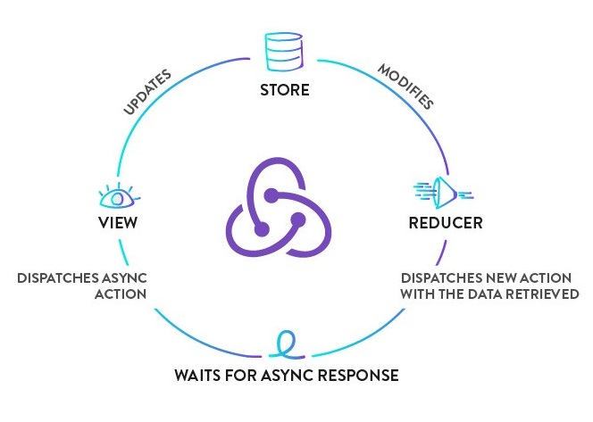
</p>

```bash
npm i --save react-redux redux redux-logger redux-saga redux-thunk
```

Thunk is a function which optionaly takes some parameters and returns another function, it takes dispatch and getState functions and both of these are supplied by Redux Thunk middleware.

Here is the basic structure of Redux-thunk

```js
export const thunkName = parameters => (dispatch, getState) => {
// You can write your application logic here
}
```

**Example:**

```js
import axios from "axios"
import GET_LIST_API_URL from "../config"

const fetchList = () => {
  return (dispatch) => {
    axios.get(GET_LIST_API_URL)
    .then((responseData) => {
      dispatch(getList(responseData.list))
    })
    .catch((error) => {
      console.log(error.message)
    })
  }
}

const getList = (payload) => {
  return {
    type: "GET_LIST",
    payload
  }
}

export { fetchList }
```

**2. Redux Saga:**

Redux Saga leverages an `ES6` feature called `Generators`, allowing us to write asynchronous code that looks synchronous, and is very easy to test. In the saga, we can test our asynchronous flows easily and our actions stay pure. It organized complicated asynchronous actions easily and make then very readable and the saga has many useful tools to deal with asynchronous actions.

<p align="center">
  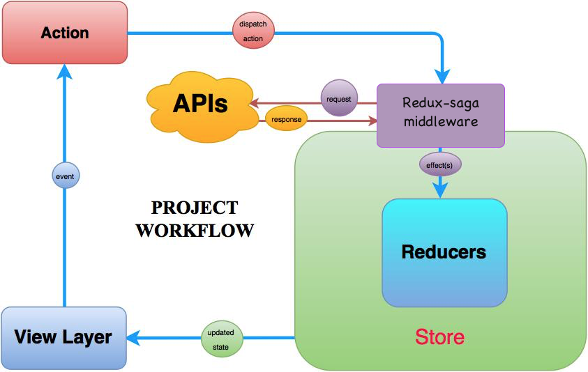
</p>

**Example:**

```js
import axios from "axios"
import GET_LIST_API_URL from "../config"
import {call, put} from "redux-saga/effects"

const fetchList = () => {
  return axios.get(GET_LIST_API_URL)
}

function *fetchList () {
  try {
    const responseData = yield call(getCharacters)
    yield put({type: "GET_LIST", payload: responseData.list})
  } catch (error) {
    console.log(error.message)
  }
}

export { fetchList }
```

Both Redux Thunk and Redux Saga take care of dealing with side effects. In very simple terms, applied to the most common scenario (async functions, specifically AJAX calls) Thunk allows Promises" to deal with them, Saga uses Generators. Thunk is simple to use and Promises are familiar to many developers, Saga/Generators are more powerful but you will need to learn them. When Promises are just good enough, so is Thunk, when you deal with more complex cases on a regular basis, Saga gives you better tools.

<div align="right">
    <b><a href="#table-of-contents">↥ back to top</a></b>
</div>

## Q. How to make Ajax request in Redux?

There are three most widely used and stable Redux Ajax middleware are:

* Redux Promise Middleware
* Redux Thunk Middleware
* Redux Saga Middleware

**1. Redux Promise Middleware:**

This is the most simple way of doing Ajax calls with Redux. When using Redux Promise, your action creator can return a Promise inside the Action.

```js
function getUserName(userId) {
    return {
        type: "SET_USERNAME",
        payload: fetch(`/api/personalDetails/${userId}`)
                .then(response => response.json())
                .then(json =>  json.userName)
    }
}
```

This middleware automatically dispatches two events when the Ajax call succeeds: `SETUSERNAMEPENDING`  and `SETUSERNAMEFULFILLED`. If something fails it dispatches `SETUSERNAMEREJECTED`.

**When to use:**

* You want the simplest thing with minimum overhead
* You prefer convention over configuration
* You have simple Ajax requirements

**2. Redux Thunk Middleware:**

This is the standard way of doing Ajax with Redux. When using Redux Thunk, your action creators returns a function that takes one argument dispatch:

```js
function getUserName(userId) {
    return dispatch => {
        return fetch(`/api/personalDetails/${userId}`)
        .then(response => response.json())
        .then(json => dispatch({ type: "SET_USERNAME", userName: json.userName })
    }
}
```

The action creator can call dispatch inside `.then` to execute it asynchronously. The action creator can call dispatch as many time as it wants.

**When to use:**

* You make many Ajax calls in one action, and need to dispatch many actions
* You require full control of the format of your actions

**3. Redux Saga Middleware:**

This is the most advanced way of doing Ajax with Redux. It uses an ES6 feature called `generators`. When using Redux Saga you do your Ajax calls in a saga instead of an action creator. This is how a saga looks like:

```js
import { call, put, takeEvery } from 'redux-saga/effects'

// call getUserName when action SET_USERNAME is dispatched
function* mySaga() {
  yield takeEvery("SET_USERNAME", getUserName);
}

function* getUserName(action) {
   try {
      const user = yield call(fetch, `/api/personalDetails/${userId}`);
      yield put({type: "SET_USERNAME_SUCCEEDED", user: user});
   } catch (e) {
      yield put({type: "SET_USERNAME_FAILED", message: e.message});
   }
}

export default mySaga
```

Here, sagas listen to actions which you dispatch as regular synchronous actions. In this case, the saga `getUserName` is executed when the action `SET_USERNAME` is dispatched. The `*` next to the function means it\'s a generator and yield is a generator keyword.

**When to use:**

* You need to be able to test the asynchronous flow easily
* You are comfortable working with ES6 Generators
* You value pure functions

<div align="right">
    <b><a href="#table-of-contents">↥ back to top</a></b>
</div>

## Q. What are the differences between call and put in redux-saga?

Both `call()` and `put()` are effect creator functions. `call()` function is used to create effect description, which instructs middleware to call the promise. `put()` function creates an effect, which instructs middleware to dispatch an action to the store.

Let\'s take example of how these effects work for fetching particular user data.

```js
function* fetchUserSaga(action) {
  // `call` function accepts rest arguments, which will be passed to `api.fetchUser` function.
  // Instructing middleware to call promise, it resolved value will be assigned to `userData` variable
  const userData = yield call(api.fetchUser, action.userId)
 
  // Instructing middleware to dispatch corresponding action.
  yield put({
    type: 'FETCH_USER_SUCCESS',
    userData
  })
}
```

<div align="right">
    <b><a href="#table-of-contents">↥ back to top</a></b>
</div>

## Q. What is the mental model of redux-saga?

Saga is like a separate thread in your application, that is solely responsible for side effects. `redux-saga` is a redux middleware, which means this thread can be **started**, **paused** and **cancelled** from the main application with normal Redux actions, it has access to the full Redux application state and it can dispatch Redux actions as well.

**Example:**

```bash
npm install --save redux-saga
```

Suppose we have a UI to fetch some user data from a remote server when a button is clicked.

```js
class UserComponent extends React.Component {
  ...
  onSomeButtonClicked() {
    const { userId, dispatch } = this.props
    dispatch({type: 'USER_FETCH_REQUESTED', payload: {userId}})
  }
  ...
}
```

The Component dispatches a plain Object action to the Store. We\'ll create a Saga that watches for all `USER_FETCH_REQUESTED` actions and triggers an API call to fetch the user data.

```js
// sagas.js

import { call, put, takeEvery, takeLatest } from 'redux-saga/effects'
import Api from '...'

// worker Saga: will be fired on USER_FETCH_REQUESTED actions
function* fetchUser(action) {
   try {
      const user = yield call(Api.fetchUser, action.payload.userId);
      yield put({type: "USER_FETCH_SUCCEEDED", user: user});
   } catch (e) {
      yield put({type: "USER_FETCH_FAILED", message: e.message});
   }
}

/*
  Starts fetchUser on each dispatched `USER_FETCH_REQUESTED` action.
  Allows concurrent fetches of user.
*/
function* mySaga() {
  yield takeEvery("USER_FETCH_REQUESTED", fetchUser);
}

/*
  Alternatively you may use takeLatest.

  Does not allow concurrent fetches of user. If "USER_FETCH_REQUESTED" gets
  dispatched while a fetch is already pending, that pending fetch is cancelled
  and only the latest one will be run.
*/
function* mySaga() {
  yield takeLatest("USER_FETCH_REQUESTED", fetchUser);
}

export default mySaga;
```

To run our Saga, we\'ll have to connect it to the Redux Store using the `redux-saga` middleware.

```js
// main.js

import { createStore, applyMiddleware } from 'redux'
import createSagaMiddleware from 'redux-saga'

import reducer from './reducers'
import mySaga from './sagas'

// create the saga middleware
const sagaMiddleware = createSagaMiddleware()
// mount it on the Store
const store = createStore(
  reducer,
  applyMiddleware(sagaMiddleware)
)

// then run the saga
sagaMiddleware.run(mySaga)

// render the application
```

<div align="right">
    <b><a href="#table-of-contents">↥ back to top</a></b>
</div>

## # 9. RTK QUERY

<br/>

## Q. What is RTK Query?

**RTK Query** is a powerful data fetching and caching tool built directly into Redux Toolkit (`@reduxjs/toolkit`). It is designed to simplify common cases for loading data in a web application, eliminating the need to hand-write data fetching and caching logic yourself.

RTK Query is included in the core `@reduxjs/toolkit` package and can be imported from two entry points:

```js
// Core (framework-agnostic)
import { createApi } from '@reduxjs/toolkit/query'

// React-specific: auto-generates hooks for each endpoint
import { createApi } from '@reduxjs/toolkit/query/react'
```

**Key APIs:**

| API | Purpose |
|-----|---------|
| `createApi()` | Core API — define endpoints and how to fetch/transform data |
| `fetchBaseQuery()` | Lightweight `fetch` wrapper for the `baseQuery` |
| `<ApiProvider />` | Standalone `Provider` if you have no existing Redux store |
| `setupListeners()` | Enables `refetchOnFocus` / `refetchOnReconnect` behaviors |

**Benefits over manual data fetching (`createAsyncThunk`):**

| Feature | Manual | RTK Query |
|---------|--------|-----------|
| Caching | Manual | Automatic |
| Loading / error states | Manual | Automatic |
| Deduplication of requests | Manual | Automatic |
| Polling | Manual | Built-in |
| Cache invalidation | Manual | Tag-based, built-in |
| Auto-generated hooks | No | Yes |
| Optimistic updates | Manual | Built-in |

<div align="right">
    <b><a href="#table-of-contents">↥ back to top</a></b>
</div>

## Q. How to set up RTK Query in a React application?

**Step 1: Install Redux Toolkit and React-Redux**

```bash
npm install @reduxjs/toolkit react-redux
```

**Step 2: Create an API slice with `createApi`**

```js
// src/services/postsApi.js
import { createApi, fetchBaseQuery } from '@reduxjs/toolkit/query/react'

export const postsApi = createApi({
  reducerPath: 'postsApi',           // unique key in Redux store
  baseQuery: fetchBaseQuery({
    baseUrl: 'https://jsonplaceholder.typicode.com',
  }),
  endpoints: (builder) => ({
    getPosts: builder.query({
      query: () => '/posts',
    }),
    getPostById: builder.query({
      query: (id) => `/posts/${id}`,
    }),
    createPost: builder.mutation({
      query: (newPost) => ({
        url: '/posts',
        method: 'POST',
        body: newPost,
      }),
    }),
  }),
})

// Export auto-generated hooks
export const {
  useGetPostsQuery,
  useGetPostByIdQuery,
  useCreatePostMutation,
} = postsApi
```

**Step 3: Add the API slice to the store**

```js
// src/store.js
import { configureStore } from '@reduxjs/toolkit'
import { postsApi } from './services/postsApi'
import { setupListeners } from '@reduxjs/toolkit/query'

export const store = configureStore({
  reducer: {
    [postsApi.reducerPath]: postsApi.reducer,
  },
  middleware: (getDefaultMiddleware) =>
    getDefaultMiddleware().concat(postsApi.middleware),
})

// Enable refetchOnFocus and refetchOnReconnect
setupListeners(store.dispatch)
```

**Step 4: Wrap your app with `Provider`**

```js
// src/index.js
import React from 'react'
import ReactDOM from 'react-dom/client'
import { Provider } from 'react-redux'
import { store } from './store'
import App from './App'

const root = ReactDOM.createRoot(document.getElementById('root'))
root.render(
  <Provider store={store}>
    <App />
  </Provider>
)
```

**Step 5: Use the generated hooks in components**

```js
// src/features/PostsList.js
import { useGetPostsQuery } from '../services/postsApi'

function PostsList() {
  const { data: posts, isLoading, isError, error } = useGetPostsQuery()

  if (isLoading) return <p>Loading...</p>
  if (isError) return <p>Error: {error.message}</p>

  return (
    <ul>
      {posts.map((post) => (
        <li key={post.id}>{post.title}</li>
      ))}
    </ul>
  )
}

export default PostsList
```

<div align="right">
    <b><a href="#table-of-contents">↥ back to top</a></b>
</div>

## Q. What are the query and mutation endpoints in RTK Query?

RTK Query distinguishes between two types of endpoints:

**1. Query (`builder.query`)**

Used for **reading / fetching** data. The result is cached automatically.

```js
endpoints: (builder) => ({
  getUser: builder.query({
    query: (userId) => `/users/${userId}`,
    // Optional: transform the raw response
    transformResponse: (response) => response.data,
    // Optional: cache for 60 seconds
    keepUnusedDataFor: 60,
  }),
})
```

Generated hook: `useGetUserQuery(userId)`

**2. Mutation (`builder.mutation`)**

Used for **creating, updating, or deleting** data. Mutations do not cache results automatically.

```js
endpoints: (builder) => ({
  updateUser: builder.mutation({
    query: ({ id, ...patch }) => ({
      url: `/users/${id}`,
      method: 'PATCH',
      body: patch,
    }),
  }),
})
```

Generated hook: `useUpdateUserMutation()`

**Example: Using both together**

```js
import {
  useGetUserQuery,
  useUpdateUserMutation,
} from '../services/usersApi'

function UserProfile({ userId }) {
  const { data: user, isLoading } = useGetUserQuery(userId)
  const [updateUser, { isLoading: isUpdating }] = useUpdateUserMutation()

  if (isLoading) return <p>Loading...</p>

  const handleUpdate = async () => {
    try {
      await updateUser({ id: userId, name: 'New Name' }).unwrap()
      console.log('Updated!')
    } catch (err) {
      console.error('Failed to update:', err)
    }
  }

  return (
    <div>
      <h2>{user.name}</h2>
      <button onClick={handleUpdate} disabled={isUpdating}>
        {isUpdating ? 'Updating...' : 'Update Name'}
      </button>
    </div>
  )
}
```

<div align="right">
    <b><a href="#table-of-contents">↥ back to top</a></b>
</div>

## Q. What is cache invalidation in RTK Query and how does it work?

RTK Query uses a **tag-based cache invalidation** system to automatically refetch data when it becomes stale after a mutation.

**How it works:**

1. Queries declare which tags they **provide** (`providesTags`)
2. Mutations declare which tags they **invalidate** (`invalidatesTags`)
3. When a mutation runs successfully, RTK Query automatically refetches all queries whose provided tags match the invalidated tags

**Example: Posts CRUD with tags**

```js
import { createApi, fetchBaseQuery } from '@reduxjs/toolkit/query/react'

export const postsApi = createApi({
  reducerPath: 'postsApi',
  baseQuery: fetchBaseQuery({ baseUrl: '/api' }),
  tagTypes: ['Post'],                // declare all tag types
  endpoints: (builder) => ({

    getPosts: builder.query({
      query: () => '/posts',
      providesTags: (result) =>
        result
          ? [
              ...result.map(({ id }) => ({ type: 'Post', id })),
              { type: 'Post', id: 'LIST' },
            ]
          : [{ type: 'Post', id: 'LIST' }],
    }),

    getPostById: builder.query({
      query: (id) => `/posts/${id}`,
      providesTags: (result, error, id) => [{ type: 'Post', id }],
    }),

    addPost: builder.mutation({
      query: (body) => ({ url: '/posts', method: 'POST', body }),
      invalidatesTags: [{ type: 'Post', id: 'LIST' }],
    }),

    updatePost: builder.mutation({
      query: ({ id, ...patch }) => ({
        url: `/posts/${id}`,
        method: 'PUT',
        body: patch,
      }),
      invalidatesTags: (result, error, { id }) => [{ type: 'Post', id }],
    }),

    deletePost: builder.mutation({
      query: (id) => ({ url: `/posts/${id}`, method: 'DELETE' }),
      invalidatesTags: (result, error, id) => [{ type: 'Post', id }],
    }),
  }),
})

export const {
  useGetPostsQuery,
  useGetPostByIdQuery,
  useAddPostMutation,
  useUpdatePostMutation,
  useDeletePostMutation,
} = postsApi
```

<div align="right">
    <b><a href="#table-of-contents">↥ back to top</a></b>
</div>

## Q. What query hook return values does RTK Query provide?

When you call a query hook like `useGetPostsQuery()`, RTK Query returns an object with the following key properties:

| Property | Type | Description |
|----------|------|-------------|
| `data` | `any` | Latest returned result (undefined while loading) |
| `currentData` | `any` | Data for the **current** arg only (undefined when arg changes) |
| `isLoading` | `boolean` | `true` only during the **first** fetch with no cached data |
| `isFetching` | `boolean` | `true` whenever a fetch is in progress (including refetches) |
| `isSuccess` | `boolean` | `true` when the last fetch succeeded |
| `isError` | `boolean` | `true` when the last fetch failed |
| `error` | `any` | The error object if `isError` is true |
| `refetch` | `function` | Call to manually trigger a refetch |
| `status` | `string` | `'uninitialized'` \| `'pending'` \| `'fulfilled'` \| `'rejected'` |

**Example:**

```js
function PostsList() {
  const {
    data: posts = [],
    isLoading,
    isFetching,
    isError,
    error,
    refetch,
  } = useGetPostsQuery()

  return (
    <div>
      <button onClick={refetch} disabled={isFetching}>
        {isFetching ? 'Refreshing...' : 'Refresh'}
      </button>

      {isLoading && <p>Loading posts for the first time...</p>}
      {isError && <p>Error: {error.status} {JSON.stringify(error.data)}</p>}

      <ul>
        {posts.map((post) => (
          <li key={post.id}>{post.title}</li>
        ))}
      </ul>
    </div>
  )
}
```

**`isLoading` vs `isFetching`:**

```js
// First load with no cache → isLoading: true, isFetching: true
// Refetch with stale cache → isLoading: false, isFetching: true
// Idle with fresh cache → isLoading: false, isFetching: false
```

<div align="right">
    <b><a href="#table-of-contents">↥ back to top</a></b>
</div>

## Q. How to implement polling with RTK Query?

RTK Query supports automatic polling by passing a `pollingInterval` option (in milliseconds) to the query hook.

```js
function LiveStock() {
  const { data, isLoading } = useGetStockPriceQuery('AAPL', {
    pollingInterval: 3000,        // refetch every 3 seconds
    skipPollingIfUnfocused: true, // pause polling when tab is unfocused
  })

  if (isLoading) return <p>Loading...</p>

  return <p>AAPL: ${data.price}</p>
}
```

**Options for query hooks:**

| Option | Type | Description |
|--------|------|-------------|
| `skip` | `boolean` | Skip this query entirely if `true` |
| `pollingInterval` | `number` | Auto-refetch every N milliseconds |
| `skipPollingIfUnfocused` | `boolean` | Pause polling when window loses focus |
| `refetchOnMountOrArgChange` | `boolean \| number` | Refetch on mount or when arg changes |
| `selectFromResult` | `function` | Derive a subset of result to subscribe to |

**Conditionally skipping a query:**

```js
function UserDetails({ userId }) {
  // Don't run the query if userId is not yet available
  const { data: user } = useGetUserQuery(userId, {
    skip: !userId,
  })

  return userId ? <div>{user?.name}</div> : <div>No user selected</div>
}
```

<div align="right">
    <b><a href="#table-of-contents">↥ back to top</a></b>
</div>

## Q. How to perform optimistic updates with RTK Query?

Optimistic updates allow you to immediately update the UI before the server confirms the change, and roll back if the request fails.

```js
import { createApi, fetchBaseQuery } from '@reduxjs/toolkit/query/react'

const api = createApi({
  baseQuery: fetchBaseQuery({ baseUrl: '/' }),
  tagTypes: ['Post'],
  endpoints: (build) => ({
    getPosts: build.query({
      query: () => 'posts',
      providesTags: ['Post'],
    }),
    updatePost: build.mutation({
      query: ({ id, ...patch }) => ({
        url: `post/${id}`,
        method: 'PATCH',
        body: patch,
      }),
      // Optimistic update
      async onQueryStarted({ id, ...patch }, { dispatch, queryFulfilled }) {
        // Apply patch immediately
        const patchResult = dispatch(
          api.util.updateQueryData('getPosts', undefined, (draft) => {
            const post = draft.find((p) => p.id === id)
            if (post) Object.assign(post, patch)
          })
        )
        try {
          await queryFulfilled
        } catch {
          // Roll back on failure
          patchResult.undo()
        }
      },
      invalidatesTags: ['Post'],
    }),
  }),
})
```

<div align="right">
    <b><a href="#table-of-contents">↥ back to top</a></b>
</div>

## Q. What is `fetchBaseQuery` and how do you add authorization headers?

`fetchBaseQuery` is a lightweight wrapper around the native `fetch` API provided by RTK Query to use as the `baseQuery` in `createApi`. It supports setting base URLs, default headers, credential settings, and request/response transformation.

**Adding a static authorization header:**

```js
import { fetchBaseQuery } from '@reduxjs/toolkit/query/react'

const baseQuery = fetchBaseQuery({
  baseUrl: 'https://api.example.com',
  prepareHeaders: (headers) => {
    headers.set('Authorization', 'Bearer my-static-token')
    return headers
  },
})
```

**Reading the token dynamically from the Redux store:**

```js
const baseQuery = fetchBaseQuery({
  baseUrl: 'https://api.example.com',
  prepareHeaders: (headers, { getState }) => {
    const token = getState().auth.token
    if (token) {
      headers.set('Authorization', `Bearer ${token}`)
    }
    return headers
  },
})
```

**Handling 401 responses with `fetchBaseQueryWithReauth`:**

```js
import { fetchBaseQuery } from '@reduxjs/toolkit/query/react'
import { tokenRefreshed, loggedOut } from '../features/auth/authSlice'

const baseQuery = fetchBaseQuery({
  baseUrl: '/api',
  prepareHeaders: (headers, { getState }) => {
    const token = getState().auth.token
    if (token) headers.set('Authorization', `Bearer ${token}`)
    return headers
  },
})

// Wrap to handle token refresh on 401
const baseQueryWithReauth = async (args, api, extraOptions) => {
  let result = await baseQuery(args, api, extraOptions)

  if (result.error?.status === 401) {
    // Try to refresh the token
    const refreshResult = await baseQuery('/auth/refresh', api, extraOptions)
    if (refreshResult.data) {
      api.dispatch(tokenRefreshed(refreshResult.data))
      result = await baseQuery(args, api, extraOptions)
    } else {
      api.dispatch(loggedOut())
    }
  }
  return result
}

export const api = createApi({
  baseQuery: baseQueryWithReauth,
  endpoints: () => ({}),
})
```

<div align="right">
    <b><a href="#table-of-contents">↥ back to top</a></b>
</div>

## Q. What is `transformResponse` and `transformErrorResponse` in RTK Query?

`transformResponse` lets you reshape the server's success response before it is stored in the cache and returned to your component. `transformErrorResponse` does the same for error responses.

```js
export const productsApi = createApi({
  reducerPath: 'productsApi',
  baseQuery: fetchBaseQuery({ baseUrl: '/api' }),
  endpoints: (builder) => ({
    getProducts: builder.query({
      query: () => '/products',

      // Server returns { data: [...], meta: {...} }
      // Component only needs the array
      transformResponse: (response) => response.data,

      // Normalize error shape
      transformErrorResponse: (response) => ({
        status: response.status,
        message: response.data?.message ?? 'Unknown error',
      }),
    }),
  }),
})
```

**With TypeScript:**

```ts
getProducts: builder.query<Product[], void>({
  query: () => '/products',
  transformResponse: (response: { data: Product[] }) => response.data,
})
```

<div align="right">
    <b><a href="#table-of-contents">↥ back to top</a></b>
</div>

## Q. How does RTK Query handle pagination?

RTK Query supports pagination through query arguments. You pass the page number (or cursor) as the query argument and RTK Query caches each page independently.

**Offset / page-based pagination:**

```js
export const postsApi = createApi({
  reducerPath: 'postsApi',
  baseQuery: fetchBaseQuery({ baseUrl: '/api' }),
  endpoints: (builder) => ({
    getPaginatedPosts: builder.query({
      query: ({ page = 1, limit = 10 }) =>
        `/posts?page=${page}&limit=${limit}`,
      // Tag each page separately so only changed pages refetch
      providesTags: (result, error, { page }) => [{ type: 'Post', id: `page-${page}` }],
    }),
  }),
})

export const { useGetPaginatedPostsQuery } = postsApi
```

```js
function PaginatedPosts() {
  const [page, setPage] = React.useState(1)
  const { data, isLoading, isFetching } = useGetPaginatedPostsQuery({ page })

  return (
    <div>
      {isLoading ? (
        <p>Loading...</p>
      ) : (
        <ul>
          {data?.items.map((post) => <li key={post.id}>{post.title}</li>)}
        </ul>
      )}
      <button disabled={page === 1} onClick={() => setPage((p) => p - 1)}>
        Previous
      </button>
      <button
        disabled={!data?.hasMore || isFetching}
        onClick={() => setPage((p) => p + 1)}
      >
        {isFetching ? 'Loading...' : 'Next'}
      </button>
    </div>
  )
}
```

**Infinite scroll using `serializeQueryArgs` and `merge`:**

```js
import { createApi, fetchBaseQuery } from '@reduxjs/toolkit/query/react'

export const postsApi = createApi({
  reducerPath: 'postsApi',
  baseQuery: fetchBaseQuery({ baseUrl: '/api' }),
  endpoints: (builder) => ({
    getInfinitePosts: builder.query({
      query: ({ page }) => `/posts?page=${page}`,
      // Merge incoming results into existing cache
      serializeQueryArgs: ({ endpointName }) => endpointName,
      merge: (currentCache, newItems) => {
        currentCache.push(...newItems)
      },
      forceRefetch: ({ currentArg, previousArg }) =>
        currentArg !== previousArg,
    }),
  }),
})
```

<div align="right">
    <b><a href="#table-of-contents">↥ back to top</a></b>
</div>

## Q. How do you manually trigger a query (lazy query) in RTK Query?

By default, RTK Query runs a query as soon as a component mounts. For user-triggered fetches (e.g., on a button click), use the **lazy query hook** — `useLazySomeQuery`.

```js
import { useLazyGetUserQuery } from '../services/usersApi'

function SearchUser() {
  const [trigger, result, lastPromiseInfo] = useLazyGetUserQuery()
  const [username, setUsername] = React.useState('')

  const handleSearch = () => {
    trigger(username) // manually fire the query
  }

  return (
    <div>
      <input
        value={username}
        onChange={(e) => setUsername(e.target.value)}
        placeholder="Enter username"
      />
      <button onClick={handleSearch}>Search</button>

      {result.isLoading && <p>Searching...</p>}
      {result.isError && <p>User not found.</p>}
      {result.data && <p>Name: {result.data.name}</p>}
    </div>
  )
}
```

**Difference between query and lazy query hooks:**

| Hook | When it runs |
|------|-------------|
| `useGetUserQuery(arg)` | Runs immediately on mount; reruns when `arg` changes |
| `useLazyGetUserQuery()` | Only runs when the returned `trigger` function is called |

<div align="right">
    <b><a href="#table-of-contents">↥ back to top</a></b>
</div>

## Q. How do you inject endpoints into an RTK Query API slice?

`injectEndpoints` lets you add new endpoints to an existing API slice from separate files. This is useful for **code splitting** and keeping feature files self-contained.

```js
// src/services/baseApi.js
import { createApi, fetchBaseQuery } from '@reduxjs/toolkit/query/react'

export const baseApi = createApi({
  reducerPath: 'api',
  baseQuery: fetchBaseQuery({ baseUrl: '/api' }),
  endpoints: () => ({}),  // no endpoints here
})
```

```js
// src/features/posts/postsApi.js
import { baseApi } from '../../services/baseApi'

export const postsApi = baseApi.injectEndpoints({
  endpoints: (builder) => ({
    getPosts: builder.query({
      query: () => '/posts',
    }),
    addPost: builder.mutation({
      query: (body) => ({ url: '/posts', method: 'POST', body }),
    }),
  }),
  overrideExisting: false,
})

export const { useGetPostsQuery, useAddPostMutation } = postsApi
```

```js
// src/features/users/usersApi.js
import { baseApi } from '../../services/baseApi'

export const usersApi = baseApi.injectEndpoints({
  endpoints: (builder) => ({
    getUsers: builder.query({
      query: () => '/users',
    }),
  }),
})

export const { useGetUsersQuery } = usersApi
```

The store still only needs to include `baseApi.reducer` and `baseApi.middleware` once.

<div align="right">
    <b><a href="#table-of-contents">↥ back to top</a></b>
</div>

## # 10. REDUX FORMS

<br/>

## Q. Explain Redux form with an example?

This is a simple demonstration of how to connect all the standard HTML form elements to redux-form.

For the most part, it is a matter of wrapping each form control in a `<Field>` component, specifying which type of `React.DOM` component you wish to be rendered.

The Field component will provide your input with `onChange`, `onBlur`, `onFocus`, `onDrag`, and `onDrop` props to listen to the events, as well as a **value** prop to make each input a **controlled component**. Notice that the SimpleForm component has no state; in fact, it uses the functional stateless component syntax.

**Example:**

```js
// SimpleForm.js

import React from 'react'
import { Field, reduxForm } from 'redux-form'

const SimpleForm = (props) => {
  const { handleSubmit, pristine, reset, submitting } = props
  return (
    <form onSubmit={handleSubmit}>
      <div>
        <label>Name</label>
        <div>
          <Field name="name" component="input" type="text" placeholder="Name"/>
        </div>
      </div>
      <div>
        <label>Sex</label>
        <div>
          <label><Field name="sex" component="input" type="radio" value="male"/> Male</label>
          <label><Field name="sex" component="input" type="radio" value="female"/> Female</label>
        </div>
      </div>
      <div>
        <label>Favorite Color</label>
        <div>
          <Field name="favoriteColor" component="select">
            <option></option>
            <option value="ff0000">Red</option>
            <option value="00ff00">Green</option>
            <option value="0000ff">Blue</option>
          </Field>
        </div>
      </div>
      <div>
        <button type="submit" disabled={pristine || submitting}>Submit</button>
        <button type="button" disabled={pristine || submitting} onClick={reset}>Clear</button>
      </div>
    </form>
  )
}

export default reduxForm({
  form: 'simple'  // a unique identifier for this form
})(SimpleForm)
```

**Reference:**

* *[https://redux-form.com/6.5.0/examples/syncvalidation/](https://redux-form.com/6.5.0/examples/syncvalidation/)*

<div align="right">
    <b><a href="#table-of-contents">↥ back to top</a></b>
</div>

## Q. How Redux Form initialValues get updated from state?

Add `enableReinitialize : true` When set to true, the **form** will reinitialize every time the initialValues prop changes

```js
...

export default connect(mapStateToProps)(reduxForm({ 
  form: 'contactForm', 
  enableReinitialize: true
})(ContactForm))
```

<div align="right">
    <b><a href="#table-of-contents">↥ back to top</a></b>
</div>

## # 2. REDUX TOOLKIT

<br/>

## Q. What is Redux Toolkit and why should you use it?

**Redux Toolkit (RTK)** is the official, opinionated, batteries-included toolset for efficient Redux development. It is the recommended way to write Redux logic and addresses three common concerns about Redux:

1. **"Configuring a Redux store is too complicated"**
2. **"I have to add a lot of packages to get Redux to do anything useful"**
3. **"Redux requires too much boilerplate code"**

Redux Toolkit was created to help address these concerns by:

* Providing a `configureStore()` function with good defaults
* Including the most commonly used Redux addons built-in
* Allowing you to write simpler, more concise Redux logic
* Providing good TypeScript support out of the box

**Key Benefits:**

* **Simple** - Includes utilities to simplify common use cases like store setup, creating reducers, immutable update logic
* **Opinionated** - Provides good defaults for store setup and includes the most commonly used Redux addons
* **Powerful** - Works with Redux DevTools Extension and includes RTK Query for data fetching
* **Effective** - Lets you write more concise Redux logic with less boilerplate

**Example:**

```js
// Without Redux Toolkit (Traditional Redux — legacy patterns)
import { createStore, combineReducers, applyMiddleware } from 'redux'; // ⚠️ createStore deprecated
import { thunk } from 'redux-thunk'; // Named import required since redux-thunk v3
import { composeWithDevTools } from 'redux-devtools-extension'; // ⚠️ use Redux DevTools built into configureStore instead

const ADD_TODO = 'ADD_TODO';
const TOGGLE_TODO = 'TOGGLE_TODO';

function addTodo(text) {
  return { type: ADD_TODO, payload: text };
}

function todosReducer(state = [], action) {
  switch (action.type) {
    case ADD_TODO:
      return [...state, { text: action.payload, completed: false }];
    case TOGGLE_TODO:
      return state.map((todo, index) =>
        index === action.payload ? { ...todo, completed: !todo.completed } : todo
      );
    default:
      return state;
  }
}

const rootReducer = combineReducers({ todos: todosReducer });
const store = createStore(
  rootReducer,
  composeWithDevTools(applyMiddleware(thunk))
);

// With Redux Toolkit
import { configureStore, createSlice } from '@reduxjs/toolkit';

const todosSlice = createSlice({
  name: 'todos',
  initialState: [],
  reducers: {
    addTodo: (state, action) => {
      state.push({ text: action.payload, completed: false });
    },
    toggleTodo: (state, action) => {
      const todo = state[action.payload];
      if (todo) {
        todo.completed = !todo.completed;
      }
    }
  }
});

export const { addTodo, toggleTodo } = todosSlice.actions;

const store = configureStore({
  reducer: {
    todos: todosSlice.reducer
  }
});
```

<div align="right">
    <b><a href="#table-of-contents">↥ back to top</a></b>
</div>

## Q. What is createSlice in Redux Toolkit?

`createSlice` is a function that accepts an initial state, an object full of reducer functions, and a "slice name", and automatically generates action creators and action types that correspond to the reducers and state.

**Key Features:**

* Automatically generates action creators with the same names as the reducer functions
* Automatically generates action types based on the slice name and reducer names
* Allows you to write "mutating" logic using Immer inside reducers
* Reduces boilerplate code significantly

**Syntax:**

```js
const slice = createSlice({
  name: string,
  initialState: any,
  reducers: Object<string, Function>,
  extraReducers: Object | Function
})
```

**Example: Counter Slice**

```js
import { createSlice } from '@reduxjs/toolkit';

const counterSlice = createSlice({
  name: 'counter',
  initialState: {
    value: 0,
    status: 'idle'
  },
  reducers: {
    increment: (state) => {
      // Redux Toolkit allows us to write "mutating" logic in reducers
      // It doesn't actually mutate the state because it uses the Immer library
      state.value += 1;
    },
    decrement: (state) => {
      state.value -= 1;
    },
    incrementByAmount: (state, action) => {
      state.value += action.payload;
    },
    reset: (state) => {
      state.value = 0;
    }
  }
});

// Action creators are automatically generated
export const { increment, decrement, incrementByAmount, reset } = counterSlice.actions;

// Export the reducer
export default counterSlice.reducer;

// Usage in component
import { useDispatch, useSelector } from 'react-redux';
import { increment, decrement, incrementByAmount } from './counterSlice';

function Counter() {
  const count = useSelector((state) => state.counter.value);
  const dispatch = useDispatch();

  return (
    <div>
      <h1>{count}</h1>
      <button onClick={() => dispatch(increment())}>+</button>
      <button onClick={() => dispatch(decrement())}>-</button>
      <button onClick={() => dispatch(incrementByAmount(5))}>+5</button>
    </div>
  );
}
```

**Example: Users Slice with Async Actions**

```js
import { createSlice, createAsyncThunk } from '@reduxjs/toolkit';
import axios from 'axios';

// Async thunk for fetching users
export const fetchUsers = createAsyncThunk(
  'users/fetchUsers',
  async () => {
    const response = await axios.get('/api/users');
    return response.data;
  }
);

const usersSlice = createSlice({
  name: 'users',
  initialState: {
    entities: [],
    loading: 'idle',
    error: null
  },
  reducers: {
    userAdded: (state, action) => {
      state.entities.push(action.payload);
    },
    userUpdated: (state, action) => {
      const { id, changes } = action.payload;
      const existingUser = state.entities.find(user => user.id === id);
      if (existingUser) {
        Object.assign(existingUser, changes);
      }
    }
  },
  extraReducers: (builder) => {
    builder
      .addCase(fetchUsers.pending, (state) => {
        state.loading = 'pending';
      })
      .addCase(fetchUsers.fulfilled, (state, action) => {
        state.loading = 'idle';
        state.entities = action.payload;
      })
      .addCase(fetchUsers.rejected, (state, action) => {
        state.loading = 'idle';
        state.error = action.error.message;
      });
  }
});

export const { userAdded, userUpdated } = usersSlice.actions;
export default usersSlice.reducer;
```

<div align="right">
    <b><a href="#table-of-contents">↥ back to top</a></b>
</div>

## Q. What is configureStore in Redux Toolkit?

`configureStore()` wraps around the Redux `createStore()` API and provides good defaults to simplify store setup. It automatically:

* Combines slice reducers to create the root reducer
* Adds the Redux Thunk middleware by default
* Sets up the Redux DevTools Extension automatically
* Adds development mode checks for common mistakes
* Allows middleware customization

**Syntax:**

```js
const store = configureStore({
  reducer: rootReducer,
  middleware: (getDefaultMiddleware) => getDefaultMiddleware(),
  devTools: process.env.NODE_ENV !== 'production',
  preloadedState: initialState,
  enhancers: []
})
```

**Example: Basic Store Setup**

```js
import { configureStore } from '@reduxjs/toolkit';
import counterReducer from './features/counter/counterSlice';
import usersReducer from './features/users/usersSlice';
import postsReducer from './features/posts/postsSlice';

const store = configureStore({
  reducer: {
    counter: counterReducer,
    users: usersReducer,
    posts: postsReducer
  }
});

export default store;
```

**Example: Store with Custom Middleware**

```js
import { configureStore } from '@reduxjs/toolkit';
import { createLogger } from 'redux-logger';
import rootReducer from './reducers';

const logger = createLogger({
  // Logger options
  collapsed: true
});

const store = configureStore({
  reducer: rootReducer,
  middleware: (getDefaultMiddleware) =>
    getDefaultMiddleware({
      serializableCheck: {
        // Ignore these action types
        ignoredActions: ['your/action/type'],
      },
      thunk: {
        extraArgument: { api: myApi }
      }
    }).concat(logger),
  devTools: process.env.NODE_ENV !== 'production'
});

export default store;
```

**Example: Using with TypeScript**

```ts
import { configureStore } from '@reduxjs/toolkit';
import counterReducer from './features/counter/counterSlice';
import usersReducer from './features/users/usersSlice';

export const store = configureStore({
  reducer: {
    counter: counterReducer,
    users: usersReducer
  }
});

// Infer the `RootState` and `AppDispatch` types from the store itself
export type RootState = ReturnType<typeof store.getState>;
export type AppDispatch = typeof store.dispatch;
```

<div align="right">
    <b><a href="#table-of-contents">↥ back to top</a></b>
</div>

## Q. What is createAsyncThunk and when should you use it?

`createAsyncThunk` is a function that accepts a Redux action type string and a callback function that should return a promise. It generates promise lifecycle action types based on the action type prefix you pass in, and returns a thunk action creator that will run the promise callback and dispatch the lifecycle actions automatically.

**Purpose:**

* Simplifies writing async logic in Redux
* Automatically dispatches pending/fulfilled/rejected actions
* Handles errors and loading states
* Reduces boilerplate for async operations

**Syntax:**

```js
const asyncThunk = createAsyncThunk(
  typePrefix: string,
  payloadCreator: (arg, thunkAPI) => Promise,
  options?: {
    condition?: (arg, { getState, extra }) => boolean,
    dispatchConditionRejection?: boolean
  }
)
```

**Generated Action Types:**

For a `typePrefix` of `'users/fetch'`, the following action types are generated:
* `'users/fetch/pending'`
* `'users/fetch/fulfilled'`
* `'users/fetch/rejected'`

**Example: Basic Usage**

```js
import { createSlice, createAsyncThunk } from '@reduxjs/toolkit';
import axios from 'axios';

// Async thunk
export const fetchUserById = createAsyncThunk(
  'users/fetchById',
  async (userId, thunkAPI) => {
    const response = await axios.get(`/api/users/${userId}`);
    return response.data;
  }
);

const usersSlice = createSlice({
  name: 'users',
  initialState: {
    entities: {},
    loading: 'idle',
    error: null
  },
  reducers: {},
  extraReducers: (builder) => {
    builder
      .addCase(fetchUserById.pending, (state) => {
        state.loading = 'pending';
      })
      .addCase(fetchUserById.fulfilled, (state, action) => {
        state.loading = 'idle';
        state.entities[action.payload.id] = action.payload;
      })
      .addCase(fetchUserById.rejected, (state, action) => {
        state.loading = 'idle';
        state.error = action.error.message;
      });
  }
});
```

**Example: With Error Handling**

```js
export const loginUser = createAsyncThunk(
  'auth/login',
  async (credentials, { rejectWithValue }) => {
    try {
      const response = await axios.post('/api/login', credentials);
      return response.data;
    } catch (err) {
      // Use `rejectWithValue` to return a custom error payload
      return rejectWithValue(err.response.data);
    }
  }
);

const authSlice = createSlice({
  name: 'auth',
  initialState: {
    user: null,
    token: null,
    loading: false,
    error: null
  },
  reducers: {
    logout: (state) => {
      state.user = null;
      state.token = null;
    }
  },
  extraReducers: (builder) => {
    builder
      .addCase(loginUser.pending, (state) => {
        state.loading = true;
        state.error = null;
      })
      .addCase(loginUser.fulfilled, (state, action) => {
        state.loading = false;
        state.user = action.payload.user;
        state.token = action.payload.token;
      })
      .addCase(loginUser.rejected, (state, action) => {
        state.loading = false;
        state.error = action.payload || action.error.message;
      });
  }
});
```

**Example: Accessing State and Dispatch**

```js
export const fetchPostsWithCondition = createAsyncThunk(
  'posts/fetch',
  async (arg, { getState, dispatch, rejectWithValue }) => {
    const state = getState();
    
    // Access current state
    if (state.posts.lastFetch) {
      const timeSinceLastFetch = Date.now() - state.posts.lastFetch;
      if (timeSinceLastFetch < 60000) { // 1 minute
        return rejectWithValue('Too soon to refetch');
      }
    }
    
    try {
      const response = await axios.get('/api/posts');
      
      // You can dispatch other actions
      dispatch(updateLastFetchTime(Date.now()));
      
      return response.data;
    } catch (error) {
      return rejectWithValue(error.response.data);
    }
  },
  {
    // Conditional check before running
    condition: (arg, { getState }) => {
      const state = getState();
      if (state.posts.loading === 'pending') {
        // Already fetching, don't fetch again
        return false;
      }
    }
  }
);
```

**Example: Component Usage**

```js
import React, { useEffect } from 'react';
import { useDispatch, useSelector } from 'react-redux';
import { fetchUserById } from './usersSlice';

function UserProfile({ userId }) {
  const dispatch = useDispatch();
  const user = useSelector((state) => state.users.entities[userId]);
  const loading = useSelector((state) => state.users.loading);
  const error = useSelector((state) => state.users.error);

  useEffect(() => {
    dispatch(fetchUserById(userId));
  }, [dispatch, userId]);

  if (loading === 'pending') return <div>Loading...</div>;
  if (error) return <div>Error: {error}</div>;
  if (!user) return null;

  return (
    <div>
      <h1>{user.name}</h1>
      <p>{user.email}</p>
    </div>
  );
}
```

<div align="right">
    <b><a href="#table-of-contents">↥ back to top</a></b>
</div>

## Q. What is createEntityAdapter in Redux Toolkit?

`createEntityAdapter` provides a standardized way to store your data in a slice by taking a collection and putting it into the shape of `{ ids: [], entities: {} }`. It generates a set of prebuilt reducers and selectors for performing CRUD operations on normalized state.

**Benefits:**

* Provides prebuilt reducers for common operations (add, update, remove)
* Automatically generates memoized selectors
* Handles normalization of data
* Reduces boilerplate code for entity management
* Efficient updates and lookups

**Syntax:**

```js
const adapter = createEntityAdapter({
  selectId: (entity) => entity.id, // Optional, defaults to entity.id
  sortComparer: (a, b) => a.name.localeCompare(b.name) // Optional sorting
})
```

**Generated Reducer Functions:**

* `addOne` - Add one entity
* `addMany` - Add multiple entities
* `setOne` - Add or replace one entity
* `setMany` - Add or replace multiple entities
* `setAll` - Replace all entities
* `removeOne` - Remove one entity
* `removeMany` - Remove multiple entities
* `removeAll` - Remove all entities
* `updateOne` - Update one entity
* `updateMany` - Update multiple entities
* `upsertOne` - Add or update one entity
* `upsertMany` - Add or update multiple entities

**Example: Basic Usage**

```js
import { createSlice, createEntityAdapter } from '@reduxjs/toolkit';

const usersAdapter = createEntityAdapter({
  // Assume IDs are stored in a field other than `id`
  selectId: (user) => user.userId,
  // Sort by username
  sortComparer: (a, b) => a.username.localeCompare(b.username)
});

const usersSlice = createSlice({
  name: 'users',
  initialState: usersAdapter.getInitialState({
    loading: 'idle',
    error: null
  }),
  reducers: {
    userAdded: usersAdapter.addOne,
    usersReceived: usersAdapter.setAll,
    userUpdated: usersAdapter.updateOne,
    userRemoved: usersAdapter.removeOne
  }
});

export const { userAdded, usersReceived, userUpdated, userRemoved } = usersSlice.actions;
export default usersSlice.reducer;

// Export selectors
export const {
  selectAll: selectAllUsers,
  selectById: selectUserById,
  selectIds: selectUserIds
} = usersAdapter.getSelectors((state) => state.users);
```

**Example: With Async Thunks**

```js
import { createSlice, createAsyncThunk, createEntityAdapter } from '@reduxjs/toolkit';
import axios from 'axios';

const postsAdapter = createEntityAdapter({
  sortComparer: (a, b) => b.date.localeCompare(a.date)
});

export const fetchPosts = createAsyncThunk('posts/fetchAll', async () => {
  const response = await axios.get('/api/posts');
  return response.data;
});

export const addNewPost = createAsyncThunk('posts/add', async (initialPost) => {
  const response = await axios.post('/api/posts', initialPost);
  return response.data;
});

const postsSlice = createSlice({
  name: 'posts',
  initialState: postsAdapter.getInitialState({
    status: 'idle',
    error: null
  }),
  reducers: {
    postUpdated: postsAdapter.updateOne,
    reactionAdded(state, action) {
      const { postId, reaction } = action.payload;
      const existingPost = state.entities[postId];
      if (existingPost) {
        existingPost.reactions[reaction]++;
      }
    }
  },
  extraReducers: (builder) => {
    builder
      .addCase(fetchPosts.pending, (state) => {
        state.status = 'loading';
      })
      .addCase(fetchPosts.fulfilled, (state, action) => {
        state.status = 'succeeded';
        postsAdapter.setAll(state, action.payload);
      })
      .addCase(fetchPosts.rejected, (state, action) => {
        state.status = 'failed';
        state.error = action.error.message;
      })
      .addCase(addNewPost.fulfilled, postsAdapter.addOne);
  }
});

export const { postUpdated, reactionAdded } = postsSlice.actions;
export default postsSlice.reducer;

// Selectors
export const {
  selectAll: selectAllPosts,
  selectById: selectPostById,
  selectIds: selectPostIds
} = postsAdapter.getSelectors((state) => state.posts);

// Custom memoized selector
export const selectPostsByUser = createSelector(
  [selectAllPosts, (state, userId) => userId],
  (posts, userId) => posts.filter(post => post.userId === userId)
);
```

**Example: Component Usage**

```js
import React, { useEffect } from 'react';
import { useDispatch, useSelector } from 'react-redux';
import { fetchPosts, selectAllPosts, postUpdated } from './postsSlice';

function PostsList() {
  const dispatch = useDispatch();
  const posts = useSelector(selectAllPosts);
  const postStatus = useSelector((state) => state.posts.status);

  useEffect(() => {
    if (postStatus === 'idle') {
      dispatch(fetchPosts());
    }
  }, [postStatus, dispatch]);

  const handleEdit = (postId, changes) => {
    dispatch(postUpdated({
      id: postId,
      changes: changes
    }));
  };

  if (postStatus === 'loading') {
    return <div>Loading...</div>;
  }

  return (
    <div>
      {posts.map(post => (
        <article key={post.id}>
          <h3>{post.title}</h3>
          <p>{post.content}</p>
          <button onClick={() => handleEdit(post.id, { title: 'New Title' })}>
            Edit
          </button>
        </article>
      ))}
    </div>
  );
}
```

<div align="right">
    <b><a href="#table-of-contents">↥ back to top</a></b>
</div>

## Q. How does Immer work in Redux Toolkit?

Redux Toolkit uses the **Immer** library internally, which allows you to write code that appears to "mutate" state, but actually produces a new immutable state behind the scenes.

**How It Works:**

1. Immer creates a "draft" copy of your state
2. You make changes to the draft (using mutating syntax)
3. Immer tracks all changes made to the draft
4. When you're done, Immer produces a new immutable state based on the changes

**Benefits:**

* Write simpler, more readable code
* No need to manually spread objects/arrays
* Prevents accidental mutations
* Performance optimizations built-in
* Reduces bugs from incorrect immutable updates

**Example: Without Immer (Traditional Redux)**

```js
// Traditional Redux - manual immutable updates
function todosReducer(state = [], action) {
  switch (action.type) {
    case 'ADD_TODO':
      return [...state, action.payload];
    
    case 'TOGGLE_TODO':
      return state.map((todo, index) =>
        index === action.payload
          ? { ...todo, completed: !todo.completed }
          : todo
      );
    
    case 'UPDATE_TODO':
      return state.map(todo =>
        todo.id === action.payload.id
          ? { ...todo, ...action.payload.updates }
          : todo
      );
    
    case 'REMOVE_TODO':
      return state.filter(todo => todo.id !== action.payload);
    
    default:
      return state;
  }
}
```

**Example: With Immer (Redux Toolkit)**

```js
// Redux Toolkit - using Immer's draft state
import { createSlice } from '@reduxjs/toolkit';

const todosSlice = createSlice({
  name: 'todos',
  initialState: [],
  reducers: {
    addTodo: (state, action) => {
      // "Mutating" push - Immer handles immutability
      state.push(action.payload);
    },
    
    toggleTodo: (state, action) => {
      const todo = state[action.payload];
      if (todo) {
        // "Mutating" assignment - Immer handles immutability
        todo.completed = !todo.completed;
      }
    },
    
    updateTodo: (state, action) => {
      const todo = state.find(t => t.id === action.payload.id);
      if (todo) {
        // "Mutating" Object.assign - Immer handles immutability
        Object.assign(todo, action.payload.updates);
      }
    },
    
    removeTodo: (state, action) => {
      const index = state.findIndex(todo => todo.id === action.payload);
      if (index !== -1) {
        // "Mutating" splice - Immer handles immutability
        state.splice(index, 1);
      }
    }
  }
});
```

**Example: Complex Nested State**

```js
const blogSlice = createSlice({
  name: 'blog',
  initialState: {
    posts: {
      byId: {},
      allIds: []
    },
    comments: {
      byPostId: {}
    }
  },
  reducers: {
    // Without Immer - very verbose
    addCommentWithoutImmer: (state, action) => {
      const { postId, comment } = action.payload;
      return {
        ...state,
        comments: {
          ...state.comments,
          byPostId: {
            ...state.comments.byPostId,
            [postId]: [
              ...(state.comments.byPostId[postId] || []),
              comment
            ]
          }
        }
      };
    },
    
    // With Immer - clean and simple
    addComment: (state, action) => {
      const { postId, comment } = action.payload;
      if (!state.comments.byPostId[postId]) {
        state.comments.byPostId[postId] = [];
      }
      state.comments.byPostId[postId].push(comment);
    },
    
    updateNestedPost: (state, action) => {
      const { postId, userId, updates } = action.payload;
      const post = state.posts.byId[postId];
      if (post && post.author.id === userId) {
        // Deep mutations work fine
        post.author.name = updates.authorName;
        post.title = updates.title;
        post.metadata.lastEdited = Date.now();
      }
    }
  }
});
```

**Important Rules:**

1. **Either mutate OR return** - Don't do both in the same reducer
2. **Don't return undefined** - Always return state or nothing

```js
// ✅ GOOD - Mutate the draft
reducers: {
  increment: (state) => {
    state.value += 1;
  }
}

// ✅ GOOD - Return new state
reducers: {
  increment: (state) => {
    return { ...state, value: state.value + 1 };
  }
}

// ❌ BAD - Both mutate AND return
reducers: {
  increment: (state) => {
    state.value += 1;
    return state; // Don't do this!
  }
}

// ❌ BAD - Return undefined
reducers: {
  reset: (state) => {
    return undefined; // Will cause errors!
  }
}

// ✅ GOOD - Reset state
reducers: {
  reset: () => {
    return initialState; // Return new state
  }
}
```

<div align="right">
    <b><a href="#table-of-contents">↥ back to top</a></b>
</div>

## Q. What is the difference between Redux and Redux Toolkit?

| Feature | Redux | Redux Toolkit |
|---------|-------|---------------|
| **Setup** | Requires manual configuration of store, middleware, DevTools | `configureStore()` with good defaults |
| **Reducers** | Manual switch statements, immutable updates | `createSlice()` with Immer for "mutable" updates |
| **Action Creators** | Must be written manually | Auto-generated from `createSlice()` |
| **Async Logic** | Requires redux-thunk or redux-saga | `createAsyncThunk()` built-in |
| **Boilerplate** | High - lots of code for simple tasks | Low - concise and simple |
| **Immutability** | Manual spread operators | Immer library handles it automatically |
| **DevTools** | Must be configured manually | Automatically enabled |
| **Middleware** | Must be added manually | Thunk middleware included by default |
| **TypeScript** | Requires custom type definitions | Better TypeScript support out of the box |
| **Best Practices** | Up to developer | Enforces best practices |
| **Entity Management** | Manual normalization | `createEntityAdapter()` for normalized data |
| **Learning Curve** | Steeper | Gentler |

**Example Comparison:**

```js
// ========== TRADITIONAL REDUX ==========

// Action Types
const INCREMENT = 'counter/increment';
const DECREMENT = 'counter/decrement';
const INCREMENT_BY_AMOUNT = 'counter/incrementByAmount';

// Action Creators
function increment() {
  return { type: INCREMENT };
}

function decrement() {
  return { type: DECREMENT };
}

function incrementByAmount(amount) {
  return { type: INCREMENT_BY_AMOUNT, payload: amount };
}

// Reducer
const initialState = { value: 0 };

function counterReducer(state = initialState, action) {
  switch (action.type) {
    case INCREMENT:
      return { ...state, value: state.value + 1 };
    case DECREMENT:
      return { ...state, value: state.value - 1 };
    case INCREMENT_BY_AMOUNT:
      return { ...state, value: state.value + action.payload };
    default:
      return state;
  }
}

// Store Setup (Legacy — all of this is replaced by configureStore)
import { createStore, combineReducers, applyMiddleware } from 'redux'; // ⚠️ deprecated
import { thunk } from 'redux-thunk'; // Named import since redux-thunk v3
import { composeWithDevTools } from 'redux-devtools-extension';

const rootReducer = combineReducers({
  counter: counterReducer
});

const store = createStore(
  rootReducer,
  composeWithDevTools(applyMiddleware(thunk))
);

// ========== REDUX TOOLKIT ==========

import { createSlice, configureStore } from '@reduxjs/toolkit';

// Slice (combines actions + reducer)
const counterSlice = createSlice({
  name: 'counter',
  initialState: { value: 0 },
  reducers: {
    increment: (state) => {
      state.value += 1; // Immer makes this safe
    },
    decrement: (state) => {
      state.value -= 1;
    },
    incrementByAmount: (state, action) => {
      state.value += action.payload;
    }
  }
});

// Auto-generated action creators
export const { increment, decrement, incrementByAmount } = counterSlice.actions;

// Store Setup
const store = configureStore({
  reducer: {
    counter: counterSlice.reducer
  }
  // DevTools and thunk are automatically included!
});
```

<div align="right">
    <b><a href="#table-of-contents">↥ back to top</a></b>
</div>

## Q. How to migrate from Redux to Redux Toolkit?

Migrating from traditional Redux to Redux Toolkit can be done gradually. You don't need to rewrite everything at once.

**Migration Strategy:**

1. Install Redux Toolkit
2. Replace `createStore` with `configureStore`
3. Convert reducers to slices one at a time
4. Replace action creators with slice actions
5. Convert thunks to `createAsyncThunk`
6. Optimize with `createEntityAdapter` where appropriate

**Step-by-Step Migration:**

**Step 1: Install Redux Toolkit**

```bash
npm install @reduxjs/toolkit
# or
yarn add @reduxjs/toolkit
```

**Step 2: Replace Store Configuration**

```js
// Before - Traditional Redux (legacy)
import { createStore, applyMiddleware, combineReducers } from 'redux'; // ⚠️ createStore deprecated since Redux 4.2
import { thunk } from 'redux-thunk'; // Named import required since redux-thunk v3
import { composeWithDevTools } from 'redux-devtools-extension'; // No longer needed with configureStore
import usersReducer from './reducers/usersReducer';
import postsReducer from './reducers/postsReducer';

const rootReducer = combineReducers({
  users: usersReducer,
  posts: postsReducer
});

const store = createStore(
  rootReducer,
  composeWithDevTools(applyMiddleware(thunk))
);

// After - Redux Toolkit
import { configureStore } from '@reduxjs/toolkit';
import usersReducer from './reducers/usersReducer';
import postsReducer from './reducers/postsReducer';

const store = configureStore({
  reducer: {
    users: usersReducer,
    posts: postsReducer
  }
});
```

**Step 3: Convert One Reducer to a Slice**

```js
// Before - Traditional Reducer
// actions/usersActions.js
export const FETCH_USERS_REQUEST = 'FETCH_USERS_REQUEST';
export const FETCH_USERS_SUCCESS = 'FETCH_USERS_SUCCESS';
export const FETCH_USERS_FAILURE = 'FETCH_USERS_FAILURE';
export const ADD_USER = 'ADD_USER';

export const fetchUsers = () => async (dispatch) => {
  dispatch({ type: FETCH_USERS_REQUEST });
  try {
    const response = await fetch('/api/users');
    const data = await response.json();
    dispatch({ type: FETCH_USERS_SUCCESS, payload: data });
  } catch (error) {
    dispatch({ type: FETCH_USERS_FAILURE, payload: error.message });
  }
};

export const addUser = (user) => ({
  type: ADD_USER,
  payload: user
});

// reducers/usersReducer.js
const initialState = {
  items: [],
  loading: false,
  error: null
};

export default function usersReducer(state = initialState, action) {
  switch (action.type) {
    case FETCH_USERS_REQUEST:
      return {
        ...state,
        loading: true
      };
    case FETCH_USERS_SUCCESS:
      return {
        ...state,
        loading: false,
        items: action.payload
      };
    case FETCH_USERS_FAILURE:
      return {
        ...state,
        loading: false,
        error: action.payload
      };
    case ADD_USER:
      return {
        ...state,
        items: [...state.items, action.payload]
      };
    default:
      return state;
  }
}

// After - Redux Toolkit Slice
// features/users/usersSlice.js
import { createSlice, createAsyncThunk } from '@reduxjs/toolkit';

export const fetchUsers = createAsyncThunk(
  'users/fetchUsers',
  async () => {
    const response = await fetch('/api/users');
    return response.json();
  }
);

const usersSlice = createSlice({
  name: 'users',
  initialState: {
    items: [],
    loading: false,
    error: null
  },
  reducers: {
    addUser: (state, action) => {
      state.items.push(action.payload);
    }
  },
  extraReducers: (builder) => {
    builder
      .addCase(fetchUsers.pending, (state) => {
        state.loading = true;
      })
      .addCase(fetchUsers.fulfilled, (state, action) => {
        state.loading = false;
        state.items = action.payload;
      })
      .addCase(fetchUsers.rejected, (state, action) => {
        state.loading = false;
        state.error = action.error.message;
      });
  }
});

export const { addUser } = usersSlice.actions;
export default usersSlice.reducer;
```

**Step 4: Update Components**

```js
// Before
import { fetchUsers, addUser } from '../actions/usersActions';

// After
import { fetchUsers, addUser } from '../features/users/usersSlice';

// Component usage remains the same!
function UsersList() {
  const dispatch = useDispatch();
  const { items, loading, error } = useSelector((state) => state.users);
  
  useEffect(() => {
    dispatch(fetchUsers());
  }, [dispatch]);
  
  // ... rest of component
}
```

**Step 5: Gradual Migration Pattern**

You can keep old reducers and new slices side by side:

```js
// store.js
import { configureStore } from '@reduxjs/toolkit';

// Old reducers
import oldUsersReducer from './reducers/usersReducer';
import oldPostsReducer from './reducers/postsReducer';

// New slices
import newCommentsReducer from './features/comments/commentsSlice';
import newProfileReducer from './features/profile/profileSlice';

const store = configureStore({
  reducer: {
    // Old reducers (not yet migrated)
    users: oldUsersReducer,
    posts: oldPostsReducer,
    
    // New slices (migrated)
    comments: newCommentsReducer,
    profile: newProfileReducer
  }
});
```

**Best Practices:**

1. Start with the simplest reducers first
2. Migrate one feature at a time
3. Test thoroughly after each migration
4. Update tests to work with new structure
5. Consider using `createEntityAdapter` for normalized data
6. Remove old dependencies once fully migrated

<div align="right">
    <b><a href="#table-of-contents">↥ back to top</a></b>
</div>

## Q. What is the at symbol in the Redux connect decorator?

Decorators make it possible to annotate and modify classes and properties at design time.

Here\'s an example of setting up Redux without and with a decorator:

**Without a decorator:**

```js
import React from 'react'
import * as actionCreators from './actionCreators'
import { bindActionCreators } from 'redux'
import { connect } from 'react-redux'

function mapStateToProps(state) {
  return { todos: state.todos }
}

function mapDispatchToProps(dispatch) {
  return { actions: bindActionCreators(actionCreators, dispatch) }
}

class MyApp extends React.Component {
  // ...define your main app here
}

export default connect(mapStateToProps, mapDispatchToProps)(MyApp)
```

**Using a decorator:**

```js
import React from 'react'
import * as actionCreators from './actionCreators'
import { bindActionCreators } from 'redux'
import { connect } from 'react-redux'

function mapStateToProps(state) {
  return { todos: state.todos }
}

function mapDispatchToProps(dispatch) {
  return { actions: bindActionCreators(actionCreators, dispatch) }
}

@connect(mapStateToProps, mapDispatchToProps)
export default class MyApp extends React.Component {
  // ...define your main app here
}
```

<div align="right">
    <b><a href="#table-of-contents">↥ back to top</a></b>
</div>

## Q. What is the difference between React State vs Redux State?

React state is stored locally within a component. When it needs to be shared with other components, it is passed down through props. In practice, this means that the top-most component in your app needing access to a mutable value will hold that value in its state. If it can be mutated by subcomponents, you must pass a callback to handle the change into subcomponents.

When using Redux, state is stored globally in the Redux store. Any component that needs access to a value may subscribe to the store and gain access to that value. Typically, this is done using container components. This centralizes all data but makes it very easy for a component to get the state it needs, without surrounding components knowing of its needs.

<div align="right">
    <b><a href="#table-of-contents">↥ back to top</a></b>
</div>

## Q. What is Flux?

Flux is an application design paradigm used as a replacement for the more traditional MVC pattern. Flux is a Javascript architecture or pattern for UI which runs on a unidirectional data flow and has a centralized dispatcher. It is useful when your project has dynamic data and you need to keep the data updated in an effective manner. It was created by Facebook, and complements React as view.

**Architecture:**

The Flux architecture is based on the following components:

* **Store/ Stores**: Serves as a container for the app state & logic
* **Action**: Enables data passing to the dispatcher
* **View**: Same as the view in MVC architecture, but in the context of React components
* **Dispatcher**: Coordinates actions & updates to stores

<p align="center">
  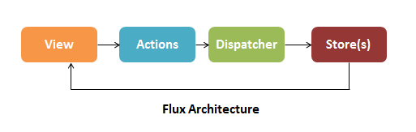
</p>

In the Flux architecture, when a user clicks on something, the view creates actions. Action can create new data and send it to the dispatcher. The dispatcher then dispatches the action result to the appropriate store. The store updates the state based on the result and sends an update to the view.

<div align="right">
    <b><a href="#table-of-contents">↥ back to top</a></b>
</div>

## Q. What are the drawbacks of Redux contrasted with Flux?

**Flux vs Redux:**

| Flux                                       | Redux                            |
|--------------------------------------------|----------------------------------|
|Follows the unidirectional flow             |Follows the unidirectional flow   |
|Includes multiple stores                    |Includes single store             |
|Store handles all logic                     |Reducer handles all logic         |
|Ensures simple debugging with the dispatcher|Single store makes debugging lot easier|

<div align="right">
    <b><a href="#table-of-contents">↥ back to top</a></b>
</div>

## Q. Describe Flux vs MVC?

**1. MVC:**

MVC stands for Model View Controller. It is an architectural pattern used for developing the user interface. It divides the application into three different logical components: the Model, the View, and the Controller.

<p align="center">
  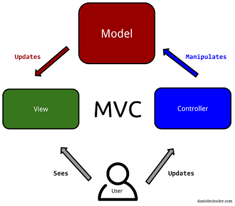
</p>

* **Model**: It is responsible for maintaining the behavior and data of an application.
* **View**: It is used to display the model in the user interface.
* **Controller**: It acts as an interface between the Model and the View components. It takes user input, manipulates the data(model) and causes the view to update.

MVC can be interpreted or modified in many ways to fit a particular framework or library. The core ideas of MVC can be formulated as:

* Separating the presentation from the model: enables implementation of different UIs and better testability
* Separating the controller from the view: most useful with web interfaces and not commonly used in most GUI frameworks

In general, MVC makes no assumptions about whether data flow within an application should be unidirectional or bidirectional. In server Side, MVC is good, but in Client side most of the JS frameworks provide data binding support which let the view can talk with model directly, It shoudn\'t be, Many times it become hard to debug something as there are scope for a property being changed by many ways.

**2. Flux:**

Flux places unidirectional data flow front and center, by making it a requirement. Here are the four major roles that make up the Flux architecture:

* Actions, which are helper methods that relay information to the dispatcher
* Stores are similar to the models in MVC, except they act as containers for application state and logic for a particular domain within the application
* The Dispatcher receives Actions and acts as the sole registry of callbacks to all stores within an application. It also manages the dependencies between stores
* Views are the same as the view in MVC, except in the context of React and Flux, and also include Controller-Views for change events and retrieve application state from stores as required.

<p align="center">
  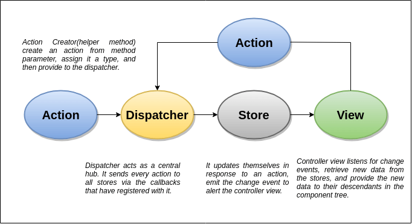
</p>

1. All data in the application flow through a central hub called the Dispatcher
2. This data is tracked as actions, which are provided to the dispatcher in an action creator method, often as a result of a user interacting with the view
3. The dispatcher invokes the registered callback, effectively dispatching the action to all stores that have registered with that callback
4. The stores in turn relay that change event to the controller-views to alert them of the change
5. The controller-views listen for events, retrieve data from the appropriate stores as required and re-render themselves and all their children in the component tree accordingly.

**MVC vs Flux:**

|  MVC                   |Flux                              |
|------------------------|----------------------------------|
|Bidirectional data flow |Unidirectional data flow          |
|Data binding is the key |Events or actions are the main players |
|Controllers handle the business logic | Store does all calculations |
|Somewhat synchronous    |Can be implemented as completely asynchronous |
|It is hard to debug.    |It is easy to debug because it has common initiating point: Dispatcher.|
|Its maintainability is difficult as the project scope goes huge. | Its maintainability is easy and reduces runtime errors.|

<div align="right">
    <b><a href="#table-of-contents">↥ back to top</a></b>
</div>

## Q. How to add multiple middleware to redux?

The most common use case for middleware is to support asynchronous actions without much boilerplate code or a dependency on a library like `RxJS`. It does so by letting you dispatch async actions in addition to normal actions.

With **Redux Toolkit** (recommended), use the `middleware` callback in `configureStore`:

```js
// Recommended (Redux Toolkit)
import { configureStore } from '@reduxjs/toolkit'

const store = configureStore({
  reducer: todos,
  middleware: (getDefaultMiddleware) =>
    getDefaultMiddleware().concat(logger)
})
```

Legacy approach using `applyMiddleware` (deprecated with `createStore`):

```js
// Legacy — createStore is deprecated
const createStoreWithMiddleware = applyMiddleware(ReduxThunk, logger)(createStore);
```

**Example: Custom Logger Middleware:**

```js
import { createStore, applyMiddleware } from 'redux' // ⚠️ createStore deprecated
import todos from './reducers'

function logger({ getState }) {
  return next => action => {
    console.log('will dispatch', action)

    // Call the next dispatch method in the middleware chain.
    const returnValue = next(action)

    console.log('state after dispatch', getState())

    // This will likely be the action itself, unless
    // a middleware further in chain changed it.
    return returnValue
  }
}

const store = createStore(todos, ['Use Redux'], applyMiddleware(logger))

store.dispatch({
  type: 'ADD_TODO',
  text: 'Understand the middleware'
})
// (These lines will be logged by the middleware:)
// will dispatch: { type: 'ADD_TODO', text: 'Understand the middleware' }
// state after dispatch: [ 'Use Redux', 'Understand the middleware' ]
```

<div align="right">
    <b><a href="#table-of-contents">↥ back to top</a></b>
</div>

## Q. How to set initial state in Redux?

**1. Initializing State:**

In Redux, all application state is held in the store; which is an object that holds the complete state tree of your app. There is only one way to change its state and that is by dispatching actions.

Actions are objects that consist of a type and a payload property. They are created and dispatched by special functions called action creators.

*Example: First creating the Redux store*

```js
import { createStore } from 'redux'

function todosReducer(state = [], action) {
  switch (action.type) {
    case 'ADD_TODO':
      return state.concat([action.payload])
    default:
      return state
  }
}

const store = createStore(todosReducer)
```

Next updating the store

```js
const ADD_TODO = add_todo; // creates the action type
const newTodo = ["blog on dev.to"];
function todoActionCreator (newTodo) {
  const action = {
    type: ADD_TODO,
    payload: newTodo
  }
  dispatch(action)
}
```

When a store is created, Redux dispatches a dummy action to your reducer to populate the store with the initial state.

**2. createStore Pattern (Legacy):**

> **Note:** `createStore` is **deprecated** since Redux 4.2.0. Use `configureStore` from `@reduxjs/toolkit` with `preloadedState` instead.

The `configureStore` / `createStore` method can accept an optional `preloadedState` value. When a value is passed to `preloadedState`, it becomes the initial state.

```js
// Legacy (createStore - deprecated)
const initialState = ["eat", "code", "sleep"];
const store = createStore(todosReducer, initialState)

// Recommended (Redux Toolkit)
import { configureStore } from '@reduxjs/toolkit';
const store = configureStore({
  reducer: todosReducer,
  preloadedState: ["eat", "code", "sleep"]
})
```

**3. Reducer Pattern:**

Reducers can also specify an initial state value by looking for an incoming state argument that is undefined, and returning the value they'd like to use as a default.

```js
function todosReducer(state = [], action) {
  switch (action.type) {
    case 'ADD_TODO':
      return state.concat([action.payload])
    default:
      return state
  }
}
/**
* sets initial state to []. But would only take effect if the initial state is undefined,
* which means it was not set using createStore().
**/
```

In general, `preloadedState` wins over the state specified by the `reducer`. This lets reducers specify initial data that makes sense to them as default arguments, but also allows loading existing data (fully or partially) when you\'re hydrating the store from some persistent storage or the server.

<div align="right">
    <b><a href="#table-of-contents">↥ back to top</a></b>
</div>

## Q. What is the purpose of the constants in Redux?

* It helps keep the naming consistent because all action types are gathered in a single place.
* Sometimes you want to see all existing actions before working on a new feature. It may be that the action you need was already added by somebody on the team, but you didn\'t know.
* The list of action types that were added, removed, and changed in a Pull Request helps everyone on the team keep track of scope and implementation of new features.
* If you make a typo when importing an action constant, you will get undefined. This is much easier to notice than a typo when you wonder why nothing happens when the action is dispatched.

**Example:** Constants in Redux can be used into two places, reducers and during actions creation.

```js
// actionTypes.js

export const ADD_TODO = 'ADD_TODO'
export const DELETE_TODO = 'DELETE_TODO'
export const EDIT_TODO = 'EDIT_TODO'
export const COMPLETE_TODO = 'COMPLETE_TODO'
export const COMPLETE_ALL = 'COMPLETE_ALL'
export const CLEAR_COMPLETED = 'CLEAR_COMPLETED'
```

And then require it in actions creator file

```js
// actions.js

import { ADD_TODO } from './actionTypes'

export function addTodo(text) {
  return { type: ADD_TODO, text }
}
```

And in some reducer

```js
import { ADD_TODO } from './actionTypes'

export default (state = [], action) => {
  switch (action.type) {
    case ADD_TODO:
      return [
        ...state,
        {
          text: action.text,
          completed: false
        }
      ]
    default:
      return state
  }
}
```

It allows to easily find all usages of that constant across the project. It also prevents from introducing silly bugs caused by typos -- in which case, you will get a `ReferenceError` immediately.

<div align="right">
    <b><a href="#table-of-contents">↥ back to top</a></b>
</div>

## Q. What is the difference between React context and React Redux?

**React Context:**

Context provides a way to pass data through the component tree without having to pass props down manually at every level.

In a typical React application, data is passed top-down (parent to child) via props, but this can be cumbersome for certain types of props (e.g. locale preference, UI theme) that are required by many components within an application. Context provides a way to share values like these between components without having to explicitly pass a prop through every level of the tree.

**Redux:**

Redux is a pattern and library for managing and updating application state, using events called "actions". It serves as a centralized store for state that needs to be used across your entire application, with rules ensuring that the state can only be updated in a predictable fashion.

Redux helps you manage "global" state - state that is needed across many parts of your application.

The patterns and tools provided by Redux make it easier to understand when, where, why, and how the state in your application is being updated, and how your application logic will behave when those changes occur.

**Redux vs Context API**

**1.) Implementation**

Context API is easy to is use as it has a short learning curve. It requires less code, and because there\'s no need of extra libraries, bundle sizes are reduced. Redux on the other hand requires adding more libraries to the application bundle. The syntax is complex and extensive creating unnecessary work and complexity. However, it\'s still a great alternative regarding prop drilling.

**2.) Rendering**

Context API prompts a re-render on each update of the state and re-renders all components regardless. Redux however, only re-renders the updated components. 

<div align="right">
    <b><a href="#table-of-contents">↥ back to top</a></b>
</div>

## Q. How to reset state in redux?

The root reducer would normally delegate handling the action to the reducer generated by `combineReducers()`. However, whenever it receives `USER_LOGOUT` action, it returns the initial state all over again.

```js
import { combineReducers } from 'redux';
import AppReducer from './AppReducer';

import UsersReducer from './UsersReducer';
import OrderReducer from './OrderReducer';
import NotificationReducer from './NotificationReducer';
import CommentReducer from './CommentReducer';

/**
 * In order to reset all reducers back to their initial states when user logout,
 * rewrite rootReducer to assign 'undefined' to state when logout
 *
 * If state passed to reducer is 'undefined', then the next state reducer returns
 * will be its initial state instead; since we have assigned it as the default value
 * of reducer's state parameter
 *   ex: const Reducer = (state = InitialState, action) => { ... }
 *
 * See: https://goo.gl/GSJ98M and combineReducers() source codes for details
 */

const appReducer = combineReducers({
  /* your app's top-level reducers */
  users: UsersReducer,
  orders: OrderReducer,
  notifications: NotificationReducer,
  comment: CommentReducer,
});

const rootReducer = (state, action) => {
  // when a logout action is dispatched it will reset redux state
  if (action.type === 'USER_LOGGED_OUT') {
    state = undefined;
  }

  return appReducer(state, action);
}

export default rootReducer
```

<div align="right">
    <b><a href="#table-of-contents">↥ back to top</a></b>
</div>

## Q. Why are Redux state functions called as reducers?

Redux state functions called a reducer because it\'s the type of function we pass to `Array.prototype.reduce(reducer, ?initialValue)`. Reducers do not just return default values. They always return the accumulation of the state (based on all previous and current actions).

Therefore, they act as a reducer of state. Each time a redux reducer is called, the state is passed in with the action `(state, action)`. This state is then reduced (or accumulated) based on the action, and then the next state is returned. This is one cycle of the classic `fold` or `reduce` function.

<div align="right">
    <b><a href="#table-of-contents">↥ back to top</a></b>
</div>

## Q. What is Relay?

Relay is a JavaScript framework for fetching and managing GraphQL data in React applications that emphasizes maintainability, type safety and runtime performance.

Relay achieves this by combining declarative data fetching and a static build step. With declarative data fetching, components declare what data they need, and Relay figures out how to efficiently fetch it. During the static build step, Relay validates and optimizes queries, and pre-computes artifacts to achieve faster runtime performance.

**Reference:**

* *[https://relay.dev/docs/](https://relay.dev/docs/)*

<div align="right">
    <b><a href="#table-of-contents">↥ back to top</a></b>
</div>

## Q. How Relay is different from Redux?

**Redux**

Predictable state container for JavaScript apps. Redux helps you write applications that behave consistently, run in different environments (client, server, and native). In redux the application state is located in a single store, each component can access the state, and can also change the state by dispatching actions. Redux doesn\'t handle data fetching out of the box, though it can be done manually: simply create an action that fetches the data from the server into the store.

Some of the features offered by Redux are:

* Predictable state
* Easy testing
* Works with other view layers besides React

**Relay**

Created by facebook for react, and also used internally there. Relay is similar to redux in that they both use a single store. The main difference is that relay only manages state originated from the server, and all access to the state is used via GraphQL querys (for reading data) and mutations (for changing data). Relay caches the data for you and optimizes data fetching for you, by fetching only changed data and nothing more. Relay also supports optimistic updates, i.e. changing the state before the server\'s result arrives.

Relay provides the following key features:

* Build data driven apps
* Declarative style
* Mutate data on the client and server

**GraphQL** is a web service framework and protocol using declarative and composable queries, and solves problem like over fetching and under fetching, it is believed to be a valid candidate to replace REST.

<div align="right">
    <b><a href="#table-of-contents">↥ back to top</a></b>
</div>

## Q. When would bindActionCreators be used in react/redux?

**`bindActionCreators(actionCreators, dispatch)`**: Turns an object whose values are action creators, into an object with the same keys, but with every action creator wrapped into a dispatch call so they may be invoked directly.

When we use Redux with React, react-redux will provide `dispatch()` function and we can call it directly. The only use case for `bindActionCreators()` is when we want to pass some action creators down to a component that isn\'t aware of Redux, and we don\'t want to pass `dispatch` or the Redux store to it.

**Parameters**

1. `actionCreators` (Function or Object): An action creator, or an object whose values are action creators.
2. `dispatch` (Function): A dispatch function available on the Store instance.

**Returns**

(Function or Object): An object mimicking the original object, but with each function immediately dispatching the action returned by the corresponding action creator. If you passed a function as actionCreators, the return value will also be a single function.

**Example:**

```js
// TodoActionCreators.js

export function addTodo(text) {
  return {
    type: 'ADD_TODO',
    text
  }
}

export function removeTodo(id) {
  return {
    type: 'REMOVE_TODO',
    id
  }
}
```

```js
// TodoListContainer.js

import { Component } from 'react'
import { bindActionCreators } from 'redux'
import { connect } from 'react-redux'

import * as TodoActionCreators from './TodoActionCreators'

console.log(TodoActionCreators)
// {
//   addTodo: Function,
//   removeTodo: Function
// }

class TodoListContainer extends Component {
  constructor(props) {
    super(props)

    const { dispatch } = props

    // Here's a good use case for bindActionCreators:
    // You want a child component to be completely unaware of Redux.
    // We create bound versions of these functions now so we can
    // pass them down to our child later.

    this.boundActionCreators = bindActionCreators(TodoActionCreators, dispatch)
    console.log(this.boundActionCreators)
    // {
    //   addTodo: Function,
    //   removeTodo: Function
    // }
  }

  componentDidMount() {
    // Injected by react-redux:
    let { dispatch } = this.props

    // Note: this won't work:
    // TodoActionCreators.addTodo('Use Redux')

    // You're just calling a function that creates an action.
    // You must dispatch the action, too!

    // This will work:
    let action = TodoActionCreators.addTodo('Use Redux')
    dispatch(action)
  }

  render() {
    // Injected by react-redux:
    let { todos } = this.props

    return <TodoList todos={todos} {...this.boundActionCreators} />

    // An alternative to bindActionCreators is to pass
    // just the dispatch function down, but then your child component
    // needs to import action creators and know about them.

    // return <TodoList todos={todos} dispatch={dispatch} />
  }
}

export default connect(state => ({ todos: state.todos }))(TodoListContainer)
```

<div align="right">
    <b><a href="#table-of-contents">↥ back to top</a></b>
</div>

## Q. What is mapStateToProps and mapDispatchToProps?

`react-redux`package provides 3 functions `Connect`, `mapStapteToProps` and `mapDispatchToProps`. Connect is a higher order function that takes in both mapStateToProps and mapDispatchToProps as parameters.

**1. Using MapStateToProps**

In React, `MapStatetoProps` pulls in the state of a specific reducer state object from global store and maps it to the props of component. MapStateToProps is called everytime your store is updated. You pass in your state a retrieve that specific objects from the reducer.

**2. Using MapDisptachToProps**

`MapDispatchToProp` takes the dispatch functions in component and executes them against the Redux Reducer when that function is fired. MapDispatchToProps allows to dispatch state changes to your store.

In a simple term,

**mapStateToProps**: It connects redux state to props of react component.  
**mapDispatchToProps**: It connects redux actions to react props.

**Example:**

```js
const {createStore} = Redux
const {connect, Provider} = ReactRedux
const InitialState = {Collection: ["COW", "COW", "DUCK", "DUCK"]}

function reducer(state=InitialState, action) {
    if (action.type === "REVERSE") {
      return Object.assign({}, state, {
         Collection: state.Collection.slice().reverse()
      })
    }
    return state
}

var store = createStore(reducer)

function mapStateToProps(state) {
  return state
}

var PresentationalComponent = React.createClass({
    render: function() {
        return (
          <div>
            <h2>Store State ( as Props) </h2>
            <pre> {JSON.stringify(this.props.Collection)}</pre>
            <StateChangerUI />
          </div>
          )
    }
})

// State changer UI
var StateChangerUI = React.createClass({
 // Action Dispatch  
  handleClick: function() {
     store.dispatch({
         type: 'REVERSE'
      })
  },
  render: function() {
    return (
      <button type="button" className="btn btn-success" onClick={this.handleClick}>REVERSE</button>
    )
  }
})

PresentationalComponent = connect(mapStateToProps)(PresentationalComponent)

ReactDOM.render(
    <Provider store={store}>
        <PresentationalComponent />
    </Provider>,
    document.getElementById('App')
)
```

<div align="right">
    <b><a href="#table-of-contents">↥ back to top</a></b>
</div>

## Q. What are the different ways to write mapDispatchToProps()?

**mapDispatchToProps** is the second argument that connect expects to receive. In the context of a react-redux application, the `mapDispatchToProps` argument is responsible for enabling a component to dispatch actions. 

In practical terms, `mapDispatchToProps` is where react events (and lifecycle events) are mapped to redux actions. There are a few ways of binding action creators to `dispatch()` in `mapDispatchToProps()`.

```js
const mapDispatchToProps = (dispatch) => ({
 action: () => dispatch(action())
})

// shorthand way
const mapDispatchToProps = { action }
```

```js
const mapDispatchToProps = (dispatch) => ({
 action: bindActionCreators(action, dispatch)
})
```

<div align="right">
    <b><a href="#table-of-contents">↥ back to top</a></b>
</div>

## Q. What is the use of the ownProps parameter in mapStateToProps() and mapDispatchToProps()?

**mapStateToProps:**

```js
function mapStateToProps(state, ownProps?)
```

It should take a first argument called `state`, optionally a second argument called `ownProps`, and return a plain object containing the data that the connected component needs.

This function should be passed as the first argument to connect, and will be called every time when the Redux store state changes. If you do not wish to subscribe to the store, pass `null` or `undefined` to connect in place of `mapStateToProps`.

**Arguments**

* state
* ownProps (optional)

**State:**

The first argument to a `mapStateToProps` function is the entire Redux store state.

**Example:**

```js
// Employee.js

function mapStateToProps(state) {
  const { emp } = state
  return { empList: emp.allIds }
}

export default connect(mapStateToProps)(EmpList)
```

**ownProps (optional):**

If your component needs the data from its own props to retrieve data from the store. This argument will contain all of the props given to the wrapper component that was generated by connect.

**Example:**

```js
// Employee.js

function mapStateToProps(state, ownProps) {
  const { visibilityFilter } = state
  // ownProps would look like { "id" : 100 }
  const { id } = ownProps
  const emp = getEmployeeById(state, id)

  // component receives additionally:
  return { emp, visibilityFilter }
}

// Later, in your application, a parent component renders:
;<ConnectedEmployee id={100} />
// and your component receives props.id, props.emp, and props.visibilityFilter
```

<div align="right">
    <b><a href="#table-of-contents">↥ back to top</a></b>
</div>

## Q. What is reselect and how it works?

**`Reselect`** is a simple library for creating memoized, composable **selector** functions. Reselect selectors can be used to efficiently compute derived data from the Redux store.

Selectors can compute derived data, allowing Redux to store the minimal possible state. Which can be considered as keep the store as minimal as possible. A selector is not recomputed unless one of its arguments change. A memoized selector that recalculates only when that part of the start tree changes which are input arguments to the selector. The value of selector doesn\'t change when there is no change in other (unrelated) parts of the state tree.

**selectors**

In our context, selectors are nothing but functions which can compute or retrive data from the store. We usually fetch the state data using `mapStateToProps()` function like this.

```js
const mapStateToProps = (state) => {
  return {
    activeData: getActiveData(state.someData, state.isActive)
  }
}
```

Where `getActiveData()` will be a function which returns all the records from `someData` having the status as `isActive`. The drawback with this function is, whenever any part of the state state updates, this function will recalculate this data.

When we use `Reselect` it caches the input arguments to the memoized function. So only when the arguments of the function changes from the previous call, the selector recalculates.

**Example:**

```js
// todo.reducer.js
// ...
import { createSelector } from 'reselect';

const todoSelector = state => state.todo.todos;
const searchTermSelector = state => state.todo.searchTerm;

export const filteredTodos = createSelector(
  [todoSelector, searchTermSelector],
  (todos, searchTerm) => {
    return todos.filter(todo => todo.title.match(new RegExp(searchTerm, 'i')));
  }
);

// ...
```

We can use the `filteredTodos` selectors to get all the todos if there\'s no searchTerm set in the state, or a filtered list otherwise.

<div align="right">
    <b><a href="#table-of-contents">↥ back to top</a></b>
</div>

## Q. What are the different ways to dispatch actions in Redux?

**Redux** is a state container for Javascript apps, mostly used with React. It\'s based on actions that are dispatched and listened by reducers which modify the state properly.

**1. Passing dispatch method to component**

The dispatch method is a method of the store object. An action is dispatched to trigger an update to the store.

```js
// App.js
import { createStore } from 'redux';
import { MessageSender } from './MessageSender';
import reducer from './reducer';

const store = createStore(reducer);
class App extends React.Component {
 render() {
 <MessageSender store={store} />
 };
};
```

```js
// MessageSender.js
import { sendMsg } from './actions';
// ...
this.props.store.dispatch(sendMsg(msg))
// ...
```

**2. Using React-Redux to make dumb/smart components**

The downside of the above approach is that our React component is aware of the app logic. It\'s best to separate the logic in our smart component connected to the store from the user interface, i.e., from the dumb component.

From the official docs for `connect()`, we can describe `mapDispatchToProps()` this way: If an object is passed, each function inside it is assumed to be a Redux action creator. An object with the same function names, but with every action creator wrapped into a dispatch call so they may be invoked directly, will be merged into the component\'s props.

```js
// MessageSender.container.js

import { connect } from 'react-redux';
import { sendMsg } from './actions';
import MessageSender from './MessageSender';

const mapDispatchToProps = {
 sendMsg
};

export default connect(null, mapDispatchToProps)(MessageSender);

// MessageSender.js
// ...
this.props.sendMsg(msg);
// ...
```

**3. Using the bindActionCreators() method**

The `bindActionCreators()` method allows us to dispatch actions from any React component that is not connected to the store as `mapDispatchToPros()` in the connect function of react-redux.

```js
// MsgSenderPage.js

import { bindActionCreators } from 'redux';
import { connect } from 'react-redux';
import * as actions from './actions';

class MsgSenderPage extends React.Component {
 constructor(props) {
 super(props);
 const { dispatch } = props;
 this.boundedActions = bindActionCreators(actions, dispatch);
 }

 render() {
 return <MsgSending {...this.boundedActions} />;
 }
}

export default connect()(MsgSenderPage);
```

<div align="right">
    <b><a href="#table-of-contents">↥ back to top</a></b>
</div>

## Q. What are Redux selectors and Why to use them?

A **selector** is simply a function that accepts Redux state as an argument and returns data that is derived from that state.

Selectors help to keep your Redux store state minimal and derive data from the state as needed. They can compute derived data, allowing Redux to store the minimal possible state. Selectors are also very efficient. A selector is not recomputed unless one of its arguments changes.

**Example:** 

```js
// Arrow function, direct lookup
const selectEntities = state => state.entities

// Function declaration, mapping over an array to derive values
function selectItemIds(state) {
  return state.items.map(item => item.id)
}
```

<div align="right">
    <b><a href="#table-of-contents">↥ back to top</a></b>
</div>

## Q. What is reselect and how it works?

**Reselect** is a selector library (for Redux) for building memoized selectors. Using memoization, we can prevent unnecessary rerenders and recalculations of derived data which in turn will speed up our application.

Reselect keeps a copy of the last inputs/outputs of the last call, and recomputes the result only if one of the inputs changes. If the the same inputs are provided twice in a row, Reselect returns the cached output. It\'s memoization and cache are fully customizable.

**Example:** Let\'s look at a simple selector using Reselect

```js
import { createselectetor } from 'reselect'

export const getItems = (state) => state.cart.get('items');

export const getItemsWithTotals = createSelector(
  [getItems],
  (items) => {
    return items.map(i => {
      return i.set('total', i.get('price', 0) * i.get('quantity'));
    });
  }
);
```

<div align="right">
    <b><a href="#table-of-contents">↥ back to top</a></b>
</div>

## Q. Can I dispatch an action in reducer?

Dispatching an action within a reducer is an **anti-pattern**. Your reducer should be without side effects, simply digesting the action payload and returning a new state object. Adding listeners and dispatching actions within the reducer can lead to chained actions and other side effects.

<div align="right">
    <b><a href="#table-of-contents">↥ back to top</a></b>
</div>

## Q. What is Redux DevTools?

Redux-Devtools provide us debugging platform for Redux apps. It allows us to perform time-travel debugging and live editing with hot reloading, action replay, and customizable UI.

Some of the features in official documentation are as follows −

* It allows you inspect every state and action payload.
* It allows you go back in time by "cancelling" actions.
* If you change the reducer code, each "staged" action will be re-evaluated.
* If the reducers throw, we can identify the error and also during which action this happened.
* With `persistState()` store enhancer, you can persist debug sessions across page reloads.

<p align="center">
  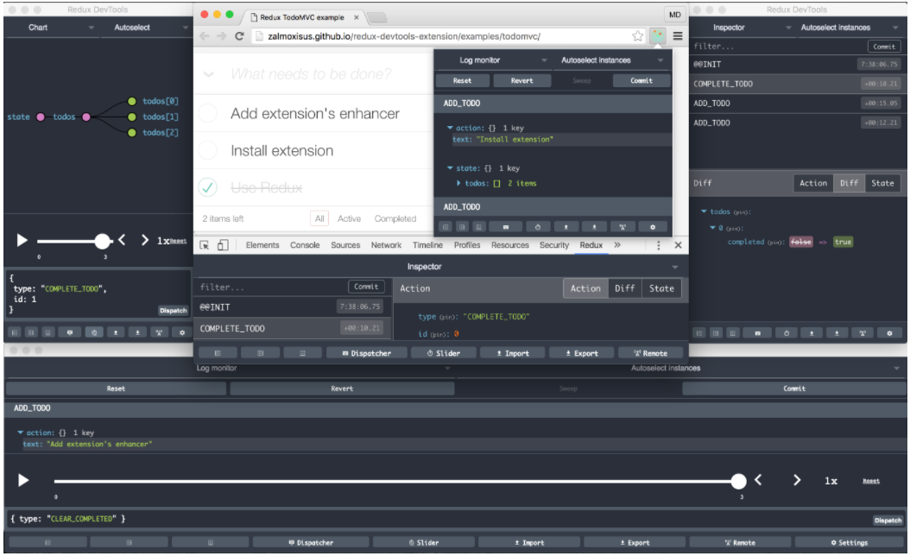
</p>

**Reference:**

* *[https://github.com/reduxjs/redux-devtools](https://github.com/reduxjs/redux-devtools)*

## Q. How to set conditional action on state in React-redux

Actions are plain objects that send data or payloads of information from your component to the global store object. 

Consider that the authentication is already in progress, in which case you do not want to dispatch the `AUTHENTICATE` action. So here, you need to connect the component to the global store and retrieve the authentication status. You can do that by passing the `mapStateToProps` argument to the `connect()` method. The condition will ensure that the `AUTHENTICATE` action is dispatched only when the `isAuthentication` state is set to `false`.

```js
import React from "react";
import { connect } from "react-redux";

class LoginPage extends React.Component {
  constructor(props) {
    super(props);

    this.handleFormSubmit = this.handleFormSubmit.bind(this);
  }

  handleFormSubmit(values) {
    if (!this.props.isAuthenticating)
      this.props.dispatch({
        type: AUTHENTICATE,
        payload: values,
      });
  }

  render() {
    return (
      <div>
        <LoginForm onSubmit={this.handleFormSubmit} />
      </div>
    );
  }
}

const mapStateToProps = (globalState) => {
  const { isAuthenticating } = globalState;
  return { isAuthenticating };
};

export default connect(mapStateToProps)(LoginPage);
```

<div align="right">
    <b><a href="#table-of-contents">↥ back to top</a></b>
</div>
